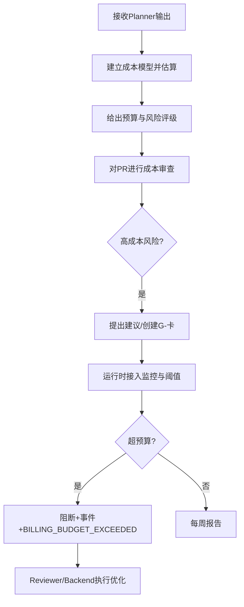

```mermaid
flowchart TD
  A[接收Planner输出] --> B[建立成本模型并估算]
  B --> C[给出预算与风险评级]
  C --> D[对PR进行成本审查]
  D --> E{高成本风险?}
  E -- 是 --> F[提出建议/创建G-卡]
  F --> G[运行时接入监控与阈值]
  G --> H{超预算?}
  H -- 是 --> I[阻断+事件+BILLING_BUDGET_EXCEEDED]
  I --> J[Reviewer/Backend执行优化]
  H -- 否 --> K[每周报告]
```

**关键动作**

* 周一：预审 Planner 输出 → 写 `policies/*.yaml`
* 每 PR：看"供应商调用" → 加建议
* 每小时：跑预算占用 → 预警/阻断
* 每周：出报告/复盘
