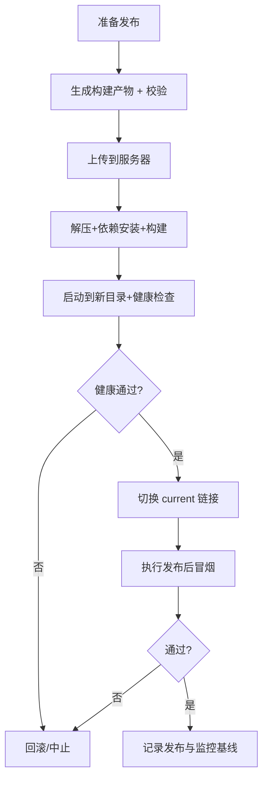

```mermaid
flowchart TD
  A[准备发布] --> B[生成构建产物 + 校验]
  B --> C[上传到服务器]
  C --> D[解压+依赖安装+构建]
  D --> E[启动到新目录+健康检查]
  E --> F{健康通过?}
  F -- 否 --> R[回滚/中止]
  F -- 是 --> G[切换 current 链接]
  G --> H[执行发布后冒烟]
  H --> I{通过?}
  I -- 否 --> R
  I -- 是 --> J[记录发布与监控基线]
```

**要点**

* 产物包含 commit 与 checksum；
* 发布日志包含执行耗时与各步骤结果；
* 监控：CPU/Mem、QPS、P95、错误率、磁盘占用；
* 报警：健康检查失败、错误率激增、磁盘>80%。
