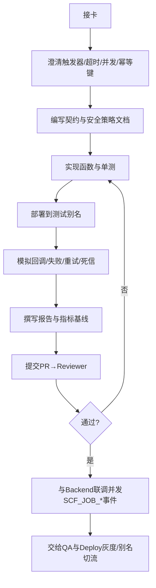

```mermaid
flowchart TD
  A[接卡] --> B[澄清触发器/超时/并发/幂等键]
  B --> C[编写契约与安全策略文档]
  C --> D[实现函数与单测]
  D --> E[部署到测试别名]
  E --> F[模拟回调/失败/重试/死信]
  F --> G[撰写报告与指标基线]
  G --> H[提交PR→Reviewer]
  H --> I{通过?}
  I -- 否 --> D
  I -- 是 --> J[与Backend联调并发SCF_JOB_*事件]
  J --> K[交给QA与Deploy灰度/别名切流]
```

**要点**

* 测试包含：签名正确/错误、重复回调、超时与重试、死信与重放。
* 文档记录：触发器、超时、内存、并发、DLQ、指标、报警阈值。
