# 服装AI处理 SaaS 平台 - MVP 核心业务验证设计

# 服装AI处理 SaaS 平台 - MVP 核心业务验证设计

## 1. 概述

### 1.1 核心目标

构建一个最小可行产品，使用户能够：
1. **注册并购买单月会员** → 获得本月可用生成次数（配置值 `PLAN_MONTHLY_QUOTA`，当前设为100次）
2. **上传服装图片** → 选择处理模式生成成果图
   - 模式1：**服装基础修图**（去皱/清理）- 基于腾讯数据万象**同步处理**，调用即返成品图
   - 模式2：**AI模特上身/多分镜** - 基于 RunningHub **异步工作流**生成12张展示图
3. **查看生成结果、下载** → 系统正确扣减/返还月度次数配额

**MVP 核心验证点**：
- 同步任务（basic_clean）和异步任务（model_pose12）两种模式都必须串通完整的配额扣减逻辑
- 配额值不是硬编码常量，而是环境变量或配置表字段，便于后续调价
- 两种任务模式在创建时都扣1次，成功保留，失败返还

### 1.2 项目类型识别

**全栈 SaaS 应用**
- 前端：用户工作台（会员管理 + 任务提交 + 结果展示）
- 后端：账号体系 + 支付集成 + 配额管理 + 第三方服务编排
- 外部依赖：腾讯云 COS、腾讯数据万象、RunningHub AI 服务、支付渠道

### 1.3 MVP 范围边界

**必须交付**：
- 登录/注册页、会员购买页、工作台首页、任务详情页
- 账号/登录态、会员购买、配额计数、任务管理、STS 发放
- 腾讯数据万象集成（同步）、RunningHub 集成（异步）
- 简易管理后台（查看用户状态/任务记录）

**明确排除**：
- 营销首页、案例画廊、用户评价展示
- 自动续费、订阅管理、发票系统
- 复杂价格梯度、多档位会员
- 高级报表、收入统计、退款管理
- 八张功能卡（仅实现两张核心功能）

---

## 2. 系统架构

### 2.1 整体架构视图

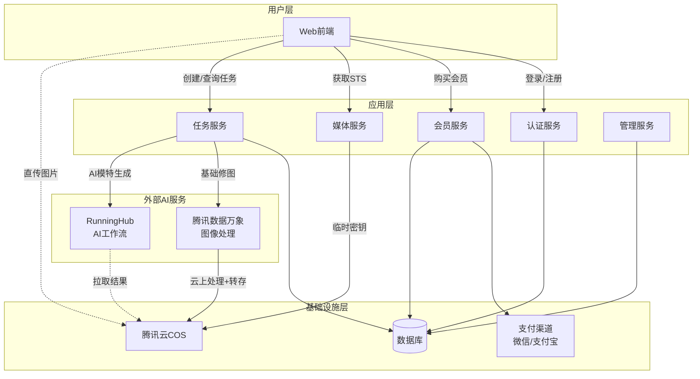

### 2.2 核心数据流

#### 2.2.1 会员购买流程

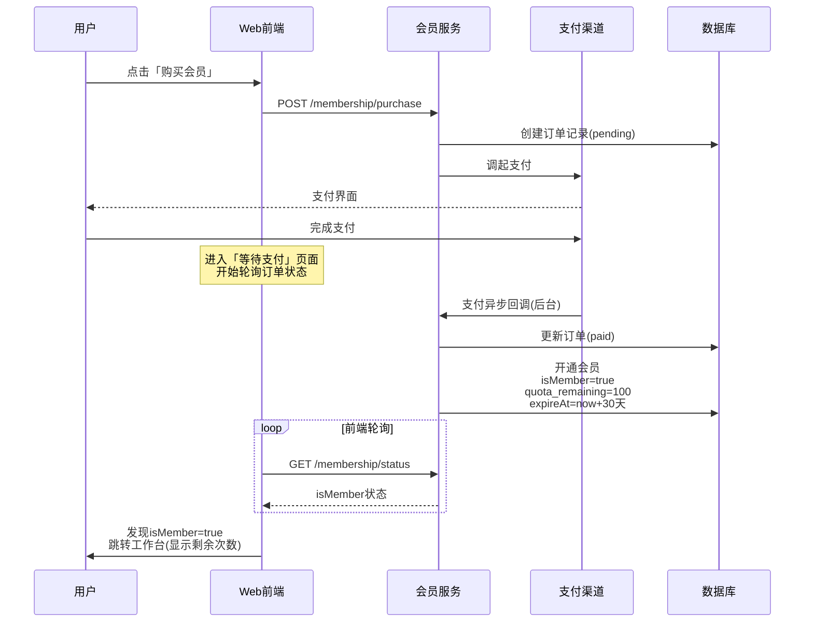

**支付渠道范围约束**（MVP 阶段）：
- 微信支付和支付宝**选其一**先跑通即可，不要求第一版同时支持两种渠道
- 优先推荐：微信支付（考虑用户画像）
- 前端不能假设即时收到支付成功推送，必须通过轮询 `/membership/status` 或 `/order/:id` 来确认支付结果

#### 2.2.2 基础修图任务流程（同步）

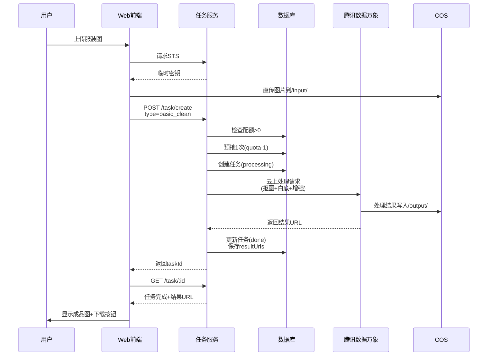

#### 2.2.3 AI模特生成任务流程（异步）

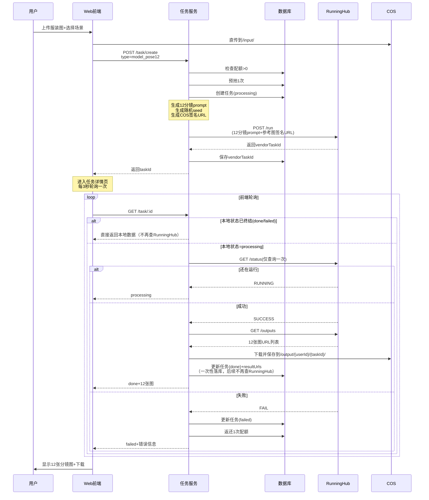

**关键约束**：
- `GET /task/:id` **不能无限次打 RunningHub**
- 一旦拿到 SUCCESS/FAIL，必须在本地落库为 done/failed，并停止外部查询
- 后续所有 `GET /task/:id` 请求直接返回本地数据，不再触发第三方调用
- 对 RunningHub 传参考图时，**统一使用 COS 签名 URL 方式**，不使用 RunningHub upload 通道（除非图片超过30MB无法外链）

---

## 3. 前端架构

### 3.1 页面结构

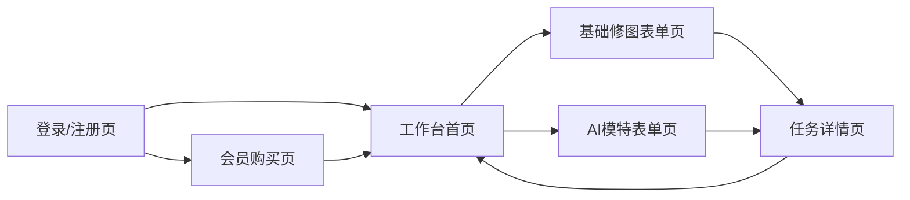

### 3.2 核心页面设计

#### 3.2.1 登录/注册页

**功能目标**：
- 支持手机号 + 验证码登录（MVP 最简方案）
- 登录成功后跳转工作台

**页面元素**：
- 手机号输入框
- 验证码输入框 + 「发送验证码」按钮（60秒倒计时）
- 「登录/注册」主按钮
- 隐私政策/用户协议勾选框

**交互逻辑**：
- 点击发送验证码 → 调用 `POST /auth/send-code`
- 点击登录 → 调用 `POST /auth/login` → 获得 token → 存储并跳转

**防刷限制**（必须实现）：
- 同一手机号 1分钟内最多5次验证码请求
- 同一IP 1小时内最多20次验证码请求
- 超限后返回错误：「验证码发送过于频繁，请稍后再试」
- （可选）如后期发现被刷，增加图形验证码

#### 3.2.2 会员购买页

**功能目标**：
- 单一价位会员购买入口
- 拉起支付完成会员开通

**页面元素**：
- 会员权益说明卡片
  - 标题：「开通会员 = 获得本月100次生成额度」
  - 说明：「每次=一组可商用图；失败不扣次数」
  - 到期逻辑：「到期后失效，可再次购买」
- 价格展示（单一价格，例如 ¥99/月）
- 「立即购买」按钮
- 支付方式选择（微信/支付宝）

**交互逻辑**：
- 点击购买 → `POST /membership/purchase` → 获得支付参数
- 拉起支付 SDK → 等待支付回调
- 支付成功 → 跳转工作台并刷新会员状态

#### 3.2.3 工作台首页

**功能目标**：
- 展示会员状态和剩余次数
- 提供两个核心功能入口
- 列出最近任务历史

**布局结构**：

| 区域 | 内容 |
|------|------|
| 顶部会员卡片 | 本月剩余次数：92/100<br/>到期日期：2025-11-28<br/>「续会员」按钮 |
| 功能卡区域 | 两张功能卡并排展示 |
| 最近任务列表 | 最近10条任务记录 |

**功能卡 1 - 服装清理增强**：
- 标题：「服装清理增强 / 主图优化」
- 副标题：「自动抠背景、提亮、去乱背景，商用图可直接上架」
- 按钮：「开始生成」
- 权限检查：
  - 如果 `isMember = false` 或 `quota_remaining = 0`
  - 点击功能卡 → 直接跳转 `/purchase?from=basic_clean`
  - （MVP 不做弹窗，直接跳转页面）

**功能卡 2 - AI模特上身**：
- 标题：「AI模特上身 · 12分镜」
- 副标题：「同一场景下生成12机位模特展示照，支持鞋/连衣裙/外套」
- 按钮：「开始生成」
- 权限检查：
  - 如果 `isMember = false` 或 `quota_remaining = 0`
  - 点击功能卡 → 直接跳转 `/purchase?from=model_pose12`
  - （MVP 不做弹窗，直接跳转页面）

**最近任务列表**：

| 列 | 内容 |
|---|------|
| 缩略图 | 第一张结果图（或占位图）|
| 任务类型 | 清理增强 / 模特12分镜 |
| 状态 | 完成 / 处理中 / 失败 |
| 创建时间 | 2025-10-28 14:22 |
| 操作 | 点击查看详情 |

#### 3.2.4 功能表单页

**基础修图表单**：
- 上传区域
  - 拖拽上传或点击选择
  - 支持 JPG/PNG，限制 10MB
  - 上传前获取 STS，直传 COS
- 模板参数选择
  - 「白底主图」
  - 「通勤挂拍」
  - 「直播展示干净背景」
- 「生成」按钮

**AI模特表单**：
- 上传区域（同上）
- 场景风格选择
  - 街拍 / 白棚 / 室内暖光
- 商品品类选择
  - 鞋 / 连衣裙 / 卫衣 / 外套
- 「生成」按钮

**交互逻辑**：
1. 用户选择图片 → 前端调 `GET /media/sts` 获取临时密钥
2. 前端直传 COS → `/input/{userId}/{taskId}/original.jpg`
3. 用户选择参数 → 点击生成
4. 前端调 `POST /task/create` 传递：
   - type（basic_clean / model_pose12）
   - inputImageUrl
   - params（场景/品类选项）
5. 获得 taskId → 跳转任务详情页

#### 3.2.5 任务详情页

**页面结构**：

| 区域 | 内容 |
|------|------|
| 头部 | 任务名称（如"AI模特上身 - 2025/10/28 14:22"）|
| 进度条 | 素材准备 → 生成中 → 完成 |
| 输出区域 | 结果图展示（基础修图1张 / 模特12分镜12张）|
| 操作区 | 下载按钮 |
| 错误信息 | 失败原因 + 「重试」按钮（如果失败）|

**轮询逻辑**（model_pose12 任务）：
- 每 3 秒调用 `GET /task/:id`
- 状态变化：processing → done / failed
- 完成后停止轮询，显示结果图网格

**结果展示**：
- 基础修图：单张大图展示 + 「下载」按钮
- AI模甤12分镜：3x4 网格布局 + 每张缩略图可点击放大 + 逐张下载按钮

**MVP 范围约束**：
- 首版仅支持**逐张下载**
- 「打包下载所有结果图」为**后续增强项**，不在 MVP 验收范围内
- （原因：需要 zip 生成、COS 写回、前端一键下载压缩包，增加额外工程量）

---

## 4. 后端架构

### 4.1 服务模块划分

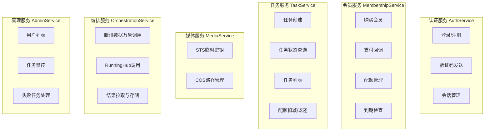

### 4.2 核心接口设计

#### 4.2.1 认证服务接口

**POST /auth/send-code**

请求参数：

| 参数 | 类型 | 说明 |
|------|------|------|
| phone | string | 手机号 |

响应：

| 字段 | 类型 | 说明 |
|------|------|------|
| success | boolean | 是否成功发送 |
| expireIn | number | 验证码有效期（秒）|

---

**POST /auth/login**

请求参数：

| 参数 | 类型 | 说明 |
|------|------|------|
| phone | string | 手机号 |
| code | string | 验证码 |

响应：

| 字段 | 类型 | 说明 |
|------|------|------|
| token | string | 登录凭证 |
| user | object | 用户基本信息 |
| user.id | string | 用户ID |
| user.phone | string | 手机号 |
| user.isMember | boolean | 是否会员 |

---

**GET /auth/me**

请求头：`Authorization: Bearer {token}`

响应：

| 字段 | 类型 | 说明 |
|------|------|------|
| id | string | 用户ID |
| phone | string | 手机号 |
| isMember | boolean | 是否会员中 |
| quota_remaining | number | 剩余次数 |
| quota_expireAt | string | 到期时间（ISO8601）|

#### 4.2.2 会员服务接口

**POST /membership/purchase**

请求参数：

| 参数 | 类型 | 说明 |
|------|------|------|
| channel | string | 支付渠道（wx/alipay）|

响应：

| 字段 | 类型 | 说明 |
|------|------|------|
| orderId | string | 订单ID |
| payParams | object | 支付参数（渠道特定）|

业务逻辑：
1. 创建订单记录（status=pending）
2. 调用支付渠道获取支付参数
3. 返回支付参数给前端

---

**POST /membership/payment-callback**

支付渠道回调接口（内部）

处理逻辑：
1. 验证签名（防篡改）
2. 查询订单记录
3. 如果订单已处理，直接返回成功（幂等性）
4. 更新订单状态为 paid
5. 开通会员：
   - `isMember = true`
   - `quota_remaining = 100`（基础额度）
   - `quota_expireAt = now + 30天`
6. 记录支付时间

---

**GET /membership/status**

响应：

| 字段 | 类型 | 说明 |
|------|------|------|
| isMember | boolean | 是否会员中 |
| quota_remaining | number | 剩余次数 |
| quota_expireAt | string | 到期时间 |
| expireDays | number | 距离到期天数 |

**到期检查逻辑**（关键约束）：

在 `/membership/status` 返回时，如果发现当前时间 > `quota_expireAt`，则后端会：

1. **返回前端**：`isMember=false` & `quota_remaining=0`
2. **触发一次性降级写库**（如果还没降级过）：
   - 设置 `isMember = false`
   - 设置 `quota_remaining = 0`
   - 记录降级时间
3. **幂等性保证**：该降级操作幂等，多次调用不会重复乱写

**注意事项**：
- 不要在每次 `GET /membership/status` 调用时不停改库，应由一次性检查触发写入
- 将来支持“提前续费叠加周期”或“买多月”时，该逻辑可扩展为独立 subscription 表

#### 4.2.3 媒体服务接口

**GET /media/sts**

请求参数：

| 参数 | 类型 | 说明 |
|------|------|------|
| taskId | string | 任务ID（用于限定路径）|

响应：

| 字段 | 类型 | 说明 |
|------|------|------|
| credentials | object | 临时密钥对象 |
| credentials.tmpSecretId | string | 临时密钥ID |
| credentials.tmpSecretKey | string | 临时密钥Key |
| credentials.sessionToken | string | 会话令牌 |
| expiredTime | number | 过期时间戳 |
| bucket | string | 存储桶名称 |
| region | string | 地域 |
| allowPrefix | string | 允许写入路径前缀 |

权限策略：
- 允许操作：`PutObject`
- 允许路径：`/input/{userId}/{taskId}/*`
- 有效期：15分钟

#### 4.2.4 任务服务接口

**POST /task/create**

请求参数：

| 参数 | 类型 | 说明 |
|------|------|------|
| type | string | 任务类型（basic_clean / model_pose12）|
| inputImageUrl | string | 输入图片COS路径 |
| params | object | 参数对象（场景/品类选项）|

响应：

| 字段 | 类型 | 说明 |
|------|------|------|
| taskId | string | 任务ID |
| status | string | 初始状态（processing）|

业务逻辑流程：

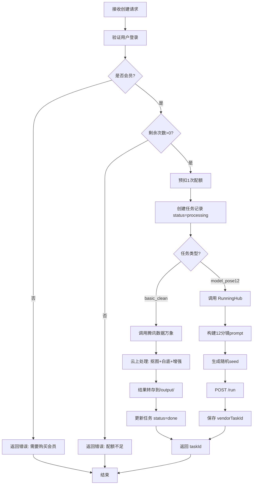

---

**GET /task/:taskId**

响应：

| 字段 | 类型 | 说明 |
|------|------|------|
| id | string | 任务ID |
| type | string | 任务类型 |
| status | string | 当前状态（processing/done/failed）|
| resultUrls | array | 结果图URL列表 |
| errorReason | string | 失败原因（如果失败）|
| createdAt | string | 创建时间 |
| updatedAt | string | 更新时间 |

**内部逻辑（关键约束）**：

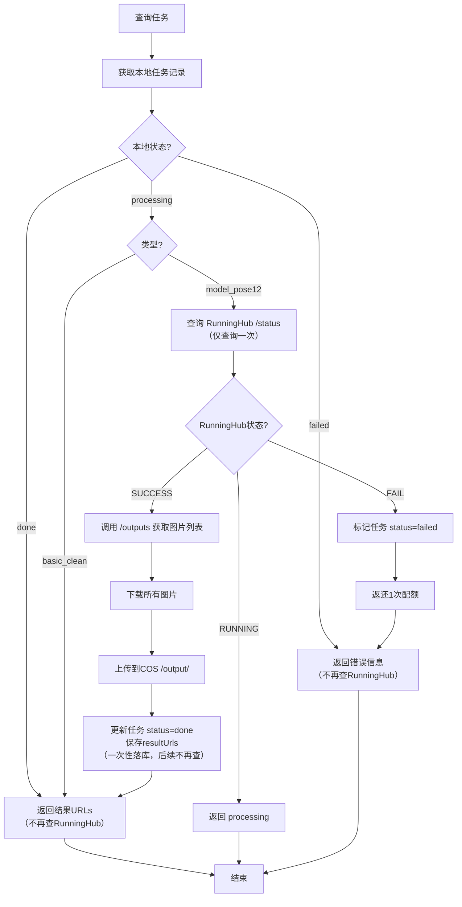

**关键约束（必须遵守）**：
1. **不能无限次打 RunningHub**：仅当本地状态为 `processing` 且类型为 `model_pose12` 时才查询外部服务
2. **一次性落库**：一旦拿到 SUCCESS/FAIL，必须在本地落库为 done/failed
3. **停止外部查询**：任务状态终结后，后续所有 `GET /task/:id` 请求直接返回本地数据，不再触发第三方调用
4. **resultUrls 存储约束**：数组里的 URL 必须是 COS `/output/...` 的公有或签名访问链接，**不能直接存 RunningHub 的临时 URL**（会过期）

---

**GET /task/list**

请求参数：

| 参数 | 类型 | 说明 |
|------|------|------|
| limit | number | 返回数量（默认10）|
| offset | number | 偏移量（默认0）|

响应：

| 字段 | 类型 | 说明 |
|------|------|------|
| tasks | array | 任务列表 |
| tasks[].id | string | 任务ID |
| tasks[].type | string | 任务类型 |
| tasks[].status | string | 状态 |
| tasks[].thumbnail | string | 缩略图URL（第一张结果）|
| tasks[].createdAt | string | 创建时间 |
| total | number | 总任务数 |

#### 4.2.5 管理服务接口（内部）

**GET /admin/users**

返回用户列表（分页）

| 字段 | 说明 |
|------|------|
| phone | 手机号 |
| isMember | 是否会员 |
| quota_remaining | 剩余次数 |
| quota_expireAt | 到期时间 |

---

**GET /admin/tasks**

返回任务列表（分页，可按状态筛选）

| 字段 | 说明 |
|------|------|
| userId | 用户ID |
| type | 任务类型 |
| status | 状态 |
| errorReason | 错误原因 |
| createdAt | 创建时间 |

---

**GET /admin/failed-tasks**

返回最近失败的任务列表

用途：客服手动处理、返还配额、联系用户

---

## 5. 数据模型设计

### 5.1 核心数据表

#### 5.1.1 users（用户表）

| 字段名 | 类型 | 约束 | 说明 |
|--------|------|------|------|
| id | string | PRIMARY KEY | 用户唯一ID |
| phone | string | UNIQUE, NOT NULL | 手机号 |
| isMember | boolean | DEFAULT false | 是否会员中 |
| quota_remaining | integer | DEFAULT 0 | 剩余生成次数 |
| quota_expireAt | datetime | NULLABLE | 配额到期时间 |
| createdAt | datetime | NOT NULL | 注册时间 |
| updatedAt | datetime | NOT NULL | 最后更新时间 |

索引：
- 主键索引：`id`
- 唯一索引：`phone`

**设计约束**：
- `quota_remaining` 必须保证非负数（NON-NEGATIVE GUARANTEE）
- 配额扣减必须使用数据库事务/行锁，防止并发竞争
- `isMember` + `quota_remaining` + `quota_expireAt` 属于 MVP 内联字段
- **未来扩展**：后续可能会抽成独立的 `subscriptions` 表（支持 Pro/Brand 等多档位），当前不要在 `isMember` 上绑死太多业务逻辑

---

#### 5.1.2 orders（订单表）

| 字段名 | 类型 | 约束 | 说明 |
|--------|------|------|------|
| id | string | PRIMARY KEY | 订单ID |
| userId | string | FOREIGN KEY | 关联用户 |
| status | string | NOT NULL | pending/paid/failed |
| amount | decimal | NOT NULL | 金额（分）|
| channel | string | NOT NULL | wx/alipay |
| transactionId | string | NULLABLE | 第三方交易号 |
| createdAt | datetime | NOT NULL | 创建时间 |
| paidAt | datetime | NULLABLE | 支付完成时间 |

索引：
- 主键索引：`id`
- 外键索引：`userId`
- 组合索引：`(userId, status)`
- 唯一索引：`transactionId`（支付成功后填充，用于幂等）

---

#### 5.1.3 tasks（任务表）

| 字段名 | 类型 | 约束 | 说明 |
|--------|------|------|------|
| id | string | PRIMARY KEY | 任务ID |
| userId | string | FOREIGN KEY | 关联用户 |
| type | string | NOT NULL | basic_clean/model_pose12 |
| status | string | NOT NULL | processing/done/failed |
| inputUrl | string | NOT NULL | 输入图片COS路径 |
| resultUrls | json | NULLABLE | 结果图片URL数组（必须为COS链接）|
| vendorTaskId | string | NULLABLE | RunningHub任务ID |
| params | json | NULLABLE | 用户选择的参数（场景/品类）|
| errorReason | string | NULLABLE | 失败原因 |
| createdAt | datetime | NOT NULL | 创建时间 |
| updatedAt | datetime | NOT NULL | 更新时间 |

索引：
- 主键索引：`id`
- 外键索引：`userId`
- 组合索引：`(userId, createdAt DESC)`（用于任务列表查询）
- 索引：`vendorTaskId`（用于轮询时快速查找）

**字段约束**：
- `resultUrls` 数组里的 URL 必须是 COS `/output/...` 的链接，**不能直接存 RunningHub 的临时 URL**（会过期）
- 后端必须把 RunningHub 输出下载并保存到 COS 后再存入数据库
- `params` 存储的是场景/品类等选择值，**不存储完整 prompt**（prompt 是商业IP，不暴露给用户）

---

### 5.2 数据关系图

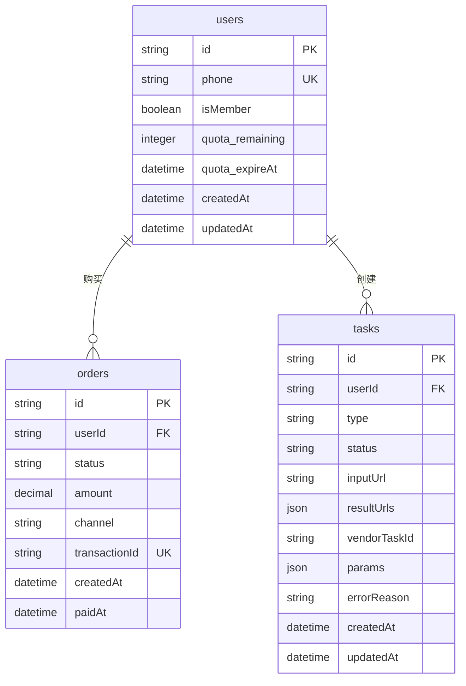

---

## 6. 外部服务集成设计

### 6.1 腾讯云 COS 集成

#### 6.1.1 存储桶结构设计

```
bucket-name/
├── input/              # 用户上传原图区域
│   └── {userId}/
│       └── {taskId}/
│           └── original.jpg
├── output/             # 处理结果区域
│   └── {userId}/
│       └── {taskId}/
│           ├── result.jpg              # 基础修图结果
│           └── frame_01.jpg ~ frame_12.jpg  # AI模特12分镜
└── temp/               # 临时文件区域（可设置生命周期自动删除）
```

#### 6.1.2 STS 临时密钥策略

权限策略示例（描述）：

| 配置项 | 值 |
|--------|---|
| 允许操作 | PutObject（上传）|
| 允许路径 | input/{userId}/{taskId}/* |
| 有效期 | 900秒（15分钟）|
| 限制条件 | 仅允许当前用户上传到自己的路径 |

安全考虑：
- 每个任务单独的路径隔离
- 临时密钥过期后自动失效
- 前端直传不经过后端服务器（节省带宽）

---

### 6.2 腾讯数据万象集成

#### 6.2.1 服装清理增强处理流程

使用「云上数据处理 + 持久化」模式（Pic-Operations）：

**业务目标与技术能力对应**：

| 业务效果 | 腾讯数据万象能力模块 | 说明 |
|---------|--------------------------|------|
| 抠出服装主体 / 去杂乱背景 | 商品抠图（GoodsMatting） | 支持主体提取和留白控制 |
| 白底主图（电商规范） | 抠图结果叠加白底背景 | 可指定留白边距 |
| 提亮/增强 | 基础图像增强 | 亮度/对比度自动优化 |
| 裁成固定规格 | 智能裁剪 / imageMogr2 | 裁剪到1:1等尺寸 |
| 输出保存到 `/output/...` | Pic-Operations 规则 | 带 fileid 参数，处理结果直接转存为新对象 |

**调用方式描述**：

1. 后端构建处理规则配置（使用 Pic-Operations 机制）
2. 调用腾讯数据万象图像处理接口，传入：
   - 输入图片路径：`/input/{userId}/{taskId}/original.jpg`
   - 处理规则链：抠图 → 增强 → 白底 → 裁剪
   - 输出路径：`/output/{userId}/{taskId}/result.jpg`
3. 数据万象同步处理完成后，结果文件自动保存到指定输出路径
4. 返回处理后的图片访问 URL

**关键约束**：
- **不在设计文档中硬编码具体 URL 参数名**（如 `brightness=auto`）
- 具体的 Pic-Operations 规则和 URL 参数**由后端在联调腾讯数据万象文档时确定**
- 原因：避免设计文档中的“视觉描述”被误认为真实 API 参数，导致开发浪费时间试错

**环境配置（参考）**：
- 存储桶：`ai-photo-prod-1379020062`
- 图片域名：`ai-photo-prod-1379020062.picgz.myqcloud.com`
- 地域：`ap-guangzhou`

**错误处理**：
- 如果原图质量过低，返回错误码
- 如果无法识别服装，返回特定错误
- 处理失败后标记任务 failed，返还配额

---

### 6.3 RunningHub AI 服务集成

#### 6.3.1 工作流参数设计

**任务创建请求结构**：

| 参数 | 说明 |
|------|------|
| webappId | RunningHub 应用ID（后端配置）|
| apiKey | API密钥（后端保密）|
| nodeInfoList | 节点信息数组 |
| nodeInfoList[].nodeId | 节点ID（如提示词节点、参考图节点）|
| nodeInfoList[].fieldName | 字段名（如 prompt, image）|
| nodeInfoList[].fieldValue | 字段值 |

**12分镜 Prompt 模板设计**：

基础模板结构（描述）：
```
{场景描述}，professional fashion photography，
{商品品类} on model，
12 different poses and angles: 
front view, side view, back view, 3/4 view, 
walking, standing, sitting, dynamic poses,
studio lighting, clean background,
commercial quality, high resolution
```

参数替换逻辑：
- `{场景描述}`：根据用户选择（街拍 / 白棚 / 室内暖光）
- `{商品品类}`：鞋 / 连衣裙 / 卫衣等

**Seed 生成策略**：
- 后端为每个任务生成随机 seed（避免重复图片）
- Seed 范围：1 ~ 2147483647
- 保存到任务记录便于复现

**参考图传递方式**：
- **统一使用 COS 签名 URL 方式**传递参考图（推荐）
- 不使用 RunningHub upload 通道（除非图片超过30MB无法外链）
- 原因：RunningHub 支持加载外部 URL，避免双存储路径简化实现

**Prompt 安全约束**：
- Prompt 拼接**在后端完成**，不向前端暴露完整模板
- 前端仅提交预设选项（场景/品类），不允许自由输入描述词
- 目的：保护商业IP + 稳定画风 + 减少奇怪生成请求

**一组图=扡1次配额**：
- 即使 RunningHub 输出12张图，也仅报1次配额
- 不按每张图结算扣次

---

#### 6.3.2 任务状态轮询机制

**轮询流程**：

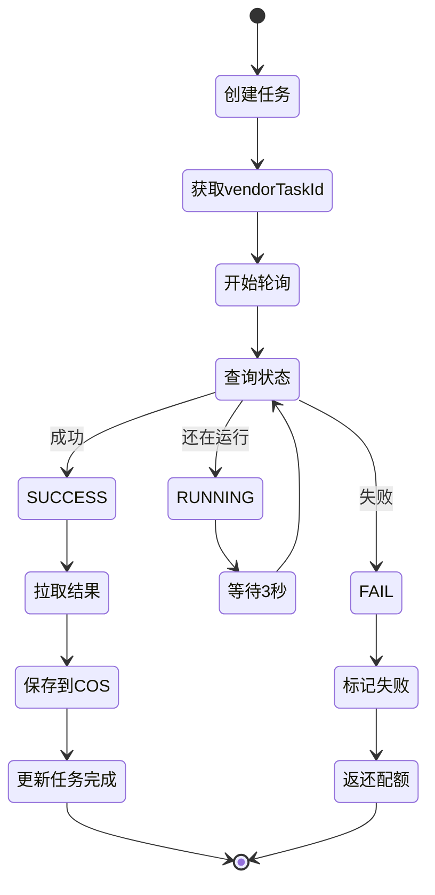

**状态查询接口描述**：
- 请求：`GET /status?taskId={vendorTaskId}`
- 响应字段：
  - status: RUNNING / SUCCESS / FAIL
  - progress: 0~100（可选进度）
  - message: 状态描述

**结果拉取接口描述**：
- 请求：`GET /outputs?taskId={vendorTaskId}`
- 响应字段：
  - images: 图片URL数组或文件名数组
  - count: 图片数量（应为12）

**超时处理**：
- 轮询超时时间：10分钟
- 超过10分钟仍未完成 → 标记为 failed
- 记录错误原因："生成超时"
- 返还配额

---

### 6.4 支付渠道集成

#### 6.4.1 支付流程设计

**微信支付集成**：

| 步骤 | 描述 |
|------|------|
| 1. 创建订单 | 后端调用微信统一下单接口 |
| 2. 获取支付参数 | 返回前端用于拉起支付的参数 |
| 3. 用户支付 | 前端拉起微信支付SDK |
| 4. 支付回调 | 微信服务器回调后端 `/payment-callback` |
| 5. 验证签名 | 验证回调签名防篡改 |
| 6. 开通会员 | 更新用户会员状态和配额 |
| 7. 通知前端 | 前端轮询订单状态或接收推送 |

**支付宝集成**：

类似流程，使用支付宝对应接口

---

#### 6.4.2 回调幂等性设计

**幂等性保证措施**：

1. **订单状态检查**：
   - 回调处理前，先查询订单状态
   - 如果订单已经是 `paid`，直接返回成功（不重复处理）

2. **唯一交易号**：
   - 保存第三方交易号（transactionId）到订单表
   - 设置唯一约束，防止同一笔交易多次处理

3. **数据库事务**：
   - 订单状态更新、会员开通、配额增加在同一事务中
   - 任一步骤失败则全部回滚

4. **日志记录**：
   - 记录每次回调请求（时间、订单号、处理结果）
   - 便于排查重复回调或异常情况

---

## 7. 业务逻辑设计

### 7.1 会员配额管理

#### 7.1.1 配额生命周期

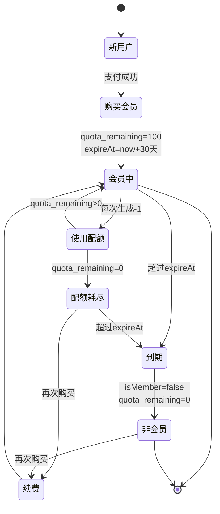

#### 7.1.2 配额扣减与返还规则

**扣减时机**：
- 任务创建时立即预扣 1 次
- 目的：防止并发创建任务导致超额使用

**返还时机**：

| 场景 | 是否返还 | 原因 |
|------|---------|------|
| 任务成功完成 | 否 | 正常消费 |
| 腾讯数据万象处理失败 | 是 | 服务问题 |
| RunningHub 生成失败 | 是 | 服务问题 |
| RunningHub 超时 | 是 | 服务问题 |
| 图片审核不通过 | 是 | 风控拦截，非用户责任 |

**MVP 范围约束**：
- 首版**不提供“用户主动取消任务”功能**
- 原因：需要实现 RunningHub 任务取消逻辑 + 状态机标记 user_cancelled，增加复杂度
- 该行策略为后续扩展预留，避免前端增加无效按钮

**返还逻辑**：
- 任务状态更新为 `failed` 时触发
- 执行 `quota_remaining + 1`
- 记录返还原因到日志

**并发安全**：
- 使用数据库行锁或乐观锁
- 防止多个请求同时扣减配额导致负数
- **NON-NEGATIVE GUARANTEE**：配额扣减必须是事务/行锁级别，不能让 `quota_remaining` 变负数
- 禁止使用非原子操作（如 `quota_remaining = quota_remaining - 1`）

---

### 7.2 任务失败处理策略

#### 7.2.1 失败分类与处理

| 失败类型 | 错误信息 | 返还配额 | 用户操作 |
|---------|---------|---------|---------|
| 图片格式不支持 | "图片格式不支持，请上传JPG/PNG" | 是 | 重新上传 |
| 图片过大 | "图片超过10MB限制" | 是 | 压缩后上传 |
| 无法识别服装 | "未检测到服装，请上传清晰的服装图片" | 是 | 更换图片 |
| 数据万象处理失败 | "图像处理失败，请重试" | 是 | 重试按钮 |
| RunningHub 超时 | "生成超时，请稍后重试" | 是 | 重试按钮 |
| RunningHub 服务异常 | "AI服务暂时不可用" | 是 | 重试按钮 |
| 图片审核不通过 | "内容不符合使用规范，已返还本次次数" | 是 | 更换图片 |
| 用户配额不足 | "剩余次数不足，请续费" | 否 | 跳转购买页 |

#### 7.2.2 重试机制设计

**用户手动重试**：
- 失败任务显示「重试」按钮
- 点击重试 → 重新创建新任务（复用之前的参数）
- 重新扣减配额（因为之前已返还）

**系统自动重试**（可选，MVP 可不做）：
- 对于网络瞬断等临时性错误
- 最多重试 3 次，间隔 5 秒
- 仍失败则标记为最终失败

---

### 7.3 图片内容审核

#### 7.3.1 审核时机

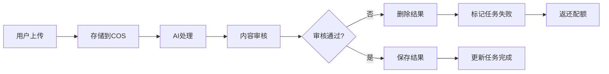

**MVP 审核策略**：
- **输入图不审核**（首版不做）
- **输出图必须审核**（合规底线）
- 原因：
  - 输入图审核需要增加异步分支 + 错误提示流程，大幅增加复杂度
  - 输出审核是合规底线，防止违规内容展示给用户
- 后续版本可增加输入图审核

#### 7.3.2 审核规则

**使用腾讯云图片内容审核服务**：

审核维度：

| 维度 | 说明 | 处理策略 |
|------|------|---------|
| 色情内容 | 检测裸露、色情图片 | 拒绝 |
| 暴力恐怖 | 检测暴力、血腥内容 | 拒绝 |
| 违法违规 | 检测政治敏感、违法内容 | 拒绝 |
| 广告检测 | 检测二维码、广告 | 警告（可通过）|
| Logo 识别 | 检测商标侵权风险 | 警告（可通过）|

审核时机：
- **输入图审核**（MVP 不做）：上传后立即审核，拒绝违规原图
- **输出图审核**（必须）：AI生成完成后、展示给用户前审核

审核失败处理：
- 删除生成结果
- 任务标记为 `failed`
- 错误信息："内容不符合使用规范，已返还本次次数"
- 返还配额

---

## 8. 测试策略

### 8.1 核心流程测试场景

#### 8.1.1 会员购买流程测试

| 测试场景 | 验证点 |
|---------|--------|
| 正常购买 | 支付成功 → 会员开通 → 配额到账 |
| 支付失败 | 订单保持 pending → 不开通会员 |
| 重复支付 | 同一订单多次回调 → 幂等性保证 |
| 支付超时 | 订单超时关闭 → 不开通会员 |
| 到期检查 | 超过 expireAt → 自动标记为非会员 |

#### 8.1.2 任务创建与执行测试

**基础修图任务**：

| 测试场景 | 验证点 |
|---------|--------|
| 正常生成 | 上传清晰服装图 → 成功生成白底主图 |
| 格式错误 | 上传 BMP 格式 → 提示格式不支持 |
| 文件过大 | 上传 15MB 图片 → 提示超过限制 |
| 无法识别 | 上传风景图 → 提示未检测到服装 |
| 配额不足 | quota_remaining=0 → 提示需要续费 |

**AI模特生成任务**：

| 测试场景 | 验证点 |
|---------|--------|
| 正常生成 | 上传服装图+选择场景 → 生成12张分镜 |
| RunningHub 成功 | 轮询状态 → SUCCESS → 拉取12张图 |
| RunningHub 失败 | 返回 FAIL → 标记任务失败 → 返还配额 |
| 生成超时 | 10分钟未完成 → 标记超时 → 返还配额 |
| 审核拦截 | 生成图违规 → 删除结果 → 返还配额 |

#### 8.1.3 配额管理测试

| 测试场景 | 验证点 |
|---------|--------|
| 配额扣减 | 创建任务 → quota_remaining - 1 |
| 配额返还 | 任务失败 → quota_remaining + 1 |
| 并发扣减 | 同时创建多个任务 → 配额正确扣减 |
| 负数保护 | quota_remaining=0 时创建任务 → 拒绝 |
| 到期失效 | 会员到期 → quota_remaining 清零 |

---

### 8.2 单元测试重点

#### 8.2.1 后端单元测试

**会员服务**：
- 购买会员逻辑（配额初始化）
- 支付回调幂等性
- 到期检查逻辑

**任务服务**：
- 配额扣减原子性
- 配额返还逻辑
- 任务状态转换正确性

**编排服务**：
- 腾讯数据万象调用参数构建
- RunningHub Prompt 模板拼接
- 结果解析与存储

**媒体服务**：
- STS 策略生成正确性
- 路径权限限制

#### 8.2.2 前端单元测试

**组件测试**：
- 上传组件：文件格式验证、大小限制
- 任务列表组件：状态展示、刷新逻辑
- 结果展示组件：图片加载、下载功能

**状态管理测试**：
- 会员状态更新
- 任务列表更新
- 轮询状态更新

---

## 9. 风险与注意事项

### 9.1 技术风险

| 风险项 | 影响 | 缓解措施 |
|--------|------|---------|
| COS 带宽成本 | 大量图片上传下载导致高额费用 | 使用 CDN 加速 + 冷热数据分层存储 |
| RunningHub 稳定性 | 第三方服务故障影响生成 | 失败自动返还配额 + 提示用户稍后重试 |
| 并发配额扣减 | 数据竞争导致配额错误 | 使用数据库事务和行锁 |
| 图片审核漏检 | 违规内容展示给用户 | 多层审核（输入+输出）+ 人工复审 |
| 支付回调丢失 | 用户付款但未开通会员 | 主动查询订单状态 + 补单机制 |

### 9.2 业务风险

| 风险项 | 影响 | 缓解措施 |
|--------|------|---------|
| 用户滥用配额 | 批量生成违规内容 | 图片审核 + 频率限制 |
| 退款纠纷 | 用户对生成结果不满意 | **明确退款政策**：“以次数返还为售后标准，不现金退款” |
| 会员到期未续费 | 用户流失 | 到期前 3 天提醒 + 优惠续费活动 |
| Prompt 泄露 | 竞品分析后端提示词 | 不暴露完整 Prompt 给前端 |
| API 密钥泄露 | RunningHub 被盗用 | 密钥存储在后端环境变量 + 定期轮换 |

### 9.3 安全注意事项

**关键安全措施**：

1. **图片直传安全**：
   - STS 临时密钥仅允许写入用户自己的路径
   - 15分钟过期，防止滥用
   - 不允许读取他人图片

2. **支付安全**：
   - 回调签名验证
   - 订单金额二次校验
   - 防重放攻击（时间戳 + nonce）

3. **API 密钥管理**：
   - RunningHub API Key 仅存储在后端
   - 环境变量管理，不提交代码仓库
   - 定期轮换密钥

4. **用户数据隔离**：
   - 任务查询时校验 userId
   - 防止用户查看他人任务结果
   - COS 路径按 userId 隔离

5. **频率限制**：
   - 登录接口：同一手机号 1分钟内最多 5 次
   - 任务创建：同一用户 1分钟内最多 10 次
   - 防止恶意刷接口

---

## 10. MVP 验收标准

### 10.1 功能验收清单

| 编号 | 验收项 | 验收标准 |
|------|--------|---------|
| 1 | 用户注册登录 | 手机号+验证码登录成功，获得 token |
| 2 | 会员购买 | 支付成功后会员状态更新，配额到账（100次）|
| 3 | 会员状态展示 | 工作台正确显示剩余次数和到期时间 |
| 4 | 基础修图功能 | 上传服装图 → 生成白底主图 → 扣减1次 |
| 5 | AI模特生成功能 | 上传服装图 → 生成12张分镜 → 扣减1次 |
| 6 | 任务详情页 | 显示任务状态、进度、结果图 |
| 7 | 结果下载 | 至少支持逐张下载（批量打包为后续增强项）|
| 8 | 失败处理 | 任务失败后配额自动返还 |
| 9 | 到期检查 | 会员到期后自动失效，无法创建任务 |
| 10 | 管理后台 | 可查看用户会员状态、剩余次数、任务记录（只读）|

### 10.2 性能验收标准

| 指标 | 目标值 |
|------|--------|
| 基础修图响应时间 | < 5 秒（P95）|
| AI模特生成时间 | < 3 分钟（P95）|
| 任务列表加载时间 | < 1 秒 |
| 支付回调处理时间 | < 2 秒 |
| STS 获取响应时间 | < 500ms |

### 10.3 上线准入条件

**必须满足**：
1. ✅ 核心功能验收清单全部通过
2. ✅ 支付流程端到端测试通过（微信/支付宝）
3. ✅ 配额扣减/返还逻辑经过并发测试验证
4. ✅ 图片审核接入并验证拦截效果
5. ✅ 管理后台可查看用户和任务数据
6. ✅ 错误日志和监控已配置
7. ✅ 数据库备份机制已建立

**可延后**：
- 高级报表功能
- 自动续费
- 多档位会员
- 营销页面
- 案例画廊

---

## 11. 工程实施优先级

### 11.0 关键启动约束（必须遵守）

**第一条可跑通链路约束**：

> 支付对接 / 会员开通 / 配额扣减-返还 / 任务创建（basic_clean & model_pose12） 属于同一批次的“**第一条可跑通链路**”，必须在**同一迭代内同时联调通过**，否则我们没有可展示/可收费的闭环。

**具体要求**：
- PM、后端、前端、支付同学必须在**同一迭代周期**内完成各自模块
- 不能各做各的，最后发现链路断了
- 开发期间必须有“每日站会”确认接口对接进度

### 11.1 后端开发优先级

**第一优先级（核心链路）**：
1. 用户模型 + 登录态管理
2. 会员购买 + 支付回调处理
3. 配额管理模块（扣减/返还）
4. STS 临时密钥发放
5. 任务创建接口（基础框架）

**第二优先级（服务集成）**：
1. 腾讯数据万象集成（basic_clean）
2. RunningHub 集成（model_pose12）
3. 任务状态查询与轮询逻辑
4. 结果拉取与 COS 存储

**第三优先级（管理与监控）**：
1. 任务列表接口
2. 管理后台接口
3. 图片内容审核集成
4. 错误日志和监控

### 11.2 前端开发优先级

**第一优先级（核心页面）**：
1. 登录/注册页
2. 会员购买页（含支付拉起）
3. 工作台首页（会员状态 + 功能卡）

**第二优先级（任务流程）**：
1. 功能表单页（上传 + 参数选择）
2. 任务详情页（进度展示 + 结果展示）
3. 任务列表组件

**第三优先级（优化体验）**：
1. 支付成功/失败跳转
2. 错误提示优化
3. 加载状态优化
4. 响应式适配

### 11.3 里程碑规划

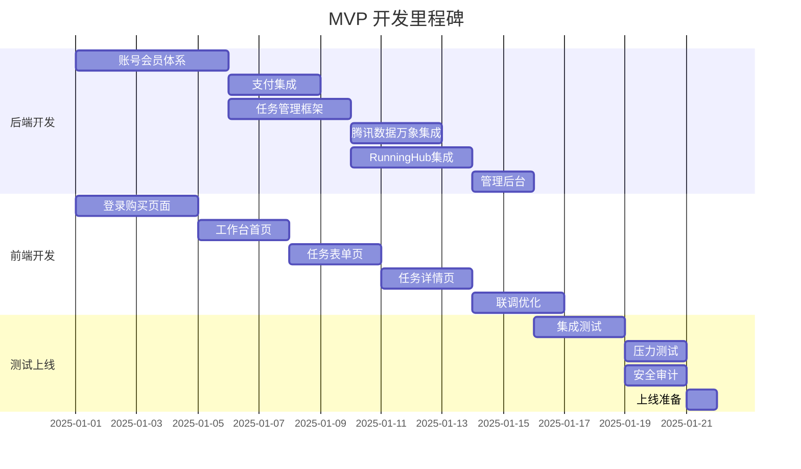

---

## 12. 附录

### 12.1 术语表

| 术语 | 说明 |
|------|------|
| MVP | 最小可行产品（Minimum Viable Product）|
| STS | 腾讯云临时密钥服务（Security Token Service）|
| COS | 腾讯云对象存储（Cloud Object Storage）|
| 腾讯数据万象 | 腾讯云图片处理服务（Cloud Infinite）|
| RunningHub | 第三方 AI 工作流平台 |
| 配额 | 用户可用的生成次数（quota_remaining）|
| 12分镜 | 12张不同角度和姿势的模特展示图 |
| 基础修图 | 抠图、白底、增强等基础图像处理 |

### 12.2 关键配置参数

| 配置项 | 推荐值 | 说明 |
|--------|--------|------|
| 单月会员配额 | 100次 | 购买会员后获得的次数 |
| 会员有效期 | 30天 | 从购买日起计算 |
| STS 有效期 | 900秒 | 临时密钥过期时间 |
| 图片大小限制 | 10MB | 单张图片最大体积 |
| RunningHub 超时 | 10分钟 | 轮询超时阈值 |
| 任务列表默认数量 | 10条 | 首页展示最近任务数 |
| 轮询间隔 | 3秒 | 前端查询任务状态间隔 |

### 12.3 错误码设计

| 错误码 | 说明 | 用户提示 |
|--------|------|---------|
| 1001 | 未登录 | 请先登录 |
| 1002 | 非会员 | 请购买会员后使用 |
| 1003 | 配额不足 | 剩余次数不足，请续费 |
| 2001 | 图片格式错误 | 请上传 JPG/PNG 格式图片 |
| 2002 | 图片过大 | 图片不能超过 10MB |
| 2003 | 无法识别服装 | 未检测到服装，请更换图片 |
| 3001 | 数据万象处理失败 | 图像处理失败，请重试 |
| 3002 | RunningHub 超时 | 生成超时，请稍后重试 |
| 3003 | RunningHub 失败 | AI服务暂时不可用，请重试 |
| 4001 | 图片审核不通过 | 内容不符合使用规范，已返还本次次数 |
| 5001 | 支付失败 | 支付失败，请重试 |
| 5002 | 订单不存在 | 订单不存在 |
