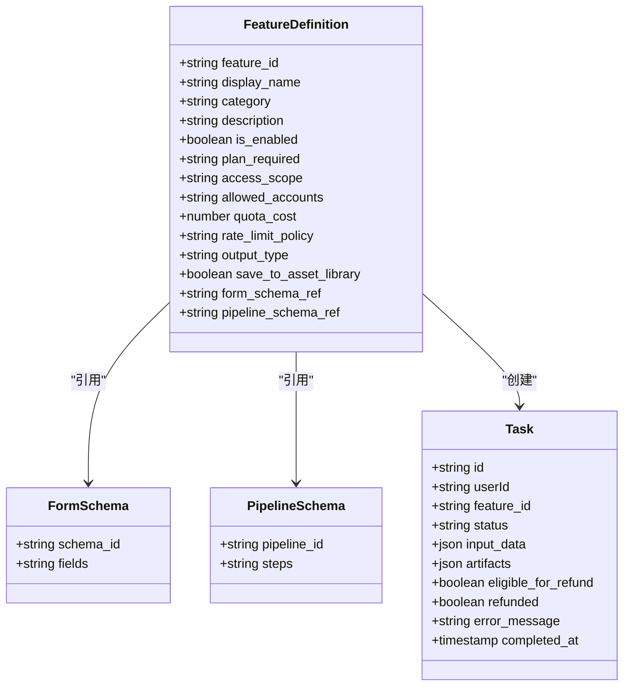
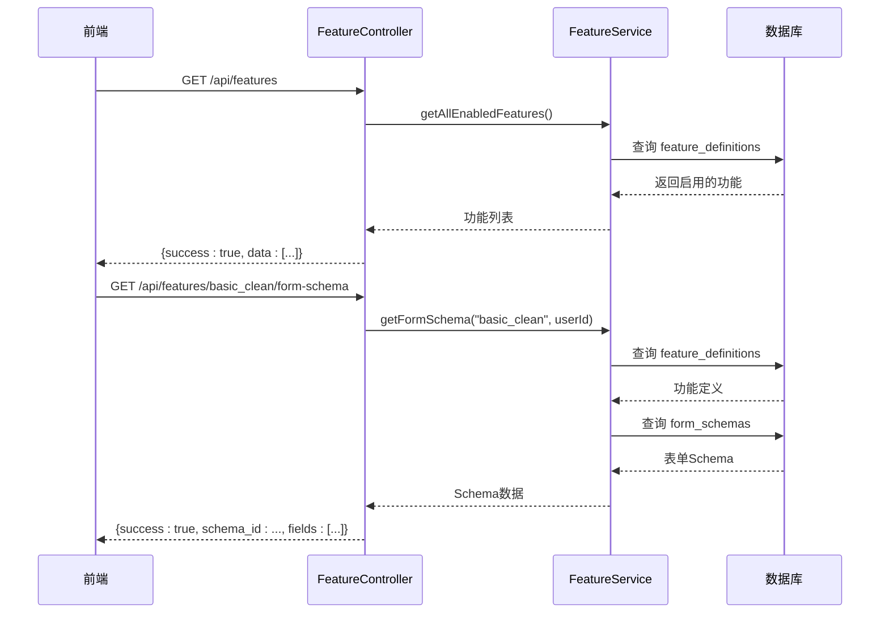
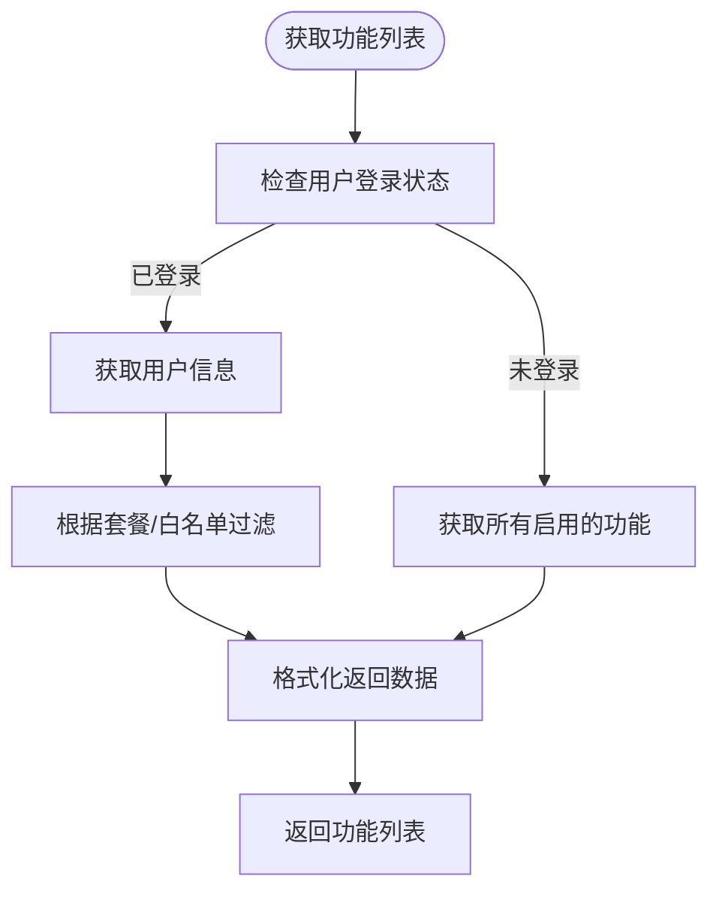
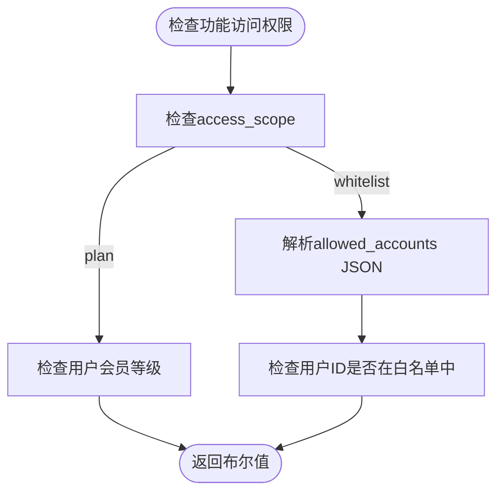
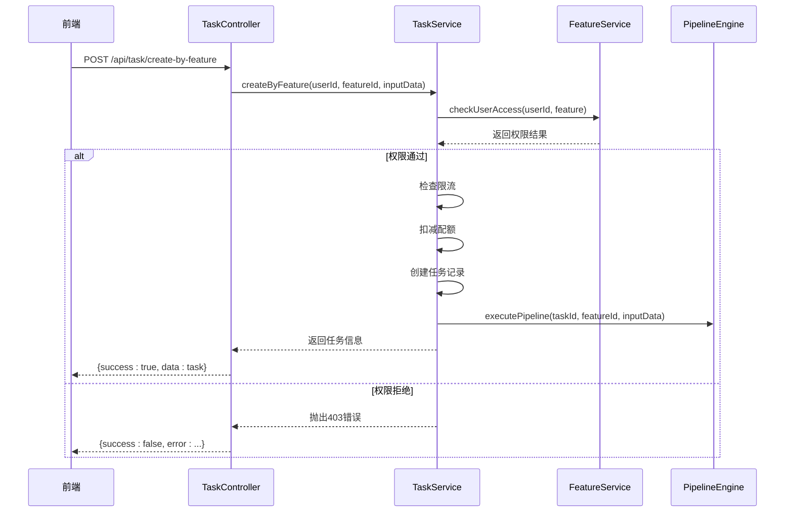
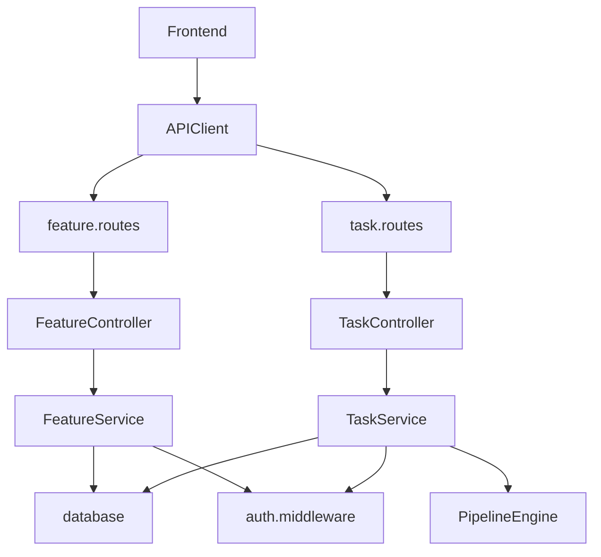

# 公共功能 API

<cite>
**本文档引用的文件**  
- [feature.controller.js](file://backend/src/controllers/feature.controller.js)
- [feature.routes.js](file://backend/src/routes/feature.routes.js)
- [feature.service.js](file://backend/src/services/feature.service.js)
- [auth.middleware.js](file://backend/src/middlewares/auth.middleware.js)
- [app.js](file://backend/src/app.js)
- [api.ts](file://frontend/src/lib/api.ts)
- [index.ts](file://frontend/src/types/index.ts)
- [create_feature_definitions_table.js](file://backend/src/db/migrations/20251029000001_create_feature_definitions_table.js)
- [003_features_init.js](file://backend/src/db/seeds/003_features_init.js)
- [task.controller.js](file://backend/src/controllers/task.controller.js)
- [task.routes.js](file://backend/src/routes/task.routes.js)
- [task.service.js](file://backend/src/services/task.service.js)
- [create_tasks_table.js](file://backend/src/db/migrations/20251028000003_create_tasks_table.js)
- [extend_tasks_table.js](file://backend/src/db/migrations/20251029000004_extend_tasks_table.js)
</cite>

## 目录

1. [简介](#简介)
2. [项目结构](#项目结构)
3. [核心组件](#核心组件)
4. [架构概述](#架构概述)
5. [详细组件分析](#详细组件分析)
6. [依赖分析](#依赖分析)
7. [性能考虑](#性能考虑)
8. [故障排除指南](#故障排除指南)
9. [结论](#结论)

## 简介

本项目是一个基于功能卡片的AI图像与视频处理平台，提供灵活可配置的公共功能API。系统通过功能卡片（Feature Card）机制实现功能的动态管理，支持无需登录即可访问的功能列表展示，同时为已登录用户提供基于权限和套餐的个性化功能访问。API设计遵循RESTful原则，采用JWT进行身份验证，并通过Knex.js进行数据库操作，支持MySQL等关系型数据库。

系统主要分为前端（Next.js）、后端（Node.js + Express）和云函数（SCF）三大部分，实现了从用户认证、功能管理、任务创建到结果处理的完整流程。核心功能包括基础抠图、AI模特上身、视频合成等，均通过统一的“功能卡片”架构进行管理。

## 项目结构

项目采用分层架构，主要分为`backend`、`frontend`、`scf`（云函数）和`skills`（开发规范）四个部分。后端使用Express框架，按`controllers`、`services`、`routes`、`db`、`middlewares`等标准目录组织代码。前端使用Next.js，采用App Router模式，组件化开发。云函数部分使用Serverless Framework部署，处理图像合成、文案生成等异步任务。

```mermaid
graph TB
subgraph "前端 (Next.js)"
A[pages] --> B[task/create/[featureId]]
A --> C[workspace]
A --> D[login]
E[components] --> F[DynamicForm]
E --> G[ImageUploader]
end
subgraph "后端 (Node.js + Express)"
H[controllers] --> I[feature.controller]
H --> J[task.controller]
K[services] --> L[feature.service]
K --> M[task.service]
N[routes] --> O[feature.routes]
N --> P[task.routes]
Q[middlewares] --> R[auth.middleware]
end
subgraph "云函数 (SCF)"
S[image-compositor]
T[video-compositor]
U[text-processor]
end
A --> |API调用| H
H --> |调用| K
K --> |数据库操作| V[(MySQL)]
K --> |调用| S
K --> |调用| T
K --> |调用| U
```

**图源**
- [app.js](file://backend/src/app.js#L89-L124)
- [feature.routes.js](file://backend/src/routes/feature.routes.js#L0-L16)
- [task.routes.js](file://backend/src/routes/task.routes.js#L0-L26)

**节源**
- [app.js](file://backend/src/app.js#L89-L124)
- [project_structure](#project_structure)

## 核心组件

系统的核心组件围绕“功能卡片”（Feature Card）展开，主要包括功能定义、表单Schema、Pipeline流程和权限控制四大模块。功能卡片通过数据库表`feature_definitions`进行配置化管理，支持动态启用/禁用、权限范围（套餐或白名单）、配额消耗等属性。前端通过`/api/features`接口获取可用功能列表，并根据`feature_id`动态加载对应的表单Schema，实现完全动态化的任务创建流程。



**图源**
- [create_feature_definitions_table.js](file://backend/src/db/migrations/20251029000001_create_feature_definitions_table.js#L0-L37)
- [003_features_init.js](file://backend/src/db/seeds/003_features_init.js#L0-L143)
- [extend_tasks_table.js](file://backend/src/db/migrations/20251029000004_extend_tasks_table.js#L0-L45)

**节源**
- [feature.service.js](file://backend/src/services/feature.service.js#L0-L279)
- [create_feature_definitions_table.js](file://backend/src/db/migrations/20251029000001_create_feature_definitions_table.js#L0-L37)

## 架构概述

系统采用微服务风格的模块化架构，后端以Express应用为核心，通过路由分发请求到不同的控制器。功能API的核心是`FeatureController`和`FeatureService`，前者处理HTTP请求，后者封装业务逻辑。权限控制通过中间件`auth.middleware.js`实现，支持可选认证（`optionalAuthenticate`）和强制认证（`authenticate`）。任务创建流程通过`TaskService`与`PipelineEngine`解耦，确保API响应快速，异步执行复杂处理。



**图源**
- [feature.controller.js](file://backend/src/controllers/feature.controller.js#L0-L69)
- [feature.service.js](file://backend/src/services/feature.service.js#L0-L279)
- [auth.middleware.js](file://backend/src/middlewares/auth.middleware.js#L0-L76)

**节源**
- [feature.controller.js](file://backend/src/controllers/feature.controller.js#L0-L69)
- [feature.service.js](file://backend/src/services/feature.service.js#L0-L279)

## 详细组件分析

### 功能控制器分析

`FeatureController`负责处理与功能卡片相关的HTTP请求，主要包含两个接口：获取功能列表和获取表单Schema。其设计巧妙地支持了“未登录用户可浏览功能，已登录用户可使用功能”的业务需求。

#### 功能列表接口


**图源**
- [feature.controller.js](file://backend/src/controllers/feature.controller.js#L15-L41)
- [feature.service.js](file://backend/src/services/feature.service.js#L20-L45)

**节源**
- [feature.controller.js](file://backend/src/controllers/feature.controller.js#L15-L41)
- [feature.service.js](file://backend/src/services/feature.service.js#L20-L45)

### 功能服务分析

`FeatureService`是功能API的核心业务逻辑层，实现了功能查询、权限验证和Schema获取等关键功能。

#### 权限验证逻辑


**图源**
- [feature.service.js](file://backend/src/services/feature.service.js#L149-L197)
- [feature.service.js](file://backend/src/services/feature.service.js#L199-L252)

**节源**
- [feature.service.js](file://backend/src/services/feature.service.js#L149-L252)

### 任务创建流程分析

虽然任务创建不属于公共功能API，但它是功能卡片的下游流程，值得分析其与功能系统的集成。

#### 基于功能创建任务


**图源**
- [task.controller.js](file://backend/src/controllers/task.controller.js#L0-L50)
- [task.service.js](file://backend/src/services/task.service.js#L78-L124)
- [task.service.js](file://backend/src/services/task.service.js#L126-L172)

**节源**
- [task.controller.js](file://backend/src/controllers/task.controller.js#L0-L50)
- [task.service.js](file://backend/src/services/task.service.js#L78-L172)

## 依赖分析

系统依赖关系清晰，各模块职责分明。后端控制器依赖服务层，服务层依赖数据库和中间件。前端通过`api.ts`封装的`APIClient`类统一调用后端API，实现了请求拦截、错误处理和自动认证。



**图源**
- [api.ts](file://frontend/src/lib/api.ts#L0-L218)
- [app.js](file://backend/src/app.js#L89-L124)

**节源**
- [api.ts](file://frontend/src/lib/api.ts#L0-L218)
- [app.js](file://backend/src/app.js#L89-L124)

## 性能考虑

系统在性能方面做了多项优化：
1. **数据库索引**：在`feature_definitions`表的`is_enabled`和`category`字段上建立了索引，加速功能列表查询。
2. **异步处理**：任务创建后，Pipeline执行在事务外异步进行，避免阻塞API响应。
3. **缓存友好**：功能列表接口对未登录用户返回静态数据，适合CDN缓存。
4. **限流机制**：通过`rate_limit_policy`字段配置功能级别的限流策略，防止滥用。
5. **连接池**：使用Knex.js的数据库连接池，提高数据库操作效率。

## 故障排除指南

### 常见错误码
| 错误码 | 含义 | 解决方案 |
|-------|------|---------|
| 4001 | 功能不存在 | 检查`feature_id`是否正确，确认功能已初始化 |
| 4002 | 功能已下线 | 检查`feature_definitions`表中`is_enabled`字段 |
| 4003 | 无权访问 | 检查用户会员状态或白名单配置 |
| 4029 | 请求过于频繁 | 等待限流周期结束，或调整`rate_limit_policy` |
| 5001 | 表单Schema不存在 | 检查`form_schemas`表中是否存在对应`schema_id` |

### 调试步骤
1. **检查数据库**：确认`feature_definitions`、`form_schemas`等表的数据是否正确。
2. **查看日志**：通过`logger`输出的`[FeatureService]`前缀日志定位问题。
3. **验证权限**：确认`access_scope`和`plan_required`配置与用户状态匹配。
4. **测试API**：使用Postman或curl直接调用API，排除前端问题。

**节源**
- [feature.service.js](file://backend/src/services/feature.service.js#L0-L279)
- [feature.controller.js](file://backend/src/controllers/feature.controller.js#L0-L69)

## 结论

公共功能API设计合理，实现了功能的完全配置化和动态化。通过`feature_definitions`表驱动的架构，管理员可以灵活管理功能的启用状态、权限和配额，而无需修改代码。前端通过统一的`DynamicForm`组件，实现了对任意功能表单的动态渲染，极大地提高了系统的可扩展性和维护性。整体架构清晰，权限控制严密，为平台的持续迭代奠定了坚实基础。