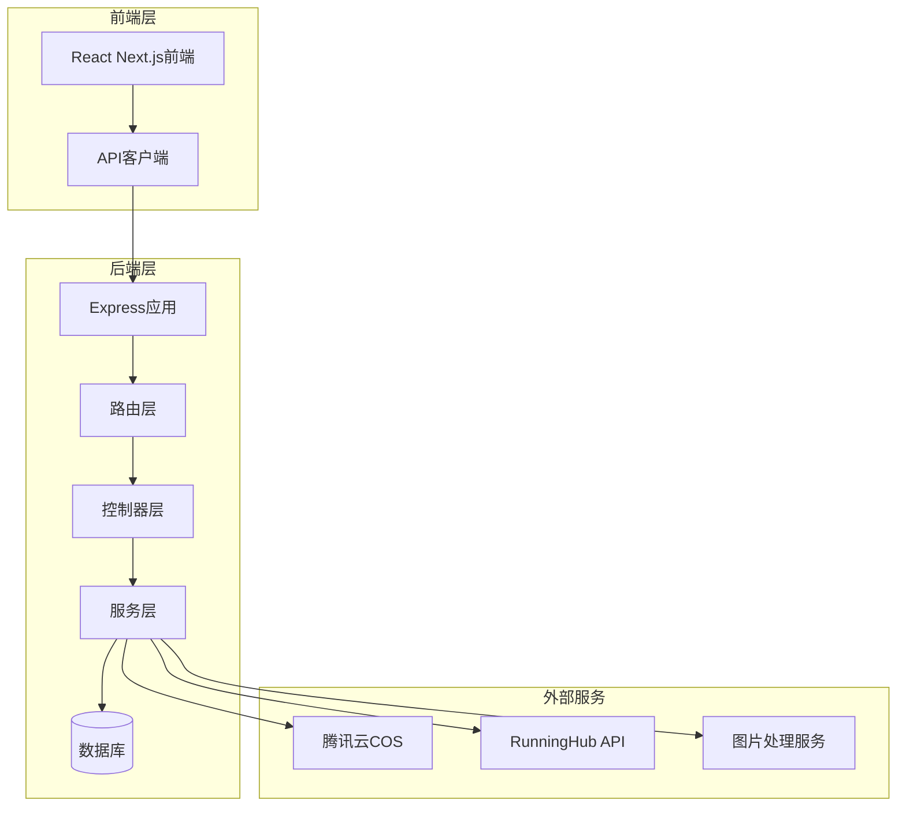
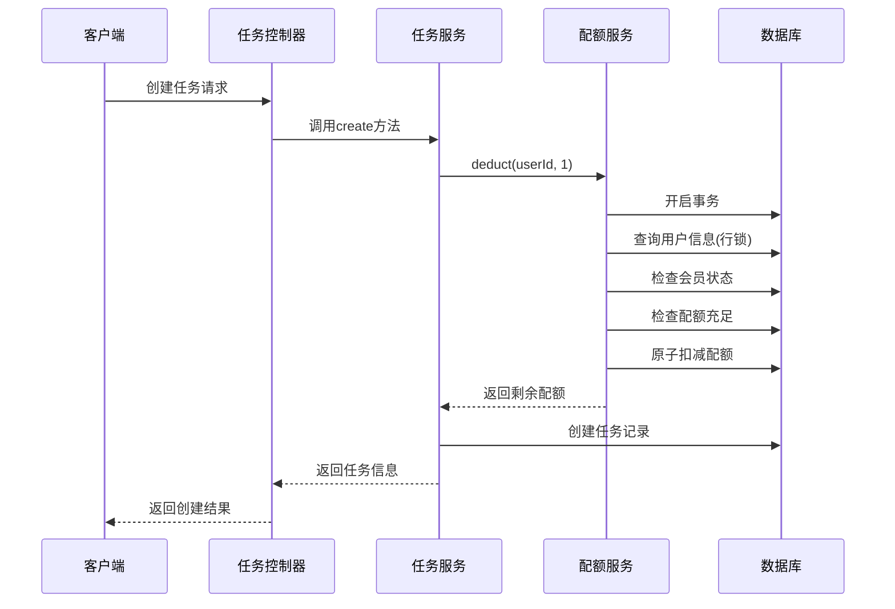
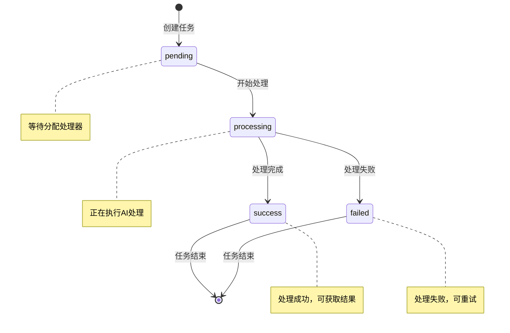
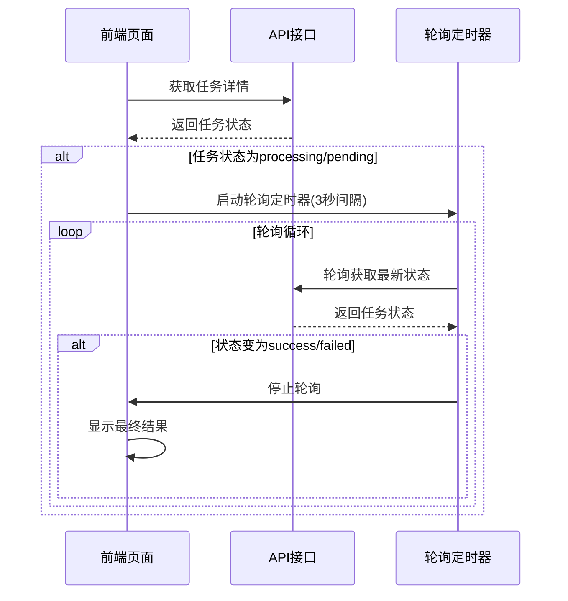
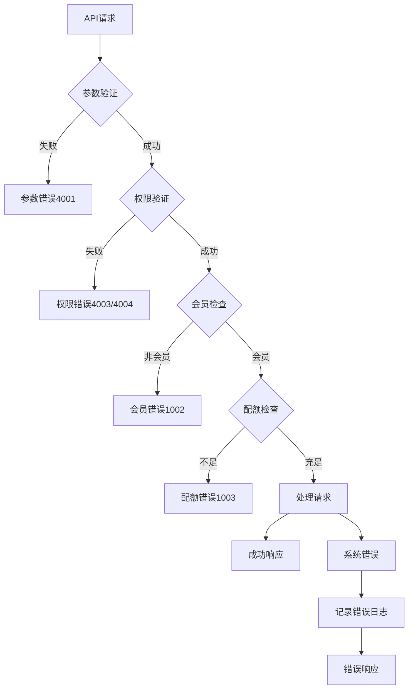

# 任务处理API文档

<cite>
**本文档引用的文件**
- [task.controller.js](file://backend/src/controllers/task.controller.js)
- [task.routes.js](file://backend/src/routes/task.routes.js)
- [task.service.js](file://backend/src/services/task.service.js)
- [quota.service.js](file://backend/src/services/quota.service.js)
- [imageProcess.service.js](file://backend/src/services/imageProcess.service.js)
- [aiModel.service.js](file://backend/src/services/aiModel.service.js)
- [create_tasks_table.js](file://backend/src/db/migrations/20251028000003_create_tasks_table.js)
- [api.ts](file://frontend/src/lib/api.ts)
- [page.tsx](file://frontend/src/app/task/[taskId]/page.tsx)
- [auth.middleware.js](file://backend/src/middlewares/auth.middleware.js)
</cite>

## 目录
1. [简介](#简介)
2. [项目架构概述](#项目架构概述)
3. [核心API端点详解](#核心api端点详解)
4. [任务类型与参数结构](#任务类型与参数结构)
5. [配额扣减机制](#配额扣减机制)
6. [任务状态管理](#任务状态管理)
7. [前端轮询策略](#前端轮询策略)
8. [错误处理与故障排除](#错误处理与故障排除)
9. [完整示例](#完整示例)
10. [最佳实践建议](#最佳实践建议)

## 简介

本文档详细介绍了基于Node.js和Express框架构建的AI图像处理任务系统的API接口规范。该系统支持两种主要任务类型：基础修图(basic_clean)和AI模特12分镜(model_pose12)，并提供了完整的任务生命周期管理，包括创建、查询、状态跟踪和结果获取等功能。

系统采用前后端分离架构，后端提供RESTful API接口，前端通过React Next.js框架实现用户界面。所有API接口均需要JWT认证，确保用户身份验证和数据安全。

## 项目架构概述



**图表来源**
- [task.routes.js](file://backend/src/routes/task.routes.js#L1-L24)
- [task.controller.js](file://backend/src/controllers/task.controller.js#L1-L173)
- [task.service.js](file://backend/src/services/task.service.js#L1-L259)

**章节来源**
- [task.routes.js](file://backend/src/routes/task.routes.js#L1-L24)
- [task.controller.js](file://backend/src/controllers/task.controller.js#L1-L173)
- [task.service.js](file://backend/src/services/task.service.js#L1-L259)

## 核心API端点详解

### POST /api/task/create - 创建任务

**功能描述**: 创建新的AI图像处理任务，支持基础修图和AI模特两种任务类型。

**请求参数**:
```typescript
interface CreateTaskRequest {
  type: 'basic_clean' | 'model_pose12';
  inputImageUrl: string;
  params?: {
    template?: string;
    scene?: 'street' | 'studio' | 'indoor';
    category?: 'shoes' | 'dress' | 'hoodie';
    productDescription?: string;
  };
}
```

**响应格式**:
```typescript
interface CreateTaskResponse {
  success: boolean;
  data: {
    taskId: string;
    type: string;
    status: 'pending';
    createdAt: string;
  };
}
```

**权限控制**: 需要登录认证，且用户必须是会员状态。

**处理流程**:
1. 参数验证和任务类型检查
2. 用户会员状态验证
3. 配额扣减(原子操作)
4. 任务记录创建
5. 根据任务类型启动相应处理流程

**章节来源**
- [task.controller.js](file://backend/src/controllers/task.controller.js#L12-L60)
- [task.service.js](file://backend/src/services/task.service.js#L12-L50)

### GET /api/task/:taskId - 获取任务详情

**功能描述**: 根据任务ID获取任务的详细信息和当前状态。

**路径参数**:
- `taskId`: 任务唯一标识符

**响应格式**:
```typescript
interface GetTaskResponse {
  success: boolean;
  data: {
    id: string;
    type: 'basic_clean' | 'model_pose12';
    status: 'pending' | 'processing' | 'success' | 'failed';
    inputImageUrl: string;
    params: any;
    resultUrls: string[];
    errorMessage?: string;
    createdAt: string;
    updatedAt: string;
    completedAt?: string;
  };
}
```

**权限控制**: 只能查看自己的任务，系统会进行权限验证。

**章节来源**
- [task.controller.js](file://backend/src/controllers/task.controller.js#L62-L82)
- [task.service.js](file://backend/src/services/task.service.js#L52-L95)

### GET /api/task/list - 获取任务列表

**功能描述**: 获取用户的任务历史记录列表，支持分页和筛选。

**查询参数**:
- `limit`: 每页显示数量，默认10
- `offset`: 偏移量，默认0
- `status`: 任务状态筛选
- `type`: 任务类型筛选

**响应格式**:
```typescript
interface ListTasksResponse {
  success: boolean;
  data: {
    tasks: Array<{
      id: string;
      type: 'basic_clean' | 'model_pose12';
      status: 'pending' | 'processing' | 'success' | 'failed';
      inputImageUrl: string;
      resultUrls: string[];
      createdAt: string;
      updatedAt: string;
      completedAt?: string;
    }>;
    total: number;
    limit: number;
    offset: number;
  };
}
```

**章节来源**
- [task.controller.js](file://backend/src/controllers/task.controller.js#L84-L104)
- [task.service.js](file://backend/src/services/task.service.js#L143-L187)

### PUT /api/task/:taskId/status - 更新任务状态

**功能描述**: 内部接口，用于更新任务状态和结果信息。

**路径参数**:
- `taskId`: 任务唯一标识符

**请求参数**:
```typescript
interface UpdateStatusRequest {
  status: 'pending' | 'processing' | 'success' | 'failed';
  resultUrls?: string[];
  errorMessage?: string;
}
```

**响应格式**:
```typescript
interface UpdateStatusResponse {
  success: boolean;
  message: string;
}
```

**权限控制**: 需要登录认证，主要用于系统内部状态更新。

**章节来源**
- [task.controller.js](file://backend/src/controllers/task.controller.js#L106-L130)
- [task.service.js](file://backend/src/services/task.service.js#L103-L141)

## 任务类型与参数结构

### 基础修图 (basic_clean)

**功能描述**: 自动化的图片背景去除和美化处理，适用于电商商品图片处理。

**处理流程**:
1. AI智能抠图 - 保留主体轮廓
2. 白底处理 - 添加纯白色背景
3. 智能增强 - 锐化和亮度调整

**参数结构**:
```typescript
interface BasicCleanParams {
  template?: 'all' | 'matting' | 'white_bg' | 'enhanced';
}
```

**处理结果**:
- `matting.png`: 透明背景的抠图版本
- `white-bg.png`: 白色背景版本
- `enhanced.png`: 智能增强版本

**章节来源**
- [imageProcess.service.js](file://backend/src/services/imageProcess.service.js#L40-L120)
- [task.controller.js](file://backend/src/controllers/task.controller.js#L42-L50)

### AI模特12分镜 (model_pose12)

**功能描述**: 基于AI的模特姿态生成服务，为商品生成12种不同角度和风格的模特展示图。

**支持场景**:
- `street`: 街拍风格
- `studio`: 白棚摄影风格  
- `indoor`: 室内家居风格

**支持品类**:
- `shoes`: 鞋子
- `dress`: 连衣裙
- `hoodie`: 卫衣

**参数结构**:
```typescript
interface ModelPoseParams {
  scene?: 'street' | 'studio' | 'indoor';
  category?: 'shoes' | 'dress' | 'hoodie';
  productDescription?: string;
}
```

**处理流程**:
1. 提交到RunningHub AI平台
2. 异步生成12张不同角度的模特图
3. 内容审核通过后返回结果
4. 支持轮询查询处理状态

**章节来源**
- [aiModel.service.js](file://backend/src/services/aiModel.service.js#L30-L43)
- [task.controller.js](file://backend/src/controllers/task.controller.js#L51-L58)

## 配额扣减机制

### 配额服务架构



**图表来源**
- [task.service.js](file://backend/src/services/task.service.js#L12-L50)
- [quota.service.js](file://backend/src/services/quota.service.js#L15-L50)

### 配额扣减策略

**关键特性**:
1. **原子性保证**: 使用数据库事务确保配额扣减的原子性
2. **行级锁定**: 防止并发扣减导致的负数问题
3. **非负保证**: 确保用户配额不会变为负数
4. **会员验证**: 必须是会员才能使用配额

**扣减流程**:
1. 查询用户信息(加行锁)
2. 验证会员状态
3. 检查配额是否充足
4. 原子扣减配额
5. 记录操作日志

**章节来源**
- [quota.service.js](file://backend/src/services/quota.service.js#L15-L50)
- [task.service.js](file://backend/src/services/task.service.js#L35-L45)

### 配额返还机制

当任务失败时，系统会自动返还配额：

**返还条件**:
- 任务状态变为`failed`
- 配额服务自动检测并执行返还
- 返还数量为1，原因记录为任务ID

**章节来源**
- [task.service.js](file://backend/src/services/task.service.js#L125-L135)
- [quota.service.js](file://backend/src/services/quota.service.js#L52-L75)

## 任务状态管理

### 状态流转图



**图表来源**
- [task.service.js](file://backend/src/services/task.service.js#L103-L141)

### 状态定义

| 状态 | 描述 | 含义 |
|------|------|------|
| `pending` | 等待中 | 任务已创建，等待分配处理器 |
| `processing` | 处理中 | 正在执行AI处理算法 |
| `success` | 已完成 | 处理成功，可获取结果图片 |
| `failed` | 失败 | 处理失败，可查看错误信息 |

### 状态更新机制

**自动状态更新**:
- 任务创建时: `pending`
- 开始处理时: `processing`
- 处理完成时: `success` + 完成时间
- 处理失败时: `failed` + 错误信息 + 完成时间

**超时清理**:
- 超过10分钟未处理的任务自动标记为`failed`
- 错误信息: "任务超时(10分钟未处理)"

**章节来源**
- [task.service.js](file://backend/src/services/task.service.js#L103-L141)
- [task.service.js](file://backend/src/services/task.service.js#L225-L257)

## 前端轮询策略

### 轮询实现原理



**图表来源**
- [page.tsx](file://frontend/src/app/task/[taskId]/page.tsx#L60-L85)

### 轮询间隔策略

**推荐间隔**:
- **基础修图**: 3秒间隔
- **AI模特**: 3秒间隔

**优化建议**:
1. **指数退避**: 失败时增加间隔时间
2. **最大重试**: 设置最大轮询次数(如20次)
3. **取消机制**: 页面卸载时停止轮询
4. **状态缓存**: 避免重复轮询相同状态

**章节来源**
- [page.tsx](file://frontend/src/app/task/[taskId]/page.tsx#L60-L85)

### 前端状态处理

**状态变化处理**:
```typescript
// 状态标签映射
const statusMap = {
  pending: { color: 'default', icon: <ClockCircleOutlined />, text: '等待处理' },
  processing: { color: 'processing', icon: <SyncOutlined spin />, text: '处理中' },
  success: { color: 'success', icon: <CheckCircleOutlined />, text: '处理成功' },
  failed: { color: 'error', icon: <CloseCircleOutlined />, text: '处理失败' }
};
```

**章节来源**
- [page.tsx](file://frontend/src/app/task/[taskId]/page.tsx#L87-L100)

## 错误处理与故障排除

### 常见错误码

| 错误码 | 错误类型 | 描述 | 解决方案 |
|--------|----------|------|----------|
| 4001 | 参数错误 | 缺少必要参数 | 检查请求参数完整性 |
| 4003 | 权限错误 | 用户无权访问 | 确认用户登录状态 |
| 4004 | 资源不存在 | 任务或用户不存在 | 检查资源ID有效性 |
| 1002 | 会员错误 | 非会员用户 | 购买会员服务 |
| 1003 | 配额错误 | 配额不足 | 续费或等待配额恢复 |
| 1004 | 用户不存在 | 用户账户异常 | 联系客服处理 |

### 错误处理流程



**图表来源**
- [task.controller.js](file://backend/src/controllers/task.controller.js#L15-L60)
- [task.service.js](file://backend/src/services/task.service.js#L12-L50)

### 故障排除指南

**任务创建失败**:
1. 检查用户登录状态
2. 确认会员资格
3. 验证配额充足性
4. 检查请求参数格式

**任务处理超时**:
1. 检查网络连接稳定性
2. 确认图片URL可访问性
3. 查看系统负载情况
4. 联系技术支持

**章节来源**
- [task.controller.js](file://backend/src/controllers/task.controller.js#L62-L130)
- [task.service.js](file://backend/src/services/task.service.js#L52-L95)

## 完整示例

### curl命令示例

**创建基础修图任务**:
```bash
curl -X POST "https://api.example.com/api/task/create" \
  -H "Content-Type: application/json" \
  -H "Authorization: Bearer YOUR_JWT_TOKEN" \
  -d '{
    "type": "basic_clean",
    "inputImageUrl": "https://example.com/images/product.jpg",
    "params": {
      "template": "all"
    }
  }'
```

**创建AI模特任务**:
```bash
curl -X POST "https://api.example.com/api/task/create" \
  -H "Content-Type: application/json" \
  -H "Authorization: Bearer YOUR_JWT_TOKEN" \
  -d '{
    "type": "model_pose12",
    "inputImageUrl": "https://example.com/images/garment.jpg",
    "params": {
      "scene": "studio",
      "category": "dress",
      "productDescription": "优雅连衣裙"
    }
  }'
```

**获取任务详情**:
```bash
curl -X GET "https://api.example.com/api/task/TASK_ID" \
  -H "Authorization: Bearer YOUR_JWT_TOKEN"
```

**获取任务列表**:
```bash
curl -X GET "https://api.example.com/api/task/list?limit=10&offset=0&status=success" \
  -H "Authorization: Bearer YOUR_JWT_TOKEN"
```

### 前端调用示例

**使用API客户端**:
```typescript
// 创建任务
const createTask = async (type: string, imageUrl: string, params?: any) => {
  try {
    const response = await api.task.create({ type, inputImageUrl: imageUrl, params });
    if (response.success) {
      return response.data;
    }
  } catch (error) {
    console.error('创建任务失败:', error);
  }
};

// 获取任务详情并轮询
const monitorTask = async (taskId: string) => {
  const task = await api.task.get(taskId);
  
  if (task.status === 'processing' || task.status === 'pending') {
    // 启动轮询
    const interval = setInterval(async () => {
      const updatedTask = await api.task.get(taskId);
      
      if (updatedTask.status !== 'processing' && updatedTask.status !== 'pending') {
        clearInterval(interval);
        // 处理最终结果
      }
    }, 3000);
  }
  
  return task;
};
```

**章节来源**
- [api.ts](file://frontend/src/lib/api.ts#L70-L85)
- [page.tsx](file://frontend/src/app/task/[taskId]/page.tsx#L60-L85)

## 最佳实践建议

### 性能优化

1. **合理设置轮询间隔**
   - 基础修图: 3秒
   - AI模特: 3秒
   - 避免过于频繁的轮询

2. **前端状态管理**
   - 使用React状态管理优化UI更新
   - 实现防抖和节流机制
   - 缓存任务状态避免重复请求

3. **错误边界处理**
   - 实现全局错误捕获
   - 提供友好的错误提示
   - 记录错误日志便于排查

### 安全考虑

1. **认证授权**
   - 所有接口都需要JWT认证
   - 实现细粒度权限控制
   - 定期刷新token

2. **输入验证**
   - 严格验证用户输入
   - 防止SQL注入和XSS攻击
   - 限制请求大小和频率

3. **数据保护**
   - 敏感数据加密存储
   - 安全传输HTTPS
   - 定期备份重要数据

### 监控与维护

1. **日志监控**
   - 记录所有API调用
   - 监控错误率和响应时间
   - 设置告警机制

2. **性能监控**
   - 监控系统资源使用
   - 跟踪任务处理效率
   - 优化瓶颈环节

3. **容量规划**
   - 预估用户增长趋势
   - 合理配置服务器资源
   - 实施弹性伸缩策略

### 用户体验优化

1. **加载状态**
   - 提供清晰的加载指示
   - 显示预估处理时间
   - 实现进度条显示

2. **结果展示**
   - 支持多种图片格式
   - 提供批量下载功能
   - 实现图片预览功能

3. **错误处理**
   - 提供详细的错误说明
   - 支持任务重试功能
   - 记录失败原因便于改进

通过遵循这些最佳实践，可以确保任务处理系统的稳定性和用户体验，同时为未来的功能扩展奠定坚实基础。