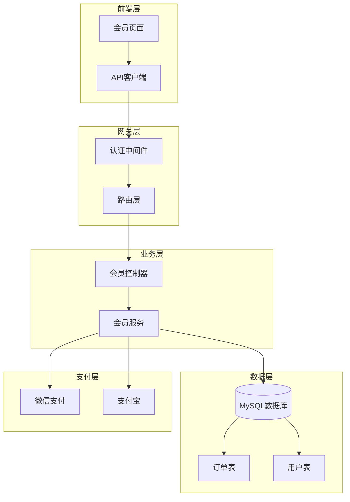
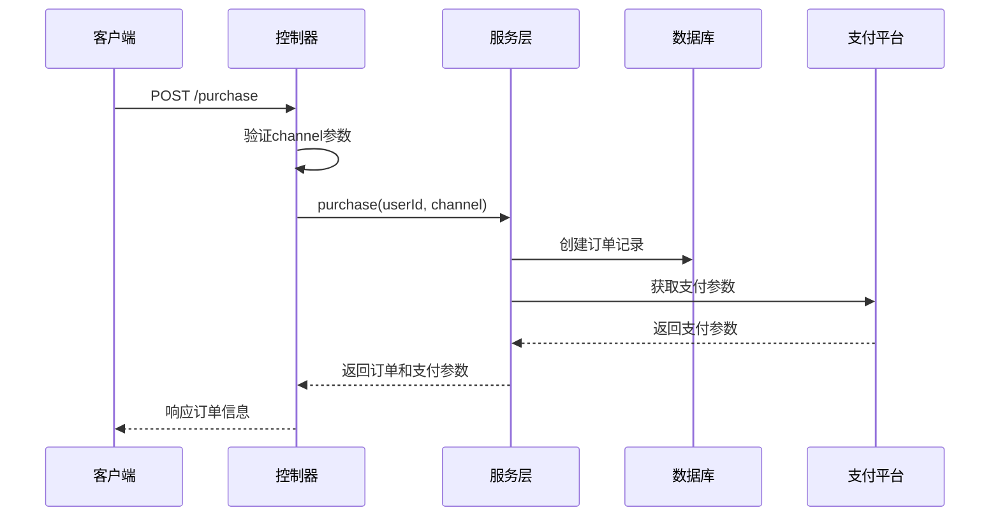
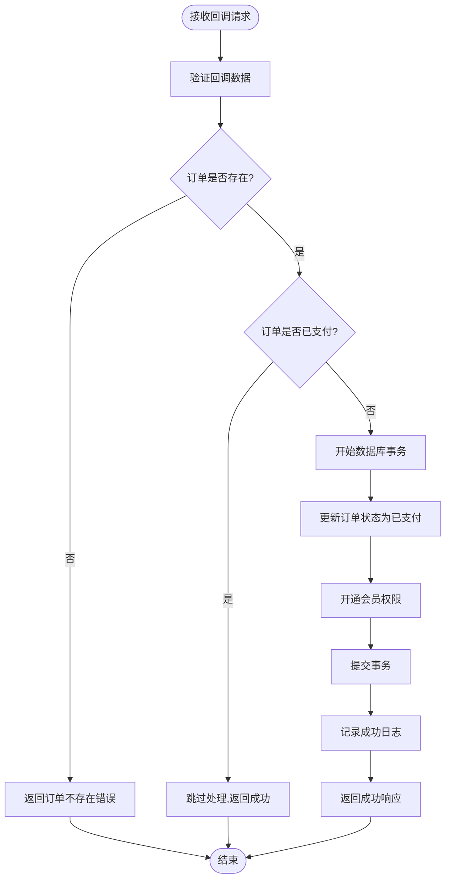
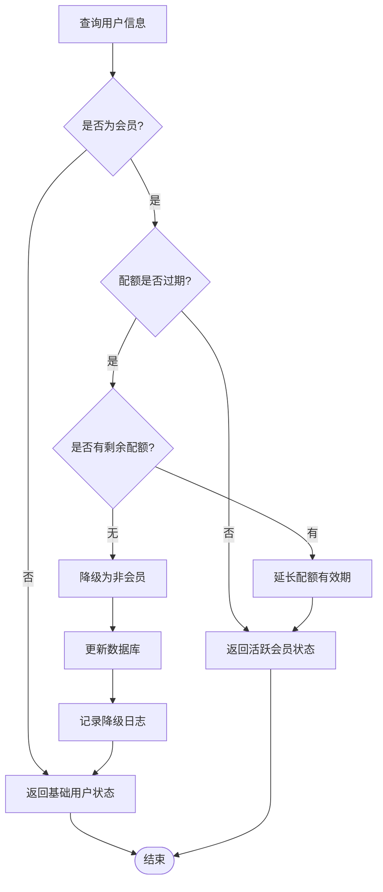
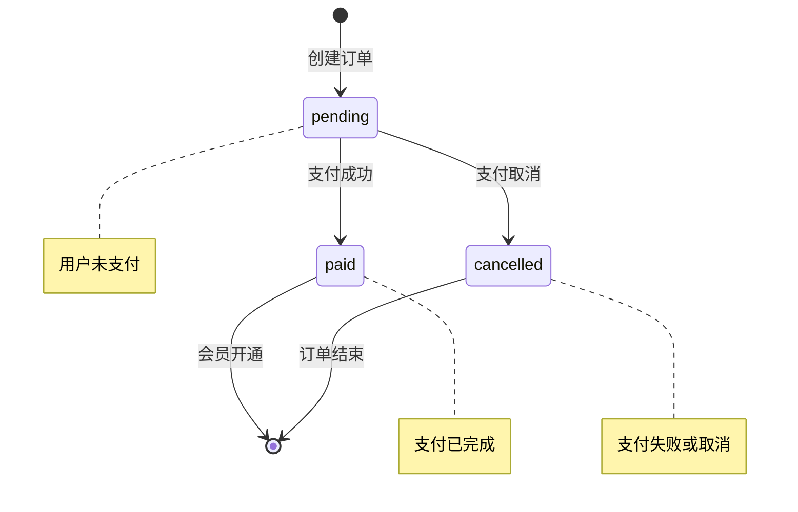
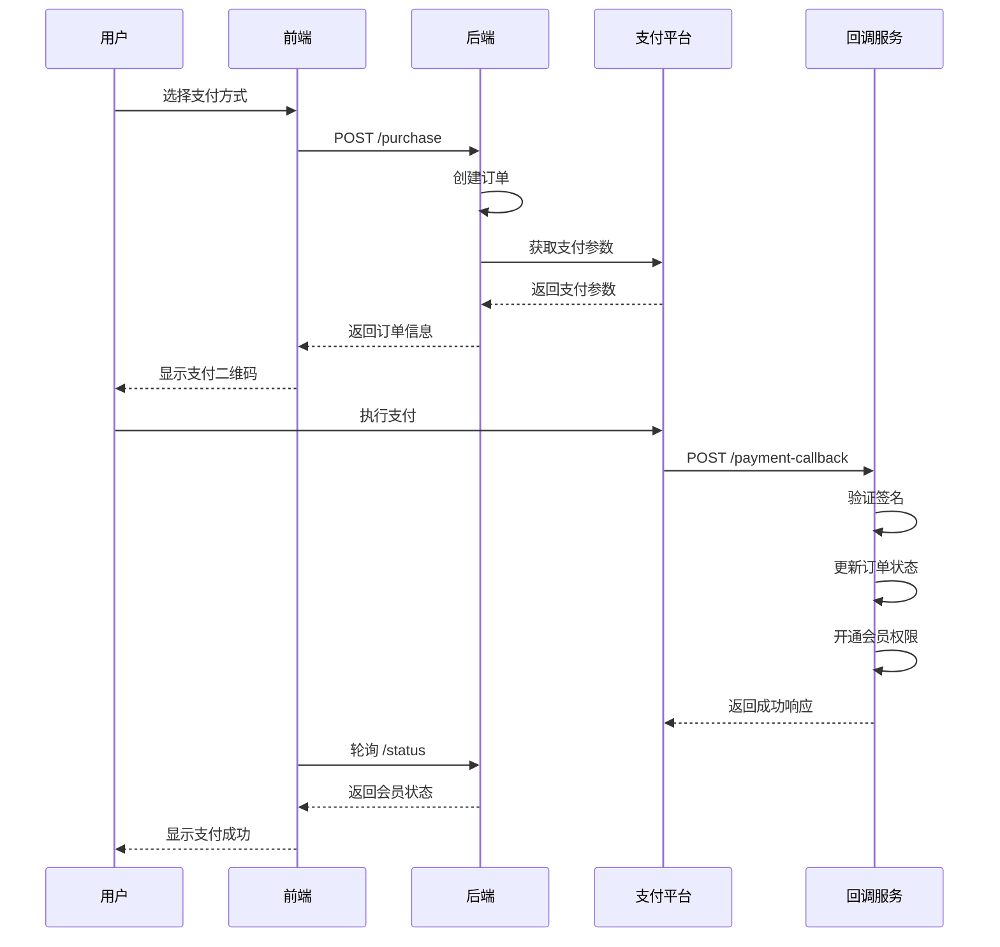
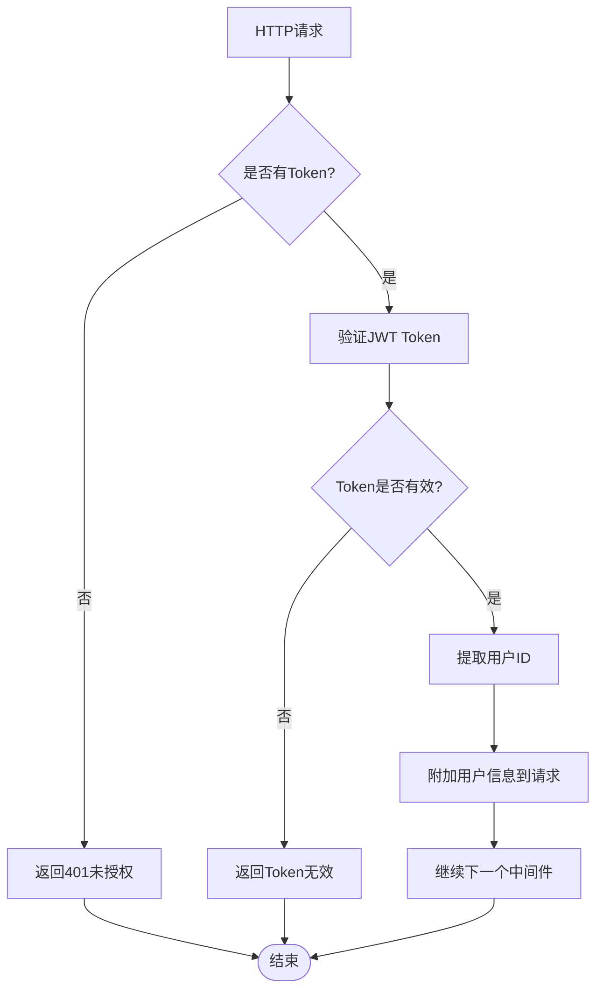

# 会员接口

<cite>
**本文档引用的文件**
- [membership.controller.js](file://backend/src/controllers/membership.controller.js)
- [membership.routes.js](file://backend/src/routes/membership.routes.js)
- [membership.service.js](file://backend/src/services/membership.service.js)
- [auth.middleware.js](file://backend/src/middlewares/auth.middleware.js)
- [create_orders_table.js](file://backend/src/db/migrations/20251028000002_create_orders_table.js)
- [create_users_table.js](file://backend/src/db/migrations/20251028000001_create_users_table.js)
- [page.tsx](file://frontend/src/app/membership/page.tsx)
- [api.ts](file://frontend/src/lib/api.ts)
- [package.json](file://backend/package.json)
</cite>

## 目录
1. [简介](#简介)
2. [系统架构](#系统架构)
3. [接口概览](#接口概览)
4. [购买会员接口](#购买会员接口)
5. [支付回调接口](#支付回调接口)
6. [会员状态查询接口](#会员状态查询接口)
7. [数据模型](#数据模型)
8. [业务流程](#业务流程)
9. [安全机制](#安全机制)
10. [常见问题与解决方案](#常见问题与解决方案)
11. [总结](#总结)

## 简介

会员接口是AI服装处理SaaS平台的核心功能模块，为用户提供付费订阅服务。该系统支持微信支付和支付宝两种支付渠道，采用订单状态机管理支付流程，并具备完善的会员状态管理和自动降级机制。

系统设计遵循RESTful API规范，所有会员相关接口均需要JWT认证保护，确保用户信息安全。支付流程采用异步处理模式，通过轮询机制实时监控支付状态，提供流畅的用户体验。

## 系统架构



**图表来源**
- [membership.controller.js](file://backend/src/controllers/membership.controller.js#L1-L78)
- [membership.routes.js](file://backend/src/routes/membership.routes.js#L1-L28)
- [auth.middleware.js](file://backend/src/middlewares/auth.middleware.js#L1-L77)

## 接口概览

| 接口路径 | 方法 | 认证 | 描述 |
|---------|------|------|------|
| `/api/membership/purchase` | POST | 是 | 购买会员，创建支付订单 |
| `/api/membership/payment-callback` | POST | 否 | 支付回调，处理支付结果 |
| `/api/membership/status` | GET | 是 | 查询会员状态 |

**节来源**
- [membership.routes.js](file://backend/src/routes/membership.routes.js#L6-L26)

## 购买会员接口

### 接口详情

**URL:** `POST /api/membership/purchase`

**认证:** 需要JWT Token

**请求参数:**

| 参数名 | 类型 | 必填 | 描述 |
|--------|------|------|------|
| `channel` | string | 是 | 支付渠道，可选值：`wx`(微信)、`alipay`(支付宝) |

**请求示例:**
```json
{
  "channel": "wx"
}
```

**响应数据:**

| 字段名 | 类型 | 描述 |
|--------|------|------|
| `success` | boolean | 请求是否成功 |
| `data.orderId` | string | 订单ID |
| `data.payParams` | object | 支付参数 |

**支付参数结构:**

对于微信支付:
```json
{
  "appId": "wx_app_id",
  "timeStamp": "1640995200",
  "nonceStr": "random_string",
  "package": "prepay_id=wx_1234567890",
  "signType": "RSA",
  "paySign": "signature_string"
}
```

对于支付宝:
```json
{
  "orderString": "app_id=xxx&method=alipay.trade.app.pay&out_trade_no=order_id"
}
```

**错误码:**

| 错误码 | 描述 |
|--------|------|
| 5003 | 支付渠道参数错误 |

### 实现细节



**图表来源**
- [membership.controller.js](file://backend/src/controllers/membership.controller.js#L10-L35)
- [membership.service.js](file://backend/src/services/membership.service.js#L11-L41)

**节来源**
- [membership.controller.js](file://backend/src/controllers/membership.controller.js#L10-L35)
- [membership.service.js](file://backend/src/services/membership.service.js#L11-L88)

## 支付回调接口

### 接口详情

**URL:** `POST /api/membership/payment-callback`

**认证:** 无需认证

**请求参数:**

| 参数名 | 类型 | 必填 | 描述 |
|--------|------|------|------|
| `orderId` | string | 是 | 订单ID |
| `transactionId` | string | 是 | 第三方交易号 |
| `channel` | string | 是 | 支付渠道 |

**请求示例:**
```json
{
  "orderId": "order_1234567890",
  "transactionId": "wx_transaction_1234567890",
  "channel": "wx"
}
```

**响应数据:**

| 字段名 | 类型 | 描述 |
|--------|------|------|
| `success` | boolean | 请求是否成功 |

### 设计安全性

#### 签名验证
系统预留了签名验证机制，用于防止支付回调被恶意篡改：

```javascript
// TODO: 根据不同渠道验证签名
// await this.verifySignature(callbackData, channel);
```

#### 幂等性处理
系统实现了严格的幂等性检查，避免重复处理同一笔订单：

```javascript
// 幂等性检查
if (order.status === 'paid') {
  logger.info(`订单已处理,跳过: orderId=${orderId}`);
  return { success: true, message: '订单已处理' };
}
```

#### 事务处理
会员开通操作采用数据库事务，确保数据一致性：

```javascript
await db.transaction(async (trx) => {
  // 更新订单状态
  await trx('orders').where('id', orderId).update({
    status: 'paid',
    transactionId,
    paidAt: new Date()
  });

  // 开通会员
  await trx('users').where('id', order.userId).update({
    isMember: true,
    quota_remaining: quota,
    quota_expireAt: expireAt,
    updated_at: new Date()
  });
});
```

### 回调处理流程



**图表来源**
- [membership.service.js](file://backend/src/services/membership.service.js#L90-L133)

**节来源**
- [membership.controller.js](file://backend/src/controllers/membership.controller.js#L37-L50)
- [membership.service.js](file://backend/src/services/membership.service.js#L90-L133)

## 会员状态查询接口

### 接口详情

**URL:** `GET /api/membership/status`

**认证:** 需要JWT Token

**响应数据:**

| 字段名 | 类型 | 描述 |
|--------|------|------|
| `success` | boolean | 请求是否成功 |
| `data.isMember` | boolean | 是否为会员 |
| `data.quota_remaining` | number | 剩余配额数量 |
| `data.quota_expireAt` | datetime | 配额到期时间 |
| `data.expireDays` | number | 剩余有效天数 |
| `data.price` | number | 会员价格(分) |

**响应示例:**
```json
{
  "success": true,
  "data": {
    "isMember": true,
    "quota_remaining": 85,
    "quota_expireAt": "2024-01-15T10:30:00.000Z",
    "expireDays": 12,
    "price": 9900
  }
}
```

### 自动降级机制

系统实现了智能的会员自动降级机制：



**图表来源**
- [membership.service.js](file://backend/src/services/membership.service.js#L135-L170)

**节来源**
- [membership.controller.js](file://backend/src/controllers/membership.controller.js#L52-L65)
- [membership.service.js](file://backend/src/services/membership.service.js#L135-L170)

## 数据模型

### 用户表 (users)

| 字段名 | 类型 | 约束 | 描述 |
|--------|------|------|------|
| `id` | string(32) | PRIMARY KEY | 用户ID |
| `phone` | string(11) | UNIQUE, NOT NULL | 手机号 |
| `isMember` | boolean | DEFAULT false | 是否会员 |
| `quota_remaining` | integer | UNSIGNED, DEFAULT 0 | 剩余配额 |
| `quota_expireAt` | datetime | NULLABLE | 配额到期时间 |
| `created_at` | datetime | NOT NULL | 创建时间 |
| `updated_at` | datetime | NOT NULL | 更新时间 |

### 订单表 (orders)

| 字段名 | 类型 | 约束 | 描述 |
|--------|------|------|------|
| `id` | string(32) | PRIMARY KEY | 订单ID |
| `userId` | string(32) | FOREIGN KEY | 用户ID |
| `status` | string(20) | NOT NULL | 订单状态 |
| `amount` | decimal(10,2) | NOT NULL | 金额(分) |
| `channel` | string(20) | NOT NULL | 支付渠道 |
| `transactionId` | string(64) | UNIQUE, NULLABLE | 第三方交易号 |
| `createdAt` | datetime | NOT NULL | 创建时间 |
| `paidAt` | datetime | NULLABLE | 支付时间 |

**节来源**
- [create_users_table.js](file://backend/src/db/migrations/20251028000001_create_users_table.js#L5-L23)
- [create_orders_table.js](file://backend/src/db/migrations/20251028000002_create_orders_table.js#L4-L30)

## 业务流程

### 订单状态机



### 支付流程



**图表来源**
- [membership.controller.js](file://backend/src/controllers/membership.controller.js#L10-L65)
- [membership.service.js](file://backend/src/services/membership.service.js#L90-L133)

## 安全机制

### JWT认证

系统采用JWT令牌进行身份验证：



**图表来源**
- [auth.middleware.js](file://backend/src/middlewares/auth.middleware.js#L6-L40)

### 访问控制

| 接口 | 认证要求 | 权限级别 |
|------|----------|----------|
| `/purchase` | JWT认证 | 用户级别 |
| `/payment-callback` | 无需认证 | 公开访问 |
| `/status` | JWT认证 | 用户级别 |

**节来源**
- [auth.middleware.js](file://backend/src/middlewares/auth.middleware.js#L6-L77)
- [membership.routes.js](file://backend/src/routes/membership.routes.js#L6-L26)

## 常见问题与解决方案

### 回调地址配置错误

**问题描述:** 支付平台无法正确调用支付回调接口

**解决方案:**
1. 确保回调URL在支付平台配置正确
2. 检查服务器防火墙设置，确保外部可访问
3. 验证HTTPS证书有效性
4. 确认域名解析正常

### 签名验证失败

**问题描述:** 支付回调被系统拒绝，提示签名验证失败

**解决方案:**
1. 检查支付密钥配置是否正确
2. 验证回调数据格式是否符合支付平台要求
3. 确认时间戳和随机字符串生成逻辑
4. 查看服务器日志获取详细错误信息

### 支付成功但会员未开通

**问题描述:** 用户支付成功，但会员状态未更新

**排查步骤:**
1. 检查回调接口是否正常接收请求
2. 查看数据库事务是否正常提交
3. 验证用户表更新语句是否执行
4. 检查系统日志中的错误信息

### 轮询机制失效

**问题描述:** 前端轮询无法检测到支付状态变化

**解决方案:**
1. 确认JWT Token有效且未过期
2. 检查网络连接和跨域设置
3. 验证API响应格式正确
4. 确认轮询间隔时间合理

### 会员自动降级异常

**问题描述:** 会员到期后未正确降级

**排查方法:**
1. 检查定时任务是否正常运行
2. 验证数据库索引是否有效
3. 确认降级逻辑代码执行路径
4. 查看降级相关日志记录

## 总结

会员接口系统提供了完整的付费订阅解决方案，具有以下特点：

### 核心优势
- **多渠道支付支持:** 同时支持微信支付和支付宝
- **高安全性:** 采用JWT认证和签名验证机制
- **可靠性:** 实现幂等性处理和数据库事务
- **用户体验:** 提供实时状态查询和自动降级机制

### 技术亮点
- **异步处理:** 支付回调采用异步处理模式
- **状态机管理:** 严谨的订单状态流转控制
- **智能降级:** 自动化的会员状态管理
- **扩展性强:** 模块化设计便于功能扩展

### 最佳实践
1. 正确配置支付平台回调地址
2. 实施完善的错误处理和日志记录
3. 定期监控系统性能和可用性
4. 保持支付SDK和依赖库的及时更新

该会员接口系统为AI服装处理SaaS平台提供了稳定可靠的付费订阅功能，支撑着平台的核心商业模式发展。