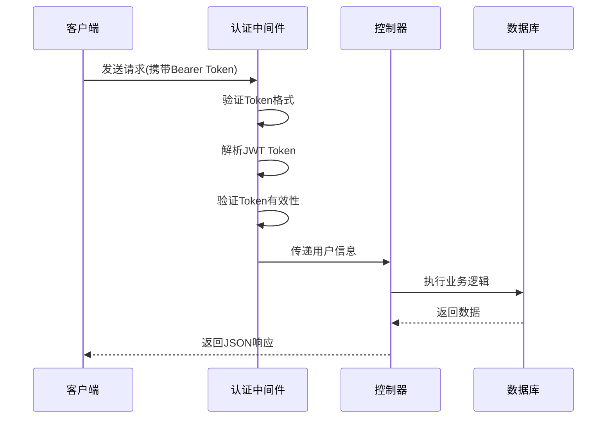
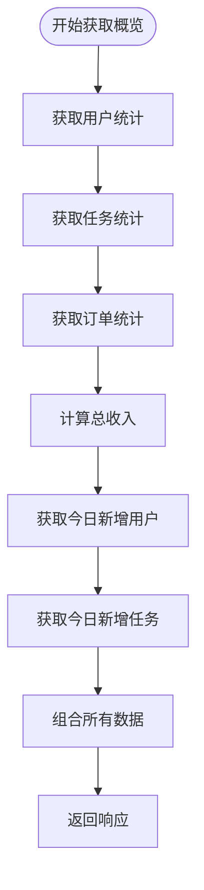
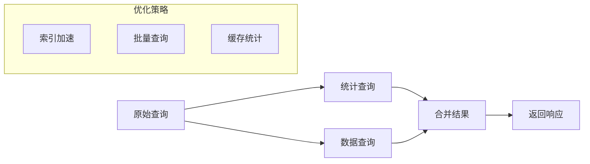
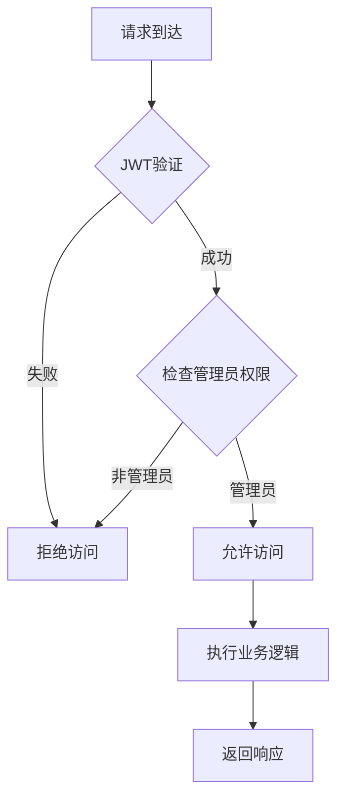

# 管理后台接口文档

<cite>
**本文档中引用的文件**
- [admin.controller.js](file://backend/src/controllers/admin.controller.js)
- [admin.routes.js](file://backend/src/routes/admin.routes.js)
- [auth.middleware.js](file://backend/src/middlewares/auth.middleware.js)
- [app.js](file://backend/src/app.js)
- [20251028000001_create_users_table.js](file://backend/src/db/migrations/20251028000001_create_users_table.js)
- [20251028000003_create_tasks_table.js](file://backend/src/db/migrations/20251028000003_create_tasks_table.js)
</cite>

## 目录
1. [简介](#简介)
2. [认证机制](#认证机制)
3. [接口概览](#接口概览)
4. [系统概览接口](#系统概览接口)
5. [用户管理接口](#用户管理接口)
6. [任务管理接口](#任务管理接口)
7. [失败任务接口](#失败任务接口)
8. [数据库设计](#数据库设计)
9. [性能优化](#性能优化)
10. [安全建议](#安全建议)
11. [调用示例](#调用示例)

## 简介

管理后台API提供了对系统核心功能的管理访问，包括用户管理、任务监控和系统统计等功能。所有接口均采用JWT认证机制，在生产环境中建议增加管理员角色权限校验。

## 认证机制

### JWT认证流程

所有管理后台接口都需要通过JWT认证，认证流程如下：



**图表来源**
- [auth.middleware.js](file://backend/src/middlewares/auth.middleware.js#L6-L45)

### 认证中间件实现

认证中间件负责验证请求头中的JWT Token，验证失败时返回相应的错误信息。

**节来源**
- [auth.middleware.js](file://backend/src/middlewares/auth.middleware.js#L6-L76)

## 接口概览

管理后台提供以下四个核心接口：

| 接口路径 | 方法 | 功能描述 | 认证要求 |
|---------|------|----------|----------|
| `/api/admin/overview` | GET | 获取系统整体统计信息 | JWT认证 |
| `/api/admin/users` | GET | 获取用户列表及统计信息 | JWT认证 |
| `/api/admin/tasks` | GET | 获取任务列表及统计信息 | JWT认证 |
| `/api/admin/failed-tasks` | GET | 获取失败任务列表 | JWT认证 |

**节来源**
- [admin.routes.js](file://backend/src/routes/admin.routes.js#L10-L24)

## 系统概览接口

### 接口说明

获取系统的整体统计信息，包括用户统计、任务统计、订单统计和今日新增数据。

### 请求格式

```
GET /api/admin/overview
Authorization: Bearer <JWT_TOKEN>
```

### 响应结构

```json
{
  "success": true,
  "data": {
    "userStats": {
      "totalUsers": 100,
      "memberUsers": 80,
      "activeMembers": 60,
      "memberRate": "80.00%"
    },
    "taskStats": {
      "totalTasks": 500,
      "successTasks": 450,
      "failedTasks": 30,
      "processingTasks": 20,
      "successRate": "90.00%"
    },
    "orderStats": {
      "totalOrders": 200,
      "paidOrders": 180,
      "revenue": 17820
    },
    "todayStats": {
      "newUsers": 5,
      "newTasks": 25
    }
  }
}
```

### 数据聚合方式

系统概览接口通过多个独立的统计方法计算各项指标：



**图表来源**
- [admin.controller.js](file://backend/src/controllers/admin.controller.js#L208-L251)

**节来源**
- [admin.controller.js](file://backend/src/controllers/admin.controller.js#L208-L251)

## 用户管理接口

### 接口说明

获取用户列表，支持分页查询和会员状态筛选。

### 请求格式

```
GET /api/admin/users?limit=20&offset=0&isMember=true
Authorization: Bearer <JWT_TOKEN>
```

### 查询参数

| 参数名 | 类型 | 默认值 | 描述 |
|--------|------|--------|------|
| limit | number | 20 | 每页记录数 |
| offset | number | 0 | 分页偏移量 |
| isMember | boolean | - | 是否为会员(可选) |

### 响应结构

```json
{
  "success": true,
  "data": {
    "users": [
      {
        "id": "user123",
        "phone": "13800138000",
        "isMember": true,
        "quota_remaining": 100,
        "quota_expireAt": "2024-12-31T23:59:59Z",
        "created_at": "2024-01-01T00:00:00Z",
        "updated_at": "2024-01-01T00:00:00Z"
      }
    ],
    "total": 1000,
    "limit": 20,
    "offset": 0,
    "stats": {
      "totalUsers": 1000,
      "memberUsers": 800,
      "activeMembers": 600,
      "memberRate": "80.00%"
    }
  }
}
```

### 用户统计指标

用户统计接口计算以下关键指标：

- **总用户数**: 系统中所有用户的数量
- **会员用户数**: 已开通会员的用户数量
- **活跃会员数**: 会员且配额未过期的用户数量
- **会员转化率**: 会员用户占总用户的百分比

**节来源**
- [admin.controller.js](file://backend/src/controllers/admin.controller.js#L8-L53)

## 任务管理接口

### 接口说明

获取任务列表，支持多维度筛选和统计。

### 请求格式

```
GET /api/admin/tasks?limit=20&offset=0&status=success&type=basic_clean&userId=user123
Authorization: Bearer <JWT_TOKEN>
```

### 查询参数

| 参数名 | 类型 | 默认值 | 描述 |
|--------|------|--------|------|
| limit | number | 20 | 每页记录数 |
| offset | number | 0 | 分页偏移量 |
| status | string | - | 任务状态(pending/processing/success/failed) |
| type | string | - | 任务类型(basic_clean/model_pose12) |
| userId | string | - | 用户ID筛选 |

### 响应结构

```json
{
  "success": true,
  "data": {
    "tasks": [
      {
        "id": "task123",
        "userId": "user123",
        "type": "basic_clean",
        "status": "success",
        "inputUrl": "https://example.com/image.jpg",
        "resultUrls": ["https://example.com/result.jpg"],
        "params": {},
        "createdAt": "2024-01-01T00:00:00Z",
        "updatedAt": "2024-01-01T00:01:00Z",
        "userPhone": "13800138000"
      }
    ],
    "total": 500,
    "limit": 20,
    "offset": 0,
    "stats": {
      "totalTasks": 500,
      "successTasks": 450,
      "failedTasks": 30,
      "processingTasks": 20,
      "successRate": "90.00%"
    }
  }
}
```

### 任务统计指标

任务统计接口计算以下关键指标：

- **总任务数**: 系统中所有任务的数量
- **成功任务数**: 执行成功的任务数量
- **失败任务数**: 执行失败的任务数量
- **处理中任务数**: 待处理或正在处理的任务数量
- **成功率**: 成功任务占总任务的百分比

**节来源**
- [admin.controller.js](file://backend/src/controllers/admin.controller.js#L98-L158)

## 失败任务接口

### 接口说明

获取失败任务列表，用于监控和故障排查。

### 请求格式

```
GET /api/admin/failed-tasks?limit=20&offset=0
Authorization: Bearer <JWT_TOKEN>
```

### 查询参数

| 参数名 | 类型 | 默认值 | 描述 |
|--------|------|--------|------|
| limit | number | 20 | 每页记录数 |
| offset | number | 0 | 分页偏移量 |

### 响应结构

```json
{
  "success": true,
  "data": {
    "tasks": [
      {
        "id": "task123",
        "userId": "user123",
        "type": "basic_clean",
        "status": "failed",
        "inputUrl": "https://example.com/image.jpg",
        "errorReason": "AI模型处理失败",
        "createdAt": "2024-01-01T00:00:00Z",
        "updatedAt": "2024-01-01T00:01:00Z",
        "userPhone": "13800138000"
      }
    ],
    "total": 30,
    "limit": 20,
    "offset": 0
  }
}
```

**节来源**
- [admin.controller.js](file://backend/src/controllers/admin.controller.js#L159-L189)

## 数据库设计

### 用户表(users)

用户表包含用户的基本信息和会员状态：

| 字段名 | 类型 | 约束 | 描述 |
|--------|------|------|------|
| id | string(32) | PRIMARY KEY | 用户唯一标识符 |
| phone | string(11) | UNIQUE, NOT NULL | 手机号码 |
| isMember | boolean | DEFAULT false | 是否为会员 |
| quota_remaining | integer | UNSIGNED, DEFAULT 0 | 剩余配额数量 |
| quota_expireAt | datetime | NULLABLE | 配额到期时间 |
| created_at | timestamp | NOT NULL | 创建时间 |
| updated_at | timestamp | NOT NULL | 更新时间 |

**索引设计**:
- 主键索引: id
- 唯一索引: phone
- 普通索引: phone

**节来源**
- [20251028000001_create_users_table.js](file://backend/src/db/migrations/20251028000001_create_users_table.js#L4-L13)

### 任务表(tasks)

任务表记录用户提交的所有任务信息：

| 字段名 | 类型 | 约束 | 描述 |
|--------|------|------|------|
| id | string(32) | PRIMARY KEY | 任务唯一标识符 |
| userId | string(32) | NOT NULL | 关联用户ID(FK) |
| type | string(20) | NOT NULL | 任务类型 |
| status | string(20) | NOT NULL | 任务状态 |
| inputUrl | text | NOT NULL | 输入图片URL |
| resultUrls | json | NULLABLE | 结果图片URL数组 |
| vendorTaskId | string(64) | NULLABLE | 第三方任务ID |
| params | json | NULLABLE | 任务参数 |
| errorReason | text | NULLABLE | 失败原因 |
| created_at | timestamp | NOT NULL | 创建时间 |
| updated_at | timestamp | NOT NULL | 更新时间 |

**外键约束**: userId -> users.id (CASCADE删除)

**索引设计**:
- 主键索引: id
- 普通索引: userId
- 复合索引: userId, created_at
- 普通索引: vendorTaskId
- 普通索引: status

**节来源**
- [20251028000003_create_tasks_table.js](file://backend/src/db/migrations/20251028000003_create_tasks_table.js#L4-L18)

## 性能优化

### 查询优化策略

1. **分页查询**: 所有列表接口都支持分页，避免一次性加载大量数据
2. **索引使用**: 关键查询字段都建立了适当的索引
3. **统计分离**: 统计信息和数据列表分开查询，减少复杂度
4. **条件过滤**: 支持多种筛选条件，减少不必要的数据传输

### 数据聚合优化



**图表来源**
- [admin.controller.js](file://backend/src/controllers/admin.controller.js#L55-L96)

### 性能监控建议

- 监控数据库查询执行时间
- 关注索引使用情况
- 定期分析慢查询日志
- 考虑添加Redis缓存统计信息

**节来源**
- [admin.controller.js](file://backend/src/controllers/admin.controller.js#L8-L53)

## 安全建议

### 当前安全设计

目前的认证机制仅验证用户的登录状态，未区分普通用户和管理员用户。

### 建议的安全改进

1. **角色权限控制**: 添加管理员角色验证中间件
2. **操作审计**: 记录管理员的所有操作日志
3. **访问频率限制**: 对管理接口添加限流保护
4. **HTTPS强制**: 生产环境必须启用HTTPS
5. **Token刷新**: 实现Token自动刷新机制

### RBAC实现建议



**图表来源**
- [admin.routes.js](file://backend/src/routes/admin.routes.js#L10-L24)

**节来源**
- [admin.routes.js](file://backend/src/routes/admin.routes.js#L10-L24)

## 调用示例

### 获取系统概览

```bash
curl -X GET "https://api.example.com/api/admin/overview" \
  -H "Authorization: Bearer YOUR_JWT_TOKEN"
```

### 获取用户列表

```bash
curl -X GET "https://api.example.com/api/admin/users?limit=10&offset=0&isMember=true" \
  -H "Authorization: Bearer YOUR_JWT_TOKEN"
```

### 获取任务列表

```bash
curl -X GET "https://api.example.com/api/admin/tasks?limit=20&offset=0&status=success&type=basic_clean" \
  -H "Authorization: Bearer YOUR_JWT_TOKEN"
```

### 获取失败任务列表

```bash
curl -X GET "https://api.example.com/api/admin/failed-tasks?limit=15&offset=0" \
  -H "Authorization: Bearer YOUR_JWT_TOKEN"
```

### 错误处理示例

```json
{
  "success": false,
  "error": {
    "code": 1001,
    "message": "未登录"
  }
}
```

## 总结

管理后台API提供了完整的系统管理功能，具有良好的扩展性和性能表现。建议在生产环境中实施更严格的安全控制措施，特别是管理员权限验证机制，以确保系统的安全性。