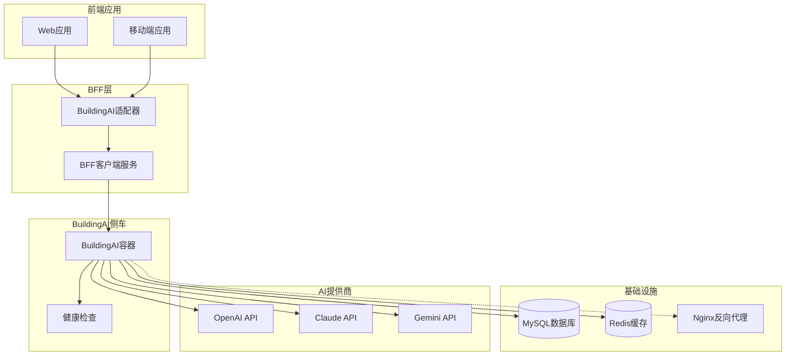
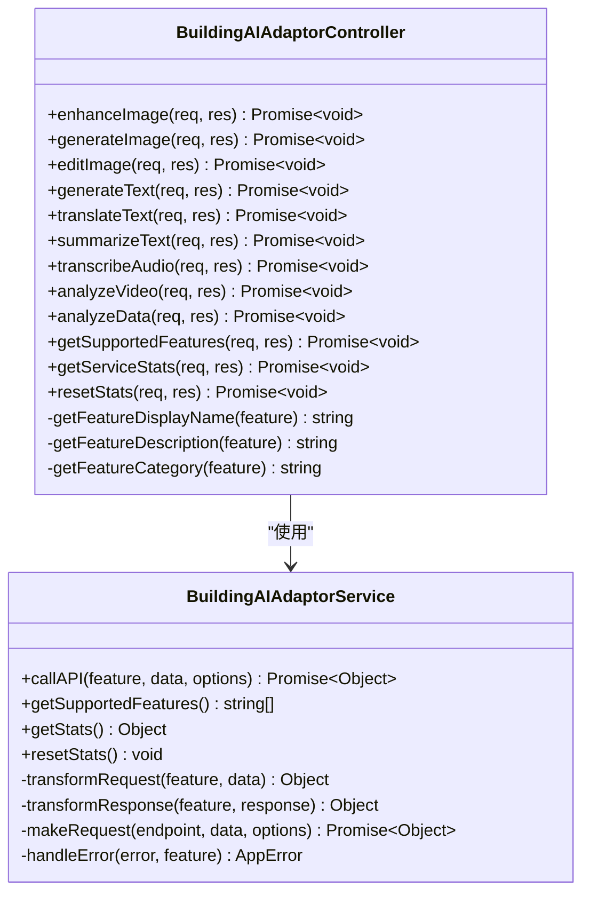
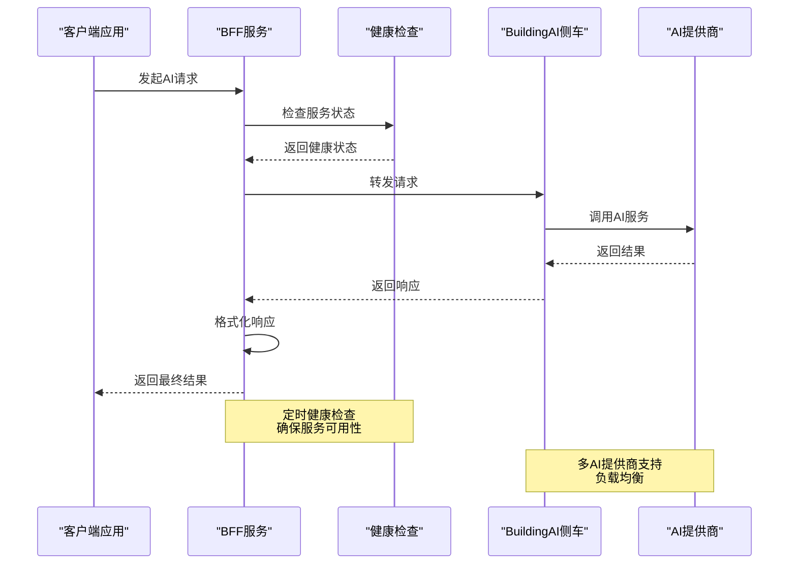
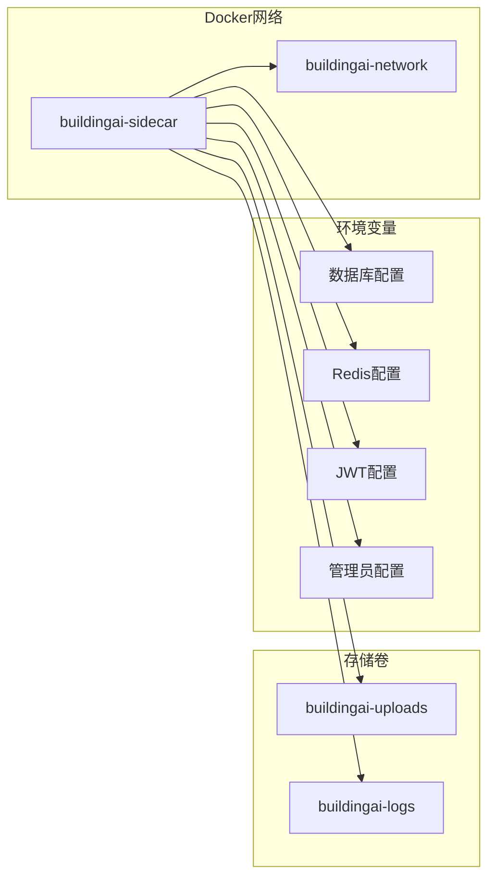
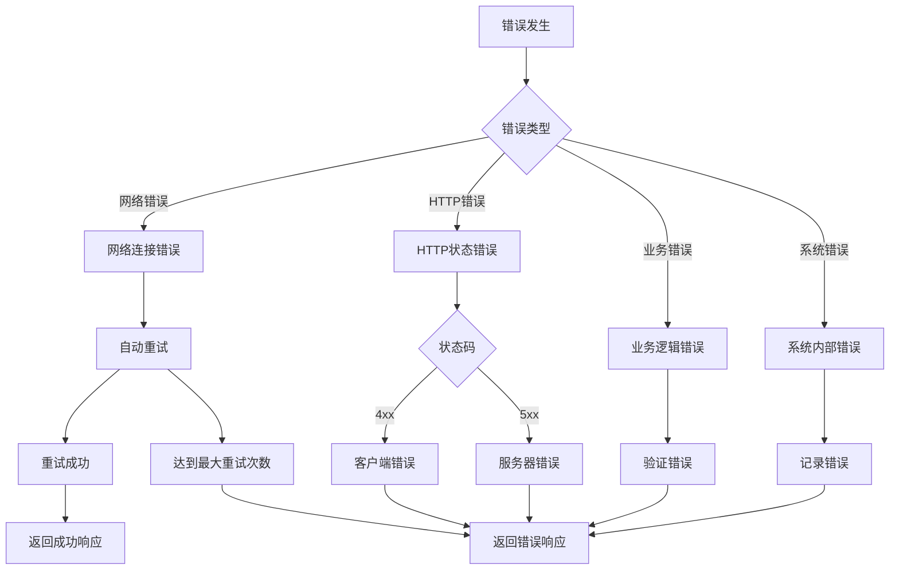
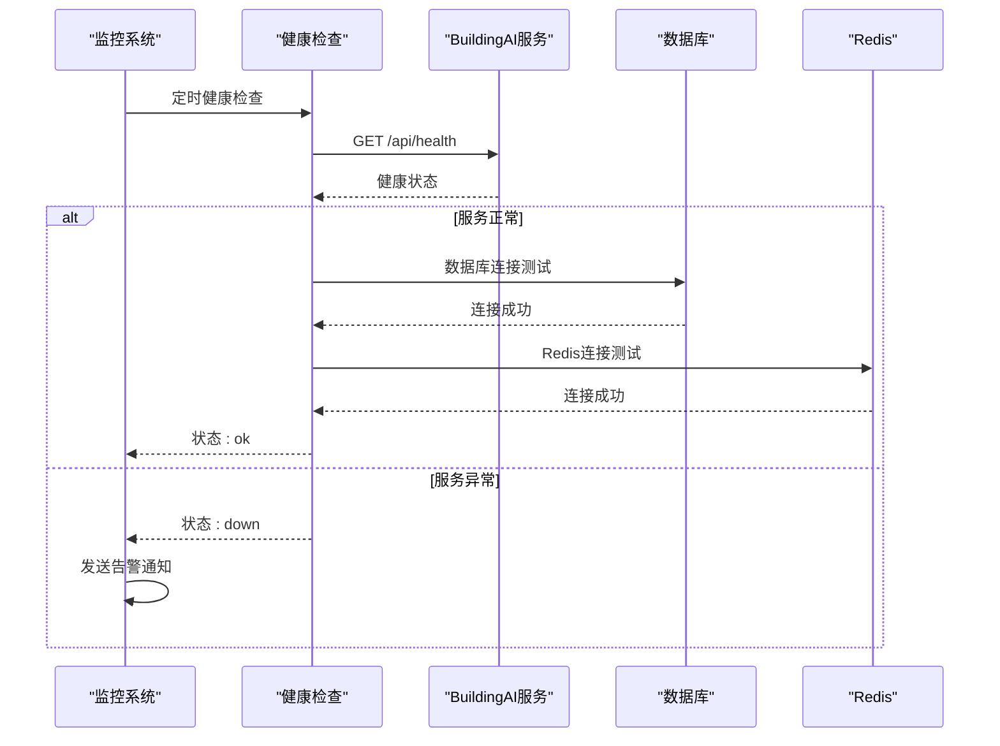
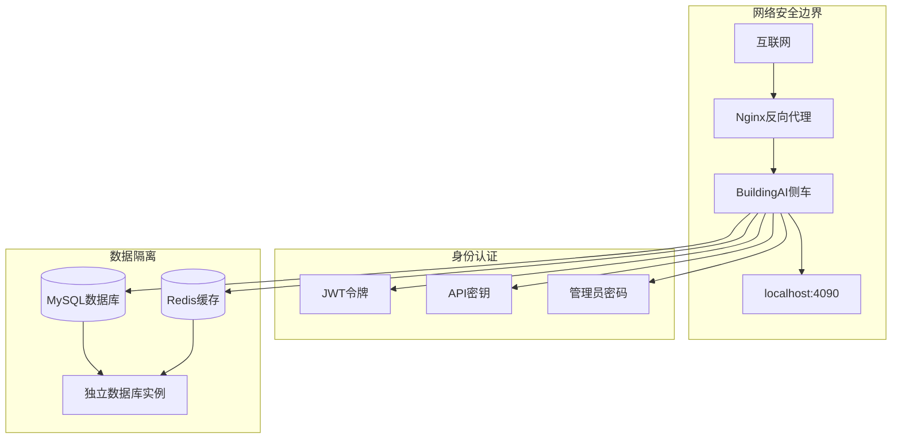
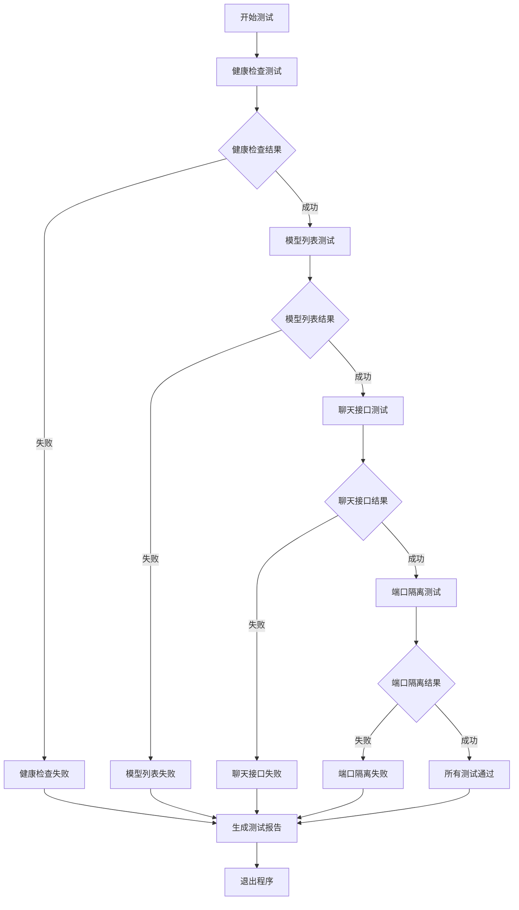

# BuildingAI侧车集成

<cite>
**本文档引用的文件**
- [buildingai-adaptor.controller.js](file://backend/src/controllers/buildingai-adaptor.controller.js)
- [buildingai-adaptor.service.js](file://backend/src/services/buildingai-adaptor.service.js)
- [buildingai-client.service.ts](file://backend/src/services/buildingai-client.service.ts)
- [buildingai-adaptor.routes.js](file://backend/src/routes/buildingai-adaptor.routes.js)
- [docker-compose.yml](file://deploy/buildingai/docker-compose.yml)
- [test-buildingai-connection.js](file://backend/scripts/test-buildingai-connection.js)
- [app.js](file://backend/src/app.js)
- [env.validator.js](file://backend/src/config/env.validator.js)
- [BE-BLD-001实现总结报告.md](file://backend/BE-BLD-001实现总结报告.md)
</cite>

## 目录
1. [概述](#概述)
2. [架构设计](#架构设计)
3. [核心组件](#核心组件)
4. [部署配置](#部署配置)
5. [API接口](#api接口)
6. [错误处理](#错误处理)
7. [监控与运维](#监控与运维)
8. [安全考虑](#安全考虑)
9. [故障排查](#故障排查)
10. [最佳实践](#最佳实践)

## 概述

BuildingAI侧车集成是一个现代化的AI服务架构解决方案，采用Sidecar模式将BuildingAI服务作为独立的微服务运行，通过BFF（Backend For Frontend）层为上层应用提供统一的AI能力接口。该架构实现了AI服务的高可用性、可扩展性和安全性。

### 主要特性

- **Sidecar架构**：BuildingAI服务作为独立容器运行，与主应用解耦
- **BFF封装**：提供统一的API接口，屏蔽底层服务差异
- **多AI提供商支持**：支持OpenAI、Claude、Gemini等多种AI服务
- **实时监控**：内置健康检查和性能监控
- **安全隔离**：独立的数据库和Redis实例，确保数据安全

## 架构设计



**架构图来源**
- [buildingai-adaptor.controller.js](file://backend/src/controllers/buildingai-adaptor.controller.js#L1-L50)
- [buildingai-client.service.ts](file://backend/src/services/buildingai-client.service.ts#L1-L50)

### 组件职责

| 组件 | 职责 | 技术栈 |
|------|------|--------|
| BuildingAI适配器控制器 | 处理HTTP请求，参数验证 | Express.js |
| BuildingAI适配器服务 | API调用封装，错误处理 | Node.js + Axios |
| BFF客户端服务 | 与BuildingAI侧车通信 | TypeScript + Axios |
| BuildingAI侧车 | 实际的AI服务运行 | Docker容器 |
| 健康检查系统 | 服务状态监控 | 定时轮询 |

## 核心组件

### BuildingAI适配器控制器

适配器控制器负责处理来自前端的AI请求，提供统一的API接口。



**类图来源**
- [buildingai-adaptor.controller.js](file://backend/src/controllers/buildingai-adaptor.controller.js#L15-L529)
- [buildingai-adaptor.service.js](file://backend/src/services/buildingai-adaptor.service.js#L15-L714)

**节来源**
- [buildingai-adaptor.controller.js](file://backend/src/controllers/buildingai-adaptor.controller.js#L1-L529)
- [buildingai-adaptor.service.js](file://backend/src/services/buildingai-adaptor.service.js#L1-L714)

### BFF客户端服务

BFF客户端服务提供与BuildingAI侧车的通信能力，实现请求转发和响应处理。



**序列图来源**
- [buildingai-client.service.ts](file://backend/src/services/buildingai-client.service.ts#L100-L200)
- [buildingai-adaptor.service.js](file://backend/src/services/buildingai-adaptor.service.js#L200-L300)

**节来源**
- [buildingai-client.service.ts](file://backend/src/services/buildingai-client.service.ts#L1-L334)

### API路由系统

API路由系统定义了BuildingAI服务的所有接口规范。

| 接口路径 | 方法 | 功能 | 验证规则 |
|----------|------|------|----------|
| `/api/ai/image/enhance` | POST | 图片增强 | imageUrl或imageBase64必填 |
| `/api/ai/image/generate` | POST | 图片生成 | prompt必填，长度1-1000字符 |
| `/api/ai/image/edit` | POST | 图片编辑 | prompt必填，长度1-1000字符 |
| `/api/ai/text/generate` | POST | 文本生成 | prompt必填，温度0-2 |
| `/api/ai/text/translate` | POST | 文本翻译 | text和targetLanguage必填 |
| `/api/ai/text/summarize` | POST | 文本摘要 | text必填，长度100-50000字符 |
| `/api/ai/audio/transcribe` | POST | 音频转录 | audioUrl或audioBase64必填 |
| `/api/ai/video/analyze` | POST | 视频分析 | videoUrl或videoBase64必填 |
| `/api/ai/data/analyze` | POST | 数据分析 | data必填，必须是对象 |
| `/api/ai/features` | GET | 获取功能列表 | 需要认证 |

**节来源**
- [buildingai-adaptor.routes.js](file://backend/src/routes/buildingai-adaptor.routes.js#L1-L857)

## 部署配置

### Docker Compose配置

BuildingAI侧车通过Docker Compose进行部署，支持独立运行和网络隔离。



**图表来源**
- [docker-compose.yml](file://deploy/buildingai/docker-compose.yml#L1-L118)

### 环境变量配置

| 配置项 | 描述 | 默认值 | 必需 |
|--------|------|--------|------|
| `DB_HOST` | MySQL主机地址 | host.docker.internal | 是 |
| `DB_PORT` | MySQL端口 | 3306 | 是 |
| `DB_USERNAME` | 数据库用户名 | root | 是 |
| `DB_PASSWORD` | 数据库密码 | - | 是 |
| `DB_DATABASE` | 数据库名称 | ai_photo | 是 |
| `REDIS_HOST` | Redis主机地址 | host.docker.internal | 是 |
| `REDIS_PORT` | Redis端口 | 6379 | 是 |
| `REDIS_DB` | Redis数据库编号 | 1 | 是 |
| `JWT_SECRET` | JWT密钥 | - | 是 |
| `ADMIN_PASSWORD` | 管理员密码 | - | 是 |
| `PORT` | 服务端口 | 4090 | 否 |

**节来源**
- [docker-compose.yml](file://deploy/buildingai/docker-compose.yml#L15-L80)

### 资源配置

BuildingAI侧车配置了合理的资源限制，确保稳定运行：

- **CPU限制**：2核心
- **内存限制**：2GB
- **CPU保留**：0.5核心
- **内存保留**：512MB
- **健康检查间隔**：30秒
- **超时时间**：10秒
- **重试次数**：3次

## API接口

### 图像处理接口

#### 图片增强
```http
POST /api/ai/image/enhance
Content-Type: application/json

{
  "imageUrl": "https://example.com/image.jpg",
  "level": "medium",
  "outputFormat": "png"
}
```

#### 图片生成
```http
POST /api/ai/image/generate
Content-Type: application/json

{
  "prompt": "一只可爱的猫坐在沙发上",
  "style": "realistic",
  "size": "1024x1024",
  "quality": "standard",
  "count": 1
}
```

#### 图片编辑
```http
POST /api/ai/image/edit
Content-Type: application/json

{
  "imageUrl": "https://example.com/original.jpg",
  "maskUrl": "https://example.com/mask.png",
  "prompt": "将背景替换为海滩景色",
  "count": 1
}
```

### 文本处理接口

#### 文本生成
```http
POST /api/ai/text/generate
Content-Type: application/json

{
  "prompt": "写一篇关于人工智能的文章",
  "maxTokens": 500,
  "temperature": 0.7,
  "model": "gpt-3.5-turbo"
}
```

#### 文本翻译
```http
POST /api/ai/text/translate
Content-Type: application/json

{
  "text": "Hello, how are you?",
  "sourceLanguage": "auto",
  "targetLanguage": "zh",
  "format": "text"
}
```

#### 文本摘要
```http
POST /api/ai/text/summarize
Content-Type: application/json

{
  "text": "这是一篇很长的文章...",
  "length": "medium",
  "style": "professional"
}
```

### 音频处理接口

#### 音频转录
```http
POST /api/ai/audio/transcribe
Content-Type: application/json

{
  "audioUrl": "https://example.com/audio.mp3",
  "language": "auto",
  "outputFormat": "text"
}
```

### 视频处理接口

#### 视频分析
```http
POST /api/ai/video/analyze
Content-Type: application/json

{
  "videoUrl": "https://example.com/video.mp4",
  "analysisType": "content",
  "detailLevel": "medium"
}
```

### 数据分析接口

#### 数据分析
```http
POST /api/ai/data/analyze
Content-Type: application/json

{
  "data": {
    "sales": [100, 200, 150, 300],
    "region": ["North", "South", "East", "West"]
  },
  "analysisType": "statistical",
  "outputFormat": "json"
}
```

## 错误处理

BuildingAI侧车实现了完善的错误处理机制，确保系统的稳定性和用户体验。

### 错误分类



**流程图来源**
- [buildingai-adaptor.service.js](file://backend/src/services/buildingai-adaptor.service.js#L500-L600)

### 错误码定义

| 错误码 | 描述 | 处理方式 |
|--------|------|----------|
| `VALIDATION_ERROR` | 参数验证失败 | 返回具体验证错误信息 |
| `AI_PROCESSING_FAILED` | AI处理失败 | 记录错误日志，返回友好提示 |
| `RATE_LIMIT_EXCEEDED` | 请求频率过高 | 返回等待时间，建议客户端重试 |
| `EXTERNAL_SERVICE_ERROR` | 外部服务错误 | 自动重试，必要时降级处理 |
| `CONNECTION_FAILED` | 连接失败 | 检查网络，记录诊断信息 |
| `SERVICE_UNAVAILABLE` | 服务不可用 | 返回服务状态，建议稍后重试 |

**节来源**
- [buildingai-adaptor.service.js](file://backend/src/services/buildingai-adaptor.service.js#L500-L714)

## 监控与运维

### 健康检查系统

BuildingAI侧车内置了完整的健康检查系统，确保服务的高可用性。



**序列图来源**
- [buildingai-adaptor.service.js](file://backend/src/services/buildingai-adaptor.service.js#L150-L200)

### 性能监控指标

| 指标类别 | 监控项目 | 阈值 | 告警条件 |
|----------|----------|------|----------|
| 响应时间 | 平均响应时间 | < 2秒 | > 5秒 |
| 错误率 | 请求失败率 | < 1% | > 5% |
| 资源使用 | CPU使用率 | < 80% | > 90% |
| 资源使用 | 内存使用率 | < 85% | > 95% |
| 连接数 | 数据库连接数 | < 80% | > 90% |
| 缓存命中率 | Redis命中率 | > 90% | < 80% |

### 日志管理

BuildingAI侧车采用结构化日志记录，支持多种日志级别和格式：

- **日志级别**：ERROR、WARN、INFO、DEBUG
- **日志格式**：JSON格式，便于机器解析
- **日志轮转**：按大小和时间自动轮转
- **敏感信息过滤**：自动脱敏API密钥等敏感信息

**节来源**
- [buildingai-adaptor.service.js](file://backend/src/services/buildingai-adaptor.service.js#L650-L714)

## 安全考虑

### 网络安全

BuildingAI侧车采用了多层次的安全防护措施：



**图表来源**
- [docker-compose.yml](file://deploy/buildingai/docker-compose.yml#L10-L20)

### 安全配置

| 安全措施 | 实现方式 | 配置位置 |
|----------|----------|----------|
| 端口绑定 | 仅监听localhost:4090 | docker-compose.yml |
| 管理员密码 | 强密码策略 | .env.buildingai |
| JWT密钥 | 随机生成32字符密钥 | .env.buildingai |
| 数据库隔离 | 独立数据库实例 | docker-compose.yml |
| Redis隔离 | 独立Redis数据库 | docker-compose.yml |
| CORS禁用 | ENABLE_CORS=false | .env.buildingai |
| Swagger禁用 | ENABLE_SWAGGER=false | .env.buildingai |

### 敏感信息保护

- **API密钥**：自动加密存储，前端显示为"***已配置***"
- **数据库密码**：环境变量配置，不硬编码
- **JWT密钥**：随机生成，定期轮换
- **日志脱敏**：自动过滤敏感信息

**节来源**
- [docker-compose.yml](file://deploy/buildingai/docker-compose.yml#L30-L80)

## 故障排查

### 常见问题及解决方案

#### 问题1：服务启动失败

**症状**：Docker容器无法启动或立即退出

**可能原因**：
- 环境变量配置错误
- 端口被占用
- 数据库连接失败
- Redis连接失败

**排查步骤**：
```bash
# 1. 查看容器日志
docker logs buildingai-sidecar

# 2. 检查端口占用
netstat -ano | findstr 4090  # Windows
lsof -i :4090                # Linux/Mac

# 3. 测试数据库连接
mysql -h localhost -u root -p ai_photo

# 4. 测试Redis连接
redis-cli -h localhost -p 6379
```

#### 问题2：健康检查失败

**症状**：`curl http://localhost:4090/api/health` 返回错误

**可能原因**：
- 服务未完全启动
- 数据库表未初始化
- 权限配置错误

**解决方法**：
```bash
# 等待60秒启动期
sleep 60

# 检查健康检查配置
docker inspect buildingai-sidecar | grep -A 10 "Healthcheck"

# 进入容器检查
docker exec -it buildingai-sidecar sh
curl localhost:4090/api/health
```

#### 问题3：BFF调用失败

**症状**：buildingai-client.service报错

**可能原因**：
- BuildingAI未启动
- 网络不通
- 认证失败

**解决方法**：
```bash
# 运行连接测试脚本
node backend/scripts/test-buildingai-connection.js

# 检查BFF日志
tail -f logs/app.log | grep BuildingAI

# 测试网络连通性
curl -v http://localhost:4090/api/health
```

### 连接测试脚本

系统提供了完整的连接测试脚本，用于验证BuildingAI侧车的各项功能：



**流程图来源**
- [test-buildingai-connection.js](file://backend/scripts/test-buildingai-connection.js#L200-L275)

**节来源**
- [test-buildingai-connection.js](file://backend/scripts/test-buildingai-connection.js#L1-L275)

## 最佳实践

### 部署最佳实践

1. **环境隔离**
   - 生产环境使用独立的数据库和Redis实例
   - 管理员密码必须修改为强密码
   - 禁用不必要的功能（CORS、Swagger等）

2. **资源规划**
   - 根据预期并发量配置资源限制
   - 设置合理的超时时间和重试策略
   - 监控资源使用情况，及时扩容

3. **安全配置**
   - 使用HTTPS传输，避免明文传输
   - 定期更新API密钥和JWT密钥
   - 实施网络访问控制

### 运维最佳实践

1. **监控告警**
   - 集成Prometheus + Grafana监控
   - 设置关键指标的告警阈值
   - 建立完善的日志聚合系统

2. **备份恢复**
   - 定期备份数据库和配置
   - 测试备份恢复流程
   - 制定灾难恢复计划

3. **性能优化**
   - 使用CDN加速静态资源
   - 实施缓存策略
   - 优化数据库查询

### 开发最佳实践

1. **API设计**
   - 遵循RESTful API设计原则
   - 实现完善的错误处理
   - 提供详细的API文档

2. **代码质量**
   - 实施代码审查制度
   - 编写单元测试和集成测试
   - 使用静态代码分析工具

3. **版本管理**
   - 使用语义化版本控制
   - 维护变更日志
   - 实施持续集成/持续部署

**节来源**
- [BE-BLD-001实现总结报告.md](file://backend/BE-BLD-001实现总结报告.md#L485-L538)

BuildingAI侧车集成为我们的AI服务架构提供了强大的支撑，通过合理的架构设计、完善的监控体系和严格的安全措施，确保了系统的高可用性和可维护性。随着AI技术的不断发展，这套架构也为未来的功能扩展和技术升级奠定了坚实的基础。