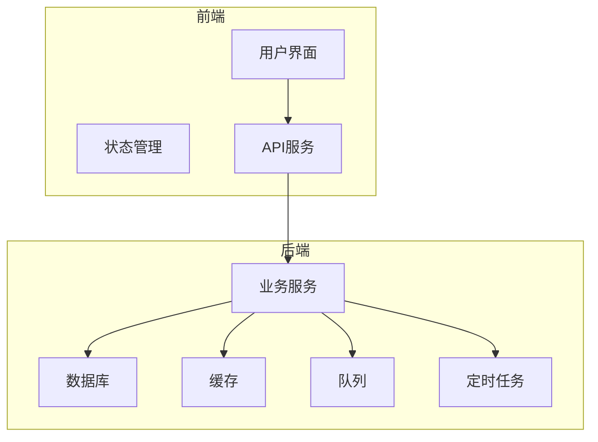
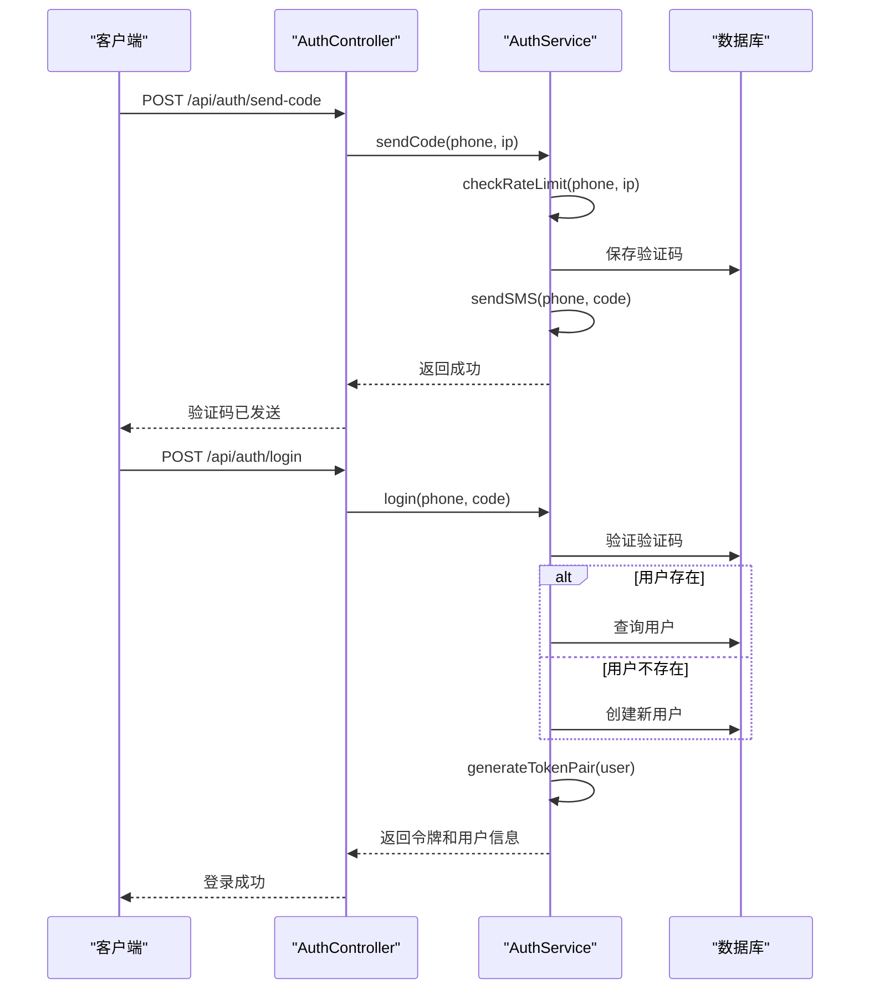
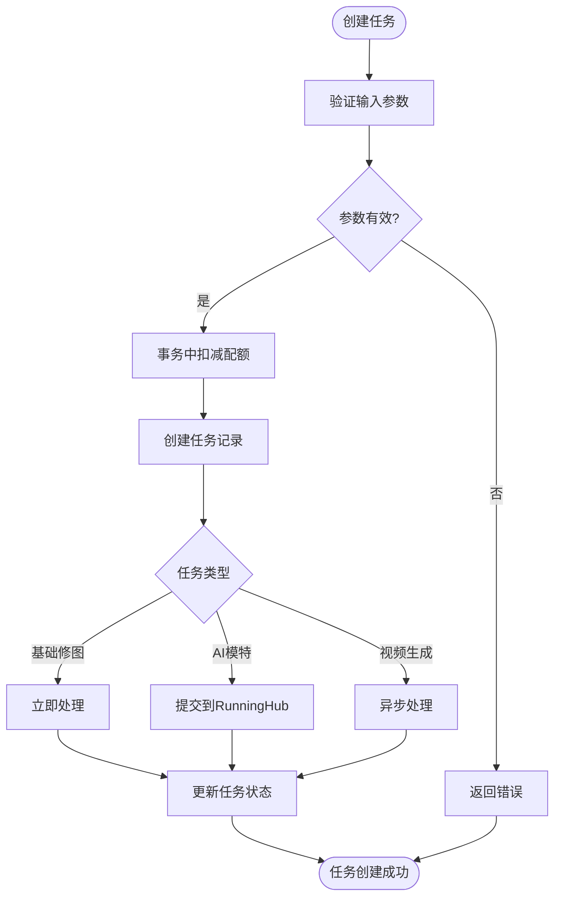
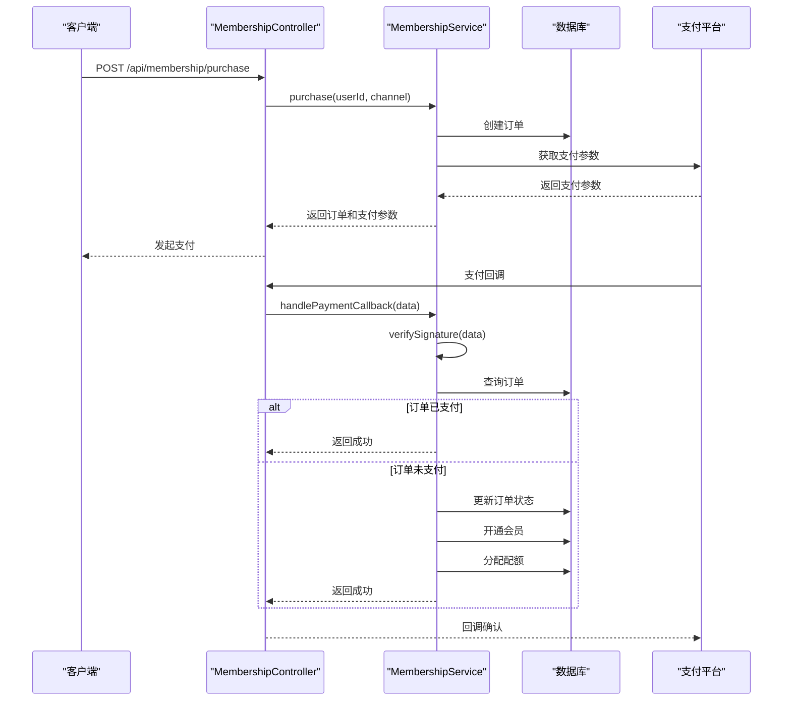
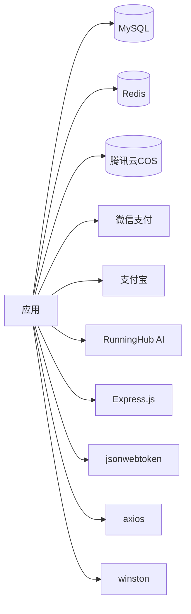

# CMS系统概述

<cite>
**本文档引用的文件**
- [README.md](file://README.md)
- [backend/README.md](file://backend/README.md)
- [frontend/README.md](file://frontend/README.md)
- [backend/package.json](file://backend/package.json)
- [frontend/package.json](file://frontend/package.json)
- [backend/src/app.js](file://backend/src/app.js)
- [backend/src/server.js](file://backend/src/server.js)
- [backend/src/db.ts](file://backend/src/db.ts)
- [backend/knexfile.js](file://backend/knexfile.js)
- [backend/src/services/auth.service.js](file://backend/src/services/auth.service.js)
- [backend/src/controllers/auth.controller.js](file://backend/src/controllers/auth.controller.js)
- [backend/src/services/task.service.js](file://backend/src/services/task.service.js)
- [backend/src/controllers/task.controller.js](file://backend/src/controllers/task.controller.js)
- [backend/src/services/membership.service.js](file://backend/src/services/membership.service.js)
- [backend/src/controllers/membership.controller.js](file://backend/src/controllers/membership.controller.js)
- [backend/src/db/migrations/20251028000001_create_users_table.js](file://backend/src/db/migrations/20251028000001_create_users_table.js)
- [backend/src/db/migrations/20251028000002_create_orders_table.js](file://backend/src/db/migrations/20251028000002_create_orders_table.js)
- [backend/src/db/migrations/20251028000003_create_tasks_table.js](file://backend/src/db/migrations/20251028000003_create_tasks_table.js)
- [backend/src/db/migrations/20251028000004_create_verification_codes_table.js](file://backend/src/db/migrations/20251028000004_create_verification_codes_table.js)
- [backend/src/db/migrations/20251028000006_create_system_configs_table.js](file://backend/src/db/migrations/20251028000006_create_system_configs_table.js)
- [backend/src/db/migrations/20251029000001_create_feature_definitions_table.js](file://backend/src/db/migrations/20251029000001_create_feature_definitions_table.js)
- [backend/src/db/migrations/20251029000002_create_form_schemas_table.js](file://backend/src/db/migrations/20251029000002_create_form_schemas_table.js)
- [backend/src/db/migrations/20251029110001_create_distributors_table.js](file://backend/src/db/migrations/20251029110001_create_distributors_table.js)
- [backend/src/db/migrations/20251029110002_create_referral_relationships_table.js](file://backend/src/db/migrations/20251029110002_create_referral_relationships_table.js)
- [backend/src/db/migrations/20251029110003_create_commissions_table.js](file://backend/src/db/migrations/20251029110003_create_commissions_table.js)
- [backend/src/db/migrations/20251029110004_create_withdrawals_table.js](file://backend/src/db/migrations/20251029110004_create_withdrawals_table.js)
- [backend/src/db/migrations/20251029110005_create_distribution_settings_table.js](file://backend/src/db/migrations/20251029110005_create_distribution_settings_table.js)
- [backend/src/db/migrations/20251030000001_add_final_amount_to_orders.js](file://backend/src/db/migrations/20251030000001_add_final_amount_to_orders.js)
- [backend/src/db/migrations/20251031000001_create_config_snapshots_table.js](file://backend/src/db/migrations/20251031000001_create_config_snapshots_table.js)
- [backend/src/db/migrations/20251031000002_create_announcements_table.js](file://backend/src/db/migrations/20251031000002_create_announcements_table.js)
- [backend/src/db/migrations/20251031000003_create_banners_table.js](file://backend/src/db/migrations/20251031000003_create_banners_table.js)
- [backend/src/db/migrations/20251031000004_create_membership_tables.js](file://backend/src/db/migrations/20251031000004_create_membership_tables.js)
- [backend/src/db/migrations/20251031000005_create_content_texts_table.js](file://backend/src/db/migrations/20251031000005_create_content_texts_table.js)
- [backend/src/db/migrations/20251101000001_add_auth_fields_to_users.js](file://backend/src/db/migrations/20251101000001_add_auth_fields_to_users.js)
- [backend/src/db/migrations/20251102000001_create_refresh_tokens.js](file://backend/src/db/migrations/20251102000001_create_refresh_tokens.js)
- [backend/src/db/migrations/20251102000002_add_user_profile_fields.js](file://backend/src/db/migrations/20251102000002_add_user_profile_fields.js)
- [backend/src/db/migrations/20251102000003_add_referrer_validation.js](file://backend/src/db/migrations/20251102000003_add_referrer_validation.js)
</cite>

## 目录
1. [简介](#简介)
2. [项目结构](#项目结构)
3. [核心组件](#核心组件)
4. [架构概述](#架构概述)
5. [详细组件分析](#详细组件分析)
6. [依赖分析](#依赖分析)
7. [性能考虑](#性能考虑)
8. [故障排除指南](#故障排除指南)
9. [结论](#结论)

## 简介

服装AI处理SaaS平台是一个为服装电商提供AI图片处理服务的系统。该平台采用会员制订阅模式，用户每月支付99元可获得100次配额。系统采用前后端分离架构，结合微服务和云原生技术，为用户提供基础修图、AI模特生成和视频生成等AI处理功能。

平台的核心业务逻辑围绕用户认证、会员管理、任务处理和配额管理展开。系统通过JWT进行身份验证，使用腾讯云COS进行媒体存储，并集成微信支付API v3实现支付功能。配额管理系统确保了资源的合理分配和使用，支持事务级配额扣减和返还，防止并发竞争。

该系统采用现代化的技术栈，后端使用Express.js框架，数据库为MySQL 8.0配合Knex.js，前端采用Next.js 14（App Router）和Ant Design UI库。系统设计遵循微服务架构原则，各功能模块解耦，便于扩展和维护。

**本节引用文件**
- [README.md](file://README.md)

## 项目结构

该SaaS平台采用模块化项目结构，将不同功能和职责的代码分离到独立的目录中。项目根目录包含backend、frontend、miniapp、scf、deploy、tests、skills、tasks等主要目录，每个目录都有明确的职责。

后端服务（backend）包含API服务、数据库迁移、配置文件和各种脚本。前端应用（frontend）基于Next.js框架构建，包含页面、组件、状态管理和API调用服务。SCF目录包含云函数和大文件异步任务处理逻辑。Skills目录定义了不同角色（如产品规划师、前端开发工程师、后端开发工程师等）的技能包和工作流程。

系统采用Git分支管理策略，所有开发在develop分支进行，完成后通过Pull Request合并到main分支。提交规范要求使用特定前缀（如feat、fix、docs等）来标识提交类型，便于代码审查和版本管理。

```mermaid
graph TB
subgraph "项目根目录"
Backend[backend]
Frontend[frontend]
Miniapp[miniapp]
Scf[scf]
Deploy[deploy]
Tests[tests]
Skills[skills]
Tasks[tasks]
Docs[docs]
end
Backend --> Controllers[controllers]
Backend --> Services[services]
Backend --> Models[models]
Backend --> Middleware[middleware]
Backend --> Routes[routes]
Backend --> Utils[utils]
Backend --> Config[config]
Backend --> Migrations[migrations]
Frontend --> App[app]
Frontend --> Components[components]
Frontend --> Hooks[hooks]
Frontend --> Store[store]
Frontend --> Services[services]
Frontend --> Types[types]
Scf --> ImageCompositor[image-compositor]
Scf --> TextProcessor[text-processor]
Scf --> VideoCompositor[video-compositor]
Skills --> ProductPlanner[product_planner_skill]
Skills --> FrontendDev[frontend_dev_skill]
Skills --> BackendDev[backend_dev_skill]
Skills --> ScfWorker[scf_worker_skill]
Skills --> BillingGuard[billing_guard_skill]
Skills --> QaAcceptance[qa_acceptance_skill]
Skills --> Reviewer[reviewer_skill]
Skills --> CodebuddyDeploy[codebuddy_deploy_skill]
```

**图表来源**
- [README.md](file://README.md)
- [backend/README.md](file://backend/README.md)
- [frontend/README.md](file://frontend/README.md)

**本节引用文件**
- [README.md](file://README.md)
- [backend/README.md](file://backend/README.md)
- [frontend/README.md](file://frontend/README.md)

## 核心组件

系统的核心组件包括认证系统、会员管理系统、任务处理系统和配额管理系统。这些组件通过清晰的接口和约定协同工作，构成了平台的基础功能。

认证系统基于手机号和验证码实现用户注册和登录，使用JWT进行身份验证和会话管理。会员管理系统处理会员购买、配额分配和会员状态检查。任务处理系统负责创建和管理AI处理任务，包括基础修图、AI模特生成和视频生成。配额管理系统确保资源的合理使用，支持事务级配额操作和失败任务的自动返还。

这些核心组件通过服务层（services）和控制器层（controllers）分离业务逻辑和请求处理，提高了代码的可维护性和可测试性。数据库操作通过Knex.js进行，确保了SQL查询的安全性和可移植性。

**本节引用文件**
- [backend/src/services/auth.service.js](file://backend/src/services/auth.service.js)
- [backend/src/services/membership.service.js](file://backend/src/services/membership.service.js)
- [backend/src/services/task.service.js](file://backend/src/services/task.service.js)
- [backend/src/services/quota.service.js](file://backend/src/services/quota.service.js)

## 架构概述

系统采用分层架构设计，从前端到后端再到数据库，每一层都有明确的职责和接口。前端应用通过API与后端服务通信，后端服务处理业务逻辑并与数据库交互。

后端服务基于Express.js框架构建，采用MVC模式组织代码。路由层（routes）定义API端点，控制器层（controllers）处理请求和响应，服务层（services）实现业务逻辑，数据库层（models）管理数据访问。这种分层设计使得系统易于维护和扩展。

系统还集成了缓存、队列和定时任务等基础设施服务。缓存服务使用Redis提高数据访问性能，队列服务用于异步处理耗时任务，定时任务服务定期执行清理和维护操作。这些服务通过依赖注入的方式集成到主应用中，确保了系统的稳定性和可伸缩性。

**图表来源**
- [backend/src/app.js](file://backend/src/app.js)
- [backend/src/server.js](file://backend/src/server.js)

**本节引用文件**
- [backend/src/app.js](file://backend/src/app.js)
- [backend/src/server.js](file://backend/src/server.js)

## 详细组件分析

### 认证组件分析

认证组件负责用户注册、登录和身份验证。系统采用手机号加验证码的方式进行用户认证，避免了密码管理的复杂性。认证流程包括发送验证码、验证验证码和生成JWT令牌三个主要步骤。

**图表来源**
- [backend/src/controllers/auth.controller.js](file://backend/src/controllers/auth.controller.js)
- [backend/src/services/auth.service.js](file://backend/src/services/auth.service.js)

**本节引用文件**
- [backend/src/controllers/auth.controller.js](file://backend/src/controllers/auth.controller.js)
- [backend/src/services/auth.service.js](file://backend/src/services/auth.service.js)

### 任务处理组件分析

任务处理组件是系统的核心功能之一，负责创建和管理AI处理任务。任务类型包括基础修图、AI模特生成和视频生成，每种类型有不同的处理流程和资源消耗。

**图表来源**
- [backend/src/controllers/task.controller.js](file://backend/src/controllers/task.controller.js)
- [backend/src/services/task.service.js](file://backend/src/services/task.service.js)

**本节引用文件**
- [backend/src/controllers/task.controller.js](file://backend/src/controllers/task.controller.js)
- [backend/src/services/task.service.js](file://backend/src/services/task.service.js)

### 会员管理组件分析

会员管理组件处理会员购买、支付回调和会员状态检查。系统集成微信支付和支付宝，支持会员订阅服务。支付成功后，系统自动开通会员并分配配额。

**图表来源**
- [backend/src/controllers/membership.controller.js](file://backend/src/controllers/membership.controller.js)
- [backend/src/services/membership.service.js](file://backend/src/services/membership.service.js)

**本节引用文件**
- [backend/src/controllers/membership.controller.js](file://backend/src/controllers/membership.controller.js)
- [backend/src/services/membership.service.js](file://backend/src/services/membership.service.js)

## 依赖分析

系统依赖多种外部服务和库，包括数据库、缓存、文件存储、支付网关和第三方API。这些依赖通过清晰的接口和配置进行管理，确保了系统的灵活性和可维护性。

数据库使用MySQL 8.0，通过Knex.js进行访问，支持迁移和种子数据管理。缓存使用Redis，通过ioredis库进行连接。文件存储使用腾讯云COS，通过cos-nodejs-sdk-v5库进行操作。支付集成微信支付和支付宝，分别使用wechatpay-node-v3和alipay-sdk库。

系统还依赖多种工具库，如Express.js用于Web服务，JWT用于身份验证，Axios用于HTTP请求，Winston用于日志记录。这些依赖在package.json中明确定义，确保了开发环境的一致性。

**图表来源**
- [backend/package.json](file://backend/package.json)
- [backend/knexfile.js](file://backend/knexfile.js)

**本节引用文件**
- [backend/package.json](file://backend/package.json)
- [backend/knexfile.js](file://backend/knexfile.js)

## 性能考虑

系统在设计时充分考虑了性能因素，采用多种技术手段确保高并发下的稳定性和响应速度。数据库查询通过索引优化和分页处理，避免全表扫描和大数据量加载。

缓存策略在多个层面应用，包括API响应缓存、用户数据缓存和配置数据缓存。通过Redis缓存热点数据，显著减少了数据库访问压力。队列系统用于异步处理耗时任务，如视频生成和AI模型调用，避免阻塞主线程。

系统还实现了限流和熔断机制，防止恶意请求和外部服务故障影响整体稳定性。认证和任务创建等关键接口实施了基于IP和用户的请求频率限制，保护系统免受DDoS攻击。

**本节引用文件**
- [backend/src/middlewares/rateLimiter.middleware.js](file://backend/src/middlewares/rateLimiter.middleware.js)
- [backend/src/middlewares/cache.middleware.js](file://backend/src/middlewares/cache.middleware.js)
- [backend/src/services/queue.service.js](file://backend/src/services/queue.service.js)

## 故障排除指南

当系统出现问题时，应按照以下步骤进行排查：

1. 检查日志文件，定位错误发生的时间和位置
2. 验证数据库连接和查询性能
3. 检查缓存服务状态和数据一致性
4. 确认外部服务（如支付网关、AI服务）的可用性
5. 审查最近的代码变更和部署记录

对于常见问题，如用户无法登录、任务创建失败或支付回调异常，应首先检查相关服务的日志，然后验证配置和网络连接。数据库问题可通过执行健康检查查询和分析慢查询日志来诊断。

**本节引用文件**
- [backend/src/utils/logger.js](file://backend/src/utils/logger.js)
- [backend/src/middlewares/errorHandler.middleware.js](file://backend/src/middlewares/errorHandler.middleware.js)

## 结论

服装AI处理SaaS平台是一个功能完整、架构清晰的现代化Web应用。系统通过合理的分层设计和模块化组织，实现了高内聚、低耦合的代码结构。核心功能围绕用户认证、会员管理、任务处理和配额管理展开，满足了服装电商的AI图片处理需求。

技术选型上，系统采用了成熟的Node.js生态和现代化的前端框架，确保了开发效率和运行性能。安全性和稳定性通过JWT认证、事务处理、缓存和队列等机制得到保障。系统的可扩展性设计使其能够轻松添加新功能和服务。

未来发展方向包括优化AI处理算法、增加更多AI功能、改进用户体验和增强数据分析能力。通过持续迭代和优化，平台有望成为服装电商领域的领先AI解决方案。