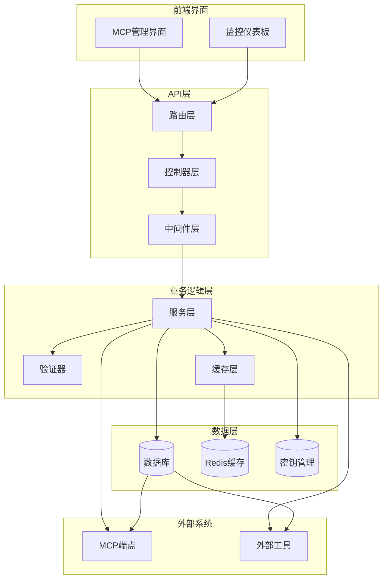
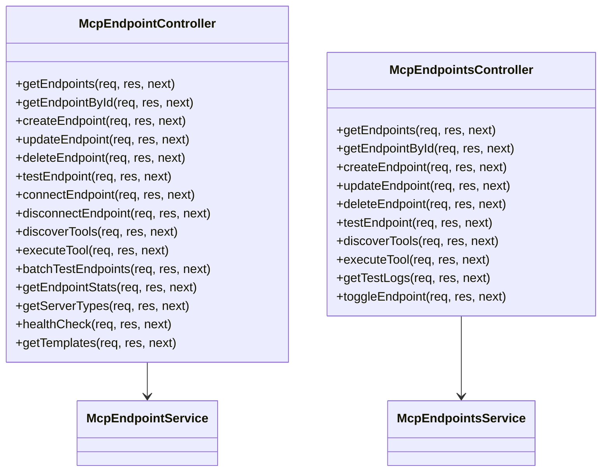
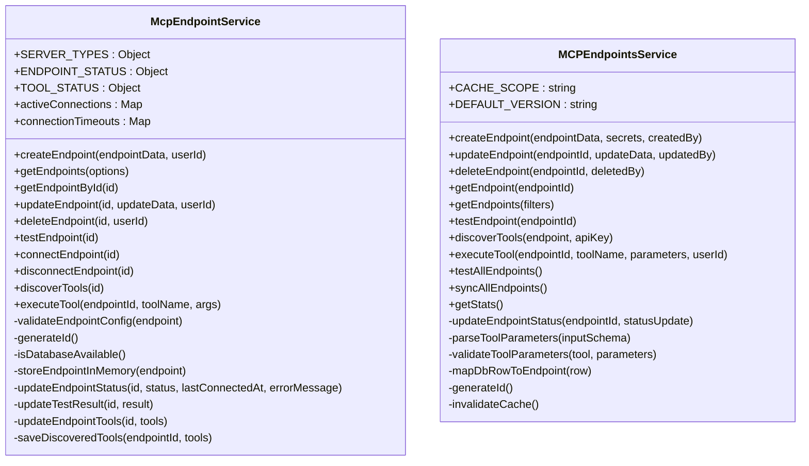
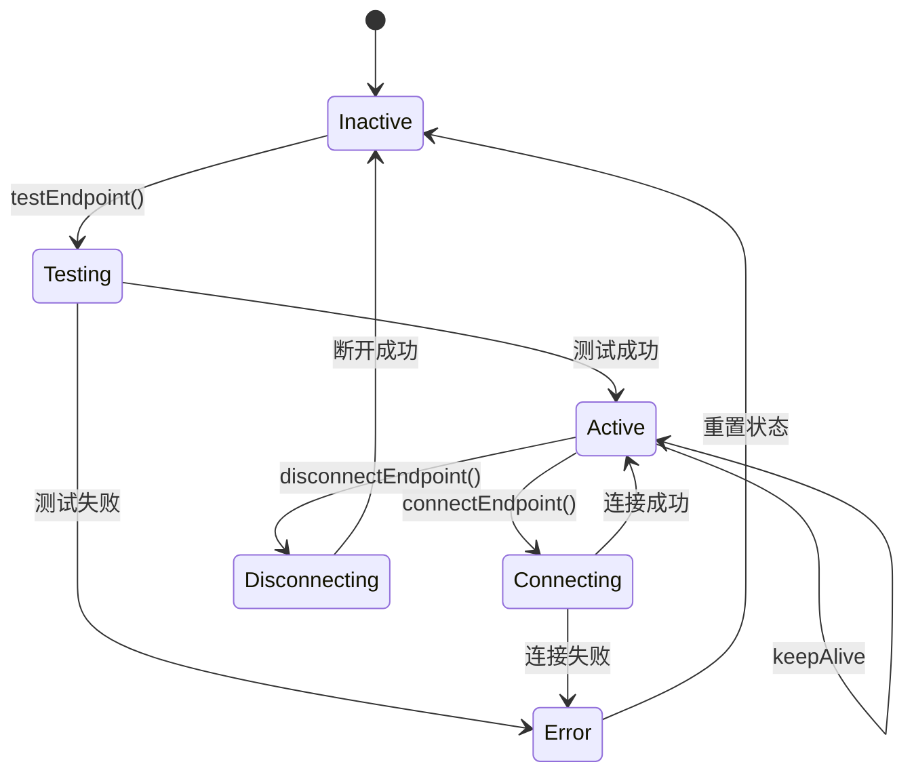
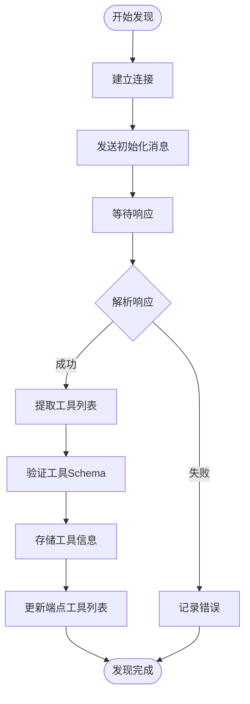

# MCP端点管理系统

<cite>
**本文档引用的文件**
- [mcpEndpoint.controller.js](file://backend/src/controllers/mcpEndpoint.controller.js)
- [mcpEndpoint.service.js](file://backend/src/services/mcpEndpoint.service.js)
- [mcpEndpoints.routes.js](file://backend/src/routes/mcpEndpoints.routes.js)
- [mcp-endpoints.service.ts](file://backend/src/services/mcp-endpoints.service.ts)
- [mcp-endpoints.routes.ts](file://backend/src/routes/admin/mcp-endpoints.routes.js)
- [mcp_endpoints_table.js](file://backend/migrations/20241203_create_mcp_endpoints_table.js)
- [mcp_tools_table.js](file://backend/src/db/migrations/20241203000010_create_mcp_tools_table.js)
- [mcp_test_logs_table.js](file://backend/src/db/migrations/20241203_create_mcp_test_logs_table.js)
- [validate.middleware.js](file://backend/src/middlewares/validate.middleware.js)
- [mcp-tool-call.ts](file://backend/src/engine/nodes/mcp-tool-call.ts)
</cite>

## 目录
1. [简介](#简介)
2. [系统架构](#系统架构)
3. [核心组件](#核心组件)
4. [数据库设计](#数据库设计)
5. [API接口详解](#api接口详解)
6. [连接管理](#连接管理)
7. [工具发现与执行](#工具发现与执行)
8. [安全机制](#安全机制)
9. [性能优化](#性能优化)
10. [故障排除](#故障排除)
11. [最佳实践](#最佳实践)

## 简介

MCP（Model Context Protocol）端点管理系统是一个完整的解决方案，用于管理和协调各种AI模型和工具的连接。该系统支持多种连接方式（STDIO、HTTP、WebSocket），提供完整的CRUD操作、工具发现、连接测试和执行功能。

### 主要特性

- **多协议支持**：支持STDIO、HTTP和WebSocket三种连接方式
- **完整的生命周期管理**：从创建到删除的全生命周期管理
- **智能工具发现**：自动发现和注册可用工具
- **连接池管理**：高效的连接复用和超时管理
- **安全认证**：多种认证方式支持
- **监控告警**：实时状态监控和错误追踪

## 系统架构



**架构图来源**
- [mcpEndpoints.routes.js](file://backend/src/routes/mcpEndpoints.routes.js#L1-L134)
- [mcpEndpoint.controller.js](file://backend/src/controllers/mcpEndpoint.controller.js#L1-L485)
- [mcpEndpoint.service.js](file://backend/src/services/mcpEndpoint.service.js#L1-L835)

## 核心组件

### 控制器层

控制器负责处理HTTP请求和响应，提供RESTful API接口。



**类图来源**
- [mcpEndpoint.controller.js](file://backend/src/controllers/mcpEndpoint.controller.js#L5-L485)
- [mcp-endpoints.controller.js](file://backend/src/controllers/admin/mcp-endpoints.controller.js#L1-L220)

### 服务层

服务层包含核心业务逻辑，处理复杂的业务规则和数据操作。



**类图来源**
- [mcpEndpoint.service.js](file://backend/src/services/mcpEndpoint.service.js#L10-L835)
- [mcp-endpoints.service.ts](file://backend/src/services/mcp-endpoints.service.ts#L40-L769)

**节来源**
- [mcpEndpoint.controller.js](file://backend/src/controllers/mcpEndpoint.controller.js#L1-L485)
- [mcpEndpoint.service.js](file://backend/src/services/mcpEndpoint.service.js#L1-L835)
- [mcp-endpoints.service.ts](file://backend/src/services/mcp-endpoints.service.ts#L1-L769)

## 数据库设计

系统使用三个主要表来存储MCP端点相关信息：

### MCP端点表结构

| 字段名 | 类型 | 描述 | 约束 |
|--------|------|------|------|
| id | string | 主键ID | PRIMARY KEY |
| name | string | 端点名称 | NOT NULL |
| description | text | 端点描述 | NULLABLE |
| server_type | string | 服务器类型 | NOT NULL |
| connection_string | string | 连接字符串 | NOT NULL |
| connection_config | json | 连接配置 | NULLABLE |
| auth_config | json | 认证配置 | NULLABLE |
| enabled | boolean | 是否启用 | DEFAULT true |
| status | string | 状态 | DEFAULT 'inactive' |
| timeout | integer | 超时时间(ms) | DEFAULT 30000 |
| retry_count | integer | 重试次数 | DEFAULT 3 |
| last_connected_at | timestamp | 最后连接时间 | NULLABLE |
| last_tested_at | timestamp | 最后测试时间 | NULLABLE |
| last_test_result | json | 最后测试结果 | NULLABLE |
| server_info | json | 服务器信息 | NULLABLE |
| available_tools | json | 可用工具列表 | NULLABLE |
| created_by | integer | 创建者ID | FOREIGN KEY |
| updated_by | integer | 更新者ID | FOREIGN KEY |
| created_at | timestamp | 创建时间 | DEFAULT CURRENT_TIMESTAMP |
| updated_at | timestamp | 更新时间 | DEFAULT CURRENT_TIMESTAMP |

### MCP工具表结构

| 字段名 | 类型 | 描述 | 约束 |
|--------|------|------|------|
| id | string | 主键ID | PRIMARY KEY |
| endpoint_id | string | MCP端点ID | NOT NULL, FOREIGN KEY |
| name | string | 工具名称 | NOT NULL |
| description | text | 工具描述 | NULLABLE |
| category | string | 工具分类 | NULLABLE |
| input_schema | json | 输入参数Schema | NULLABLE |
| output_schema | json | 输出参数Schema | NULLABLE |
| enabled | boolean | 是否启用 | DEFAULT true |
| status | string | 状态 | DEFAULT 'active' |
| metadata | json | 工具元数据 | NULLABLE |
| last_tested_at | timestamp | 最后测试时间 | NULLABLE |
| last_test_result | json | 最后测试结果 | NULLABLE |
| created_at | timestamp | 创建时间 | DEFAULT CURRENT_TIMESTAMP |
| updated_at | timestamp | 更新时间 | DEFAULT CURRENT_TIMESTAMP |

### MCP测试记录表结构

| 字段名 | 类型 | 描述 | 约束 |
|--------|------|------|------|
| id | string | 主键ID | PRIMARY KEY |
| endpoint_id | string | MCP端点ID | NOT NULL, FOREIGN KEY |
| test_type | string | 测试类型 | NOT NULL |
| request_data | json | 请求数据 | NULLABLE |
| response_data | json | 响应数据 | NULLABLE |
| status | string | 测试状态 | NOT NULL |
| response_time_ms | integer | 响应时间(ms) | NULLABLE |
| error_message | text | 错误信息 | NULLABLE |
| tested_by | string | 测试者ID | FOREIGN KEY |
| created_at | timestamp | 创建时间 | DEFAULT CURRENT_TIMESTAMP |

**节来源**
- [mcp_endpoints_table.js](file://backend/migrations/20241203_create_mcp_endpoints_table.js#L1-L35)
- [mcp_tools_table.js](file://backend/src/db/migrations/20241203000010_create_mcp_tools_table.js#L1-L32)
- [mcp_test_logs_table.js](file://backend/src/db/migrations/20241203_create_mcp_test_logs_table.js#L1-L27)

## API接口详解

### 端点管理接口

#### 获取端点列表
```http
GET /api/mcp/endpoints
```

**请求参数：**
- `page` (number): 页码，默认1
- `limit` (number): 每页数量，默认20
- `server_type` (string): 服务器类型过滤
- `status` (string): 状态过滤
- `enabled` (boolean): 启用状态过滤
- `search` (string): 搜索关键词
- `sortBy` (string): 排序字段，默认'created_at'
- `sortOrder` (string): 排序顺序，默认'desc'

**响应示例：**
```json
{
  "success": true,
  "data": {
    "endpoints": [...],
    "pagination": {
      "page": 1,
      "limit": 20,
      "total": 100,
      "pages": 5
    }
  },
  "requestId": "req_123"
}
```

#### 创建端点
```http
POST /api/mcp/endpoints
```

**请求体：**
```json
{
  "name": "My MCP Server",
  "description": "Description of my MCP server",
  "server_type": "http",
  "connection_string": "https://api.example.com/mcp",
  "connection_config": {
    "timeout": 30000,
    "retries": 3
  },
  "auth_config": {
    "type": "bearer",
    "token": "your-api-token"
  }
}
```

#### 连接测试
```http
POST /api/mcp/endpoints/{id}/test
```

**响应：**
```json
{
  "success": true,
  "data": {
    "success": true,
    "execution_time_ms": 1500,
    "timestamp": "2024-01-01T00:00:00Z",
    "server_info": {...},
    "available_tools": [...]
  },
  "message": "端点连接测试成功",
  "requestId": "req_123"
}
```

#### 工具发现
```http
POST /api/mcp/endpoints/{id}/discover-tools
```

**响应：**
```json
{
  "success": true,
  "data": [
    {
      "name": "image_processing",
      "description": "Process images",
      "category": "image",
      "input_schema": {...},
      "output_schema": {...}
    }
  ],
  "message": "发现 1 个工具",
  "requestId": "req_123"
}
```

#### 工具执行
```http
POST /api/mcp/endpoints/{id}/execute
```

**请求体：**
```json
{
  "tool_name": "image_processing",
  "arguments": {
    "image_url": "https://example.com/image.jpg",
    "operation": "resize"
  }
}
```

**节来源**
- [mcpEndpoints.routes.js](file://backend/src/routes/mcpEndpoints.routes.js#L1-L134)
- [mcp-endpoints.routes.ts](file://backend/src/routes/admin/mcp-endpoints.routes.ts#L1-L362)

## 连接管理

### 支持的连接类型

系统支持三种主要的连接方式：

#### 1. STDIO连接
适用于本地进程通信：
- 启动子进程执行MCP服务器
- 通过标准输入输出进行通信
- 适合本地部署的MCP服务器

#### 2. HTTP连接
适用于RESTful API：
- 基于HTTP协议的请求响应
- 支持JSON格式的数据交换
- 可配置认证和超时设置

#### 3. WebSocket连接
适用于实时双向通信：
- 建立持久连接
- 支持推送通知
- 可配置心跳检测

### 连接生命周期管理



**状态图来源**
- [mcpEndpoint.service.js](file://backend/src/services/mcpEndpoint.service.js#L15-L25)

### 连接池管理

系统实现了智能的连接池管理：

- **连接复用**：相同端点的多次请求复用已有连接
- **超时控制**：自动清理长时间未使用的连接
- **健康检查**：定期检测连接状态
- **故障转移**：连接失败时自动重试

**节来源**
- [mcpEndpoint.service.js](file://backend/src/services/mcpEndpoint.service.js#L300-L450)

## 工具发现与执行

### 工具发现机制

系统提供了自动化的工具发现功能：



**流程图来源**
- [mcpEndpoint.service.js](file://backend/src/services/mcpEndpoint.service.js#L450-L500)

### 工具执行流程

工具执行遵循严格的参数验证和错误处理机制：

1. **参数解析**：从上下文中解析工具参数
2. **Schema验证**：使用Zod验证参数格式
3. **连接建立**：确保端点连接可用
4. **工具调用**：执行具体的工具函数
5. **结果处理**：处理执行结果并返回

### 参数验证系统

系统实现了强大的参数验证机制：

```typescript
interface MCPParameter {
  name: string;
  type: string;
  required: boolean;
  description: string;
  defaultValue?: any;
  validation?: {
    min?: number;
    max?: number;
    pattern?: string;
    enum?: any[];
  };
}
```

**节来源**
- [mcp-endpoints.service.ts](file://backend/src/services/mcp-endpoints.service.ts#L600-L700)
- [mcp-tool-call.ts](file://backend/src/engine/nodes/mcp-tool-call.ts#L100-L155)

## 安全机制

### 认证方式

系统支持多种认证方式：

#### 1. 无认证（None）
适用于内部网络或测试环境。

#### 2. Bearer Token
支持标准的Bearer Token认证。

#### 3. API Key
支持自定义API Key认证。

### 密钥管理

使用KMS（密钥管理服务）保护敏感信息：

- **加密存储**：所有API密钥都经过加密存储
- **访问控制**：严格的权限控制机制
- **轮换策略**：支持密钥定期轮换
- **审计日志**：完整的密钥使用审计

### 权限控制

基于RBAC（基于角色的访问控制）的权限系统：

| 操作 | Viewer权限 | Editor权限 | Admin权限 |
|------|------------|------------|-----------|
| 查看端点列表 | ✓ | ✓ | ✓ |
| 查看端点详情 | ✓ | ✓ | ✓ |
| 创建端点 | ✗ | ✓ | ✓ |
| 更新端点 | ✗ | ✓ | ✓ |
| 删除端点 | ✗ | ✗ | ✓ |
| 测试端点 | ✗ | ✓ | ✓ |
| 执行工具 | ✗ | ✓ | ✓ |

**节来源**
- [validate.middleware.js](file://backend/src/middlewares/validate.middleware.js#L1-L32)

## 性能优化

### 缓存策略

系统实现了多层次的缓存机制：

#### 1. Redis缓存
- **端点信息缓存**：缓存端点元数据
- **工具列表缓存**：缓存工具发现结果
- **配置缓存**：缓存系统配置

#### 2. 数据库优化
- **索引优化**：为常用查询字段建立索引
- **分页查询**：大数据量的分页处理
- **连接池**：数据库连接池管理

### 异步处理

对于耗时操作，系统采用异步处理：

- **批量测试**：支持批量端点测试
- **后台同步**：工具列表的后台同步
- **队列处理**：非关键操作的队列化处理

### 监控指标

系统提供丰富的监控指标：

- **连接状态**：活跃连接数、连接成功率
- **性能指标**：响应时间、吞吐量
- **错误统计**：错误率、错误类型分布
- **资源使用**：内存使用、CPU占用

**节来源**
- [mcp-endpoints.service.ts](file://backend/src/services/mcp-endpoints.service.ts#L100-L200)

## 故障排除

### 常见问题及解决方案

#### 1. 连接超时
**症状**：端点连接测试失败，提示超时
**原因**：网络延迟、服务器负载过高
**解决方案**：
- 增加超时时间配置
- 检查网络连接稳定性
- 优化服务器性能

#### 2. 认证失败
**症状**：工具执行失败，返回401错误
**原因**：API密钥错误、认证配置问题
**解决方案**：
- 验证API密钥的有效性
- 检查认证配置的正确性
- 重新生成API密钥

#### 3. 工具参数错误
**症状**：工具执行失败，参数验证错误
**原因**：参数格式不正确、缺少必需参数
**解决方案**：
- 检查工具的输入Schema
- 验证参数的类型和格式
- 添加默认值处理

#### 4. 工具发现失败
**症状**：无法发现可用工具
**原因**：端点配置错误、协议版本不兼容
**解决方案**：
- 验证端点的连接配置
- 检查协议版本兼容性
- 查看详细的错误日志

### 日志分析

系统提供详细的日志记录：

```javascript
// 关键操作的日志示例
logger.info('[McpEndpointService] Created MCP endpoint: mcp_1234567890', {
  name: 'My MCP Server',
  type: 'http'
});

logger.error('[McpEndpointService] Test endpoint failed:', error);
```

### 调试工具

系统提供了多种调试工具：

- **健康检查**：实时监控系统状态
- **连接测试**：单独测试端点连接
- **工具发现**：手动触发工具发现
- **批量测试**：批量测试多个端点

**节来源**
- [mcpEndpoint.controller.js](file://backend/src/controllers/mcpEndpoint.controller.js#L400-L485)

## 最佳实践

### 配置建议

#### 1. 连接配置
```json
{
  "connection_config": {
    "timeout": 30000,
    "retries": 3,
    "backoff": {
      "type": "exponential",
      "initialDelay": 1000,
      "maxDelay": 10000
    }
  }
}
```

#### 2. 监控配置
```json
{
  "monitoring": {
    "enable_metrics": true,
    "metrics_interval": 60000,
    "alert_thresholds": {
      "error_rate": 0.1,
      "response_time": 5000
    }
  }
}
```

### 开发建议

#### 1. 错误处理
- 实现完善的错误捕获和处理
- 提供有意义的错误信息
- 记录详细的错误日志

#### 2. 性能优化
- 使用连接池减少连接开销
- 实现适当的缓存策略
- 优化数据库查询

#### 3. 安全考虑
- 使用HTTPS传输敏感数据
- 实施适当的访问控制
- 定期轮换API密钥

### 运维建议

#### 1. 监控告警
- 设置关键指标的告警阈值
- 实施定期的健康检查
- 监控系统资源使用情况

#### 2. 备份恢复
- 定期备份数据库
- 实施灾难恢复计划
- 测试恢复流程

#### 3. 版本管理
- 使用版本控制管理配置
- 实施变更管理流程
- 保持文档的及时更新

通过遵循这些最佳实践，可以确保MCP端点管理系统的稳定运行和高效管理。