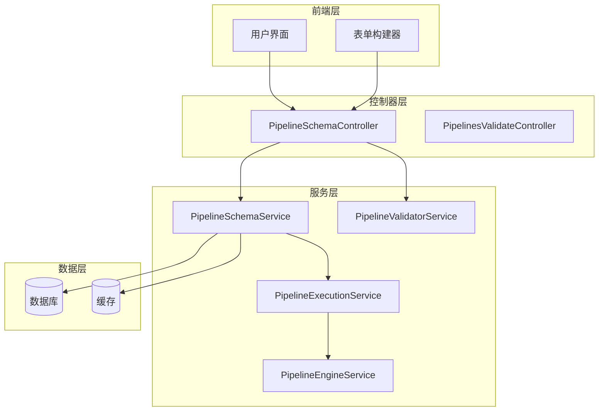
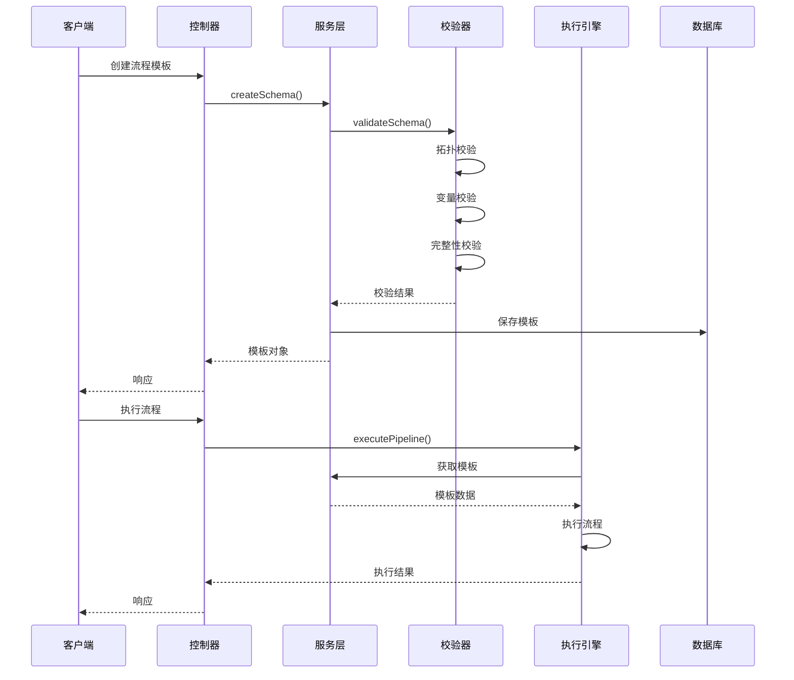
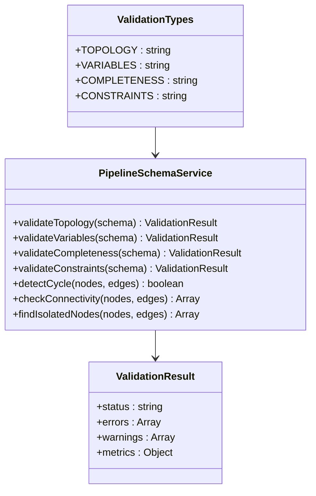
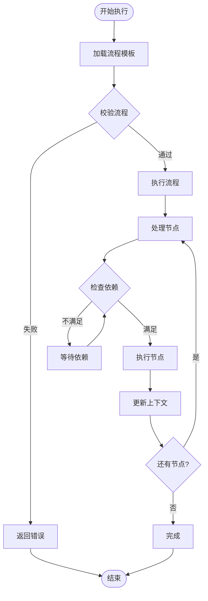
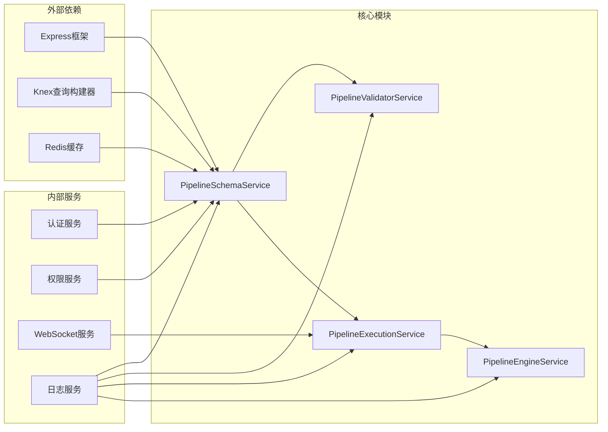

# Pipeline Schema校验器

<cite>
**本文档中引用的文件**
- [pipelineSchema.controller.js](file://backend/src/controllers/pipelineSchema.controller.js)
- [pipelineSchema.service.js](file://backend/src/services/pipelineSchema.service.js)
- [pipeline-validator.service.ts](file://backend/src/services/pipeline-validator.service.ts)
- [pipelineExecution.service.js](file://backend/src/services/pipelineExecution.service.js)
- [pipelineEngine.service.js](file://backend/src/services/pipelineEngine.service.js)
- [pipeline-testrunner.service.ts](file://backend/src/services/pipeline-testrunner.service.ts)
- [pipelineSchemas.routes.js](file://backend/src/routes/pipelineSchemas.routes.js)
- [ui-schema.json](file://backend/docs/ui-schema.json)
</cite>

## 目录
1. [简介](#简介)
2. [项目结构](#项目结构)
3. [核心组件](#核心组件)
4. [架构概览](#架构概览)
5. [详细组件分析](#详细组件分析)
6. [依赖关系分析](#依赖关系分析)
7. [性能考虑](#性能考虑)
8. [故障排除指南](#故障排除指南)
9. [结论](#结论)

## 简介

Pipeline Schema校验器是一个强大的流程编排验证系统，负责确保流程模板的合法性和完整性。该系统提供了多层次的校验机制，包括拓扑结构校验、变量可达性检查、完整性验证和约束条件校验，确保流程能够正确执行且符合业务规则。

## 项目结构

Pipeline Schema校验器采用分层架构设计，主要包含以下模块：

**图表来源**
- [pipelineSchema.controller.js](file://backend/src/controllers/pipelineSchema.controller.js#L1-L332)
- [pipelineSchema.service.js](file://backend/src/services/pipelineSchema.service.js#L1-L924)

**章节来源**
- [pipelineSchema.controller.js](file://backend/src/controllers/pipelineSchema.controller.js#L1-L50)
- [pipelineSchema.service.js](file://backend/src/services/pipelineSchema.service.js#L1-L50)

## 核心组件

### Pipeline Schema控制器

Pipeline Schema控制器负责处理所有与流程模板相关的HTTP请求，提供完整的CRUD操作和校验功能。

**主要功能：**
- 流程模板的创建、读取、更新、删除
- 批量校验和单个校验
- 校验历史查询
- 分类管理和统计信息

### Pipeline Schema服务

Pipeline Schema服务是核心业务逻辑层，实现了完整的校验算法和流程管理功能。

**核心特性：**
- 多层次校验机制
- 循环依赖检测
- 变量可达性分析
- 约束条件验证
- 异步校验支持

### Pipeline Validator服务

Pipeline Validator服务专门负责流程拓扑的合法性验证，确保流程能够正确执行。

**验证范围：**
- 基础结构验证
- 拓扑排序和循环检测
- 节点完整性检查
- 边的合法性验证
- 变量可达性验证
- 条件分支完整性检查

**章节来源**
- [pipelineSchema.controller.js](file://backend/src/controllers/pipelineSchema.controller.js#L50-L150)
- [pipelineSchema.service.js](file://backend/src/services/pipelineSchema.service.js#L50-L200)
- [pipeline-validator.service.ts](file://backend/src/services/pipeline-validator.service.ts#L1-L100)

## 架构概览

Pipeline Schema校验器采用微服务架构，各组件职责明确，通过事件驱动的方式实现松耦合。

**图表来源**
- [pipelineSchema.controller.js](file://backend/src/controllers/pipelineSchema.controller.js#L60-L120)
- [pipelineSchema.service.js](file://backend/src/services/pipelineSchema.service.js#L200-L300)
- [pipelineEngine.service.js](file://backend/src/services/pipelineEngine.service.js#L1-L100)

## 详细组件分析

### 校验类型体系

系统支持四种主要的校验类型，每种类型专注于不同的验证维度：

**图表来源**
- [pipelineSchema.service.js](file://backend/src/services/pipelineSchema.service.js#L10-L30)
- [pipelineSchema.service.js](file://backend/src/services/pipelineSchema.service.js#L200-L300)

#### 拓扑结构校验

拓扑结构校验确保流程的物理布局合法，包括：

- **节点定义验证**：检查节点类型、ID唯一性
- **边定义验证**：验证边的源节点和目标节点
- **循环依赖检测**：使用DFS算法检测循环引用
- **连通性检查**：确保所有节点可访问
- **孤立节点识别**：找出未连接的节点

#### 变量可达性校验

变量可达性校验确保流程中数据的正确流动：

- **输入输出Schema验证**：检查数据结构定义
- **变量映射验证**：确保变量引用的有效性
- **变量产生检查**：验证输出变量的产生
- **变量流分析**：检查节点间的数据传递

#### 完整性校验

完整性校验确保流程模板的结构完整：

- **必填字段检查**：验证关键字段的存在
- **Schema结构验证**：检查元数据完整性
- **节点配置验证**：确保节点配置的正确性
- **边定义验证**：检查边的完整性

#### 约束条件校验

约束条件校验确保流程符合业务规则：

- **节点数量限制**：检查最大节点数
- **边数量限制**：检查最大边数
- **深度限制**：检查流程深度
- **节点类型限制**：验证允许的节点类型

**章节来源**
- [pipelineSchema.service.js](file://backend/src/services/pipelineSchema.service.js#L300-L500)
- [pipeline-validator.service.ts](file://backend/src/services/pipeline-validator.service.ts#L100-L300)

### 执行引擎集成

Pipeline Schema校验器与执行引擎紧密集成，提供实时的流程验证能力：

**图表来源**
- [pipelineExecution.service.js](file://backend/src/services/pipelineExecution.service.js#L100-L200)
- [pipelineEngine.service.js](file://backend/src/services/pipelineEngine.service.js#L10-L100)

### 测试运行器

测试运行器提供流程的试跑功能，支持Mock和真实两种模式：

**Mock模式特点：**
- 模拟节点执行结果
- 快速验证流程逻辑
- 无需外部依赖
- 支持并发测试

**真实模式特点：**
- 调用实际的服务
- 验证生产环境行为
- 支持SSE实时反馈
- 提供详细的执行日志

**章节来源**
- [pipelineExecution.service.js](file://backend/src/services/pipelineExecution.service.js#L1-L200)
- [pipeline-testrunner.service.ts](file://backend/src/services/pipeline-testrunner.service.ts#L1-L200)

## 依赖关系分析

Pipeline Schema校验器的依赖关系呈现清晰的分层结构：

**图表来源**
- [pipelineSchema.service.js](file://backend/src/services/pipelineSchema.service.js#L1-L10)
- [pipelineExecution.service.js](file://backend/src/services/pipelineExecution.service.js#L1-L10)

**章节来源**
- [pipelineSchema.service.js](file://backend/src/services/pipelineSchema.service.js#L1-L20)
- [pipelineExecution.service.js](file://backend/src/services/pipelineExecution.service.js#L1-L20)

## 性能考虑

### 缓存策略

系统采用多级缓存策略提升性能：

- **Schema缓存**：缓存流程模板避免重复查询
- **校验结果缓存**：缓存校验结果减少重复计算
- **执行上下文缓存**：缓存执行过程中的中间状态

### 异步处理

- **异步校验**：创建Schema时异步执行校验
- **异步执行**：执行流程时不阻塞主线程
- **事件驱动**：使用事件机制解耦组件

### 并发控制

- **执行并发**：支持多个流程同时执行
- **校验并发**：支持批量校验操作
- **资源限制**：防止系统资源过度消耗

## 故障排除指南

### 常见问题及解决方案

#### 校验失败问题

**问题描述**：流程模板校验失败

**排查步骤**：
1. 检查节点定义是否完整
2. 验证边的源节点和目标节点
3. 确认没有循环依赖
4. 检查变量映射是否有效

**解决方案**：
- 补充缺失的节点定义
- 修正边的引用关系
- 移除循环依赖
- 修复变量映射错误

#### 执行失败问题

**问题描述**：流程执行失败

**排查步骤**：
1. 检查Provider配置
2. 验证网络连接
3. 确认配额充足
4. 检查超时设置

**解决方案**：
- 更新Provider配置
- 检查网络连接
- 增加配额
- 调整超时设置

#### 性能问题

**问题描述**：校验或执行速度慢

**优化方案**：
- 启用缓存机制
- 优化数据库查询
- 调整并发参数
- 使用异步处理

**章节来源**
- [pipelineSchema.service.js](file://backend/src/services/pipelineSchema.service.js#L800-L924)
- [pipelineExecution.service.js](file://backend/src/services/pipelineExecution.service.js#L700-L836)

## 结论

Pipeline Schema校验器是一个功能完备、架构清晰的流程验证系统。它通过多层次的校验机制确保流程的合法性，通过灵活的执行引擎支持多种执行模式，并通过完善的监控和调试功能提供良好的用户体验。

系统的主要优势包括：
- **全面的校验覆盖**：涵盖拓扑、变量、完整性和约束四个维度
- **灵活的执行模式**：支持Mock和真实两种执行模式
- **优秀的性能表现**：通过缓存和异步处理提升响应速度
- **完善的错误处理**：提供详细的错误信息和恢复机制

未来的发展方向可以考虑：
- 增强机器学习能力，自动优化流程设计
- 扩展更多的节点类型和执行模式
- 提供更丰富的可视化工具
- 加强与其他系统的集成能力