# Pipeline执行引擎

<cite>
**本文档中引用的文件**
- [pipelineEngine.service.js](file://backend/src/services/pipelineEngine.service.js)
- [pipelineExecution.service.js](file://backend/src/services/pipelineExecution.service.js)
- [pipelineExecution.controller.js](file://backend/src/controllers/pipelineExecution.controller.js)
- [pipelineSchema.service.js](file://backend/src/services/pipelineSchema.service.js)
- [pipelineValidator.service.js](file://backend/src/services/pipelineValidator.service.js)
- [pipelineSchema.controller.js](file://backend/src/controllers/pipelineSchema.controller.js)
- [pipelineExecution.routes.js](file://backend/src/routes/pipelineExecution.routes.js)
- [pipelineSchemas.routes.js](file://backend/src/routes/pipelineSchemas.routes.js)
- [types.ts](file://backend/src/engine/types.ts)
- [provider-registry.service.js](file://backend/src/services/provider-registry.service.js)
- [kb-retrieve.ts](file://backend/src/engine/nodes/kb-retrieve.ts)
- [mcp-tool-call.ts](file://backend/src/engine/nodes/mcp-tool-call.ts)
- [pipeline-testrunner.service.ts](file://backend/src/services/pipeline-testrunner.service.ts)
- [create_pipeline_schemas_table.js](file://backend/src/db/migrations/20241203000005_create_pipeline_schemas_table.js)
- [create_pipeline_executions_table.js](file://backend/src/db/migrations/20241203000007_create_pipeline_executions_table.js)
- [create_pipeline_execution_steps_table.js](file://backend/src/db/migrations/20241203000008_create_pipeline_execution_steps_table.js)
</cite>

## 目录
1. [简介](#简介)
2. [系统架构](#系统架构)
3. [核心组件](#核心组件)
4. [Pipeline执行流程](#pipeline执行流程)
5. [数据模型](#数据模型)
6. [Provider机制](#provider机制)
7. [错误处理与重试](#错误处理与重试)
8. [监控与日志](#监控与日志)
9. [性能优化](#性能优化)
10. [故障排除](#故障排除)

## 简介

Pipeline执行引擎是一个强大的工作流编排系统，支持复杂的数据处理流程和自动化任务执行。该系统采用模块化设计，具备高度的可扩展性和容错能力，能够处理从简单的数据转换到复杂的AI工作流等各种场景。

### 主要特性

- **可视化流程设计**：支持拖拽式的流程设计器
- **多种节点类型**：包括数据处理、条件判断、循环控制等
- **Provider抽象层**：统一的外部服务调用接口
- **实时监控**：支持SSE实时状态推送
- **Mock测试**：无需真实环境即可进行流程测试
- **熔断保护**：内置熔断器防止级联故障
- **重试机制**：智能重试策略确保任务可靠性

## 系统架构

Pipeline执行引擎采用分层架构设计，主要包含以下层次：

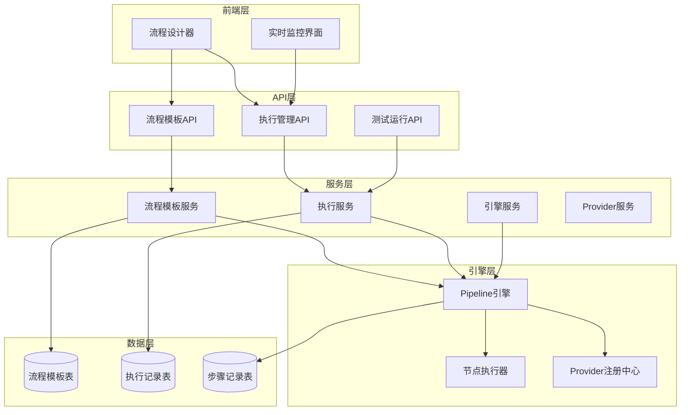

**图表来源**
- [pipelineEngine.service.js](file://backend/src/services/pipelineEngine.service.js#L1-L50)
- [pipelineExecution.service.js](file://backend/src/services/pipelineExecution.service.js#L1-L50)
- [types.ts](file://backend/src/engine/types.ts#L1-L50)

## 核心组件

### Pipeline引擎核心类

Pipeline引擎的核心实现位于`PipelineEngine`类中，负责整个流程的执行调度：

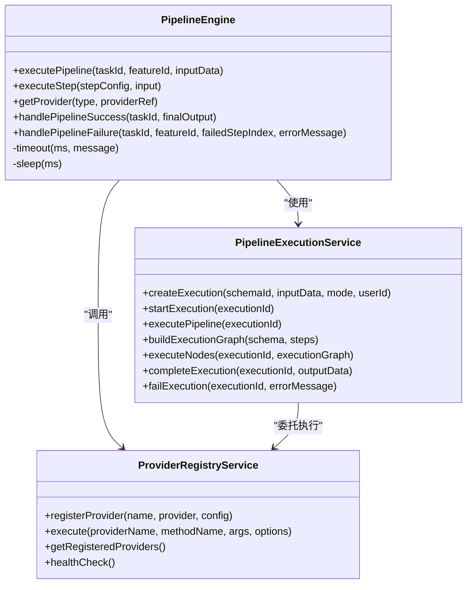

**图表来源**
- [pipelineEngine.service.js](file://backend/src/services/pipelineEngine.service.js#L10-L100)
- [pipelineExecution.service.js](file://backend/src/services/pipelineExecution.service.js#L10-L100)
- [provider-registry.service.js](file://backend/src/services/provider-registry.service.js#L20-L100)

### 节点类型系统

系统支持多种类型的节点，每种节点都有特定的功能和配置：

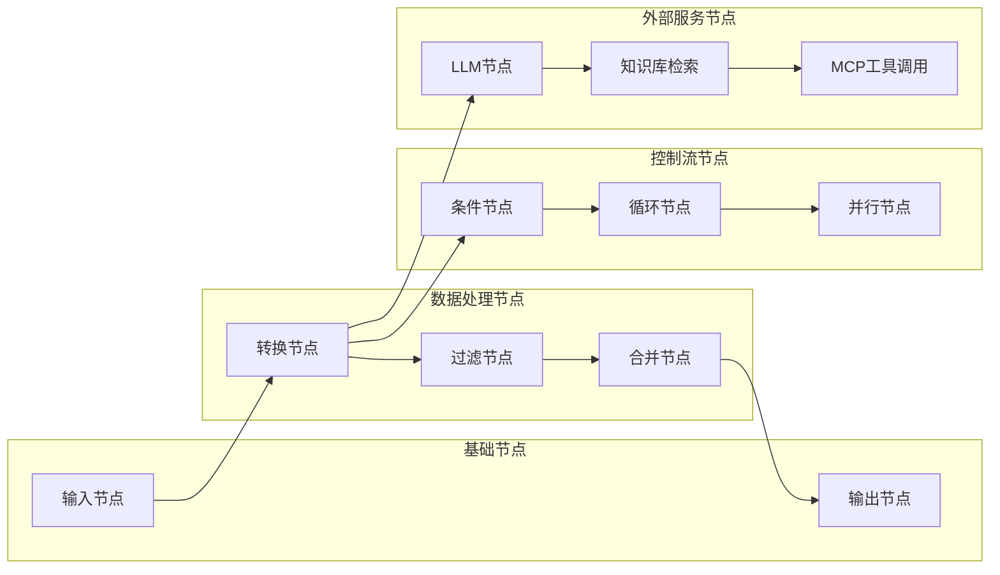

**图表来源**
- [types.ts](file://backend/src/engine/types.ts#L10-L50)
- [kb-retrieve.ts](file://backend/src/engine/nodes/kb-retrieve.ts#L1-L50)
- [mcp-tool-call.ts](file://backend/src/engine/nodes/mcp-tool-call.ts#L1-L50)

**章节来源**
- [pipelineEngine.service.js](file://backend/src/services/pipelineEngine.service.js#L1-L359)
- [pipelineExecution.service.js](file://backend/src/services/pipelineExecution.service.js#L1-L836)
- [types.ts](file://backend/src/engine/types.ts#L1-L288)

## Pipeline执行流程

Pipeline的执行遵循严格的生命周期管理，确保每个步骤都能得到正确的处理：

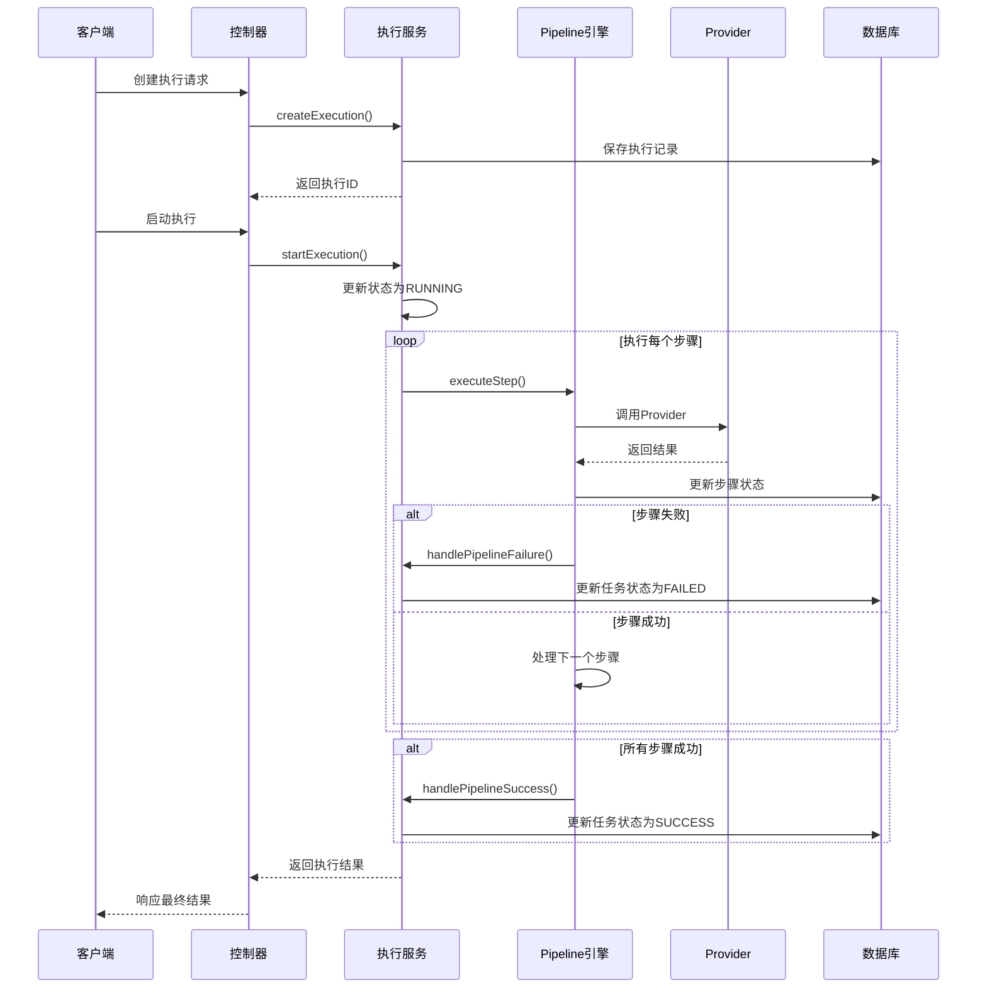

**图表来源**
- [pipelineExecution.controller.js](file://backend/src/controllers/pipelineExecution.controller.js#L10-L100)
- [pipelineExecution.service.js](file://backend/src/services/pipelineExecution.service.js#L100-L200)
- [pipelineEngine.service.js](file://backend/src/services/pipelineEngine.service.js#L15-L100)

### 执行模式

系统支持两种执行模式：

1. **Mock模式**：用于测试和调试，不调用真实的服务
2. **Real模式**：生产环境使用，调用真实的Provider服务

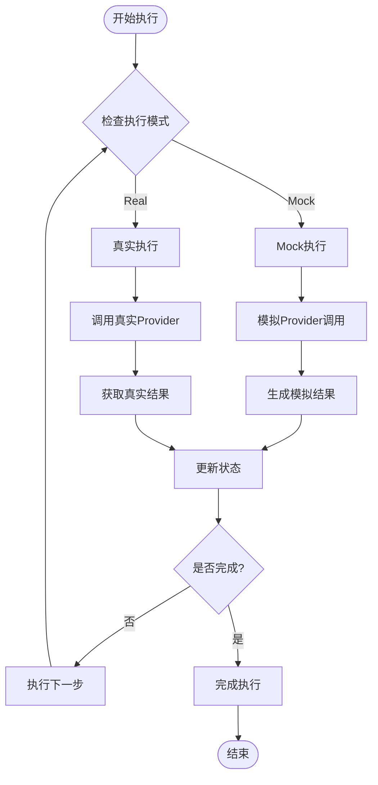

**图表来源**
- [pipelineExecution.service.js](file://backend/src/services/pipelineExecution.service.js#L300-L400)
- [pipeline-testrunner.service.ts](file://backend/src/services/pipeline-testrunner.service.ts#L50-L150)

**章节来源**
- [pipelineExecution.service.js](file://backend/src/services/pipelineExecution.service.js#L100-L400)
- [pipelineEngine.service.js](file://backend/src/services/pipelineEngine.service.js#L15-L150)

## 数据模型

Pipeline系统使用三个核心表来管理流程模板、执行记录和步骤状态：

### 流程模板表 (pipeline_schemas)

| 字段名 | 类型 | 描述 |
|--------|------|------|
| id | string | 主键，UUID格式 |
| name | string | 流程名称 |
| description | text | 流程描述 |
| category | string | 流程分类 |
| version | string | 版本号，默认1.0.0 |
| schema_definition | json | 流程结构定义 |
| node_definitions | json | 节点定义数组 |
| edge_definitions | json | 边定义数组 |
| input_schema | json | 输入参数结构 |
| output_schema | json | 输出参数结构 |
| variable_mappings | json | 变量映射关系 |
| validation_rules | json | 校验规则 |
| constraints | json | 约束条件 |
| status | string | 状态：draft/active/deprecated |
| is_valid | boolean | 是否通过校验 |
| validation_errors | text | 校验错误信息 |
| created_by | integer | 创建者ID |
| updated_by | integer | 更新者ID |
| created_at | timestamp | 创建时间 |
| updated_at | timestamp | 更新时间 |

### 执行记录表 (pipeline_executions)

| 字段名 | 类型 | 描述 |
|--------|------|------|
| id | string | 主键，UUID格式 |
| schema_id | string | 流程模板ID |
| execution_mode | string | 执行模式：mock/real |
| status | string | 状态：pending/running/completed/failed/cancelled |
| input_data | json | 输入数据 |
| output_data | json | 输出数据 |
| execution_context | json | 执行上下文 |
| execution_metadata | json | 执行元数据 |
| started_at | timestamp | 开始时间 |
| completed_at | timestamp | 完成时间 |
| duration_ms | integer | 执行时长(毫秒) |
| error_message | text | 错误信息 |
| error_details | json | 错误详情 |
| created_by | integer | 创建者ID |

### 步骤记录表 (pipeline_execution_steps)

| 字段名 | 类型 | 描述 |
|--------|------|------|
| id | string | 主键，UUID格式 |
| execution_id | string | 执行记录ID |
| node_id | string | 节点ID |
| node_type | string | 节点类型 |
| status | string | 状态：pending/running/completed/failed/skipped |
| input_data | json | 节点输入数据 |
| output_data | json | 节点输出数据 |
| config | json | 节点配置 |
| started_at | timestamp | 开始时间 |
| completed_at | timestamp | 完成时间 |
| duration_ms | integer | 执行时长(毫秒) |
| error_message | text | 错误信息 |
| retry_count | integer | 重试次数 |
| metadata | json | 步骤元数据 |

**章节来源**
- [create_pipeline_schemas_table.js](file://backend/src/db/migrations/20241203000005_create_pipeline_schemas_table.js#L1-L47)
- [create_pipeline_executions_table.js](file://backend/src/db/migrations/20241203000007_create_pipeline_executions_table.js#L1-L33)
- [create_pipeline_execution_steps_table.js](file://backend/src/db/migrations/20241203000008_create_pipeline_execution_steps_table.js#L1-L32)

## Provider机制

Provider机制是Pipeline系统与外部服务交互的核心抽象层，提供了统一的调用接口和强大的容错能力。

### Provider注册与管理

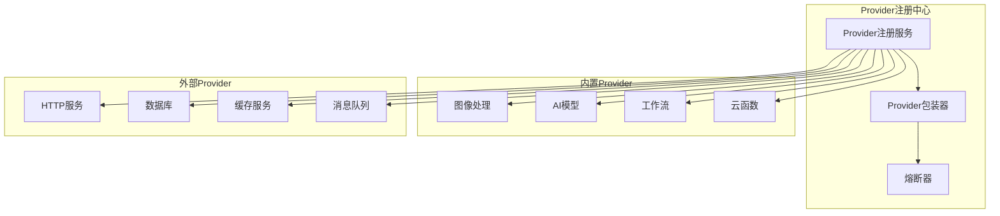

**图表来源**
- [provider-registry.service.js](file://backend/src/services/provider-registry.service.js#L50-L150)

### Provider配置模板

每个Provider都有详细的配置模板，包括熔断参数、重试策略、超时设置等：

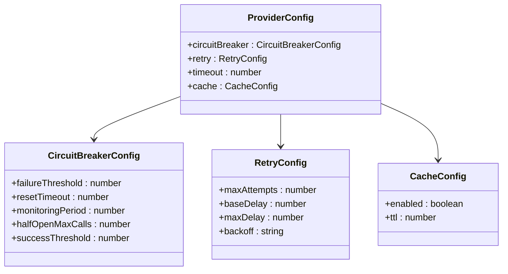

**图表来源**
- [provider-registry.service.js](file://backend/src/services/provider-registry.service.js#L100-L200)

### 知识库检索节点

知识库检索节点展示了如何实现复杂的外部服务集成：

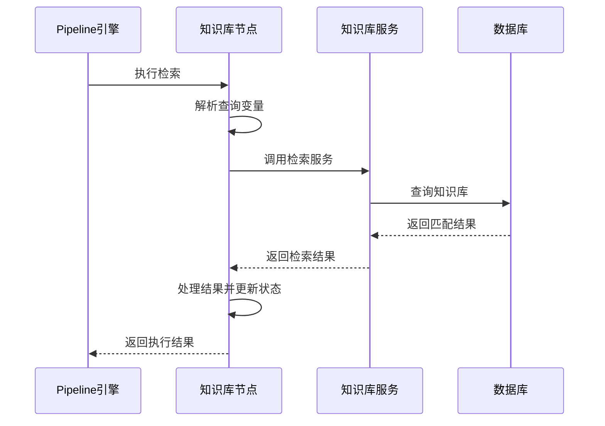

**图表来源**
- [kb-retrieve.ts](file://backend/src/engine/nodes/kb-retrieve.ts#L50-L150)

### MCP工具调用节点

MCP工具调用节点支持与外部工具的标准化交互：

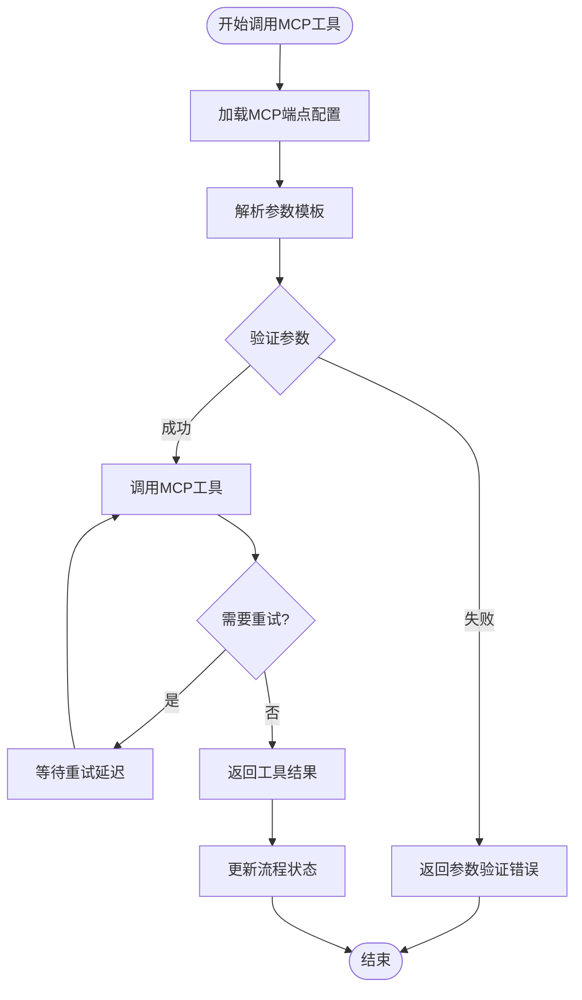

**图表来源**
- [mcp-tool-call.ts](file://backend/src/engine/nodes/mcp-tool-call.ts#L100-L300)

**章节来源**
- [provider-registry.service.js](file://backend/src/services/provider-registry.service.js#L1-L200)
- [kb-retrieve.ts](file://backend/src/engine/nodes/kb-retrieve.ts#L1-L234)
- [mcp-tool-call.ts](file://backend/src/engine/nodes/mcp-tool-call.ts#L1-L514)

## 错误处理与重试

Pipeline系统实现了完善的错误处理和重试机制，确保任务的可靠执行。

### 错误类型分类

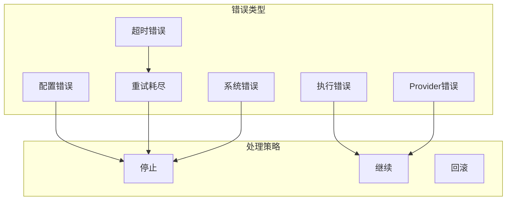

### 熔断器机制

系统内置了熔断器来防止级联故障：

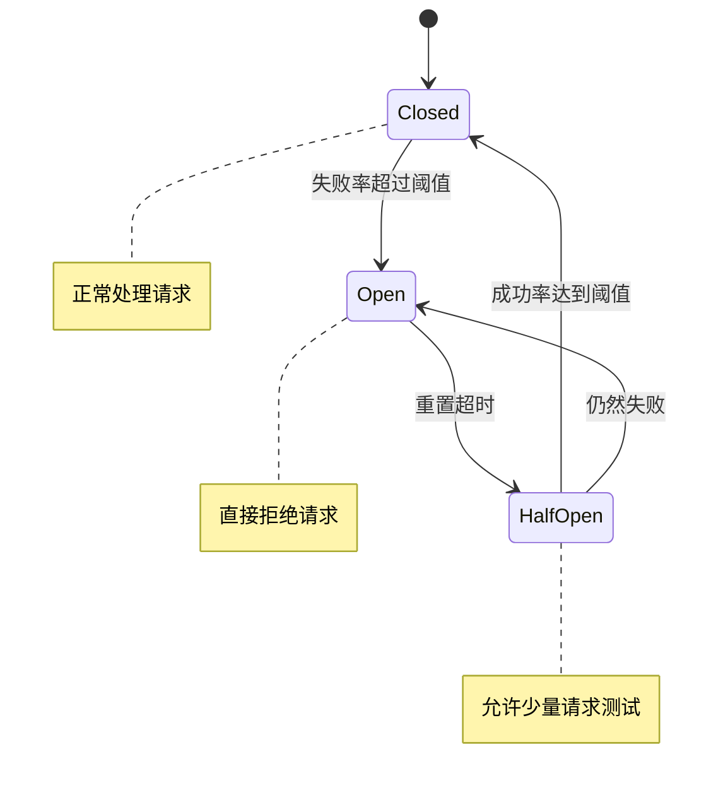

### 重试策略配置

| 策略 | 描述 | 示例配置 |
|------|------|----------|
| 指数退避 | 每次重试间隔逐渐增加 | `backoff: 'exponential'` |
| 线性退避 | 每次重试间隔固定增加 | `backoff: 'linear'` |
| 固定间隔 | 每次重试间隔相同 | `backoff: 'none'` |
| 最大重试次数 | 限制重试次数 | `maxAttempts: 3` |
| 基础延迟 | 首次重试延迟 | `baseDelay: 1000` |
| 最大延迟 | 最大重试延迟 | `maxDelay: 30000` |

**章节来源**
- [pipelineEngine.service.js](file://backend/src/services/pipelineEngine.service.js#L100-L200)
- [mcp-tool-call.ts](file://backend/src/engine/nodes/mcp-tool-call.ts#L400-L500)

## 监控与日志

Pipeline系统提供了全面的监控和日志功能，支持实时状态跟踪和问题诊断。

### 实时事件系统

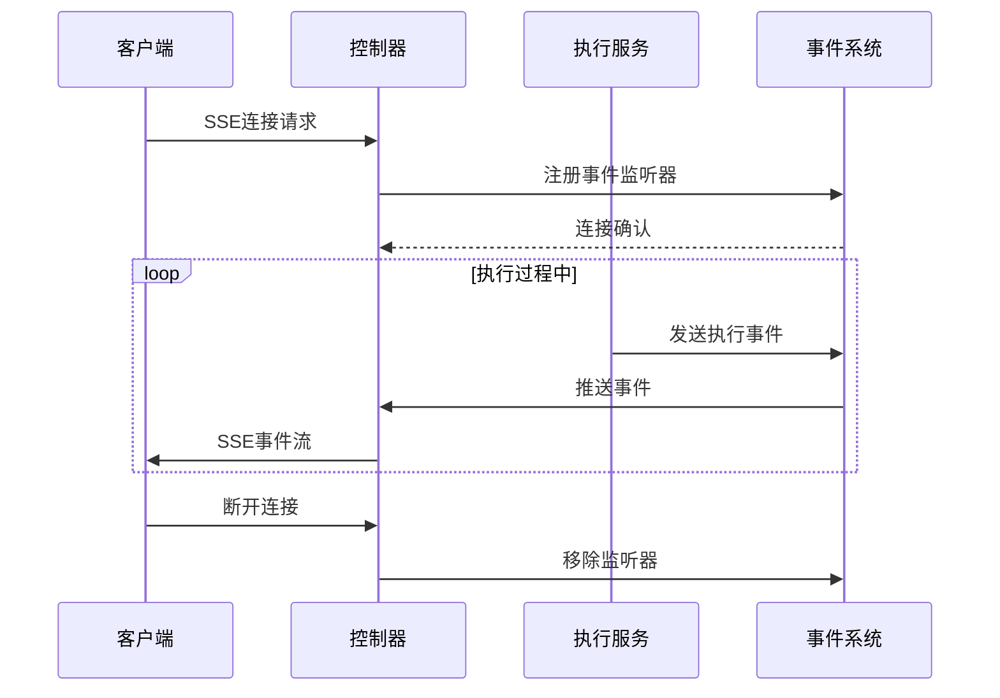

### 监控指标

系统提供以下监控指标：

| 指标类别 | 具体指标 | 描述 |
|----------|----------|------|
| 执行状态 | 总执行数、成功数、失败数 | 整体执行情况 |
| 性能指标 | 平均执行时间、最大执行时间 | 性能表现 |
| 错误统计 | 错误类型分布、错误率 | 错误分析 |
| 资源使用 | 内存使用、CPU使用 | 系统资源 |
| Provider状态 | Provider可用性、响应时间 | 外部服务状态 |

### 日志级别

系统采用分级日志记录：

- **DEBUG**：详细的执行步骤和变量值
- **INFO**：关键执行事件和状态变化
- **WARN**：潜在问题和异常情况
- **ERROR**：严重错误和异常

**章节来源**
- [pipelineExecution.controller.js](file://backend/src/controllers/pipelineExecution.controller.js#L150-L300)
- [pipelineExecution.service.js](file://backend/src/services/pipelineExecution.service.js#L700-L800)

## 性能优化

Pipeline系统采用了多种性能优化策略：

### 缓存策略

1. **Provider结果缓存**：缓存Provider的执行结果
2. **Schema缓存**：缓存流程模板定义
3. **执行上下文缓存**：缓存频繁访问的执行数据

### 并发控制

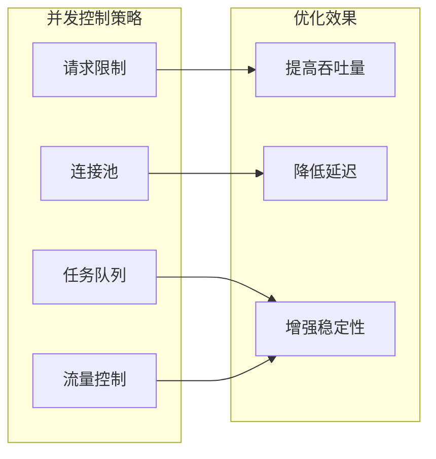

### 数据库优化

1. **索引优化**：为常用查询字段建立索引
2. **分页查询**：大数据量查询使用分页
3. **连接池**：使用连接池管理数据库连接
4. **读写分离**：读操作和写操作分离

## 故障排除

### 常见问题及解决方案

| 问题类型 | 症状 | 可能原因 | 解决方案 |
|----------|------|----------|----------|
| 流程无法启动 | 执行状态始终为pending | Schema无效或节点配置错误 | 检查Schema校验结果 |
| Provider调用失败 | 步骤状态为failed | Provider配置错误或网络问题 | 检查Provider配置和网络连接 |
| 执行超时 | 步骤执行时间过长 | Provider响应慢或逻辑复杂 | 优化Provider逻辑或增加超时时间 |
| 内存溢出 | 系统内存使用过高 | 大数据量处理或内存泄漏 | 优化数据处理逻辑或增加内存限制 |

### 调试工具

1. **Mock测试**：使用Mock模式测试流程逻辑
2. **日志分析**：查看详细的执行日志
3. **实时监控**：使用SSE实时跟踪执行状态
4. **Schema校验**：使用内置校验工具检查流程定义

### 性能调优

1. **Provider优化**：选择合适的Provider配置
2. **并发调整**：根据系统负载调整并发数
3. **缓存策略**：合理使用缓存减少重复计算
4. **数据库优化**：优化查询语句和索引

**章节来源**
- [pipelineValidator.service.js](file://backend/src/services/pipelineValidator.service.js#L1-L418)
- [pipeline-testrunner.service.ts](file://backend/src/services/pipeline-testrunner.service.ts#L1-L624)

## 结论

Pipeline执行引擎是一个功能强大、设计精良的工作流编排系统。它通过模块化的架构设计、完善的错误处理机制和丰富的监控功能，为企业级应用提供了可靠的自动化解决方案。

系统的主要优势包括：
- **高度可扩展**：通过Provider机制支持各种外部服务
- **强容错能力**：熔断器和重试机制确保系统稳定性
- **实时监控**：SSE技术提供实时的状态反馈
- **灵活配置**：支持多种执行模式和配置选项
- **完善测试**：Mock测试和真实测试相结合

未来的发展方向包括：
- 更多节点类型的扩展
- 更智能的错误恢复机制
- 更丰富的监控和分析功能
- 更好的用户体验设计