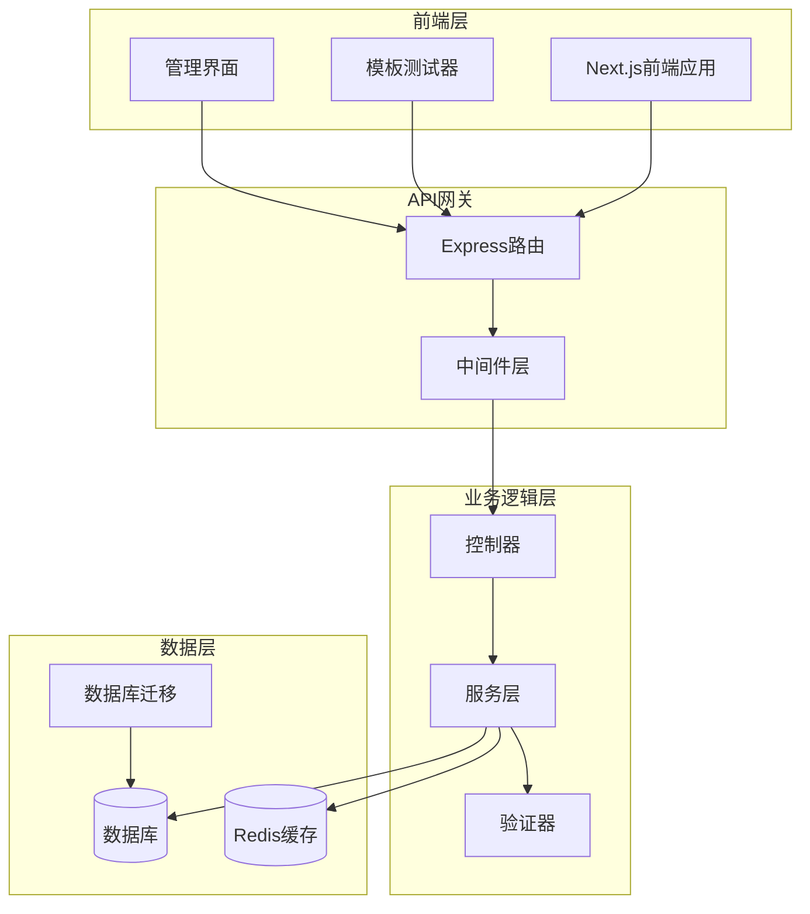
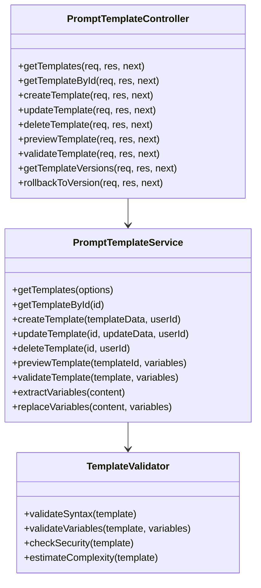
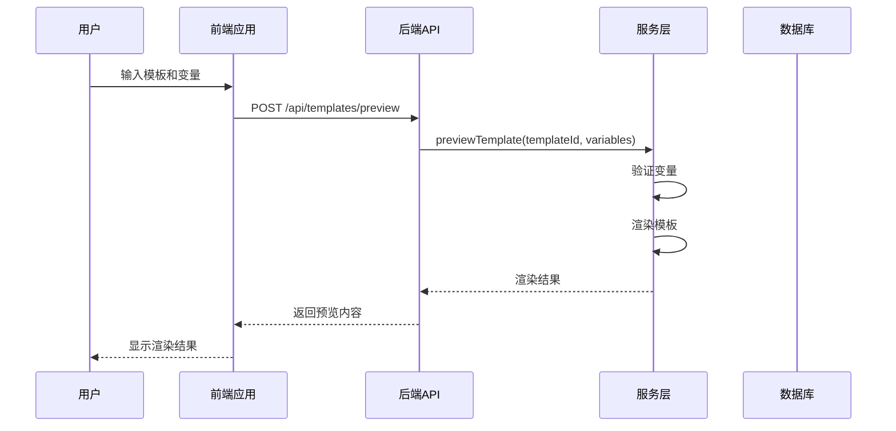
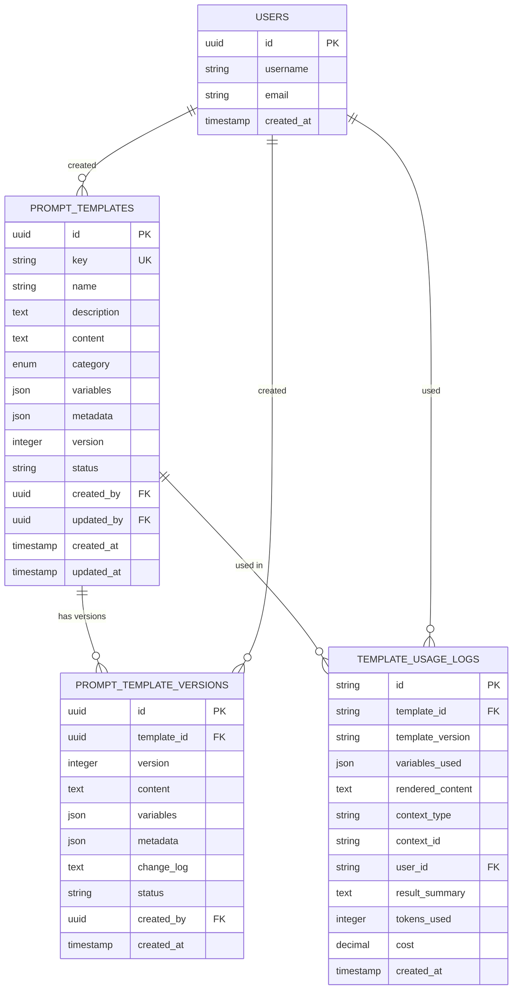
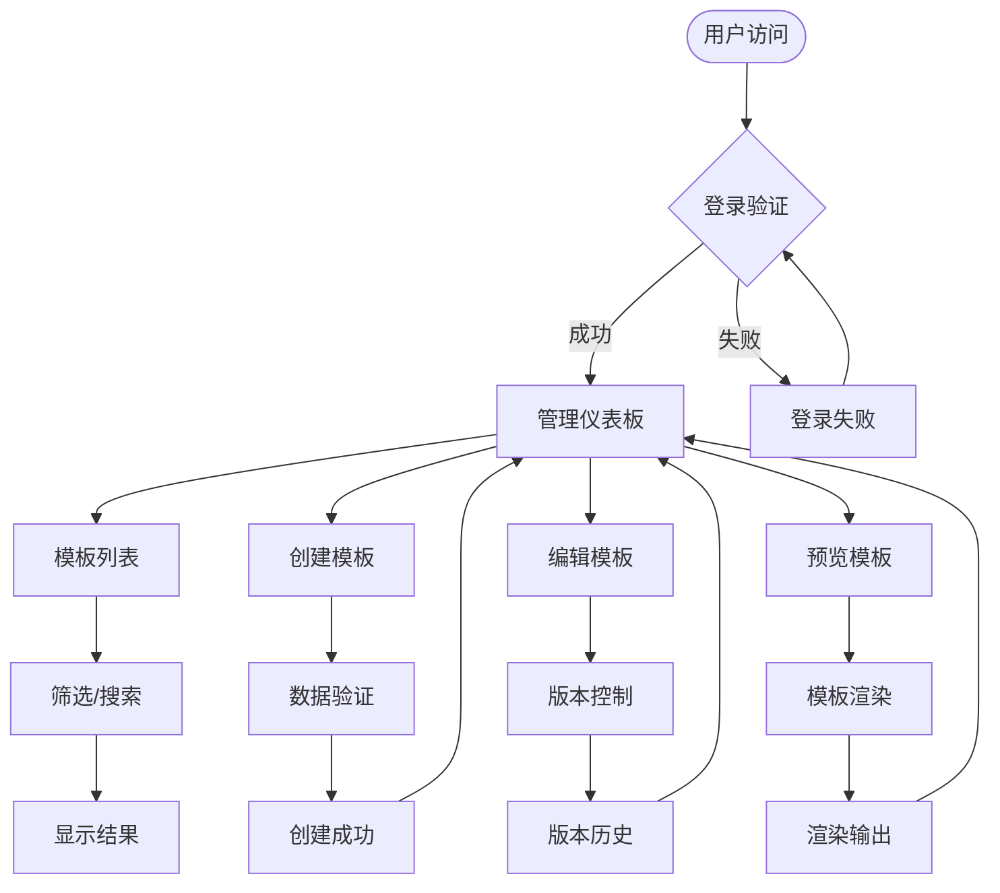

# Prompt模板中心

<cite>
**本文档中引用的文件**
- [promptTemplate.controller.js](file://backend/src/controllers/promptTemplate.controller.js)
- [promptTemplate.service.js](file://backend/src/services/promptTemplate.service.js)
- [prompt-template.service.ts](file://backend/src/services/prompt-template.service.ts)
- [prompt-templates.routes.js](file://backend/src/routes/admin/prompt-templates.routes.js)
- [prompt-templates.controller.js](file://backend/src/controllers/admin/prompt-templates.controller.js)
- [create_prompt_templates_table.js](file://backend/migrations/20241204000003_create_prompt_templates_table.js)
- [create_prompt_template_versions_table.js](file://backend/src/db/migrations/20241204000004_create_prompt_template_versions_table.js)
- [template.ts](file://backend/src/utils/template.ts)
- [validate.middleware.js](file://backend/src/middlewares/validate.middleware.js)
- [page.tsx](file://frontend/src/app/admin/template-tester/page.tsx)
- [template-tester page.tsx](file://frontend/src/app/admin/prompts/test/page.tsx)
</cite>

## 目录
1. [项目概述](#项目概述)
2. [系统架构](#系统架构)
3. [核心组件](#核心组件)
4. [数据库设计](#数据库设计)
5. [API接口](#api接口)
6. [前端界面](#前端界面)
7. [模板管理功能](#模板管理功能)
8. [安全机制](#安全机制)
9. [性能优化](#性能优化)
10. [使用示例](#使用示例)
11. [故障排除](#故障排除)
12. [总结](#总结)

## 项目概述

Prompt模板中心是一个完整的提示词模板管理系统，提供了模板创建、编辑、版本控制、预览、验证和使用统计等功能。该系统采用前后端分离架构，后端基于Node.js和Express框架，前端使用Next.js和React技术栈。

### 主要特性

- **模板分类管理**：支持system、user、assistant、function四种模板分类
- **版本控制**：完整的模板版本历史管理和回滚功能
- **变量系统**：强大的模板变量定义和验证机制
- **安全渲染**：防止代码注入的安全模板渲染引擎
- **使用统计**：详细的模板使用情况跟踪和分析
- **实时预览**：所见即所得的模板预览功能

## 系统架构



**图表来源**
- [prompt-templates.routes.js](file://backend/src/routes/admin/prompt-templates.routes.js#L1-L67)
- [promptTemplate.controller.js](file://backend/src/controllers/promptTemplate.controller.js#L1-L50)
- [promptTemplate.service.js](file://backend/src/services/promptTemplate.service.js#L1-L50)

## 核心组件

### 后端核心组件

#### 控制器层 (Controller Layer)
负责HTTP请求处理和响应格式化，提供RESTful API接口。

#### 服务层 (Service Layer)
实现核心业务逻辑，包括：
- 模板创建和更新
- 版本管理
- 预览渲染
- 验证检查
- 使用统计

#### 中间件层 (Middleware Layer)
提供请求验证、权限控制和错误处理。



**图表来源**
- [promptTemplate.controller.js](file://backend/src/controllers/promptTemplate.controller.js#L5-L100)
- [promptTemplate.service.js](file://backend/src/services/promptTemplate.service.js#L8-L150)

**章节来源**
- [promptTemplate.controller.js](file://backend/src/controllers/promptTemplate.controller.js#L1-L613)
- [promptTemplate.service.js](file://backend/src/services/promptTemplate.service.js#L1-L643)

### 前端核心组件

#### 模板测试器
提供实时模板渲染和变量预览功能。

#### 管理界面
管理员专用的模板管理界面，支持CRUD操作和版本管理。



**图表来源**
- [page.tsx](file://frontend/src/app/admin/template-tester/page.tsx#L50-L100)
- [prompt-templates.routes.js](file://backend/src/routes/admin/prompt-templates.routes.js#L20-L30)

**章节来源**
- [page.tsx](file://frontend/src/app/admin/template-tester/page.tsx#L1-L263)

## 数据库设计

### 核心表结构

#### prompt_templates 表
存储模板基本信息和元数据。

| 字段名 | 类型 | 约束 | 描述 |
|--------|------|------|------|
| id | UUID | PRIMARY KEY | 模板唯一标识 |
| key | String(100) | UNIQUE, NOT NULL | 模板唯一键名 |
| name | String(200) | NOT NULL | 模板名称 |
| description | Text | NULLABLE | 模板描述 |
| content | Text | NOT NULL | 模板内容 |
| category | Enum | DEFAULT 'user' | 模板分类 |
| variables | JSON | NULLABLE | 变量定义 |
| metadata | JSON | NULLABLE | 元数据信息 |
| version | Integer | NOT NULL, DEFAULT 1 | 版本号 |
| status | String(20) | NOT NULL, DEFAULT 'draft' | 状态 |
| created_by | UUID | FOREIGN KEY | 创建人 |
| updated_by | UUID | FOREIGN KEY | 更新人 |
| created_at | Timestamp | DEFAULT NOW() | 创建时间 |
| updated_at | Timestamp | DEFAULT NOW() | 更新时间 |

#### prompt_template_versions 表
存储模板版本历史记录。

| 字段名 | 类型 | 约束 | 描述 |
|--------|------|------|------|
| id | UUID | PRIMARY KEY | 版本记录唯一标识 |
| template_id | UUID | FOREIGN KEY | 关联模板ID |
| version | Integer | NOT NULL | 版本号 |
| content | Text | NOT NULL | 版本内容 |
| variables | JSON | NULLABLE | 版本变量定义 |
| metadata | JSON | NULLABLE | 版本元数据 |
| change_log | Text | NULLABLE | 变更日志 |
| status | String(20) | NOT NULL, DEFAULT 'draft' | 版本状态 |
| created_by | UUID | FOREIGN KEY | 创建人 |
| created_at | Timestamp | DEFAULT NOW() | 创建时间 |



**图表来源**
- [create_prompt_templates_table.js](file://backend/src/db/migrations/20241204000003_create_prompt_templates_table.js#L1-L31)
- [create_prompt_template_versions_table.js](file://backend/src/db/migrations/20241204000004_create_prompt_template_versions_table.js#L1-L29)

**章节来源**
- [create_prompt_templates_table.js](file://backend/migrations/20241204000003_create_prompt_templates_table.js#L1-L31)
- [create_prompt_template_versions_table.js](file://backend/src/db/migrations/20241204000004_create_prompt_template_versions_table.js#L1-L29)

## API接口

### 模板管理接口

#### 获取模板列表
```http
GET /api/admin/prompt-templates
```

**请求参数：**
- `page` (number): 页码，默认1
- `limit` (number): 每页数量，默认20
- `category` (string): 模板分类
- `status` (string): 模板状态
- `search` (string): 搜索关键词
- `sortBy` (string): 排序字段
- `sortOrder` (string): 排序方向

#### 创建模板
```http
POST /api/admin/prompt-templates
```

**请求体：**
```json
{
  "key": "template-key",
  "name": "模板名称",
  "description": "模板描述",
  "content": "模板内容 {{variable}}",
  "category": "user",
  "variables": [
    {
      "name": "variable",
      "type": "string",
      "description": "变量描述",
      "required": true
    }
  ]
}
```

#### 更新模板
```http
PUT /api/admin/prompt-templates/:id
```

#### 删除模板
```http
DELETE /api/admin/prompt-templates/:id
```

#### 预览模板
```http
POST /api/admin/prompt-templates/:id/preview
```

**请求体：**
```json
{
  "variables": {
    "variable": "值"
  }
}
```

#### 获取版本历史
```http
GET /api/admin/prompt-templates/:id/versions
```

#### 回滚到指定版本
```http
POST /api/admin/prompt-templates/:id/rollback/:version
```

**章节来源**
- [prompt-templates.routes.js](file://backend/src/routes/admin/prompt-templates.routes.js#L1-L67)
- [prompt-templates.controller.js](file://backend/src/controllers/admin/prompt-templates.controller.js#L1-L346)

## 前端界面

### 模板测试器界面

前端提供了直观的模板测试器界面，支持：

- **实时预览**：输入模板和变量后立即看到渲染结果
- **变量检测**：自动识别模板中的变量引用
- **错误提示**：变量缺失或格式错误时给出明确提示
- **语法高亮**：支持模板语法的语法高亮显示

### 管理界面功能

- **模板列表**：分页显示所有模板，支持筛选和排序
- **模板详情**：查看模板详细信息和版本历史
- **版本对比**：比较不同版本间的差异
- **使用统计**：查看模板使用频率和效果



**图表来源**
- [page.tsx](file://frontend/src/app/admin/template-tester/page.tsx#L100-L200)

**章节来源**
- [page.tsx](file://frontend/src/app/admin/template-tester/page.tsx#L1-L263)

## 模板管理功能

### 模板分类体系

系统支持四种模板分类：

1. **System**：系统级别提示词，定义AI行为和规则
2. **User**：用户输入的提示词，指导AI生成内容  
3. **Assistant**：AI助手的示例回复，用于few-shot学习
4. **Function**：特定功能任务的提示词，如代码生成、文本分析

### 变量系统

#### 变量定义
```typescript
interface TemplateVariable {
  name: string;
  type: 'string' | 'number' | 'boolean' | 'array' | 'object';
  description: string;
  required: boolean;
  defaultValue?: any;
  validation?: {
    min?: number;
    max?: number;
    pattern?: string;
    enum?: any[];
    minLength?: number;
    maxLength?: number;
  };
}
```

#### 变量验证机制
- **类型检查**：确保变量类型匹配
- **必填验证**：检查必需变量是否提供
- **范围验证**：数值类型的范围检查
- **格式验证**：字符串格式和正则表达式验证

### 版本控制

#### 版本管理流程
1. **创建版本**：每次修改模板内容时自动创建新版本
2. **版本标记**：记录版本号和变更日志
3. **版本比较**：支持版本间差异对比
4. **版本回滚**：一键回滚到历史版本

#### 版本状态
- **Draft**：草稿状态，未发布
- **Published**：已发布状态
- **Archived**：已归档状态

### 使用统计

#### 统计指标
- **使用次数**：模板被使用的总次数
- **最近使用时间**：最后一次使用的时间
- **平均评分**：用户对模板的平均评分
- **使用场景**：模板在不同场景下的使用情况

#### 数据收集
系统自动记录每次模板使用的情况，包括：
- 使用时间
- 使用用户
- 使用场景
- 渲染结果
- Token消耗
- 成本统计

**章节来源**
- [promptTemplate.service.js](file://backend/src/services/promptTemplate.service.js#L200-L400)
- [prompt-template.service.ts](file://backend/src/services/prompt-template.service.ts#L400-L600)

## 安全机制

### 模板渲染安全

#### XSS防护
系统实现了严格的XSS防护机制：

```typescript
// 安全的HTML转义
export function escapeHtml(str: string): string {
  const htmlEscapeMap: Record<string, string> = {
    '&': '&amp;',
    '<': '&lt;',
    '>': '&gt;',
    '"': '&quot;',
    "'": '&#39;',
    '/': '&#x2F;',
  };
  return String(str).replace(/[&<>"'\/]/g, (match) => htmlEscapeMap[match]);
}
```

#### 代码注入防护
- **表达式限制**：只支持简单的`{{variable}}`语法，不支持复杂表达式
- **黑名单检查**：检测潜在的危险代码模式
- **白名单机制**：只允许安全的模板语法

### 权限控制

#### 角色权限
- **Viewer**：查看权限，可浏览模板列表和详情
- **Editor**：编辑权限，可创建、修改和发布模板
- **Admin**：管理权限，可删除模板和管理用户

#### 数据访问控制
- **个人模板**：用户只能访问自己创建的模板
- **团队模板**：支持团队共享模板
- **公开模板**：管理员可设置公开模板

### 数据验证

#### 前端验证
使用Joi库进行数据验证：

```javascript
const validatePromptTemplate = (req, res, next) => {
  const schema = Joi.object({
    name: Joi.string().min(1).max(100).required(),
    description: Joi.string().max(500).optional().allow(''),
    category: Joi.string().min(1).max(50).required(),
    template: Joi.string().min(1).required(),
    variables: Joi.array().items(Joi.object({
      name: Joi.string().required(),
      type: Joi.string().valid('string', 'number', 'boolean', 'object', 'array').default('string'),
      required: Joi.boolean().default(false)
    })).default([]).optional()
  });
  
  const { error } = schema.validate(req.body);
  if (error) {
    return res.status(400).json(createErrorResponse('VALIDATION_ERROR', error.details));
  }
  next();
};
```

**章节来源**
- [template.ts](file://backend/src/utils/template.ts#L1-L179)
- [validate.middleware.js](file://backend/src/middlewares/validate.middleware.js#L150-L240)

## 性能优化

### 缓存策略

#### Redis缓存
- **模板缓存**：缓存热门模板内容
- **版本缓存**：缓存模板版本信息
- **统计缓存**：缓存使用统计数据

#### 缓存失效
- **自动失效**：模板更新时自动清除相关缓存
- **手动刷新**：支持手动刷新缓存
- **过期策略**：设置合理的缓存过期时间

### 数据库优化

#### 索引策略
- **主键索引**：所有表的主键自动建立索引
- **查询索引**：常用查询字段建立复合索引
- **全文索引**：支持模板内容的模糊搜索

#### 查询优化
- **分页查询**：大数据量时使用分页查询
- **连接优化**：合理使用JOIN操作
- **字段选择**：只查询需要的字段

### 前端优化

#### 懒加载
- **组件懒加载**：按需加载React组件
- **编辑器懒加载**：延迟加载Monaco编辑器
- **图片懒加载**：延迟加载图片资源

#### 性能监控
- **渲染时间**：监控模板渲染耗时
- **网络请求**：监控API请求性能
- **内存使用**：监控前端内存使用情况

## 使用示例

### 创建简单模板

```javascript
// 创建基本的问候模板
const greetingTemplate = {
  key: "greeting",
  name: "问候模板",
  description: "用于生成个性化问候语",
  category: "user",
  content: "你好，{{name}}！今天感觉怎么样？",
  variables: [
    {
      name: "name",
      type: "string",
      description: "用户姓名",
      required: true
    }
  ]
};
```

### 创建复杂模板

```javascript
// 创建代码审查模板
const codeReviewTemplate = {
  key: "code-review",
  name: "代码审查模板",
  description: "用于自动化代码审查",
  category: "function",
  content: `请审查以下代码，重点关注：
1. 代码质量和可读性
2. 性能优化建议
3. 安全漏洞检查
4. 最佳实践遵循

代码：
\`\`\`{{language}}
{{code}}
\`\`\`

请提供具体的改进建议。`,
  variables: [
    {
      name: "language",
      type: "string",
      description: "编程语言",
      required: true,
      defaultValue: "javascript"
    },
    {
      name: "code",
      type: "string",
      description: "需要审查的代码",
      required: true
    }
  ]
};
```

### 模板预览示例

```javascript
// 预览模板渲染结果
const previewResult = await previewTemplate(templateId, {
  name: "张三",
  age: 25
});

console.log(previewResult.rendered);
// 输出：你好，张三！今天感觉怎么样？
```

### 版本管理示例

```javascript
// 获取版本历史
const versions = await getTemplateVersions(templateId);

// 回滚到指定版本
const rolledBackTemplate = await rollbackToVersion(templateId, 2, userId);
```

## 故障排除

### 常见问题

#### 模板验证失败
**问题**：模板创建或更新时验证失败
**原因**：
- 模板内容包含非法字符
- 变量定义不完整
- 必需变量未提供

**解决方案**：
1. 检查模板语法是否正确
2. 验证变量定义是否完整
3. 确保所有必需变量都有值

#### 预览渲染错误
**问题**：模板预览时出现错误
**原因**：
- 变量类型不匹配
- 变量值为空
- 模板语法错误

**解决方案**：
1. 检查变量类型和值
2. 添加默认值处理
3. 修正模板语法

#### 性能问题
**问题**：模板渲染速度慢
**原因**：
- 模板内容过长
- 变量过多
- 复杂的嵌套结构

**解决方案**：
1. 优化模板结构
2. 减少变量数量
3. 使用缓存机制

### 调试工具

#### 日志记录
系统提供详细的日志记录功能：
- 请求日志：记录所有API请求
- 错误日志：记录系统错误和异常
- 性能日志：记录关键操作的耗时

#### 监控指标
- 模板使用率
- 渲染成功率
- 响应时间分布
- 错误率统计

**章节来源**
- [promptTemplate.controller.js](file://backend/src/controllers/promptTemplate.controller.js#L500-L613)

## 总结

Prompt模板中心是一个功能完善、安全可靠的提示词模板管理系统。它提供了完整的模板生命周期管理功能，包括创建、编辑、版本控制、预览、验证和使用统计等。系统采用现代化的技术架构，具有良好的扩展性和维护性。

### 主要优势

1. **功能完整**：涵盖模板管理的所有核心功能
2. **安全可靠**：多重安全防护机制
3. **易于使用**：直观的用户界面和丰富的示例
4. **性能优异**：优化的数据库设计和缓存策略
5. **扩展性强**：模块化的架构设计

### 技术特色

- **前后端分离**：清晰的职责划分
- **类型安全**：TypeScript提供强类型支持
- **数据验证**：多层次的数据验证机制
- **版本控制**：完整的版本管理功能
- **使用统计**：详细的使用情况分析

该系统为AI应用开发提供了强大的模板管理能力，能够显著提高提示词的开发效率和质量，是构建高质量AI应用的重要基础设施。