# RBAC权限控制系统

<cite>
**本文档引用的文件**   
- [rbac.service.js](file://backend/src/services/rbac.service.js)
- [requirePermission.middleware.js](file://backend/src/middlewares/requirePermission.middleware.js)
- [permission.service.js](file://backend/src/services/permission.service.js)
- [create_rbac_tables.js](file://backend/src/db/migrations/20250103000006_create_rbac_tables.js)
- [rbac.js](file://backend/src/utils/rbac.js)
- [rbac.ts](file://backend/src/utils/rbac.ts)
- [permissionConfig.ts](file://frontend/src/features/permissions/model/permissionConfig.ts)
- [usePermission.ts](file://frontend/src/features/permissions/model/usePermission.ts)
- [PermissionGuard.tsx](file://frontend/src/features/permissions/ui/PermissionGuard.tsx)
</cite>

## 目录
1. [简介](#简介)
2. [系统架构](#系统架构)
3. [核心组件](#核心组件)
4. [权限模型](#权限模型)
5. [中间件实现](#中间件实现)
6. [数据库设计](#数据库设计)
7. [前端权限控制](#前端权限控制)
8. [权限检查流程](#权限检查流程)
9. [审计与日志](#审计与日志)
10. [最佳实践](#最佳实践)

## 简介

RBAC（基于角色的访问控制）权限控制系统是本项目的核心安全组件，负责管理用户对系统资源的访问权限。该系统实现了多层级的权限控制机制，包括角色定义、资源管理、操作权限和访问控制策略。

系统采用前后端分离的权限控制架构，后端通过RBAC服务和中间件实现细粒度的API权限控制，前端通过权限守卫组件实现UI层面的访问控制。这种双重验证机制确保了系统的安全性。

**Section sources**
- [rbac.service.js](file://backend/src/services/rbac.service.js#L1-L20)
- [permissionConfig.ts](file://frontend/src/features/permissions/model/permissionConfig.ts#L1-L20)

## 系统架构

RBAC权限控制系统采用分层架构设计，包含数据层、服务层、中间件层和应用层。系统通过角色-权限-资源的映射关系实现灵活的权限管理。

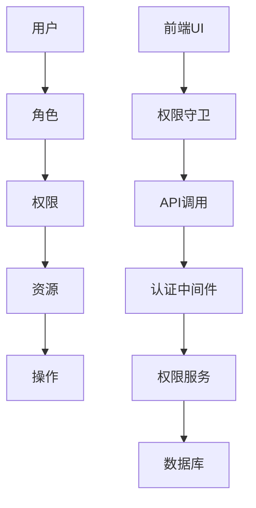

**Diagram sources **
- [rbac.service.js](file://backend/src/services/rbac.service.js#L1-L50)
- [permissionConfig.ts](file://frontend/src/features/permissions/model/permissionConfig.ts#L1-L50)

**Section sources**
- [rbac.service.js](file://backend/src/services/rbac.service.js#L1-L100)

## 核心组件

RBAC权限控制系统由多个核心组件构成，包括权限服务、中间件、工具函数和数据库表。这些组件协同工作，实现完整的权限管理功能。

主要组件包括：
- `RbacService`：核心权限服务，管理角色、资源和权限的映射关系
- `RequirePermissionMiddleware`：权限验证中间件，用于保护API路由
- `PermissionService`：基于数据库的权限服务，支持动态权限管理
- `PermissionGuard`：前端权限守卫组件，控制UI元素的显示

**Section sources**
- [rbac.service.js](file://backend/src/services/rbac.service.js#L1-L50)
- [requirePermission.middleware.js](file://backend/src/middlewares/requirePermission.middleware.js#L1-L50)
- [permission.service.js](file://backend/src/services/permission.service.js#L1-L50)
- [PermissionGuard.tsx](file://frontend/src/features/permissions/ui/PermissionGuard.tsx#L1-L50)

## 权限模型

RBAC权限模型基于角色、资源和操作三个核心概念构建。系统定义了三种基本角色：查看者(viewer)、编辑者(editor)和管理员(admin)，每种角色对应不同的权限级别。

### 角色定义

系统定义了以下角色：

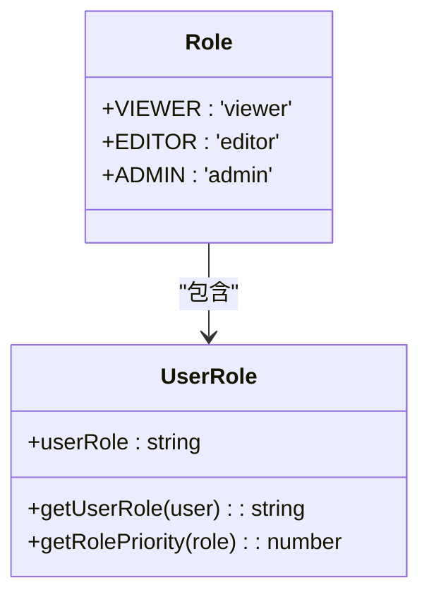

**Diagram sources **
- [rbac.service.js](file://backend/src/services/rbac.service.js#L20-L50)

### 资源与操作

系统定义了多种资源类型和操作类型，通过权限矩阵建立角色与资源操作的映射关系。

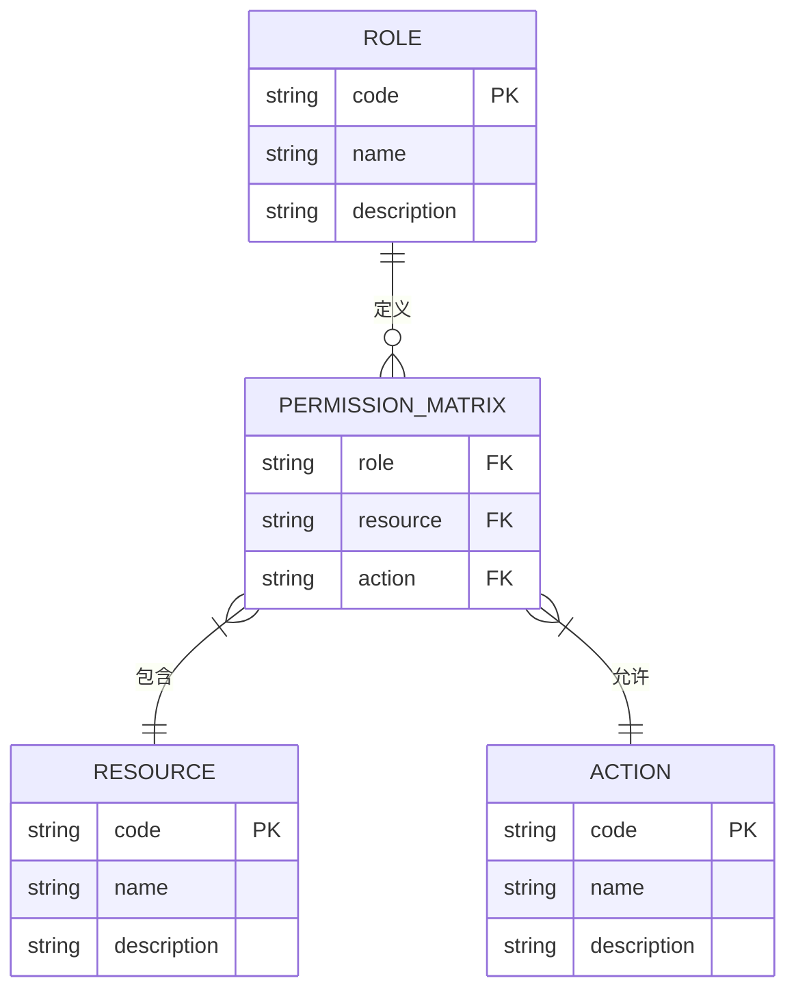

**Diagram sources **
- [rbac.service.js](file://backend/src/services/rbac.service.js#L50-L80)
- [rbac.js](file://backend/src/utils/rbac.js#L10-L40)

## 中间件实现

权限中间件是RBAC系统的关键组件，负责在请求处理过程中验证用户权限。系统提供了多种中间件工厂函数，支持不同的权限验证场景。

### 权限验证中间件

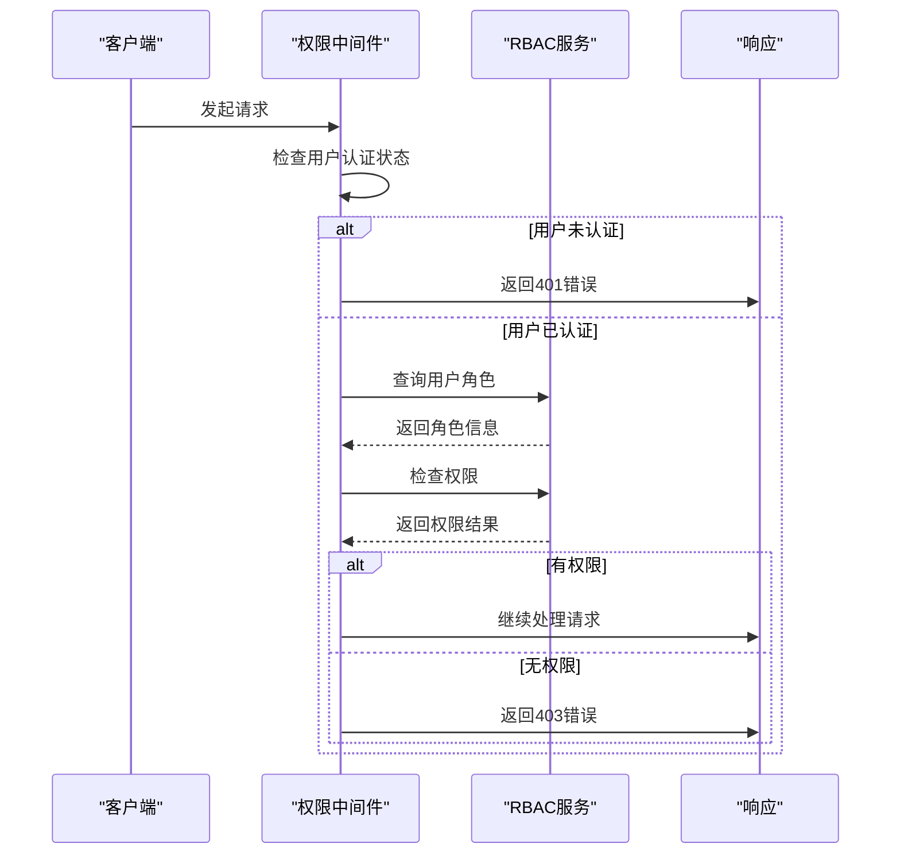

**Diagram sources **
- [requirePermission.middleware.js](file://backend/src/middlewares/requirePermission.middleware.js#L1-L100)

### 中间件类型

系统提供了多种权限中间件，满足不同的使用场景：

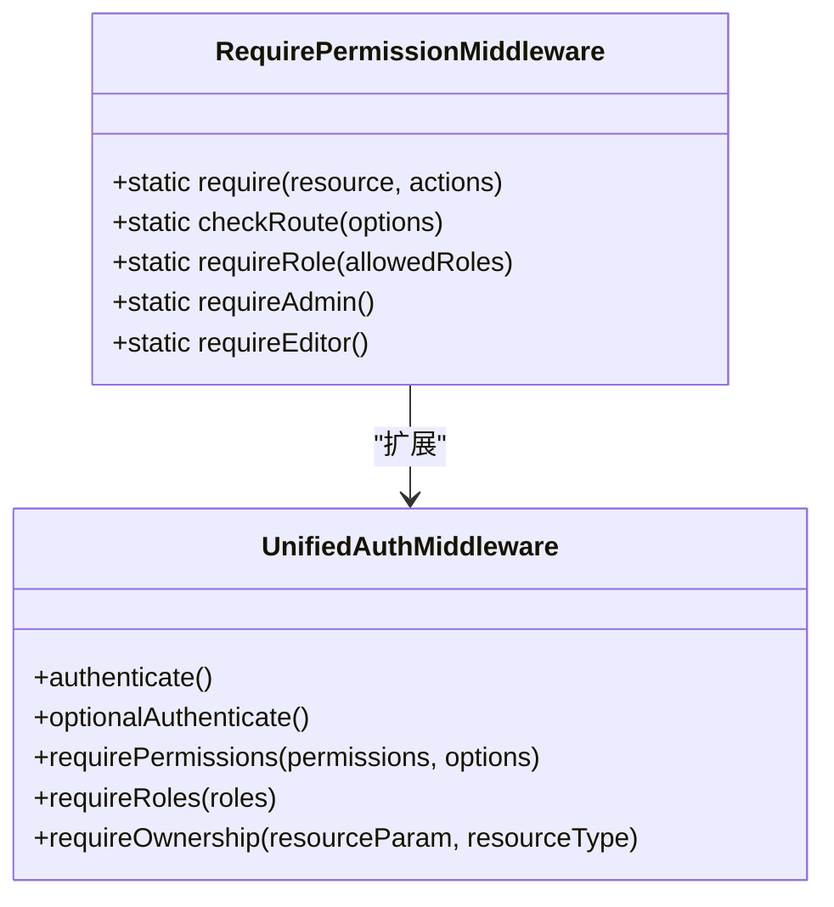

**Diagram sources **
- [requirePermission.middleware.js](file://backend/src/middlewares/requirePermission.middleware.js#L1-L50)
- [unifiedAuth.middleware.js](file://backend/src/middleware/unifiedAuth.middleware.js#L1-L50)

**Section sources**
- [requirePermission.middleware.js](file://backend/src/middlewares/requirePermission.middleware.js#L1-L222)
- [unifiedAuth.middleware.js](file://backend/src/middleware/unifiedAuth.middleware.js#L1-L716)

## 数据库设计

RBAC系统通过数据库表存储权限相关数据，支持动态的权限管理和角色分配。数据库设计遵循规范化原则，确保数据的一致性和完整性。

### 数据库表结构

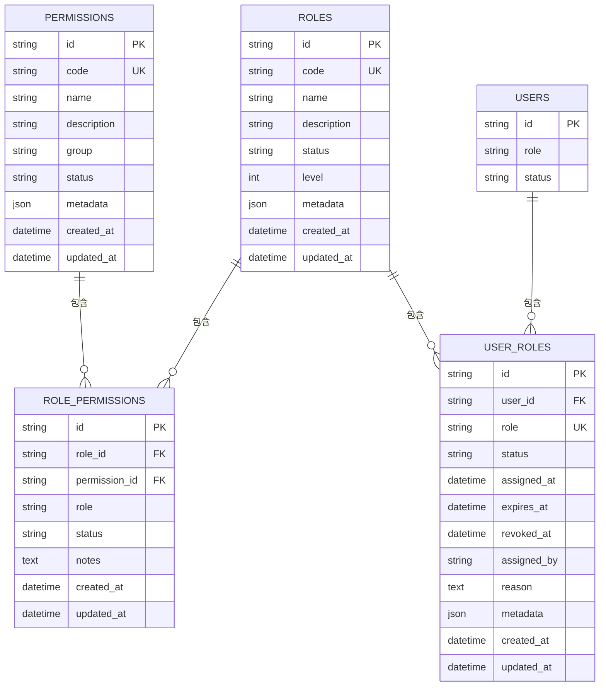

**Diagram sources **
- [create_rbac_tables.js](file://backend/src/db/migrations/20250103000006_create_rbac_tables.js#L1-L241)

### 默认权限配置

系统在初始化时会创建默认的权限和角色配置，包括：

- **用户权限**：个人资料管理、任务操作、资产操作等
- **管理员权限**：用户管理、系统配置、审计日志等
- **系统权限**：系统间调用、维护操作等

**Section sources**
- [create_rbac_tables.js](file://backend/src/db/migrations/20250103000006_create_rbac_tables.js#L1-L241)
- [permission.service.js](file://backend/src/services/permission.service.js#L1-L50)

## 前端权限控制

前端权限控制系统与后端协同工作，提供UI层面的访问控制。通过权限守卫组件和Hook，实现动态的界面元素显示控制。

### 权限配置

前端定义了详细的权限规则，包括页面权限、功能权限和操作权限：

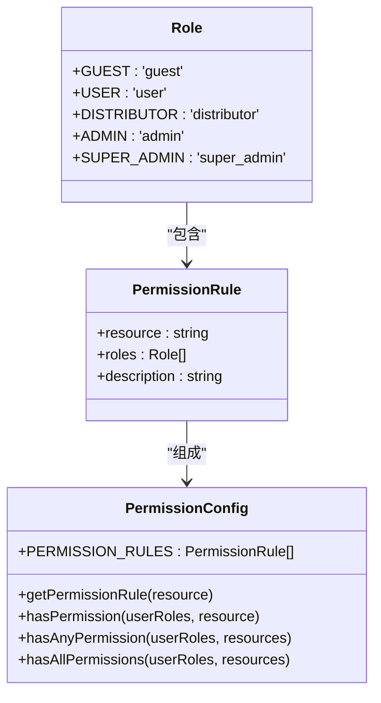

**Diagram sources **
- [permissionConfig.ts](file://frontend/src/features/permissions/model/permissionConfig.ts#L1-L189)

### 权限Hook

前端提供了自定义Hook，简化权限检查的使用：

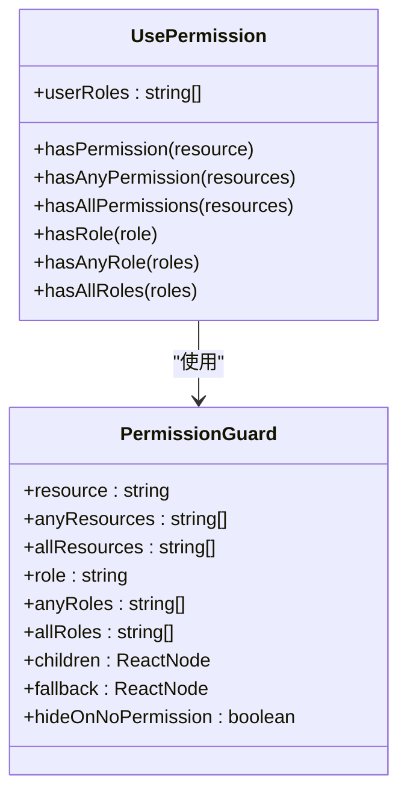

**Diagram sources **
- [usePermission.ts](file://frontend/src/features/permissions/model/usePermission.ts#L1-L92)
- [PermissionGuard.tsx](file://frontend/src/features/permissions/ui/PermissionGuard.tsx#L1-L179)

**Section sources**
- [permissionConfig.ts](file://frontend/src/features/permissions/model/permissionConfig.ts#L1-L189)
- [usePermission.ts](file://frontend/src/features/permissions/model/usePermission.ts#L1-L92)
- [PermissionGuard.tsx](file://frontend/src/features/permissions/ui/PermissionGuard.tsx#L1-L179)

## 权限检查流程

RBAC系统的权限检查流程遵循标准化的处理步骤，确保权限验证的一致性和可靠性。

### 后端权限检查流程

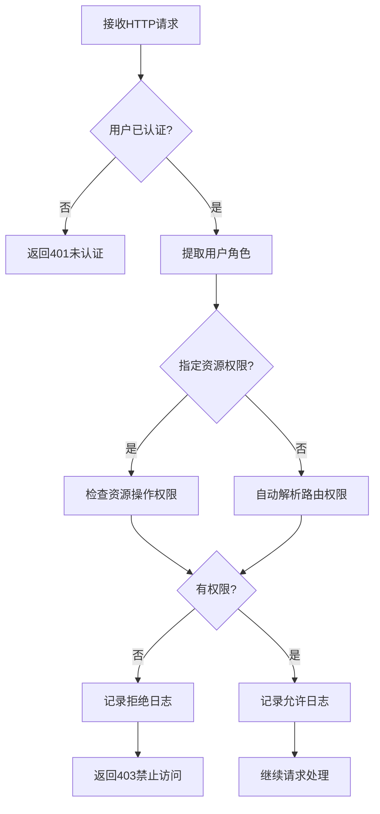

**Diagram sources **
- [requirePermission.middleware.js](file://backend/src/middlewares/requirePermission.middleware.js#L1-L222)

### 前端权限检查流程

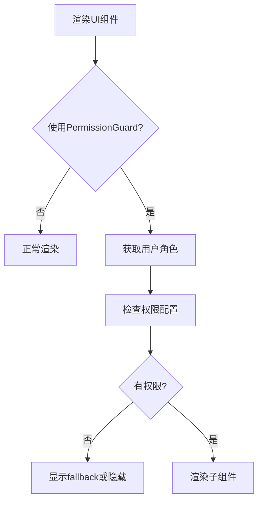

**Diagram sources **
- [PermissionGuard.tsx](file://frontend/src/features/permissions/ui/PermissionGuard.tsx#L1-L179)

**Section sources**
- [requirePermission.middleware.js](file://backend/src/middlewares/requirePermission.middleware.js#L1-L222)
- [PermissionGuard.tsx](file://frontend/src/features/permissions/ui/PermissionGuard.tsx#L1-L179)

## 审计与日志

RBAC系统提供了完善的审计和日志功能，记录所有权限相关的操作，便于安全审计和问题排查。

### 权限审计日志

系统记录以下类型的权限审计信息：
- 权限检查成功
- 权限检查失败
- 角色分配和撤销
- 用户资源访问

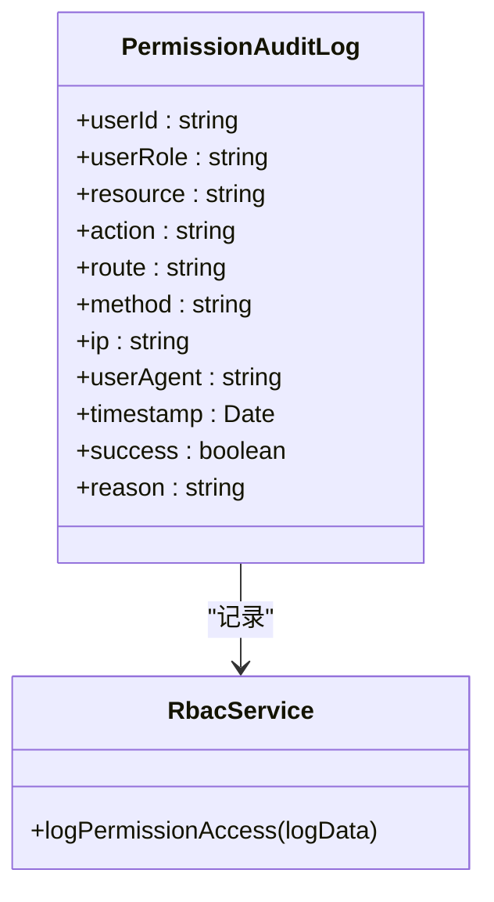

**Diagram sources **
- [rbac.ts](file://backend/src/utils/rbac.ts#L1-L343)
- [rbac.service.js](file://backend/src/services/rbac.service.js#L1-L50)

### 日志记录策略

系统采用分级日志策略：
- **INFO级别**：记录成功的权限访问
- **WARN级别**：记录权限拒绝事件
- **ERROR级别**：记录权限检查异常

**Section sources**
- [rbac.service.js](file://backend/src/services/rbac.service.js#L250-L296)
- [rbac.ts](file://backend/src/utils/rbac.ts#L1-L343)

## 最佳实践

为确保RBAC系统的有效性和安全性，建议遵循以下最佳实践：

### 权限设计原则

1. **最小权限原则**：用户只应拥有完成工作所需的最小权限
2. **职责分离**：关键操作应由不同角色共同完成
3. **定期审查**：定期审查用户权限和角色分配
4. **权限继承**：合理使用角色继承，避免权限冗余

### 实施建议

1. **前端后端协同**：前后端都应进行权限验证，避免仅依赖单一层面的控制
2. **缓存优化**：对频繁访问的权限数据进行缓存，提高性能
3. **审计跟踪**：记录所有权限相关的操作，便于安全审计
4. **错误处理**：提供清晰的权限错误信息，但不泄露敏感信息

**Section sources**
- [rbac.service.js](file://backend/src/services/rbac.service.js#L1-L50)
- [permission.service.js](file://backend/src/services/permission.service.js#L1-L50)
- [PermissionGuard.tsx](file://frontend/src/features/permissions/ui/PermissionGuard.tsx#L1-L50)