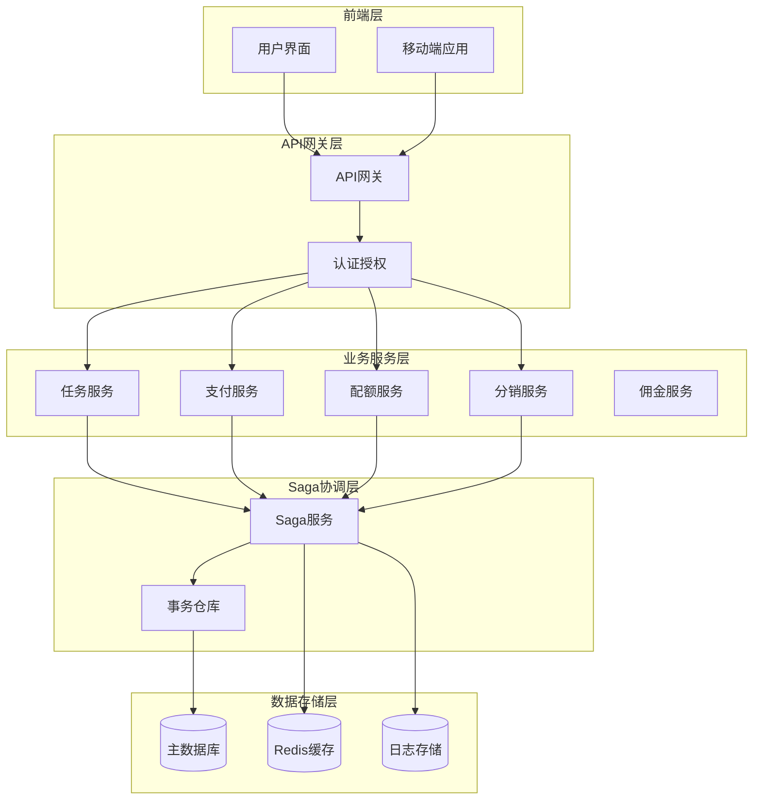
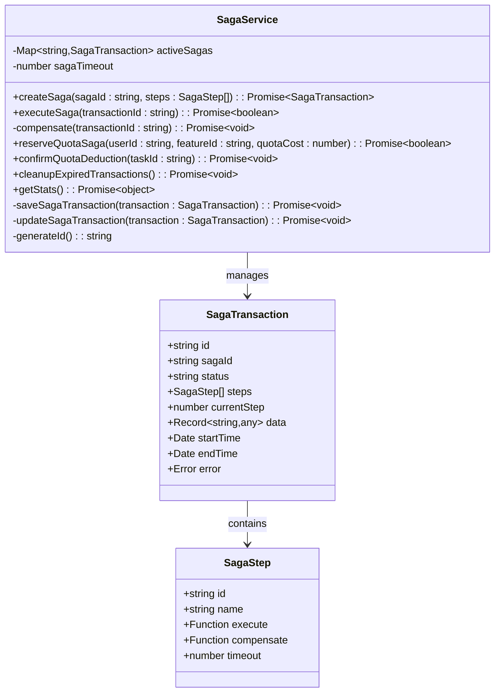
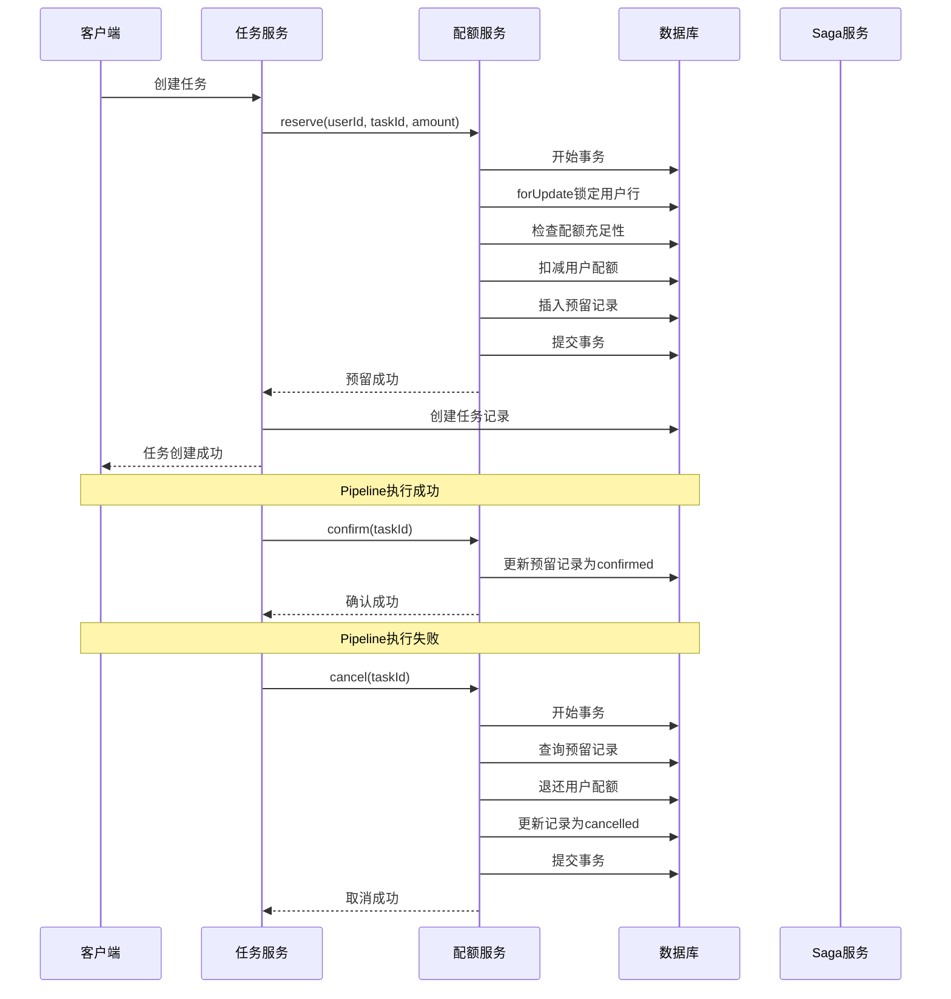
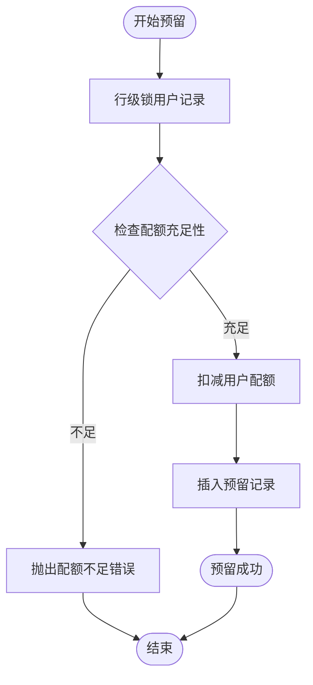
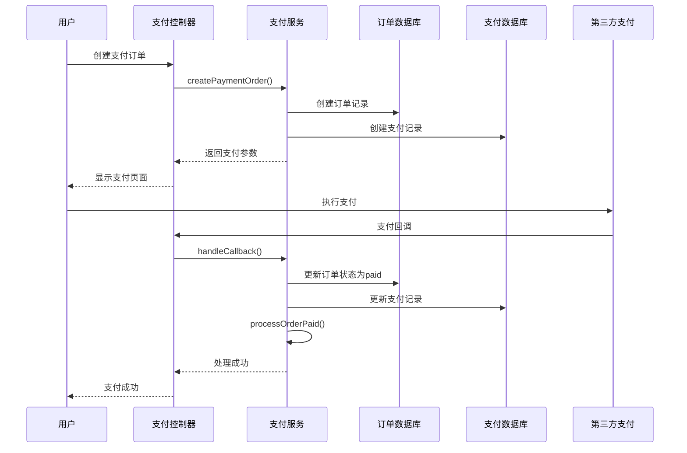
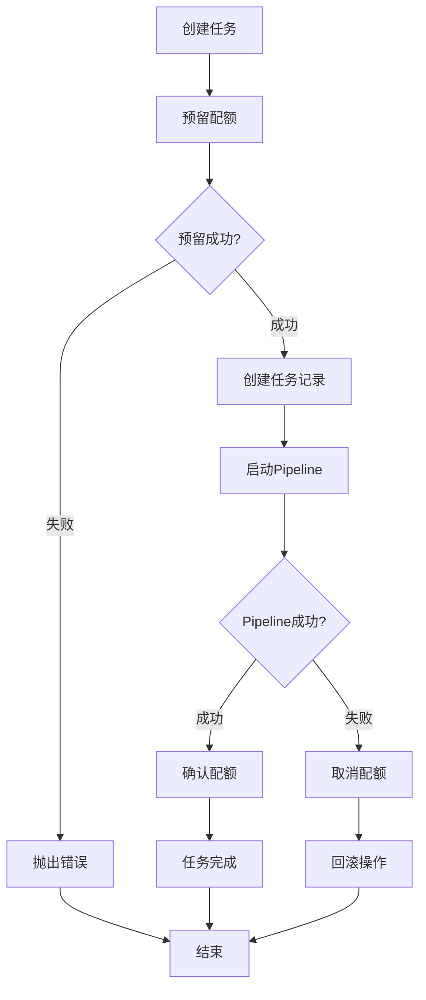
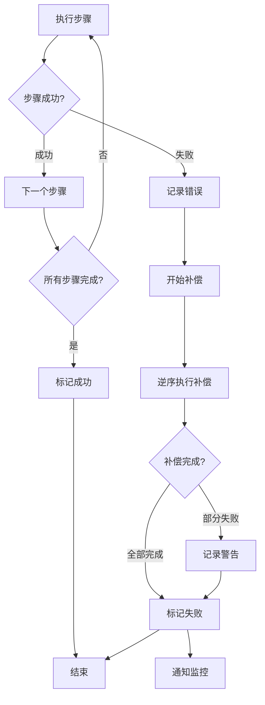

# Saga分布式事务

<cite>
**本文档引用的文件**
- [saga.service.ts](file://backend/src/services/saga.service.ts)
- [quota.service.js](file://backend/src/services/quota.service.js)
- [payment.service.js](file://backend/src/services/payment.service.js)
- [task.service.js](file://backend/src/services/task.service.js)
- [distribution.service.js](file://backend/src/services/distribution.service.js)
- [commission.service.js](file://backend/src/services/commission.service.js)
- [payment.controller.js](file://backend/src/controllers/payment.controller.js)
- [pipelineEngine.service.js](file://backend/src/services/pipelineEngine.service.js)
- [20250102000001_create_quota_transactions.js](file://backend/src/db/migrations/20250102000001_create_quota_transactions.js)
- [20250104000001_create_payment_tables.js](file://backend/src/db/migrations/20250104000001_create_payment_tables.js)
- [20251029110003_create_commissions_table.js](file://backend/src/db/migrations/20251029110003_create_commissions_table.js)
- [P0-001-Saga配额管理-任务卡.md](file://tasks/P0-001-Saga配额管理-任务卡.md)
</cite>

## 目录
1. [概述](#概述)
2. [系统架构](#系统架构)
3. [核心组件分析](#核心组件分析)
4. [Saga模式实现](#saga模式实现)
5. [配额管理Saga](#配额管理saga)
6. [支付系统集成](#支付系统集成)
7. [分布式事务协调](#分布式事务协调)
8. [性能优化策略](#性能优化策略)
9. [故障处理机制](#故障处理机制)
10. [最佳实践](#最佳实践)

## 概述

Saga分布式事务是一种长生命周期的分布式事务解决方案，特别适用于微服务架构中的跨服务操作。在本系统中，Saga模式被广泛应用于配额管理、支付处理、分销佣金计算等关键业务场景，确保在复杂的分布式环境中保持数据一致性。

### 核心特性

- **三阶段事务模型**：Reserve（预留）→ Confirm（确认）| Cancel（取消）
- **幂等性设计**：防止重复操作导致的数据不一致
- **补偿机制**：失败时自动回滚已执行的操作
- **高并发支持**：通过行级锁和事务隔离保证并发安全
- **监控与追踪**：完整的事务状态管理和日志记录

## 系统架构



**架构图来源**
- [saga.service.ts](file://backend/src/services/saga.service.ts#L31-L52)
- [task.service.js](file://backend/src/services/task.service.js#L1-L50)

## 核心组件分析

### Saga服务核心类

Saga服务是整个分布式事务的核心协调器，负责管理事务的生命周期和状态转换。



**类图来源**
- [saga.service.ts](file://backend/src/services/saga.service.ts#L11-L30)

### 配额服务集成

配额服务实现了完整的Saga模式三阶段操作，确保配额分配的原子性和一致性。



**序列图来源**
- [quota.service.js](file://backend/src/services/quota.service.js#L79-L121)
- [task.service.js](file://backend/src/services/task.service.js#L1-L100)

**章节来源**
- [saga.service.ts](file://backend/src/services/saga.service.ts#L31-L341)
- [quota.service.js](file://backend/src/services/quota.service.js#L79-L232)

## Saga模式实现

### 三阶段事务模型

系统采用经典的三阶段事务模型来确保分布式操作的一致性：

1. **Reserve（预留阶段）**：验证资源可用性并预留资源
2. **Confirm（确认阶段）**：正式确认资源使用并完成操作
3. **Cancel（取消阶段）**：回滚操作并释放预留资源

### 事务状态管理

```mermaid
stateDiagram-v2
[*] --> Pending : 创建事务
Pending --> Running : 开始执行
Running --> Completed : 所有步骤成功
Running --> Failed : 执行失败
Failed --> Compensating : 开始补偿
Compensating --> Failed : 补偿完成
Completed --> [*] : 事务结束
Failed --> [*] : 事务结束
note right of Running : 当前执行步骤 : currentStep
note left of Compensating : 逆序执行补偿操作
```

**状态图来源**
- [saga.service.ts](file://backend/src/services/saga.service.ts#L19-L30)

### 步骤执行机制

每个Saga事务由多个步骤组成，每个步骤都有执行和补偿两个函数：

```typescript
// 步骤定义示例
const steps: SagaStep[] = [
  {
    id: 'check_user',
    name: '检查用户状态',
    execute: async () => {
      const user = await db('users').where('id', userId).first();
      if (!user) throw new Error('用户不存在');
      if (!user.is_member) throw new Error('用户非会员');
      return user;
    },
    compensate: async () => {
      // 检查步骤无需补偿
    }
  },
  {
    id: 'reserve_quota',
    name: '预扣配额',
    execute: async () => {
      // 预扣配额逻辑
    },
    compensate: async (data) => {
      // 回滚配额预扣
    }
  }
];
```

**章节来源**
- [saga.service.ts](file://backend/src/services/saga.service.ts#L60-L128)

## 配额管理Saga

### 数据库设计

配额管理使用专门的事务表来跟踪每个阶段的状态：

| 字段名 | 类型 | 约束 | 描述 |
|--------|------|------|------|
| id | string | PRIMARY | 事务ID |
| task_id | string | UNIQUE, NOT NULL | 关联的任务ID |
| user_id | string | NOT NULL | 用户ID |
| amount | integer | NOT NULL | 配额数量 |
| phase | enum | NOT NULL | 阶段状态：reserved/confirmed/cancelled |
| idempotent_done | boolean | DEFAULT true | 幂等性标记 |
| created_at | datetime | DEFAULT NOW() | 创建时间 |
| updated_at | datetime | ON UPDATE NOW() | 更新时间 |

### 核心业务流程

#### 1. 预留配额流程



**流程图来源**
- [quota.service.js](file://backend/src/services/quota.service.js#L79-L121)

#### 2. 确认配额流程

确认流程具有幂等性设计，确保重复调用不会产生副作用：

```typescript
async confirm(taskId: string): Promise<void> {
  // 幂等性检查
  const record = await db('quota_transactions')
    .where({ task_id: taskId, phase: 'reserved' })
    .first();

  if (!record || record.idempotent_done !== true) {
    return; // 已确认或不存在，直接返回
  }

  // 更新状态为confirmed
  await db('quota_transactions')
    .where({ task_id: taskId })
    .update({ 
      phase: 'confirmed',
      idempotent_done: true 
    });
}
```

#### 3. 取消配额流程

取消流程在事务中执行，确保回滚操作的原子性：

```typescript
async cancel(taskId: string): Promise<void> {
  return db.transaction(async (trx) => {
    const record = await trx('quota_transactions')
      .where({ task_id: taskId, phase: 'reserved' })
      .first();

    if (!record || record.phase !== 'reserved') {
      return; // 幂等性检查
    }

    // 退还配额
    await trx('users')
      .where({ id: record.user_id })
      .increment('quota_remaining', record.amount);

    // 更新状态
    await trx('quota_transactions')
      .where({ task_id: taskId })
      .update({ phase: 'cancelled' });
  });
}
```

**章节来源**
- [quota.service.js](file://backend/src/services/quota.service.js#L79-L232)
- [20250102000001_create_quota_transactions.js](file://backend/src/db/migrations/20250102000001_create_quota_transactions.js#L1-L37)

## 支付系统集成

### 支付流程中的Saga应用

支付系统结合了传统的两阶段提交和Saga模式的优势：



**序列图来源**
- [payment.service.js](file://backend/src/services/payment.service.js#L128-L169)
- [payment.controller.js](file://backend/src/controllers/payment.controller.js#L15-L50)

### 退款处理的Saga补偿

退款操作同样采用Saga模式，确保退款成功时能够正确处理相关业务逻辑：

```typescript
async createRefund(orderId, userId, refundData) {
  try {
    // 1. 查找订单并验证状态
    const order = await db('payment_orders')
      .where({ id: orderId, user_id: userId, status: 'paid' })
      .first();

    // 2. 创建退款记录
    const refundRecord = {
      id: this.generateId(),
      order_id: orderId,
      user_id: userId,
      refund_amount: refundAmount,
      status: 'pending'
    };
    await db('refund_records').insert(refundRecord);

    // 3. 调用第三方支付平台退款
    const refundResult = await this.processRefund(order, refundRecord);

    // 4. 更新退款状态
    await db('refund_records')
      .where('id', refundRecord.id)
      .update({ status: 'success' });

    // 5. 处理业务回滚
    await this.processOrderRefunded(orderId, userId, order.product_type, refundAmount);

    return { success: true, ...refundResult };
  } catch (error) {
    // 退款失败时的补偿处理
    await this.handleRefundFailure(orderId, error);
    throw error;
  }
}
```

**章节来源**
- [payment.service.js](file://backend/src/services/payment.service.js#L350-L450)

## 分布式事务协调

### 任务执行中的Saga集成

任务服务集成了Saga模式，确保任务创建和执行过程中的数据一致性：



**流程图来源**
- [task.service.js](file://backend/src/services/task.service.js#L15-L100)
- [pipelineEngine.service.js](file://backend/src/services/pipelineEngine.service.js#L302-L342)

### 分销佣金的Saga补偿

分销系统中的佣金计算也采用了Saga模式：

```typescript
// 佣金计算Saga步骤
const commissionSteps: SagaStep[] = [
  {
    id: 'calculate_commission',
    name: '计算佣金',
    execute: async () => {
      // 计算佣金金额并创建冻结记录
      const commissionId = await this.calculateCommission(orderId, userId);
      return { commissionId };
    },
    compensate: async (data) => {
      // 取消佣金计算
      await this.cancelCommission(data.commissionId);
    }
  },
  {
    id: 'update_distributor',
    name: '更新分销员统计',
    execute: async (prevData) => {
      // 更新分销员累计佣金
      await this.updateDistributorStats(prevData.commissionId);
    },
    compensate: async (data) => {
      // 回滚分销员统计
      await this.rollbackDistributorStats(data.commissionId);
    }
  }
];
```

**章节来源**
- [distribution.service.js](file://backend/src/services/distribution.service.js#L80-L120)
- [commission.service.js](file://backend/src/services/commission.service.js#L41-L82)

## 性能优化策略

### 事务超时管理

系统设置了合理的事务超时时间，防止长时间占用资源：

```typescript
export class SagaService extends EventEmitter {
  private sagaTimeout = 30000; // 30秒超时
  
  async executeSaga(transactionId: string): Promise<boolean> {
    // 步骤超时控制
    const timeoutPromise = new Promise((_, reject) => {
      setTimeout(() => reject(new Error(`步骤超时: ${step.name}`)), 
                 step.timeout || this.sagaTimeout);
    });
    
    const stepPromise = step.execute();
    const result = await Promise.race([stepPromise, timeoutPromise]);
  }
}
```

### 并发控制机制

通过行级锁和幂等性设计防止并发问题：

```typescript
// 配额预留的并发控制
async reserve(userId: string, taskId: string, amount = 1) {
  return db.transaction(async (trx) => {
    // 使用forUpdate锁定用户行
    const user = await trx('users')
      .where({ id: userId })
      .forUpdate()
      .first();
    
    // 幂等性检查
    const existing = await trx('quota_transactions')
      .where({ task_id: taskId })
      .first();
    
    if (existing) {
      return; // 已存在，直接返回
    }
    
    // 执行预留逻辑
  });
}
```

### 清理机制

定期清理过期的事务记录，保持系统性能：

```typescript
async cleanupExpiredTransactions(): Promise<void> {
  const expiredTime = new Date(Date.now() - 24 * 60 * 60 * 1000); // 24小时前
  
  const deleted = await knex('saga_transactions')
    .where('start_time', '<', expiredTime)
    .whereIn('status', ['completed', 'failed'])
    .del();
  
  if (deleted > 0) {
    logger.info('清理过期Saga事务', { deleted });
  }
}
```

**章节来源**
- [saga.service.ts](file://backend/src/services/saga.service.ts#L33-L34)
- [quota.service.js](file://backend/src/services/quota.service.js#L79-L121)
- [saga.service.ts](file://backend/src/services/saga.service.ts#L300-L320)

## 故障处理机制

### 自动补偿机制

当Saga事务执行失败时，系统会自动触发补偿操作：



**流程图来源**
- [saga.service.ts](file://backend/src/services/saga.service.ts#L85-L128)

### 监控和告警

系统提供了完整的监控指标：

```typescript
// Saga统计信息
async getStats() {
  const stats = await knex('saga_transactions')
    .select('status')
    .count('* as count')
    .groupBy('status');
  
  return stats.reduce((acc, row) => {
    acc[row.status] = parseInt(row.count);
    return acc;
  }, {});
}
```

### 人工干预接口

对于复杂情况，提供人工干预的接口：

```typescript
// 手动确认配额
async manualConfirmQuota(taskId: string): Promise<void> {
  const record = await db('quota_transactions')
    .where({ task_id: taskId, phase: 'reserved' })
    .first();
  
  if (record) {
    await db('quota_transactions')
      .where({ id: record.id })
      .update({ phase: 'confirmed' });
  }
}

// 手动取消配额
async manualCancelQuota(taskId: string): Promise<void> {
  const record = await db('quota_transactions')
    .where({ task_id: taskId, phase: 'reserved' })
    .first();
  
  if (record) {
    await db.transaction(async (trx) => {
      await trx('users')
        .where({ id: record.user_id })
        .increment('quota_remaining', record.amount);
      
      await trx('quota_transactions')
        .where({ id: record.id })
        .update({ phase: 'cancelled' });
    });
  }
}
```

**章节来源**
- [saga.service.ts](file://backend/src/services/saga.service.ts#L128-L170)
- [saga.service.ts](file://backend/src/services/saga.service.ts#L320-L341)

## 最佳实践

### 设计原则

1. **单一职责**：每个Saga步骤只负责一个具体的操作
2. **幂等性**：所有操作都必须是幂等的，支持重复执行
3. **最小化锁定**：尽量减少锁定时间，提高并发性能
4. **清晰的补偿**：补偿操作必须能够完全回滚前置操作

### 错误处理策略

```typescript
// 步骤级别的错误处理
const safeExecute = async (step: SagaStep) => {
  try {
    const result = await step.execute();
    return { success: true, result };
  } catch (error) {
    logger.error(`步骤执行失败: ${step.name}`, {
      stepId: step.id,
      error: error.message
    });
    
    // 尝试补偿
    try {
      if (step.compensate) {
        await step.compensate();
      }
    } catch (compensateError) {
      logger.error(`补偿操作失败: ${step.name}`, {
        stepId: step.id,
        error: compensateError.message
      });
    }
    
    throw error;
  }
};
```

### 测试策略

1. **单元测试**：测试每个步骤的执行和补偿逻辑
2. **集成测试**：测试完整的Saga流程
3. **压力测试**：测试高并发场景下的性能表现
4. **故障注入测试**：模拟各种故障场景验证系统的健壮性

### 监控指标

- **事务成功率**：成功完成的Saga事务比例
- **平均执行时间**：每个Saga事务的平均执行时间
- **补偿频率**：需要补偿的事务比例
- **并发度**：同时运行的Saga事务数量
- **资源利用率**：数据库连接池和CPU使用率

通过这些最佳实践，系统能够在保证数据一致性的同时，提供高性能和高可用的服务能力。