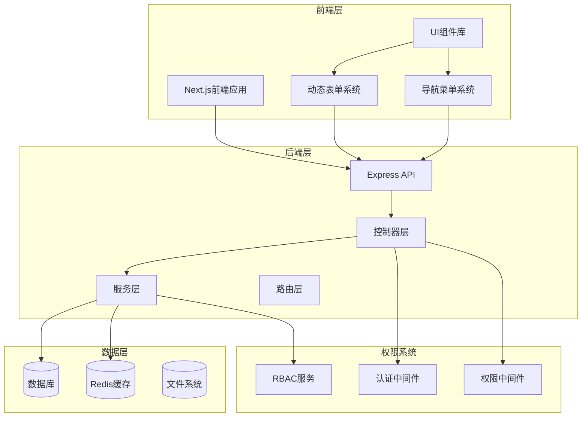
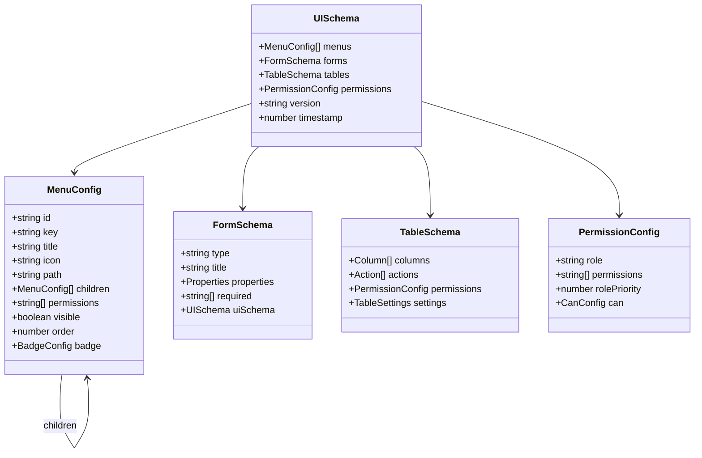
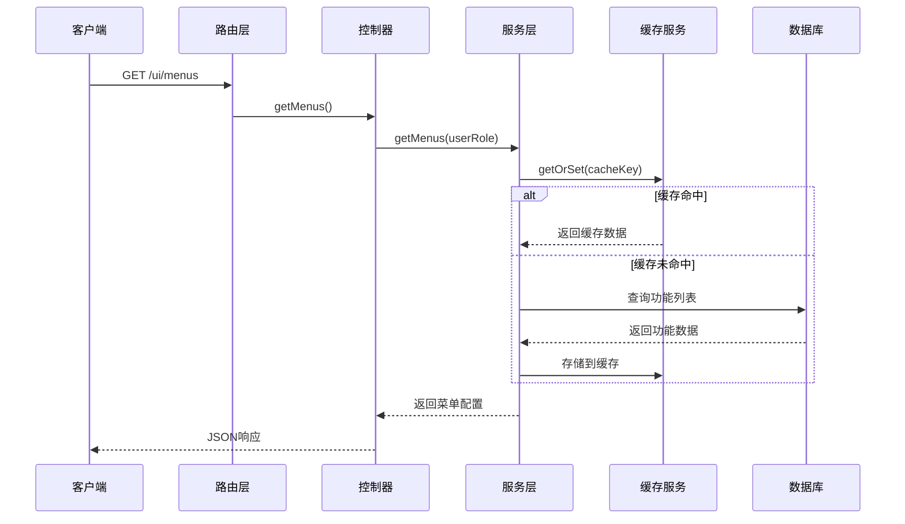
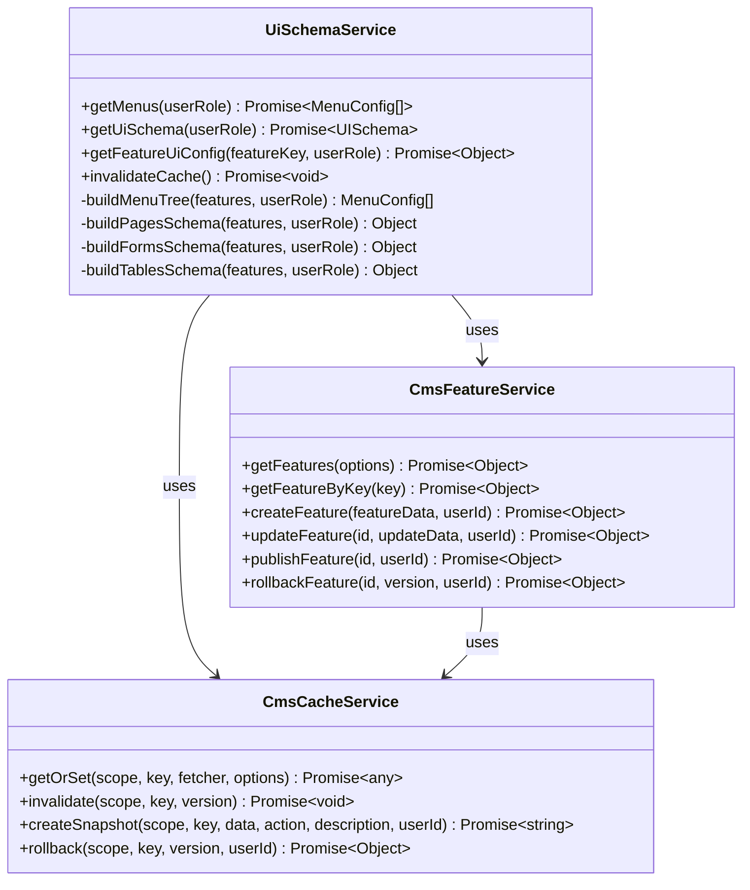
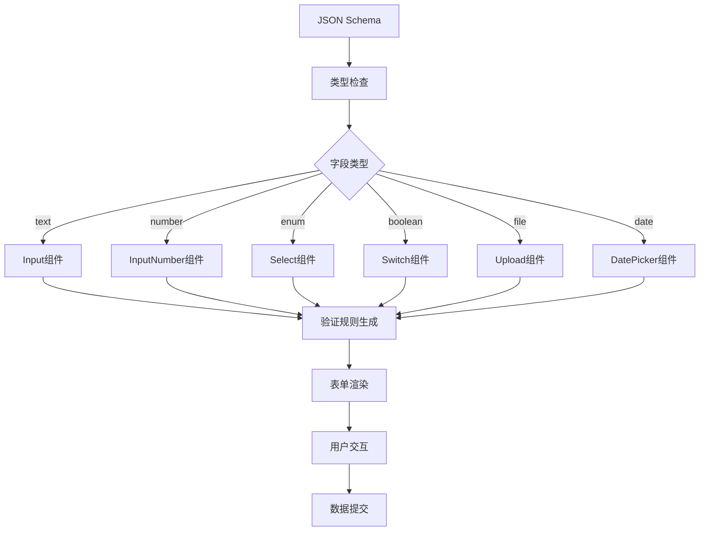
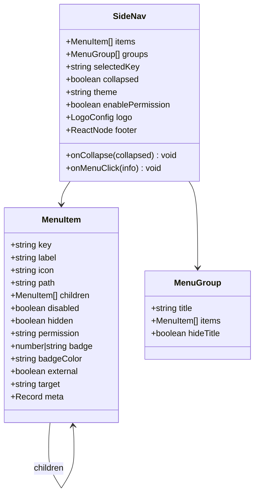
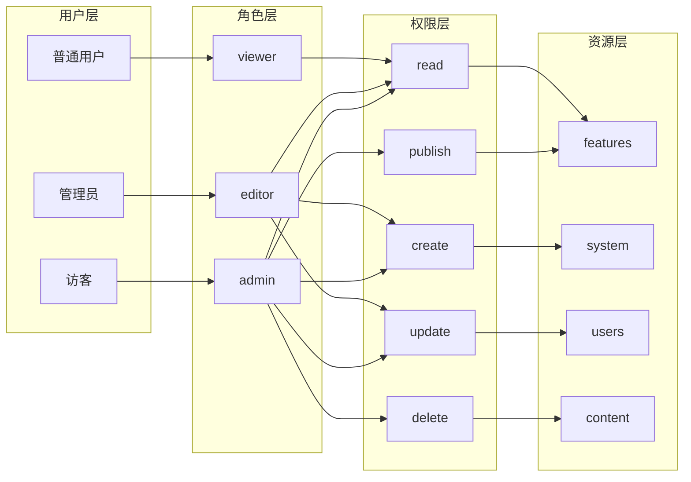
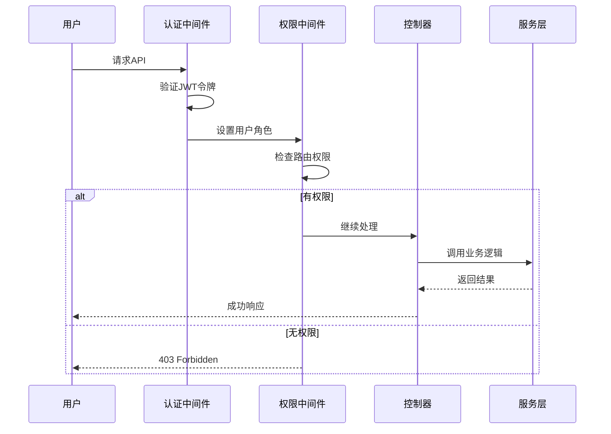
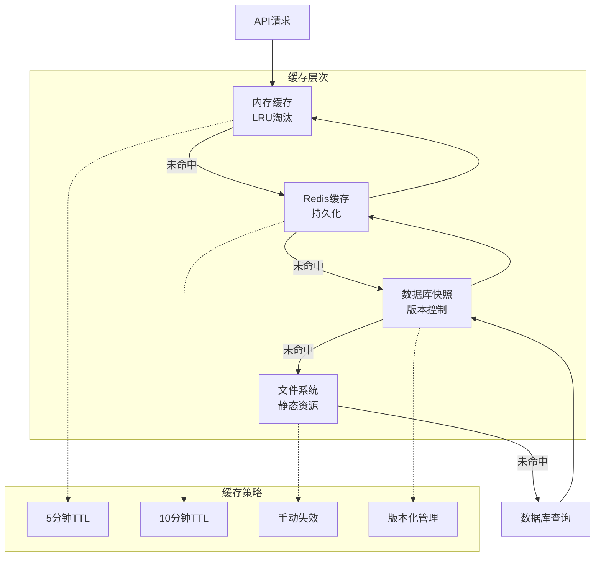

# UI Schema与菜单API

<cite>
**本文档引用的文件**
- [ui-schema.json](file://backend/docs/ui-schema.json)
- [uiSchema.controller.js](file://backend/src/controllers/uiSchema.controller.js)
- [uiSchema.service.js](file://backend/src/services/uiSchema.service.js)
- [ui.routes.js](file://backend/src/routes/ui.routes.js)
- [ui-schema.service.ts](file://backend/src/services/ui-schema.service.ts)
- [cmsFeature.service.js](file://backend/src/services/cmsFeature.service.js)
- [cmsCache.service.js](file://backend/src/services/cmsCache.service.js)
- [requirePermission.middleware.js](file://backend/src/middlewares/requirePermission.middleware.js)
- [formio/FormBuilder.tsx](file://frontend/src/components/formio/FormBuilder.tsx)
- [formio/FormRenderer.tsx](file://frontend/src/components/formio/FormRenderer.tsx)
- [DynamicForm/index.tsx](file://frontend/src/features/workbench/ui/DynamicForm/index.tsx)
- [SideNav/SideNav.tsx](file://frontend/src/shared/ui/SideNav/SideNav.tsx)
- [SideNav/types.ts](file://frontend/src/shared/ui/SideNav/types.ts)
- [admin/layout.tsx](file://frontend/src/app/admin/layout.tsx)
</cite>

## 目录
1. [简介](#简介)
2. [项目架构概览](#项目架构概览)
3. [UI Schema核心概念](#ui-schema核心概念)
4. [后端API架构](#后端api架构)
5. [前端渲染系统](#前端渲染系统)
6. [权限控制系统](#权限控制系统)
7. [缓存与性能优化](#缓存与性能优化)
8. [扩展与定制](#扩展与定制)
9. [最佳实践](#最佳实践)
10. [故障排除](#故障排除)

## 简介

UI Schema与菜单API是一个强大的后端驱动前端界面系统，通过JSON配置文件实现动态菜单、表单模板和页面配置的管理。该系统支持基于角色的权限控制，提供实时生效的配置管理能力，大大提升了系统的灵活性和可维护性。

### 核心特性

- **后端驱动前端**：通过后端API提供动态UI配置
- **权限控制**：基于RBAC的细粒度权限管理
- **实时生效**：配置修改后立即生效，无需重启
- **多层缓存**：高性能缓存机制确保响应速度
- **类型安全**：完整的TypeScript类型定义
- **响应式设计**：完美适配各种设备屏幕

## 项目架构概览



**图表来源**
- [ui.routes.js](file://backend/src/routes/ui.routes.js#L1-L63)
- [uiSchema.controller.js](file://backend/src/controllers/uiSchema.controller.js#L1-L140)
- [uiSchema.service.js](file://backend/src/services/uiSchema.service.js#L1-L600)

## UI Schema核心概念

### 数据结构定义

UI Schema采用分层的数据结构，包含菜单、表单、表格和权限配置：



**图表来源**
- [ui-schema.service.ts](file://backend/src/services/ui-schema.service.ts#L10-L70)
- [SideNav/types.ts](file://frontend/src/shared/ui/SideNav/types.ts#L10-L70)

### 配置层次结构

| 层次 | 描述 | 示例 |
|------|------|------|
| **全局配置** | 系统级别的UI配置 | 主题、语言、布局 |
| **菜单配置** | 导航菜单结构 | 分类、子菜单、权限 |
| **页面配置** | 页面级UI设置 | 布局、组件、权限 |
| **表单配置** | 动态表单定义 | 字段、验证、布局 |
| **表格配置** | 数据表格设置 | 列定义、操作、权限 |

**章节来源**
- [ui-schema.json](file://backend/docs/ui-schema.json#L1-L577)
- [ui-schema.service.ts](file://backend/src/services/ui-schema.service.ts#L70-L120)

## 后端API架构

### 核心API端点

系统提供了完整的RESTful API来管理UI配置：



**图表来源**
- [ui.routes.js](file://backend/src/routes/ui.routes.js#L15-L63)
- [uiSchema.controller.js](file://backend/src/controllers/uiSchema.controller.js#L10-L56)

### API端点详细说明

| 端点 | 方法 | 描述 | 权限要求 |
|------|------|------|----------|
| `/ui/menus` | GET | 获取用户菜单配置 | viewer |
| `/ui/schema` | GET | 获取完整UI Schema | viewer |
| `/ui/schema/:featureKey` | GET | 获取特定功能UI配置 | viewer |
| `/ui/role` | GET | 获取用户角色信息 | authenticated |
| `/ui/invalidate` | POST | 失效UI缓存 | editor |
| `/ui/health` | GET | 健康检查 | none |

**章节来源**
- [ui.routes.js](file://backend/src/routes/ui.routes.js#L1-L63)
- [uiSchema.controller.js](file://backend/src/controllers/uiSchema.controller.js#L1-L140)

### 服务层架构



**图表来源**
- [uiSchema.service.js](file://backend/src/services/uiSchema.service.js#L10-L600)
- [cmsFeature.service.js](file://backend/src/services/cmsFeature.service.js#L10-L480)
- [cmsCache.service.js](file://backend/src/services/cmsCache.service.js#L10-L389)

**章节来源**
- [uiSchema.service.js](file://backend/src/services/uiSchema.service.js#L1-L600)
- [cmsFeature.service.js](file://backend/src/services/cmsFeature.service.js#L1-L480)

## 前端渲染系统

### 动态表单系统

前端通过TypeScript类型定义和React组件实现动态表单渲染：



**图表来源**
- [DynamicForm/index.tsx](file://frontend/src/features/workbench/ui/DynamicForm/index.tsx#L334-L399)
- [formio/FormBuilder.tsx](file://frontend/src/components/formio/FormBuilder.tsx#L130-L179)

### 表单字段类型映射

| 字段类型 | React组件 | 验证规则 | 特殊属性 |
|----------|-----------|----------|----------|
| `text` | `Input` | `required`, `minLength`, `maxLength` | `placeholder`, `disabled` |
| `number` | `InputNumber` | `required`, `min`, `max` | `step`, `precision` |
| `enum` | `Select` | `required` | `options`, `mode` |
| `boolean` | `Switch` | 无 | `checkedChildren`, `unCheckedChildren` |
| `file` | `Upload` | `maxSize`, `accept` | `maxCount`, `listType` |
| `date` | `DatePicker` | `required`, `minDate`, `maxDate` | `showTime`, `format` |

**章节来源**
- [DynamicForm/index.tsx](file://frontend/src/features/workbench/ui/DynamicForm/index.tsx#L64-L143)
- [DynamicForm/index.tsx](file://frontend/src/features/workbench/ui/DynamicForm/index.tsx#L144-L242)

### 导航菜单系统

前端导航菜单采用响应式设计，支持折叠展开和权限控制：



**图表来源**
- [SideNav/SideNav.tsx](file://frontend/src/shared/ui/SideNav/SideNav.tsx#L20-L46)
- [SideNav/types.ts](file://frontend/src/shared/ui/SideNav/types.ts#L10-L70)

**章节来源**
- [SideNav/SideNav.tsx](file://frontend/src/shared/ui/SideNav/SideNav.tsx#L1-L400)
- [SideNav/types.ts](file://frontend/src/shared/ui/SideNav/types.ts#L1-L70)

## 权限控制系统

### RBAC权限模型

系统采用基于角色的访问控制（RBAC）模型，支持细粒度的权限管理：



**图表来源**
- [requirePermission.middleware.js](file://backend/src/middlewares/requirePermission.middleware.js#L1-L164)

### 权限验证流程



**图表来源**
- [requirePermission.middleware.js](file://backend/src/middlewares/requirePermission.middleware.js#L82-L123)

**章节来源**
- [requirePermission.middleware.js](file://backend/src/middlewares/requirePermission.middleware.js#L1-L164)

## 缓存与性能优化

### 多层缓存架构

系统实现了多层缓存机制，确保高性能响应：



**图表来源**
- [cmsCache.service.js](file://backend/src/services/cmsCache.service.js#L10-L389)

### 缓存失效机制

系统支持精确的缓存失效，确保配置变更的实时生效：

| 失效范围 | 失效策略 | 触发条件 | 影响范围 |
|----------|----------|----------|----------|
| `ui:*` | 全局失效 | 配置发布 | 所有用户 |
| `menus:admin` | 指定角色 | 菜单配置变更 | 管理员 |
| `schema:viewer` | 指定角色 | UI配置变更 | 访客 |
| `features:*` | 作用域失效 | 功能发布 | 相关功能 |

**章节来源**
- [cmsCache.service.js](file://backend/src/services/cmsCache.service.js#L1-L389)

## 扩展与定制

### 自定义字段类型

系统支持扩展自定义字段类型：

```typescript
// 自定义字段类型定义
interface CustomField extends FormFieldBase {
  type: 'custom_type';
  customProperty?: string;
  options?: CustomOption[];
}

// 对应的渲染器
const CustomRenderer = ({ field }: { field: CustomField }) => {
  return <CustomComponent {...field} />;
};
```

### 主题定制

支持通过配置文件定制UI主题：

| 配置项 | 类型 | 默认值 | 描述 |
|--------|------|--------|------|
| `primaryColor` | `string` | `#1890ff` | 主色调 |
| `borderRadius` | `number` | `4` | 边框圆角 |
| `componentSize` | `'small' \| 'middle' \| 'large'` | `'middle'` | 组件尺寸 |
| `dateFormat` | `string` | `'YYYY-MM-DD'` | 日期格式 |
| `timeFormat` | `string` | `'HH:mm:ss'` | 时间格式 |

**章节来源**
- [ui-schema.json](file://backend/docs/ui-schema.json#L550-L577)

## 最佳实践

### 配置管理建议

1. **版本控制**：所有配置变更都应记录版本历史
2. **权限分离**：区分配置者和使用者权限
3. **渐进式发布**：先在小范围测试再全量发布
4. **监控告警**：建立配置变更的监控机制

### 性能优化建议

1. **合理设置缓存TTL**：平衡实时性和性能
2. **批量操作**：减少不必要的API调用
3. **懒加载**：按需加载复杂的UI组件
4. **压缩传输**：对大型配置进行压缩传输

### 安全考虑

1. **输入验证**：严格验证所有用户输入
2. **权限检查**：在每个API端点进行权限验证
3. **审计日志**：记录所有配置变更操作
4. **最小权限**：遵循最小权限原则

## 故障排除

### 常见问题及解决方案

| 问题 | 症状 | 解决方案 |
|------|------|----------|
| 菜单不显示 | 权限不足或配置错误 | 检查用户权限和菜单配置 |
| 表单无法提交 | 验证规则错误 | 检查字段验证规则 |
| 缓存不生效 | 配置变更未实时更新 | 执行缓存失效操作 |
| 权限控制失效 | 无权限用户能看到功能 | 检查RBAC配置和中间件 |

### 调试工具

1. **健康检查**：访问 `/ui/health` 查看系统状态
2. **权限调试**：使用 `/ui/role` 接口查看用户权限
3. **配置预览**：通过管理界面预览配置效果
4. **日志分析**：查看详细的错误日志和审计日志

### 性能监控

建议监控以下指标：
- API响应时间
- 缓存命中率
- 内存使用情况
- 数据库查询性能
- 并发用户数

**章节来源**
- [uiSchema.controller.js](file://backend/src/controllers/uiSchema.controller.js#L108-L140)

## 总结

UI Schema与菜单API系统提供了一个强大而灵活的解决方案，通过后端驱动的方式实现了动态界面配置管理。系统具备完善的权限控制、缓存机制和扩展能力，能够满足复杂业务场景的需求。通过合理的架构设计和最佳实践，可以构建出高性能、易维护的现代化Web应用。