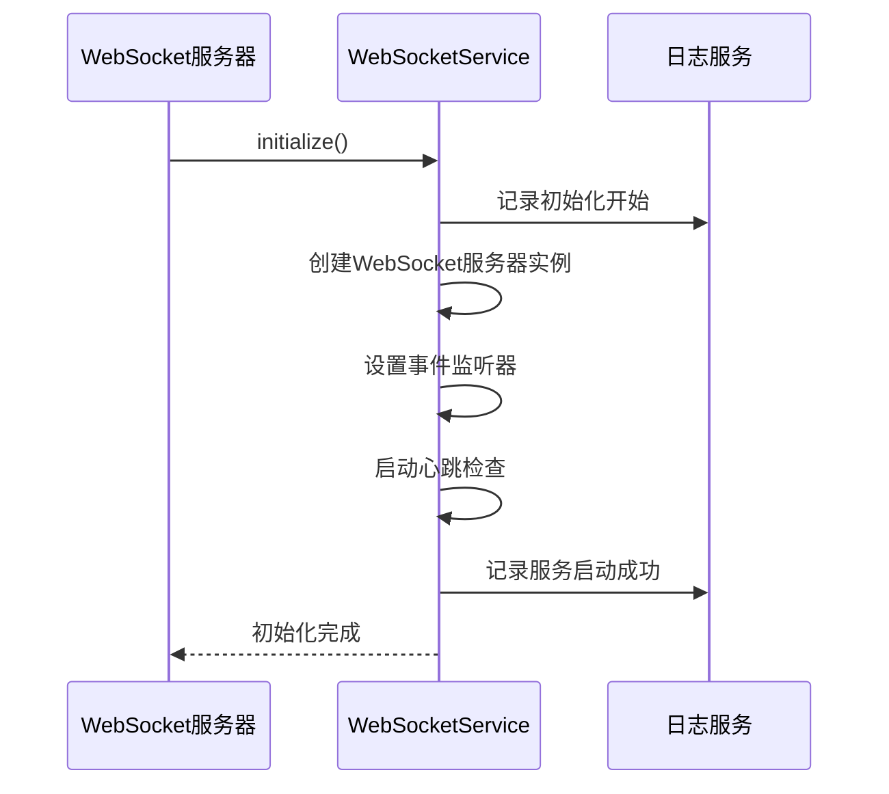
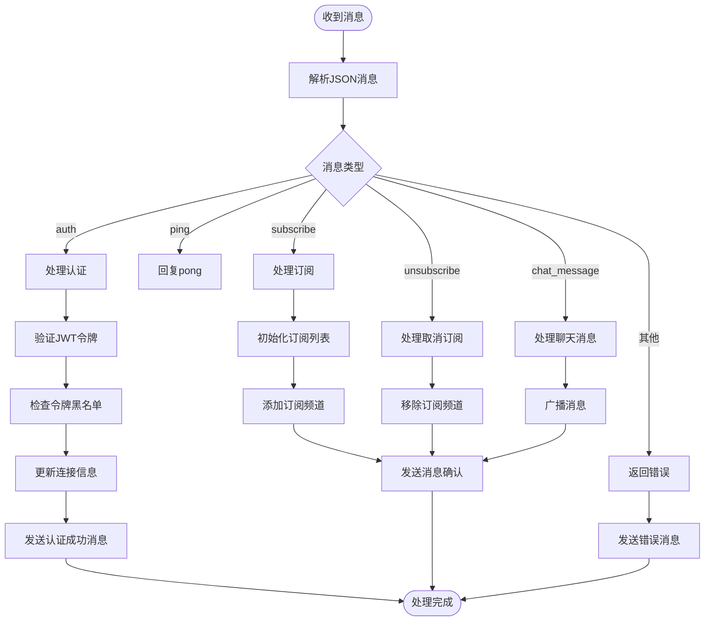
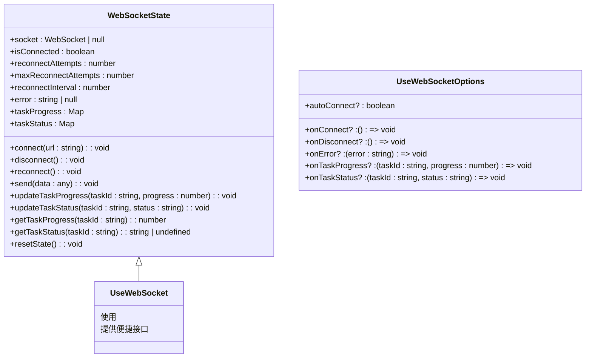
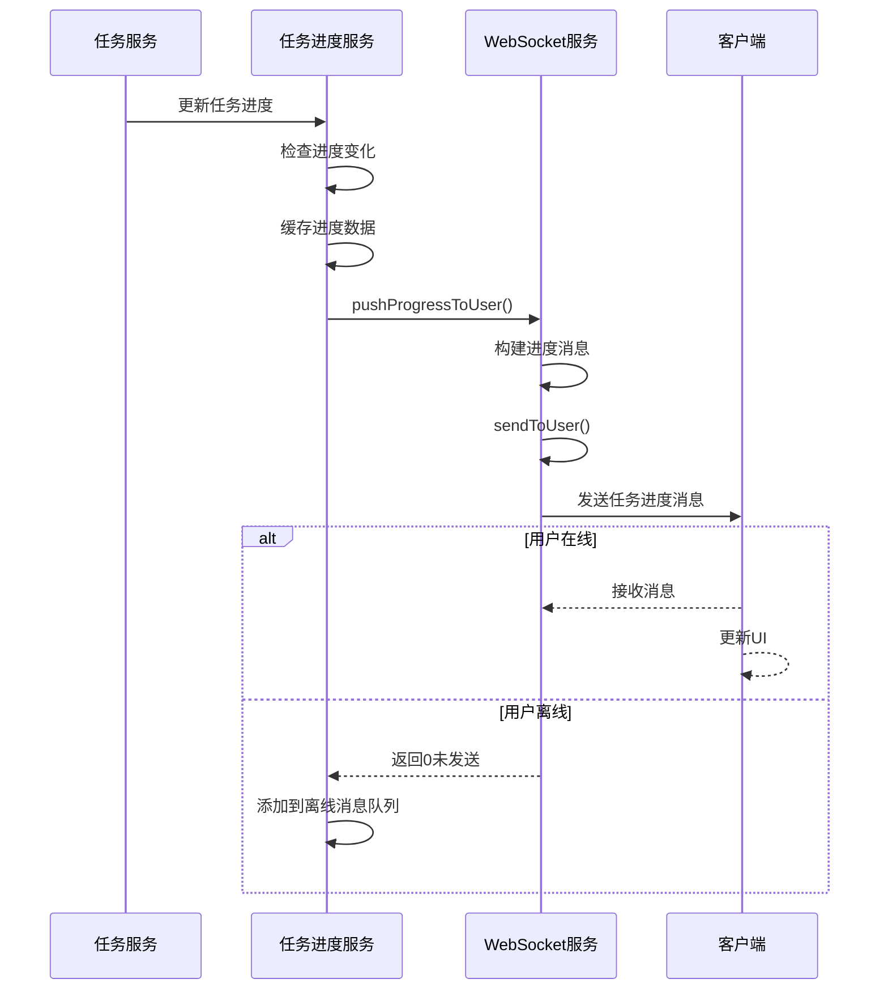
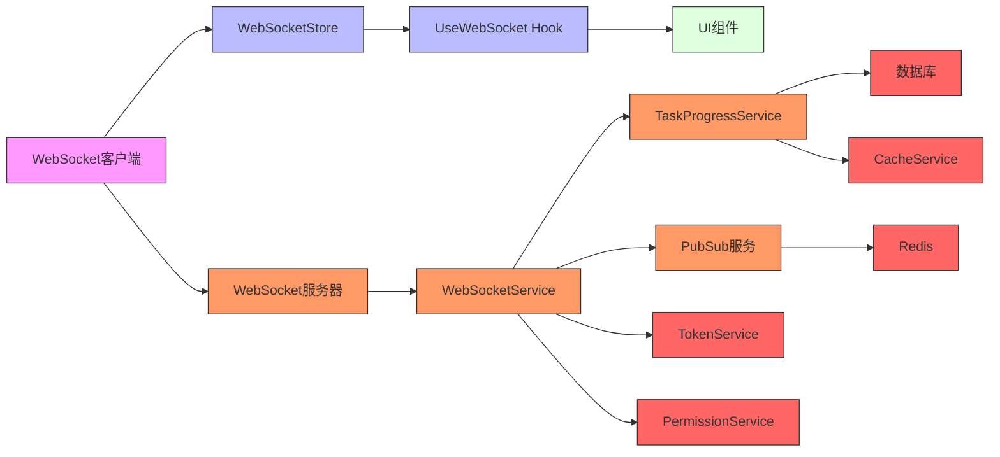

# WebSocket实时推送

<cite>
**本文档引用文件**   
- [websocket.service.js](file://backend/src/services/websocket.service.js)
- [websocket.service.ts](file://backend/src/services/websocket.service.ts)
- [websocketStore.ts](file://frontend/src/store/websocketStore.ts)
- [useWebSocket.ts](file://frontend/src/hooks/useWebSocket.ts)
- [task-progress.service.js](file://backend/src/services/task-progress.service.js)
- [pubsub/index.ts](file://backend/src/pubsub/index.ts)
</cite>

## 目录
1. [简介](#简介)
2. [系统架构](#系统架构)
3. [核心组件分析](#核心组件分析)
4. [详细组件分析](#详细组件分析)
5. [依赖关系分析](#依赖关系分析)
6. [性能考虑](#性能考虑)
7. [故障排除指南](#故障排除指南)
8. [结论](#结论)

## 简介
WebSocket实时推送系统是本项目的核心通信机制，负责实现服务器与客户端之间的双向实时通信。该系统主要用于任务进度更新、系统通知、用户状态同步等关键功能，确保用户能够即时获取任务处理状态和其他重要信息。

系统采用WebSocket协议作为主要通信方式，结合Redis Pub/Sub机制实现跨服务的消息广播，形成了一个高效、可靠的实时通信架构。后端使用Node.js的ws库实现WebSocket服务器，前端通过Zustand状态管理库维护WebSocket连接状态，并提供便捷的API供各组件使用。

## 系统架构

```mermaid
graph TD
subgraph "前端"
A[WebSocket客户端] --> B[WebSocketStore]
B --> C[UseWebSocket Hook]
C --> D[UI组件]
end
subgraph "后端"
E[WebSocket服务器] --> F[WebSocketService]
F --> G[TaskProgressService]
F --> H[PubSub服务]
G --> I[数据库]
H --> J[Redis]
end
A < --> |双向通信| E
H < --> |消息广播| F
```

**架构说明**：
- 前端通过WebSocketStore统一管理WebSocket连接状态
- UseWebSocket Hook为各组件提供便捷的WebSocket功能接口
- 后端WebSocketService处理所有WebSocket连接和消息
- TaskProgressService负责任务进度的推送逻辑
- PubSub服务通过Redis实现跨服务的消息广播

**架构来源**
- [websocket.service.js](file://backend/src/services/websocket.service.js#L1-L780)
- [websocketStore.ts](file://frontend/src/store/websocketStore.ts#L1-L219)

## 核心组件分析

WebSocket实时推送系统由多个核心组件构成，包括WebSocket服务、任务进度服务、前端状态管理等。这些组件协同工作，实现了高效的任务状态同步和实时通知功能。

系统支持多种消息类型，包括任务创建、任务状态变更、任务进度、任务完成、系统通知等。通过频道订阅机制，客户端可以只接收感兴趣的消息，减少不必要的网络流量。

**核心组件来源**
- [websocket.service.js](file://backend/src/services/websocket.service.js#L1-L780)
- [websocket.service.ts](file://backend/src/services/websocket.service.ts#L1-L510)

## 详细组件分析

### WebSocket服务分析

WebSocket服务是整个实时推送系统的核心，负责管理所有WebSocket连接、处理消息收发和连接状态维护。

#### 服务初始化


**初始化流程说明**：
1. 创建WebSocket服务器实例，监听指定端口
2. 设置连接、错误等事件的监听器
3. 启动心跳检查机制，定期检测连接状态
4. 记录服务启动日志

**服务来源**
- [websocket.service.js](file://backend/src/services/websocket.service.js#L150-L190)

#### 消息处理流程


**消息处理说明**：
- 系统支持多种消息类型，每种类型有专门的处理逻辑
- 认证消息需要验证JWT令牌的有效性
- 订阅/取消订阅消息用于管理客户端的消息接收范围
- 聊天消息会在用户之间进行广播

**消息处理来源**
- [websocket.service.js](file://backend/src/services/websocket.service.js#L300-L500)

### 前端WebSocket管理分析

前端通过WebSocketStore和UseWebSocket Hook提供了一套完整的WebSocket管理方案。

#### WebSocketStore状态管理


**状态管理说明**：
- WebSocketStore使用Zustand创建全局状态
- 状态包括连接对象、连接状态、重连次数、错误信息等
- 提供任务进度和状态的Map存储
- 包含连接、断开、重连、发送消息等操作方法

**前端管理来源**
- [websocketStore.ts](file://frontend/src/store/websocketStore.ts#L1-L219)
- [useWebSocket.ts](file://frontend/src/hooks/useWebSocket.ts#L1-L125)

### 任务进度推送分析

任务进度推送是WebSocket系统最重要的应用场景之一，通过TaskProgressService协调WebSocketService实现任务状态的实时同步。

#### 任务进度推送流程


**推送流程说明**：
1. 任务服务在任务处理过程中更新进度
2. 任务进度服务接收进度更新，检查变化幅度
3. 调用WebSocket服务推送进度到指定用户
4. WebSocket服务查找该用户的所有连接并发送消息
5. 如果用户离线，进度服务将消息存入离线队列

**任务推送来源**
- [task-progress.service.js](file://backend/src/services/task-progress.service.js#L1-L465)
- [websocket.service.js](file://backend/src/services/websocket.service.js#L618-L638)

## 依赖关系分析



**依赖关系说明**：
- 前端组件依赖WebSocketStore和UseWebSocket Hook
- WebSocketService是核心服务，依赖多个辅助服务
- TaskProgressService依赖WebSocketService进行消息推送
- PubSub服务使用Redis实现跨服务通信
- WebSocketService依赖TokenService进行身份验证
- WebSocketService依赖PermissionService进行权限检查
- 各服务依赖数据库和缓存服务进行数据持久化

**依赖来源**
- [websocket.service.js](file://backend/src/services/websocket.service.js#L1-L780)
- [task-progress.service.js](file://backend/src/services/task-progress.service.js#L1-L465)
- [pubsub/index.ts](file://backend/src/pubsub/index.ts#L1-L373)

## 性能考虑

WebSocket实时推送系统在设计时充分考虑了性能因素，采用了多种优化策略：

1. **连接管理**：通过心跳机制检测连接状态，及时清理无效连接
2. **消息批处理**：支持批量发布消息，减少网络开销
3. **离线消息缓存**：为离线用户缓存重要消息，避免消息丢失
4. **订阅过滤**：通过频道订阅机制，只向感兴趣的客户端发送相关消息
5. **连接复用**：同一用户可以有多个连接，确保消息不丢失

系统还提供了详细的统计信息，包括连接数、消息发送接收量、认证成功率等，便于监控系统性能。

## 故障排除指南

### 常见问题及解决方案

1. **WebSocket连接失败**
   - 检查服务器地址和端口是否正确
   - 确认WebSocket服务是否正常运行
   - 检查防火墙设置，确保端口已开放
   - 查看服务日志，定位具体错误原因

2. **消息接收延迟**
   - 检查网络连接质量
   - 查看服务器负载情况
   - 确认消息处理逻辑是否有性能瓶颈
   - 检查是否有大量消息积压

3. **认证失败**
   - 确认JWT令牌是否有效
   - 检查令牌是否已过期或被加入黑名单
   - 验证用户权限是否足够
   - 查看认证服务日志

4. **消息丢失**
   - 检查客户端是否正确处理了消息
   - 确认网络连接是否稳定
   - 查看服务器是否成功发送消息
   - 检查离线消息队列是否正常工作

**故障排除来源**
- [websocket.service.js](file://backend/src/services/websocket.service.js#L1-L780)
- [websocketStore.ts](file://frontend/src/store/websocketStore.ts#L1-L219)

## 结论

WebSocket实时推送系统为本项目提供了高效、可靠的双向通信能力。通过精心设计的架构和组件，系统能够实时同步任务进度、发送系统通知、管理用户状态，极大地提升了用户体验。

系统采用前后端分离的设计，前端通过状态管理库统一管理WebSocket连接，后端通过模块化服务实现各种功能。这种设计使得系统易于维护和扩展，同时也保证了高性能和高可靠性。

未来可以考虑增加更多优化措施，如消息压缩、连接池管理、更智能的离线消息策略等，进一步提升系统性能和用户体验。