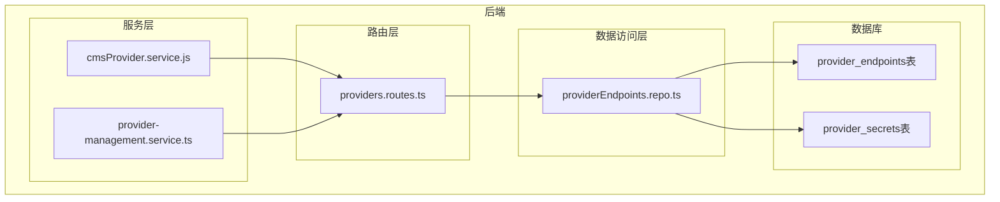
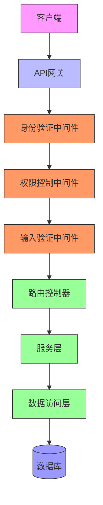
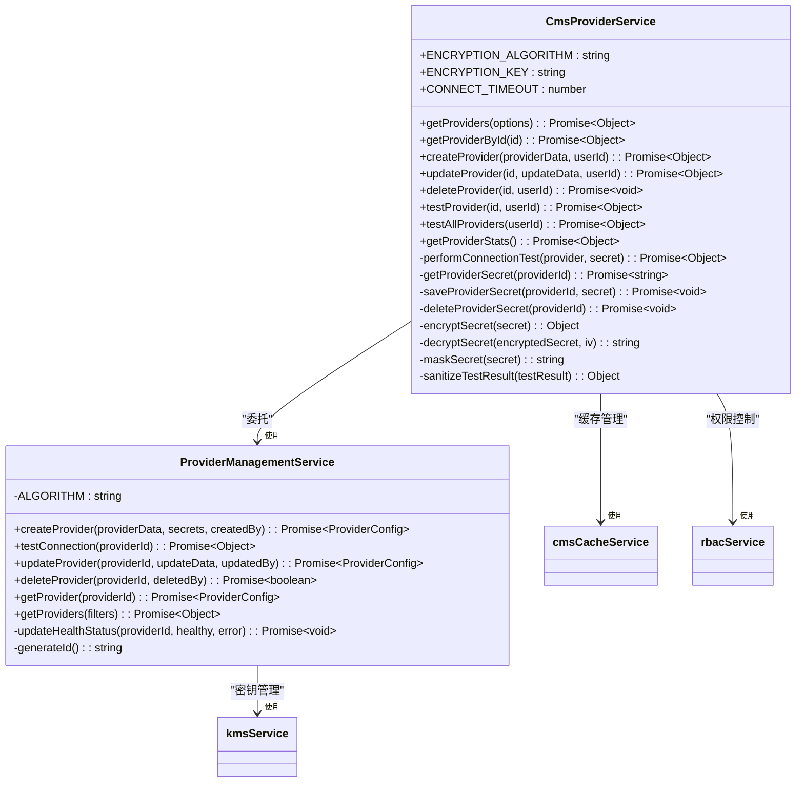
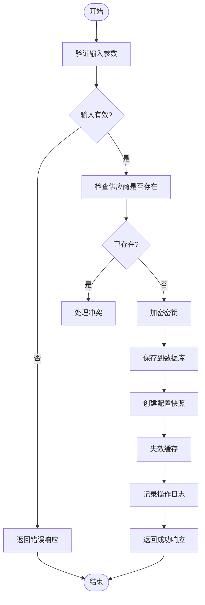
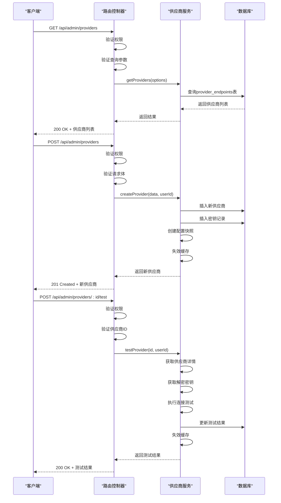
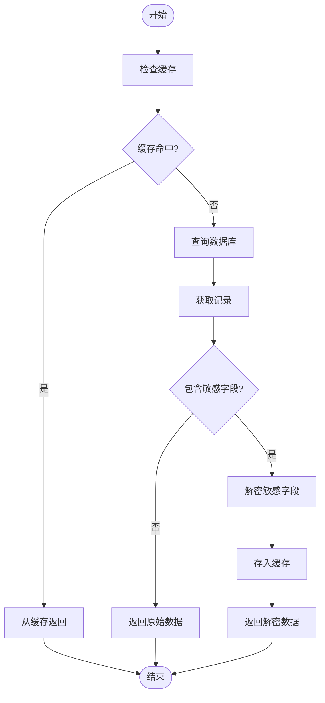
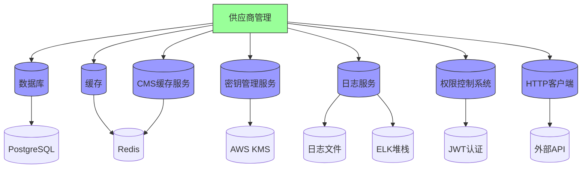

# 供应商管理

<cite>
**本文档引用文件**  
- [cmsProvider.service.js](file://backend/src/services/cmsProvider.service.js)
- [provider-management.service.ts](file://backend/src/services/provider-management.service.ts)
- [providers.routes.ts](file://backend/src/routes/admin/providers.routes.ts)
- [providerEndpoints.repo.ts](file://backend/src/repositories/providerEndpoints.repo.ts)
- [DISTRIBUTION_API.md](file://backend/docs/DISTRIBUTION_API.md)
- [distribution.service.js](file://backend/src/services/distribution.service.js)
</cite>

## 目录
1. [简介](#简介)
2. [项目结构](#项目结构)
3. [核心组件](#核心组件)
4. [架构概述](#架构概述)
5. [详细组件分析](#详细组件分析)
6. [依赖分析](#依赖分析)
7. [性能考虑](#性能考虑)
8. [故障排除指南](#故障排除指南)
9. [结论](#结论)
10. [附录](#附录)（如有必要）

## 简介
供应商管理系统是平台的核心基础设施组件，负责管理外部服务提供商的配置、连接测试和健康监控。该系统为AI、图像、视频和文本处理等关键功能提供底层支持，确保服务的高可用性和安全性。系统实现了完整的CRUD操作、密钥加密存储、连接测试和批量操作功能，为管理员提供了全面的供应商管理能力。

## 项目结构
供应商管理系统主要分布在后端代码库的多个目录中，形成了清晰的分层架构。核心功能集中在`services`和`routes`目录下，通过`repositories`与数据库交互，实现了业务逻辑与数据访问的分离。

**图源**  
- [cmsProvider.service.js](file://backend/src/services/cmsProvider.service.js)
- [provider-management.service.ts](file://backend/src/services/provider-management.service.ts)
- [providers.routes.ts](file://backend/src/routes/admin/providers.routes.ts)
- [providerEndpoints.repo.ts](file://backend/src/repositories/providerEndpoints.repo.ts)

**章节源**  
- [cmsProvider.service.js](file://backend/src/services/cmsProvider.service.js)
- [provider-management.service.ts](file://backend/src/services/provider-management.service.ts)
- [providers.routes.ts](file://backend/src/routes/admin/providers.routes.ts)

## 核心组件
供应商管理系统由多个核心组件构成，包括供应商管理服务、路由控制器、数据访问仓储和数据库表结构。系统实现了供应商的创建、读取、更新、删除（CRUD）操作，以及连接测试、批量操作和密钥管理功能。服务层采用加密存储敏感信息，确保API密钥等机密数据的安全性。

**章节源**  
- [cmsProvider.service.js](file://backend/src/services/cmsProvider.service.js)
- [provider-management.service.ts](file://backend/src/services/provider-management.service.ts)
- [providers.routes.ts](file://backend/src/routes/admin/providers.routes.ts)

## 架构概述
供应商管理系统的架构采用典型的分层设计模式，从上到下分为路由层、服务层和数据访问层。路由层处理HTTP请求和响应，服务层实现核心业务逻辑，数据访问层负责与数据库交互。这种分层架构确保了代码的可维护性和可测试性，同时通过中间件实现了身份验证、权限控制和输入验证。

**图源**  
- [providers.routes.ts](file://backend/src/routes/admin/providers.routes.ts)
- [cmsProvider.service.js](file://backend/src/services/cmsProvider.service.js)
- [providerEndpoints.repo.ts](file://backend/src/repositories/providerEndpoints.repo.ts)

## 详细组件分析
供应商管理系统包含多个关键组件，每个组件负责特定的功能领域。以下是对主要组件的详细分析。

### 供应商管理服务分析
供应商管理服务是系统的核心业务逻辑层，负责处理所有与供应商相关的操作。服务实现了创建、读取、更新、删除供应商的完整生命周期管理，以及连接测试和批量操作功能。

#### 服务类结构

**图源**  
- [cmsProvider.service.js](file://backend/src/services/cmsProvider.service.js)
- [provider-management.service.ts](file://backend/src/services/provider-management.service.ts)

#### 供应商操作流程

**图源**  
- [cmsProvider.service.js](file://backend/src/services/cmsProvider.service.js#L1-L657)

**章节源**  
- [cmsProvider.service.js](file://backend/src/services/cmsProvider.service.js#L1-L657)
- [provider-management.service.ts](file://backend/src/services/provider-management.service.ts#L1-L356)

### 供应商路由控制器分析
供应商路由控制器负责处理所有与供应商相关的HTTP请求，将API调用路由到相应的服务方法。控制器实现了完整的RESTful API，包括获取列表、获取详情、创建、更新、删除和测试连接等操作。

#### 路由API流程

**图源**  
- [providers.routes.ts](file://backend/src/routes/admin/providers.routes.ts#L1-L507)

**章节源**  
- [providers.routes.ts](file://backend/src/routes/admin/providers.routes.ts#L1-L507)

### 供应商数据访问层分析
供应商数据访问层负责与数据库进行交互，提供了对供应商端点和密钥记录的CRUD操作。该层实现了敏感数据的加密存储和自动解密功能，确保了数据的安全性。

#### 数据访问流程

**图源**  
- [providerEndpoints.repo.ts](file://backend/src/repositories/providerEndpoints.repo.ts#L1-L303)

**章节源**  
- [providerEndpoints.repo.ts](file://backend/src/repositories/providerEndpoints.repo.ts#L1-L303)

## 依赖分析
供应商管理系统依赖于多个内部和外部组件，形成了复杂的依赖关系网络。系统依赖于数据库服务进行数据持久化，依赖于缓存服务提高性能，依赖于密钥管理服务确保安全性，依赖于日志服务进行操作审计。

**图源**  
- [cmsProvider.service.js](file://backend/src/services/cmsProvider.service.js)
- [provider-management.service.ts](file://backend/src/services/provider-management.service.ts)
- [providerEndpoints.repo.ts](file://backend/src/repositories/providerEndpoints.repo.ts)

**章节源**  
- [cmsProvider.service.js](file://backend/src/services/cmsProvider.service.js)
- [provider-management.service.ts](file://backend/src/services/provider-management.service.ts)
- [providerEndpoints.repo.ts](file://backend/src/repositories/providerEndpoints.repo.ts)

## 性能考虑
供应商管理系统在设计时充分考虑了性能因素，采用了多种优化策略。系统实现了内存缓存机制，对频繁访问的供应商配置进行缓存，减少数据库查询次数。同时，系统采用了连接池技术，优化了数据库连接管理。对于批量操作，系统使用了并发处理，提高了处理效率。此外，系统还实现了请求频率限制，防止恶意请求对系统造成压力。

## 故障排除指南
当供应商管理系统出现问题时，可以按照以下步骤进行排查：

1. **检查API响应**：首先查看HTTP状态码和错误消息，确定问题的类型。
2. **查看日志文件**：检查系统日志，查找相关的错误记录和堆栈跟踪。
3. **验证数据库连接**：确认数据库服务是否正常运行，连接是否正常。
4. **检查缓存状态**：确认缓存服务是否正常，缓存数据是否正确。
5. **测试网络连接**：对于连接测试失败的情况，检查网络连接和防火墙设置。
6. **验证权限配置**：确认用户权限是否正确配置，是否有足够的权限执行操作。
7. **检查密钥配置**：确认API密钥和其他认证信息是否正确配置。

**章节源**  
- [cmsProvider.service.js](file://backend/src/services/cmsProvider.service.js)
- [providers.routes.ts](file://backend/src/routes/admin/providers.routes.ts)
- [providerEndpoints.repo.ts](file://backend/src/repositories/providerEndpoints.repo.ts)

## 结论
供应商管理系统是一个功能完整、架构清晰的服务管理平台，为整个应用提供了可靠的外部服务集成能力。系统通过分层架构实现了关注点分离，通过加密存储确保了数据安全，通过缓存机制提高了性能。未来可以考虑增加更多的监控指标、自动化故障恢复机制和更精细的权限控制，进一步提升系统的可靠性和安全性。

## 附录
### 数据库表结构
供应商管理系统主要涉及两个数据库表：`provider_endpoints`和`provider_secrets`。

**provider_endpoints表**
| 字段名 | 类型 | 说明 |
|-------|------|------|
| id | string | 供应商ID |
| name | string | 供应商名称 |
| description | string | 描述 |
| type | string | 类型（ai/image/video/text） |
| base_url | string | 基础URL |
| weight | number | 权重 |
| timeout | number | 超时时间（毫秒） |
| retry | number | 重试次数 |
| enabled | boolean | 是否启用 |
| status | string | 状态（active/inactive/error） |
| last_tested_at | datetime | 最后测试时间 |
| last_test_result | json | 最后测试结果 |
| created_by | string | 创建者 |
| created_at | datetime | 创建时间 |
| updated_at | datetime | 更新时间 |

**provider_secrets表**
| 字段名 | 类型 | 说明 |
|-------|------|------|
| provider_id | string | 供应商ID（外键） |
| encrypted_secret | string | 加密后的密钥 |
| iv | string | 初始向量 |
| created_at | datetime | 创建时间 |
| updated_at | datetime | 更新时间 |

**章节源**  
- [cmsProvider.service.js](file://backend/src/services/cmsProvider.service.js)
- [providerEndpoints.repo.ts](file://backend/src/repositories/providerEndpoints.repo.ts)