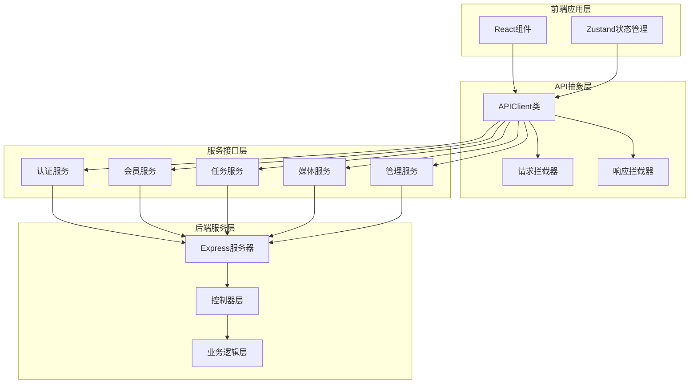
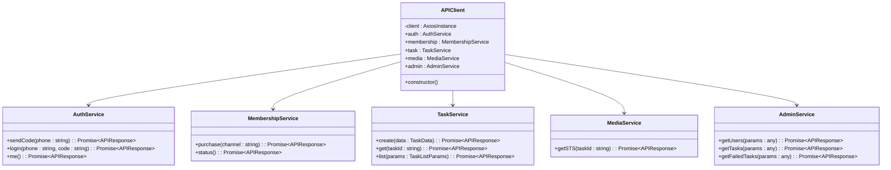
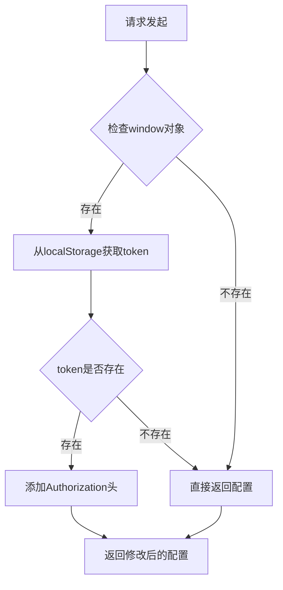
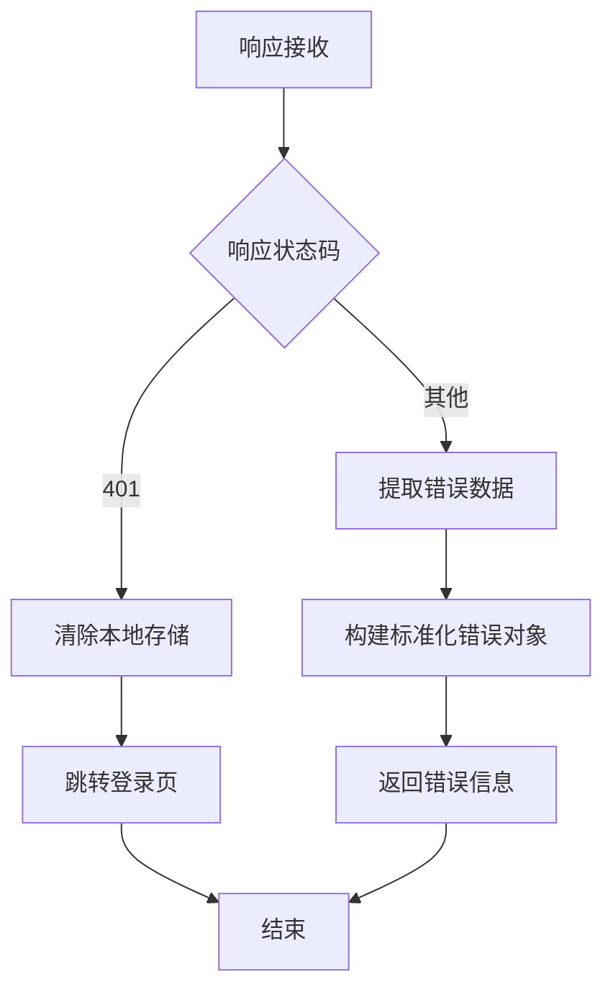
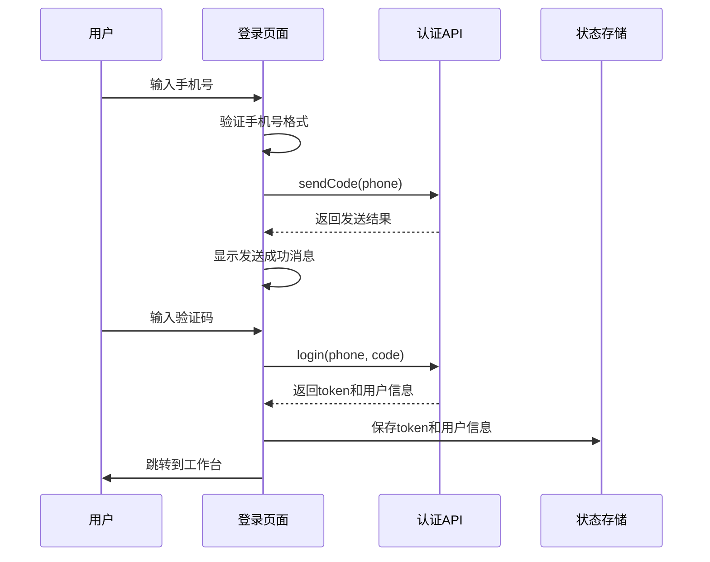
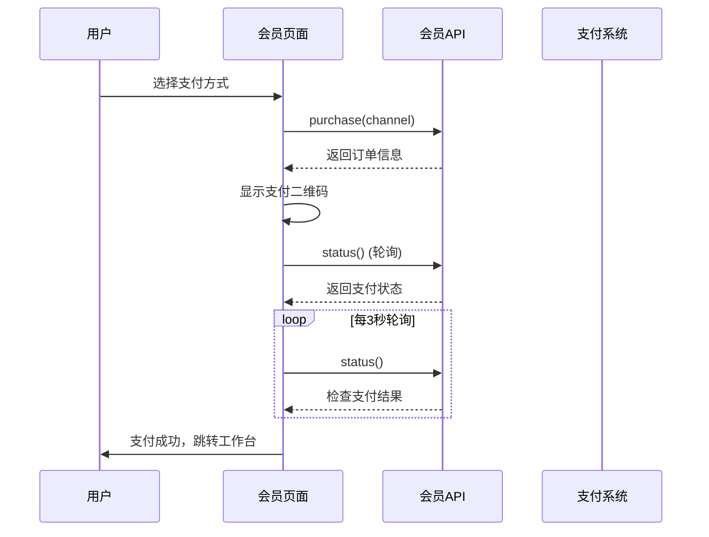
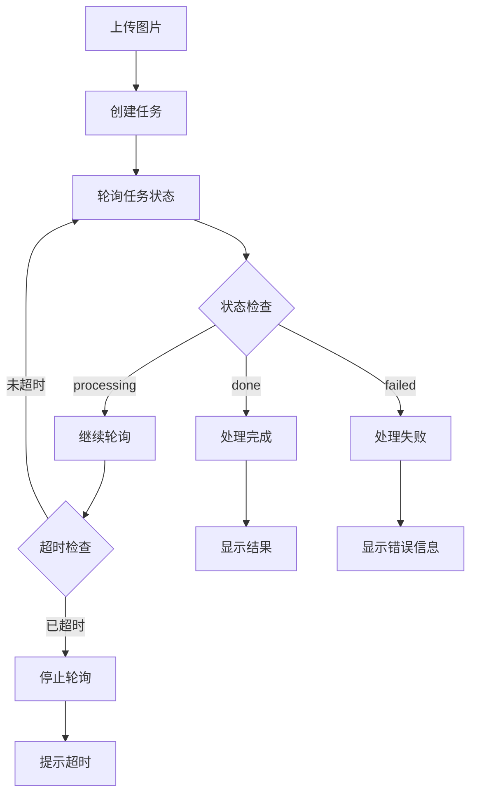
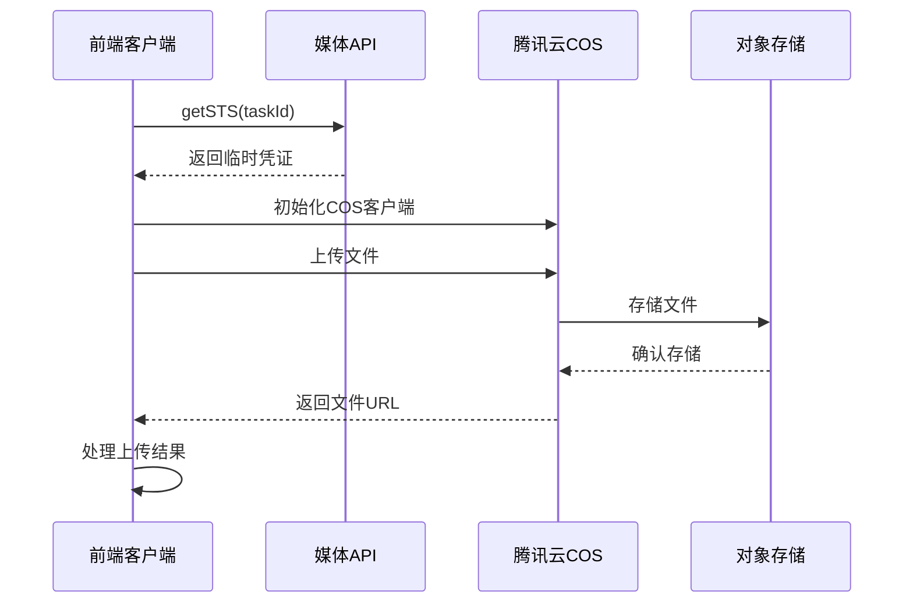
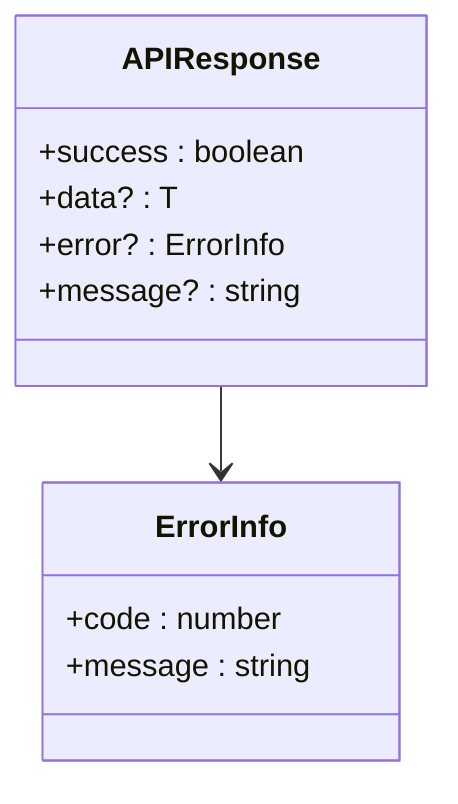

# API集成

<cite>
**本文档中引用的文件**
- [api.ts](file://frontend/src/lib/api.ts)
- [authStore.ts](file://frontend/src/store/authStore.ts)
- [index.ts](file://frontend/src/types/index.ts)
- [login/page.tsx](file://frontend/src/app/login/page.tsx)
- [basic/page.tsx](file://frontend/src/app/task/basic/page.tsx)
- [membership/page.tsx](file://frontend/src/app/membership/page.tsx)
- [ImageUploader.tsx](file://frontend/src/components/ImageUploader.tsx)
- [auth.routes.js](file://backend/src/routes/auth.routes.js)
- [task.routes.js](file://backend/src/routes/task.routes.js)
- [membership.routes.js](file://backend/src/routes/membership.routes.js)
</cite>

## 目录
1. [简介](#简介)
2. [项目架构概览](#项目架构概览)
3. [APIClient类设计](#apiclient类设计)
4. [认证服务详解](#认证服务详解)
5. [会员服务详解](#会员服务详解)
6. [任务服务详解](#任务服务详解)
7. [媒体服务详解](#媒体服务详解)
8. [管理服务详解](#管理服务详解)
9. [错误处理机制](#错误处理机制)
10. [最佳实践指南](#最佳实践指南)
11. [总结](#总结)

## 简介

本文档系统性地分析了前端API调用层的设计与实现，重点围绕`api.ts`文件中的APIClient类展开。该类采用Axios作为HTTP客户端，实现了统一的API调用模式，提供了完整的请求/响应拦截器处理机制，并针对不同业务模块（认证、会员、任务、媒体、管理）提供了专门的服务接口。

## 项目架构概览

前端API调用层采用分层架构设计，主要包含以下核心组件：

**图表来源**
- [api.ts](file://frontend/src/lib/api.ts#L1-L118)
- [authStore.ts](file://frontend/src/store/authStore.ts#L1-L43)

## APIClient类设计

### 核心架构

APIClient类是整个API调用层的核心，采用单例模式设计，确保全局唯一性。该类封装了Axios实例化配置、请求/响应拦截器处理逻辑，以及五大业务服务接口。

**图表来源**
- [api.ts](file://frontend/src/lib/api.ts#L10-L118)

### Axios实例化配置

APIClient构造函数中配置了以下关键参数：

| 配置项 | 值 | 说明 |
|--------|-----|------|
| baseURL | process.env.NEXT_PUBLIC_API_URL \| '/api' | API基础URL，支持环境变量配置 |
| timeout | 30000ms | 请求超时时间设置为30秒 |
| Content-Type | application/json | 默认请求头设置 |

**章节来源**
- [api.ts](file://frontend/src/lib/api.ts#L13-L22)

### 请求拦截器处理逻辑

请求拦截器实现了JWT令牌的自动添加功能：

**图表来源**
- [api.ts](file://frontend/src/lib/api.ts#L24-L35)

**章节来源**
- [api.ts](file://frontend/src/lib/api.ts#L24-L35)

### 响应拦截器处理逻辑

响应拦截器负责处理401未授权错误和统一错误信息格式：

**图表来源**
- [api.ts](file://frontend/src/lib/api.ts#L39-L58)

**章节来源**
- [api.ts](file://frontend/src/lib/api.ts#L39-L58)

## 认证服务详解

### 接口定义与参数

认证服务提供了三个核心接口，分别处理手机号验证码发送、用户登录和获取当前用户信息：

| 接口名称 | 方法 | 参数 | 返回值 |
|----------|------|------|--------|
| sendCode | POST | phone: string | APIResponse |
| login | POST | phone: string, code: string | APIResponse |
| me | GET | 无 | APIResponse |

### 实际使用示例

在登录页面中，认证服务的具体使用方式如下：

**图表来源**
- [login/page.tsx](file://frontend/src/app/login/page.tsx#L30-L60)
- [login/page.tsx](file://frontend/src/app/login/page.tsx#L62-L95)

**章节来源**
- [api.ts](file://frontend/src/lib/api.ts#L59-L65)
- [login/page.tsx](file://frontend/src/app/login/page.tsx#L30-L95)

## 会员服务详解

### 接口定义与参数

会员服务专注于会员购买和状态查询功能：

| 接口名称 | 方法 | 参数 | 返回值 |
|----------|------|------|--------|
| purchase | POST | channel: string | APIResponse |
| status | GET | 无 | APIResponse |

### 支付流程实现

会员服务的支付流程采用了轮询机制来监控支付状态：

**图表来源**
- [membership/page.tsx](file://frontend/src/app/membership/page.tsx#L60-L90)
- [membership/page.tsx](file://frontend/src/app/membership/page.tsx#L92-L120)

**章节来源**
- [api.ts](file://frontend/src/lib/api.ts#L67-L71)
- [membership/page.tsx](file://frontend/src/app/membership/page.tsx#L60-L120)

## 任务服务详解

### 接口定义与参数

任务服务是系统的核心功能模块，提供了完整的任务生命周期管理：

| 接口名称 | 方法 | 参数 | 返回值 |
|----------|------|------|--------|
| create | POST | TaskData | APIResponse |
| get | GET | taskId: string | APIResponse |
| list | GET | TaskListParams | APIResponse |

### 任务处理流程

任务服务的处理流程展示了异步任务的典型实现模式：

**图表来源**
- [basic/page.tsx](file://frontend/src/app/task/basic/page.tsx#L60-L90)
- [basic/page.tsx](file://frontend/src/app/task/basic/page.tsx#L92-L120)

**章节来源**
- [api.ts](file://frontend/src/lib/api.ts#L73-L87)
- [basic/page.tsx](file://frontend/src/app/task/basic/page.tsx#L60-L120)

## 媒体服务详解

### 接口定义与参数

媒体服务专门处理文件上传相关的临时签名令牌获取：

| 接口名称 | 方法 | 参数 | 返回值 |
|----------|------|------|--------|
| getSTS | GET | taskId: string | APIResponse |

### 文件上传实现

媒体服务与第三方云存储服务(COS)的集成展示了企业级文件处理的最佳实践：

**图表来源**
- [ImageUploader.tsx](file://frontend/src/components/ImageUploader.tsx#L50-L80)
- [ImageUploader.tsx](file://frontend/src/components/ImageUploader.tsx#L82-L120)

**章节来源**
- [api.ts](file://frontend/src/lib/api.ts#L89-L92)
- [ImageUploader.tsx](file://frontend/src/components/ImageUploader.tsx#L50-L120)

## 管理服务详解

### 接口定义与参数

管理服务提供后台管理功能，主要用于管理员查看用户和任务信息：

| 接口名称 | 方法 | 参数 | 返回值 |
|----------|------|------|--------|
| getUsers | GET | params: any | APIResponse |
| getTasks | GET | params: any | APIResponse |
| getFailedTasks | GET | params: any | APIResponse |

### 管理功能特点

管理服务的特点在于其灵活性，允许传入任意查询参数来过滤和排序数据。

**章节来源**
- [api.ts](file://frontend/src/lib/api.ts#L94-L102)

## 错误处理机制

### 统一错误响应格式

API系统采用统一的错误响应格式，确保前端能够一致地处理各种错误情况：

**图表来源**
- [api.ts](file://frontend/src/lib/api.ts#L3-L11)

### 错误处理策略

| 错误类型 | 处理策略 | 实现方式 |
|----------|----------|----------|
| 401未授权 | 自动登出 | 清除token和用户信息，跳转登录页 |
| 网络错误 | 显示友好提示 | 使用默认错误码9999 |
| 业务错误 | 展示具体信息 | 使用后端返回的错误码和消息 |

**章节来源**
- [api.ts](file://frontend/src/lib/api.ts#L39-L58)

## 最佳实践指南

### API调用最佳实践

1. **统一错误处理**
   - 在所有API调用中捕获异常
   - 使用统一的消息提示系统
   - 区分业务错误和网络错误

2. **状态管理**
   - 使用Zustand进行全局状态管理
   - 合理使用localStorage持久化关键数据
   - 实现状态的自动同步机制

3. **用户体验优化**
   - 添加加载状态指示器
   - 实现合理的重试机制
   - 提供详细的错误反馈

### 性能优化建议

1. **请求缓存**
   - 对于不经常变化的数据实现缓存
   - 设置合理的缓存过期时间
   - 实现缓存失效策略

2. **并发控制**
   - 限制同时进行的API请求数量
   - 实现请求队列机制
   - 优化轮询频率

3. **资源管理**
   - 及时清理定时器和事件监听器
   - 合理管理WebSocket连接
   - 优化内存使用

### 安全考虑

1. **认证安全**
   - 实现token自动刷新机制
   - 使用HTTPS传输敏感数据
   - 防止CSRF攻击

2. **数据保护**
   - 对敏感数据进行加密存储
   - 实现数据脱敏处理
   - 监控异常访问行为

## 总结

前端API调用层的设计体现了现代Web应用的最佳实践，通过APIClient类实现了统一的API抽象，提供了完整的请求/响应拦截器处理机制。五大业务服务接口（认证、会员、任务、媒体、管理）的划分清晰，职责明确，便于维护和扩展。

该架构的主要优势包括：

1. **统一性**：所有API调用通过单一入口，便于管理和维护
2. **可扩展性**：模块化设计支持新功能的快速集成
3. **健壮性**：完善的错误处理和重试机制
4. **用户体验**：友好的错误提示和加载状态管理

通过本文档的详细分析，开发者可以深入理解API调用层的设计思路，并在实际开发中遵循相应的最佳实践，确保系统的稳定性和可维护性。