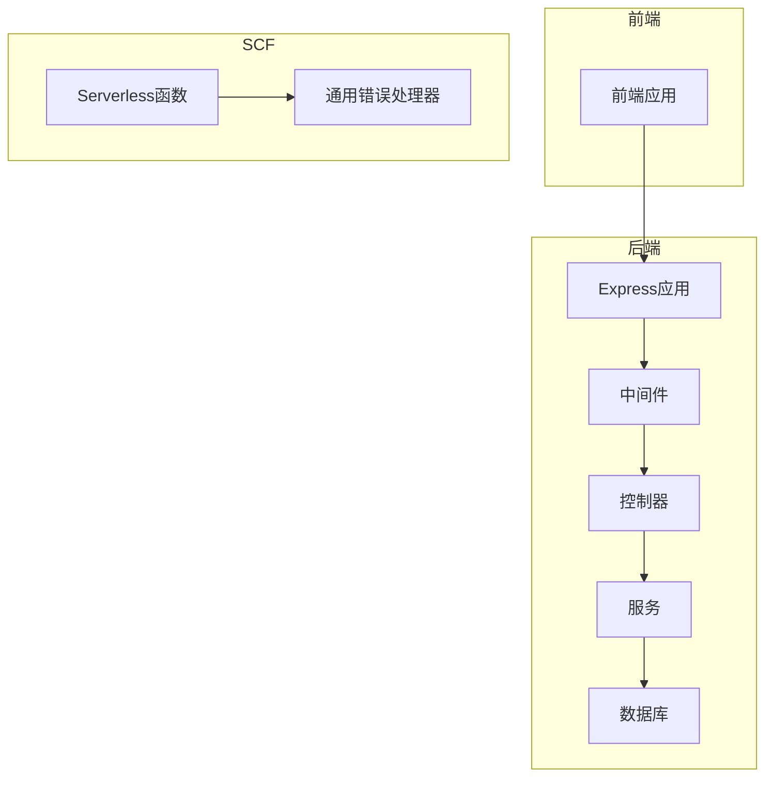
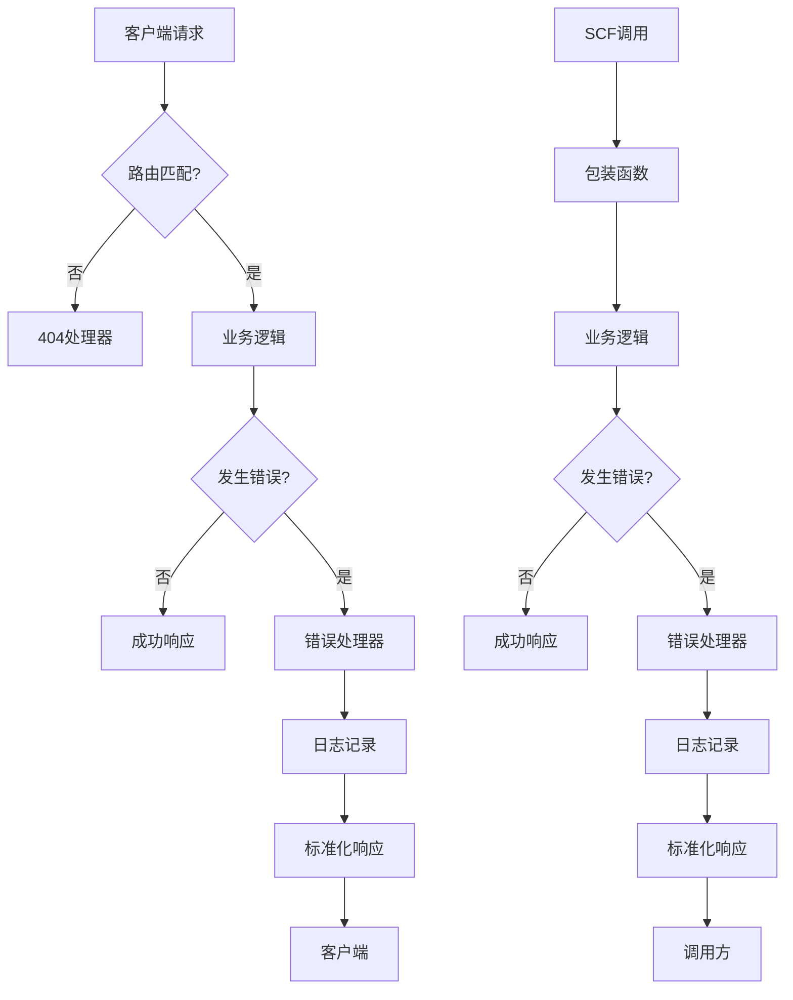
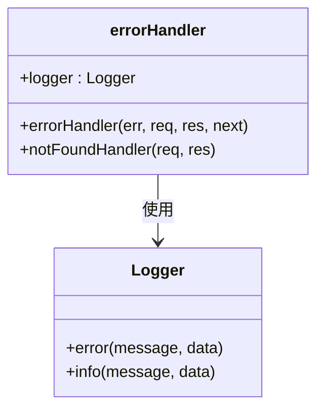
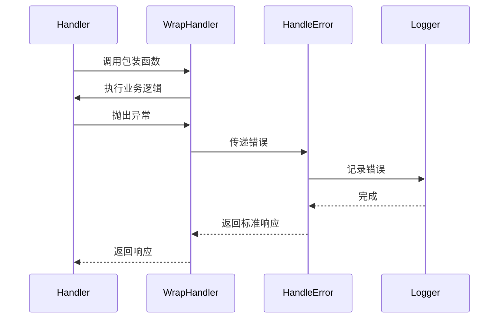
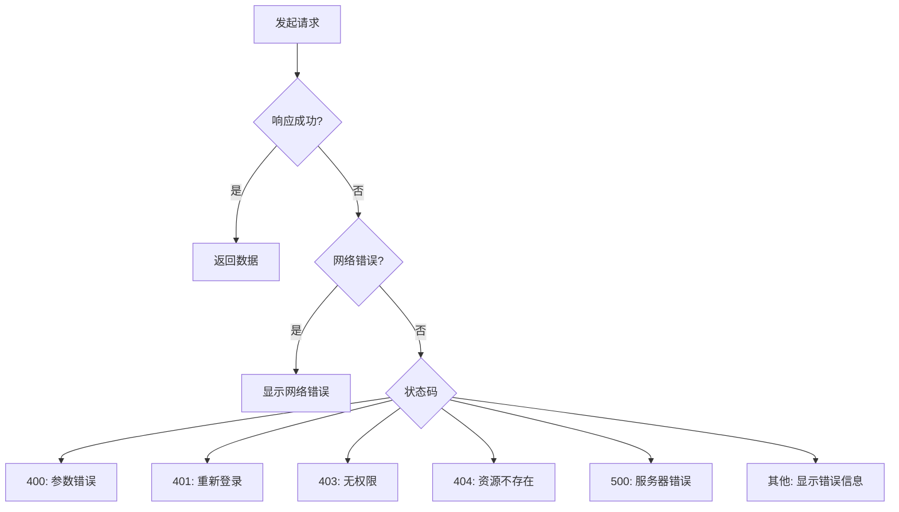
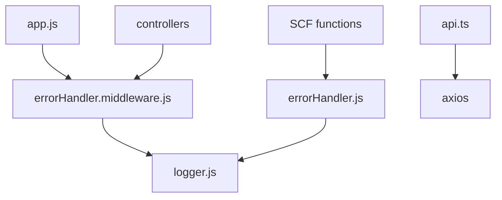

# API错误处理优化

<cite>
**本文档引用的文件**  
- [errorHandler.middleware.js](file://backend/src/middlewares/errorHandler.middleware.js)
- [errorHandler.js](file://scf/common/errorHandler.js)
- [logger.js](file://backend/src/utils/logger.js)
- [app.js](file://backend/src/app.js)
- [auth.controller.js](file://backend/src/controllers/auth.controller.js)
- [task.controller.js](file://backend/src/controllers/task.controller.js)
- [auth.service.js](file://backend/src/services/auth.service.js)
- [api.ts](file://frontend/src/lib/api.ts)
</cite>

## 目录
1. [引言](#引言)
2. [项目结构](#项目结构)
3. [核心组件](#核心组件)
4. [架构概述](#架构概述)
5. [详细组件分析](#详细组件分析)
6. [依赖分析](#依赖分析)
7. [性能考虑](#性能考虑)
8. [故障排除指南](#故障排除指南)
9. [结论](#结论)

## 引言
本项目是一个AI照片处理平台，包含后端服务、前端应用和多个Serverless函数（SCF）。API错误处理是系统稳定性和用户体验的关键部分。本文档深入分析现有错误处理机制，识别优化点，并提出改进建议。

## 项目结构
项目采用分层架构，包含后端、前端、SCF（Serverless Cloud Function）和技能模块。后端使用Express框架，前端使用Next.js，SCF使用腾讯云函数。错误处理机制分布在多个层级，包括全局中间件、服务层和前端拦截器。

**图源**  
- [app.js](file://backend/src/app.js)
- [errorHandler.middleware.js](file://backend/src/middlewares/errorHandler.middleware.js)
- [errorHandler.js](file://scf/common/errorHandler.js)

**节源**
- [app.js](file://backend/src/app.js)
- [project_structure](file://project_structure)

## 核心组件
核心组件包括全局错误处理中间件、日志记录、前端错误拦截和SCF错误处理。这些组件共同构成了系统的错误处理体系。

**节源**
- [errorHandler.middleware.js](file://backend/src/middlewares/errorHandler.middleware.js)
- [errorHandler.js](file://scf/common/errorHandler.js)
- [api.ts](file://frontend/src/lib/api.ts)

## 架构概述
系统采用分层错误处理架构。后端通过Express中间件捕获和处理错误，前端通过Axios拦截器统一处理响应错误，SCF使用包装函数自动捕获异常。日志系统贯穿所有层级，确保错误可追溯。

**图源**  
- [errorHandler.middleware.js](file://backend/src/middlewares/errorHandler.middleware.js)
- [errorHandler.js](file://scf/common/errorHandler.js)

## 详细组件分析

### 全局错误处理中间件分析
后端使用全局错误处理中间件统一处理未捕获的异常。该中间件记录错误日志并返回标准化的JSON响应。

**图源**  
- [errorHandler.middleware.js](file://backend/src/middlewares/errorHandler.middleware.js)
- [logger.js](file://backend/src/utils/logger.js)

**节源**
- [errorHandler.middleware.js](file://backend/src/middlewares/errorHandler.middleware.js)

### SCF错误处理分析
SCF模块使用通用错误处理器，提供自定义错误类和异步函数包装器，确保所有函数调用都有统一的错误处理。

**图源**  
- [errorHandler.js](file://scf/common/errorHandler.js)
- [logger.js](file://scf/common/logger.js)

**节源**
- [errorHandler.js](file://scf/common/errorHandler.js)

### 前端错误拦截分析
前端使用Axios拦截器统一处理API响应错误，根据状态码和错误类型提供用户友好的提示。

**图源**  
- [api.ts](file://frontend/src/lib/api.ts)

**节源**
- [api.ts](file://frontend/src/lib/api.ts)

## 依赖分析
错误处理系统依赖于日志模块、配置模块和网络库。各组件之间耦合度适中，通过接口和中间件模式实现松耦合。

**图源**  
- [app.js](file://backend/src/app.js)
- [errorHandler.middleware.js](file://backend/src/middlewares/errorHandler.middleware.js)
- [errorHandler.js](file://scf/common/errorHandler.js)

**节源**
- [app.js](file://backend/src/app.js)
- [errorHandler.middleware.js](file://backend/src/middlewares/errorHandler.middleware.js)
- [errorHandler.js](file://scf/common/errorHandler.js)

## 性能考虑
错误处理对性能影响较小，主要开销在日志记录。建议在生产环境控制日志级别，避免过度记录影响性能。SCF的错误包装器增加了少量函数调用开销，但对整体性能影响可忽略。

## 故障排除指南
常见错误包括404路由未找到、429请求过于频繁、500服务器内部错误等。排查时应首先检查日志，确认错误发生位置和原因。对于SCF错误，需检查函数执行日志和回调状态。

**节源**
- [errorHandler.middleware.js](file://backend/src/middlewares/errorHandler.middleware.js)
- [errorHandler.js](file://scf/common/errorHandler.js)
- [api.ts](file://frontend/src/lib/api.ts)

## 结论
当前错误处理机制较为完善，实现了前后端统一的错误响应格式和日志记录。建议进一步优化错误码体系，增加更多业务相关错误类型，并完善错误监控和告警机制。