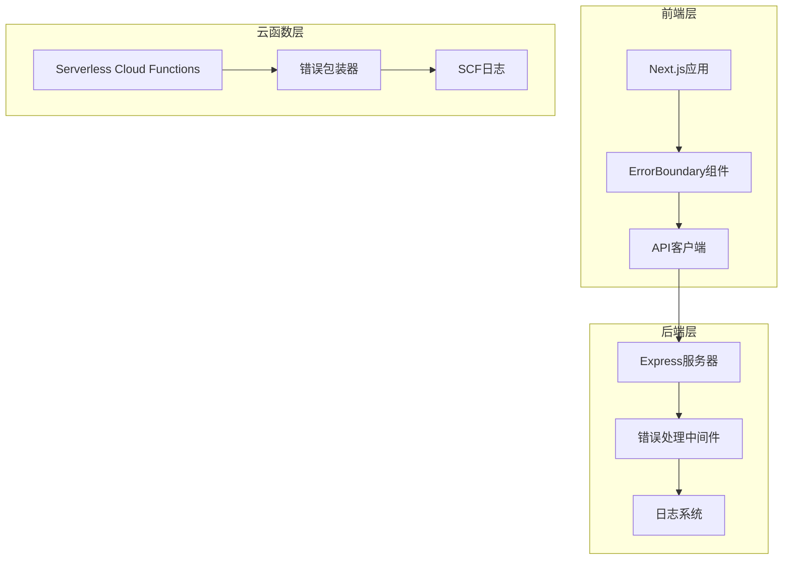
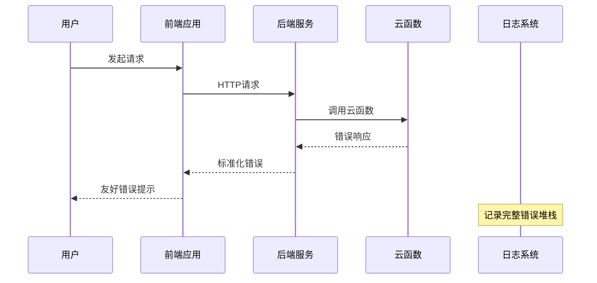
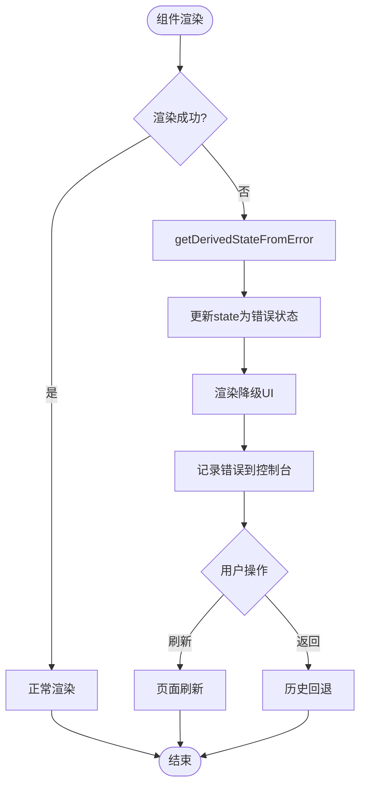
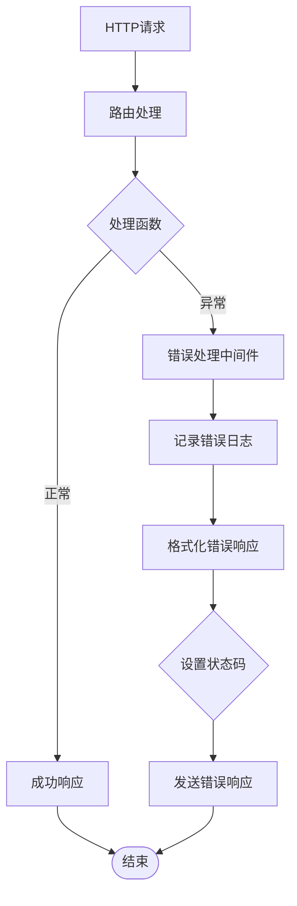
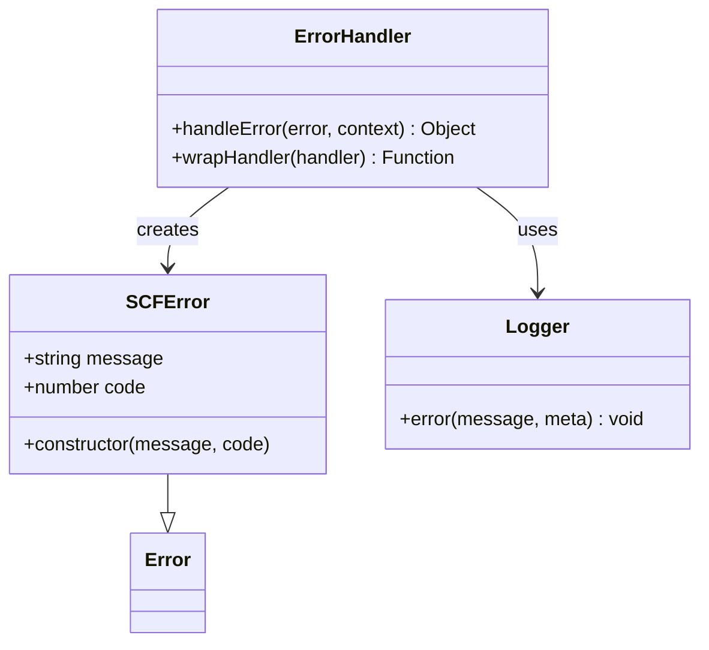
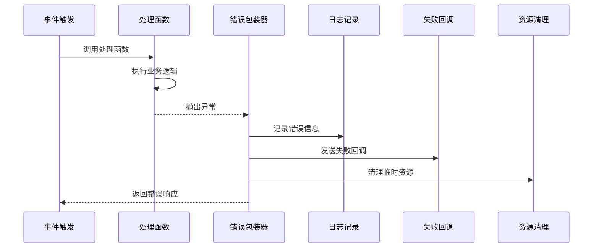
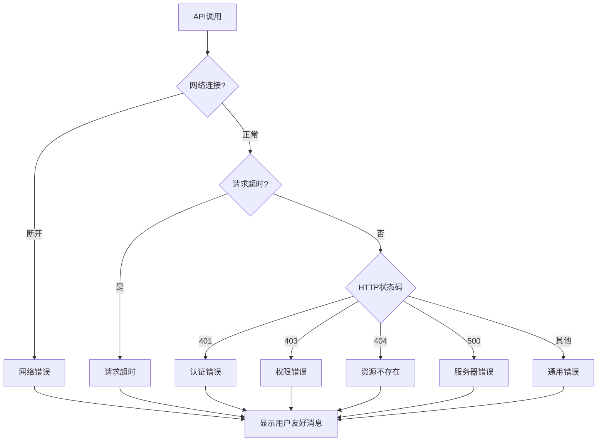
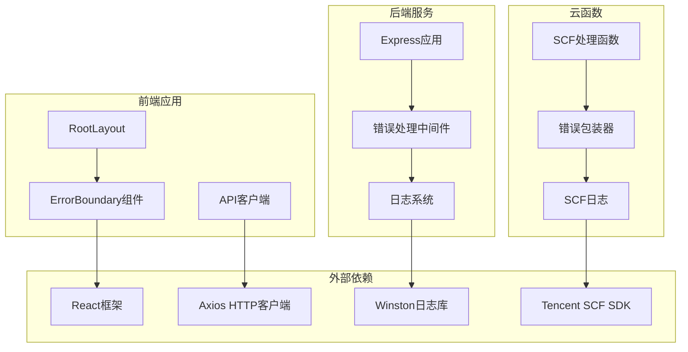

# 全局错误边界

<cite>
**本文档引用的文件**
- [frontend/src/components/ErrorBoundary.tsx](file://frontend/src/components/ErrorBoundary.tsx)
- [frontend/src/app/layout.tsx](file://frontend/src/app/layout.tsx)
- [backend/src/middlewares/errorHandler.middleware.js](file://backend/src/middlewares/errorHandler.middleware.js)
- [backend/src/app.js](file://backend/src/app.js)
- [scf/common/errorHandler.js](file://scf/common/errorHandler.js)
- [scf/image-compositor/index.js](file://scf/image-compositor/index.js)
- [scf/video-compositor/index.js](file://scf/video-compositor/index.js)
- [backend/src/utils/logger.js](file://backend/src/utils/logger.js)
- [frontend/src/lib/api.ts](file://frontend/src/lib/api.ts)
- [backend/src/routes/task.routes.js](file://backend/src/routes/task.routes.js)
</cite>

## 目录
1. [简介](#简介)
2. [项目结构](#项目结构)
3. [核心组件](#核心组件)
4. [架构概览](#架构概览)
5. [详细组件分析](#详细组件分析)
6. [依赖关系分析](#依赖关系分析)
7. [性能考虑](#性能考虑)
8. [故障排除指南](#故障排除指南)
9. [结论](#结论)

## 简介

本文档详细介绍了AI照平台的全局错误边界系统，这是一个多层次、全方位的错误处理架构，涵盖了前端React应用、后端Express服务器、云函数（SCF）以及API客户端的完整错误处理链路。该系统通过精心设计的错误边界组件和中间件，确保应用程序在遇到各种异常情况时能够优雅地降级，提供良好的用户体验，并保证系统的稳定性和可靠性。

## 项目结构

AI照平台采用前后端分离架构，错误处理系统分布在三个主要层面：

**图表来源**
- [frontend/src/components/ErrorBoundary.tsx](file://frontend/src/components/ErrorBoundary.tsx#L1-L111)
- [backend/src/middlewares/errorHandler.middleware.js](file://backend/src/middlewares/errorHandler.middleware.js#L1-L46)
- [scf/common/errorHandler.js](file://scf/common/errorHandler.js#L1-L69)

**章节来源**
- [frontend/src/app/layout.tsx](file://frontend/src/app/layout.tsx#L1-L36)
- [backend/src/app.js](file://backend/src/app.js#L1-L126)

## 核心组件

### 前端错误边界组件

前端错误边界是一个专门设计的React组件，位于应用的最外层，负责捕获和处理整个应用中的JavaScript错误。

### 后端全局错误处理中间件

后端实现了统一的错误处理中间件，能够捕获所有路由处理函数中抛出的异常，并提供标准化的错误响应。

### 云函数错误处理系统

云函数层采用了专门的错误处理机制，包括自定义错误类、错误包装器和上下文感知的日志记录。

### API客户端错误处理

前端API客户端实现了完整的HTTP请求错误处理，包括网络错误、超时、认证失败等各种场景的处理。

**章节来源**
- [frontend/src/components/ErrorBoundary.tsx](file://frontend/src/components/ErrorBoundary.tsx#L15-L57)
- [backend/src/middlewares/errorHandler.middleware.js](file://backend/src/middlewares/errorHandler.middleware.js#L1-L46)
- [scf/common/errorHandler.js](file://scf/common/errorHandler.js#L1-L69)
- [frontend/src/lib/api.ts](file://frontend/src/lib/api.ts#L1-L219)

## 架构概览

全局错误边界系统采用分层架构设计，每一层都有其特定的职责和处理策略：

**图表来源**
- [frontend/src/lib/api.ts](file://frontend/src/lib/api.ts#L46-L127)
- [backend/src/middlewares/errorHandler.middleware.js](file://backend/src/middlewares/errorHandler.middleware.js#L5-L25)
- [scf/common/errorHandler.js](file://scf/common/errorHandler.js#L20-L45)

## 详细组件分析

### 前端ErrorBoundary组件

ErrorBoundary是React应用中最关键的错误边界组件，它能够捕获组件树中的JavaScript错误，防止应用崩溃。

#### 组件特性

- **自动错误捕获**：继承自React.Component，利用生命周期方法捕获错误
- **优雅降级**：提供默认的错误界面和自定义降级UI支持
- **开发者友好**：在开发环境中显示详细的错误信息
- **用户友好**：提供刷新和返回操作选项

#### 错误处理流程

**图表来源**
- [frontend/src/components/ErrorBoundary.tsx](file://frontend/src/components/ErrorBoundary.tsx#L25-L57)

**章节来源**
- [frontend/src/components/ErrorBoundary.tsx](file://frontend/src/components/ErrorBoundary.tsx#L15-L111)
- [frontend/src/app/layout.tsx](file://frontend/src/app/layout.tsx#L20-L35)

### 后端错误处理中间件

后端错误处理中间件是Express应用的全局错误处理器，负责捕获和处理所有未处理的异常。

#### 中间件功能

- **异常捕获**：捕获所有路由处理函数中抛出的异常
- **标准化响应**：提供统一的错误响应格式
- **日志记录**：记录详细的错误信息到日志系统
- **状态码映射**：将错误映射到合适的HTTP状态码

#### 错误处理流程

**图表来源**
- [backend/src/middlewares/errorHandler.middleware.js](file://backend/src/middlewares/errorHandler.middleware.js#L5-L25)

**章节来源**
- [backend/src/middlewares/errorHandler.middleware.js](file://backend/src/middlewares/errorHandler.middleware.js#L1-L46)
- [backend/src/app.js](file://backend/src/app.js#L115-L126)

### 云函数错误处理系统

云函数层采用了专门的错误处理机制，确保SCF函数在遇到异常时能够优雅地处理并返回标准化的错误响应。

#### SCFError自定义错误类

**图表来源**
- [scf/common/errorHandler.js](file://scf/common/errorHandler.js#L8-L15)
- [scf/common/errorHandler.js](file://scf/common/errorHandler.js#L20-L45)

#### 云函数错误处理流程

**图表来源**
- [scf/image-compositor/index.js](file://scf/image-compositor/index.js#L85-L120)
- [scf/video-compositor/index.js](file://scf/video-compositor/index.js#L120-L155)

**章节来源**
- [scf/common/errorHandler.js](file://scf/common/errorHandler.js#L1-L69)
- [scf/image-compositor/index.js](file://scf/image-compositor/index.js#L85-L151)
- [scf/video-compositor/index.js](file://scf/video-compositor/index.js#L120-L189)

### API客户端错误处理

前端API客户端实现了全面的HTTP请求错误处理机制，覆盖了网络层的各种异常情况。

#### 错误分类处理

| HTTP状态码 | 错误类型 | 处理策略 |
|------------|----------|----------|
| 400 | 请求参数错误 | 显示具体错误信息 |
| 401 | 认证失败 | 清除token并跳转登录 |
| 403 | 权限不足 | 显示权限错误信息 |
| 404 | 资源不存在 | 显示资源不存在提示 |
| 429 | 请求过于频繁 | 显示限流提示 |
| 500 | 服务器内部错误 | 显示服务器错误信息 |
| 502/503/504 | 服务不可用 | 显示服务暂时不可用 |

#### 错误处理流程

**图表来源**
- [frontend/src/lib/api.ts](file://frontend/src/lib/api.ts#L46-L127)

**章节来源**
- [frontend/src/lib/api.ts](file://frontend/src/lib/api.ts#L1-L219)

## 依赖关系分析

全局错误边界系统的各个组件之间存在复杂的依赖关系：

**图表来源**
- [frontend/src/app/layout.tsx](file://frontend/src/app/layout.tsx#L1-L36)
- [backend/src/app.js](file://backend/src/app.js#L1-L126)
- [scf/common/errorHandler.js](file://scf/common/errorHandler.js#L1-L69)

**章节来源**
- [frontend/src/app/layout.tsx](file://frontend/src/app/layout.tsx#L1-L36)
- [backend/src/app.js](file://backend/src/app.js#L1-L126)
- [scf/common/errorHandler.js](file://scf/common/errorHandler.js#L1-L69)

## 性能考虑

全局错误边界系统在设计时充分考虑了性能因素：

### 前端性能优化

- **懒加载降级UI**：只有在发生错误时才渲染降级界面
- **内存管理**：错误状态在组件卸载时自动清理
- **防抖处理**：避免重复错误导致的性能问题

### 后端性能优化

- **异步日志记录**：错误日志记录不阻塞主线程
- **连接池管理**：数据库连接和Redis连接的高效管理
- **缓存策略**：错误统计和监控数据的缓存

### 云函数性能优化

- **资源清理**：finally块确保临时文件和资源得到清理
- **超时控制**：合理的超时设置避免长时间等待
- **并发控制**：限流中间件防止系统过载

## 故障排除指南

### 常见错误场景及解决方案

#### 前端错误边界问题

**症状**：组件错误导致整个页面白屏
**原因**：子组件抛出未捕获的异常
**解决方案**：检查ErrorBoundary组件的使用，确保正确包裹可能出错的组件

#### 后端错误处理问题

**症状**：异常信息泄露给客户端
**原因**：错误中间件配置不当
**解决方案**：检查errorHandler中间件的配置，确保生产环境不暴露详细错误信息

#### API客户端错误处理问题

**症状**：网络错误未正确处理
**原因**：Axios拦截器配置错误
**解决方案**：检查API客户端的拦截器配置，确保各种错误场景都被正确处理

**章节来源**
- [frontend/src/components/ErrorBoundary.tsx](file://frontend/src/components/ErrorBoundary.tsx#L30-L40)
- [backend/src/middlewares/errorHandler.middleware.js](file://backend/src/middlewares/errorHandler.middleware.js#L5-L25)
- [frontend/src/lib/api.ts](file://frontend/src/lib/api.ts#L30-L40)

## 结论

AI照平台的全局错误边界系统是一个设计精良、层次分明的错误处理架构。通过前端React ErrorBoundary、后端Express中间件、云函数错误包装器和API客户端拦截器的协同工作，系统能够在各个层面有效地捕获和处理异常，确保应用程序的稳定性和用户体验。

该系统的主要优势包括：

1. **全面覆盖**：从前端到后端再到云函数的全链路错误处理
2. **优雅降级**：在出现错误时提供友好的用户体验
3. **可维护性**：清晰的错误处理流程和标准化的错误格式
4. **可扩展性**：模块化的错误处理组件便于扩展和定制

通过持续的监控和优化，这个全局错误边界系统将继续为AI照平台提供可靠的错误处理保障，确保服务的高可用性和用户满意度。