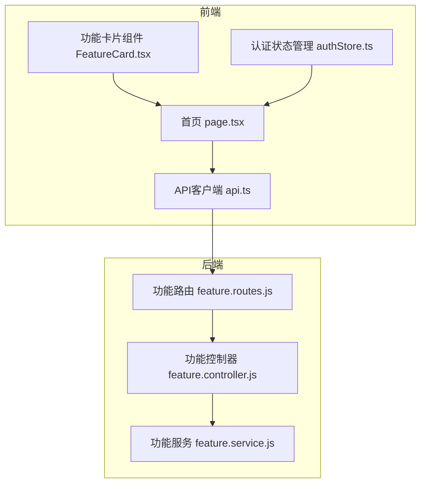
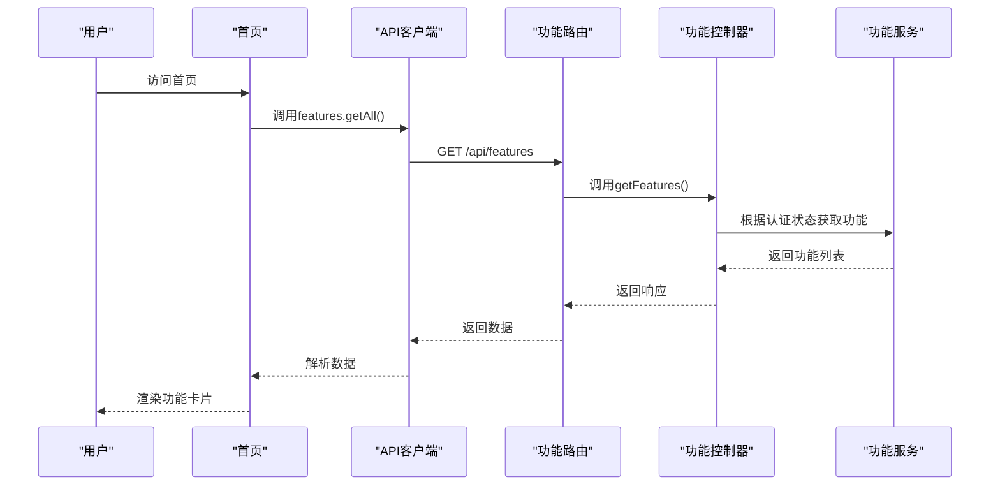
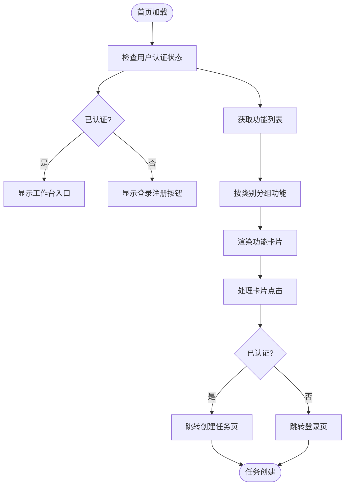
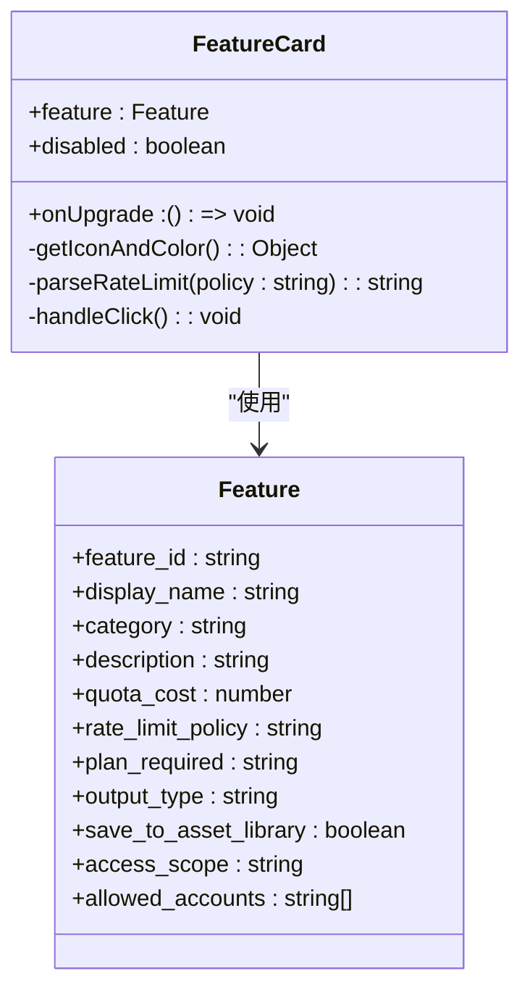
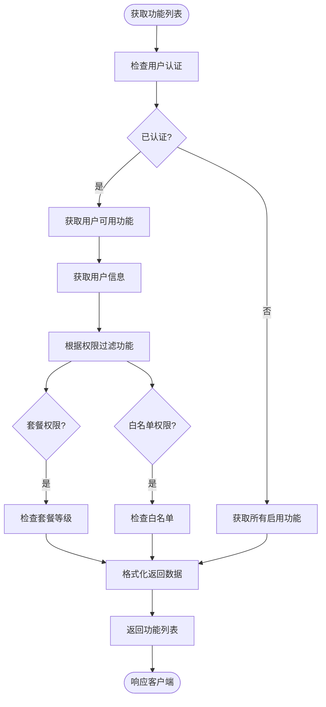
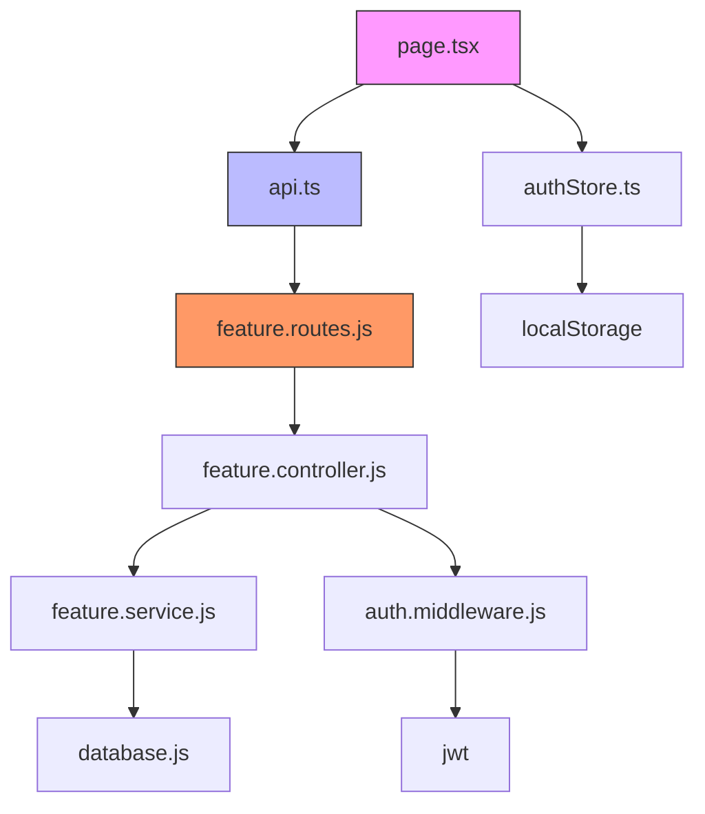

# 主页未认证浏览

<cite>
**本文档引用的文件**   
- [page.tsx](file://frontend/src/app/page.tsx)
- [FeatureCard.tsx](file://frontend/src/components/FeatureCard.tsx)
- [api.ts](file://frontend/src/lib/api.ts)
- [authStore.ts](file://frontend/src/store/authStore.ts)
- [feature.routes.js](file://backend/src/routes/feature.routes.js)
- [feature.controller.js](file://backend/src/controllers/feature.controller.js)
- [feature.service.js](file://backend/src/services/feature.service.js)
- [layout.tsx](file://frontend/src/app/layout.tsx)
- [auth.middleware.js](file://backend/src/middlewares/auth.middleware.js)
- [types/index.ts](file://frontend/src/types/index.ts)
</cite>

## 目录
1. [简介](#简介)
2. [项目结构](#项目结构)
3. [核心组件](#核心组件)
4. [架构概述](#架构概述)
5. [详细组件分析](#详细组件分析)
6. [依赖分析](#依赖分析)
7. [性能考虑](#性能考虑)
8. [故障排除指南](#故障排除指南)
9. [结论](#结论)

## 简介
本系统实现了主页未认证浏览功能，允许用户在不登录的情况下浏览所有可用功能。用户可以查看功能卡片、了解功能描述和使用限制，只有在点击使用功能时才需要登录。这种设计提升了用户体验，降低了使用门槛，同时确保了核心功能的安全性。

## 项目结构
系统采用前后端分离架构，前端使用Next.js框架，后端使用Node.js/Express框架。主页未认证浏览功能主要涉及前端首页组件和后端功能路由。

**图示来源**
- [page.tsx](file://frontend/src/app/page.tsx)
- [feature.routes.js](file://backend/src/routes/feature.routes.js)

**本节来源**
- [page.tsx](file://frontend/src/app/page.tsx)
- [feature.routes.js](file://backend/src/routes/feature.routes.js)

## 核心组件
主页未认证浏览功能的核心组件包括前端首页组件、功能卡片组件、API客户端和后端功能服务。这些组件协同工作，实现未登录用户的功能浏览和已登录用户的功能使用。

**本节来源**
- [page.tsx](file://frontend/src/app/page.tsx)
- [FeatureCard.tsx](file://frontend/src/components/FeatureCard.tsx)
- [api.ts](file://frontend/src/lib/api.ts)
- [feature.service.js](file://backend/src/services/feature.service.js)

## 架构概述
系统采用分层架构设计，从前端到后端各层职责分明。未认证浏览功能通过公开API接口获取功能列表，前端组件负责渲染和交互，状态管理组件跟踪用户认证状态。

**图示来源**
- [page.tsx](file://frontend/src/app/page.tsx)
- [feature.controller.js](file://backend/src/controllers/feature.controller.js)
- [feature.service.js](file://backend/src/services/feature.service.js)

## 详细组件分析

### 首页组件分析
首页组件是未认证浏览功能的核心，负责获取和展示功能列表。组件根据用户认证状态显示不同的内容和操作按钮。

**图示来源**
- [page.tsx](file://frontend/src/app/page.tsx)
- [authStore.ts](file://frontend/src/store/authStore.ts)

**本节来源**
- [page.tsx](file://frontend/src/app/page.tsx)
- [authStore.ts](file://frontend/src/store/authStore.ts)

### 功能卡片组件分析
功能卡片组件负责展示单个功能的详细信息，包括名称、描述、配额消耗和限流策略。组件根据功能类别显示不同的视觉样式。

**图示来源**
- [FeatureCard.tsx](file://frontend/src/components/FeatureCard.tsx)
- [types/index.ts](file://frontend/src/types/index.ts)

**本节来源**
- [FeatureCard.tsx](file://frontend/src/components/FeatureCard.tsx)
- [types/index.ts](file://frontend/src/types/index.ts)

### 后端功能服务分析
后端功能服务负责处理功能列表的获取逻辑，根据用户认证状态返回不同的功能集合。服务实现了权限控制和数据过滤。

**图示来源**
- [feature.service.js](file://backend/src/services/feature.service.js)
- [feature.controller.js](file://backend/src/controllers/feature.controller.js)

**本节来源**
- [feature.service.js](file://backend/src/services/feature.service.js)
- [feature.controller.js](file://backend/src/controllers/feature.controller.js)

## 依赖分析
系统各组件之间存在明确的依赖关系，从前端到后端形成完整的调用链。依赖关系确保了功能的正确实现和数据的一致性。

**图示来源**
- [go.mod](file://backend/package.json)
- [page.tsx](file://frontend/src/app/page.tsx)

**本节来源**
- [go.mod](file://backend/package.json)
- [page.tsx](file://frontend/src/app/page.tsx)

## 性能考虑
系统在设计未认证浏览功能时考虑了性能优化，包括数据缓存、异步加载和错误处理。这些优化确保了用户体验的流畅性。

- **数据缓存**: API客户端使用localStorage存储认证信息，减少重复请求
- **异步加载**: 首页功能列表采用异步加载，避免阻塞页面渲染
- **错误处理**: 获取功能列表失败时静默处理，不影响页面基本功能
- **条件渲染**: 根据用户认证状态动态渲染不同内容，减少不必要的计算

## 故障排除指南
当未认证浏览功能出现问题时，可以按照以下步骤进行排查：

1. **检查API连接**: 确认前端能够正常访问后端API
2. **验证路由配置**: 检查feature.routes.js中的路由定义是否正确
3. **审查权限逻辑**: 确认feature.service.js中的权限判断逻辑无误
4. **检查状态管理**: 验证authStore.ts中的认证状态是否正确更新
5. **查看网络请求**: 使用浏览器开发者工具检查网络请求和响应

**本节来源**
- [api.ts](file://frontend/src/lib/api.ts)
- [feature.service.js](file://backend/src/services/feature.service.js)
- [authStore.ts](file://frontend/src/store/authStore.ts)

## 结论
主页未认证浏览功能通过精心设计的前后端架构，实现了用户体验和安全性的平衡。系统允许用户在不登录的情况下浏览所有功能，降低了使用门槛，同时确保核心功能需要认证才能使用。这种设计模式值得在其他类似场景中推广应用。