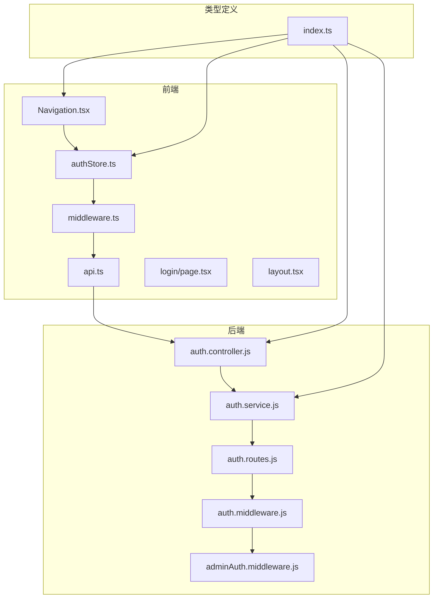
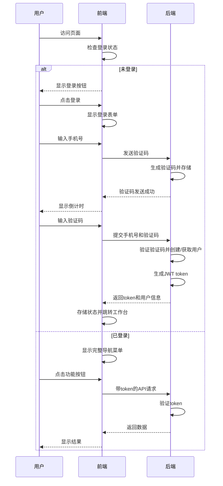
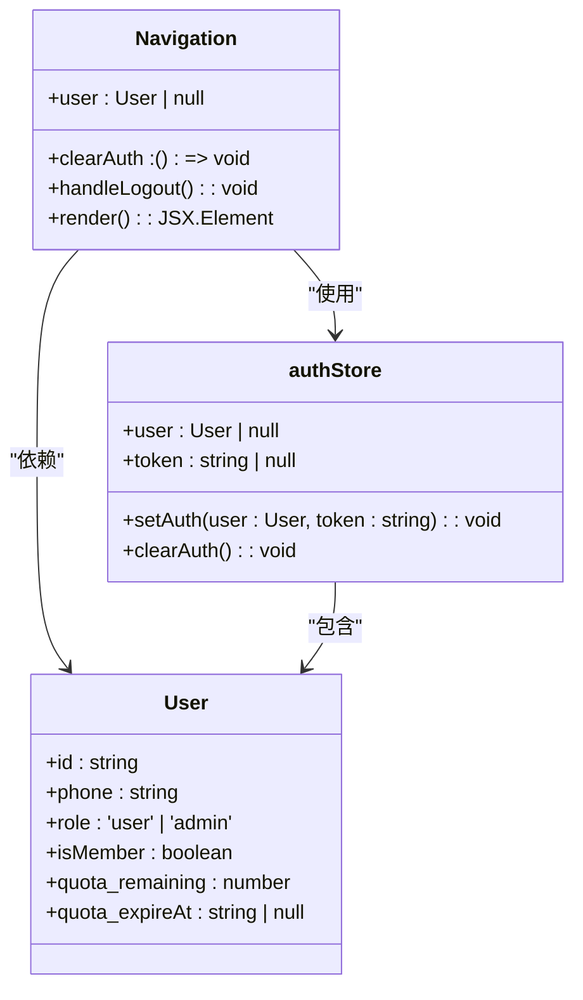
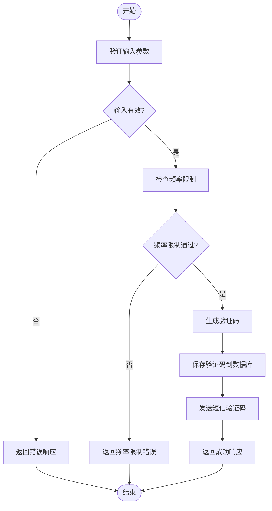
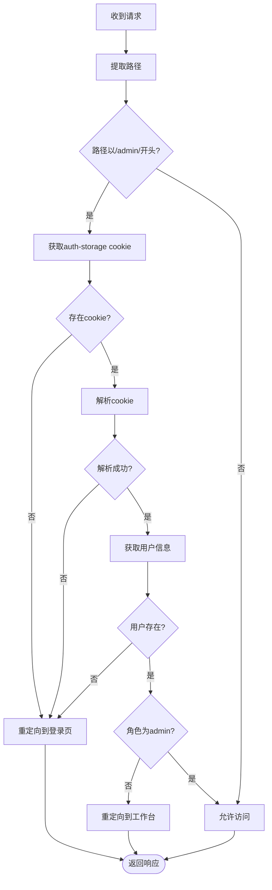
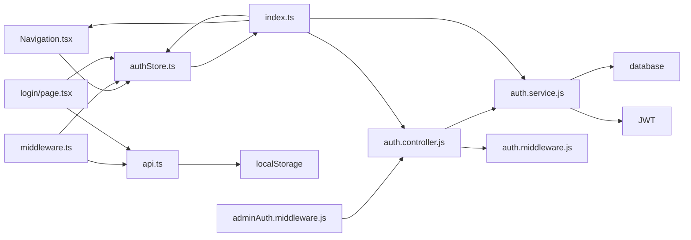

# 导航登录状态适配

<cite>
**本文档引用的文件**   
- [Navigation.tsx](file://frontend/src/components/Navigation.tsx)
- [authStore.ts](file://frontend/src/store/authStore.ts)
- [middleware.ts](file://frontend/src/middleware.ts)
- [api.ts](file://frontend/src/lib/api.ts)
- [login/page.tsx](file://frontend/src/app/login/page.tsx)
- [layout.tsx](file://frontend/src/app/layout.tsx)
- [auth.controller.js](file://backend/src/controllers/auth.controller.js)
- [auth.service.js](file://backend/src/services/auth.service.js)
- [auth.routes.js](file://backend/src/routes/auth.routes.js)
- [auth.middleware.js](file://backend/src/middlewares/auth.middleware.js)
- [adminAuth.middleware.js](file://backend/src/middlewares/adminAuth.middleware.js)
- [index.ts](file://frontend/src/types/index.ts)
</cite>

## 目录
1. [简介](#简介)
2. [项目结构](#项目结构)
3. [核心组件](#核心组件)
4. [架构概述](#架构概述)
5. [详细组件分析](#详细组件分析)
6. [依赖分析](#依赖分析)
7. [性能考虑](#性能考虑)
8. [故障排除指南](#故障排除指南)
9. [结论](#结论)

## 简介
本项目是一个基于AI的服装处理平台，提供基础修图和AI模特上身功能。系统采用前后端分离架构，前端使用Next.js框架，后端使用Node.js/Express。核心功能包括用户认证、任务管理、会员系统和管理后台。系统实现了完整的登录状态管理和导航适配机制，确保用户在不同登录状态下获得正确的界面体验和访问权限。

## 项目结构
项目采用分层架构，包含前端、后端和云函数（SCF）三个主要部分。前端使用Next.js框架，包含页面、组件、状态管理和API客户端。后端使用Express框架，包含控制器、服务、中间件和数据库操作。系统通过JWT进行身份验证，使用zustand进行前端状态管理，并通过中间件实现路由保护。

**图表来源**
- [Navigation.tsx](file://frontend/src/components/Navigation.tsx)
- [authStore.ts](file://frontend/src/store/authStore.ts)
- [middleware.ts](file://frontend/src/middleware.ts)
- [api.ts](file://frontend/src/lib/api.ts)
- [auth.controller.js](file://backend/src/controllers/auth.controller.js)
- [auth.service.js](file://backend/src/services/auth.service.js)
- [auth.routes.js](file://backend/src/routes/auth.routes.js)
- [auth.middleware.js](file://backend/src/middlewares/auth.middleware.js)
- [adminAuth.middleware.js](file://backend/src/middlewares/adminAuth.middleware.js)
- [index.ts](file://frontend/src/types/index.ts)

**章节来源**
- [Navigation.tsx](file://frontend/src/components/Navigation.tsx)
- [authStore.ts](file://frontend/src/store/authStore.ts)
- [middleware.ts](file://frontend/src/middleware.ts)
- [api.ts](file://frontend/src/lib/api.ts)
- [auth.controller.js](file://backend/src/controllers/auth.controller.js)
- [auth.service.js](file://backend/src/services/auth.service.js)
- [auth.routes.js](file://backend/src/routes/auth.routes.js)
- [auth.middleware.js](file://backend/src/middlewares/auth.middleware.js)
- [adminAuth.middleware.js](file://backend/src/middlewares/adminAuth.middleware.js)
- [index.ts](file://frontend/src/types/index.ts)

## 核心组件
系统的核心组件包括导航组件、认证状态管理、API客户端和认证服务。导航组件根据用户登录状态动态显示不同的菜单项，未登录时仅显示Logo和登录按钮，已登录时显示完整的工作台、任务历史、素材库等菜单。认证状态管理使用zustand持久化存储用户信息和token。API客户端在请求中自动添加认证头，并在401错误时重定向到登录页。后端认证服务处理验证码发送、登录/注册和用户信息获取。

**章节来源**
- [Navigation.tsx](file://frontend/src/components/Navigation.tsx)
- [authStore.ts](file://frontend/src/store/authStore.ts)
- [api.ts](file://frontend/src/lib/api.ts)
- [auth.controller.js](file://backend/src/controllers/auth.controller.js)
- [auth.service.js](file://backend/src/services/auth.service.js)

## 架构概述
系统采用前后端分离架构，前端通过API与后端通信。认证流程使用手机号+验证码方式，后端生成JWT token返回给前端。前端将token存储在localStorage中，并在后续请求中通过Authorization头发送。导航状态根据用户登录状态动态适配，未登录用户只能访问登录页，已登录用户可以访问工作台等页面，管理员用户还可以访问管理后台。路由保护通过前端middleware和后端中间件双重实现，确保安全性。

**图表来源**
- [Navigation.tsx](file://frontend/src/components/Navigation.tsx)
- [authStore.ts](file://frontend/src/store/authStore.ts)
- [middleware.ts](file://frontend/src/middleware.ts)
- [api.ts](file://frontend/src/lib/api.ts)
- [login/page.tsx](file://frontend/src/app/login/page.tsx)
- [auth.controller.js](file://backend/src/controllers/auth.controller.js)
- [auth.service.js](file://backend/src/services/auth.service.js)

## 详细组件分析
### 导航组件分析
导航组件是系统用户界面的核心部分，负责根据用户登录状态动态显示不同的导航选项。组件通过zustand状态管理获取用户信息，如果用户未登录，则只显示Logo和登录按钮；如果用户已登录，则显示完整的工作台、任务历史、素材库、会员中心等菜单项。对于管理员角色的用户，还会额外显示管理后台入口。

**图表来源**
- [Navigation.tsx](file://frontend/src/components/Navigation.tsx)
- [authStore.ts](file://frontend/src/store/authStore.ts)
- [index.ts](file://frontend/src/types/index.ts)

**章节来源**
- [Navigation.tsx](file://frontend/src/components/Navigation.tsx)
- [authStore.ts](file://frontend/src/store/authStore.ts)
- [index.ts](file://frontend/src/types/index.ts)

### 认证服务分析
认证服务是系统安全性的核心，负责处理用户的身份验证和授权。服务包含发送验证码、登录/注册和获取用户信息三个主要功能。验证码发送时会进行防刷限制检查，同一手机号1分钟内最多发送5次，同一IP 1小时内最多20次。登录时会验证验证码的正确性和有效期，然后查询或创建用户，并生成JWT token返回给客户端。

**图表来源**
- [auth.service.js](file://backend/src/services/auth.service.js)
- [auth.controller.js](file://backend/src/controllers/auth.controller.js)

**章节来源**
- [auth.service.js](file://backend/src/services/auth.service.js)
- [auth.controller.js](file://backend/src/controllers/auth.controller.js)

### 路由保护分析
路由保护机制确保只有经过认证的用户才能访问受保护的页面。前端使用Next.js middleware检查/auth-storage cookie，如果不存在或解析失败则重定向到登录页。对于/admin/*路径，还会检查用户角色是否为admin。后端使用JWT中间件验证Authorization头中的token，如果无效或过期则返回401错误。这种前后端双重保护机制提高了系统的安全性。

**图表来源**
- [middleware.ts](file://frontend/src/middleware.ts)
- [auth.middleware.js](file://backend/src/middlewares/auth.middleware.js)
- [adminAuth.middleware.js](file://backend/src/middlewares/adminAuth.middleware.js)

**章节来源**
- [middleware.ts](file://frontend/src/middleware.ts)
- [auth.middleware.js](file://backend/src/middlewares/auth.middleware.js)
- [adminAuth.middleware.js](file://backend/src/middlewares/adminAuth.middleware.js)

## 依赖分析
系统各组件之间存在明确的依赖关系。前端导航组件依赖于认证状态管理来获取用户信息，API客户端依赖于localStorage中的token进行认证。后端认证控制器依赖于认证服务处理业务逻辑，认证服务又依赖于数据库操作和JWT库。类型定义文件被多个组件引用，确保类型一致性。这种清晰的依赖关系使得系统易于维护和扩展。

**图表来源**
- [Navigation.tsx](file://frontend/src/components/Navigation.tsx)
- [authStore.ts](file://frontend/src/store/authStore.ts)
- [middleware.ts](file://frontend/src/middleware.ts)
- [api.ts](file://frontend/src/lib/api.ts)
- [login/page.tsx](file://frontend/src/app/login/page.tsx)
- [auth.controller.js](file://backend/src/controllers/auth.controller.js)
- [auth.service.js](file://backend/src/services/auth.service.js)
- [auth.middleware.js](file://backend/src/middlewares/auth.middleware.js)
- [adminAuth.middleware.js](file://backend/src/middlewares/adminAuth.middleware.js)
- [index.ts](file://frontend/src/types/index.ts)

**章节来源**
- [Navigation.tsx](file://frontend/src/components/Navigation.tsx)
- [authStore.ts](file://frontend/src/store/authStore.ts)
- [middleware.ts](file://frontend/src/middleware.ts)
- [api.ts](file://frontend/src/lib/api.ts)
- [login/page.tsx](file://frontend/src/app/login/page.tsx)
- [auth.controller.js](file://backend/src/controllers/auth.controller.js)
- [auth.service.js](file://backend/src/services/auth.service.js)
- [auth.middleware.js](file://backend/src/middlewares/auth.middleware.js)
- [adminAuth.middleware.js](file://backend/src/middlewares/adminAuth.middleware.js)
- [index.ts](file://frontend/src/types/index.ts)

## 性能考虑
系统在性能方面进行了多项优化。前端使用zustand持久化存储避免重复登录，API客户端使用拦截器自动添加认证头减少代码重复。后端对验证码发送进行了频率限制，防止恶意刷量。数据库查询使用索引优化，JWT验证使用内存中的密钥提高速度。前端页面采用按需加载，只在需要时获取数据，减少初始加载时间。这些优化措施确保了系统在高并发情况下的稳定性和响应速度。

## 故障排除指南
常见问题包括登录失败、页面重定向错误和API调用失败。登录失败可能是由于验证码错误、频率限制或网络问题，检查控制台错误日志和网络请求。页面重定向错误可能是由于cookie解析失败或用户角色不匹配，检查middleware中的逻辑。API调用失败可能是由于token过期或服务器错误，检查Authorization头和服务器日志。对于复杂问题，可以启用详细的日志记录来追踪请求流程。

**章节来源**
- [middleware.ts](file://frontend/src/middleware.ts)
- [api.ts](file://frontend/src/lib/api.ts)
- [auth.middleware.js](file://backend/src/middlewares/auth.middleware.js)

## 结论
本系统实现了完整的导航登录状态适配机制，通过前后端协同工作确保用户在不同状态下的正确体验。前端动态渲染导航菜单，后端提供安全的认证服务，中间件实现路由保护。系统设计考虑了安全性、性能和可维护性，为用户提供流畅的使用体验。未来可以进一步优化用户体验，如添加加载状态、错误提示和个性化推荐。