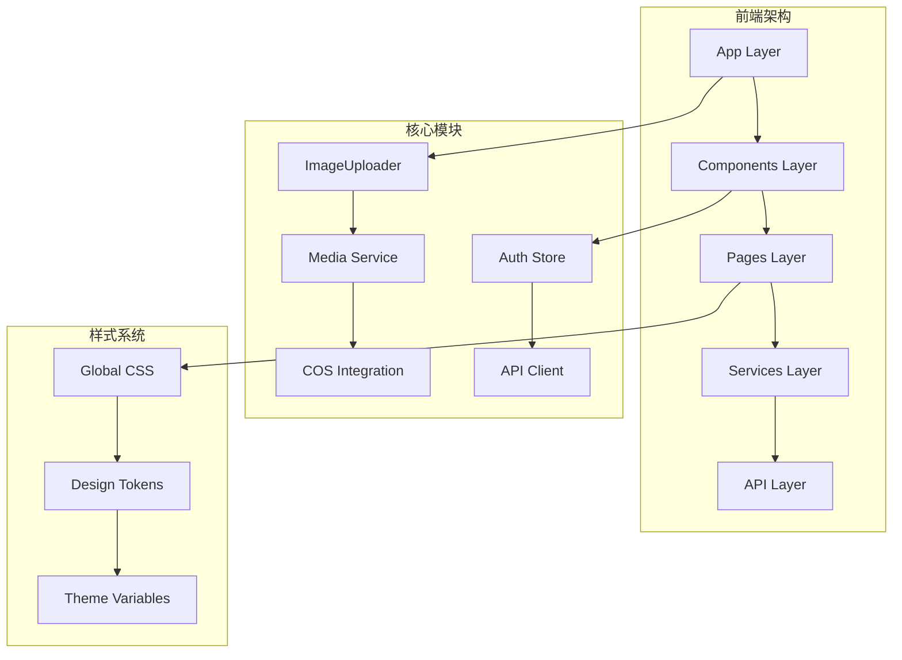
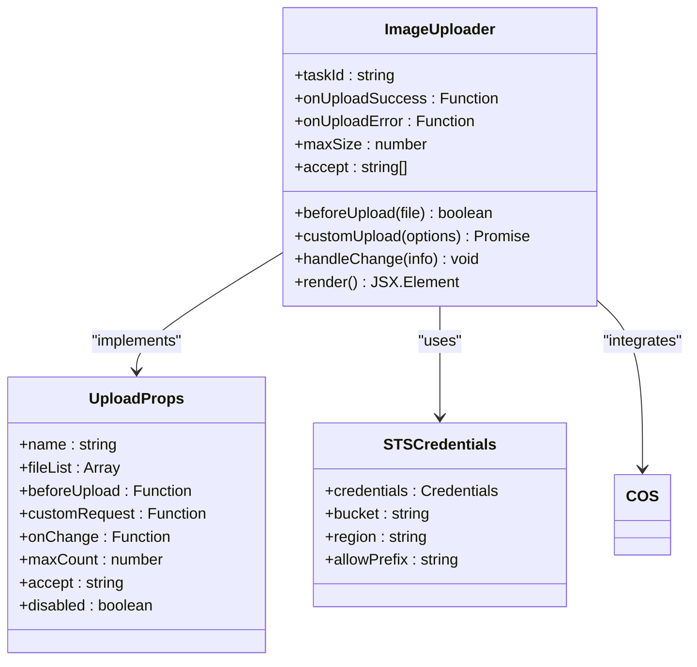
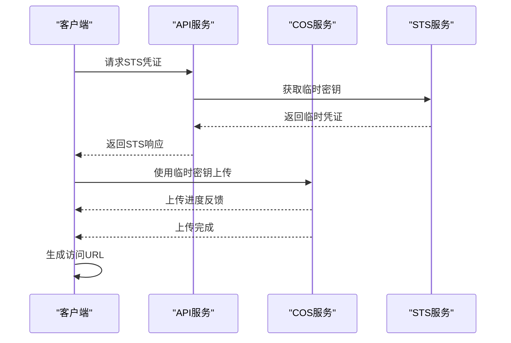
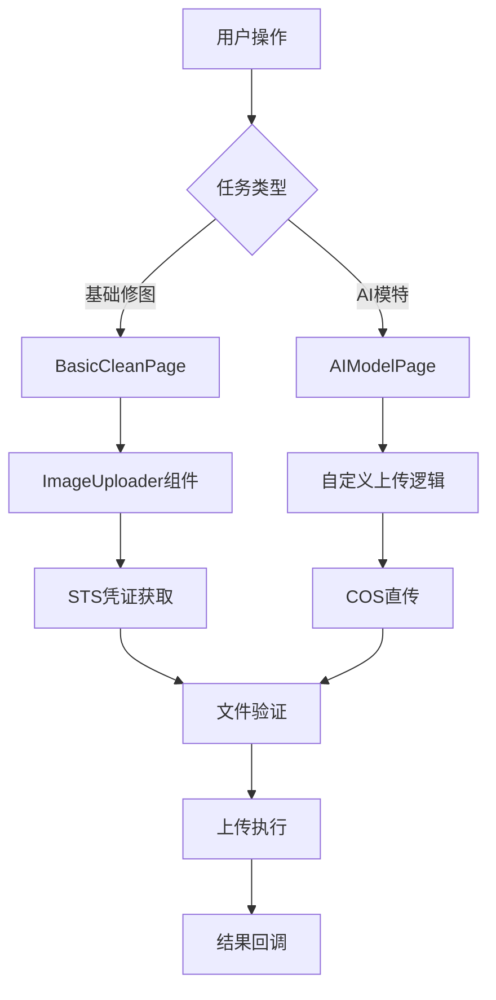

# UI组件设计与实现文档

<cite>
**本文档引用的文件**
- [ImageUploader.tsx](file://frontend/src/components/ImageUploader.tsx)
- [globals.css](file://frontend/src/app/globals.css)
- [index.ts](file://frontend/src/types/index.ts)
- [api.ts](file://frontend/src/lib/api.ts)
- [authStore.ts](file://frontend/src/store/authStore.ts)
- [layout.tsx](file://frontend/src/app/layout.tsx)
- [model/page.tsx](file://frontend/src/app/task/model/page.tsx)
- [basic/page.tsx](file://frontend/src/app/task/basic/page.tsx)
- [package.json](file://frontend/package.json)
- [tsconfig.json](file://frontend/tsconfig.json)
</cite>

## 目录
1. [项目概述](#项目概述)
2. [项目架构](#项目架构)
3. [核心UI组件](#核心ui组件)
4. [设计系统规范](#设计系统规范)
5. [组件使用指南](#组件使用指南)
6. [性能优化策略](#性能优化策略)
7. [最佳实践](#最佳实践)
8. [故障排除](#故障排除)

## 项目概述

本项目是一个基于Next.js的AI图像处理平台，专注于服装行业的AI图像处理服务。项目采用现代化的前端架构，集成了Ant Design组件库和腾讯云COS存储服务，提供了完整的图片上传、处理和展示功能。

### 技术栈概览

- **前端框架**: Next.js 14.0.4
- **UI库**: Ant Design 5.12.0
- **状态管理**: Zustand + React Context
- **HTTP客户端**: Axios
- **云存储**: 腾讯云COS
- **构建工具**: Vite + TypeScript

**章节来源**
- [package.json](file://frontend/package.json#L1-L32)
- [tsconfig.json](file://frontend/tsconfig.json#L1-L28)

## 项目架构

项目的前端架构采用模块化设计，主要分为以下几个层次：



**图表来源**
- [layout.tsx](file://frontend/src/app/layout.tsx#L1-L26)
- [globals.css](file://frontend/src/app/globals.css#L1-L14)

### 目录结构分析

项目采用功能导向的目录组织方式：

- **`src/app/`**: Next.js App Router页面和布局
- **`src/components/`**: 可复用UI组件
- **`src/lib/`**: 业务逻辑和服务层
- **`src/store/`**: 状态管理
- **`src/types/`**: TypeScript类型定义

**章节来源**
- [layout.tsx](file://frontend/src/app/layout.tsx#L1-L26)

## 核心UI组件

### ImageUploader组件详解

ImageUploader是项目的核心上传组件，实现了完整的文件上传流程，包括文件验证、进度跟踪、错误处理和与COS STS临时密钥机制的集成。

#### 组件架构设计



**图表来源**
- [ImageUploader.tsx](file://frontend/src/components/ImageUploader.tsx#L10-L20)
- [index.ts](file://frontend/src/types/index.ts#L35-L43)

#### 核心功能特性

##### 1. 文件验证机制

组件实现了多层次的文件验证：

- **格式验证**: 支持JPG、PNG格式
- **大小限制**: 可配置的最大文件大小（默认10MB）
- **类型检查**: 运行时验证文件类型

##### 2. STS临时密钥集成

组件与腾讯云COS STS机制深度集成：



**图表来源**
- [ImageUploader.tsx](file://frontend/src/components/ImageUploader.tsx#L45-L95)
- [api.ts](file://frontend/src/lib/api.ts#L95-L100)

##### 3. 进度跟踪系统

组件提供了实时的上传进度跟踪：

- **进度条显示**: 可视化的上传进度
- **状态指示**: 上传中/完成/错误状态
- **百分比计算**: 精确的上传进度百分比

**章节来源**
- [ImageUploader.tsx](file://frontend/src/components/ImageUploader.tsx#L1-L198)

### 组件Props定义

| 属性名 | 类型 | 必需 | 默认值 | 描述 |
|--------|------|------|--------|------|
| `taskId` | `string` | 否 | `undefined` | 关联的任务ID，用于STS凭证获取 |
| `onUploadSuccess` | `(url: string) => void` | 否 | `undefined` | 上传成功回调函数 |
| `onUploadError` | `(error: any) => void` | 否 | `undefined` | 上传错误回调函数 |
| `maxSize` | `number` | 否 | `10` | 最大文件大小（MB） |
| `accept` | `string[]` | 否 | `['image/jpeg', 'image/png']` | 接受的文件类型 |

### 使用示例

#### 基础使用

```typescript
<ImageUploader
  onUploadSuccess={(url) => console.log('上传成功:', url)}
  onUploadError={(error) => console.error('上传失败:', error)}
/>
```

#### 高级配置

```typescript
<ImageUploader
  taskId={currentTaskId}
  maxSize={5}
  accept={['image/jpeg', 'image/png', 'image/gif']}
  onUploadSuccess={handleUploadComplete}
  onUploadError={handleUploadError}
/>
```

**章节来源**
- [basic/page.tsx](file://frontend/src/app/task/basic/page.tsx#L130-L140)
- [model/page.tsx](file://frontend/src/app/task/model/page.tsx#L34-L73)

## 设计系统规范

### 全局样式架构

项目采用了基于CSS变量的设计系统，提供了统一的视觉语言和主题切换能力。

#### 字体系统

```css
/* 全局字体设置 */
font-family: -apple-system, BlinkMacSystemFont, 'Segoe UI', 'Roboto', 'Oxygen',
  'Ubuntu', 'Cantarell', 'Fira Sans', 'Droid Sans', 'Helvetica Neue',
  sans-serif;
```

#### 颜色系统

设计系统包含多个主题变体：

| 主题 | 主色调 | 辅助色 | 错误色 | 文字色 |
|------|--------|--------|--------|--------|
| 青蓝玻璃 | `#06b6d4` | `#14b8a6` | `#f43f5e` | `#ffffff` |
| 赛博朋克 | `#ff0080` | `#00ffff` | `#ffff00` | `#ffffff` |
| 极光流体 | `#2ed573` | `#00ced1` | `#f39c12` | `#ffffff` |

#### 间距系统

采用8px为基础单位的间距系统：

- **微距**: 4px
- **小间距**: 8px
- **中间距**: 16px
- **大间距**: 24px
- **超大间距**: 32px

**章节来源**
- [globals.css](file://frontend/src/app/globals.css#L1-L14)

### 组件样式规范

#### 卡片组件

```css
/* 半透明玻璃效果 */
.card {
  background: rgba(255, 255, 255, 0.1);
  backdrop-filter: blur(10px);
  border: 1px solid rgba(255, 255, 255, 0.2);
  border-radius: 12px;
  box-shadow: 0 8px 32px 0 rgba(31, 38, 135, 0.37);
}
```

#### 按钮系统

```css
/* 主要CTA按钮 */
.button-primary {
  border: 1px solid rgba(6, 182, 212, 0.5);
  color: #06b6d4;
  transition: all 0.3s ease;
}

.button-primary:hover {
  background: rgba(6, 182, 212, 0.1);
  border-color: #06b6d4;
  color: #06b6d4;
}
```

**章节来源**
- [RULES.md](file://skills/frontend_dev_skill/RULES.md#L8-L204)

## 组件使用指南

### 在页面中的集成

#### 任务页面集成模式

ImageUploader组件在不同的任务页面中有不同的使用模式：



**图表来源**
- [basic/page.tsx](file://frontend/src/app/task/basic/page.tsx#L130-L140)
- [model/page.tsx](file://frontend/src/app/task/model/page.tsx#L34-L73)

#### 状态管理模式

组件通过多种状态来管理上传流程：

- **上传状态**: `uploading` (布尔值)
- **进度状态**: `progress` (百分比)
- **文件列表**: `fileList` (文件数组)
- **错误状态**: `error` (错误信息)

#### 事件回调系统

| 回调函数 | 参数 | 触发时机 | 用途 |
|----------|------|----------|------|
| `onUploadSuccess` | `url: string` | 上传成功 | 处理上传结果 |
| `onUploadError` | `error: any` | 上传失败 | 错误处理 |
| `beforeUpload` | `file: File` | 上传前 | 文件验证 |
| `onChange` | `info: any` | 状态变化 | 状态同步 |

**章节来源**
- [ImageUploader.tsx](file://frontend/src/components/ImageUploader.tsx#L110-L150)

### 样式定制指南

#### 主题定制

可以通过CSS变量进行主题定制：

```css
:root {
  --primary-color: #06b6d4;
  --primary-hover: #0596c7;
  --background-color: rgba(255, 255, 255, 0.1);
  --border-color: rgba(255, 255, 255, 0.2);
}
```

#### 组件样式覆盖

```css
/* 自定义上传区域样式 */
.ant-upload-drag {
  border: 2px dashed var(--primary-color);
  border-radius: 8px;
  min-height: 200px;
}

.ant-upload-drag:hover {
  border-color: var(--primary-hover);
}
```

**章节来源**
- [RULES.md](file://skills/frontend_dev_skill/RULES.md#L8.8-L133)

## 性能优化策略

### 图片懒加载实现

虽然当前组件没有直接实现图片懒加载，但可以参考以下优化策略：

#### 1. 虚拟滚动

对于大量图片的展示场景，可以使用虚拟滚动技术：

```typescript
// 虚拟滚动示例（伪代码）
<VirtualList
  itemHeight={200}
  itemCount={imageUrls.length}
  renderItem={({ index, style }) => (
    <div style={style}>
      <LazyImage src={imageUrls[index]} />
    </div>
  )}
/>
```

#### 2. 图片压缩

在上传前对图片进行压缩处理：

```typescript
// 图片压缩示例（伪代码）
const compressImage = async (file: File): Promise<Blob> => {
  const img = await createImageBitmap(file);
  const canvas = document.createElement('canvas');
  const ctx = canvas.getContext('2d');
  
  // 设置目标尺寸
  const MAX_WIDTH = 1920;
  const MAX_HEIGHT = 1080;
  
  let width = img.width;
  let height = img.height;
  
  if (width > height) {
    if (width > MAX_WIDTH) {
      height *= MAX_WIDTH / width;
      width = MAX_WIDTH;
    }
  } else {
    if (height > MAX_HEIGHT) {
      width *= MAX_HEIGHT / height;
      height = MAX_HEIGHT;
    }
  }
  
  canvas.width = width;
  canvas.height = height;
  ctx.drawImage(img, 0, 0, width, height);
  
  return new Promise((resolve) => {
    canvas.toBlob(resolve, 'image/jpeg', 0.8);
  });
};
```

#### 3. 缓存策略

实现智能缓存机制：

```typescript
// 缓存策略示例（伪代码）
const cacheManager = {
  get(key: string): string | null {
    return localStorage.getItem(key);
  },
  
  set(key: string, value: string, ttl: number = 3600) {
    localStorage.setItem(key, JSON.stringify({
      value,
      expiry: Date.now() + ttl * 1000
    }));
  },
  
  hasExpired(key: string): boolean {
    const item = localStorage.getItem(key);
    if (!item) return true;
    
    const parsed = JSON.parse(item);
    return Date.now() > parsed.expiry;
  }
};
```

### 上传性能优化

#### 1. 分块上传

对于大文件，可以实现分块上传：

```typescript
// 分块上传示例（伪代码）
const chunkUpload = async (file: File, chunkSize: number = 5 * 1024 * 1024) => {
  const chunks = Math.ceil(file.size / chunkSize);
  const uploadIds: string[] = [];
  
  for (let i = 0; i < chunks; i++) {
    const start = i * chunkSize;
    const end = Math.min(start + chunkSize, file.size);
    const chunk = file.slice(start, end);
    
    const uploadId = await uploadChunk(chunk, i, chunks);
    uploadIds.push(uploadId);
  }
  
  return finalizeUpload(uploadIds);
};
```

#### 2. 并发控制

限制同时上传的文件数量：

```typescript
// 并发控制示例（伪代码）
const uploadQueue = new Queue({
  concurrency: 3,
  autoStart: true
});

uploadQueue.add(async (file: File) => {
  await uploadFile(file);
});
```

**章节来源**
- [imageProcess.service.js](file://backend/src/services/imageProcess.service.js#L42-L80)

## 最佳实践

### 错误处理最佳实践

#### 1. 用户友好的错误提示

```typescript
// 错误处理示例
const handleError = (error: any, fallbackMessage: string = '操作失败') => {
  const errorMessage = error.message || fallbackMessage;
  
  // 根据错误类型提供不同提示
  if (error.code === 'FILE_SIZE_EXCEEDED') {
    message.error('文件大小超出限制，请上传小于10MB的文件');
  } else if (error.code === 'UNSUPPORTED_FORMAT') {
    message.error('不支持的文件格式，请上传JPG或PNG格式');
  } else {
    message.error(errorMessage);
  }
};
```

#### 2. 重试机制

```typescript
// 重试机制示例
const withRetry = async <T>(
  fn: () => Promise<T>,
  maxRetries: number = 3,
  delay: number = 1000
): Promise<T> => {
  let lastError: any;
  
  for (let i = 0; i < maxRetries; i++) {
    try {
      return await fn();
    } catch (error) {
      lastError = error;
      if (i < maxRetries - 1) {
        await new Promise(resolve => setTimeout(resolve, delay * (i + 1)));
      }
    }
  }
  
  throw lastError;
};
```

### 可访问性优化

#### 1. 键盘导航支持

```typescript
// 键盘导航示例
const handleKeyDown = (event: KeyboardEvent) => {
  switch (event.key) {
    case 'Enter':
    case ' ':
      event.preventDefault();
      // 执行上传操作
      break;
    case 'Escape':
      // 取消上传
      break;
  }
};
```

#### 2. 屏幕阅读器支持

```typescript
// 屏幕阅读器支持示例
<div role="progressbar" aria-valuenow={progress} aria-valuemin={0} aria-valuemax={100}>
  上传进度: {progress}%
</div>
```

### 测试策略

#### 1. 单元测试

```typescript
// 组件测试示例
describe('ImageUploader', () => {
  it('should validate file format', () => {
    const file = new File([''], 'test.pdf', { type: 'application/pdf' });
    expect(beforeUpload(file)).toBe(false);
  });
  
  it('should validate file size', () => {
    const largeFile = new File([''.padEnd(11 * 1024 * 1024)], 'large.jpg');
    expect(beforeUpload(largeFile)).toBe(false);
  });
});
```

#### 2. 集成测试

```typescript
// 集成测试示例
describe('ImageUploader with API', () => {
  it('should upload file successfully', async () => {
    const mockFile = new File(['test'], 'test.jpg');
    const result = await customUpload({ file: mockFile });
    
    expect(result.url).toBeDefined();
    expect(result.taskId).toBeDefined();
  });
});
```

**章节来源**
- [ImageUploader.tsx](file://frontend/src/components/ImageUploader.tsx#L25-L45)

## 故障排除

### 常见问题及解决方案

#### 1. CORS跨域问题

**问题描述**: 上传过程中出现CORS错误

**解决方案**:
- 确保COS存储桶配置了正确的CORS规则
- 检查STS临时密钥的有效期
- 验证请求头设置

```javascript
// CORS配置示例
[
  {
    "AllowedOrigins": ["*"],
    "AllowedMethods": ["GET", "POST", "PUT", "DELETE"],
    "AllowedHeaders": ["*"],
    "ExposeHeaders": ["ETag", "Content-Length"]
  }
]
```

#### 2. 上传中断问题

**问题描述**: 上传过程中断或超时

**解决方案**:
- 实现断点续传功能
- 增加重试机制
- 优化网络连接检测

```typescript
// 断点续传示例
const resumeUpload = async (file: File, checkpoint: Checkpoint) => {
  const { start, end } = checkpoint;
  const chunk = file.slice(start, end);
  
  try {
    const response = await uploadChunk(chunk, start, end);
    return response;
  } catch (error) {
    // 记录断点位置
    saveCheckpoint(file, end);
    throw error;
  }
};
```

#### 3. 内存泄漏问题

**问题描述**: 长时间使用后内存占用过高

**解决方案**:
- 及时清理文件对象引用
- 使用WeakMap存储临时数据
- 实现组件卸载时的资源清理

```typescript
// 内存清理示例
useEffect(() => {
  return () => {
    // 清理文件对象
    fileList.forEach(file => {
      if (file.originFileObj) {
        URL.revokeObjectURL(file.originFileObj);
      }
    });
  };
}, []);
```

### 调试技巧

#### 1. 开发者工具调试

```typescript
// 调试日志示例
const debugUpload = (stage: string, data: any) => {
  if (process.env.NODE_ENV === 'development') {
    console.log(`[Upload Debug] ${stage}:`, data);
  }
};
```

#### 2. 性能监控

```typescript
// 性能监控示例
const measureUploadPerformance = () => {
  const startTime = performance.now();
  
  return (stage: string) => {
    const duration = performance.now() - startTime;
    console.log(`[Performance] ${stage}: ${duration.toFixed(2)}ms`);
  };
};
```

**章节来源**
- [ImageUploader.tsx](file://frontend/src/components/ImageUploader.tsx#L80-L95)

## 总结

ImageUploader组件作为AI图像处理平台的核心组件，展现了现代前端开发的最佳实践。它不仅实现了完整的文件上传功能，还深度集成了云存储服务和状态管理系统，为用户提供流畅的上传体验。

通过本文档的详细分析，开发者可以：

1. **深入理解组件架构**: 掌握组件的设计理念和实现细节
2. **灵活使用组件**: 根据不同需求进行定制和扩展
3. **优化性能表现**: 应用各种性能优化策略
4. **确保代码质量**: 遵循最佳实践和测试策略

随着项目的不断发展，这个组件将继续演进，为用户提供更加优秀的AI图像处理体验。