# 前端架构设计文档

<cite>
**本文档引用的文件**
- [layout.tsx](file://frontend/src/app/layout.tsx)
- [authStore.ts](file://frontend/src/store/authStore.ts)
- [api.ts](file://frontend/src/lib/api.ts)
- [ImageUploader.tsx](file://frontend/src/components/ImageUploader.tsx)
- [globals.css](file://frontend/src/app/globals.css)
- [login/page.tsx](file://frontend/src/app/login/page.tsx)
- [task/[taskId]/page.tsx](file://frontend/src/app/task/[taskId]/page.tsx)
- [workspace/page.tsx](file://frontend/src/app/workspace/page.tsx)
- [page.tsx](file://frontend/src/app/page.tsx)
- [index.ts](file://frontend/src/types/index.ts)
- [package.json](file://frontend/package.json)
- [next.config.js](file://frontend/next.config.js)
</cite>

## 目录
1. [项目概述](#项目概述)
2. [技术栈架构](#技术栈架构)
3. [Next.js App Router 路由系统](#nextjs-app-router-路由系统)
4. [状态管理架构](#状态管理架构)
5. [API调用层设计](#api调用层设计)
6. [页面组件架构](#页面组件架构)
7. [可复用UI组件设计](#可复用ui组件设计)
8. [样式系统与布局](#样式系统与布局)
9. [认证与权限控制](#认证与权限控制)
10. [开发最佳实践](#开发最佳实践)
11. [总结](#总结)

## 项目概述

本项目是一个基于Next.js 14的现代化前端应用，采用App Router架构，专注于AI服装处理服务。项目实现了完整的用户认证、任务管理、会员体系等功能模块，提供了流畅的用户体验和高效的开发模式。

### 核心特性
- **现代化路由系统**：基于Next.js App Router的文件系统路由
- **高效状态管理**：使用Zustand实现轻量级状态管理
- **统一API层**：封装Axios实现统一的API调用和错误处理
- **响应式UI设计**：基于Ant Design的组件库
- **云端集成**：集成腾讯云COS存储服务

## 技术栈架构

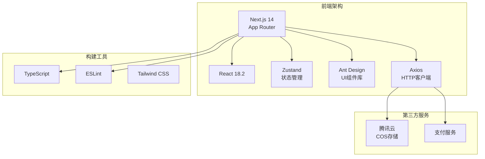

**图表来源**
- [package.json](file://frontend/package.json#L10-L20)
- [next.config.js](file://frontend/next.config.js#L1-L21)

**章节来源**
- [package.json](file://frontend/package.json#L1-L32)
- [next.config.js](file://frontend/next.config.js#L1-L21)

## Next.js App Router 路由系统

### 路由结构设计

Next.js App Router采用文件系统路由，每个目录对应一个路由路径，支持动态路由和嵌套路由。

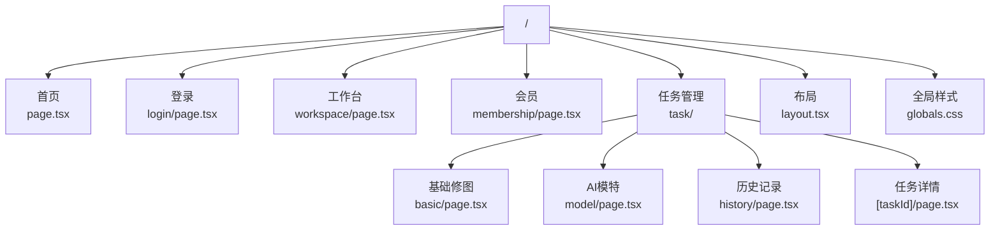

**图表来源**
- [layout.tsx](file://frontend/src/app/layout.tsx#L1-L26)
- [login/page.tsx](file://frontend/src/app/login/page.tsx#L1-L210)
- [workspace/page.tsx](file://frontend/src/app/workspace/page.tsx#L1-L332)

### 动态路由实现

动态路由通过方括号语法实现，例如 `[taskId]` 表示动态参数。

**章节来源**
- [task/[taskId]/page.tsx](file://frontend/src/app/task/[taskId]/page.tsx#L1-L364)

### 路由守卫机制

项目实现了基于状态管理的路由守卫，在页面组件中检查用户认证状态：

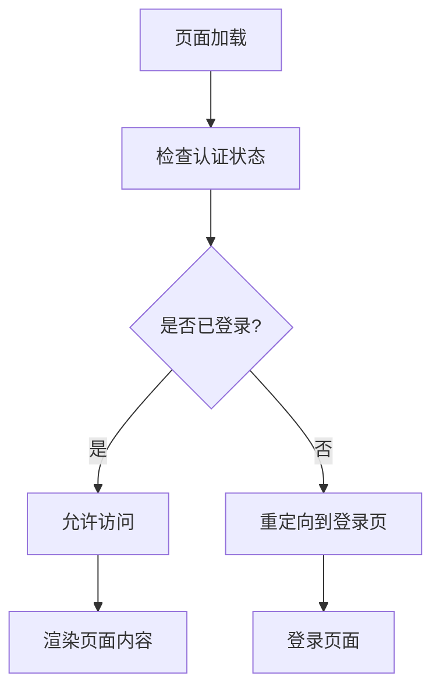

**图表来源**
- [workspace/page.tsx](file://frontend/src/app/workspace/page.tsx#L40-L50)
- [page.tsx](file://frontend/src/app/page.tsx#L10-L20)

**章节来源**
- [workspace/page.tsx](file://frontend/src/app/workspace/page.tsx#L40-L50)
- [page.tsx](file://frontend/src/app/page.tsx#L10-L20)

## 状态管理架构

### Zustand Store 设计

项目使用Zustand实现轻量级状态管理，主要管理用户认证状态和全局数据。

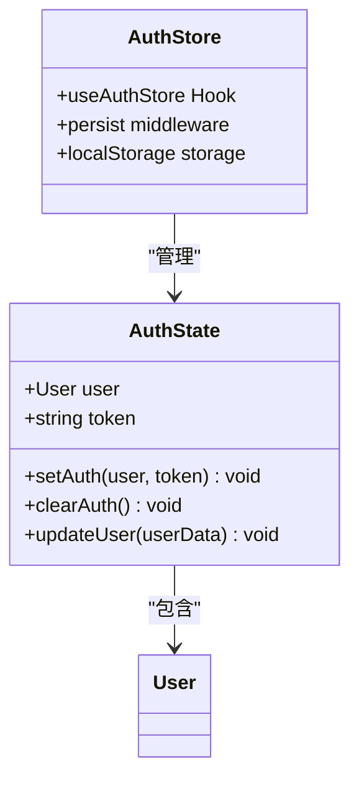

**图表来源**
- [authStore.ts](file://frontend/src/store/authStore.ts#L5-L15)

### 状态管理模式

状态管理遵循以下原则：
1. **单一职责**：每个store专注特定领域
2. **持久化**：使用persist中间件实现本地存储
3. **类型安全**：完整的TypeScript类型定义
4. **响应式更新**：自动触发组件重新渲染

**章节来源**
- [authStore.ts](file://frontend/src/store/authStore.ts#L1-L43)

## API调用层设计

### APIClient 架构

API调用层采用类封装模式，提供统一的接口和错误处理。

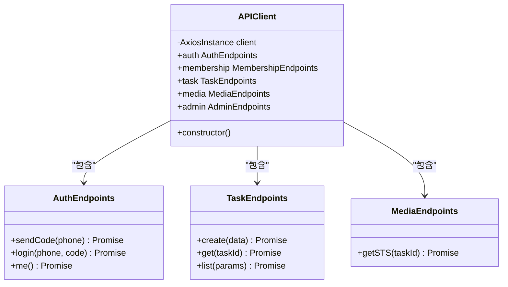

**图表来源**
- [api.ts](file://frontend/src/lib/api.ts#L10-L50)

### 请求拦截器设计

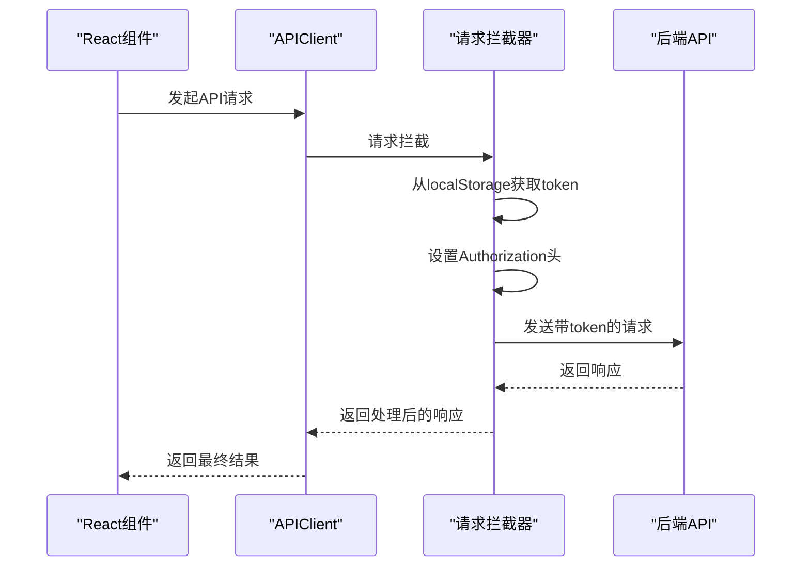

**图表来源**
- [api.ts](file://frontend/src/lib/api.ts#L25-L40)

### 错误处理机制

API层实现了完善的错误处理机制：

1. **401未授权处理**：自动清除token并重定向到登录页
2. **网络错误处理**：提供友好的错误提示
3. **业务错误处理**：返回具体的错误码和消息

**章节来源**
- [api.ts](file://frontend/src/lib/api.ts#L1-L118)

## 页面组件架构

### 组件层次结构

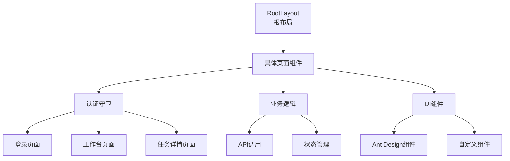

**图表来源**
- [layout.tsx](file://frontend/src/app/layout.tsx#L15-L25)
- [login/page.tsx](file://frontend/src/app/login/page.tsx#L15-L30)

### 页面组件设计模式

每个页面组件都遵循以下设计模式：

1. **客户端组件标记**：使用 `'use client'` 声明
2. **状态管理集成**：通过hooks访问全局状态
3. **API调用封装**：统一的API调用入口
4. **错误边界处理**：完善的错误处理机制

**章节来源**
- [login/page.tsx](file://frontend/src/app/login/page.tsx#L1-L210)
- [task/[taskId]/page.tsx](file://frontend/src/app/task/[taskId]/page.tsx#L1-L364)

## 可复用UI组件设计

### ImageUploader 组件架构

ImageUploader是一个高度可配置的图片上传组件，支持多种功能：

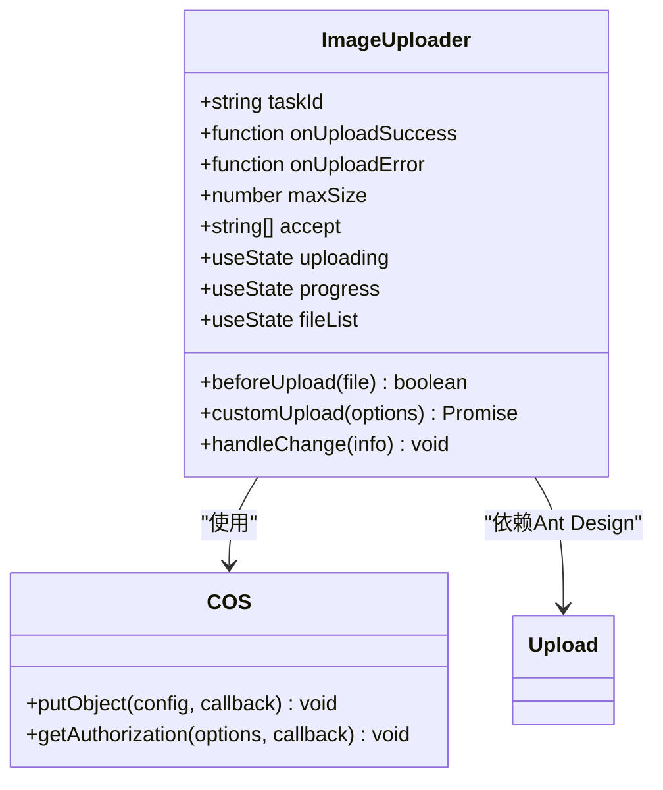

**图表来源**
- [ImageUploader.tsx](file://frontend/src/components/ImageUploader.tsx#L15-L50)

### 组件设计原则

1. **配置化**：通过props提供灵活的配置选项
2. **事件驱动**：提供上传成功的回调函数
3. **状态管理**：内部维护上传状态和进度
4. **错误处理**：完善的错误捕获和用户反馈

**章节来源**
- [ImageUploader.tsx](file://frontend/src/components/ImageUploader.tsx#L1-L198)

## 样式系统与布局

### 全局样式设计

全局样式采用最小化策略，仅定义基础的字体和盒模型设置：

```css
/* 基础样式规则 */
body {
  margin: 0;
  padding: 0;
  font-family: -apple-system, BlinkMacSystemFont, 'Segoe UI', 'Roboto', 'Oxygen',
    'Ubuntu', 'Cantarell', 'Fira Sans', 'Droid Sans', 'Helvetica Neue',
    sans-serif;
  -webkit-font-smoothing: antialiased;
  -moz-osx-font-smoothing: grayscale;
}

* {
  box-sizing: border-box;
}
```

**章节来源**
- [globals.css](file://frontend/src/app/globals.css#L1-L14)

### 布局系统

布局系统采用Ant Design的栅格系统，配合Flexbox实现响应式设计：

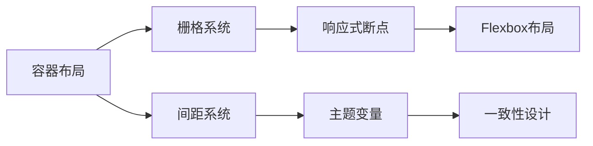

**图表来源**
- [workspace/page.tsx](file://frontend/src/app/workspace/page.tsx#L150-L200)

## 认证与权限控制

### 认证流程设计

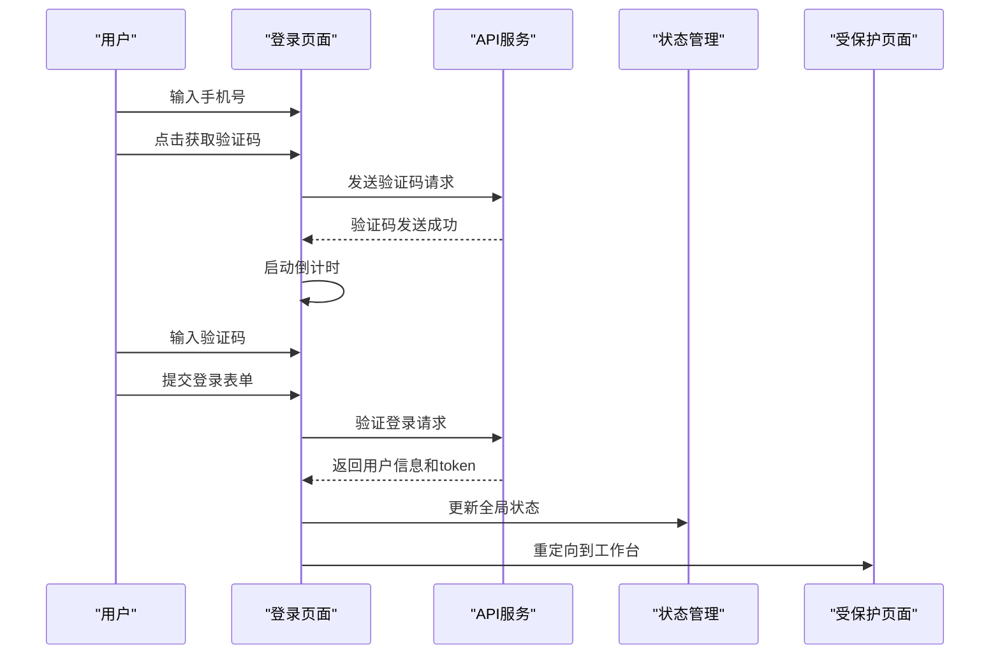

**图表来源**
- [login/page.tsx](file://frontend/src/app/login/page.tsx#L30-L80)
- [authStore.ts](file://frontend/src/store/authStore.ts#L15-L35)

### 权限控制机制

1. **路由级别保护**：通过状态管理检查用户认证状态
2. **功能级别控制**：根据会员状态限制功能使用
3. **API级别保护**：通过token验证确保接口安全

**章节来源**
- [login/page.tsx](file://frontend/src/app/login/page.tsx#L30-L80)
- [workspace/page.tsx](file://frontend/src/app/workspace/page.tsx#L40-L60)

## 开发最佳实践

### 类型安全设计

项目采用完整的TypeScript类型定义，确保代码质量和开发效率：

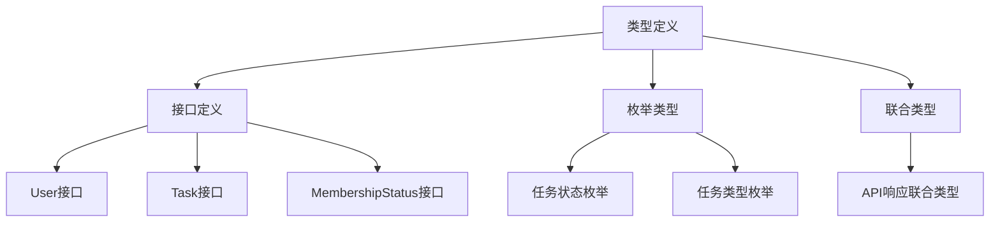

**图表来源**
- [index.ts](file://frontend/src/types/index.ts#L1-L43)

### 性能优化策略

1. **组件懒加载**：利用Next.js的自动代码分割
2. **状态管理优化**：使用Zustand减少不必要的重渲染
3. **图片优化**：配置Next.js图片优化功能
4. **API缓存**：合理使用浏览器缓存和CDN

### 开发环境配置

项目配置了完善的开发环境：

- **TypeScript**：提供类型安全保障
- **ESLint**：代码质量检查
- **Prettier**：代码格式化
- **Next.js DevTools**：开发调试工具

**章节来源**
- [package.json](file://frontend/package.json#L15-L32)
- [next.config.js](file://frontend/next.config.js#L1-L21)

## 总结

本前端架构设计体现了现代Web开发的最佳实践：

### 核心优势

1. **架构清晰**：采用分层架构，职责分明
2. **技术先进**：使用最新的Next.js App Router和TypeScript
3. **开发高效**：完善的类型系统和状态管理
4. **用户体验**：流畅的交互和响应式设计
5. **可维护性**：模块化设计和良好的代码组织

### 技术特色

- **声明式编程**：React和Zustand的组合
- **类型安全**：完整的TypeScript类型定义
- **异步处理**：Promise和async/await的规范使用
- **错误处理**：多层次的错误处理机制
- **性能优化**：合理的状态管理和资源加载策略

### 扩展性考虑

架构设计充分考虑了未来的扩展需求：
- **模块化**：易于添加新的功能模块
- **插件化**：可插入新的中间件和服务
- **配置化**：通过配置文件管理不同环境
- **测试友好**：清晰的依赖关系便于单元测试

这套前端架构为AI服装处理平台提供了坚实的技术基础，能够支撑业务的快速发展和功能的持续迭代。