# 前端架构设计文档

<cite>
**本文档引用的文件**
- [layout.tsx](file://frontend/src/app/layout.tsx) - *更新了可访问性支持*
- [authStore.ts](file://frontend/src/store/authStore.ts)
- [api.ts](file://frontend/src/lib/api.ts)
- [ImageUploader.tsx](file://frontend/src/components/ImageUploader.tsx)
- [globals.css](file://frontend/src/app/globals.css)
- [login/page.tsx](file://frontend/src/app/login/page.tsx)
- [task/[taskId]/page.tsx](file://frontend/src/app/task/[taskId]/page.tsx)
- [workspace/page.tsx](file://frontend/src/app/workspace/page.tsx)
- [page.tsx](file://frontend/src/app/page.tsx)
- [index.ts](file://frontend/src/types/index.ts)
- [package.json](file://frontend/package.json)
- [next.config.js](file://frontend/next.config.js)
- [A11Y-P2-ACCESS-206-可访问性指南.md](file://frontend/A11Y-P2-ACCESS-206-可访问性指南.md) - *新增可访问性指南*
- [I18N-P2-LOCALE-209-使用指南.md](file://frontend/I18N-P2-LOCALE-209-使用指南.md) - *新增国际化指南*
- [security.md](file://frontend/docs/security.md) - *新增安全防护指南*
- [accessibility.css](file://frontend/src/styles/accessibility.css) - *新增可访问性样式*
- [LanguageSwitcher.tsx](file://frontend/src/components/LanguageSwitcher.tsx) - *新增语言切换器*
- [lighthouse-a11y.js](file://frontend/scripts/lighthouse-a11y.js) - *新增可访问性检查脚本*
</cite>

## 更新摘要
**变更内容**
- 新增可访问性优化指南，包含ESLint检查、工具库、样式规范和Lighthouse自动化测试
- 新增国际化使用指南，支持中英文切换和路由国际化
- 新增安全防护指南，涵盖XSS、CSRF等防护措施
- 更新了根布局以支持可访问性功能
- 添加了语言切换器组件和相关配置

## 目录
1. [项目概述](#项目概述)
2. [技术栈架构](#技术栈架构)
3. [Next.js App Router 路由系统](#nextjs-app-router-路由系统)
4. [状态管理架构](#状态管理架构)
5. [API调用层设计](#api调用层设计)
6. [页面组件架构](#页面组件架构)
7. [可复用UI组件设计](#可复用ui组件设计)
8. [样式系统与布局](#样式系统与布局)
9. [认证与权限控制](#认证与权限控制)
10. [开发最佳实践](#开发最佳实践)
11. [可访问性优化指南](#可访问性优化指南)
12. [国际化使用指南](#国际化使用指南)
13. [安全防护指南](#安全防护指南)
14. [总结](#总结)

## 项目概述

本项目是一个基于Next.js 14的现代化前端应用，采用App Router架构，专注于AI服装处理服务。项目实现了完整的用户认证、任务管理、会员体系等功能模块，提供了流畅的用户体验和高效的开发模式。

### 核心特性
- **现代化路由系统**：基于Next.js App Router的文件系统路由
- **高效状态管理**：使用Zustand实现轻量级状态管理
- **统一API层**：封装Axios实现统一的API调用和错误处理
- **响应式UI设计**：基于Ant Design的组件库
- **云端集成**：集成腾讯云COS存储服务
- **可访问性支持**：符合WCAG 2.1标准，Lighthouse可访问性得分≥90
- **国际化支持**：中英文双语切换，路由国际化
- **安全防护**：XSS、CSRF等安全措施

## 技术栈架构

```mermaid
graph TB
subgraph "前端架构"
NextJS[Next.js 14<br/>App Router]
React[React 18.2]
Zustand[Zustand<br/>状态管理]
AntD[Ant Design<br/>UI组件库]
Axios[Axios<br/>HTTP客户端]
end
subgraph "构建工具"
TS[TypeScript]
ESLint[ESLint]
TailwindCSS[Tailwind CSS]
end
subgraph "第三方服务"
TencentCloud[腾讯云<br/>COS存储]
Payment[支付服务]
end
subgraph "新功能模块"
A11y[可访问性优化]
I18n[国际化支持]
Security[安全防护]
end
NextJS --> React
NextJS --> Zustand
NextJS --> AntD
NextJS --> Axios
NextJS --> TS
NextJS --> ESLint
Axios --> TencentCloud
Axios --> Payment
NextJS --> A11y
NextJS --> I18n
NextJS --> Security
```

**图表来源**
- [package.json](file://frontend/package.json#L10-L20)
- [next.config.js](file://frontend/next.config.js#L1-L21)
- [A11Y-P2-ACCESS-206-可访问性指南.md](file://frontend/A11Y-P2-ACCESS-206-可访问性指南.md)
- [I18N-P2-LOCALE-209-使用指南.md](file://frontend/I18N-P2-LOCALE-209-使用指南.md)

**章节来源**
- [package.json](file://frontend/package.json#L1-L32)
- [next.config.js](file://frontend/next.config.js#L1-L21)

## Next.js App Router 路由系统

### 路由结构设计

Next.js App Router采用文件系统路由，每个目录对应一个路由路径，支持动态路由和嵌套路由。

```mermaid
graph TD
Root["/"] --> Home["首页<br/>page.tsx"]
Root --> Login["登录<br/>login/page.tsx"]
Root --> Workspace["工作台<br/>workspace/page.tsx"]
Root --> Membership["会员<br/>membership/page.tsx"]
Root --> Task["任务管理<br/>task/"]
Task --> Basic["基础修图<br/>basic/page.tsx"]
Task --> Model["AI模特<br/>model/page.tsx"]
Task --> History["历史记录<br/>history/page.tsx"]
Task --> Detail["任务详情<br/>[taskId]/page.tsx"]
Root --> Layout["布局<br/>layout.tsx"]
Root --> Styles["全局样式<br/>globals.css"]
```

**图表来源**
- [layout.tsx](file://frontend/src/app/layout.tsx#L1-L26)
- [login/page.tsx](file://frontend/src/app/login/page.tsx#L1-L210)
- [workspace/page.tsx](file://frontend/src/app/workspace/page.tsx#L1-L332)

### 动态路由实现

动态路由通过方括号语法实现，例如 `[taskId]` 表示动态参数。

**章节来源**
- [task/[taskId]/page.tsx](file://frontend/src/app/task/[taskId]/page.tsx#L1-L364)

### 路由守卫机制

项目实现了基于状态管理的路由守卫，在页面组件中检查用户认证状态：

```mermaid
flowchart TD
PageLoad["页面加载"] --> CheckAuth["检查认证状态"]
CheckAuth --> IsLoggedIn{"是否已登录?"}
IsLoggedIn --> |是| AllowAccess["允许访问"]
IsLoggedIn --> |否| RedirectLogin["重定向到登录页"]
AllowAccess --> RenderPage["渲染页面内容"]
RedirectLogin --> LoginPage["登录页面"]
```

**图表来源**
- [workspace/page.tsx](file://frontend/src/app/workspace/page.tsx#L40-L50)
- [page.tsx](file://frontend/src/app/page.tsx#L10-L20)

**章节来源**
- [workspace/page.tsx](file://frontend/src/app/workspace/page.tsx#L40-L50)
- [page.tsx](file://frontend/src/app/page.tsx#L10-L20)

## 状态管理架构

### Zustand Store 设计

项目使用Zustand实现轻量级状态管理，主要管理用户认证状态和全局数据。

```mermaid
classDiagram
class AuthState {
+User user
+string token
+setAuth(user, token) void
+clearAuth() void
+updateUser(userData) void
}
class AuthStore {
+useAuthStore Hook
+persist middleware
+localStorage storage
}
AuthStore --> AuthState : "管理"
AuthState --> User : "包含"
```

**图表来源**
- [authStore.ts](file://frontend/src/store/authStore.ts#L5-L15)

### 状态管理模式

状态管理遵循以下原则：
1. **单一职责**：每个store专注特定领域
2. **持久化**：使用persist中间件实现本地存储
3. **类型安全**：完整的TypeScript类型定义
4. **响应式更新**：自动触发组件重新渲染

**章节来源**
- [authStore.ts](file://frontend/src/store/authStore.ts#L1-L43)

## API调用层设计

### APIClient 架构

API调用层采用类封装模式，提供统一的接口和错误处理。

```mermaid
classDiagram
class APIClient {
-AxiosInstance client
+constructor()
+auth AuthEndpoints
+membership MembershipEndpoints
+task TaskEndpoints
+media MediaEndpoints
+admin AdminEndpoints
}
class AuthEndpoints {
+sendCode(phone) Promise
+login(phone, code) Promise
+me() Promise
}
class TaskEndpoints {
+create(data) Promise
+get(taskId) Promise
+list(params) Promise
}
class MediaEndpoints {
+getSTS(taskId) Promise
}
APIClient --> AuthEndpoints : "包含"
APIClient --> TaskEndpoints : "包含"
APIClient --> MediaEndpoints : "包含"
```

**图表来源**
- [api.ts](file://frontend/src/lib/api.ts#L10-L50)

### 请求拦截器设计

```mermaid
sequenceDiagram
participant Component as "React组件"
participant API as "APIClient"
participant Interceptor as "请求拦截器"
participant Backend as "后端API"
Component->>API : 发起API请求
API->>Interceptor : 请求拦截
Interceptor->>Interceptor : 从localStorage获取token
Interceptor->>Interceptor : 设置Authorization头
Interceptor->>Backend : 发送带token的请求
Backend-->>Interceptor : 返回响应
Interceptor-->>API : 返回处理后的响应
API-->>Component : 返回最终结果
```

**图表来源**
- [api.ts](file://frontend/src/lib/api.ts#L25-L40)

### 错误处理机制

API层实现了完善的错误处理机制：

1. **401未授权处理**：自动清除token并重定向到登录页
2. **网络错误处理**：提供友好的错误提示
3. **业务错误处理**：返回具体的错误码和消息

**章节来源**
- [api.ts](file://frontend/src/lib/api.ts#L1-L118)

## 页面组件架构

### 组件层次结构

```mermaid
graph TD
Layout["RootLayout<br/>根布局"] --> Page["具体页面组件"]
Page --> AuthGuard["认证守卫"]
Page --> BusinessLogic["业务逻辑"]
Page --> UIComponents["UI组件"]
AuthGuard --> Login["登录页面"]
AuthGuard --> Workspace["工作台页面"]
AuthGuard --> TaskDetail["任务详情页面"]
BusinessLogic --> API["API调用"]
BusinessLogic --> Store["状态管理"]
UIComponents --> AntD["Ant Design组件"]
UIComponents --> Custom["自定义组件"]
```

**图表来源**
- [layout.tsx](file://frontend/src/app/layout.tsx#L15-L25)
- [login/page.tsx](file://frontend/src/app/login/page.tsx#L15-L30)

### 页面组件设计模式

每个页面组件都遵循以下设计模式：

1. **客户端组件标记**：使用 `'use client'` 声明
2. **状态管理集成**：通过hooks访问全局状态
3. **API调用封装**：统一的API调用入口
4. **错误边界处理**：完善的错误处理机制

**章节来源**
- [login/page.tsx](file://frontend/src/app/login/page.tsx#L1-L210)
- [task/[taskId]/page.tsx](file://frontend/src/app/task/[taskId]/page.tsx#L1-L364)

## 可复用UI组件设计

### ImageUploader 组件架构

ImageUploader是一个高度可配置的图片上传组件，支持多种功能：

```mermaid
classDiagram
class ImageUploader {
+string taskId
+function onUploadSuccess
+function onUploadError
+number maxSize
+string[] accept
+useState uploading
+useState progress
+useState fileList
+beforeUpload(file) boolean
+customUpload(options) Promise
+handleChange(info) void
}
class COS {
+putObject(config, callback) void
+getAuthorization(options, callback) void
}
ImageUploader --> COS : "使用"
ImageUploader --> Upload : "依赖Ant Design"
```

**图表来源**
- [ImageUploader.tsx](file://frontend/src/components/ImageUploader.tsx#L15-L50)

### 组件设计原则

1. **配置化**：通过props提供灵活的配置选项
2. **事件驱动**：提供上传成功的回调函数
3. **状态管理**：内部维护上传状态和进度
4. **错误处理**：完善的错误捕获和用户反馈

**章节来源**
- [ImageUploader.tsx](file://frontend/src/components/ImageUploader.tsx#L1-L198)

## 样式系统与布局

### 全局样式设计

全局样式采用最小化策略，仅定义基础的字体和盒模型设置：

```css
/* 基础样式规则 */
body {
  margin: 0;
  padding: 0;
  font-family: -apple-system, BlinkMacSystemFont, 'Segoe UI', 'Roboto', 'Oxygen',
    'Ubuntu', 'Cantarell', 'Fira Sans', 'Droid Sans', 'Helvetica Neue',
    sans-serif;
  -webkit-font-smoothing: antialiased;
  -moz-osx-font-smoothing: grayscale;
}

* {
  box-sizing: border-box;
}
```

**章节来源**
- [globals.css](file://frontend/src/app/globals.css#L1-L14)

### 布局系统

布局系统采用Ant Design的栅格系统，配合Flexbox实现响应式设计：

```mermaid
graph LR
Container["容器布局"] --> Grid["栅格系统"]
Grid --> Responsive["响应式断点"]
Responsive --> Flex["Flexbox布局"]
Container --> Spacing["间距系统"]
Spacing --> Theme["主题变量"]
Theme --> Consistency["一致性设计"]
```

**图表来源**
- [workspace/page.tsx](file://frontend/src/app/workspace/page.tsx#L150-L200)

## 认证与权限控制

### 认证流程设计

```mermaid
sequenceDiagram
participant User as "用户"
participant Login as "登录页面"
participant API as "API服务"
participant Store as "状态管理"
participant Protected as "受保护页面"
User->>Login : 输入手机号
User->>Login : 点击获取验证码
Login->>API : 发送验证码请求
API-->>Login : 验证码发送成功
Login->>Login : 启动倒计时
User->>Login : 输入验证码
User->>Login : 提交登录表单
Login->>API : 验证登录请求
API-->>Login : 返回用户信息和token
Login->>Store : 更新全局状态
Login->>Protected : 重定向到工作台
```

**图表来源**
- [login/page.tsx](file://frontend/src/app/login/page.tsx#L30-L80)
- [authStore.ts](file://frontend/src/store/authStore.ts#L15-L35)

### 权限控制机制

1. **路由级别保护**：通过状态管理检查用户认证状态
2. **功能级别控制**：根据会员状态限制功能使用
3. **API级别保护**：通过token验证确保接口安全

**章节来源**
- [login/page.tsx](file://frontend/src/app/login/page.tsx#L30-L80)
- [workspace/page.tsx](file://frontend/src/app/workspace/page.tsx#L40-L60)

## 开发最佳实践

### 类型安全设计

项目采用完整的TypeScript类型定义，确保代码质量和开发效率：

```mermaid
graph TD
Types["类型定义"] --> Interfaces["接口定义"]
Types --> Enums["枚举类型"]
Types --> Unions["联合类型"]
Interfaces --> User["User接口"]
Interfaces --> Task["Task接口"]
Interfaces --> Membership["MembershipStatus接口"]
Enums --> TaskStatus["任务状态枚举"]
Enums --> TaskType["任务类型枚举"]
Unions --> APIResponse["API响应联合类型"]
```

**图表来源**
- [index.ts](file://frontend/src/types/index.ts#L1-L43)

### 性能优化策略

1. **组件懒加载**：利用Next.js的自动代码分割
2. **状态管理优化**：使用Zustand减少不必要的重渲染
3. **图片优化**：配置Next.js图片优化功能
4. **API缓存**：合理使用浏览器缓存和CDN

### 开发环境配置

项目配置了完善的开发环境：

- **TypeScript**：提供类型安全保障
- **ESLint**：代码质量检查
- **Prettier**：代码格式化
- **Next.js DevTools**：开发调试工具

**章节来源**
- [package.json](file://frontend/package.json#L15-L32)
- [next.config.js](file://frontend/next.config.js#L1-L21)

## 可访问性优化指南

### 概述

项目已实施全面的可访问性优化，目标是关键路径Lighthouse可访问性得分≥90。

**章节来源**
- [A11Y-P2-ACCESS-206-可访问性指南.md](file://frontend/A11Y-P2-ACCESS-206-可访问性指南.md)

### ESLint可访问性检查

已配置 `eslint-plugin-jsx-a11y` 插件，自动检查可访问性问题。

**检查命令**:
```bash
npm run lint          # 检查代码
npm run lint:fix      # 自动修复部分问题
```

**主要规则**:
- ✅ 图片必须有 alt 属性
- ✅ 按钮和链接必须有可访问的内容
- ✅ 表单元素必须有关联的标签
- ✅ ARIA 属性必须正确使用
- ✅ 交互元素必须支持键盘操作
- ✅ 颜色对比度必须符合标准

**章节来源**
- [A11Y-P2-ACCESS-206-可访问性指南.md](file://frontend/A11Y-P2-ACCESS-206-可访问性指南.md#L11-L30)

### 可访问性工具库

**位置**: `src/lib/accessibility/index.ts`

#### 键盘导航钩子
```tsx
import { useKeyboardNavigation } from '@/lib/accessibility';

function MyComponent() {
  const { handleKeyDown } = useKeyboardNavigation({
    onUp: () => console.log('上'),
    onDown: () => console.log('下'),
    onEnter: () => console.log('确认'),
    onEscape: () => console.log('取消'),
  });

  return <div onKeyDown={handleKeyDown}>可键盘操作的组件</div>;
}
```

#### 焦点陷阱 (Focus Trap)
```tsx
import { useFocusTrap } from '@/lib/accessibility';
import { useRef, useEffect } from 'react';

function Modal() {
  const modalRef = useRef<HTMLDivElement>(null);
  const { trapFocus } = useFocusTrap(modalRef);

  useEffect(() => {
    const cleanup = trapFocus();
    return cleanup;
  }, []);

  return (
    <div ref={modalRef} role="dialog" aria-modal="true">
      <h2>模态框标题</h2>
      <button>按钮1</button>
      <button>按钮2</button>
    </div>
  );
}
```

**章节来源**
- [src/lib/accessibility/index.tsx](file://frontend/src/lib/accessibility/index.tsx#L6-L100)

### 可访问性样式

**位置**: `src/styles/accessibility.css`

#### 屏幕阅读器专用样式
```css
/* 视觉隐藏，但屏幕阅读器可读 */
.sr-only {
  position: absolute;
  width: 1px;
  height: 1px;
  padding: 0;
  margin: -1px;
  overflow: hidden;
  clip: rect(0, 0, 0, 0);
  white-space: nowrap;
  border: 0;
}

/* 获得焦点时显示（用于"跳过导航"链接） */
.sr-only-focusable:focus {
  position: static;
  width: auto;
  height: auto;
  padding: var(--spacing-sm) var(--spacing-md);
  margin: 0;
  overflow: visible;
  clip: auto;
  white-space: normal;
  background-color: var(--color-primary);
  color: white;
  z-index: 9999;
}
```

#### 统一焦点样式
- 2px 蓝色边框
- 2px 偏移量
- 4px 蓝色半透明阴影

**章节来源**
- [src/styles/accessibility.css](file://frontend/src/styles/accessibility.css#L6-L32)

### Lighthouse自动化检查

**脚本位置**: `scripts/lighthouse-a11y.js`

#### 运行检查
```bash
# 启动开发服务器
npm run dev

# 在另一个终端运行检查
npm run a11y:check
```

#### 查看报告
检查完成后，详细报告保存在 `lighthouse-reports/` 目录。

**章节来源**
- [scripts/lighthouse-a11y.js](file://frontend/scripts/lighthouse-a11y.js#L1-L200)

### 跳过导航链接

已在根布局中添加"跳过导航"链接：

```tsx
// src/app/layout.tsx
<a href="#main-content" className="sr-only-focusable">
  跳过导航，直达主内容
</a>

<main id="main-content" tabIndex={-1}>
  {children}
</main>
```

**章节来源**
- [layout.tsx](file://frontend/src/app/layout.tsx#L47-L50)

## 国际化使用指南

### 概述

项目已集成 `next-intl` 库，支持中英文双语切换和路由国际化。

**章节来源**
- [I18N-P2-LOCALE-209-使用指南.md](file://frontend/I18N-P2-LOCALE-209-使用指南.md)

### 功能特性

- **双语支持**：中文（简体）和英文
- **自动检测**：根据浏览器语言自动选择
- **路由国际化**：URL 包含语言代码（/zh、/en）
- **持久化**：语言选择保存到 localStorage
- **类型安全**：TypeScript 支持
- **SSR 支持**：服务端渲染友好

**章节来源**
- [I18N-P2-LOCALE-209-使用指南.md](file://frontend/I18N-P2-LOCALE-209-使用指南.md#L24-L32)

### 翻译文件结构

**中文翻译**: `src/i18n/messages/zh.json`
**英文翻译**: `src/i18n/messages/en.json`

```json
{
  "common": {
    "appName": "AI衣柜",
    "appDescription": "专业的服装图片AI处理服务"
  },
  "nav": {
    "home": "首页",
    "workspace": "工作台"
  }
}
```

**章节来源**
- [src/i18n/messages/zh.json](file://frontend/src/i18n/messages/zh.json#L1-L204)

### 在组件中使用

#### 客户端组件
```tsx
'use client';

import { useTranslations } from 'next-intl';

export default function LoginForm() {
  const t = useTranslations('auth');

  return (
    <form>
      <label>{t('username')}</label>
      <input placeholder={t('username')} />
      <label>{t('password')}</label>
      <input type="password" placeholder={t('password')} />
      <button>{t('login')}</button>
    </form>
  );
}
```

#### 服务端组件
```tsx
import { getTranslations } from 'next-intl/server';

export default async function HomePage() {
  const t = await getTranslations('common');

  return (
    <div>
      <h1>{t('appName')}</h1>
      <p>{t('appDescription')}</p>
    </div>
  );
}
```

**章节来源**
- [I18N-P2-LOCALE-209-使用指南.md](file://frontend/I18N-P2-LOCALE-209-使用指南.md#L172-L210)

### 语言切换器

```tsx
'use client';

import { useLocale } from 'next-intl';
import { useRouter, usePathname } from 'next/navigation';
import { Select } from 'antd';
import { GlobalOutlined } from '@ant-design/icons';

const languages = [
  { value: 'zh', label: '简体中文', flag: '🇨🇳' },
  { value: 'en', label: 'English', flag: '🇺🇸' },
];

export default function LanguageSwitcher() {
  const locale = useLocale();
  const router = useRouter();
  const pathname = usePathname();

  const handleChange = (newLocale: string) => {
    // 保存到 localStorage
    if (typeof window !== 'undefined') {
      localStorage.setItem('locale', newLocale);
    }

    // 替换 URL 中的语言代码
    const newPathname = pathname.replace(`/${locale}`, `/${newLocale}`);
    router.push(newPathname);
  };

  return (
    <Select
      value={locale}
      onChange={handleChange}
      style={{ width: 150 }}
      suffixIcon={<GlobalOutlined />}
      options={languages.map((lang) => ({
        value: lang.value,
        label: (
          <span>
            {lang.flag} {lang.label}
          </span>
        ),
      }))}
    />
  );
}
```

**章节来源**
- [src/components/LanguageSwitcher.tsx](file://frontend/src/components/LanguageSwitcher.tsx#L1-L53)

### 路由国际化

```text
/zh/                       # 中文首页
/zh/workspace              # 中文工作台
/zh/templates              # 中文模板中心

/en/                       # 英文首页
/en/workspace              # 英文工作台
/en/templates              # 英文模板中心
```

**章节来源**
- [I18N-P2-LOCALE-209-使用指南.md](file://frontend/I18N-P2-LOCALE-209-使用指南.md#L348-L359)

## 安全防护指南

### 概述

项目已实施全面的安全防护措施，包括XSS、CSRF等防护。

**章节来源**
- [docs/security.md](file://frontend/docs/security.md)

### XSS防护

1. **输入验证**：对所有用户输入进行验证和清理
2. **输出编码**：在渲染前对动态内容进行HTML编码
3. **Content Security Policy**：配置严格的CSP策略

### CSRF防护

1. **CSRF Token**：在表单和API请求中包含CSRF token
2. **SameSite Cookie**：设置Cookie的SameSite属性为Strict或Lax
3. **Referer检查**：验证请求来源

### 其他安全措施

1. **HTTPS强制**：所有请求必须通过HTTPS
2. **敏感信息保护**：不在客户端存储敏感信息
3. **错误处理**：不暴露敏感错误信息

**章节来源**
- [docs/security.md](file://frontend/docs/security.md)

## 总结

本前端架构设计体现了现代Web开发的最佳实践：

### 核心优势

1. **架构清晰**：采用分层架构，职责分明
2. **技术先进**：使用最新的Next.js App Router和TypeScript
3. **开发高效**：完善的类型系统和状态管理
4. **用户体验**：流畅的交互和响应式设计
5. **可维护性**：模块化设计和良好的代码组织
6. **可访问性**：符合WCAG 2.1标准，支持屏幕阅读器和键盘导航
7. **国际化**：中英文双语支持，路由国际化
8. **安全性**：全面的XSS、CSRF等安全防护

### 技术特色

- **声明式编程**：React和Zustand的组合
- **类型安全**：完整的TypeScript类型定义
- **异步处理**：Promise和async/await的规范使用
- **错误处理**：多层次的错误处理机制
- **性能优化**：合理的状态管理和资源加载策略
- **可访问性**：ESLint检查、工具库、Lighthouse自动化测试
- **国际化**：next-intl集成，翻译文件结构清晰
- **安全防护**：XSS、CSRF等全面防护措施

### 扩展性考虑

架构设计充分考虑了未来的扩展需求：
- **模块化**：易于添加新的功能模块
- **插件化**：可插入新的中间件和服务
- **配置化**：通过配置文件管理不同环境
- **测试友好**：清晰的依赖关系便于单元测试
- **可访问性扩展**：支持添加更多语言和可访问性功能
- **国际化扩展**：易于添加新的语言支持
- **安全扩展**：可集成更多安全检测工具

这套前端架构为AI服装处理平台提供了坚实的技术基础，能够支撑业务的快速发展和功能的持续迭代。