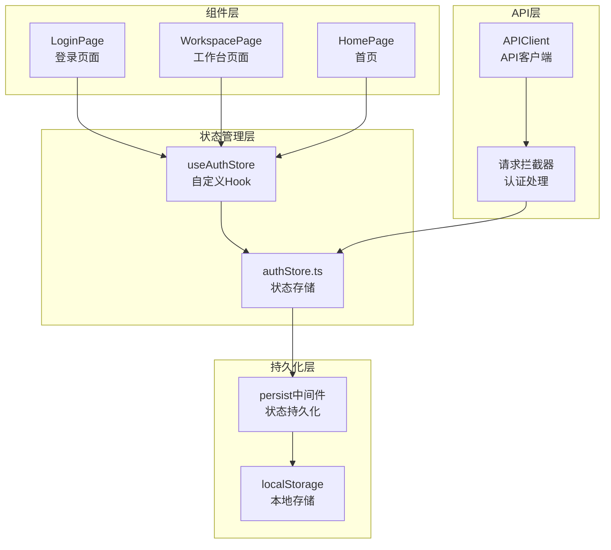
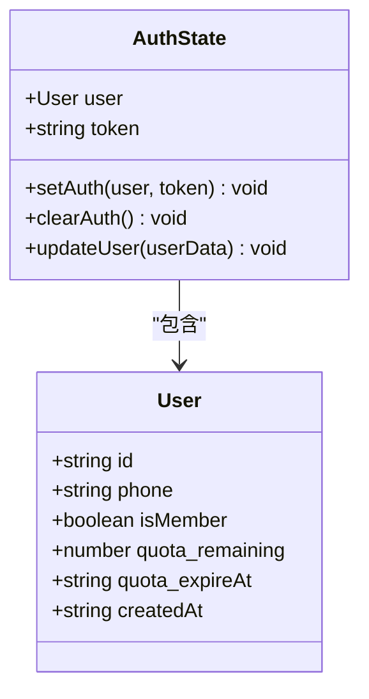
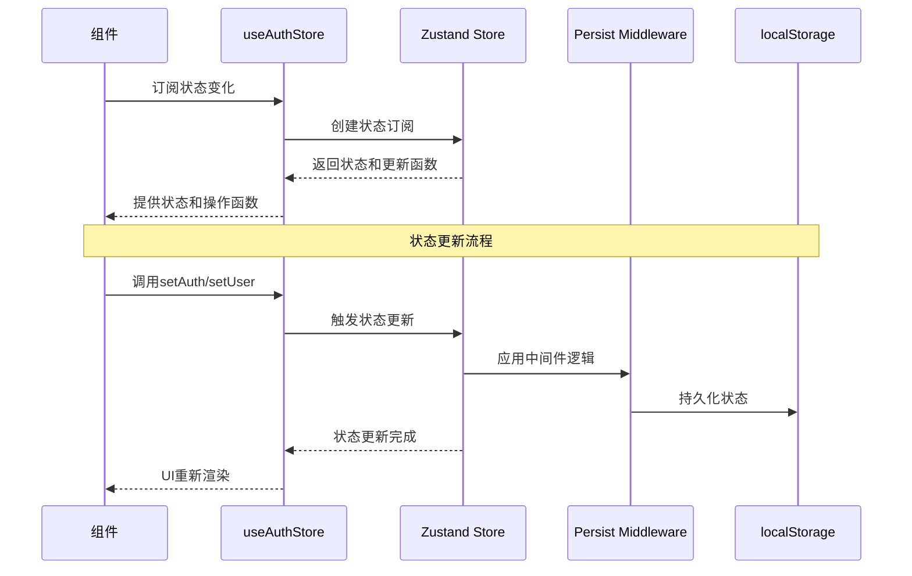
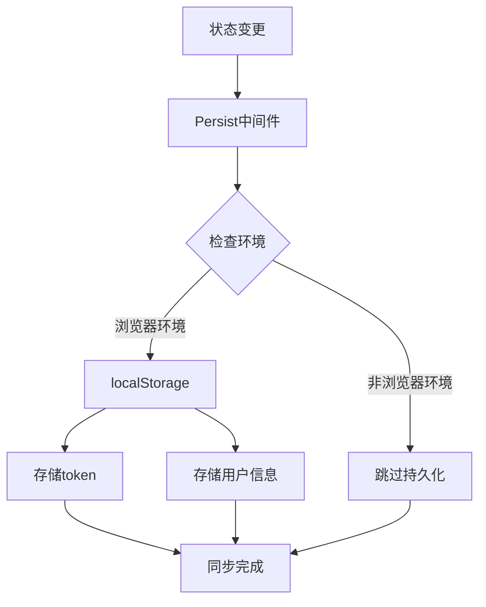
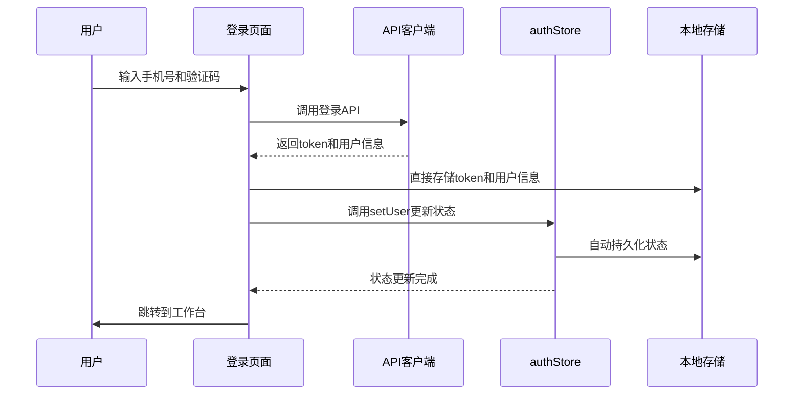
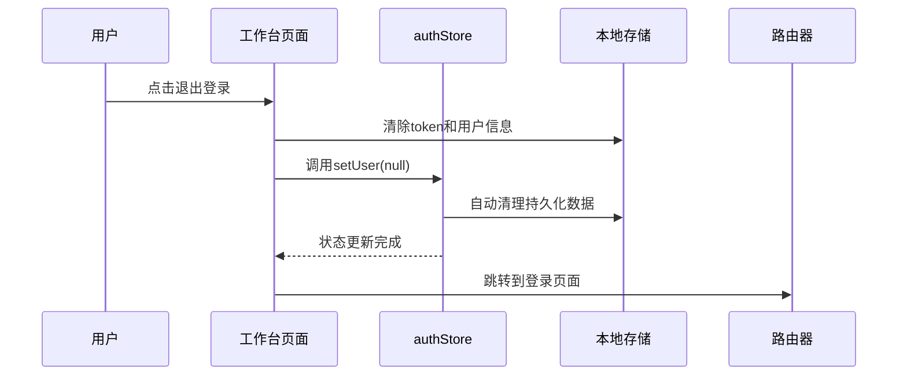
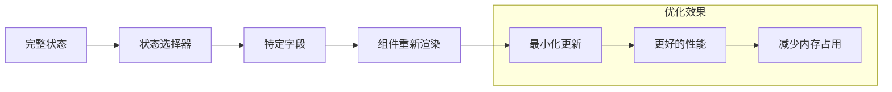

# Zustand状态管理方案详解：authStore.ts深度解析

<cite>
**本文档引用的文件**
- [authStore.ts](file://frontend/src/store/authStore.ts)
- [login/page.tsx](file://frontend/src/app/login/page.tsx)
- [workspace/page.tsx](file://frontend/src/app/workspace/page.tsx)
- [page.tsx](file://frontend/src/app/page.tsx)
- [api.ts](file://frontend/src/lib/api.ts)
- [index.ts](file://frontend/src/types/index.ts)
- [package.json](file://frontend/package.json)
</cite>

## 目录
1. [项目概述](#项目概述)
2. [Zustand架构设计](#zustand架构设计)
3. [authStore核心实现](#authstore核心实现)
4. [useAuthStore自定义Hook](#useauthstore自定义hook)
5. [状态持久化机制](#状态持久化机制)
6. [状态更新流程](#状态更新流程)
7. [实际应用场景](#实际应用场景)
8. [性能优化与最佳实践](#性能优化与最佳实践)
9. [常见问题与解决方案](#常见问题与解决方案)
10. [总结](#总结)

## 项目概述

本项目采用Next.js框架构建的前端应用，集成了Zustand作为状态管理解决方案。系统主要面向AI服装处理平台，提供用户认证、会员管理和任务处理等功能。状态管理的核心是`authStore.ts`文件，负责维护用户的认证状态和相关信息。

### 技术栈特点
- **React 18.2.0**: 现代React生态系统
- **Next.js 14.0.4**: 服务器端渲染框架
- **Zustand 4.4.7**: 轻量级状态管理库
- **TypeScript**: 类型安全开发

## Zustand架构设计

Zustand在本项目中采用了简洁而高效的状态管理模式，通过函数式编程思想实现状态的不可变更新。

**图表来源**
- [authStore.ts](file://frontend/src/store/authStore.ts#L1-L43)
- [login/page.tsx](file://frontend/src/app/login/page.tsx#L1-L210)
- [workspace/page.tsx](file://frontend/src/app/workspace/page.tsx#L1-L332)

## authStore核心实现

### 状态接口定义

authStore的核心是一个类型安全的状态接口，定义了用户认证所需的所有字段：

**图表来源**
- [authStore.ts](file://frontend/src/store/authStore.ts#L4-L10)
- [index.ts](file://frontend/src/types/index.ts#L1-L10)

### 状态初始化

状态初始化采用了惰性初始化模式，确保在浏览器环境下的安全性：

**章节来源**
- [authStore.ts](file://frontend/src/store/authStore.ts#L15-L43)

## useAuthStore自定义Hook

### Hook设计原理

useAuthStore是一个高度优化的自定义Hook，它封装了Zustand的核心功能，提供了类型安全的状态访问和更新能力。

**图表来源**
- [authStore.ts](file://frontend/src/store/authStore.ts#L15-L43)
- [login/page.tsx](file://frontend/src/app/login/page.tsx#L15-L16)

### 核心方法详解

#### setAuth方法
setAuth方法负责完整的用户认证状态设置，包括用户信息和认证令牌的同步更新。

**章节来源**
- [authStore.ts](file://frontend/src/store/authStore.ts#L17-L25)

#### clearAuth方法
clearAuth方法实现了完整的登出流程，清理所有认证相关状态。

**章节来源**
- [authStore.ts](file://frontend/src/store/authStore.ts#L27-L35)

#### updateUser方法
updateUser方法提供了细粒度的用户信息更新能力，支持部分字段的增量更新。

**章节来源**
- [authStore.ts](file://frontend/src/store/authStore.ts#L37-L42)

## 状态持久化机制

### Persist中间件配置

Zustand的persist中间件为状态管理提供了强大的持久化能力，本项目将其配置为"auth-storage"名称空间。

**图表来源**
- [authStore.ts](file://frontend/src/store/authStore.ts#L12-L14)

### 持久化策略

持久化机制采用了以下策略：
- **条件执行**: 仅在浏览器环境下执行localStorage操作
- **原子性更新**: 确保状态变更和持久化的原子性
- **类型安全**: 通过JSON序列化保持数据完整性

**章节来源**
- [authStore.ts](file://frontend/src/store/authStore.ts#L17-L35)

## 状态更新流程

### 登录流程状态流转

登录流程展示了完整的状态更新链路，从用户输入到状态持久化的全过程。

**图表来源**
- [login/page.tsx](file://frontend/src/app/login/page.tsx#L58-L87)
- [authStore.ts](file://frontend/src/store/authStore.ts#L17-L25)

### 登出流程状态流转

登出流程体现了状态清理的完整性和一致性保证。

**图表来源**
- [workspace/page.tsx](file://frontend/src/app/workspace/page.tsx#L115-L125)
- [authStore.ts](file://frontend/src/store/authStore.ts#L27-L35)

**章节来源**
- [workspace/page.tsx](file://frontend/src/app/workspace/page.tsx#L115-L125)

## 实际应用场景

### 首页路由控制

首页作为应用的入口点，通过useAuthStore的状态监听实现智能路由跳转。

**章节来源**
- [page.tsx](file://frontend/src/app/page.tsx#L6-L20)

### 工作台权限验证

工作台页面展示了复杂的状态依赖和条件渲染逻辑。

**章节来源**
- [workspace/page.tsx](file://frontend/src/app/workspace/page.tsx#L55-L65)

### 会员状态同步

会员状态的获取和用户信息的同步展示了状态更新的最佳实践。

**章节来源**
- [workspace/page.tsx](file://frontend/src/app/workspace/page.tsx#L44-L60)

## 性能优化与最佳实践

### 选择器优化

useAuthStore支持选择器模式，只订阅需要的状态字段，避免不必要的重新渲染。

### 订阅策略

推荐的订阅策略包括：
- **精确选择**: 只订阅必要的状态字段
- **组合订阅**: 对于复杂状态，使用组合选择器
- **防抖处理**: 对频繁的状态更新进行防抖处理

### 内存管理

- **及时清理**: 在组件卸载时清理状态订阅
- **弱引用**: 避免循环引用导致的内存泄漏
- **状态重置**: 提供状态重置机制

## 常见问题与解决方案

### 状态更新不同步

**问题描述**: 组件状态与实际状态不一致

**解决方案**:
1. 使用正确的状态选择器
2. 确保状态更新的原子性
3. 检查副作用函数的正确性

**章节来源**
- [login/page.tsx](file://frontend/src/app/login/page.tsx#L70-L75)

### 持久化失效

**问题描述**: 状态无法持久化或恢复

**解决方案**:
1. 检查浏览器环境判断
2. 验证localStorage的可用性
3. 确保数据序列化的正确性

### 类型安全问题

**问题描述**: TypeScript类型检查失败

**解决方案**:
1. 正确定义状态接口
2. 使用类型断言时要谨慎
3. 定期更新类型定义

### 性能问题

**问题描述**: 组件过度渲染

**解决方案**:
1. 使用React.memo包装组件
2. 优化状态选择器
3. 减少不必要的状态订阅

## 总结

本项目通过Zustand实现了一个高效、类型安全的状态管理系统。authStore的设计体现了现代前端状态管理的最佳实践：

### 核心优势
- **类型安全**: 完整的TypeScript类型定义
- **性能优化**: 原子性状态更新和选择器优化
- **持久化支持**: 自动化的本地存储集成
- **易于测试**: 函数式设计便于单元测试

### 设计亮点
- **单一职责**: 每个方法都有明确的职责边界
- **可扩展性**: 支持中间件扩展和功能增强
- **开发者友好**: 清晰的API设计和错误处理

### 最佳实践总结
1. **合理使用选择器**: 只订阅需要的状态字段
2. **保持状态原子性**: 确保状态更新的完整性
3. **完善的错误处理**: 提供清晰的错误信息和恢复机制
4. **持续的性能监控**: 关注状态更新对性能的影响

通过深入理解authStore的设计原理和实现细节，开发者可以更好地利用Zustand构建可维护、高性能的前端应用状态管理系统。