# 路由系统

<cite>
**本文档引用的文件**
- [layout.tsx](file://frontend/src/app/layout.tsx)
- [page.tsx](file://frontend/src/app/page.tsx)
- [login/page.tsx](file://frontend/src/app/login/page.tsx)
- [workspace/page.tsx](file://frontend/src/app/workspace/page.tsx)
- [membership/page.tsx](file://frontend/src/app/membership/page.tsx)
- [task/basic/page.tsx](file://frontend/src/app/task/basic/page.tsx)
- [task/[taskId]/page.tsx](file://frontend/src/app/task/[taskId]/page.tsx)
- [task/history/page.tsx](file://frontend/src/app/task/history/page.tsx)
- [task/model/page.tsx](file://frontend/src/app/task/model/page.tsx)
- [globals.css](file://frontend/src/app/globals.css)
- [api.ts](file://frontend/src/lib/api.ts)
- [authStore.ts](file://frontend/src/store/authStore.ts)
- [index.ts](file://frontend/src/types/index.ts)
- [next.config.js](file://frontend/next.config.js)
- [package.json](file://frontend/package.json)
</cite>

## 目录
1. [项目概述](#项目概述)
2. [路由架构设计](#路由架构设计)
3. [核心页面组件分析](#核心页面组件分析)
4. [动态路由机制](#动态路由机制)
5. [全局布局系统](#全局布局系统)
6. [路由导航与状态管理](#路由导航与状态管理)
7. [新增页面开发指南](#新增页面开发指南)
8. [性能优化策略](#性能优化策略)
9. [总结](#总结)

## 项目概述

本项目是一个基于Next.js 14.0.4的现代化前端应用，采用App Router架构设计，提供了完整的AI服装处理服务平台。系统包含用户认证、会员管理、任务处理等功能模块，通过精心设计的路由架构实现了良好的用户体验和代码组织。

### 技术栈特点
- **Next.js 14.0.4**: 最新版本的Next.js框架，支持App Router
- **TypeScript**: 提供类型安全和更好的开发体验
- **Ant Design**: 企业级UI组件库，提供丰富的交互组件
- **Zustand**: 轻量级状态管理库
- **Axios**: HTTP客户端，用于API请求管理

## 路由架构设计

### 整体路由结构

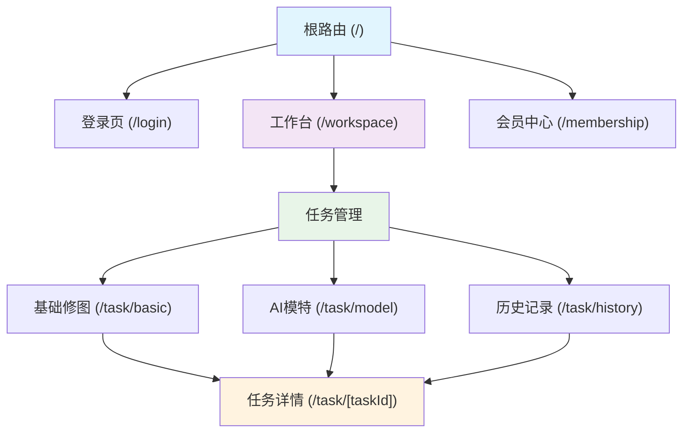

**图表来源**
- [layout.tsx](file://frontend/src/app/layout.tsx#L1-L26)
- [page.tsx](file://frontend/src/app/page.tsx#L1-L32)

### 路由层级关系

系统采用扁平化的路由结构，所有页面都直接位于`app`目录下：

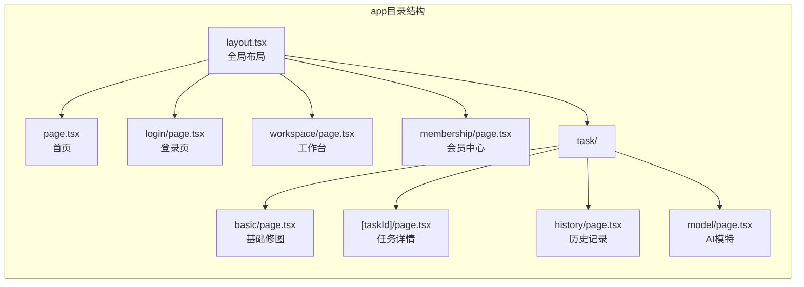

**节来源**
- [layout.tsx](file://frontend/src/app/layout.tsx#L1-L26)
- [login/page.tsx](file://frontend/src/app/login/page.tsx#L1-L210)
- [workspace/page.tsx](file://frontend/src/app/workspace/page.tsx#L1-L332)

## 核心页面组件分析

### 首页路由 (Home Page)

首页作为应用的入口点，实现了智能路由跳转逻辑：

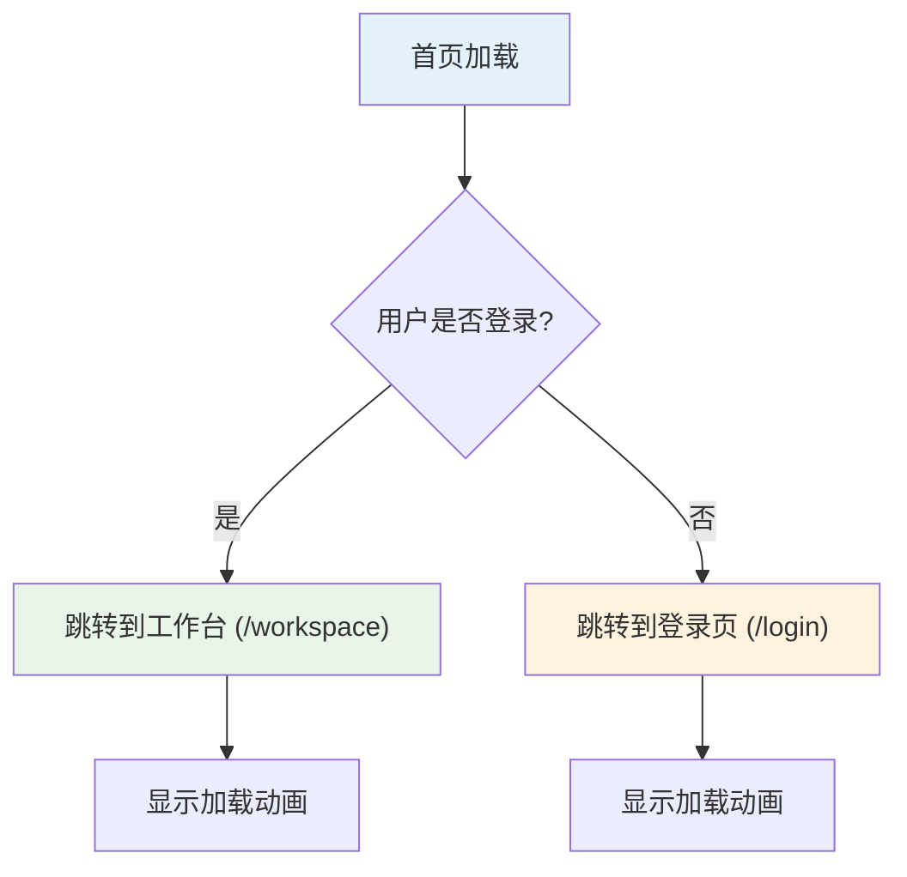

**图表来源**
- [page.tsx](file://frontend/src/app/page.tsx#L8-L20)

### 登录页面 (Login Page)

登录页面实现了手机号验证码登录功能，包含完整的用户认证流程：

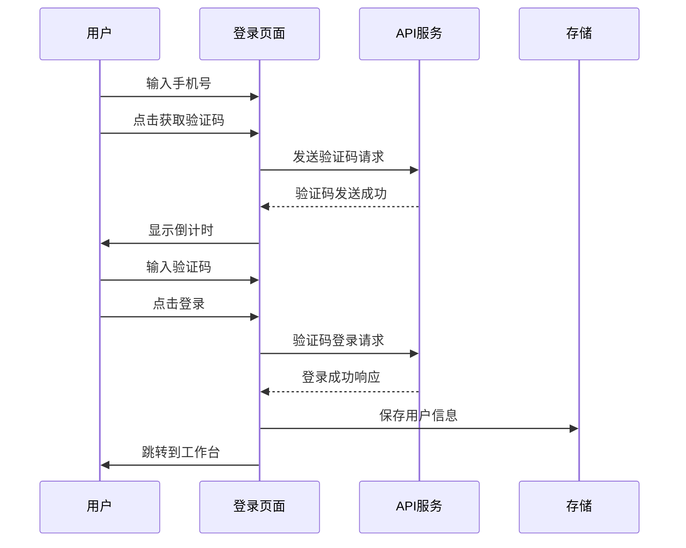

**图表来源**
- [login/page.tsx](file://frontend/src/app/login/page.tsx#L35-L85)

### 工作台页面 (Workspace Page)

工作台是用户的主要操作界面，集成了会员状态管理和功能入口：

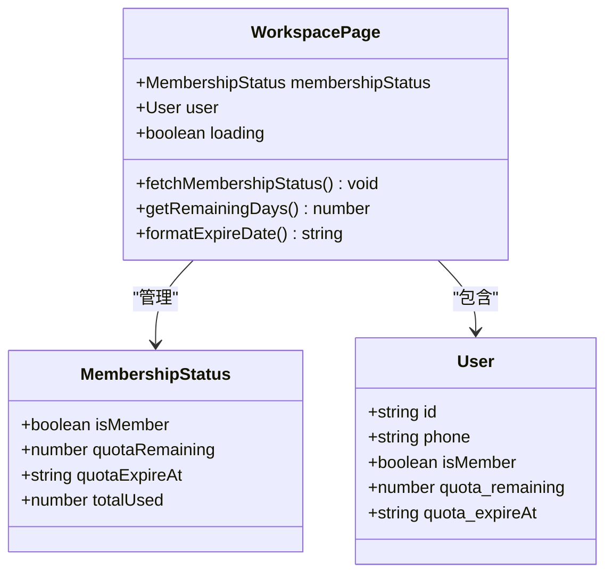

**图表来源**
- [workspace/page.tsx](file://frontend/src/app/workspace/page.tsx#L25-L50)
- [index.ts](file://frontend/src/types/index.ts#L1-L20)

### 会员中心页面 (Membership Page)

会员中心提供了完整的订阅购买流程，支持微信和支付宝支付：

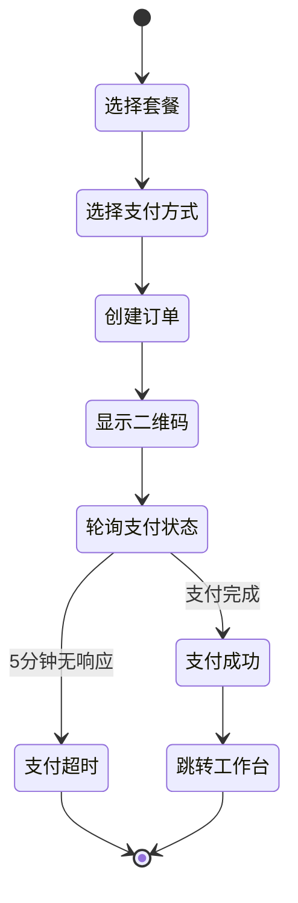

**图表来源**
- [membership/page.tsx](file://frontend/src/app/membership/page.tsx#L60-L120)

## 动态路由机制

### 动态路由实现 ([taskId])

动态路由是系统的核心功能之一，用于处理任务详情页面：

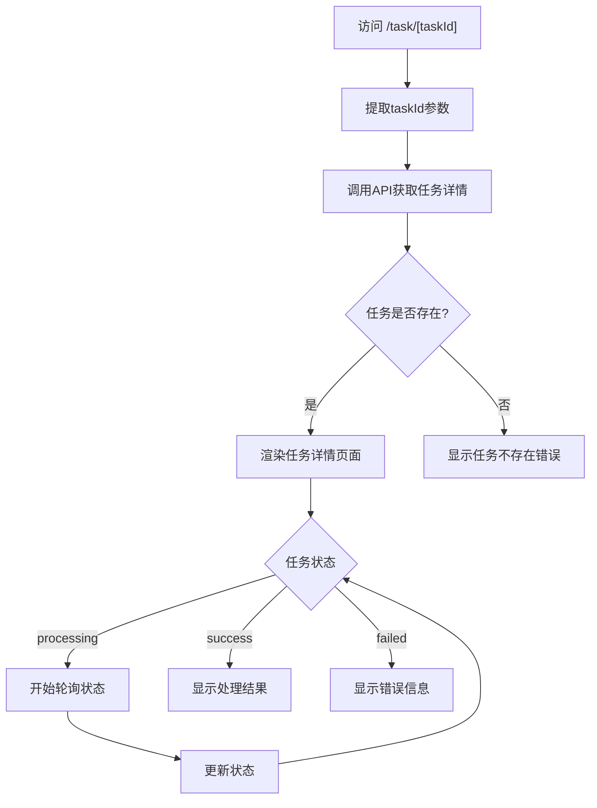

**图表来源**
- [task/[taskId]/page.tsx](file://frontend/src/app/task/[taskId]/page.tsx#L40-L80)

### 动态路由参数处理

动态路由参数通过`useParams`钩子获取：

```typescript
// 参数获取示例
const params = useParams();
const taskId = params?.taskId as string;
```

### 任务状态查看的应用

动态路由在任务状态查看中的应用场景：

1. **实时状态监控**: 通过轮询机制实时更新任务状态
2. **结果展示**: 展示处理完成后的图片结果
3. **错误处理**: 显示处理失败的原因和解决方案
4. **下载功能**: 提供结果图片的下载功能

**节来源**
- [task/[taskId]/page.tsx](file://frontend/src/app/task/[taskId]/page.tsx#L1-L364)

## 全局布局系统

### Layout组件设计

全局Layout组件负责整个应用的基础布局和样式：

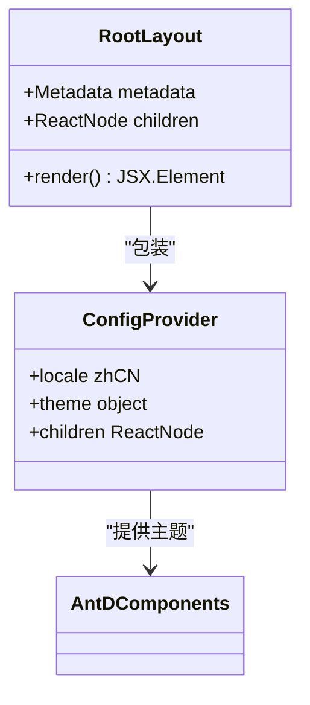

**图表来源**
- [layout.tsx](file://frontend/src/app/layout.tsx#L10-L25)

### 嵌套路由实现

Next.js App Router通过嵌套路由实现一致的UI体验：

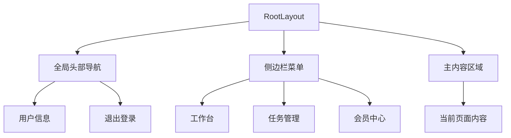

**节来源**
- [layout.tsx](file://frontend/src/app/layout.tsx#L1-L26)
- [globals.css](file://frontend/src/app/globals.css#L1-L14)

## 路由导航与状态管理

### 导航机制

系统使用Next.js提供的`useRouter`钩子进行页面导航：

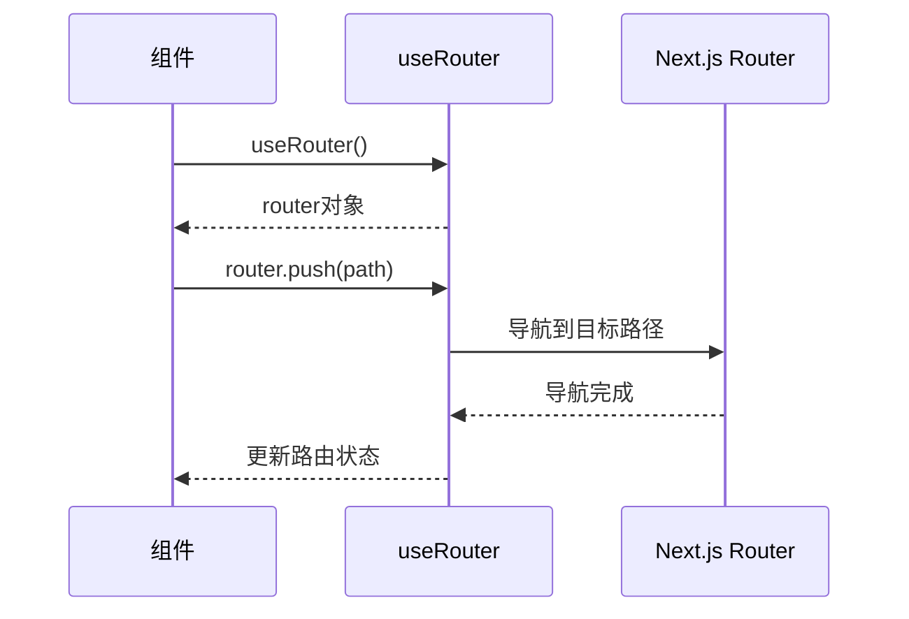

**图表来源**
- [workspace/page.tsx](file://frontend/src/app/workspace/page.tsx#L150-L160)
- [login/page.tsx](file://frontend/src/app/login/page.tsx#L85-L95)

### 状态管理架构

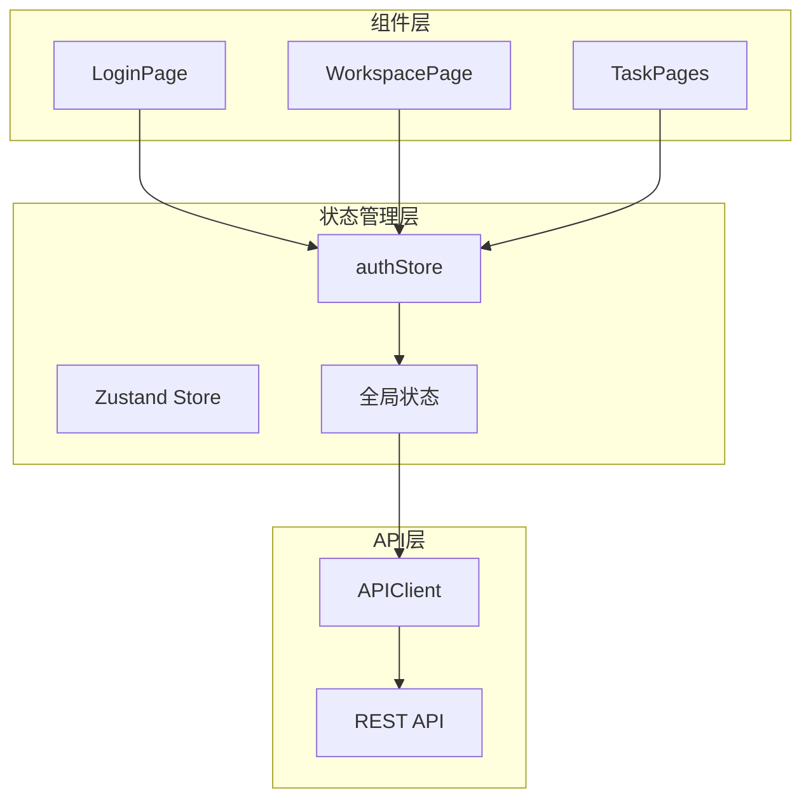

**图表来源**
- [authStore.ts](file://frontend/src/store/authStore.ts#L1-L43)
- [api.ts](file://frontend/src/lib/api.ts#L1-L118)

### 页面组件与路由参数交互

页面组件通过多种方式与路由参数交互：

1. **静态路由**: 直接导入和渲染
2. **动态路由**: 使用`useParams`获取参数
3. **查询参数**: 通过`useSearchParams`处理
4. **路由事件**: 监听路由变化

**节来源**
- [task/[taskId]/page.tsx](file://frontend/src/app/task/[taskId]/page.tsx#L45-L55)
- [task/history/page.tsx](file://frontend/src/app/task/history/page.tsx#L20-L40)

## 新增页面开发指南

### 标准开发流程

基于项目的工作流程规范，新增页面需要遵循以下步骤：

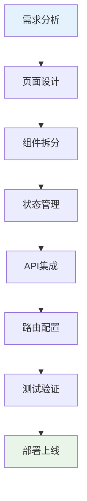

### 页面开发模板

以下是新增页面的标准结构：

```typescript
// 新页面模板结构
export default function NewPage() {
  // 路由参数处理
  const params = useParams();
  const router = useRouter();
  
  // 状态管理
  const [loading, setLoading] = useState(false);
  const [data, setData] = useState(null);
  
  // 数据获取
  const fetchData = async () => {
    try {
      setLoading(true);
      const response = await api.newEndpoint.get(params.id);
      setData(response.data);
    } catch (error) {
      message.error('数据加载失败');
    } finally {
      setLoading(false);
    }
  };
  
  // 生命周期
  useEffect(() => {
    if (params.id) {
      fetchData();
    }
  }, [params.id]);
  
  return (
    <div>
      {/* 页面内容 */}
    </div>
  );
}
```

### 路由配置规范

新增页面需要在以下位置进行配置：

1. **路由文件**: 在`app`目录下创建对应路径
2. **权限控制**: 在`authStore`中添加相关逻辑
3. **API接口**: 在`api.ts`中添加对应的API方法
4. **类型定义**: 在`types/index.ts`中添加接口定义

### 最佳实践

1. **组件拆分**: 遵循单一职责原则
2. **状态管理**: 合理使用局部状态和全局状态
3. **错误处理**: 提供友好的错误提示
4. **加载状态**: 显示适当的加载指示器
5. **SEO优化**: 添加适当的元数据

**节来源**
- [FLOW.md](file://skills/frontend_dev_skill/FLOW.md#L1-L28)

## 性能优化策略

### 路由级别的优化

1. **代码分割**: 利用Next.js的自动代码分割
2. **懒加载**: 对非关键页面使用懒加载
3. **预取**: 使用`next/link`的预取功能
4. **缓存策略**: 合理设置缓存头

### 组件级别的优化

1. **React.memo**: 对纯组件使用记忆化
2. **useCallback**: 缓存回调函数
3. **useMemo**: 缓存计算结果
4. **虚拟滚动**: 对大量数据使用虚拟滚动

### API调用优化

1. **请求合并**: 合并多个API请求
2. **轮询优化**: 实现智能轮询机制
3. **错误重试**: 添加指数退避重试
4. **缓存策略**: 实现客户端缓存

**节来源**
- [api.ts](file://frontend/src/lib/api.ts#L20-L50)
- [task/[taskId]/page.tsx](file://frontend/src/app/task/[taskId]/page.tsx#L80-L120)

## 总结

本项目展示了基于Next.js App Router的现代前端路由架构的最佳实践。通过精心设计的路由结构、完善的动态路由机制、统一的全局布局系统和高效的状态管理，构建了一个功能完整、用户体验优秀的AI服务平台。

### 架构优势

1. **清晰的路由结构**: 扁平化的设计便于维护和扩展
2. **强大的动态路由**: 支持复杂的参数化页面
3. **统一的布局系统**: 确保一致的用户体验
4. **完善的类型系统**: 提供类型安全保障
5. **高效的性能优化**: 通过多种策略提升应用性能

### 技术亮点

- **TypeScript集成**: 提供完整的类型定义
- **状态管理**: 使用Zustand实现轻量级状态管理
- **API封装**: 统一的HTTP客户端设计
- **错误处理**: 完善的错误边界和用户提示
- **路由导航**: 基于Next.js的现代化路由系统

这套路由架构不仅满足了当前的功能需求，还为未来的功能扩展奠定了坚实的基础，是现代Web应用开发的优秀范例。