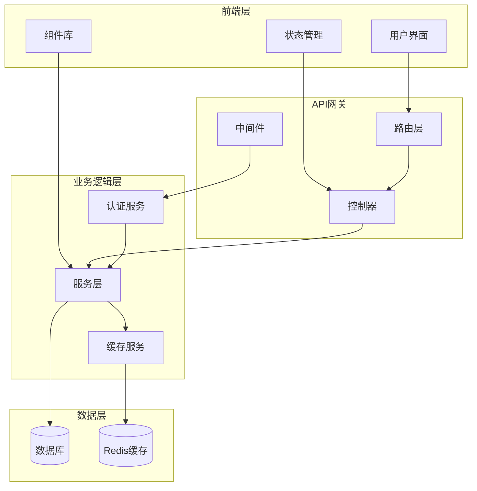
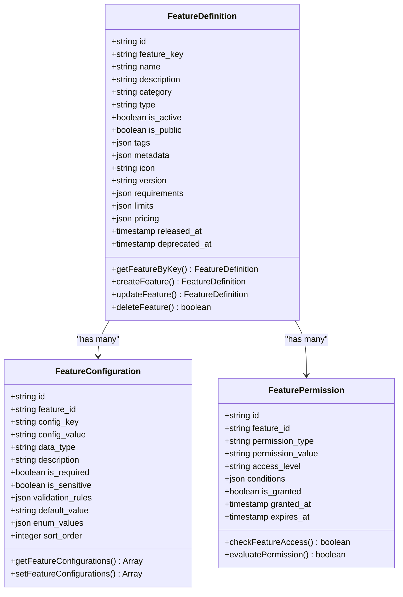
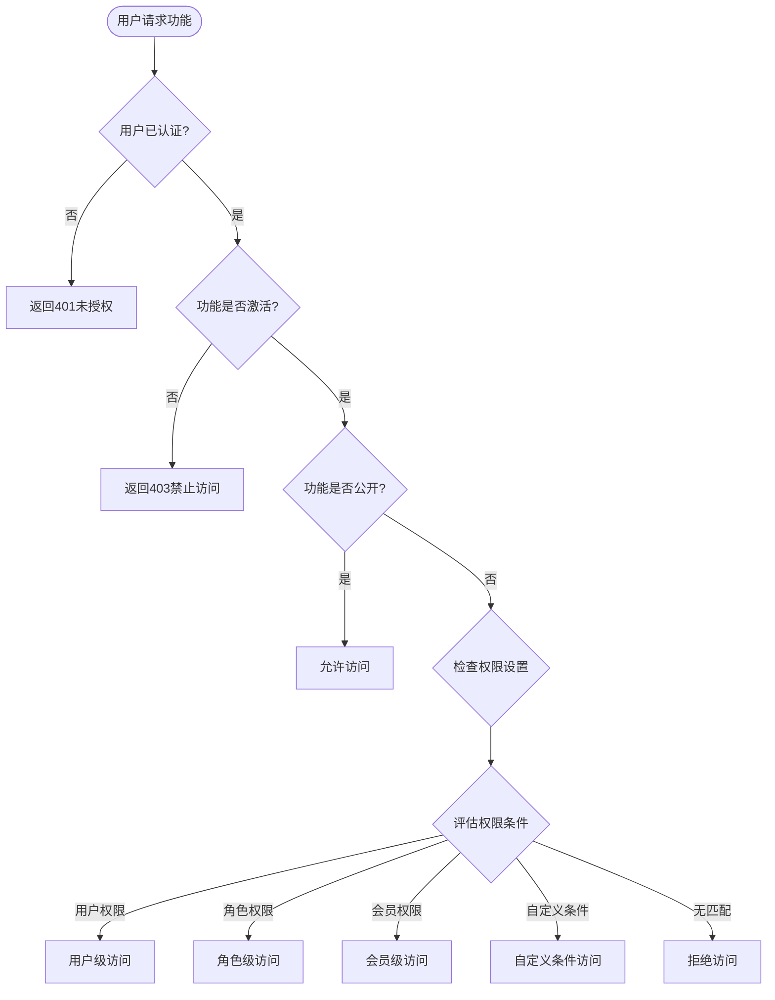
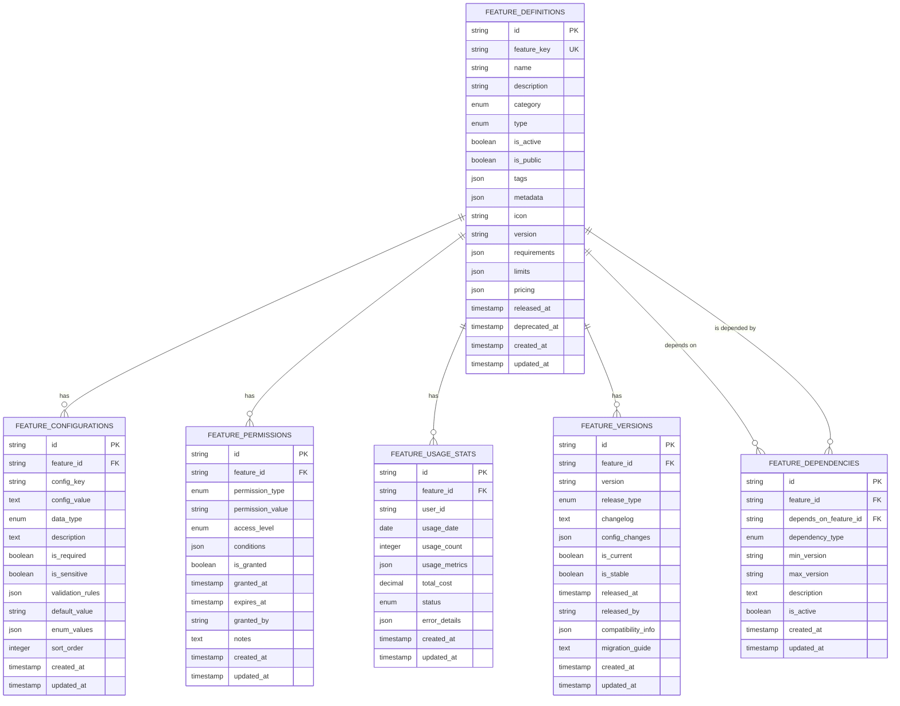
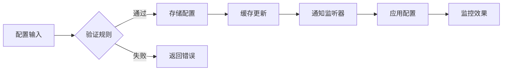
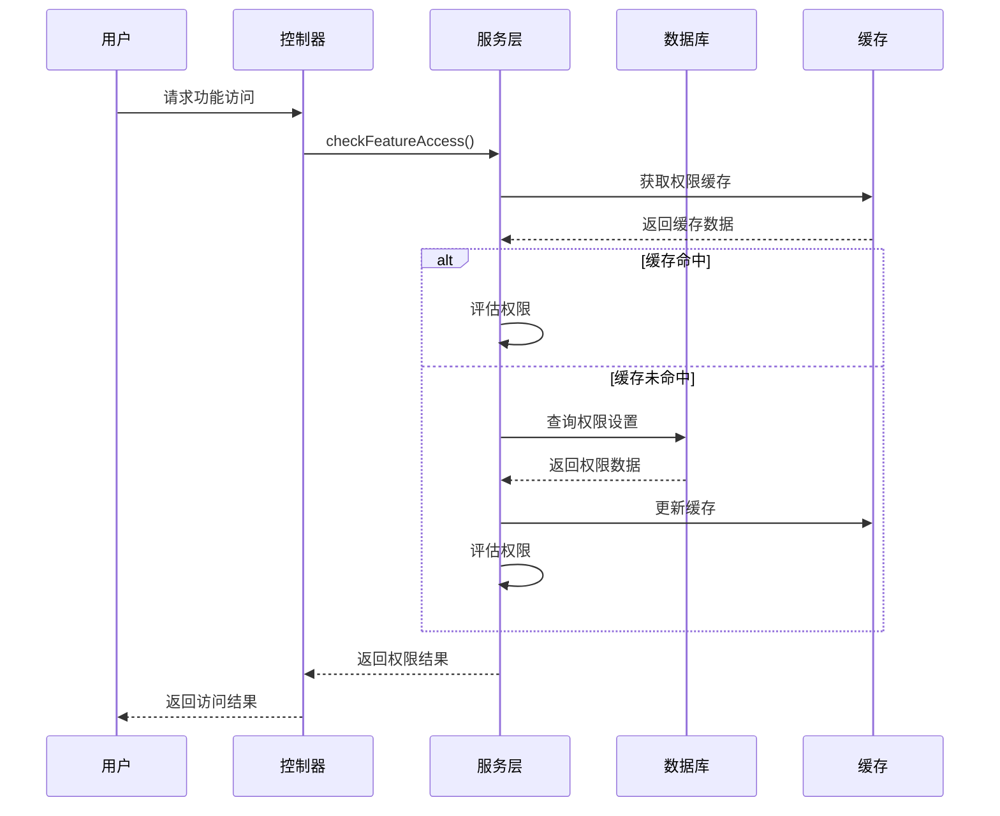
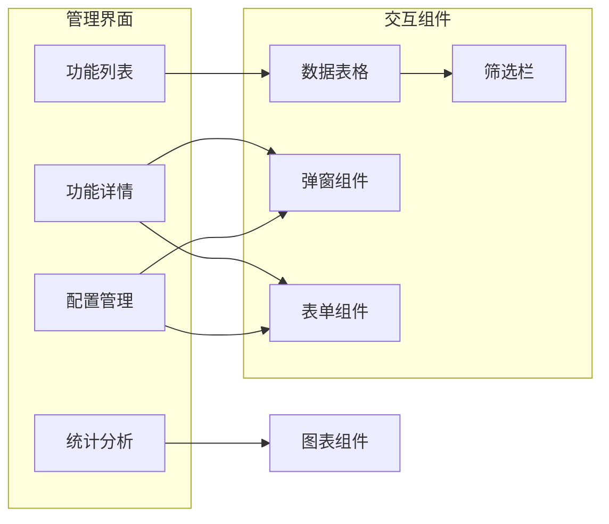
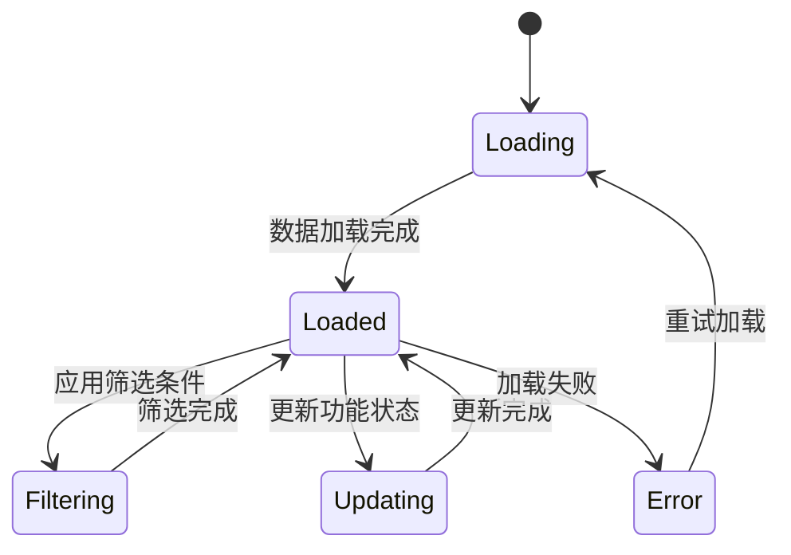
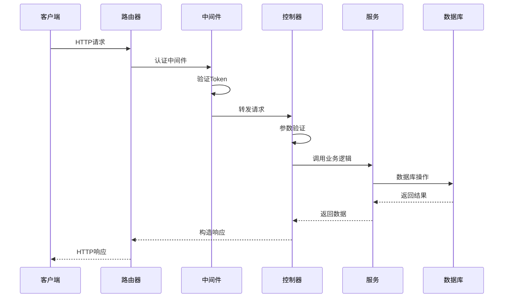
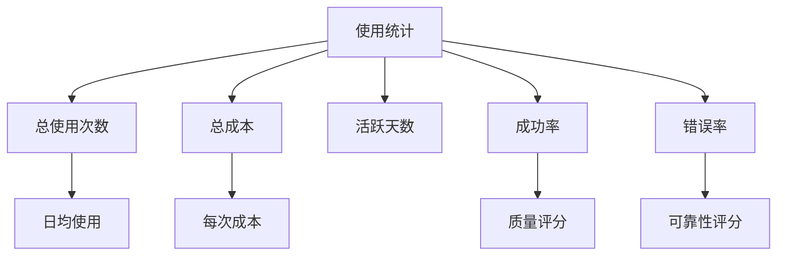

# 功能目录管理系统

<cite>
**本文档中引用的文件**
- [feature-catalog.controller.js](file://backend/src/controllers/feature-catalog.controller.js)
- [feature-catalog.service.js](file://backend/src/services/feature-catalog.service.js)
- [feature-catalog.routes.js](file://backend/src/routes/feature-catalog.routes.js)
- [create_feature_catalog.js](file://backend/src/db/migrations/20250102000007_create_feature_catalog.js)
- [auth.middleware.js](file://backend/src/middlewares/auth.middleware.js)
- [page.tsx](file://frontend/src/app/admin/features/page.tsx)
- [FeatureGrid.tsx](file://frontend/src/features/workbench/ui/FeatureGrid.tsx)
- [featureStore.ts](file://frontend/src/store/featureStore.ts)
- [README.md](file://README.md)
</cite>

## 目录
1. [简介](#简介)
2. [系统架构](#系统架构)
3. [核心组件](#核心组件)
4. [数据库设计](#数据库设计)
5. [功能特性](#功能特性)
6. [权限管理](#权限管理)
7. [前端实现](#前端实现)
8. [API接口](#api接口)
9. [使用统计](#使用统计)
10. [最佳实践](#最佳实践)

## 简介

功能目录管理系统是一个完整的功能特性管理解决方案，用于管理应用程序中的所有功能特性。该系统提供了功能定义、配置管理、权限控制、使用统计等功能，支持动态配置和实时监控。

### 主要目标

- **功能生命周期管理**：从创建到废弃的完整功能管理
- **灵活配置系统**：支持动态功能配置和参数管理
- **细粒度权限控制**：基于角色、用户、会员等级的访问控制
- **使用监控分析**：实时统计和分析功能使用情况
- **版本化管理**：支持功能版本控制和依赖管理

## 系统架构

**图表来源**
- [feature-catalog.routes.js](file://backend/src/routes/feature-catalog.routes.js#L1-L50)
- [feature-catalog.controller.js](file://backend/src/controllers/feature-catalog.controller.js#L1-L50)
- [feature-catalog.service.js](file://backend/src/services/feature-catalog.service.js#L1-L50)

## 核心组件

### 功能定义模块

功能定义模块负责管理应用中的所有功能特性，包括基本属性、分类、类型等元数据。

**图表来源**
- [feature-catalog.service.js](file://backend/src/services/feature-catalog.service.js#L15-L100)
- [create_feature_catalog.js](file://backend/src/db/migrations/20250102000007_create_feature_catalog.js#L10-L50)

### 权限控制系统

权限控制系统提供细粒度的功能访问控制，支持多种权限类型和条件判断。

**图表来源**
- [feature-catalog.service.js](file://backend/src/services/feature-catalog.service.js#L507-L553)
- [auth.middleware.js](file://backend/src/middlewares/auth.middleware.js#L1-L50)

**章节来源**
- [feature-catalog.service.js](file://backend/src/services/feature-catalog.service.js#L1-L740)
- [feature-catalog.controller.js](file://backend/src/controllers/feature-catalog.controller.js#L1-L489)

## 数据库设计

功能目录系统的数据库设计采用关系型数据库模式，支持复杂的功能管理和关联查询。

### 核心表结构

| 表名 | 用途 | 主要字段 |
|------|------|----------|
| feature_definitions | 功能定义表 | feature_key, name, category, type, is_active, is_public |
| feature_configurations | 功能配置表 | feature_id, config_key, config_value, data_type |
| feature_permissions | 功能权限表 | feature_id, permission_type, permission_value, access_level |
| feature_usage_stats | 功能使用统计表 | feature_id, user_id, usage_date, usage_count, total_cost |
| feature_versions | 功能版本表 | feature_id, version, release_type, changelog |
| feature_dependencies | 功能依赖表 | feature_id, depends_on_feature_id, dependency_type |

### 数据库关系图

**图表来源**
- [create_feature_catalog.js](file://backend/src/db/migrations/20250102000007_create_feature_catalog.js#L10-L187)

**章节来源**
- [create_feature_catalog.js](file://backend/src/db/migrations/20250102000007_create_feature_catalog.js#L1-L188)

## 功能特性

### 功能分类体系

系统支持十大功能分类，涵盖应用的核心业务领域：

| 分类 | 描述 | 示例功能 |
|------|------|----------|
| image_processing | 图片处理 | 智能抠图、滤镜效果、尺寸调整 |
| ai_generation | AI生成 | 文本生成、图像生成、音频生成 |
| video_processing | 视频处理 | 视频编辑、转码、压缩 |
| audio_processing | 音频处理 | 音频编辑、降噪、格式转换 |
| text_processing | 文本处理 | 文本分析、翻译、摘要生成 |
| data_analysis | 数据分析 | 数据可视化、统计分析 |
| file_management | 文件管理 | 文件上传、存储、格式转换 |
| user_management | 用户管理 | 用户认证、权限管理 |
| payment | 支付功能 | 支付处理、订单管理 |
| integration | 集成功能 | 第三方服务集成、API对接 |

### 功能配置系统

功能配置系统提供灵活的参数管理机制，支持多种数据类型和验证规则。

**图表来源**
- [feature-catalog.service.js](file://backend/src/services/feature-catalog.service.js#L385-L421)

### 版本管理

功能版本管理系统支持语义化版本控制，提供版本发布、回滚和兼容性管理。

**章节来源**
- [feature-catalog.controller.js](file://backend/src/controllers/feature-catalog.controller.js#L469-L488)

## 权限管理

### 权限类型

系统支持四种权限类型，满足不同的访问控制需求：

| 权限类型 | 描述 | 使用场景 |
|----------|------|----------|
| user | 用户级权限 | 基于具体用户ID的访问控制 |
| role | 角色级权限 | 基于用户角色的批量权限管理 |
| membership | 会员级权限 | 基于会员等级的功能访问 |
| custom | 自定义权限 | 基于复杂条件的权限判断 |

### 权限评估流程

**图表来源**
- [feature-catalog.service.js](file://backend/src/services/feature-catalog.service.js#L467-L506)

**章节来源**
- [feature-catalog.service.js](file://backend/src/services/feature-catalog.service.js#L507-L596)

## 前端实现

### 管理界面

前端采用现代化的React + Next.js架构，提供直观的功能管理界面。

**图表来源**
- [page.tsx](file://frontend/src/app/admin/features/page.tsx#L1-L50)
- [FeatureGrid.tsx](file://frontend/src/features/workbench/ui/FeatureGrid.tsx#L1-L50)

### 状态管理

前端使用Zustand进行状态管理，实现功能数据的集中控制和响应式更新。

**图表来源**
- [featureStore.ts](file://frontend/src/store/featureStore.ts#L1-L50)

**章节来源**
- [page.tsx](file://frontend/src/app/admin/features/page.tsx#L1-L294)
- [FeatureGrid.tsx](file://frontend/src/features/workbench/ui/FeatureGrid.tsx#L1-L181)
- [featureStore.ts](file://frontend/src/store/featureStore.ts#L1-L92)

## API接口

### 核心API端点

| 方法 | 端点 | 描述 | 权限要求 |
|------|------|------|----------|
| GET | /api/features | 获取功能列表 | 无 |
| GET | /api/features/categories | 获取功能分类 | 无 |
| GET | /api/features/:featureKey | 获取功能详情 | 需认证 |
| POST | /api/features/:featureKey/access | 检查访问权限 | 需认证 |
| POST | /api/features/:featureKey/usage | 记录功能使用 | 需认证 |
| POST | /api/admin/features | 创建功能 | 管理员 |
| PUT | /api/admin/features/:featureKey | 更新功能 | 管理员 |
| DELETE | /api/admin/features/:featureKey | 删除功能 | 管理员 |
| POST | /api/admin/features/:featureKey/configurations | 设置配置 | 管理员 |
| GET | /api/admin/features/stats | 获取使用统计 | 管理员 |

### API请求流程

**图表来源**
- [feature-catalog.routes.js](file://backend/src/routes/feature-catalog.routes.js#L1-L100)
- [feature-catalog.controller.js](file://backend/src/controllers/feature-catalog.controller.js#L1-L100)

**章节来源**
- [feature-catalog.routes.js](file://backend/src/routes/feature-catalog.routes.js#L1-L958)
- [feature-catalog.controller.js](file://backend/src/controllers/feature-catalog.controller.js#L1-L489)

## 使用统计

### 统计维度

系统提供多维度的功能使用统计分析：

| 统计维度 | 描述 | 应用场景 |
|----------|------|----------|
| 功能维度 | 按功能统计使用情况 | 功能热度分析 |
| 用户维度 | 按用户统计使用情况 | 用户行为分析 |
| 时间维度 | 按时间统计使用趋势 | 业务增长分析 |
| 成本维度 | 按成本统计使用效率 | 成本控制分析 |

### 统计指标

**图表来源**
- [feature-catalog.service.js](file://backend/src/services/feature-catalog.service.js#L631-L674)

**章节来源**
- [feature-catalog.service.js](file://backend/src/services/feature-catalog.service.js#L595-L715)

## 最佳实践

### 功能开发最佳实践

1. **功能命名规范**
   - 使用小写字母和下划线
   - 保持名称简洁明确
   - 避免使用特殊字符

2. **配置管理原则**
   - 使用环境变量管理敏感配置
   - 提供合理的默认值
   - 实现配置的版本化管理

3. **权限设计原则**
   - 最小权限原则
   - 基于角色的访问控制
   - 定期审查权限设置

4. **性能优化建议**
   - 合理使用缓存机制
   - 实现数据库索引优化
   - 控制API响应数据大小

### 运维管理建议

1. **监控告警**
   - 设置功能使用异常告警
   - 监控权限访问异常
   - 跟踪配置变更历史

2. **备份恢复**
   - 定期备份功能配置
   - 测试配置恢复流程
   - 维护配置变更日志

3. **安全防护**
   - 实施API访问频率限制
   - 加强敏感配置保护
   - 定期进行安全审计

**章节来源**
- [README.md](file://README.md#L1-L335)