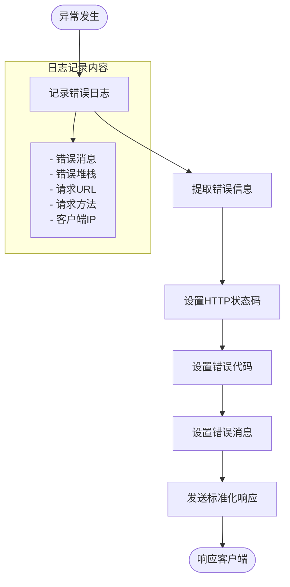

# 中间件系统

<cite>
**本文档引用的文件**
- [auth.middleware.js](file://backend/src/middlewares/auth.middleware.js)
- [errorHandler.middleware.js](file://backend/src/middlewares/errorHandler.middleware.js)
- [app.js](file://backend/src/app.js)
- [server.js](file://backend/src/server.js)
- [auth.routes.js](file://backend/src/routes/auth.routes.js)
- [membership.routes.js](file://backend/src/routes/membership.routes.js)
- [task.routes.js](file://backend/src/routes/task.routes.js)
- [admin.routes.js](file://backend/src/routes/admin.routes.js)
- [auth.controller.js](file://backend/src/controllers/auth.controller.js)
- [logger.js](file://backend/src/utils/logger.js)
</cite>

## 目录
1. [简介](#简介)
2. [项目结构](#项目结构)
3. [核心组件](#核心组件)
4. [架构概览](#架构概览)
5. [详细组件分析](#详细组件分析)
6. [依赖关系分析](#依赖关系分析)
7. [性能考虑](#性能考虑)
8. [故障排除指南](#故障排除指南)
9. [结论](#结论)

## 简介

中间件系统是现代Web应用程序的核心基础设施，负责在请求处理流程中执行各种横切关注点。本文档深入分析了基于Express框架构建的中间件系统，重点介绍了认证中间件和错误处理中间件的设计理念、实现逻辑以及最佳实践。

该系统采用模块化设计，通过分离关注点实现了高度的可维护性和可扩展性。认证中间件提供了严格的JWT令牌验证机制，而错误处理中间件则确保了统一的异常处理和日志记录策略。

## 项目结构

中间件系统位于`backend/src/middlewares/`目录下，包含两个核心中间件文件：

**图表来源**
- [app.js](file://backend/src/app.js#L1-L52)
- [auth.middleware.js](file://backend/src/middlewares/auth.middleware.js#L1-L77)
- [errorHandler.middleware.js](file://backend/src/middlewares/errorHandler.middleware.js#L1-L46)

**章节来源**
- [app.js](file://backend/src/app.js#L1-L52)
- [auth.middleware.js](file://backend/src/middlewares/auth.middleware.js#L1-L77)
- [errorHandler.middleware.js](file://backend/src/middlewares/errorHandler.middleware.js#L1-L46)

## 核心组件

### 认证中间件 (auth.middleware.js)

认证中间件是系统安全的核心组件，负责JWT令牌的验证和用户身份的加载。它提供了两种认证模式：

1. **严格认证** (`authenticate`)：要求所有请求都必须提供有效的JWT令牌
2. **可选认证** (`optionalAuthenticate`)：允许未登录用户访问，但会尝试解析有效令牌

### 错误处理中间件 (errorHandler.middleware.js)

错误处理中间件负责捕获和标准化应用程序中的所有异常，提供一致的错误响应格式，并记录详细的错误信息。

**章节来源**
- [auth.middleware.js](file://backend/src/middlewares/auth.middleware.js#L1-L77)
- [errorHandler.middleware.js](file://backend/src/middlewares/errorHandler.middleware.js#L1-L46)

## 架构概览

中间件系统采用洋葱模型架构，请求按照预定义的顺序经过各个中间件层：

**图表来源**
- [app.js](file://backend/src/app.js#L10-L45)
- [auth.middleware.js](file://backend/src/middlewares/auth.middleware.js#L5-L51)

## 详细组件分析

### JWT认证中间件深度分析

#### 认证流程详解

JWT认证中间件实现了完整的令牌验证生命周期：

**图表来源**
- [auth.middleware.js](file://backend/src/middlewares/auth.middleware.js#L5-L51)

#### 可选认证机制

可选认证中间件提供了灵活的访问控制策略：

**图表来源**
- [auth.middleware.js](file://backend/src/middlewares/auth.middleware.js#L53-L77)

#### 错误处理机制

认证中间件实现了多层次的错误处理策略：

| 错误类型 | HTTP状态码 | 错误代码 | 描述 |
|---------|-----------|---------|------|
| 缺少认证头 | 401 | 1001 | 用户未登录 |
| 无效令牌格式 | 401 | 1001 | Token格式错误 |
| 令牌过期 | 401 | 1001 | 登录已过期 |
| 无效令牌 | 401 | 1001 | Token无效 |
| 系统错误 | 500 | 9999 | 服务器内部错误 |

**章节来源**
- [auth.middleware.js](file://backend/src/middlewares/auth.middleware.js#L1-L77)

### 错误处理中间件深度分析

#### 错误处理流程

错误处理中间件采用了统一的错误处理策略：

**图表来源**
- [errorHandler.middleware.js](file://backend/src/middlewares/errorHandler.middleware.js#L5-L25)

#### 404处理机制

404处理中间件专门负责处理不存在的路由请求：

**图表来源**
- [errorHandler.middleware.js](file://backend/src/middlewares/errorHandler.middleware.js#L27-L37)

#### 错误响应标准化

错误处理中间件提供了统一的响应格式：

| 字段名 | 类型 | 描述 |
|-------|------|------|
| success | Boolean | 操作是否成功 |
| error.code | Number | 自定义错误代码 |
| error.message | String | 错误描述信息 |

**章节来源**
- [errorHandler.middleware.js](file://backend/src/middlewares/errorHandler.middleware.js#L1-L46)

### 中间件执行顺序分析

#### 应用级中间件配置

中间件的执行顺序对系统的正常运行至关重要：

**图表来源**
- [app.js](file://backend/src/app.js#L10-L45)

#### 认证中间件的路由集成

不同路由对认证的需求差异体现了中间件的灵活性：

| 路由文件 | 认证需求 | 使用的中间件 | 访问级别 |
|---------|---------|-------------|---------|
| auth.routes.js | 可选 | optionalAuthenticate | Public/Private |
| membership.routes.js | 必需 | authenticate | Private |
| task.routes.js | 必需 | authenticate | Private |
| admin.routes.js | 必需 | authenticate | Private |

**章节来源**
- [auth.routes.js](file://backend/src/routes/auth.routes.js#L1-L28)
- [membership.routes.js](file://backend/src/routes/membership.routes.js#L1-L28)
- [task.routes.js](file://backend/src/routes/task.routes.js#L1-L24)
- [admin.routes.js](file://backend/src/routes/admin.routes.js#L1-L26)

## 依赖关系分析

### 中间件依赖图

**图表来源**
- [auth.middleware.js](file://backend/src/middlewares/auth.middleware.js#L1-L3)
- [errorHandler.middleware.js](file://backend/src/middlewares/errorHandler.middleware.js#L1-L3)
- [app.js](file://backend/src/app.js#L1-L10)

### 模块导入关系

中间件系统的模块导入遵循清晰的层次结构：

**图表来源**
- [auth.middleware.js](file://backend/src/middlewares/auth.middleware.js#L1-L3)
- [errorHandler.middleware.js](file://backend/src/middlewares/errorHandler.middleware.js#L1-L3)
- [app.js](file://backend/src/app.js#L1-L10)

**章节来源**
- [auth.middleware.js](file://backend/src/middlewares/auth.middleware.js#L1-L77)
- [errorHandler.middleware.js](file://backend/src/middlewares/errorHandler.middleware.js#L1-L46)
- [app.js](file://backend/src/app.js#L1-L52)

## 性能考虑

### 认证中间件性能优化

1. **早期退出机制**：在检测到无效认证头时立即返回，避免不必要的计算
2. **内存缓存**：JWT验证结果可以考虑缓存以减少重复验证
3. **异步处理**：使用async/await模式避免阻塞事件循环

### 错误处理性能优化

1. **日志异步写入**：错误日志采用异步写入避免阻塞请求处理
2. **错误分类处理**：根据错误类型采用不同的处理策略
3. **资源清理**：确保错误处理过程中正确释放资源

### 中间件链性能监控

建议在生产环境中实施以下监控指标：
- 中间件执行时间分布
- 错误率统计
- 认证成功率
- 请求延迟分析

## 故障排除指南

### 常见认证问题

#### JWT验证失败

**症状**：收到401未授权错误
**可能原因**：
1. Authorization头格式错误
2. JWT密钥配置错误
3. 令牌已过期
4. 令牌被篡改

**解决方案**：
1. 检查Authorization头格式：`Bearer <token>`
2. 验证JWT_SECRET环境变量
3. 检查令牌有效期
4. 确认JWT签发和验证使用相同密钥

#### 可选认证失效

**症状**：可选认证中间件阻止了本应允许的请求
**排查步骤**：
1. 检查令牌格式是否符合Bearer规范
2. 验证令牌签名有效性
3. 确认中间件next()调用逻辑

### 错误处理问题

#### 错误响应格式异常

**症状**：客户端收到非JSON格式的错误响应
**排查方法**：
1. 检查错误处理中间件是否正确设置
2. 验证Express应用的错误处理配置
3. 确认错误对象包含必要的字段

#### 日志记录问题

**症状**：错误日志缺失或格式异常
**解决步骤**：
1. 检查Winston日志配置
2. 验证日志文件权限
3. 确认NODE_ENV环境变量设置

**章节来源**
- [auth.middleware.js](file://backend/src/middlewares/auth.middleware.js#L20-L51)
- [errorHandler.middleware.js](file://backend/src/middlewares/errorHandler.middleware.js#L5-L25)
- [logger.js](file://backend/src/utils/logger.js#L1-L42)

## 结论

中间件系统作为现代Web应用的基础设施，其设计质量和实现效果直接影响着应用的安全性、可靠性和可维护性。本文档分析的系统展现了以下优秀的设计原则：

### 设计优势

1. **模块化架构**：清晰的职责分离使得每个中间件专注于特定功能
2. **灵活的认证策略**：同时支持严格认证和可选认证，适应不同业务场景
3. **统一的错误处理**：标准化的错误响应格式提升了用户体验
4. **完善的日志记录**：详细的错误日志为运维和调试提供了有力支持

### 最佳实践总结

1. **中间件顺序**：严格按照安全、功能、便利性的原则排列中间件
2. **错误处理**：确保所有异常都被捕获并记录，避免敏感信息泄露
3. **性能优化**：在保证功能的前提下，尽量减少中间件的性能开销
4. **测试覆盖**：为每个中间件编写充分的单元测试和集成测试

### 未来改进方向

1. **认证中间件增强**：考虑添加速率限制和IP白名单功能
2. **错误处理完善**：实现更细粒度的错误分类和处理策略
3. **监控集成**：添加中间件执行时间监控和告警机制
4. **文档完善**：为每个中间件添加详细的使用文档和示例

通过持续的优化和改进，这个中间件系统能够为构建高质量的Web应用提供坚实的基础支撑。