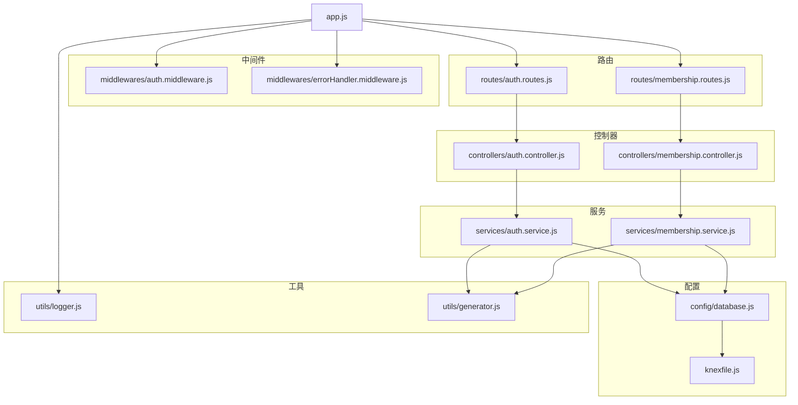
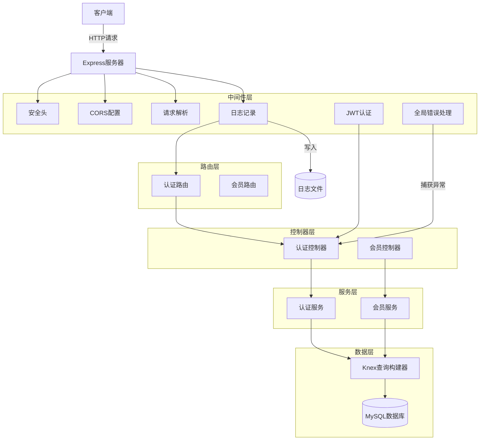
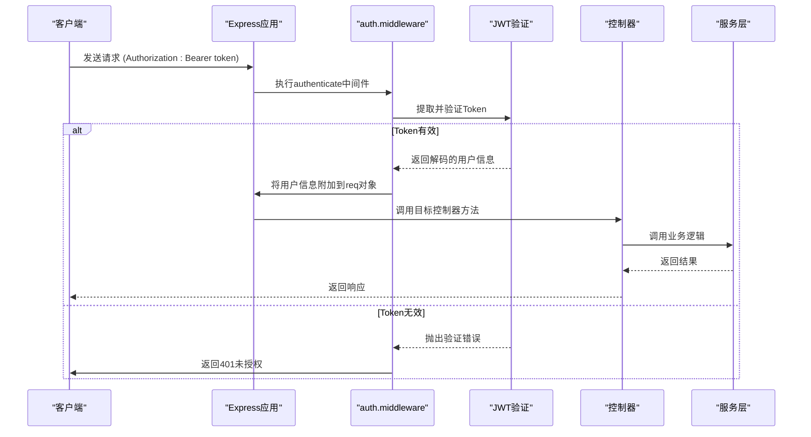
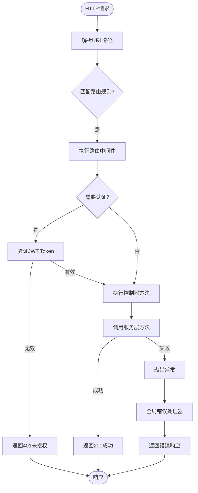
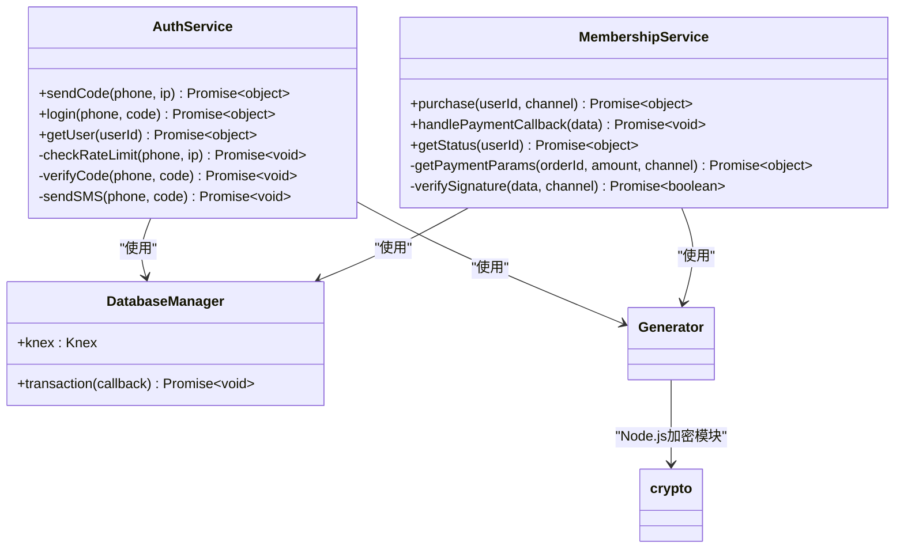
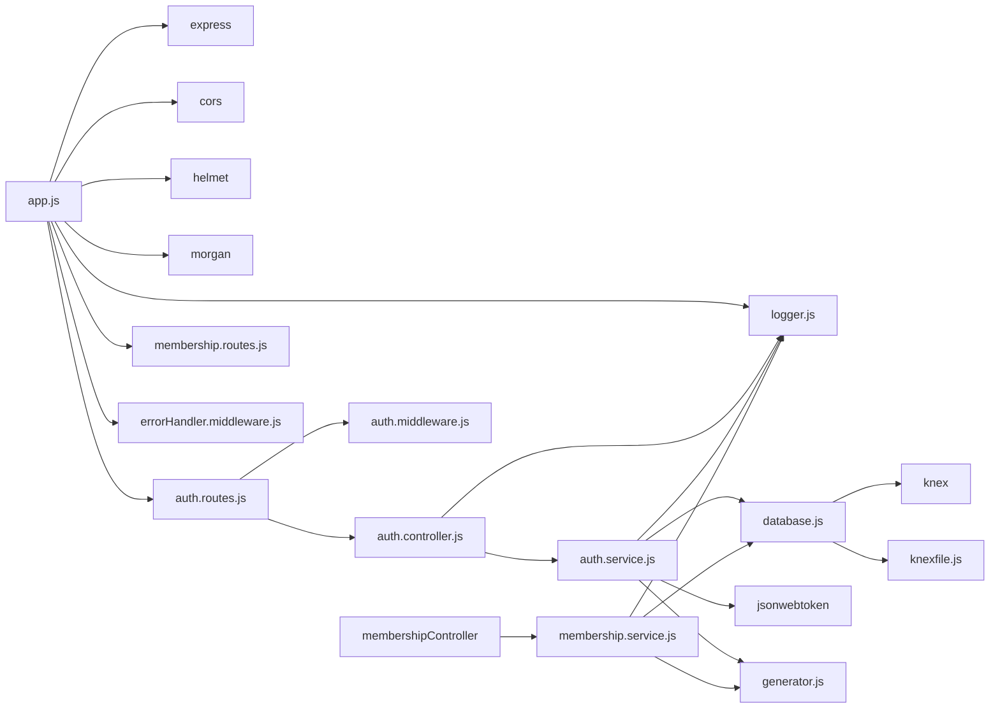

# 后端架构

<cite>
**本文档引用的文件**
- [app.js](file://backend/src/app.js)
- [server.js](file://backend/src/server.js)
- [auth.middleware.js](file://backend/src/middlewares/auth.middleware.js)
- [errorHandler.middleware.js](file://backend/src/middlewares/errorHandler.middleware.js)
- [auth.routes.js](file://backend/src/routes/auth.routes.js)
- [membership.routes.js](file://backend/src/routes/membership.routes.js)
- [auth.controller.js](file://backend/src/controllers/auth.controller.js)
- [membership.controller.js](file://backend/src/controllers/membership.controller.js)
- [auth.service.js](file://backend/src/services/auth.service.js)
- [membership.service.js](file://backend/src/services/membership.service.js)
- [database.js](file://backend/src/config/database.js)
- [knexfile.js](file://backend/knexfile.js)
- [logger.js](file://backend/src/utils/logger.js)
- [generator.js](file://backend/src/utils/generator.js)
</cite>

## 目录
1. [简介](#简介)
2. [项目结构](#项目结构)
3. [核心组件](#核心组件)
4. [架构概览](#架构概览)
5. [详细组件分析](#详细组件分析)
6. [依赖分析](#依赖分析)
7. [性能考虑](#性能考虑)
8. [故障排除指南](#故障排除指南)
9. [结论](#结论)

## 简介
本文档详细描述了基于Express框架的MVC分层后端系统架构。系统采用清晰的职责分离设计，包含控制器（controllers）、服务层（services）和数据访问层（Knex），并集成JWT认证机制。文档重点说明中间件加载顺序、服务启动逻辑、路由分发机制以及认证流程在整个架构中的贯穿方式。

## 项目结构

**图示来源**
- [app.js](file://backend/src/app.js#L1-L50)
- [auth.routes.js](file://backend/src/routes/auth.routes.js#L1-L10)
- [membership.routes.js](file://backend/src/routes/membership.routes.js#L1-L10)
- [auth.controller.js](file://backend/src/controllers/auth.controller.js#L1-L10)
- [membership.controller.js](file://backend/src/controllers/membership.controller.js#L1-L10)

**本节来源**
- [app.js](file://backend/src/app.js#L1-L50)
- [server.js](file://backend/src/server.js#L1-L10)

## 核心组件

系统采用标准的MVC架构模式，各层职责明确：
- **控制器（controllers）**：协调HTTP请求与响应，处理输入验证
- **服务层（services）**：封装核心业务逻辑，确保可重用性和事务一致性
- **数据访问层**：通过Knex执行数据库操作，实现数据持久化
- **中间件（middlewares）**：提供认证、错误处理等横切关注点功能

JWT认证机制贯穿整个请求处理流程，确保接口安全性。

**本节来源**
- [auth.controller.js](file://backend/src/controllers/auth.controller.js#L1-L100)
- [auth.service.js](file://backend/src/services/auth.service.js#L1-L50)
- [auth.middleware.js](file://backend/src/middlewares/auth.middleware.js#L1-L20)

## 架构概览

**图示来源**
- [app.js](file://backend/src/app.js#L1-L50)
- [server.js](file://backend/src/server.js#L1-L40)
- [auth.middleware.js](file://backend/src/middlewares/auth.middleware.js#L1-L75)
- [errorHandler.middleware.js](file://backend/src/middlewares/errorHandler.middleware.js#L1-L45)

## 详细组件分析

### 认证流程分析

#### 认证中间件工作流程

**图示来源**
- [auth.middleware.js](file://backend/src/middlewares/auth.middleware.js#L1-L75)
- [auth.routes.js](file://backend/src/routes/auth.routes.js#L15-L25)
- [auth.controller.js](file://backend/src/controllers/auth.controller.js#L60-L80)

### 路由与控制器分析

#### 请求分发流程

**图示来源**
- [app.js](file://backend/src/app.js#L25-L35)
- [auth.routes.js](file://backend/src/routes/auth.routes.js#L1-L25)
- [auth.controller.js](file://backend/src/controllers/auth.controller.js#L1-L100)

### 服务层职责分析

#### 业务逻辑封装

**图示来源**
- [auth.service.js](file://backend/src/services/auth.service.js#L1-L220)
- [membership.service.js](file://backend/src/services/membership.service.js#L1-L190)
- [database.js](file://backend/src/config/database.js#L1-L10)
- [generator.js](file://backend/src/utils/generator.js#L1-L57)

**本节来源**
- [auth.service.js](file://backend/src/services/auth.service.js#L1-L220)
- [membership.service.js](file://backend/src/services/membership.service.js#L1-L190)
- [database.js](file://backend/src/config/database.js#L1-L10)

## 依赖分析

**图示来源**
- [app.js](file://backend/src/app.js#L1-L50)
- [package.json](file://backend/package.json#L1-L48)
- [knexfile.js](file://backend/knexfile.js#L1-L47)

**本节来源**
- [app.js](file://backend/src/app.js#L1-L50)
- [package.json](file://backend/package.json#L1-L48)
- [knexfile.js](file://backend/knexfile.js#L1-L47)

## 性能考虑

系统在设计时考虑了多项性能优化措施：
- 使用连接池管理数据库连接，避免频繁创建销毁连接
- 实现验证码发送频率限制，防止恶意刷单
- 采用异步非阻塞I/O操作，提高并发处理能力
- 配置适当的请求体大小限制，防止大文件上传导致内存溢出
- 使用Winston日志库进行结构化日志记录，便于后续分析

生产环境建议监控数据库连接数、API响应时间和错误率等关键指标。

## 故障排除指南

常见问题及解决方案：

1. **JWT认证失败**
   - 检查`JWT_SECRET`环境变量是否正确配置
   - 确认客户端发送的Token格式正确（Bearer token）
   - 验证Token是否已过期

2. **数据库连接失败**
   - 检查数据库连接配置（host、port、user、password）
   - 确认数据库服务正在运行
   - 验证网络连接是否正常

3. **路由无法访问**
   - 确认路由路径拼写正确
   - 检查中间件是否阻止了请求
   - 查看服务器启动日志确认路由已正确加载

4. **服务启动失败**
   - 检查端口是否被占用
   - 验证环境变量配置
   - 查看错误日志定位具体问题

**本节来源**
- [auth.middleware.js](file://backend/src/middlewares/auth.middleware.js#L1-L75)
- [errorHandler.middleware.js](file://backend/src/middlewares/errorHandler.middleware.js#L1-L45)
- [logger.js](file://backend/src/utils/logger.js#L1-L42)
- [server.js](file://backend/src/server.js#L1-L40)

## 结论

本系统采用清晰的MVC分层架构，实现了良好的职责分离。Express应用通过`app.js`配置中间件和路由，`server.js`负责服务启动和生命周期管理。JWT认证机制通过`auth.middleware.js`在路由层面统一处理，确保接口安全性。控制器层协调请求响应，服务层封装核心业务逻辑，Knex提供可靠的数据库操作能力。整个架构具有良好的可维护性、可扩展性和安全性，适合持续迭代开发。