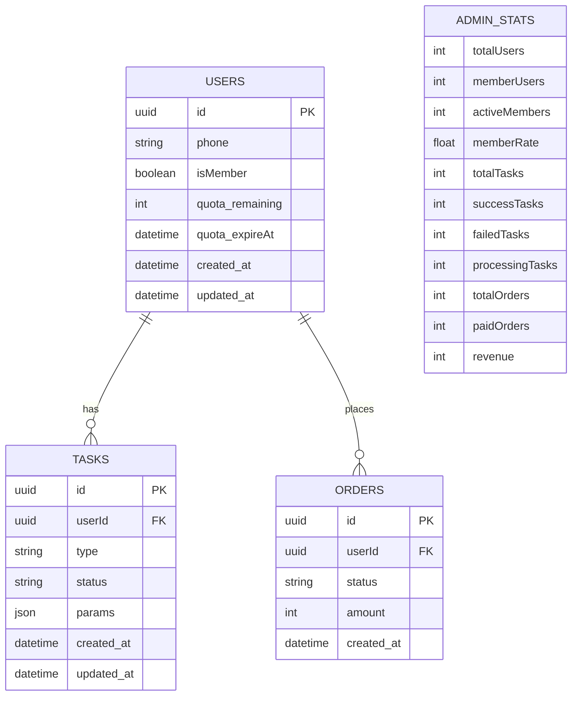

# 控制器层

<cite>
**本文档中引用的文件**
- [auth.controller.js](file://backend/src/controllers/auth.controller.js)
- [membership.controller.js](file://backend/src/controllers/membership.controller.js)
- [media.controller.js](file://backend/src/controllers/media.controller.js)
- [task.controller.js](file://backend/src/controllers/task.controller.js)
- [admin.controller.js](file://backend/src/src/controllers/admin.controller.js)
- [auth.routes.js](file://backend/src/routes/auth.routes.js)
- [membership.routes.js](file://backend/src/routes/membership.routes.js)
- [media.routes.js](file://backend/src/routes/media.routes.js)
- [task.routes.js](file://backend/src/routes/task.routes.js)
- [admin.routes.js](file://backend/src/routes/admin.routes.js)
- [auth.middleware.js](file://backend/src/middlewares/auth.middleware.js)
- [errorHandler.middleware.js](file://backend/src/middlewares/errorHandler.middleware.js)
- [app.js](file://backend/src/app.js)
</cite>

## 目录
1. [简介](#简介)
2. [项目结构](#项目结构)
3. [核心组件](#核心组件)
4. [架构概览](#架构概览)
5. [详细组件分析](#详细组件分析)
6. [依赖关系分析](#依赖关系分析)
7. [性能考虑](#性能考虑)
8. [故障排除指南](#故障排除指南)
9. [结论](#结论)

## 简介

控制器层是MVC架构模式中的核心组件，负责处理HTTP请求、调用相应的服务层方法，并返回标准化的响应。本文档深入分析了本项目中五个主要控制器（Auth、Membership、Media、Task、Admin）的设计理念、实现方式以及它们在整体架构中的协调作用。

控制器层的主要职责包括：
- 接收和解析HTTP请求参数
- 执行输入验证和数据格式化
- 调用服务层业务逻辑
- 处理异常和错误响应
- 提供统一的响应格式

## 项目结构

控制器层采用模块化设计，每个控制器专注于特定的功能领域，遵循单一职责原则。

**图表来源**
- [auth.controller.js](file://backend/src/controllers/auth.controller.js#L1-L100)
- [membership.controller.js](file://backend/src/controllers/membership.controller.js#L1-L78)
- [media.controller.js](file://backend/src/controllers/media.controller.js#L1-L65)
- [task.controller.js](file://backend/src/controllers/task.controller.js#L1-L173)
- [admin.controller.js](file://backend/src/src/controllers/admin.controller.js#L1-L253)

**章节来源**
- [auth.controller.js](file://backend/src/controllers/auth.controller.js#L1-L100)
- [membership.controller.js](file://backend/src/controllers/membership.controller.js#L1-L78)
- [media.controller.js](file://backend/src/controllers/media.controller.js#L1-L65)
- [task.controller.js](file://backend/src/controllers/task.controller.js#L1-L173)
- [admin.controller.js](file://backend/src/src/controllers/admin.controller.js#L1-L253)

## 核心组件

### 认证控制器 (AuthController)

认证控制器处理用户身份验证相关的所有请求，包括验证码发送、用户登录和获取用户信息。

**主要功能：**
- 验证码发送：支持手机号格式验证和IP限制
- 用户登录：集成短信验证码验证机制
- 用户信息获取：提供当前登录用户信息查询

**关键特性：**
- 输入参数严格验证
- 统一的错误响应格式
- 集成日志记录机制

### 会员控制器 (MembershipController)

会员控制器管理用户的订阅服务，包括购买流程和支付回调处理。

**主要功能：**
- 会员购买：支持微信支付和支付宝
- 支付回调：处理第三方支付平台的通知
- 会员状态查询：获取用户的订阅状态

**关键特性：**
- 支付渠道验证
- 异常情况下的日志记录
- 第三方支付集成

### 媒体控制器 (MediaController)

媒体控制器专门处理文件上传相关的请求，特别是与腾讯云COS存储的集成。

**主要功能：**
- STS临时密钥获取：为前端提供安全的上传凭证
- 文件上传验证：检查文件大小和类型限制
- 安全的文件处理流程

**关键特性：**
- 文件大小和类型验证
- 安全的临时凭证生成
- 详细的日志记录

### 任务控制器 (TaskController)

任务控制器是系统的核心组件，负责处理AI图像处理任务的完整生命周期。

**主要功能：**
- 任务创建：支持多种类型的AI处理任务
- 任务查询：提供任务详情和列表查询
- 任务状态管理：支持任务状态更新
- 异步处理：处理耗时的图像处理任务

**关键特性：**
- 多种任务类型支持
- 异步处理机制
- 错误处理和重试机制

### 管理控制器 (AdminController)

管理控制器为系统管理员提供各种管理功能，包括用户管理和系统监控。

**主要功能：**
- 用户管理：查询用户列表和统计信息
- 任务管理：查看系统任务状态
- 系统概览：提供整体系统运行状况
- 失败任务追踪：监控和分析失败任务

**关键特性：**
- 数据库查询优化
- 统计信息聚合
- 管理员权限验证

**章节来源**
- [auth.controller.js](file://backend/src/controllers/auth.controller.js#L5-L100)
- [membership.controller.js](file://backend/src/controllers/membership.controller.js#L5-L78)
- [media.controller.js](file://backend/src/controllers/media.controller.js#L5-L65)
- [task.controller.js](file://backend/src/controllers/task.controller.js#L5-L173)
- [admin.controller.js](file://backend/src/src/controllers/admin.controller.js#L5-L253)

## 架构概览

控制器层采用分层架构设计，清晰地分离了关注点，确保了代码的可维护性和可扩展性。

**图表来源**
- [app.js](file://backend/src/app.js#L35-L45)
- [auth.middleware.js](file://backend/src/middlewares/auth.middleware.js#L6-L40)
- [auth.controller.js](file://backend/src/controllers/auth.controller.js#L8-L30)

### 请求处理流程

1. **请求到达**：客户端发送HTTP请求到指定的API端点
2. **路由匹配**：Express路由器根据URL路径和HTTP方法匹配对应的处理器
3. **中间件执行**：按顺序执行认证、授权等中间件
4. **控制器处理**：控制器接收请求，进行参数验证和业务逻辑处理
5. **服务调用**：控制器调用相应服务层的方法
6. **响应构建**：控制器构建标准化的JSON响应
7. **错误处理**：全局错误处理器捕获并处理异常

**章节来源**
- [app.js](file://backend/src/app.js#L35-L45)
- [auth.routes.js](file://backend/src/routes/auth.routes.js#L1-L28)
- [membership.routes.js](file://backend/src/routes/membership.routes.js#L1-L28)

## 详细组件分析

### 认证控制器深度分析

认证控制器实现了完整的用户身份验证流程，重点关注安全性、可靠性和用户体验。

#### 登录处理流程

**图表来源**
- [auth.controller.js](file://backend/src/controllers/auth.controller.js#L32-L65)

#### 参数验证机制

控制器实现了多层次的参数验证：

1. **格式验证**：使用正则表达式验证手机号和验证码格式
2. **业务验证**：检查参数的业务合理性
3. **错误处理**：提供详细的错误信息和错误码

#### 错误响应标准化

所有控制器都采用统一的错误响应格式：

| 字段 | 类型 | 描述 |
|------|------|------|
| success | Boolean | 操作是否成功 |
| error.code | Number | 自定义错误码 |
| error.message | String | 错误消息 |

**章节来源**
- [auth.controller.js](file://backend/src/controllers/auth.controller.js#L8-L100)

### 任务控制器深度分析

任务控制器是最复杂的控制器，需要处理多种任务类型和异步处理场景。

#### 任务类型处理

**图表来源**
- [task.controller.js](file://backend/src/controllers/task.controller.js#L10-L50)
- [task.controller.js](file://backend/src/controllers/task.controller.js#L52-L70)

#### 异步处理策略

任务控制器采用了智能的异步处理策略：

1. **立即响应**：创建任务后立即返回响应，不等待处理完成
2. **后台处理**：使用Promise.catch()确保异步任务不会影响主线程
3. **错误隔离**：异步任务的错误不会影响同步响应流程

#### 错误处理机制

任务控制器实现了分级错误处理：

1. **参数错误**：直接返回400错误和具体错误信息
2. **业务错误**：返回自定义错误码和业务错误消息
3. **系统错误**：交由全局错误处理器处理

**章节来源**
- [task.controller.js](file://backend/src/controllers/task.controller.js#L10-L173)

### 管理控制器深度分析

管理控制器提供了系统管理员所需的各种管理功能，重点关注数据统计和系统监控。

#### 数据统计分析

**图表来源**
- [admin.controller.js](file://backend/src/src/controllers/admin.controller.js#L15-L35)
- [admin.controller.js](file://backend/src/src/controllers/admin.controller.js#L85-L105)

#### 查询优化策略

管理控制器采用了多种查询优化技术：

1. **条件查询**：支持动态查询条件组合
2. **分页处理**：提供灵活的分页参数
3. **统计聚合**：使用SQL聚合函数减少数据库查询次数
4. **连接查询**：合理使用LEFT JOIN获取关联数据

**章节来源**
- [admin.controller.js](file://backend/src/src/controllers/admin.controller.js#L15-L253)

## 依赖关系分析

控制器层与多个其他层存在密切的依赖关系，形成了清晰的分层架构。

**图表来源**
- [auth.controller.js](file://backend/src/controllers/auth.controller.js#L1-L5)
- [membership.controller.js](file://backend/src/controllers/membership.controller.js#L1-L5)
- [task.controller.js](file://backend/src/controllers/task.controller.js#L1-L5)
- [media.controller.js](file://backend/src/controllers/media.controller.js#L1-L5)
- [admin.controller.js](file://backend/src/src/controllers/admin.controller.js#L1-L5)

### 中间件依赖关系

控制器层高度依赖中间件层提供的功能：

#### JWT认证中间件

JWT认证中间件在每个需要用户认证的控制器方法前执行：

1. **Token提取**：从Authorization头中提取Bearer Token
2. **Token验证**：使用JWT_SECRET验证Token的有效性
3. **用户信息注入**：将解码后的用户信息附加到请求对象
4. **错误处理**：处理各种认证失败的情况

#### 错误处理中间件

全局错误处理中间件为所有控制器提供统一的错误处理机制：

1. **错误捕获**：捕获所有控制器抛出的异常
2. **日志记录**：记录详细的错误信息和上下文
3. **响应格式化**：提供统一的错误响应格式
4. **状态码设置**：根据错误类型设置适当的HTTP状态码

**章节来源**
- [auth.middleware.js](file://backend/src/middlewares/auth.middleware.js#L6-L77)
- [errorHandler.middleware.js](file://backend/src/middlewares/errorHandler.middleware.js#L5-L46)

## 性能考虑

控制器层在设计时充分考虑了性能优化，采用了多种策略来提升系统的响应速度和并发处理能力。

### 异步处理优化

1. **非阻塞I/O**：所有数据库操作和服务调用都采用异步模式
2. **Promise链式调用**：避免回调地狱，提高代码可读性
3. **错误隔离**：使用Promise.catch()确保单个异步操作失败不影响整体流程

### 缓存策略

虽然当前实现中没有显式的缓存机制，但控制器层的设计为未来的缓存优化预留了空间：

1. **重复查询避免**：通过合理的数据库查询设计减少重复查询
2. **批量操作**：在管理控制器中使用批量查询减少数据库往返
3. **内存优化**：及时释放不需要的变量和对象

### 并发处理

1. **无状态设计**：控制器都是无状态的，可以安全地并发处理多个请求
2. **资源池化**：依赖Express框架的连接池和数据库连接池
3. **异步队列**：对于耗时的任务，采用异步处理避免阻塞主线程

## 故障排除指南

### 常见问题及解决方案

#### 认证相关问题

**问题**：用户无法登录或获取用户信息
**可能原因**：
- JWT Token无效或已过期
- 手机号格式不正确
- 验证码错误或已过期

**解决方案**：
1. 检查JWT_SECRET配置是否正确
2. 验证手机号格式是否符合11位数字规则
3. 确认验证码服务正常工作

#### 任务处理问题

**问题**：任务创建后无法正常处理
**可能原因**：
- 任务类型参数错误
- 图像URL不可访问
- 服务层依赖的服务不可用

**解决方案**：
1. 验证任务类型参数是否在允许范围内
2. 检查图像URL的可访问性
3. 查看服务层的日志以确定具体依赖服务的状态

#### 权限相关问题

**问题**：受保护的接口返回401错误
**可能原因**：
- 缺少Authorization头
- Token格式不正确
- Token已过期

**解决方案**：
1. 确保请求头包含正确的Bearer Token格式
2. 验证Token是否在有效期内
3. 检查JWT_SECRET配置

**章节来源**
- [auth.controller.js](file://backend/src/controllers/auth.controller.js#L32-L65)
- [task.controller.js](file://backend/src/controllers/task.controller.js#L10-L50)
- [auth.middleware.js](file://backend/src/middlewares/auth.middleware.js#L6-L40)

## 结论

控制器层作为MVC架构中的重要组成部分，成功地实现了以下目标：

### 设计优势

1. **清晰的职责分离**：控制器专注于请求处理和响应构建，不包含业务逻辑
2. **统一的错误处理**：通过中间件提供一致的错误处理机制
3. **灵活的扩展性**：模块化设计便于添加新的控制器和功能
4. **良好的可维护性**：清晰的代码结构和注释便于后续维护

### 技术亮点

1. **异步处理**：充分利用JavaScript的异步特性提升系统性能
2. **参数验证**：多层次的输入验证确保系统安全性
3. **日志记录**：完善的日志系统便于问题诊断和系统监控
4. **错误响应标准化**：统一的错误响应格式提升用户体验

### 改进建议

1. **添加单元测试**：为每个控制器方法编写单元测试
2. **引入缓存机制**：对于频繁查询的数据考虑添加缓存
3. **性能监控**：添加性能指标监控和告警机制
4. **API版本控制**：为API接口添加版本控制支持

控制器层的设计体现了现代Web应用的最佳实践，为整个系统的稳定运行奠定了坚实的基础。通过合理的分层架构和清晰的职责划分，系统具备了良好的可扩展性和可维护性，能够适应未来业务的发展需求。