# AI模型服务集成文档

<cite>
**本文档引用的文件**
- [aiModel.service.js](file://backend/src/services/aiModel.service.js)
- [task.controller.js](file://backend/src/controllers/task.controller.js)
- [task.service.js](file://backend/src/services/task.service.js)
- [task.routes.js](file://backend/src/routes/task.routes.js)
- [contentAudit.service.js](file://backend/src/services/contentAudit.service.js)
- [cos.js](file://backend/src/config/cos.js)
- [errorHandler.middleware.js](file://backend/src/middlewares/errorHandler.middleware.js)
- [api.ts](file://frontend/src/lib/api.ts)
- [page.tsx](file://frontend/src/app/task/model/page.tsx)
- [create_tasks_table.js](file://backend/src/db/migrations/20251028000003_create_tasks_table.js)
- [database.js](file://backend/src/config/database.js)
</cite>

## 目录
1. [项目概述](#项目概述)
2. [系统架构](#系统架构)
3. [核心组件分析](#核心组件分析)
4. [Prompt模板管理](#prompt模板管理)
5. [RunningHub API集成](#runninghub-api集成)
6. [异步任务轮询机制](#异步任务轮询机制)
7. [COS文件处理](#cos文件处理)
8. [状态管理与错误处理](#状态管理与错误处理)
9. [前端集成](#前端集成)
10. [测试与模拟方案](#测试与模拟方案)
11. [性能优化](#性能优化)
12. [故障排除](#故障排除)

## 项目概述

AI模型服务是RunningHub平台与后端系统的深度集成解决方案，专注于为用户提供高质量的AI模特12分镜生成功能。该服务通过异步任务处理机制，实现了从用户输入到最终结果输出的完整业务流程。

### 主要特性

- **多场景支持**: 街拍、白棚、室内三种拍摄场景
- **多品类适配**: 鞋子、裙子、卫衣三种商品品类
- **异步处理**: 基于轮询机制的非阻塞任务处理
- **容错机制**: 完善的错误处理和模拟策略
- **内容审核**: 集成腾讯云内容审核服务
- **配额管理**: 基于用户会员体系的资源控制

## 系统架构

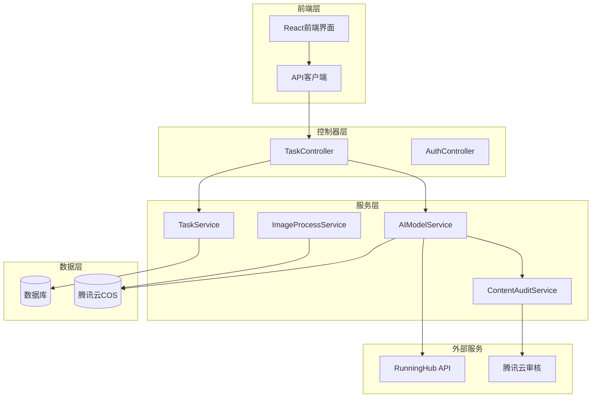

**图表来源**
- [task.controller.js](file://backend/src/controllers/task.controller.js#L1-L173)
- [aiModel.service.js](file://backend/src/services/aiModel.service.js#L1-L345)
- [task.service.js](file://backend/src/services/task.service.js#L1-L370)

## 核心组件分析

### AIModelService类设计

AIModelService是整个AI模型服务的核心，负责与RunningHub平台的集成和任务管理。

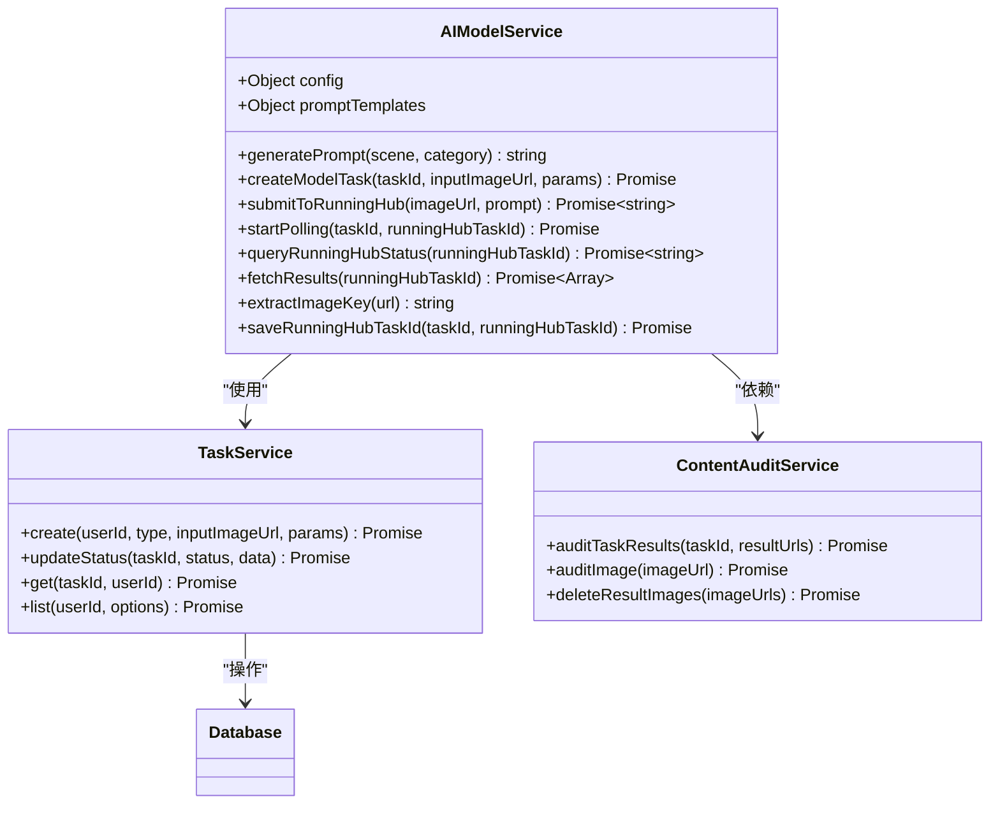

**图表来源**
- [aiModel.service.js](file://backend/src/services/aiModel.service.js#L18-L345)
- [task.service.js](file://backend/src/services/task.service.js#L10-L370)
- [contentAudit.service.js](file://backend/src/services/contentAudit.service.js#L15-L230)

**章节来源**
- [aiModel.service.js](file://backend/src/services/aiModel.service.js#L18-L345)
- [task.service.js](file://backend/src/services/task.service.js#L10-L370)

## Prompt模板管理

### 模板结构设计

AIModelService内置了精心设计的Prompt模板系统，支持按场景和品类进行个性化定制。

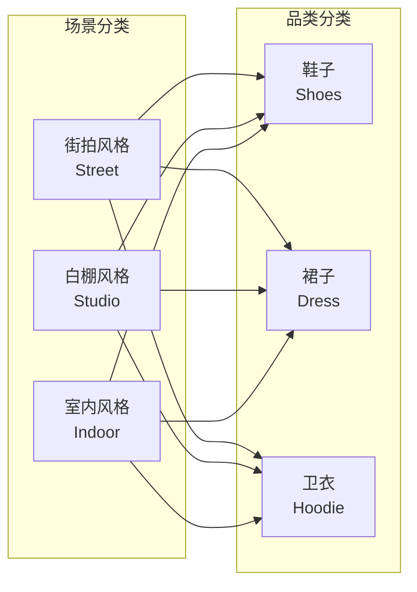

**图表来源**
- [aiModel.service.js](file://backend/src/services/aiModel.service.js#L35-L60)

### Prompt生成逻辑

Prompt模板的生成遵循严格的参数化设计，确保每个组合都能产生高质量的生成结果：

| 场景 | 品类 | Prompt特点 |
|------|------|------------|
| street | shoes | 街头时尚，自然光线，真实场景 |
| street | dress | 街头风格，连衣裙搭配，动态展示 |
| street | hoodie | 街头休闲，卫衣造型，生活化呈现 |
| studio | shoes | 专业摄影，纯白背景，细节突出 |
| studio | dress | 影棚拍摄，优雅气质，光影效果 |
| studio | hoodie | 专业造型，简约风格，质感表现 |
| indoor | shoes | 室内家居，舒适氛围，日常穿搭 |
| indoor | dress | 居家风格，温馨场景，柔和光线 |
| indoor | hoodie | 家居休闲，自然姿态，生活气息 |

**章节来源**
- [aiModel.service.js](file://backend/src/services/aiModel.service.js#L62-L75)

## RunningHub API集成

### API调用协议

AIModelService与RunningHub平台的集成基于RESTful API协议，采用标准化的请求格式和认证机制。

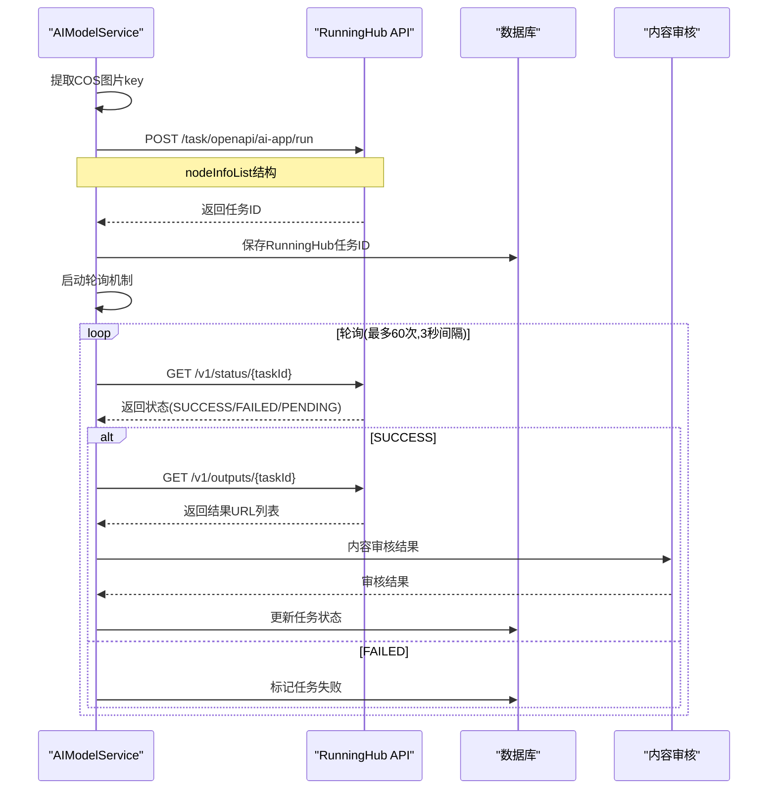

**图表来源**
- [aiModel.service.js](file://backend/src/services/aiModel.service.js#L115-L197)
- [aiModel.service.js](file://backend/src/services/aiModel.service.js#L201-L345)

### nodeInfoList结构详解

RunningHub API的nodeInfoList参数是任务执行的核心配置，定义了输入节点和对应的参数：

| 节点ID | 字段名 | 值类型 | 描述 | 示例 |
|--------|--------|--------|------|------|
| 103 | text | string | Prompt文本描述 | "这是一个模特拍摄，鞋子为主题..." |
| 74 | image | string | COS文件名(key) | "input_123456789.jpg" |

**章节来源**
- [aiModel.service.js](file://backend/src/services/aiModel.service.js#L125-L158)

### Mock容错策略

在开发和测试环境中，AIModelService实现了完善的Mock机制，确保系统稳定性：

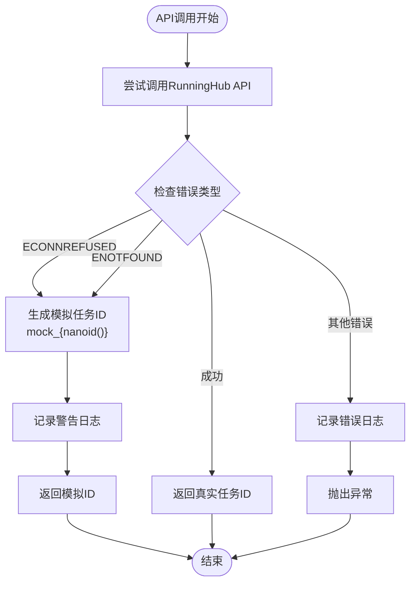

**图表来源**
- [aiModel.service.js](file://backend/src/services/aiModel.service.js#L165-L180)

**章节来源**
- [aiModel.service.js](file://backend/src/services/aiModel.service.js#L115-L197)

## 异步任务轮询机制

### 轮询设计原理

AIModelService采用指数退避算法结合固定间隔的轮询策略，平衡了响应速度和系统负载。

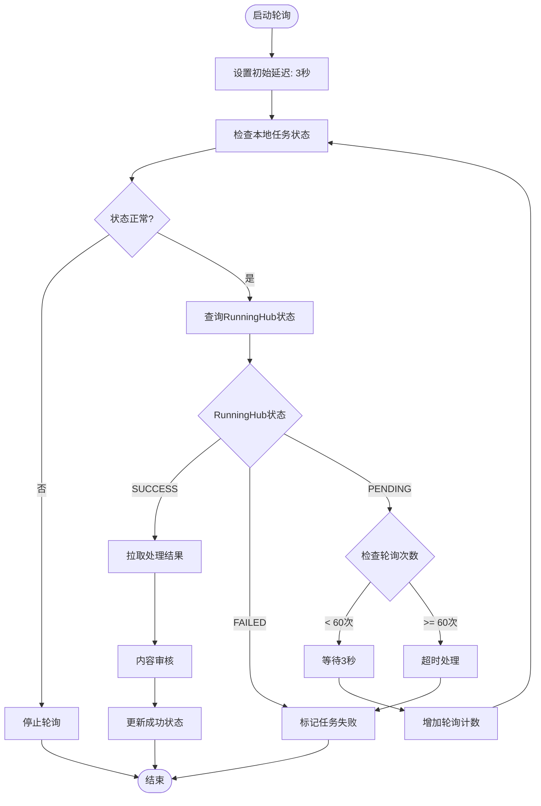

**图表来源**
- [aiModel.service.js](file://backend/src/services/aiModel.service.js#L201-L280)

### 状态映射机制

轮询过程中的状态转换遵循严格的状态机设计：

| 本地状态 | RunningHub状态 | 操作行为 | 下一步 |
|----------|----------------|----------|--------|
| processing | PENDING | 继续轮询 | 等待下次检查 |
| processing | SUCCESS | 拉取结果 | 内容审核 |
| processing | FAILED | 标记失败 | 结束处理 |
| 非processing | 任意 | 停止轮询 | 结束处理 |

**章节来源**
- [aiModel.service.js](file://backend/src/services/aiModel.service.js#L201-L280)

### 超时策略

系统设置了多层次的超时保护机制：

- **API调用超时**: 30秒(任务提交)、10秒(状态查询)、30秒(结果拉取)
- **轮询超时**: 60次 × 3秒 = 3分钟
- **任务清理**: 10分钟未处理的任务自动标记为失败

**章节来源**
- [aiModel.service.js](file://backend/src/services/aiModel.service.js#L201-L280)

## COS文件处理

### 文件名提取算法

AIModelService实现了robust的COS URL解析机制，确保文件名提取的准确性：

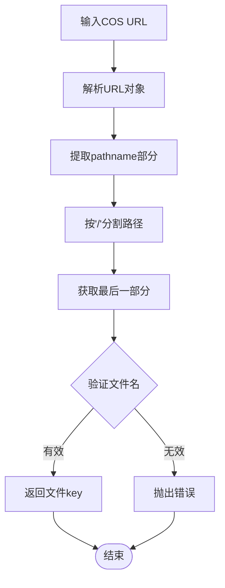

**图表来源**
- [aiModel.service.js](file://backend/src/services/aiModel.service.js#L182-L197)

### URL解析实现

extractImageKey方法采用标准URL解析API，具备以下特性：
- **跨域兼容**: 支持不同域名的COS配置
- **路径安全**: 自动处理路径中的特殊字符
- **错误处理**: 详细的错误日志和异常抛出

**章节来源**
- [aiModel.service.js](file://backend/src/services/aiModel.service.js#L182-L197)

### 元数据持久化

saveRunningHubTaskId方法实现了JSON字段的动态更新，确保任务元数据的完整性：

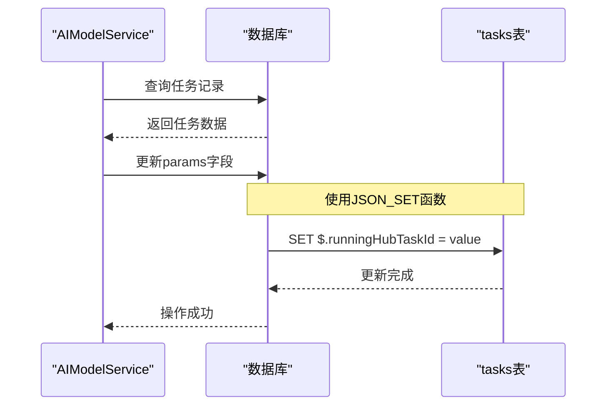

**图表来源**
- [aiModel.service.js](file://backend/src/services/aiModel.service.js#L199-L208)

**章节来源**
- [aiModel.service.js](file://backend/src/services/aiModel.service.js#L199-L208)

## 状态管理与错误处理

### 任务状态流转

TaskService实现了完整的任务生命周期管理，支持多种状态转换：

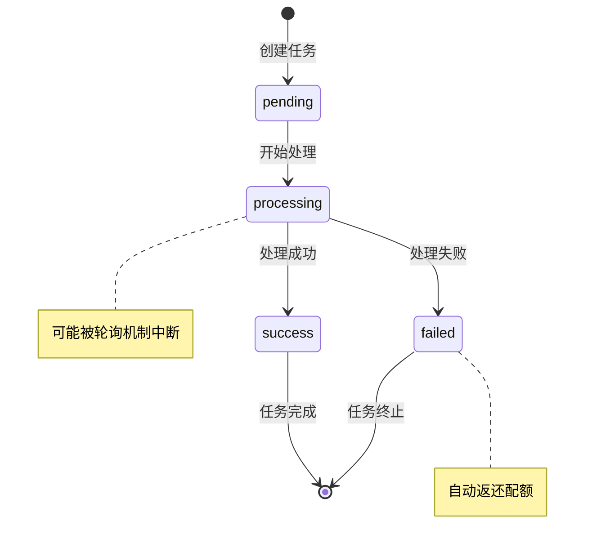

**图表来源**
- [task.service.js](file://backend/src/services/task.service.js#L130-L170)

### 错误处理策略

系统采用分层错误处理机制，确保错误不会影响整体系统稳定性：

| 错误级别 | 处理策略 | 影响范围 | 恢复机制 |
|----------|----------|----------|----------|
| API连接失败 | Mock模式 | 单个请求 | 重试机制 |
| 数据库异常 | 事务回滚 | 当前操作 | 自动恢复 |
| 内容审核失败 | 图片删除 | 整个任务 | 状态重置 |
| 用户权限错误 | 权限拒绝 | 特定操作 | 重新认证 |

**章节来源**
- [aiModel.service.js](file://backend/src/services/aiModel.service.js#L85-L110)
- [task.service.js](file://backend/src/services/task.service.js#L130-L170)

### 内容审核集成

ContentAuditService提供了强大的内容过滤能力，确保生成内容的合规性：

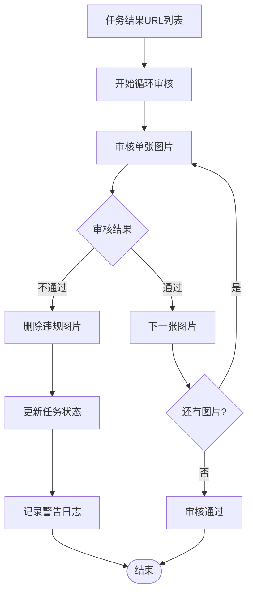

**图表来源**
- [contentAudit.service.js](file://backend/src/services/contentAudit.service.js#L85-L130)

**章节来源**
- [contentAudit.service.js](file://backend/src/services/contentAudit.service.js#L85-L130)

## 前端集成

### API客户端设计

前端通过统一的API客户端与后端服务通信，提供了完整的任务管理功能：

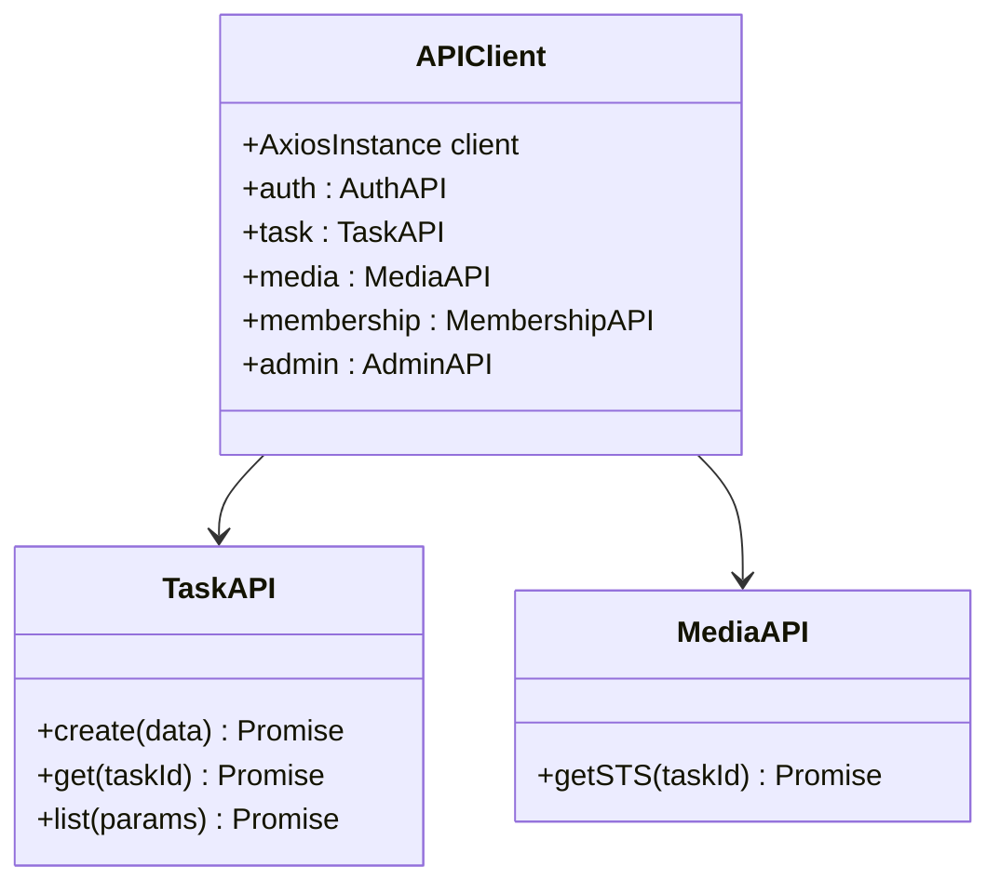

**图表来源**
- [api.ts](file://frontend/src/lib/api.ts#L15-L118)

### 用户界面流程

AIModelPage组件实现了直观的三步骤生成流程：

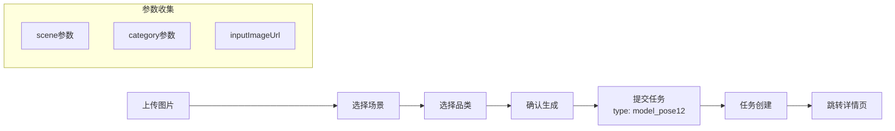

**图表来源**
- [page.tsx](file://frontend/src/app/task/model/page.tsx#L1-L277)

### 配置参数说明

| 参数名 | 类型 | 必填 | 描述 | 示例值 |
|--------|------|------|------|--------|
| type | string | 是 | 任务类型 | "model_pose12" |
| inputImageUrl | string | 是 | 输入图片URL | "https://bucket.cos.region.myqcloud.com/input/..." |
| params.scene | string | 否 | 场景风格 | "street" |
| params.category | string | 否 | 商品品类 | "shoes" |

**章节来源**
- [page.tsx](file://frontend/src/app/task/model/page.tsx#L140-L160)

## 测试与模拟方案

### 开发环境模拟

系统在开发环境中提供了完整的模拟支持，确保开发效率：

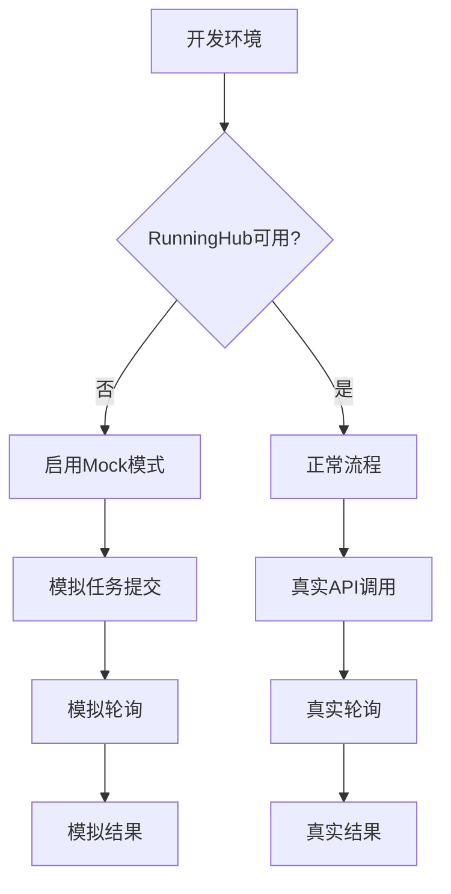

**图表来源**
- [aiModel.service.js](file://backend/src/services/aiModel.service.js#L165-L180)

### 测试用例设计

| 测试场景 | 预期结果 | 验证要点 |
|----------|----------|----------|
| 正常任务提交 | 成功创建任务 | 任务状态、RunningHub ID |
| API连接失败 | Mock任务ID | 错误日志、状态更新 |
| 轮询超时 | 任务标记失败 | 超时时间、状态变更 |
| 内容审核失败 | 图片删除、任务失败 | 审核结果、清理操作 |
| 数据库异常 | 事务回滚 | 状态一致性 |

**章节来源**
- [aiModel.service.js](file://backend/src/services/aiModel.service.js#L165-L180)
- [contentAudit.service.js](file://backend/src/services/contentAudit.service.js#L85-L130)

### 模拟数据生成

系统支持自动生成测试数据，便于开发和调试：

```javascript
// 模拟结果URL生成
const mockUrls = [];
for (let i = 0; i < 12; i++) {
  mockUrls.push(`https://mock-cdn.com/result_${i + 1}.png`);
}
```

**章节来源**
- [aiModel.service.js](file://backend/src/services/aiModel.service.js#L325-L343)

## 性能优化

### 并发控制

系统采用了多种并发控制策略，确保资源的合理利用：

- **异步处理**: 任务创建后立即返回，后续处理在后台进行
- **轮询间隔**: 3秒固定间隔，避免过度请求
- **超时保护**: 多层次超时机制，防止资源泄露
- **连接池**: 数据库连接采用连接池管理

### 缓存策略

虽然当前版本没有实现缓存，但系统设计考虑了未来的缓存扩展：

- **Prompt模板**: 静态配置，无需缓存
- **任务状态**: 数据库查询，可添加Redis缓存
- **COS文件**: CDN加速，减少重复下载

### 监控指标

系统内置了详细的监控和日志记录：

| 指标类型 | 监控内容 | 记录频率 |
|----------|----------|----------|
| 任务统计 | 创建数量、成功率 | 实时 |
| 性能指标 | API响应时间、轮询次数 | 每次操作 |
| 错误统计 | 失败原因、重试次数 | 异常时 |
| 资源使用 | 数据库连接、内存占用 | 定期 |

**章节来源**
- [aiModel.service.js](file://backend/src/services/aiModel.service.js#L201-L280)

## 故障排除

### 常见问题诊断

| 问题症状 | 可能原因 | 解决方案 |
|----------|----------|----------|
| 任务创建失败 | RunningHub API不可用 | 检查网络连接，启用Mock模式 |
| 轮询超时 | 处理时间过长 | 增加超时时间，检查任务复杂度 |
| 内容审核失败 | 生成内容违规 | 检查Prompt模板，调整生成参数 |
| 数据库连接失败 | 连接池耗尽 | 检查连接配置，重启应用 |
| COS上传失败 | 存储空间不足 | 检查存储配额，清理过期文件 |

### 日志分析指南

系统提供了详细的日志记录，便于问题定位：

```bash
# 查看AI模型服务日志
tail -f logs/ai-model-service.log

# 查看任务状态变化
grep "TaskService" logs/application.log

# 查看RunningHub API调用
grep "RunningHub" logs/application.log

# 查看内容审核结果
grep "ContentAudit" logs/application.log
```

### 紧急恢复程序

当系统出现严重问题时，可执行以下恢复步骤：

1. **重启服务**: 重新启动AI模型服务进程
2. **清理超时任务**: 执行任务清理脚本
3. **重置Mock状态**: 在开发环境重置Mock配置
4. **检查依赖服务**: 验证RunningHub API和COS服务状态
5. **恢复数据库**: 从备份恢复任务状态

**章节来源**
- [aiModel.service.js](file://backend/src/services/aiModel.service.js#L85-L110)
- [task.service.js](file://backend/src/services/task.service.js#L340-L370)

## 总结

AI模型服务通过精心设计的架构和完善的机制，实现了与RunningHub平台的深度集成。系统具备以下核心优势：

- **高可靠性**: 多层容错机制确保服务稳定性
- **高性能**: 异步处理和合理的轮询策略
- **易维护**: 清晰的模块划分和详细的日志记录
- **可扩展**: 模块化设计支持功能扩展

通过本文档的详细说明，开发者可以深入理解系统的运作机制，并能够有效地进行开发、测试和维护工作。