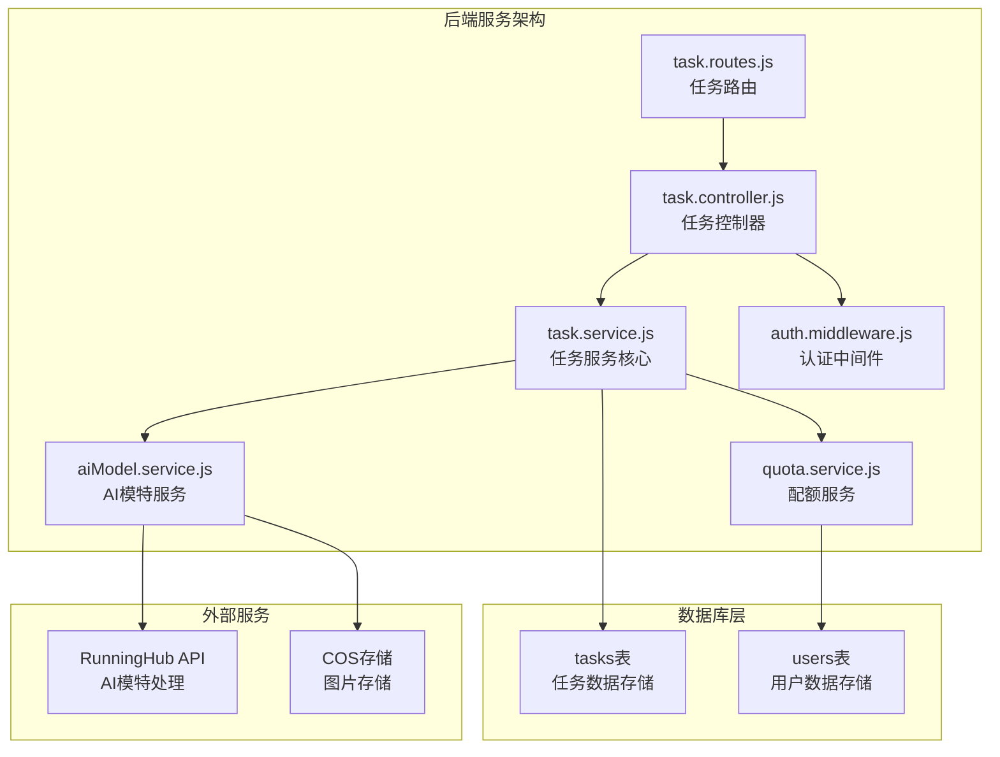
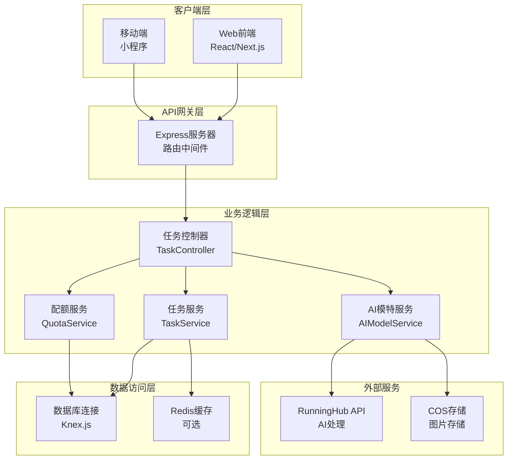
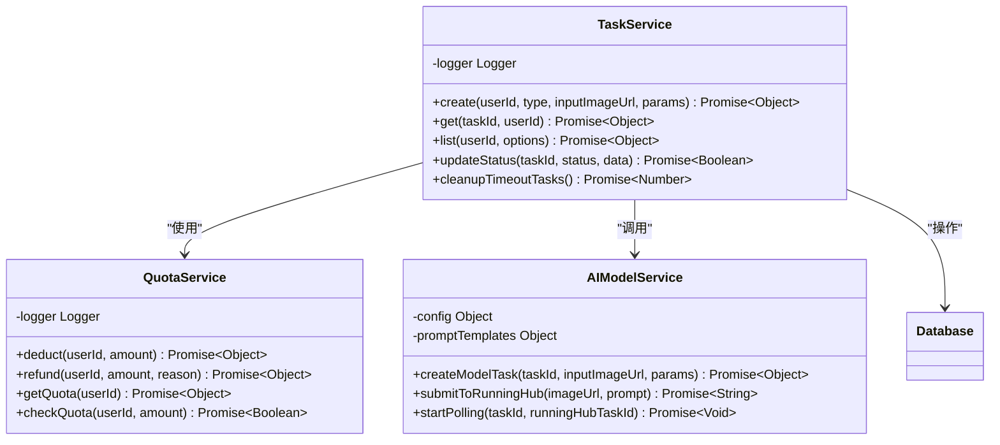
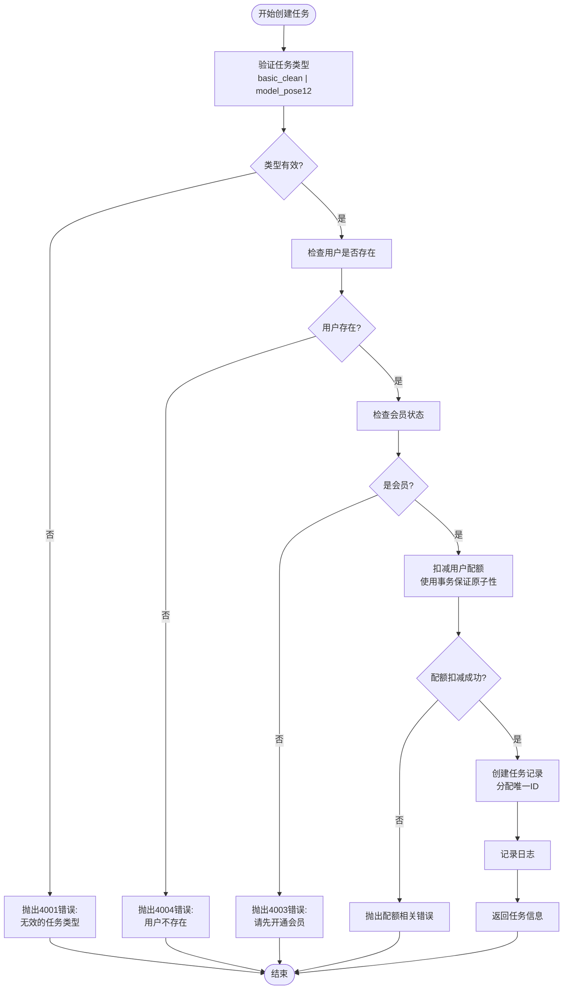
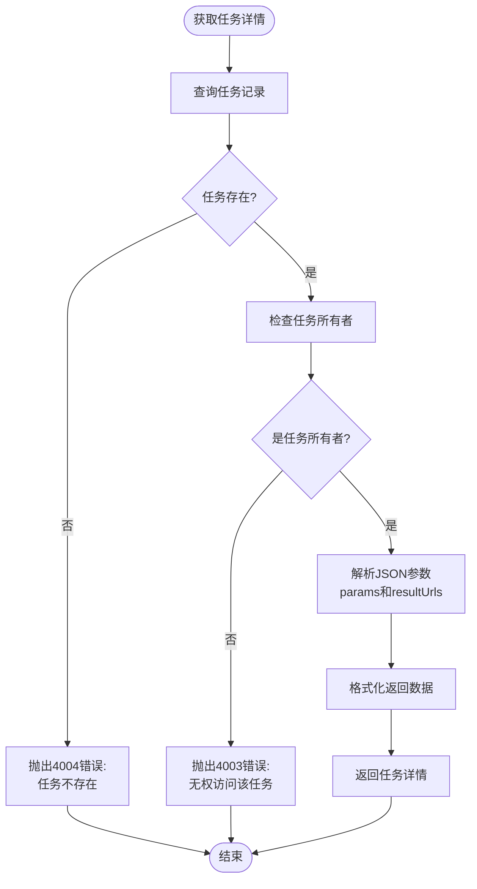
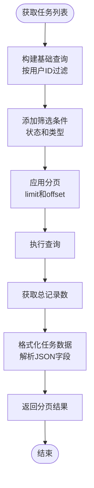
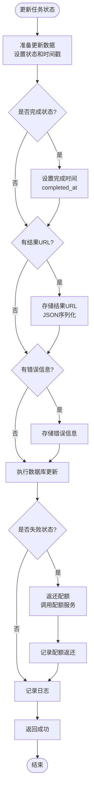
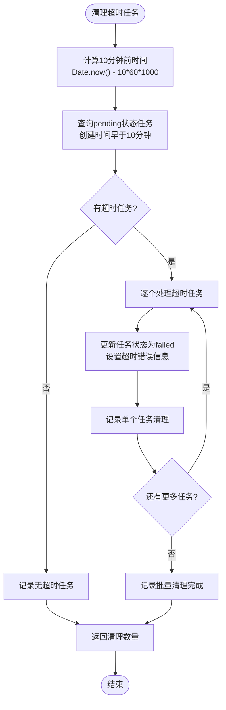
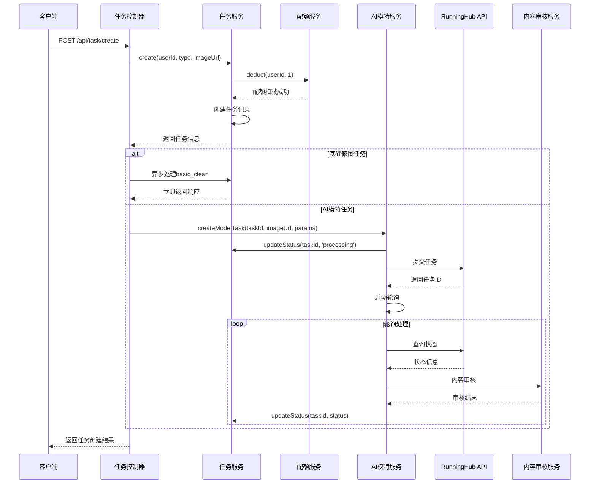
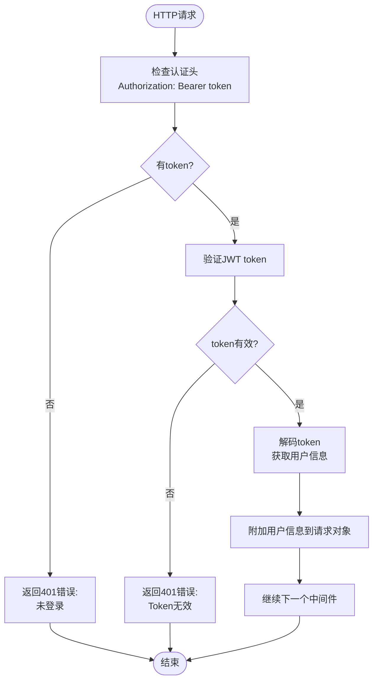

# 任务服务深度文档

<cite>
**本文档引用的文件**
- [task.service.js](file://backend/src/services/task.service.js)
- [task.controller.js](file://backend/src/controllers/task.controller.js)
- [task.routes.js](file://backend/src/routes/task.routes.js)
- [quota.service.js](file://backend/src/services/quota.service.js)
- [aiModel.service.js](file://backend/src/services/aiModel.service.js)
- [auth.middleware.js](file://backend/src/middlewares/auth.middleware.js)
- [create_tasks_table.js](file://backend/src/db/migrations/20251028000003_create_tasks_table.js)
- [server.js](file://backend/src/server.js)
- [app.js](file://backend/src/app.js)
</cite>

## 目录
1. [简介](#简介)
2. [项目结构](#项目结构)
3. [核心组件](#核心组件)
4. [架构概览](#架构概览)
5. [详细组件分析](#详细组件分析)
6. [任务生命周期管理](#任务生命周期管理)
7. [异步处理协调机制](#异步处理协调机制)
8. [权限控制与数据安全](#权限控制与数据安全)
9. [性能优化考虑](#性能优化考虑)
10. [故障排除指南](#故障排除指南)
11. [总结](#总结)

## 简介

任务服务是AI照片处理平台的核心组件，负责管理用户创建的各种AI处理任务，包括基础图像清理、AI模特12分镜生成等。该服务采用异步处理架构，支持任务状态跟踪、配额管理、权限控制和超时清理等功能。

## 项目结构

任务服务相关的文件组织结构如下：



**图表来源**
- [task.service.js](file://backend/src/services/task.service.js#L1-L259)
- [task.controller.js](file://backend/src/controllers/task.controller.js#L1-L173)
- [task.routes.js](file://backend/src/routes/task.routes.js#L1-L24)

**章节来源**
- [task.service.js](file://backend/src/services/task.service.js#L1-L259)
- [task.controller.js](file://backend/src/controllers/task.controller.js#L1-L173)
- [task.routes.js](file://backend/src/routes/task.routes.js#L1-L24)

## 核心组件

任务服务包含以下核心组件：

### 任务服务 (TaskService)
负责任务的创建、查询、状态更新和超时清理等核心功能。

### 任务控制器 (TaskController)
处理HTTP请求，协调任务服务与其他服务的交互。

### 配额服务 (QuotaService)
管理用户配额的扣减、返还和检查功能。

### AI模特服务 (AIModelService)
集成RunningHub API，处理AI模特12分镜生成任务。

**章节来源**
- [task.service.js](file://backend/src/services/task.service.js#L1-L50)
- [task.controller.js](file://backend/src/controllers/task.controller.js#L1-L30)
- [quota.service.js](file://backend/src/services/quota.service.js#L1-L50)
- [aiModel.service.js](file://backend/src/services/aiModel.service.js#L1-L50)

## 架构概览

任务服务采用分层架构设计，确保职责分离和高可用性：



**图表来源**
- [app.js](file://backend/src/app.js#L1-L52)
- [server.js](file://backend/src/server.js#L1-L41)
- [task.controller.js](file://backend/src/controllers/task.controller.js#L1-L173)

## 详细组件分析

### 任务服务核心类

任务服务是一个单例类，提供完整的任务管理功能：



**图表来源**
- [task.service.js](file://backend/src/services/task.service.js#L7-L259)
- [quota.service.js](file://backend/src/services/quota.service.js#L8-L130)
- [aiModel.service.js](file://backend/src/services/aiModel.service.js#L25-L345)

**章节来源**
- [task.service.js](file://backend/src/services/task.service.js#L7-L259)
- [quota.service.js](file://backend/src/services/quota.service.js#L8-L130)
- [aiModel.service.js](file://backend/src/services/aiModel.service.js#L25-L345)

### 任务类型与状态管理

系统支持两种主要任务类型：

| 任务类型 | 描述 | 处理方式 | 状态流转 |
|---------|------|----------|----------|
| basic_clean | 基础图像清理 | 同步处理 | pending → processing → success/failed |
| model_pose12 | AI模特12分镜 | 异步处理 | pending → processing → success/failed |

任务状态定义：
- `pending`: 任务已创建，等待处理
- `processing`: 任务正在处理中
- `success`: 任务处理成功
- `failed`: 任务处理失败

**章节来源**
- [task.service.js](file://backend/src/services/task.service.js#L12-L18)
- [task.service.js](file://backend/src/services/task.service.js#L40-L50)

## 任务生命周期管理

### create方法深度分析

create方法实现了完整的任务创建流程，包含严格的验证和事务处理：



**图表来源**
- [task.service.js](file://backend/src/services/task.service.js#L12-L50)

#### 任务类型验证

系统严格验证任务类型，确保只接受预定义的有效类型：

```javascript
// 任务类型验证逻辑
const validTypes = ['basic_clean', 'model_pose12'];
if (!validTypes.includes(type)) {
  throw { errorCode: 4001, message: '无效的任务类型' };
}
```

#### 会员权限检查

系统通过数据库查询确认用户会员状态：

```javascript
// 会员状态检查
const user = await db('users').where('id', userId).first();
if (!user) {
  throw { errorCode: 4004, message: '用户不存在' };
}
if (!user.isMember) {
  throw { errorCode: 4003, message: '请先开通会员' };
}
```

#### 配额扣减依赖

配额扣减使用数据库事务确保原子性：

```javascript
// 配额扣减事务
await db.transaction(async (trx) => {
  // 行锁查询用户
  const user = await trx('users')
    .where('id', userId)
    .forUpdate()
    .first();
  
  // 原子扣减
  await trx('users')
    .where('id', userId)
    .decrement('quota_remaining', amount);
});
```

**章节来源**
- [task.service.js](file://backend/src/services/task.service.js#L12-L50)
- [quota.service.js](file://backend/src/services/quota.service.js#L12-L50)

### get方法权限控制

get方法实现了严格的权限控制机制：



**图表来源**
- [task.service.js](file://backend/src/services/task.service.js#L52-L85)

**章节来源**
- [task.service.js](file://backend/src/services/task.service.js#L52-L85)

### list方法数据格式化

list方法提供了灵活的查询和分页功能：



**图表来源**
- [task.service.js](file://backend/src/services/task.service.js#L87-L187)

**章节来源**
- [task.service.js](file://backend/src/services/task.service.js#L87-L187)

## 异步处理协调机制

### updateStatus方法状态变更

updateStatus方法负责任务状态的更新和相关逻辑处理：



**图表来源**
- [task.service.js](file://backend/src/services/task.service.js#L95-L135)

#### 完成时间记录机制

当任务进入成功或失败状态时，系统自动记录完成时间：

```javascript
// 完成时间记录
if (status === 'success' || status === 'failed') {
  updateData.completed_at = new Date();
}
```

#### 配额返还机制

任务失败时，系统自动返还已扣除的配额：

```javascript
// 失败时的配额返还
if (status === 'failed') {
  const task = await db('tasks').where('id', taskId).first();
  if (task) {
    await quotaService.refund(task.userId, 1, `任务失败返还:${taskId}`);
  }
}
```

**章节来源**
- [task.service.js](file://backend/src/services/task.service.js#L95-L135)

### cleanupTimeoutTasks定时任务

cleanupTimeoutTasks方法实现了10分钟超时清理机制：



**图表来源**
- [task.service.js](file://backend/src/services/task.service.js#L195-L257)

#### 执行策略

清理任务采用以下策略：
- 时间窗口：10分钟超时
- 状态过滤：仅处理pending状态
- 错误信息：统一设置为"任务超时(10分钟未处理)"
- 批量处理：逐个更新以避免长时间锁定

**章节来源**
- [task.service.js](file://backend/src/services/task.service.js#L195-L257)

### 与AIModelService的协作关系

AIModelService与TaskService紧密协作，实现复杂的异步处理流程：



**图表来源**
- [task.controller.js](file://backend/src/controllers/task.controller.js#L12-L60)
- [aiModel.service.js](file://backend/src/services/aiModel.service.js#L100-L150)
- [task.service.js](file://backend/src/services/task.service.js#L95-L135)

**章节来源**
- [task.controller.js](file://backend/src/controllers/task.controller.js#L12-L60)
- [aiModel.service.js](file://backend/src/services/aiModel.service.js#L100-L150)
- [task.service.js](file://backend/src/services/task.service.js#L95-L135)

## 权限控制与数据安全

### 认证中间件机制

系统使用JWT认证中间件确保请求的安全性：



**图表来源**
- [auth.middleware.js](file://backend/src/middlewares/auth.middleware.js#L6-L40)

#### 权限验证规则

1. **任务查询权限**：用户只能访问自己的任务
2. **任务创建权限**：需要有效的会员状态
3. **状态更新权限**：内部接口使用，管理员可操作

**章节来源**
- [auth.middleware.js](file://backend/src/middlewares/auth.middleware.js#L6-L40)
- [task.service.js](file://backend/src/services/task.service.js#L52-L65)

### 数据格式化与安全

系统对敏感数据进行适当的格式化处理：

```javascript
// 任务详情格式化
return {
  id: task.id,
  type: task.type,
  status: task.status,
  inputImageUrl: task.inputImageUrl,
  params: task.params ? JSON.parse(task.params) : {},
  resultUrls: task.resultUrls ? JSON.parse(task.resultUrls) : [],
  errorMessage: task.errorMessage,
  createdAt: task.created_at,
  updatedAt: task.updated_at,
  completedAt: task.completed_at
};
```

**章节来源**
- [task.service.js](file://backend/src/services/task.service.js#L66-L85)
- [task.service.js](file://backend/src/services/task.service.js#L170-L187)

## 性能优化考虑

### 并发处理注意事项

1. **配额扣减的并发保护**
   - 使用数据库行锁防止并发竞争
   - 事务保证原子性
   - 非负约束确保配额不会变为负数

2. **任务状态更新的并发处理**
   - 使用乐观锁避免死锁
   - 异步处理减少阻塞
   - 批量操作提高效率

3. **超时清理的资源管理**
   - 定时任务避免频繁扫描
   - 逐个处理减少锁定时间
   - 日志记录便于监控

### 数据库优化策略

1. **索引设计**
   - `userId`索引：加速用户任务查询
   - `(userId, created_at)`复合索引：优化分页查询
   - `status`索引：加速状态筛选

2. **查询优化**
   - 使用LIMIT和OFFSET进行分页
   - 分离COUNT查询避免性能问题
   - 条件查询减少数据传输

**章节来源**
- [quota.service.js](file://backend/src/services/quota.service.js#L12-L50)
- [task.service.js](file://backend/src/services/task.service.js#L87-L187)
- [create_tasks_table.js](file://backend/src/db/migrations/20251028000003_create_tasks_table.js#L12-L25)

## 故障排除指南

### 常见错误处理

| 错误代码 | 错误消息 | 可能原因 | 解决方案 |
|---------|---------|----------|----------|
| 4001 | 无效的任务类型 | 任务类型不在允许列表中 | 检查任务类型参数 |
| 4003 | 请先开通会员 | 用户非会员状态 | 购买会员服务 |
| 4004 | 用户不存在 | 用户ID无效 | 检查用户认证状态 |
| 4003 | 无权访问该任务 | 任务不属于当前用户 | 检查任务所有权 |
| 4004 | 任务不存在 | 任务ID无效 | 检查任务ID参数 |

### 超时处理机制

1. **任务超时检测**
   - 定时任务每10分钟运行一次
   - 自动将超时任务标记为失败
   - 记录详细的超时信息

2. **异步任务监控**
   - RunningHub API状态轮询
   - 内容审核失败处理
   - 异常情况自动重试

**章节来源**
- [task.service.js](file://backend/src/services/task.service.js#L195-L257)
- [aiModel.service.js](file://backend/src/services/aiModel.service.js#L250-L300)

## 总结

任务服务作为AI照片处理平台的核心组件，实现了完整的任务生命周期管理。其主要特点包括：

1. **完善的任务管理**：支持多种任务类型，提供完整的CRUD操作
2. **严格的权限控制**：确保数据安全和用户隐私
3. **可靠的异步处理**：通过状态跟踪和超时清理保证系统稳定性
4. **高效的配额管理**：使用事务和行锁确保配额系统的准确性
5. **良好的扩展性**：模块化设计便于功能扩展和维护

该服务为整个平台提供了稳定可靠的任务处理能力，支撑了用户的各种AI图像处理需求。通过合理的架构设计和完善的错误处理机制，确保了系统的高可用性和用户体验。