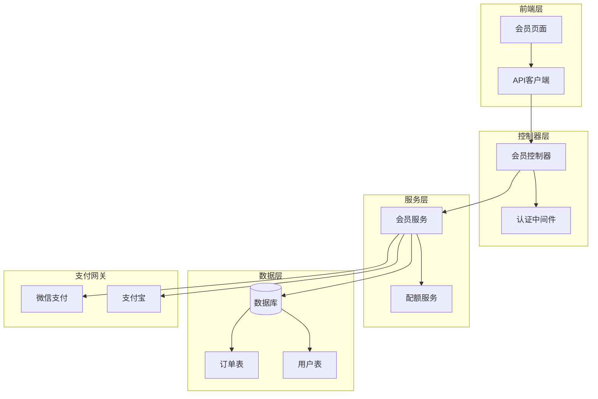
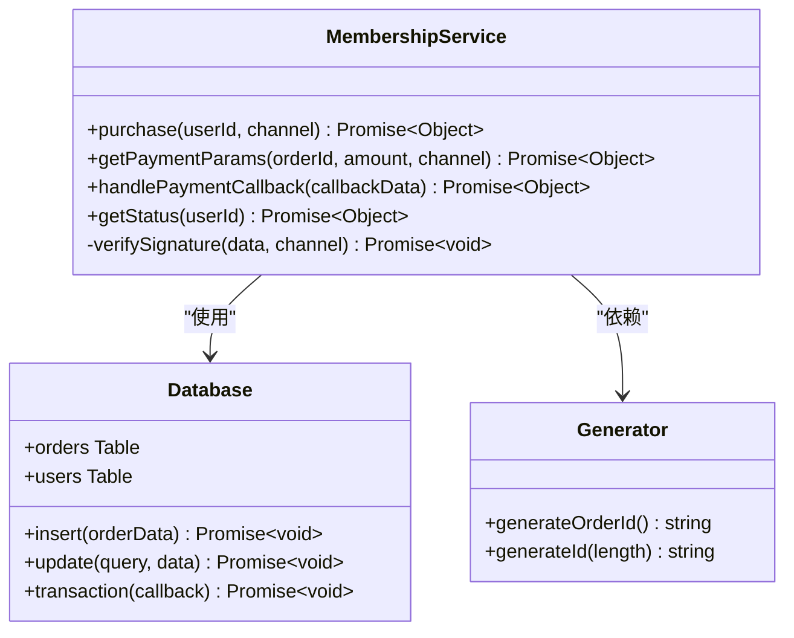
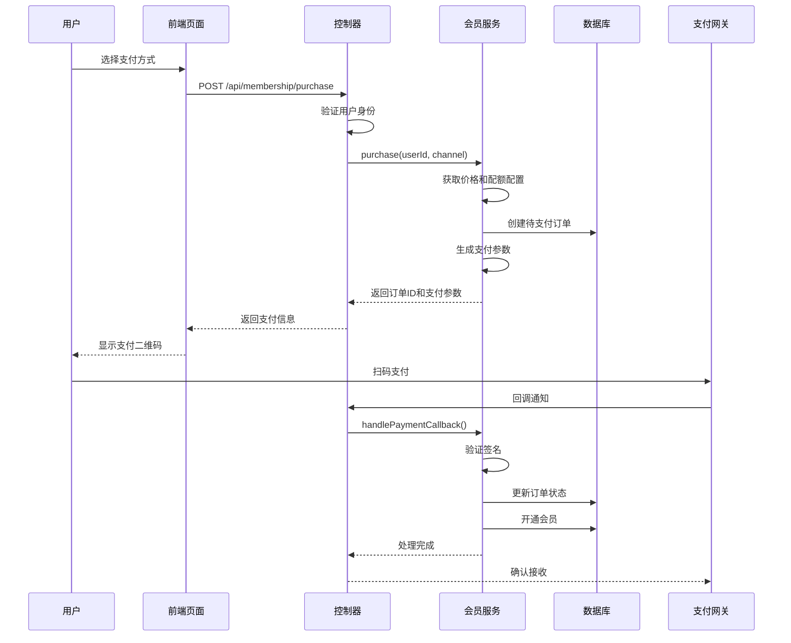
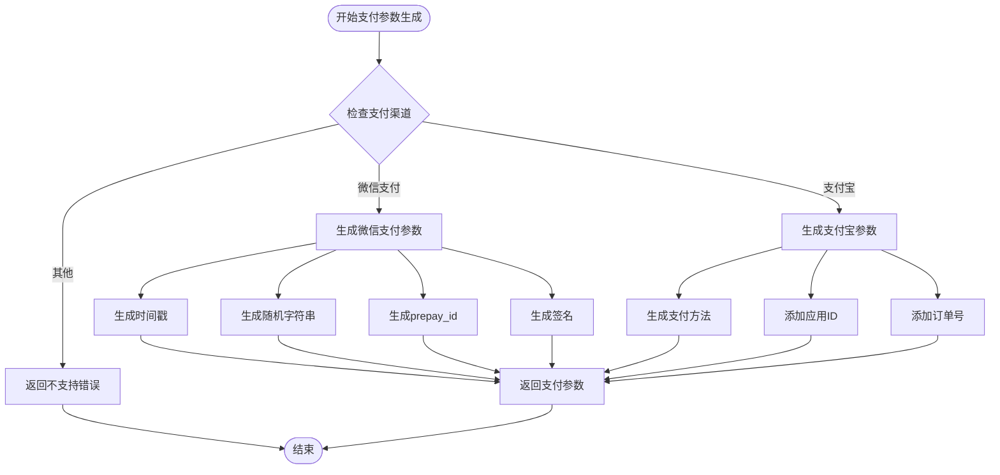
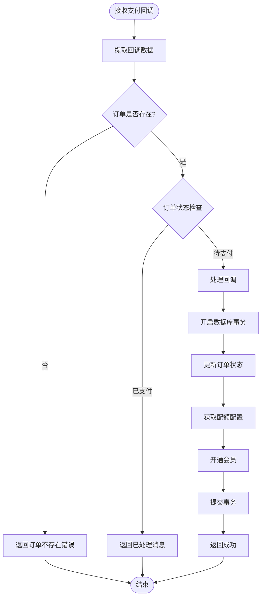
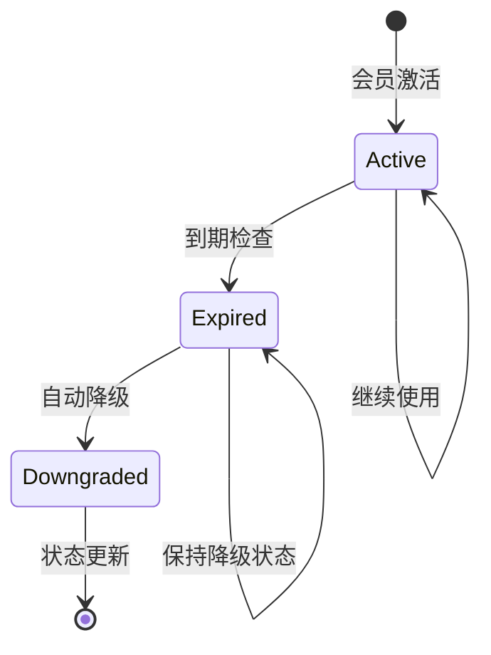
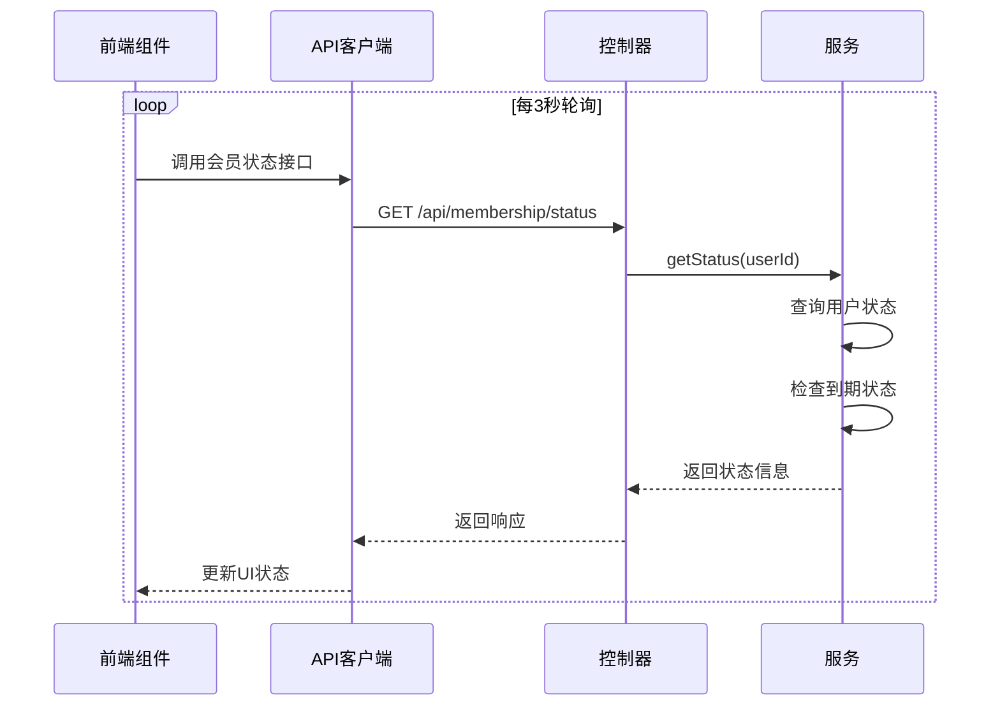
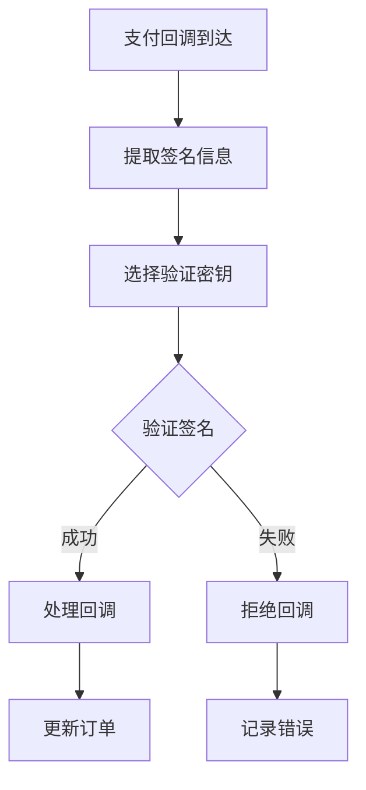
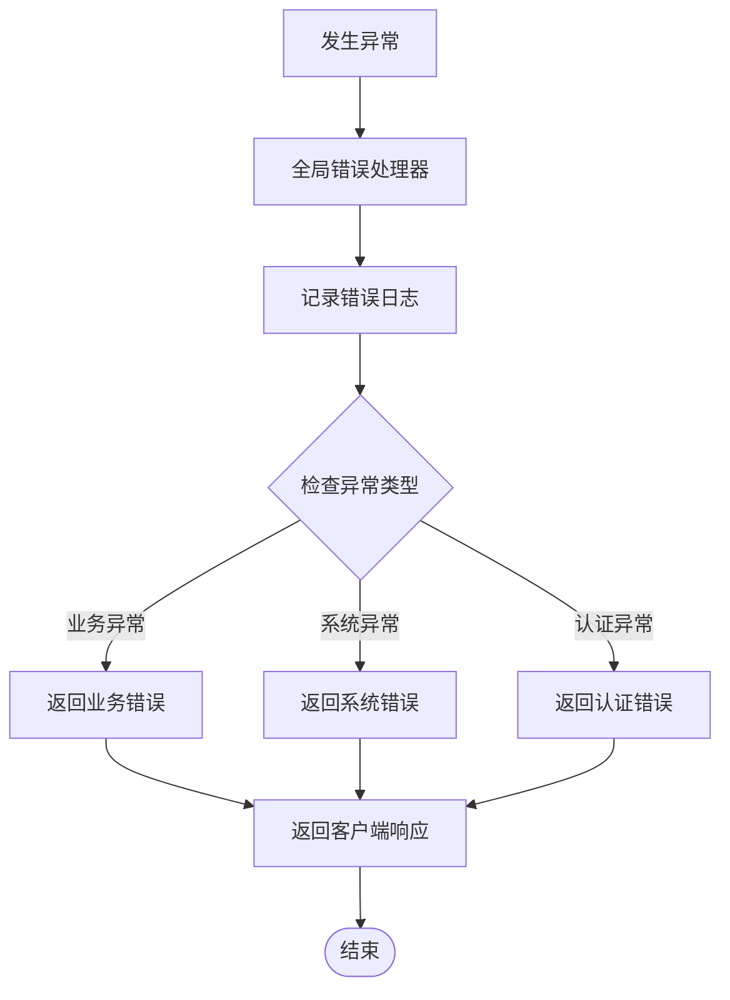

# 会员服务

<cite>
**本文档引用的文件**
- [membership.service.js](file://backend/src/services/membership.service.js)
- [membership.controller.js](file://backend/src/controllers/membership.controller.js)
- [membership.routes.js](file://backend/src/routes/membership.routes.js)
- [create_orders_table.js](file://backend/src/db/migrations/20251028000002_create_orders_table.js)
- [generator.js](file://backend/src/utils/generator.js)
- [errorHandler.middleware.js](file://backend/src/middlewares/errorHandler.middleware.js)
- [auth.middleware.js](file://backend/src/middlewares/auth.middleware.js)
- [membership.page.tsx](file://frontend/src/app/membership/page.tsx)
- [api.ts](file://frontend/src/lib/api.ts)
</cite>

## 目录
1. [简介](#简介)
2. [系统架构](#系统架构)
3. [核心组件分析](#核心组件分析)
4. [会员购买流程](#会员购买流程)
5. [支付回调处理机制](#支付回调处理机制)
6. [会员状态管理](#会员状态管理)
7. [支付安全与验证](#支付安全与验证)
8. [异常处理机制](#异常处理机制)
9. [性能优化考虑](#性能优化考虑)
10. [故障排除指南](#故障排除指南)

## 简介

会员服务是本系统的核心商业模块，提供基于订阅模式的会员购买、支付处理和配额管理功能。系统采用微信支付和支付宝双渠道支付方案，支持自动化的会员开通、配额分配和到期管理。

### 主要特性

- **双渠道支付支持**：兼容微信支付和支付宝支付
- **自动化会员管理**：自动开通会员、分配配额、设置有效期
- **幂等性保障**：确保支付回调的重复处理不会产生副作用
- **自动降级机制**：会员到期后自动降级为普通用户
- **实时状态查询**：提供会员状态的实时查询接口

## 系统架构

**图表来源**
- [membership.controller.js](file://backend/src/controllers/membership.controller.js#L1-L78)
- [membership.service.js](file://backend/src/services/membership.service.js#L1-L191)
- [membership.routes.js](file://backend/src/routes/membership.routes.js#L1-L28)

## 核心组件分析

### 会员服务类 (MembershipService)

会员服务是整个会员系统的核心，负责处理会员购买、支付参数生成、支付回调处理和会员状态管理。

**图表来源**
- [membership.service.js](file://backend/src/services/membership.service.js#L6-L191)
- [generator.js](file://backend/src/utils/generator.js#L30-L40)

**章节来源**
- [membership.service.js](file://backend/src/services/membership.service.js#L1-L191)

### 数据库架构

系统使用两个核心表来支撑会员功能：

| 表名 | 字段 | 类型 | 描述 |
|------|------|------|------|
| orders | id | string(32) | 订单唯一标识符 |
| orders | userId | string(32) | 关联用户ID |
| orders | status | string(20) | 订单状态(pending/paid) |
| orders | amount | decimal(10,2) | 订单金额(分) |
| orders | channel | string(20) | 支付渠道(wx/alipay) |
| orders | transactionId | string(64) | 第三方交易号 |
| orders | createdAt | datetime | 订单创建时间 |
| orders | paidAt | datetime | 支付完成时间 |

**章节来源**
- [create_orders_table.js](file://backend/src/db/migrations/20251028000002_create_orders_table.js#L1-L31)

## 会员购买流程

会员购买流程是一个完整的端到端流程，从订单创建到支付完成的全过程。

**图表来源**
- [membership.controller.js](file://backend/src/controllers/membership.controller.js#L10-L35)
- [membership.service.js](file://backend/src/services/membership.service.js#L12-L37)

### 订单创建与支付参数生成

购买流程的第一步是创建订单并生成支付参数：

1. **价格与配额配置**：从环境变量读取会员价格和配额配置
2. **订单创建**：生成唯一订单ID，插入待支付状态订单
3. **支付参数生成**：根据支付渠道生成相应的支付参数

**章节来源**
- [membership.service.js](file://backend/src/services/membership.service.js#L12-L37)

### 支付参数模拟实现

系统目前使用模拟支付参数，实际生产环境中需要集成真实的支付SDK：

**图表来源**
- [membership.service.js](file://backend/src/services/membership.service.js#L47-L75)

**章节来源**
- [membership.service.js](file://backend/src/services/membership.service.js#L47-L75)

## 支付回调处理机制

支付回调处理是会员系统的关键环节，需要确保支付结果的准确性和系统的稳定性。

### 幂等性控制

系统实现了严格的幂等性控制，防止重复回调导致的重复处理：

**图表来源**
- [membership.service.js](file://backend/src/services/membership.service.js#L86-L133)

### 事务性会员开通

会员开通过程使用数据库事务确保数据一致性：

1. **订单状态更新**：将订单状态从"待支付"更新为"已支付"
2. **配额配置获取**：从环境变量读取配额和有效期配置
3. **会员开通**：更新用户表，设置会员状态和配额信息

**章节来源**
- [membership.service.js](file://backend/src/services/membership.service.js#L86-L133)

### 自动降级机制

系统实现了智能的会员自动降级机制：

**图表来源**
- [membership.service.js](file://backend/src/services/membership.service.js#L135-L189)

**章节来源**
- [membership.service.js](file://backend/src/services/membership.service.js#L135-L189)

## 会员状态管理

会员状态管理提供了完整的会员生命周期管理功能。

### 状态查询接口

状态查询接口返回详细的会员信息：

| 字段 | 类型 | 描述 |
|------|------|------|
| isMember | boolean | 是否为会员 |
| quota_remaining | number | 剩余配额数量 |
| quota_expireAt | string \| null | 配额到期时间 |
| expireDays | number | 剩余有效天数 |
| price | number | 会员价格(分) |

**章节来源**
- [membership.service.js](file://backend/src/services/membership.service.js#L135-L189)

### 前端状态同步

前端通过定期轮询获取最新的会员状态：

**图表来源**
- [membership.page.tsx](file://frontend/src/app/membership/page.tsx#L44-L93)
- [api.ts](file://frontend/src/lib/api.ts#L60-L65)

**章节来源**
- [membership.page.tsx](file://frontend/src/app/membership/page.tsx#L44-L93)

## 支付安全与验证

### 签名验证机制

虽然当前实现为TODO状态，但系统预留了支付签名验证的扩展点：

**图表来源**
- [membership.service.js](file://backend/src/services/membership.service.js#L86-L88)

### 支付安全最佳实践

1. **签名验证**：验证支付平台返回的数据完整性
2. **金额校验**：确认支付金额与订单金额一致
3. **商户号验证**：确保回调来自正确的商户
4. **重复处理防护**：通过订单状态实现幂等性

**章节来源**
- [membership.service.js](file://backend/src/services/membership.service.js#L86-L88)

## 异常处理机制

系统实现了完善的异常处理机制，确保各种异常情况都能得到妥善处理。

### 错误分类与处理

| 错误类型 | HTTP状态码 | 错误代码 | 处理方式 |
|----------|------------|----------|----------|
| 订单不存在 | 404 | 5002 | 返回订单不存在错误 |
| 支付渠道错误 | 400 | 5003 | 返回支付渠道不支持错误 |
| 用户不存在 | 404 | 1004 | 返回用户不存在错误 |
| 系统内部错误 | 500 | 9999 | 记录日志并返回通用错误 |

**章节来源**
- [membership.service.js](file://backend/src/services/membership.service.js#L89-L100)
- [errorHandler.middleware.js](file://backend/src/middlewares/errorHandler.middleware.js#L1-L46)

### 异常场景处理

**图表来源**
- [errorHandler.middleware.js](file://backend/src/middlewares/errorHandler.middleware.js#L5-L25)

**章节来源**
- [errorHandler.middleware.js](file://backend/src/middlewares/errorHandler.middleware.js#L1-L46)

## 性能优化考虑

### 数据库优化

1. **索引设计**：为订单表的关键字段建立适当索引
2. **查询优化**：使用适当的查询条件减少扫描范围
3. **连接池管理**：合理配置数据库连接池参数

### 缓存策略

虽然当前实现没有缓存，但可以考虑以下缓存策略：
- 用户会员状态缓存
- 支付配置信息缓存
- 订单状态查询缓存

### 并发控制

1. **事务隔离**：使用适当的事务隔离级别
2. **行级锁**：在关键操作中使用行级锁
3. **乐观锁**：在高并发场景下使用乐观锁策略

## 故障排除指南

### 常见问题与解决方案

#### 支付回调处理失败

**问题现象**：支付成功但会员未开通

**排查步骤**：
1. 检查支付回调URL是否正确配置
2. 验证回调数据格式是否符合支付平台要求
3. 检查数据库事务是否正常提交
4. 查看服务日志中的错误信息

**解决方案**：
- 确保回调接口的幂等性实现
- 添加更详细的日志记录
- 实现回调重试机制

#### 会员状态查询异常

**问题现象**：会员状态查询返回错误

**排查步骤**：
1. 检查用户ID是否有效
2. 验证数据库连接状态
3. 检查用户表结构是否正确

**解决方案**：
- 添加用户存在性检查
- 实现降级处理逻辑
- 提供默认状态返回

#### 支付参数生成失败

**问题现象**：无法生成支付参数

**排查步骤**：
1. 检查环境变量配置
2. 验证支付SDK集成状态
3. 检查网络连接状态

**解决方案**：
- 完善支付SDK集成
- 添加备用支付方案
- 实现支付参数缓存

### 监控与告警

建议实施以下监控指标：

1. **支付成功率**：监控支付回调的成功率
2. **订单处理延迟**：监控订单处理的平均时间
3. **会员开通成功率**：监控会员开通的成功率
4. **系统错误率**：监控系统异常的发生频率

**章节来源**
- [membership.service.js](file://backend/src/services/membership.service.js#L1-L191)
- [errorHandler.middleware.js](file://backend/src/middlewares/errorHandler.middleware.js#L1-L46)