# 内容审核服务安全文档

<cite>
**本文档引用的文件**
- [contentAudit.service.js](file://backend/src/services/contentAudit.service.js)
- [imageProcess.service.js](file://backend/src/services/imageProcess.service.js)
- [aiModel.service.js](file://backend/src/services/aiModel.service.js)
- [media.service.js](file://backend/src/services/media.service.js)
- [task.service.js](file://backend/src/services/task.service.js)
- [media.controller.js](file://backend/src/controllers/media.controller.js)
- [media.routes.js](file://backend/src/routes/media.routes.js)
- [errorHandler.middleware.js](file://backend/src/middlewares/errorHandler.middleware.js)
- [cos.js](file://backend/src/config/cos.js)
- [package.json](file://backend/package.json)
- [README.md](file://backend/README.md)
</cite>

## 目录
1. [概述](#概述)
2. [系统架构](#系统架构)
3. [核心组件分析](#核心组件分析)
4. [审核策略与配置](#审核策略与配置)
5. [批量审核机制](#批量审核机制)
6. [违规处置流程](#违规处置流程)
7. [COS权限控制](#cos权限控制)
8. [错误降级策略](#错误降级策略)
9. [拦截集成点](#拦截集成点)
10. [安全考虑](#安全考虑)
11. [监控与统计](#监控与统计)
12. [故障排除](#故障排除)

## 概述

内容审核服务是一个基于腾讯云IMS（智能媒体服务）的自动化内容安全过滤系统，负责检测和处理用户上传的图片内容中的色情、暴力、违法、广告等违规元素。该服务采用多层次的安全防护机制，确保平台内容的合规性和安全性。

### 主要功能特性

- **多维度内容检测**：支持色情、暴力、违法、广告等多种违规内容的识别
- **自动化审核流程**：提供完整的审核、处置、通知机制
- **批量处理能力**：支持任务结果的批量审核和统一处理
- **原子性操作**：确保审核失败时的数据一致性
- **错误降级保护**：审核服务异常时的默认通过机制
- **精细化权限控制**：基于STS的COS访问权限管理

## 系统架构

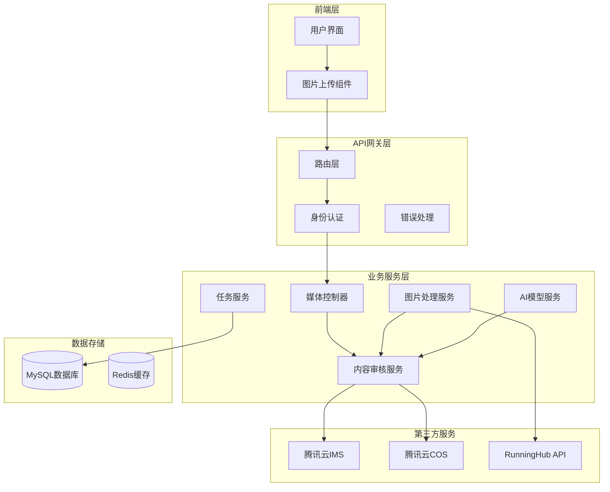

**架构图来源**
- [contentAudit.service.js](file://backend/src/services/contentAudit.service.js#L1-L230)
- [imageProcess.service.js](file://backend/src/services/imageProcess.service.js#L1-L482)
- [aiModel.service.js](file://backend/src/services/aiModel.service.js#L1-L345)

## 核心组件分析

### 内容审核服务 (ContentAuditService)

内容审核服务是整个安全体系的核心组件，负责集成腾讯云IMS进行图片内容检测。

#### 审核算法与判断逻辑

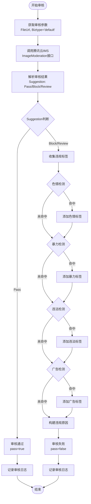

**流程图来源**
- [contentAudit.service.js](file://backend/src/services/contentAudit.service.js#L45-L105)

#### 审核结果结构

| 字段 | 类型 | 描述 |
|------|------|------|
| pass | Boolean | 审核是否通过 |
| reason | String | 违规原因描述 |
| suggestion | String | 腾讯云建议：Pass/Block/Review |
| rawResult | Object | 原始审核结果数据 |

**章节来源**
- [contentAudit.service.js](file://backend/src/services/contentAudit.service.js#L45-L105)

### 图片处理服务 (ImageProcessService)

图片处理服务负责商品抠图、白底处理、智能增强等图像处理功能，并集成内容审核拦截点。

#### 处理流程与拦截点

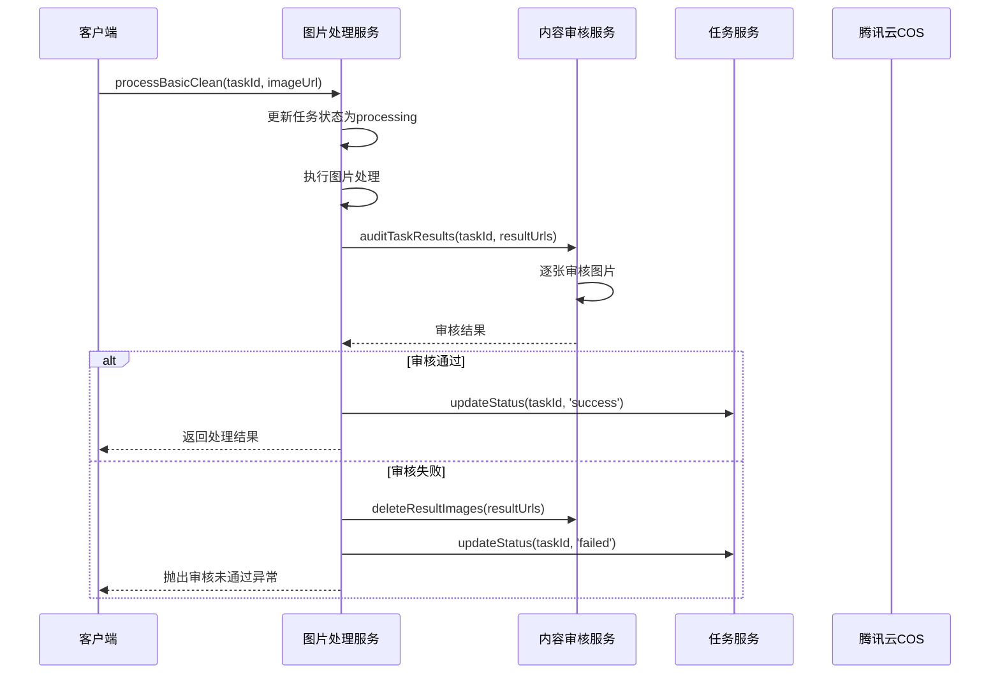

**序列图来源**
- [imageProcess.service.js](file://backend/src/services/imageProcess.service.js#L45-L120)
- [contentAudit.service.js](file://backend/src/services/contentAudit.service.js#L107-L155)

**章节来源**
- [imageProcess.service.js](file://backend/src/services/imageProcess.service.js#L45-L120)

### AI模型服务 (AIModelService)

AI模型服务集成RunningHub API进行AI模特12分镜生成功能，并在结果生成后进行内容审核。

#### AI生成内容的审核流程

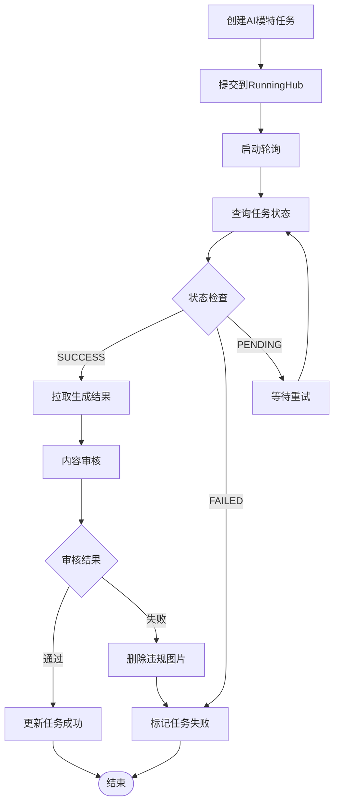

**流程图来源**
- [aiModel.service.js](file://backend/src/services/aiModel.service.js#L200-L280)

**章节来源**
- [aiModel.service.js](file://backend/src/services/aiModel.service.js#L200-L280)

## 审核策略与配置

### 腾讯云IMS配置

内容审核服务使用腾讯云IMS的默认策略进行多维度内容检测：

| 检测维度 | 检测标志 | 说明 |
|----------|----------|------|
| 色情内容 | PornInfo.HitFlag | 检测图片中的色情元素 |
| 暴力内容 | TerrorismInfo.HitFlag | 检测图片中的暴力、血腥元素 |
| 违法内容 | IllegalInfo.HitFlag | 检测图片中的违法、违规元素 |
| 广告内容 | AdsInfo.HitFlag | 检测图片中的商业广告元素 |

### 审核策略配置

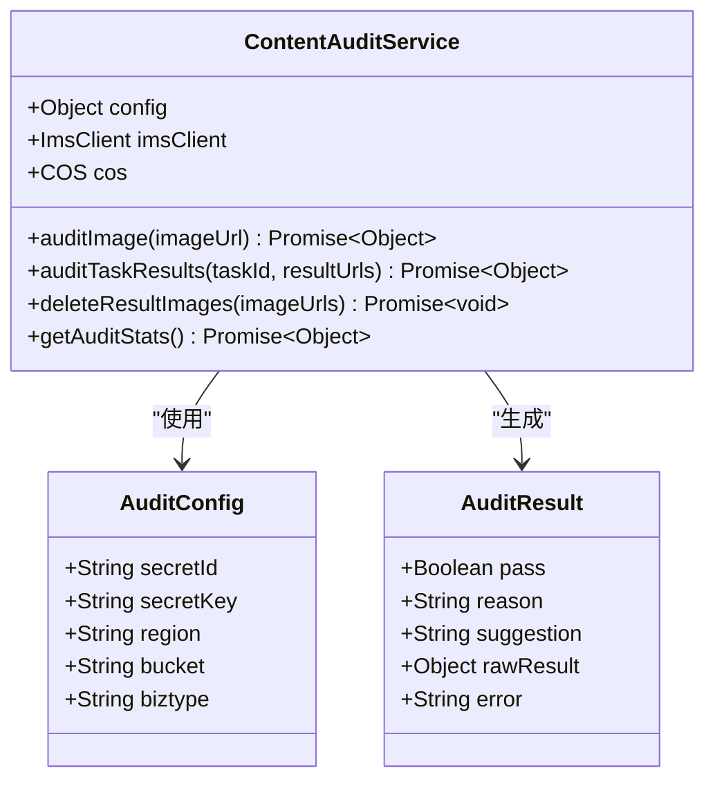

**类图来源**
- [contentAudit.service.js](file://backend/src/services/contentAudit.service.js#L10-L35)

**章节来源**
- [contentAudit.service.js](file://backend/src/services/contentAudit.service.js#L10-L35)

## 批量审核机制

### auditTaskResults批量审核流程

批量审核机制确保任务中的所有输出图片都能得到统一的安全检查：

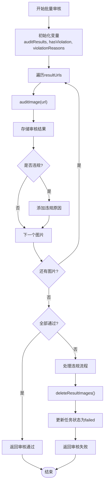

**流程图来源**
- [contentAudit.service.js](file://backend/src/services/contentAudit.service.js#L107-L155)

### 原子性操作保障

批量审核过程采用原子性操作确保数据一致性：

1. **审核阶段**：逐张审核所有图片
2. **违规检测**：收集所有违规信息
3. **统一处理**：一旦发现违规，立即执行删除和状态更新
4. **错误隔离**：单张图片审核失败不影响其他图片处理

**章节来源**
- [contentAudit.service.js](file://backend/src/services/contentAudit.service.js#L107-L155)

## 违规处置流程

### deleteResultImages自动删除机制

当检测到违规内容时，系统会自动执行以下处置流程：

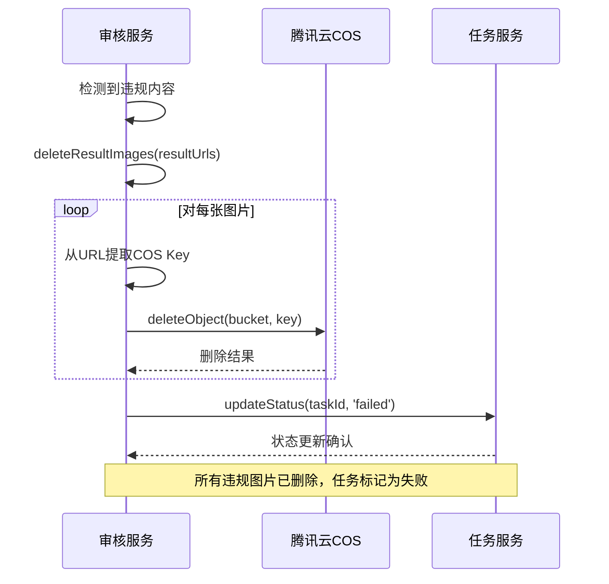

**序列图来源**
- [contentAudit.service.js](file://backend/src/services/contentAudit.service.js#L157-L195)

### 违规图片删除的安全机制

| 安全措施 | 实现方式 | 目的 |
|----------|----------|------|
| URL解析安全 | 使用URL构造函数解析 | 防止路径遍历攻击 |
| 批量删除 | Promise.all并行删除 | 提高删除效率 |
| 错误容忍 | 删除失败不抛出异常 | 确保主流程不受影响 |
| 日志记录 | 详细记录删除操作 | 提供审计追踪 |

**章节来源**
- [contentAudit.service.js](file://backend/src/services/contentAudit.service.js#L157-L195)

## COS权限控制

### STS临时密钥机制

媒体服务使用腾讯云STS（Security Token Service）提供精细化的COS访问权限控制：

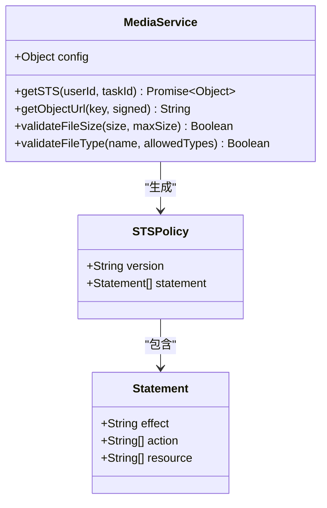

**类图来源**
- [media.service.js](file://backend/src/services/media.service.js#L10-L45)

### 权限控制策略

| 权限类型 | 操作范围 | 资源路径 | 有效期 |
|----------|----------|----------|--------|
| 上传权限 | PutObject, PostObject | `/input/{userId}/{taskId}/*` | 30分钟 |
| 分块上传 | InitiateMultipartUpload等 | `/input/{userId}/{taskId}/*` | 30分钟 |
| 文件访问 | GetObject | `/input/{userId}/{taskId}/*` | 30分钟 |

### COS路径安全设计

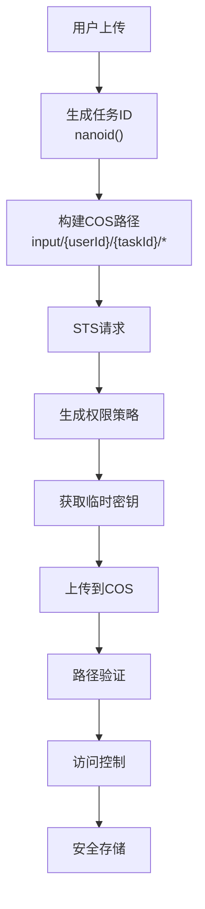

**流程图来源**
- [media.service.js](file://backend/src/services/media.service.js#L25-L75)

**章节来源**
- [media.service.js](file://backend/src/services/media.service.js#L25-L75)

## 错误降级策略

### 审核失败默认通过机制

为了确保系统的高可用性，内容审核服务实现了智能的错误降级策略：

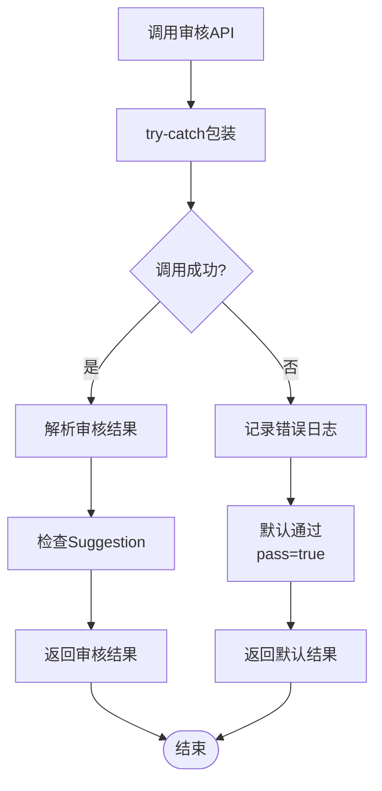

**流程图来源**
- [contentAudit.service.js](file://backend/src/services/contentAudit.service.js#L86-L100)

### 降级策略配置

| 场景 | 降级策略 | 原因 |
|------|----------|------|
| API调用失败 | 默认通过(pass=true) | 避免误杀正常内容 |
| 网络超时 | 默认通过(pass=true) | 确保服务可用性 |
| 腾讯云服务异常 | 默认通过(pass=true) | 保护用户体验 |
| 审核结果解析失败 | 默认通过(pass=true) | 防止系统崩溃 |

### 错误处理机制

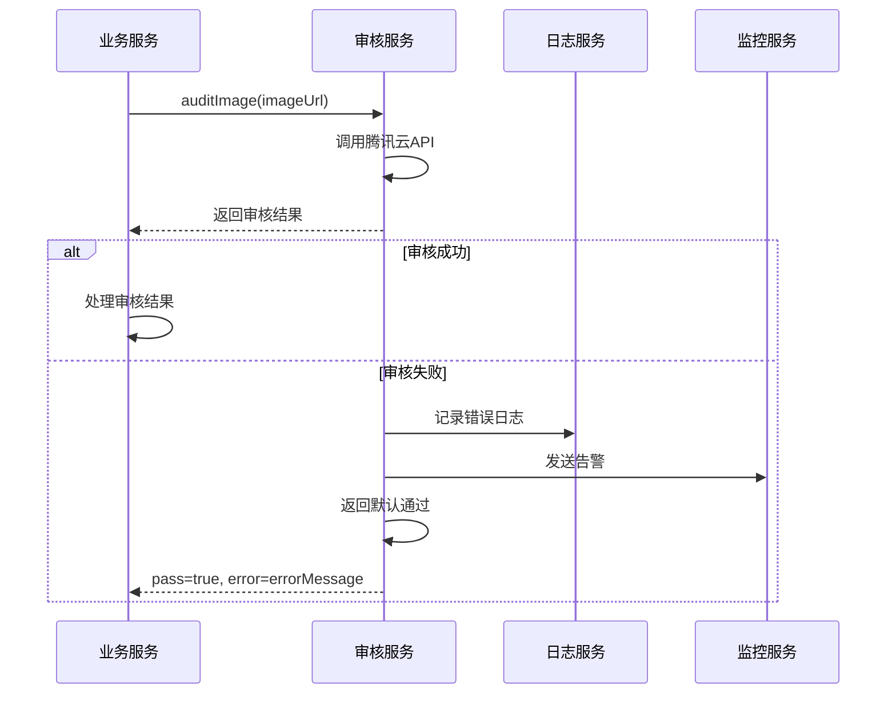

**序列图来源**
- [contentAudit.service.js](file://backend/src/services/contentAudit.service.js#L86-L100)

**章节来源**
- [contentAudit.service.js](file://backend/src/services/contentAudit.service.js#L86-L100)

## 拦截集成点

### 与imageProcess.service的集成

图片处理服务在关键节点集成内容审核拦截：

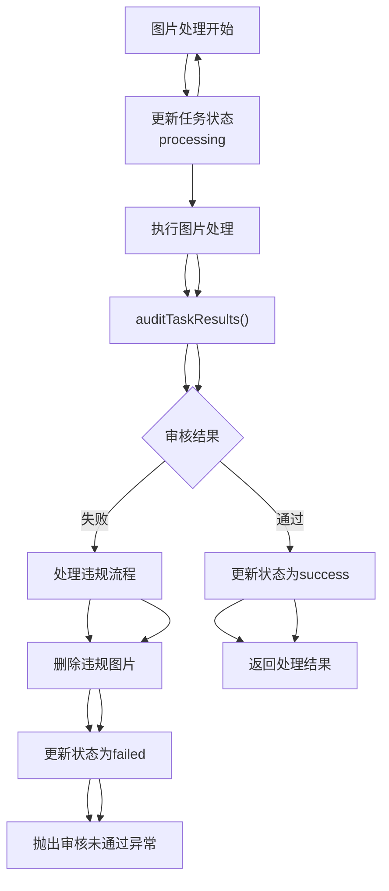

**流程图来源**
- [imageProcess.service.js](file://backend/src/services/imageProcess.service.js#L45-L120)

### 与aiModel.service的集成

AI模型服务在结果生成后进行内容审核：

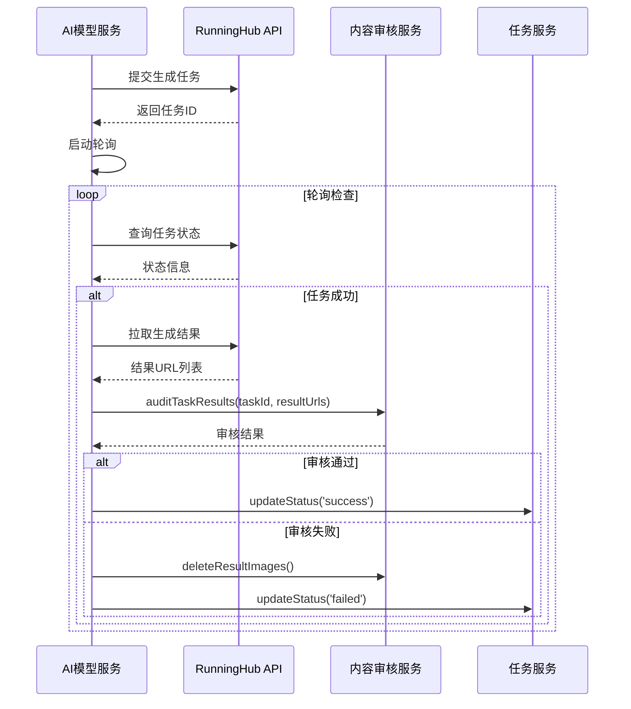

**序列图来源**
- [aiModel.service.js](file://backend/src/services/aiModel.service.js#L200-L280)

### 拦截点总结

| 服务 | 拦截点 | 处理方式 | 影响范围 |
|------|--------|----------|----------|
| imageProcess.service | 处理完成后 | 审核结果决定任务状态 | 单个任务 |
| aiModel.service | 结果生成后 | 审核结果决定任务状态 | 单个任务 |
| media.service | 上传前 | 文件类型和大小验证 | 单个文件 |
| task.service | 任务创建时 | 配额检查和权限验证 | 单个任务 |

**章节来源**
- [imageProcess.service.js](file://backend/src/services/imageProcess.service.js#L45-L120)
- [aiModel.service.js](file://backend/src/services/aiModel.service.js#L200-L280)

## 安全考虑

### 数据安全

1. **敏感信息保护**
   - 腾讯云API密钥通过环境变量管理
   - 不在日志中记录敏感信息
   - 使用STS临时密钥避免长期凭证暴露

2. **访问控制**
   - 基于用户ID和任务ID的路径隔离
   - 最小权限原则的STS策略
   - IP白名单和频率限制

3. **数据传输**
   - HTTPS加密传输
   - 临时密钥的时效性控制
   - COS对象的访问权限控制

### 系统安全

1. **错误处理**
   - 审核失败时的默认通过机制
   - 异常情况的日志记录和告警
   - 服务降级和熔断机制

2. **资源保护**
   - 文件大小和类型验证
   - 并发上传的速率限制
   - 存储空间的使用监控

3. **审计追踪**
   - 审核操作的完整日志记录
   - 违规内容的删除记录
   - 用户操作的行为审计

## 监控与统计

### getAuditStats统计功能

内容审核服务提供管理后台使用的审核能力元数据：

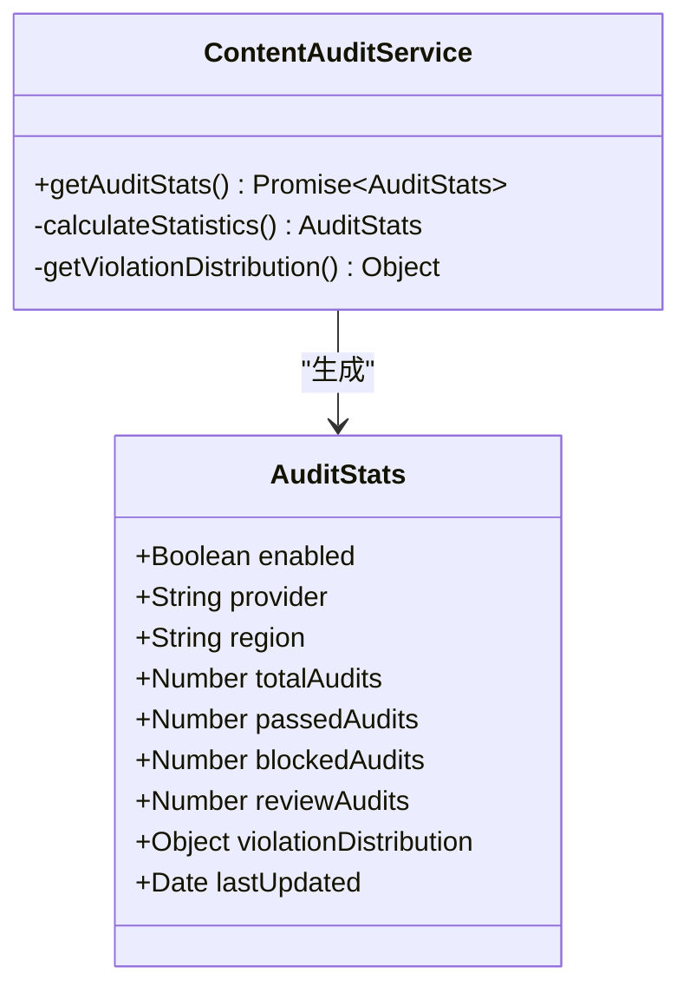

**类图来源**
- [contentAudit.service.js](file://backend/src/services/contentAudit.service.js#L200-L227)

### 监控指标

| 指标类别 | 具体指标 | 监控目的 |
|----------|----------|----------|
| 审核性能 | 审核响应时间、成功率 | 服务质量监控 |
| 安全指标 | 违规拦截率、误判率 | 安全效果评估 |
| 系统指标 | API调用次数、错误率 | 系统健康度 |
| 业务指标 | 日审核量、违规分布 | 业务发展跟踪 |

**章节来源**
- [contentAudit.service.js](file://backend/src/services/contentAudit.service.js#L200-L227)

## 故障排除

### 常见问题与解决方案

#### 审核服务异常

**问题现象**：审核服务返回错误或超时
**排查步骤**：
1. 检查腾讯云IMS服务状态
2. 验证API密钥配置
3. 检查网络连接状况
4. 查看错误日志详情

**解决方案**：
- 启用错误降级机制
- 设置合理的超时时间
- 实施重试策略

#### COS权限问题

**问题现象**：图片上传或删除失败
**排查步骤**：
1. 验证STS临时密钥有效性
2. 检查COS桶权限配置
3. 确认路径权限设置

**解决方案**：
- 重新生成STS临时密钥
- 调整COS权限策略
- 检查路径格式正确性

#### 批量处理异常

**问题现象**：批量审核过程中部分图片处理失败
**排查步骤**：
1. 检查单张图片的审核结果
2. 验证COS访问权限
3. 确认任务状态一致性

**解决方案**：
- 实施部分失败容忍机制
- 提供手动重试功能
- 记录详细的失败原因

### 日志分析

系统提供详细的日志记录用于问题诊断：

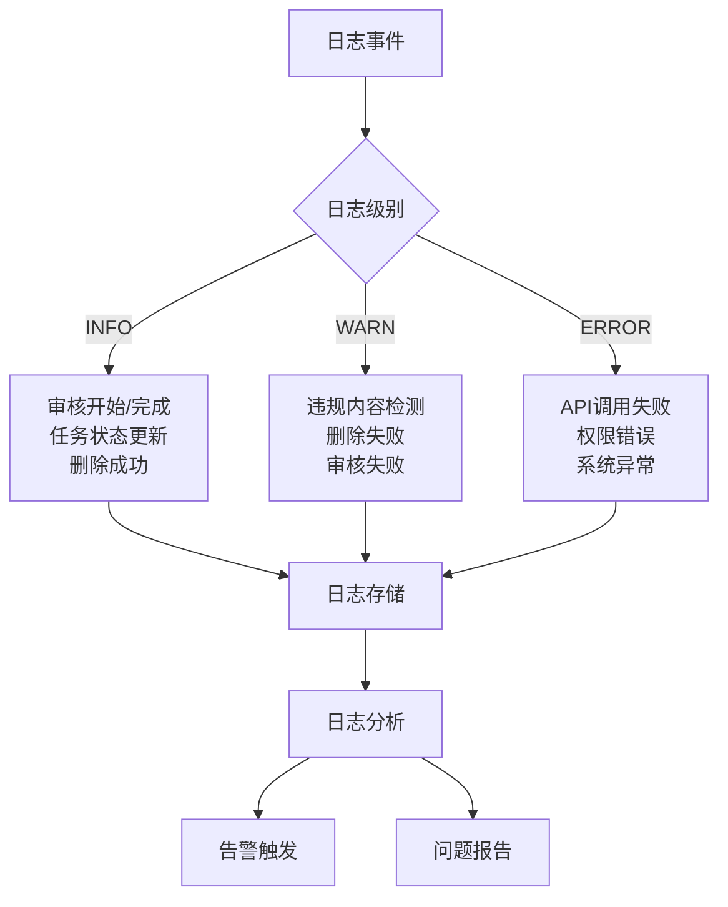

**章节来源**
- [contentAudit.service.js](file://backend/src/services/contentAudit.service.js#L86-L100)
- [errorHandler.middleware.js](file://backend/src/middlewares/errorHandler.middleware.js#L1-L46)

## 总结

内容审核服务通过多层次的安全防护机制，确保了平台内容的安全性和合规性。主要特点包括：

1. **全面的审核能力**：支持多种违规内容的检测和识别
2. **智能的降级策略**：在服务异常时保证系统可用性
3. **精细的权限控制**：基于STS的COS访问权限管理
4. **可靠的批量处理**：确保任务结果的一致性处理
5. **完善的监控体系**：提供全面的审计和统计功能

该服务为平台提供了坚实的安全保障，同时保持了良好的用户体验和服务质量。