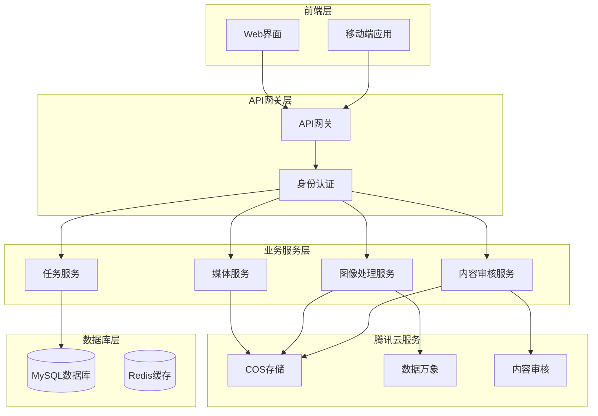
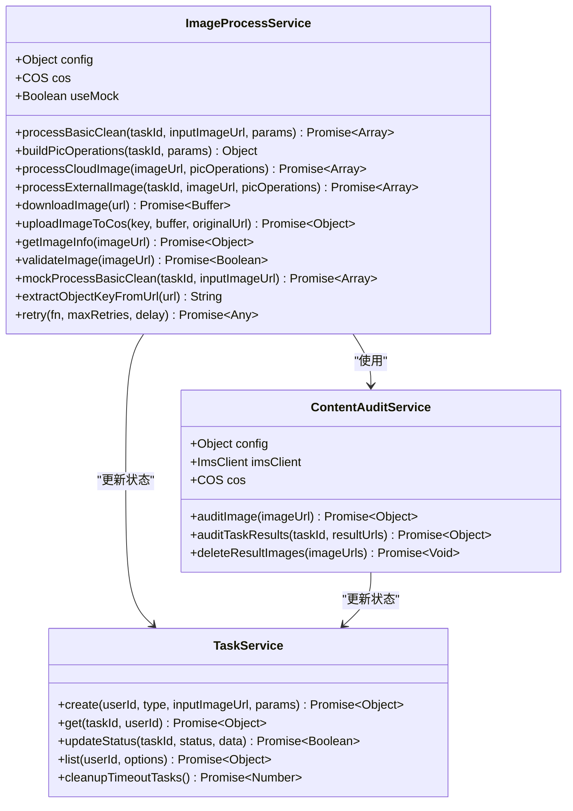
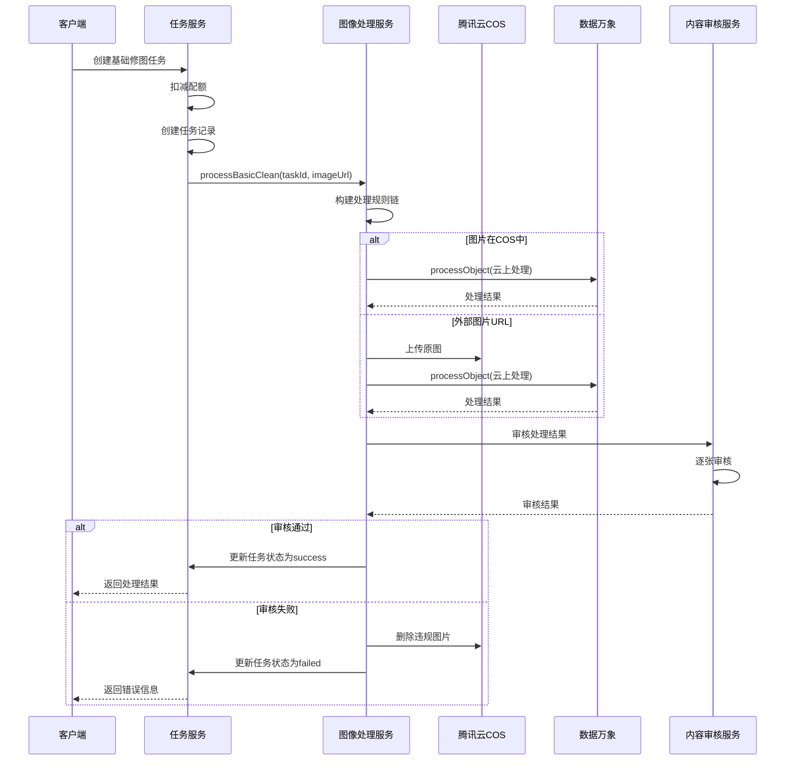
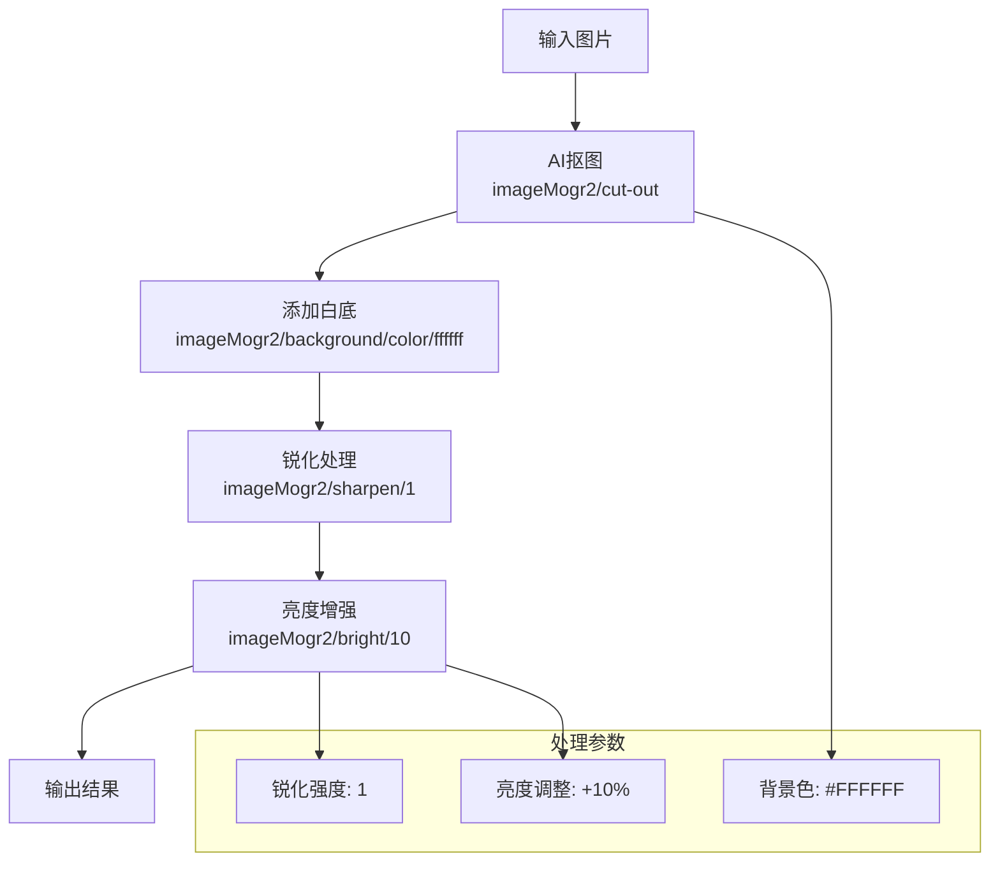
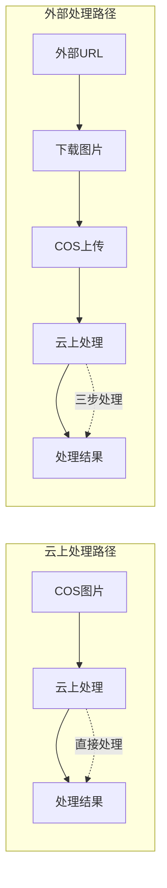
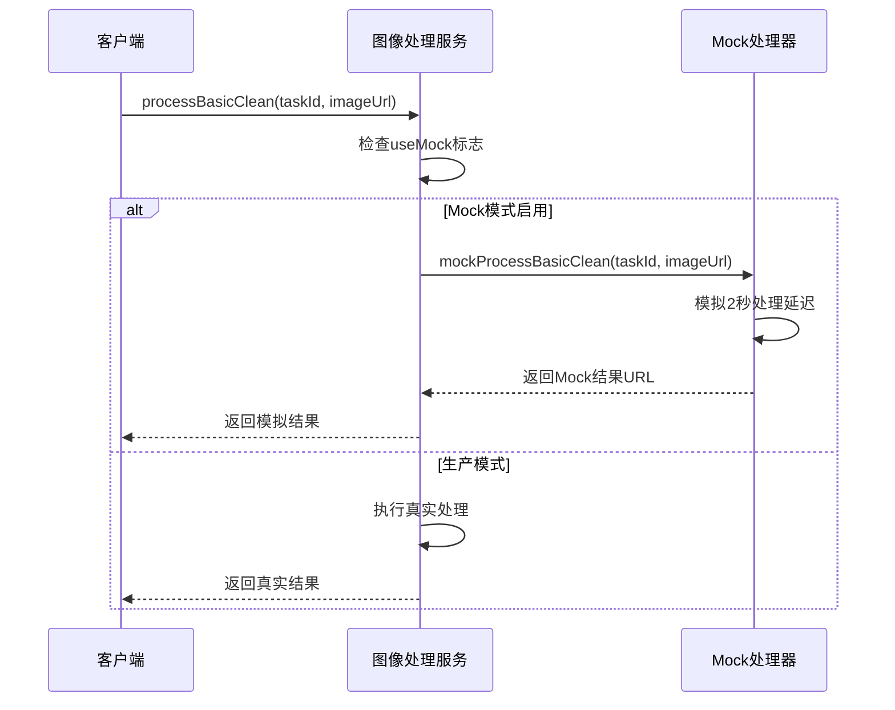
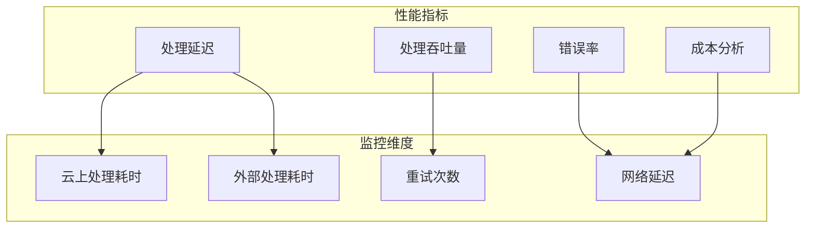
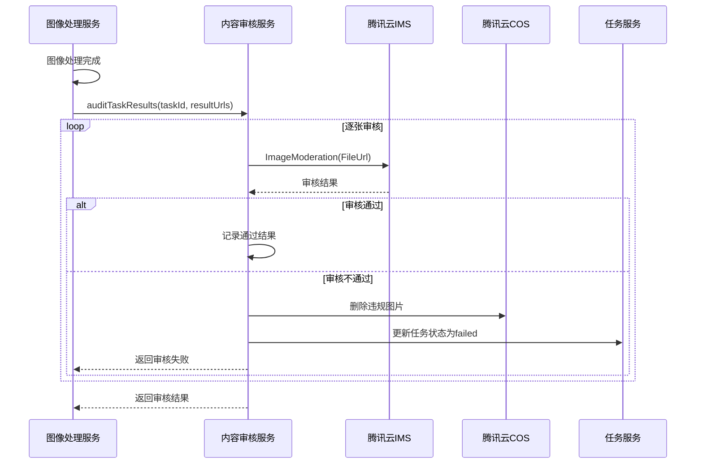

# 图像处理服务技术文档

<cite>
**本文档引用的文件**
- [imageProcess.service.js](file://backend/src/services/imageProcess.service.js)
- [cos.js](file://backend/src/config/cos.js)
- [media.service.js](file://backend/src/services/media.service.js)
- [contentAudit.service.js](file://backend/src/services/contentAudit.service.js)
- [task.service.js](file://backend/src/services/task.service.js)
- [media.controller.js](file://backend/src/controllers/media.controller.js)
- [media.routes.js](file://backend/src/routes/media.routes.js)
- [task.routes.js](file://backend/src/routes/task.routes.js)
- [package.json](file://backend/package.json)
- [README.md](file://backend/README.md)
</cite>

## 目录
1. [项目概述](#项目概述)
2. [系统架构](#系统架构)
3. [核心组件分析](#核心组件分析)
4. [图像处理流程](#图像处理流程)
5. [数据万象处理规则](#数据万象处理规则)
6. [处理路径对比](#处理路径对比)
7. [HTTP头设置与Content-Type推断](#http头设置与content-type推断)
8. [重试机制](#重试机制)
9. [Mock模式与开发用途](#mock模式与开发用途)
10. [性能考量与优化建议](#性能考量与优化建议)
11. [内容审核串联流程](#内容审核串联流程)
12. [故障排除指南](#故障排除指南)
13. [总结](#总结)

## 项目概述

本项目是一个基于腾讯云数据万象的图像处理服务，专门为服装AI处理SaaS平台提供高质量的图片修图能力。服务采用微服务架构，集成腾讯云COS存储、数据万象图像处理和内容审核服务，为用户提供商品抠图、白底填充、智能增强等专业级图像处理功能。

### 主要特性

- **智能抠图**: 基于AI的商品分割，实现精确的商品轮廓提取
- **多场景处理**: 支持云上数据处理和外部图片下载处理两种模式
- **内容安全**: 集成腾讯云内容审核，确保生成内容合规
- **高可用设计**: 包含重试机制和Mock模式，保证服务稳定性
- **性能优化**: 支持大文件处理和批量操作优化

**章节来源**
- [imageProcess.service.js](file://backend/src/services/imageProcess.service.js#L1-L50)
- [README.md](file://backend/README.md#L1-L30)

## 系统架构



**图表来源**
- [imageProcess.service.js](file://backend/src/services/imageProcess.service.js#L15-L35)
- [media.service.js](file://backend/src/services/media.service.js#L10-L25)

**章节来源**
- [imageProcess.service.js](file://backend/src/services/imageProcess.service.js#L1-L100)
- [cos.js](file://backend/src/config/cos.js#L1-L18)

## 核心组件分析

### 图像处理服务 (ImageProcessService)

图像处理服务是整个系统的核心组件，负责协调腾讯云数据万象的各项功能。



**图表来源**
- [imageProcess.service.js](file://backend/src/services/imageProcess.service.js#L15-L50)
- [contentAudit.service.js](file://backend/src/services/contentAudit.service.js#L15-L35)
- [task.service.js](file://backend/src/services/task.service.js#L10-L30)

### 配置管理系统

系统通过环境变量管理腾讯云配置，支持Mock模式和生产模式的无缝切换。

**章节来源**
- [imageProcess.service.js](file://backend/src/services/imageProcess.service.js#L15-L45)
- [cos.js](file://backend/src/config/cos.js#L1-L18)

## 图像处理流程

### 基础修图处理流程



**图表来源**
- [imageProcess.service.js](file://backend/src/services/imageProcess.service.js#L45-L120)
- [contentAudit.service.js](file://backend/src/services/contentAudit.service.js#L80-L150)

### 处理规则链构建

processBasicClean方法中的picOperations规则链是整个处理流程的核心，包含了三个连续的图像处理步骤：

#### 规则1: AI抠图处理
- **规则**: `imageMogr2/cut-out`
- **功能**: 使用AI算法进行商品分割，生成透明背景的抠图
- **输出**: `output/${taskId}/matting.png`

#### 规则2: 白底填充
- **规则**: `imageMogr2/cut-out|imageMogr2/background/color/ffffff`
- **功能**: 在抠图基础上添加纯白色背景
- **输出**: `output/${taskId}/white-bg.png`

#### 规则3: 智能增强
- **规则**: `imageMogr2/cut-out|imageMogr2/background/color/ffffff|imageMogr2/sharpen/1|imageMogr2/bright/10`
- **功能**: 
  - `sharpen/1`: 应用锐化滤镜提升图像清晰度
  - `bright/10`: 增加10%亮度，改善图像明暗度
- **输出**: `output/${taskId}/enhanced.png`

**章节来源**
- [imageProcess.service.js](file://backend/src/services/imageProcess.service.js#L120-L150)

## 数据万象处理规则

### 规则链详解

数据万象提供了强大的图像处理能力，通过规则链可以实现复杂的图像变换：



**图表来源**
- [imageProcess.service.js](file://backend/src/services/imageProcess.service.js#L120-L150)

### 参数优化建议

- **锐化强度**: 数值范围0-10，推荐值1-3，避免过度锐化导致噪点
- **亮度调整**: 数值范围-50到+50，推荐值+5到+15，保持自然效果
- **质量控制**: 可通过`quality`参数控制输出质量，平衡文件大小和视觉效果

**章节来源**
- [imageProcess.service.js](file://backend/src/services/imageProcess.service.js#L120-L150)

## 处理路径对比

### 云上数据处理 (processCloudImage)

**适用场景**:
- 图片已经存储在腾讯云COS中
- 需要快速处理大量相似图片
- 降低网络传输开销

**优势**:
- 直接在云端处理，无需下载上传
- 减少网络带宽使用
- 处理速度更快，通常在几秒内完成
- 支持批量处理多个图片

**性能特点**:
- 处理时间: 2-5秒（取决于图片大小）
- 带宽使用: 仅需上传处理规则，无需传输图片数据
- 成本效益: 无额外流量费用

### 外部图片处理 (processExternalImage)

**适用场景**:
- 图片来自第三方网站或外部源
- 需要对原始图片进行预处理
- 需要保留原始图片副本

**优势**:
- 支持任意来源的图片URL
- 可以对原始图片进行验证和转换
- 提供更灵活的处理流程

**性能特点**:
- 总处理时间: 10-30秒（包括下载、上传、处理）
- 带宽使用: 需要下载和上传图片数据
- 成本考虑: 需要考虑CDN和COS的流量费用



**图表来源**
- [imageProcess.service.js](file://backend/src/services/imageProcess.service.js#L150-L250)

**章节来源**
- [imageProcess.service.js](file://backend/src/services/imageProcess.service.js#L150-L300)

## HTTP头设置与Content-Type推断

### downloadImage的HTTP头配置

下载外部图片时，系统采用了专业的HTTP头设置来提高成功率：

```javascript
// 关键配置参数
const response = await axios.get(url, {
  responseType: 'arraybuffer',
  timeout: 30000,
  headers: {
    'User-Agent': 'Mozilla/5.0 (Windows NT 10.0; Win64; x64) AppleWebKit/537.36'
  }
});
```

**配置说明**:
- **responseType: 'arraybuffer'**: 确保二进制数据正确处理
- **timeout: 30000**: 30秒超时，平衡响应性和稳定性
- **User-Agent**: 模拟浏览器请求，避免被某些网站拦截

### uploadImageToCos的Content-Type推断

COS上传时的Content-Type处理采用了智能推断机制：

```javascript
// Content-Type获取流程
let contentType = 'image/jpeg'; // 默认值

try {
  const headResponse = await axios.head(originalUrl, { timeout: 5000 });
  contentType = headResponse.headers['content-type'] || contentType;
} catch (e) {
  logger.warn(`[ImageProcessService] 无法获取原始图片Content-Type，使用默认值`);
}
```

**推断策略**:
1. **优先使用HTTP HEAD请求**: 获取原始URL的Content-Type
2. **回退到默认值**: 如果HEAD请求失败，使用'image/jpeg'
3. **支持多种格式**: 自动识别JPG、PNG等常见格式

**章节来源**
- [imageProcess.service.js](file://backend/src/services/imageProcess.service.js#L300-L350)

## 重试机制

### retry方法实现

系统实现了指数退避的重试机制，确保在网络不稳定情况下的可靠性：

```javascript
async retry(fn, maxRetries = 3, delay = 1000) {
  for (let i = 0; i < maxRetries; i++) {
    try {
      return await fn();
    } catch (error) {
      if (i === maxRetries - 1) {
        throw error;
      }
      
      logger.warn(`[ImageProcessService] 操作失败，准备重试`, {
        attempt: i + 1,
        maxRetries,
        error: error.message
      });
      
      await new Promise(resolve => setTimeout(resolve, delay * (i + 1)));
    }
  }
}
```

### 重试策略

**参数配置**:
- **maxRetries**: 最大重试次数，默认3次
- **delay**: 基础延迟时间，单位毫秒，默认1000ms
- **退避算法**: 指数增长，第n次延迟为`delay * (n+1)`

**重试场景**:
1. **COS上传失败**: 网络波动导致的上传中断
2. **数据万象处理失败**: 临时的服务不可用
3. **外部图片下载失败**: 第三方服务响应超时

**章节来源**
- [imageProcess.service.js](file://backend/src/services/imageProcess.service.js#L450-L482)

## Mock模式与开发用途

### Mock模式设计

在生产环境中缺少腾讯云配置时，系统自动启用Mock模式：

```javascript
// Mock模式检测
if (!this.config.bucket || !this.config.secretId || !this.config.secretKey) {
  logger.warn('[ImageProcessService] 腾讯云配置不完整，将使用Mock模式');
  this.useMock = true;
} else {
  this.useMock = false;
}
```

### Mock处理流程



**图表来源**
- [imageProcess.service.js](file://backend/src/services/imageProcess.service.js#L25-L35)
- [imageProcess.service.js](file://backend/src/services/imageProcess.service.js#L400-L430)

### 开发用途

**测试环境优势**:
- **快速响应**: 2秒固定延迟，便于前端调试
- **无依赖**: 不需要腾讯云配置即可运行
- **可预测**: 返回固定的URL模式，便于测试
- **成本节约**: 避免不必要的云服务调用

**Mock结果示例**:
- 抠图结果: `http://localhost:3000/mock-images/{taskId}/matting.png`
- 白底结果: `http://localhost:3000/mock-images/{taskId}/white-bg.png`
- 增强结果: `http://localhost:3000/mock-images/{taskId}/enhanced.png`

**章节来源**
- [imageProcess.service.js](file://backend/src/services/imageProcess.service.js#L25-L35)
- [imageProcess.service.js](file://backend/src/services/imageProcess.service.js#L400-L430)

## 性能考量与优化建议

### 处理延迟预期

根据不同的处理场景，系统的响应时间有以下预期：

| 处理类型 | 预期时间 | 说明 |
|---------|---------|------|
| 云上处理 | 2-5秒 | 直接在COS中处理，无网络传输 |
| 外部处理 | 10-30秒 | 包含下载、上传、处理三个阶段 |
| Mock处理 | 2秒 | 固定延迟，用于开发测试 |

### 大文件处理建议

**文件大小限制**:
- **最大文件**: 10MB (10 * 1024 * 1024 bytes)
- **推荐大小**: 1-5MB，平衡质量和性能
- **最佳实践**: 在上传前压缩图片

**优化策略**:
1. **图片预处理**: 在客户端进行基本的尺寸和格式优化
2. **批量处理**: 对相似图片使用相同的处理规则
3. **缓存机制**: 对相同输入重复使用处理结果
4. **异步处理**: 对于复杂任务，考虑异步处理模式

### 性能监控指标



**章节来源**
- [imageProcess.service.js](file://backend/src/services/imageProcess.service.js#L350-L400)

## 内容审核串联流程

### 审核流程架构



**图表来源**
- [contentAudit.service.js](file://backend/src/services/contentAudit.service.js#L80-L150)
- [imageProcess.service.js](file://backend/src/services/imageProcess.service.js#L60-L80)

### 审核策略配置

**审核标签**:
- **色情内容**: 检测成人内容和不当暴露
- **暴力内容**: 检测血腥、攻击性画面
- **违法内容**: 检测违反法律法规的内容
- **广告内容**: 检测商业广告和推广内容

**审核阈值**:
- **Suggestion**: Pass(通过) | Block(拦截) | Review(人工复审)
- **默认行为**: 审核失败时默认通过，避免误杀

### 违规处理流程

当审核发现违规内容时，系统执行以下操作：

1. **删除违规图片**: 从COS中彻底删除违规文件
2. **更新任务状态**: 将任务标记为failed
3. **返还配额**: 退还用户消耗的处理配额
4. **记录错误原因**: 详细记录违规内容类型

**章节来源**
- [contentAudit.service.js](file://backend/src/services/contentAudit.service.js#L80-L200)
- [imageProcess.service.js](file://backend/src/services/imageProcess.service.js#L60-L80)

## 故障排除指南

### 常见问题诊断

**配置问题**:
- **症状**: Mock模式频繁启用
- **原因**: 环境变量配置不完整
- **解决方案**: 检查`.env`文件中的腾讯云配置

**处理失败**:
- **症状**: 任务状态为failed，无错误信息
- **原因**: 网络连接问题或服务不可用
- **解决方案**: 检查重试机制日志，确认网络连通性

**审核拒绝**:
- **症状**: 图片处理成功但被审核拒绝
- **原因**: 图片内容不符合审核标准
- **解决方案**: 检查图片内容，联系管理员申诉

### 日志分析

系统提供了详细的日志记录，帮助诊断问题：

```javascript
// 关键日志级别
logger.info('[ImageProcessService] 开始处理基础修图')
logger.warn('[ImageProcessService] Mock模式启用')
logger.error('[ImageProcessService] 处理失败: ${error.message}')
```

**重要日志字段**:
- `taskId`: 任务唯一标识
- `inputImageUrl`: 输入图片URL
- `useMock`: 是否使用Mock模式
- `error`: 错误详细信息

### 性能优化建议

1. **监控处理时间**: 定期检查处理延迟，识别性能瓶颈
2. **优化网络配置**: 调整超时时间和重试策略
3. **容量规划**: 根据处理量预估COS和数据万象的使用成本
4. **缓存策略**: 对于重复处理的图片，考虑本地缓存

**章节来源**
- [imageProcess.service.js](file://backend/src/services/imageProcess.service.js#L80-L120)
- [contentAudit.service.js](file://backend/src/services/contentAudit.service.js#L150-L200)

## 总结

本图像处理服务基于腾讯云数据万象构建，提供了完整的商品图像处理解决方案。通过智能的处理路径选择、严格的内容审核机制和可靠的重试保障，确保了服务的高质量和高可用性。

### 核心优势

1. **技术先进**: 集成AI抠图和智能增强算法
2. **架构合理**: 微服务设计，职责分离明确
3. **安全可靠**: 内容审核和错误处理机制完善
4. **开发友好**: Mock模式和详细的日志记录
5. **性能优化**: 支持多种处理路径和重试机制

### 应用价值

该服务为服装AI处理SaaS平台提供了专业级的图像处理能力，能够显著提升用户体验和业务效率。通过标准化的API接口和灵活的配置选项，可以轻松集成到各种应用场景中。

### 发展方向

未来可以考虑的功能扩展：
- 支持更多图像处理算法
- 增强批量处理能力
- 优化移动端处理体验
- 集成更多第三方图像处理服务