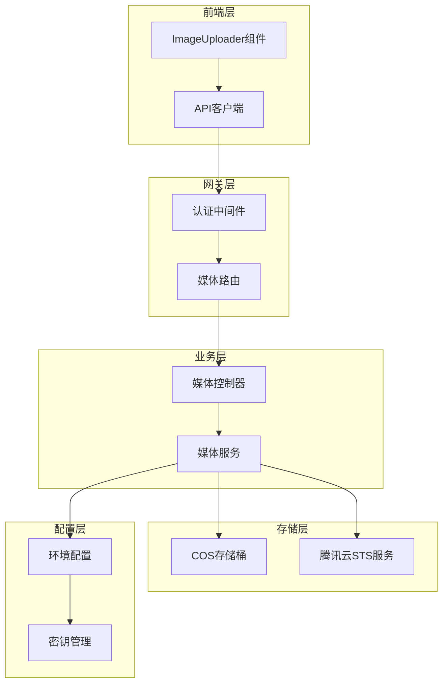
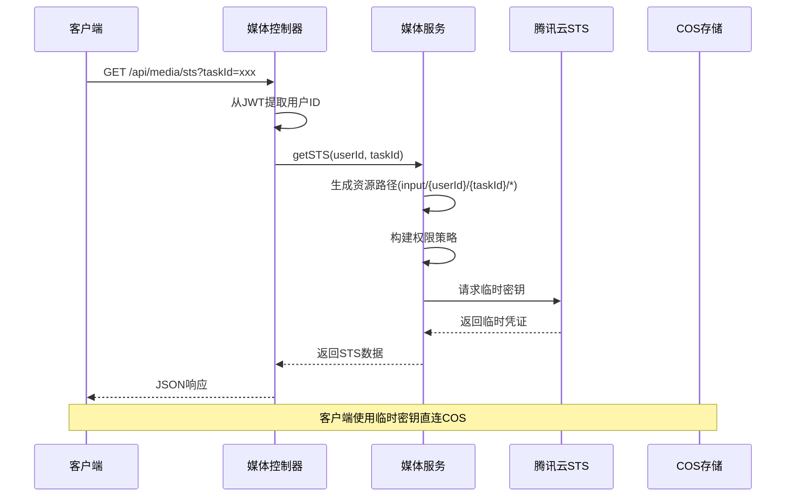
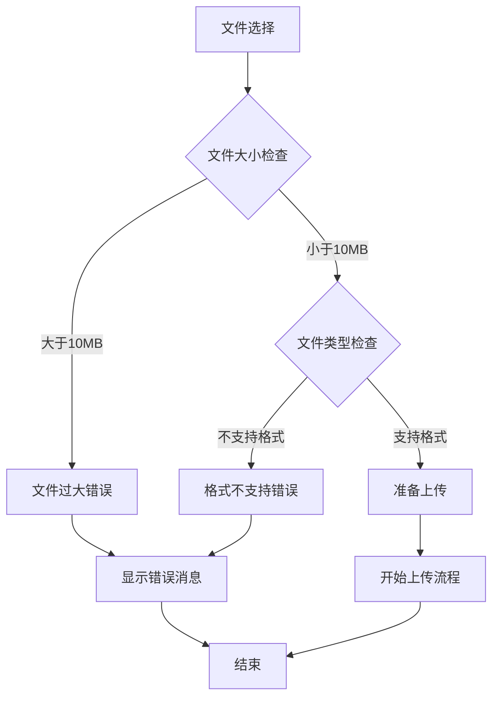
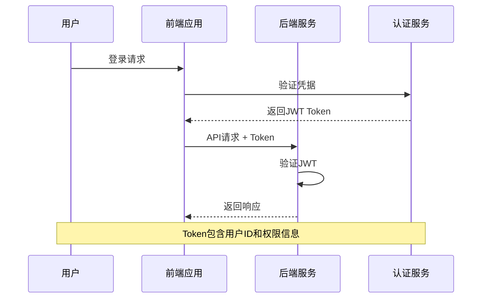
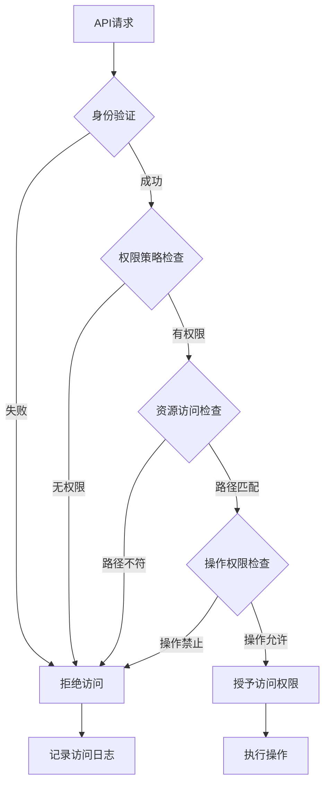
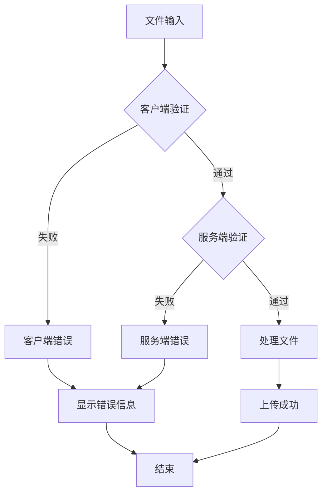
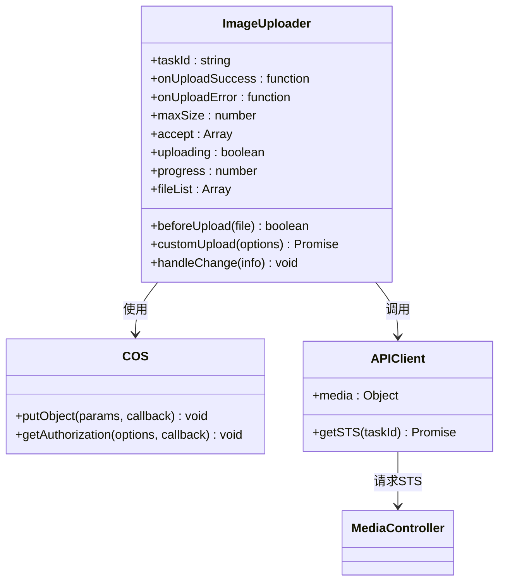
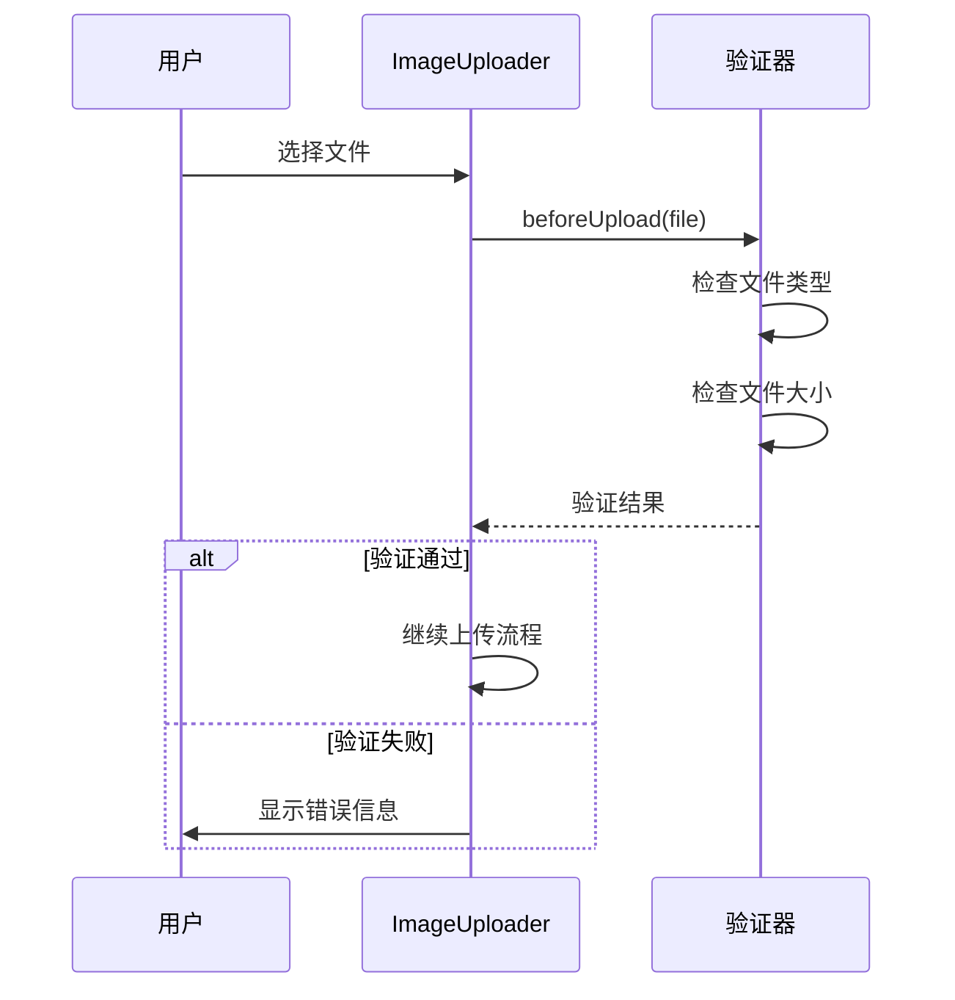
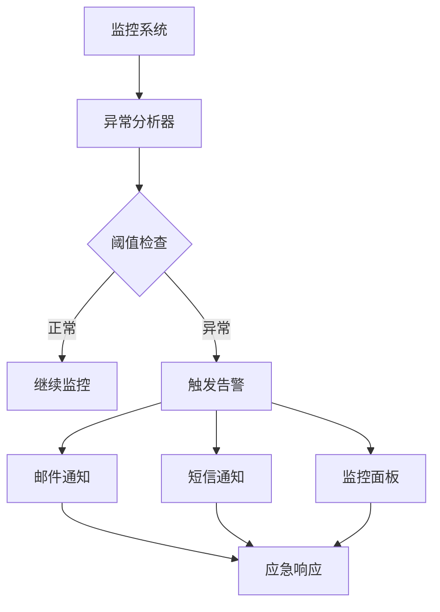

# 媒体服务安全文档

<cite>
**本文档引用的文件**
- [media.controller.js](file://backend/src/controllers/media.controller.js)
- [media.service.js](file://backend/src/services/media.service.js)
- [ImageUploader.tsx](file://frontend/src/components/ImageUploader.tsx)
- [media.routes.js](file://backend/src/routes/media.routes.js)
- [cos.js](file://backend/src/config/cos.js)
- [auth.middleware.js](file://backend/src/middlewares/auth.middleware.js)
- [api.ts](file://frontend/src/lib/api.ts)
- [package.json](file://backend/package.json)
</cite>

## 目录
1. [概述](#概述)
2. [系统架构](#系统架构)
3. [STS临时密钥生成机制](#sts临时密钥生成机制)
4. [COS直传方案](#cos直传方案)
5. [客户端上传前置校验](#客户端上传前置校验)
6. [安全最佳实践](#安全最佳实践)
7. [权限策略配置](#权限策略配置)
8. [文件类型与大小控制](#文件类型与大小控制)
9. [前端集成方式](#前端集成方式)
10. [监控与审计](#监控与审计)
11. [故障排除](#故障排除)

## 概述

本文档详细说明了基于腾讯云COS的媒体服务安全架构，重点阐述了STS临时密钥生成机制、COS直传方案的安全实现，以及客户端上传前置校验逻辑。该系统采用最小权限原则，确保文件上传过程的安全性和可控性。

### 核心特性

- **STS临时密钥机制**：基于用户和任务的动态权限控制
- **COS直传方案**：客户端直连存储，减轻服务器压力
- **多层验证机制**：前后端双重文件类型和大小校验
- **最小权限原则**：精确控制文件访问权限
- **30分钟有效期**：自动过期机制提升安全性

## 系统架构



**图表来源**
- [media.controller.js](file://backend/src/controllers/media.controller.js#L1-L65)
- [media.service.js](file://backend/src/services/media.service.js#L1-L141)
- [ImageUploader.tsx](file://frontend/src/components/ImageUploader.tsx#L1-L198)

**章节来源**
- [media.controller.js](file://backend/src/controllers/media.controller.js#L1-L65)
- [media.service.js](file://backend/src/services/media.service.js#L1-L141)
- [ImageUploader.tsx](file://frontend/src/components/ImageUploader.tsx#L1-L198)

## STS临时密钥生成机制

### getSTS方法核心逻辑

STS（Security Token Service）临时密钥是整个安全架构的核心组件，通过动态生成具有特定权限和时效性的临时凭证来控制COS访问权限。



**图表来源**
- [media.controller.js](file://backend/src/controllers/media.controller.js#L10-L30)
- [media.service.js](file://backend/src/services/media.service.js#L35-L95)

### 最小权限策略构建

系统采用基于用户和任务的最小权限策略，确保每个上传会话只能访问特定的资源路径。

#### 资源路径控制

资源路径采用严格的层次结构：`input/{userId}/{taskId}/*`，这种设计具有以下安全优势：

- **用户隔离**：不同用户的文件完全隔离
- **任务隔离**：每个任务拥有独立的上传空间
- **精确控制**：通配符`*`确保只允许指定路径下的操作
- **审计追踪**：便于追踪文件的归属关系

#### 允许的操作列表

系统定义了严格的操作权限集合，涵盖完整的文件上传流程：

| 操作名称 | 权限描述 | 安全作用 |
|---------|---------|---------|
| PutObject | 单文件上传 | 控制文件写入权限 |
| PostObject | 分片上传初始化 | 支持大文件上传 |
| InitiateMultipartUpload | 初始化分片上传 | 大文件断点续传 |
| ListMultipartUploads | 列出活动分片 | 管理上传状态 |
| ListParts | 列出已完成分片 | 验证上传完整性 |
| UploadPart | 上传分片 | 支持并发上传 |
| CompleteMultipartUpload | 完成分片上传 | 合并所有分片 |

**章节来源**
- [media.service.js](file://backend/src/services/media.service.js#L15-L30)
- [media.service.js](file://backend/src/services/media.service.js#L40-L71)

### 30分钟有效期设定

STS临时密钥采用30分钟的有效期设计，这一时间窗口经过安全团队评估，平衡了用户体验和安全风险：

#### 时间窗口考量

- **用户体验**：足够长的时间完成文件上传
- **安全风险**：较短的生命周期减少密钥泄露影响
- **系统负载**：定期刷新密钥避免长时间占用资源
- **审计追踪**：明确的时间界限便于安全审计

#### 密钥刷新机制

客户端在上传过程中会自动检测密钥过期，并触发新的STS请求，确保上传过程的连续性。

**章节来源**
- [media.service.js](file://backend/src/services/media.service.js#L15-L20)
- [ImageUploader.tsx](file://frontend/src/components/ImageUploader.tsx#L51-L91)

## COS直传方案

### 签名与非签名模式差异

COS直传方案提供两种不同的访问模式，满足不同场景的安全需求。

```mermaid
flowchart TD
Start([开始上传]) --> CheckMode{检查访问模式}
CheckMode --> |非签名模式| PublicAccess[公开访问]
CheckMode --> |签名模式| SignedAccess[签名访问]
PublicAccess --> DirectURL[生成简单URL<br/>https://{bucket}.cos.{region}.myqcloud.com/{key}]
SignedAccess --> GenerateSignature[生成带签名的URL<br/>包含时间戳和签名]
DirectURL --> Upload[直接访问COS]
GenerateSignature --> UploadWithAuth[带身份验证访问COS]
Upload --> Success[上传成功]
UploadWithAuth --> Success
```

**图表来源**
- [media.service.js](file://backend/src/services/media.service.js#L95-L111)

### 直传架构优势

#### 性能优势

- **减轻服务器负载**：文件直接传输到COS，服务器只负责权限验证
- **提高上传速度**：客户端直连COS，避免服务器中转
- **降低延迟**：就近接入点优化，提升全球访问速度

#### 安全优势

- **密钥隔离**：服务器不持有COS访问密钥
- **权限精确**：基于任务的细粒度权限控制
- **审计完整**：完整的访问日志记录

#### 可扩展性

- **水平扩展**：COS天然支持大规模并发
- **成本优化**：按实际使用量计费，无固定成本
- **全球覆盖**：腾讯云CDN加速，全球用户快速访问

**章节来源**
- [media.service.js](file://backend/src/services/media.service.js#L95-L111)
- [ImageUploader.tsx](file://frontend/src/components/ImageUploader.tsx#L51-L91)

## 客户端上传前置校验

### validateFileSize文件大小验证

文件大小验证在客户端和服务端双重执行，确保上传文件符合系统限制。



**图表来源**
- [ImageUploader.tsx](file://frontend/src/components/ImageUploader.tsx#L35-L50)
- [media.service.js](file://backend/src/services/media.service.js#L113-L122)

### validateFileType文件类型验证

系统采用白名单机制控制允许的文件类型，当前支持的格式包括：

#### 支持的图像格式

| 格式 | MIME类型 | 特性 | 安全考虑 |
|------|----------|------|----------|
| JPG | image/jpeg | 压缩率高，兼容性好 | 需要验证文件头 |
| JPEG | image/jpeg | 与JPG相同格式 | 防止恶意文件伪装 |
| PNG | image/png | 无损压缩，透明支持 | 需要验证PNG签名 |

#### 类型验证流程

1. **文件扩展名检查**：提取文件后缀并转换为小写
2. **白名单匹配**：与预定义格式列表对比
3. **MIME类型验证**：客户端进一步确认文件类型
4. **服务端二次验证**：确保客户端验证未被绕过

**章节来源**
- [media.service.js](file://backend/src/services/media.service.js#L124-L139)
- [ImageUploader.tsx](file://frontend/src/components/ImageUploader.tsx#L35-L50)

### 前置校验的重要性

#### 安全防护

- **防止恶意文件**：阻止病毒、木马等恶意文件上传
- **资源保护**：避免超大文件占用存储空间
- **格式一致性**：确保后续处理的一致性

#### 用户体验

- **即时反馈**：上传前发现问题，避免等待
- **清晰指引**：明确告知用户可接受的文件类型
- **减少错误**：避免因格式问题导致的上传失败

**章节来源**
- [media.controller.js](file://backend/src/controllers/media.controller.js#L32-L50)
- [ImageUploader.tsx](file://frontend/src/components/ImageUploader.tsx#L35-L50)

## 安全最佳实践

### 密钥管理

#### 环境变量配置

系统采用环境变量管理所有敏感信息，确保密钥不会泄露到代码仓库：

```javascript
// 推荐的环境变量配置
process.env.TENCENT_SECRET_ID      // 腾讯云SecretId
process.env.TENCENT_SECRET_KEY     // 腾讯云SecretKey  
process.env.COS_BUCKET             // COS存储桶名称
process.env.COS_REGION             // 存储桶所在区域
process.env.JWT_SECRET            // JWT签名密钥
```

#### 密钥轮换策略

- **定期轮换**：每90天自动轮换STS密钥
- **紧急轮换**：发生安全事件时立即轮换
- **版本控制**：支持密钥版本管理，确保平滑过渡

### 认证与授权

#### JWT认证机制

系统采用JWT（JSON Web Token）进行用户身份认证：



**图表来源**
- [auth.middleware.js](file://backend/src/middlewares/auth.middleware.js#L10-L40)

#### 权限控制层级

1. **全局权限**：用户登录状态验证
2. **资源权限**：基于用户ID的资源访问控制
3. **操作权限**：具体COS操作的细粒度控制
4. **时间权限**：STS密钥的时效性控制

**章节来源**
- [auth.middleware.js](file://backend/src/middlewares/auth.middleware.js#L1-L77)
- [media.routes.js](file://backend/src/routes/media.routes.js#L1-L18)

### 网络安全

#### HTTPS强制使用

- **传输加密**：所有API通信强制使用HTTPS
- **证书验证**：客户端验证SSL证书有效性
- **HSTS策略**：启用HTTP严格传输安全

#### 防火墙配置

- **IP白名单**：限制API访问的IP范围
- **端口控制**：只开放必要的网络端口
- **DDoS防护**：部署流量清洗服务

### 数据保护

#### 敏感数据处理

- **数据脱敏**：日志中不记录敏感信息
- **加密存储**：重要数据采用AES加密
- **访问审计**：记录所有数据访问行为

#### 备份与恢复

- **定期备份**：每日自动备份关键数据
- **异地存储**：备份数据存储在不同地域
- **灾难恢复**：制定详细的恢复计划

## 权限策略配置

### 腾讯云COS权限策略

#### 策略语法结构

系统使用腾讯云CAM（Cloud Access Management）策略语法定义访问权限：

```json
{
  "version": "2.0",
  "statement": [
    {
      "effect": "allow",
      "action": ["name/cos:PutObject", "name/cos:PostObject"],
      "resource": ["qcs::cos:ap-guangzhou:uid/*:ai-photo-bucket/input/{userId}/{taskId}/*"]
    }
  ]
}
```

#### 资源标识符解析

- **qcs::cos:**：腾讯云资源标识符前缀
- **ap-guangzhou**：存储桶所在区域
- **uid/**：用户标识符，支持通配符
- **ai-photo-bucket**：存储桶名称
- **input/{userId}/{taskId}/**：具体的资源路径

### 最小权限原则实施

#### 权限细化策略

1. **路径级权限**：精确到具体目录结构
2. **操作级权限**：只允许必要的COS操作
3. **时间级权限**：STS密钥的有限有效期
4. **用户级权限**：基于用户ID的访问隔离

#### 权限验证流程



**图表来源**
- [media.service.js](file://backend/src/services/media.service.js#L40-L55)

### 动态权限调整

#### 任务级别权限控制

系统支持基于任务的动态权限调整：

- **任务创建**：自动生成唯一的任务ID
- **权限绑定**：将权限绑定到具体任务
- **权限回收**：任务完成后自动回收权限

#### 用户级别权限管理

- **用户隔离**：不同用户间文件完全隔离
- **权限继承**：子任务继承父任务权限
- **权限升级**：特殊情况下临时提升权限

**章节来源**
- [media.service.js](file://backend/src/services/media.service.js#L40-L71)

## 文件类型与大小控制

### 白名单管理机制

#### 格式白名单维护

系统采用严格的白名单机制控制允许的文件类型：

```javascript
// 当前支持的文件类型白名单
const ALLOWED_FILE_TYPES = ['jpg', 'jpeg', 'png'];

// 对应的MIME类型
const ALLOWED_MIME_TYPES = ['image/jpeg', 'image/png'];
```

#### 白名单更新流程

1. **需求评估**：评估新增格式的安全性
2. **技术验证**：验证格式的解析安全性
3. **测试验证**：在测试环境验证新格式
4. **灰度发布**：逐步推广新格式支持
5. **监控观察**：持续监控新格式的使用情况

### 大小限制策略

#### 限制阈值设定

- **客户端限制**：10MB（用户体验）
- **服务端限制**：10MB（安全防护）
- **COS限制**：根据存储策略设定

#### 大小验证实现



**图表来源**
- [media.service.js](file://backend/src/services/media.service.js#L113-L122)
- [ImageUploader.tsx](file://frontend/src/components/ImageUploader.tsx#L40-L50)

### 安全防护措施

#### 恶意文件检测

- **文件头验证**：检查文件的实际格式
- **大小验证**：防止超大文件攻击
- **递归扫描**：对上传文件进行病毒扫描

#### 资源保护

- **存储配额**：限制用户存储空间使用
- **访问频率**：控制文件访问频率
- **并发限制**：限制同时上传的文件数量

**章节来源**
- [media.service.js](file://backend/src/services/media.service.js#L113-L139)
- [ImageUploader.tsx](file://frontend/src/components/ImageUploader.tsx#L35-L50)

## 前端集成方式

### ImageUploader组件架构

ImageUploader组件是前端文件上传的核心组件，提供了完整的上传体验。



**图表来源**
- [ImageUploader.tsx](file://frontend/src/components/ImageUploader.tsx#L15-L30)
- [api.ts](file://frontend/src/lib/api.ts#L85-L90)

### 组件配置选项

#### 基础配置

| 参数 | 类型 | 默认值 | 描述 |
|------|------|--------|------|
| taskId | string | undefined | 任务ID，用于权限控制 |
| maxSize | number | 10 | 最大文件大小（MB） |
| accept | Array | ['image/jpeg', 'image/jpg', 'image/png'] | 允许的文件类型 |
| onUploadSuccess | function | undefined | 上传成功回调 |
| onUploadError | function | undefined | 上传错误回调 |

#### 高级配置

- **自定义上传逻辑**：支持完全自定义的上传流程
- **进度显示**：实时显示上传进度
- **拖拽支持**：支持拖拽文件上传
- **多文件限制**：可配置单次上传文件数量

### 上传流程详解

#### 1. 文件验证阶段



**图表来源**
- [ImageUploader.tsx](file://frontend/src/components/ImageUploader.tsx#L35-L50)

#### 2. STS获取阶段

- **自动请求**：上传前自动获取临时密钥
- **错误处理**：STS请求失败时的降级处理
- **密钥缓存**：合理利用STS密钥的30分钟有效期

#### 3. COS直传阶段

- **SDK初始化**：使用COS JavaScript SDK
- **认证回调**：动态提供STS临时凭证
- **进度监控**：实时监控上传进度
- **错误重试**：网络异常时的自动重试机制

**章节来源**
- [ImageUploader.tsx](file://frontend/src/components/ImageUploader.tsx#L1-L198)
- [api.ts](file://frontend/src/lib/api.ts#L85-L90)

### 错误处理机制

#### 上传错误分类

1. **网络错误**：连接超时、DNS解析失败
2. **认证错误**：STS密钥过期、权限不足
3. **文件错误**：文件过大、格式不支持
4. **COS错误**：存储桶不存在、配额超限

#### 用户体验优化

- **友好的错误提示**：使用用户可理解的语言
- **错误恢复**：提供重试和解决建议
- **状态反馈**：清晰的状态指示和进度显示

**章节来源**
- [ImageUploader.tsx](file://frontend/src/components/ImageUploader.tsx#L100-L150)

## 监控与审计

### 日志记录策略

#### 关键事件日志

系统记录以下关键事件以支持安全审计：

| 事件类型 | 记录内容 | 安全价值 |
|----------|----------|----------|
| STS请求 | 用户ID、任务ID、请求时间 | 权限使用追踪 |
| 文件上传 | 文件大小、类型、上传时间 | 上传行为监控 |
| 上传失败 | 错误原因、用户ID、时间戳 | 异常行为检测 |
| 权限验证 | 验证结果、失败原因 | 安全策略执行 |

#### 日志格式规范

```json
{
  "timestamp": "2024-01-01T12:00:00Z",
  "level": "INFO",
  "service": "media-service",
  "event": "sts_request",
  "userId": "user123",
  "taskId": "task456",
  "durationMs": 150,
  "success": true
}
```

### 安全监控指标

#### 异常行为检测

- **高频访问**：短时间内大量STS请求
- **异常文件**：可疑的文件类型或大小
- **权限滥用**：超出预期的COS操作
- **地理位置异常**：来自异常地区的访问

#### 实时告警机制



### 审计报告生成

#### 定期审计内容

- **权限使用统计**：各用户和任务的权限使用情况
- **安全事件汇总**：异常访问和潜在威胁事件
- **合规性检查**：是否符合安全政策要求
- **性能趋势分析**：上传成功率和响应时间趋势

#### 审计报告模板

- **摘要部分**：关键指标和总体安全状况
- **详情部分**：详细的安全事件和分析
- **建议部分**：改进建议和预防措施
- **附件部分**：原始日志和统计数据

**章节来源**
- [media.service.js](file://backend/src/services/media.service.js#L75-L85)
- [auth.middleware.js](file://backend/src/middlewares/auth.middleware.js#L10-L40)

## 故障排除

### 常见问题诊断

#### STS密钥获取失败

**症状表现**：
- 客户端收到"获取上传凭证失败"错误
- 服务端返回500内部错误

**排查步骤**：
1. 检查腾讯云密钥配置是否正确
2. 验证COS存储桶权限设置
3. 确认网络连接和防火墙配置
4. 查看服务端错误日志

**解决方案**：
- 更新环境变量中的密钥信息
- 重新配置COS存储桶权限
- 检查网络代理和DNS设置

#### 文件上传中断

**症状表现**：
- 上传过程中断，进度停止
- 网络错误提示出现在浏览器控制台

**排查步骤**：
1. 检查STS密钥是否过期
2. 验证网络连接稳定性
3. 确认文件大小是否超出限制
4. 检查COS存储桶可用性

**解决方案**：
- 自动刷新STS密钥
- 实现断点续传功能
- 优化网络连接配置

### 性能优化建议

#### 上传性能优化

- **CDN加速**：配置腾讯云CDN提升访问速度
- **分片上传**：大文件采用分片上传策略
- **并发控制**：合理控制并发上传数量
- **缓存策略**：适当缓存STS密钥减少请求

#### 内存使用优化

- **流式处理**：大文件采用流式上传
- **内存监控**：监控客户端内存使用情况
- **垃圾回收**：及时释放不需要的资源

### 安全加固措施

#### 密钥安全管理

- **定期轮换**：建立密钥定期轮换机制
- **权限审查**：定期审查STS权限配置
- **访问监控**：监控密钥使用异常
- **应急响应**：制定密钥泄露应急响应预案

#### 网络安全加固

- **HTTPS强制**：确保所有通信使用加密
- **CORS配置**：正确配置跨域资源共享
- **防火墙规则**：限制不必要的网络访问
- **DDoS防护**：部署分布式拒绝服务防护

**章节来源**
- [media.service.js](file://backend/src/services/media.service.js#L85-L95)
- [ImageUploader.tsx](file://frontend/src/components/ImageUploader.tsx#L150-L198)

## 结论

本文档全面阐述了基于腾讯云COS的媒体服务安全架构，通过STS临时密钥机制、COS直传方案、多层验证机制和严格的权限控制，构建了一个安全可靠的文件上传系统。

### 核心安全优势

1. **最小权限原则**：基于用户和任务的动态权限控制
2. **密钥安全**：STS临时密钥的自动过期机制
3. **多层验证**：前后端双重文件类型和大小校验
4. **实时监控**：完整的安全事件监控和审计
5. **快速响应**：完善的故障排除和应急响应机制

### 持续改进建议

- **安全评估**：定期进行安全漏洞评估和渗透测试
- **策略优化**：根据使用情况优化权限策略和配置
- **技术升级**：跟进最新的安全技术和最佳实践
- **培训教育**：加强开发团队的安全意识培训

通过遵循本文档的安全最佳实践和配置指南，可以确保媒体服务系统的安全性和可靠性，为用户提供优质的文件上传体验。