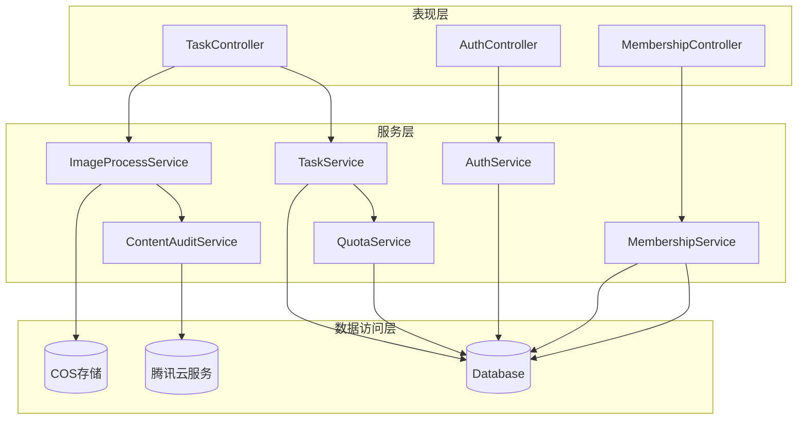
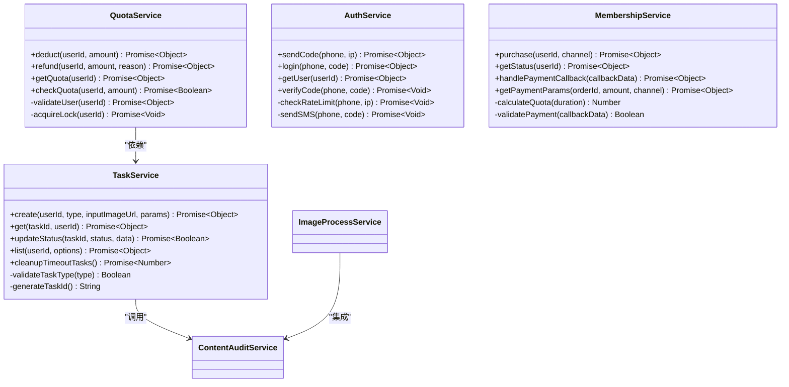
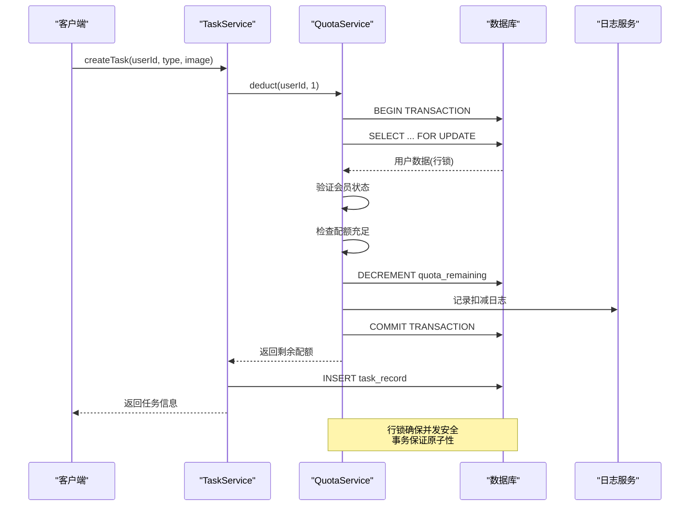
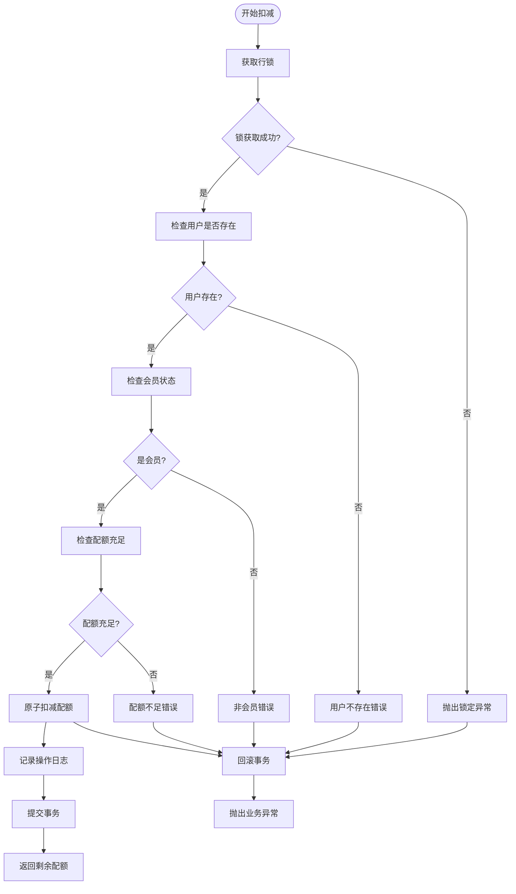
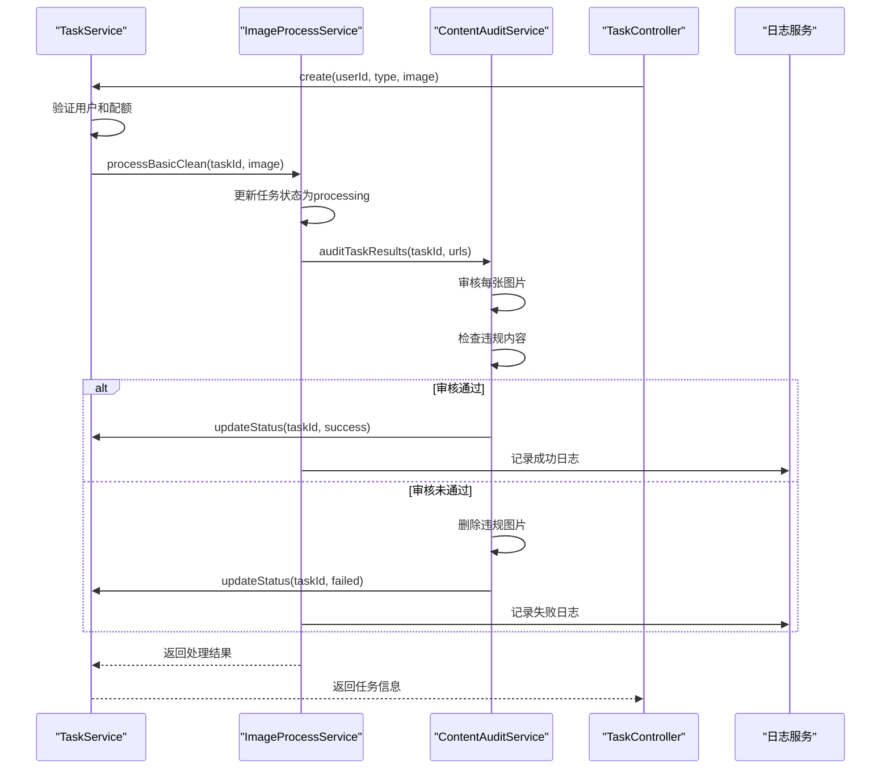
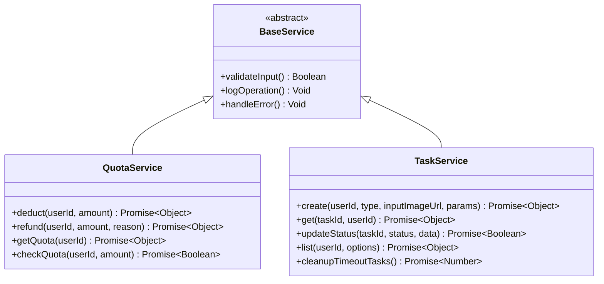
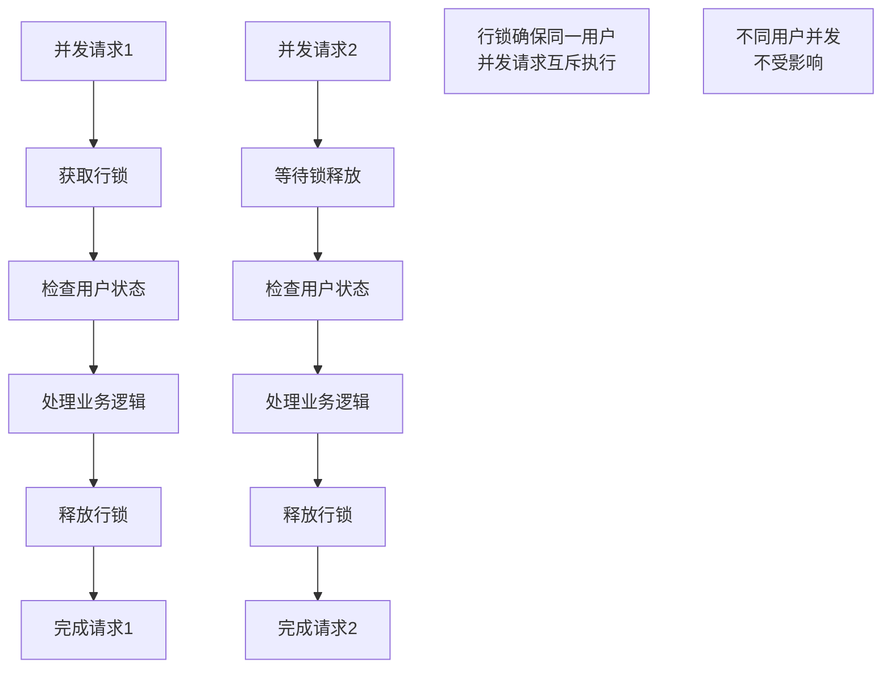
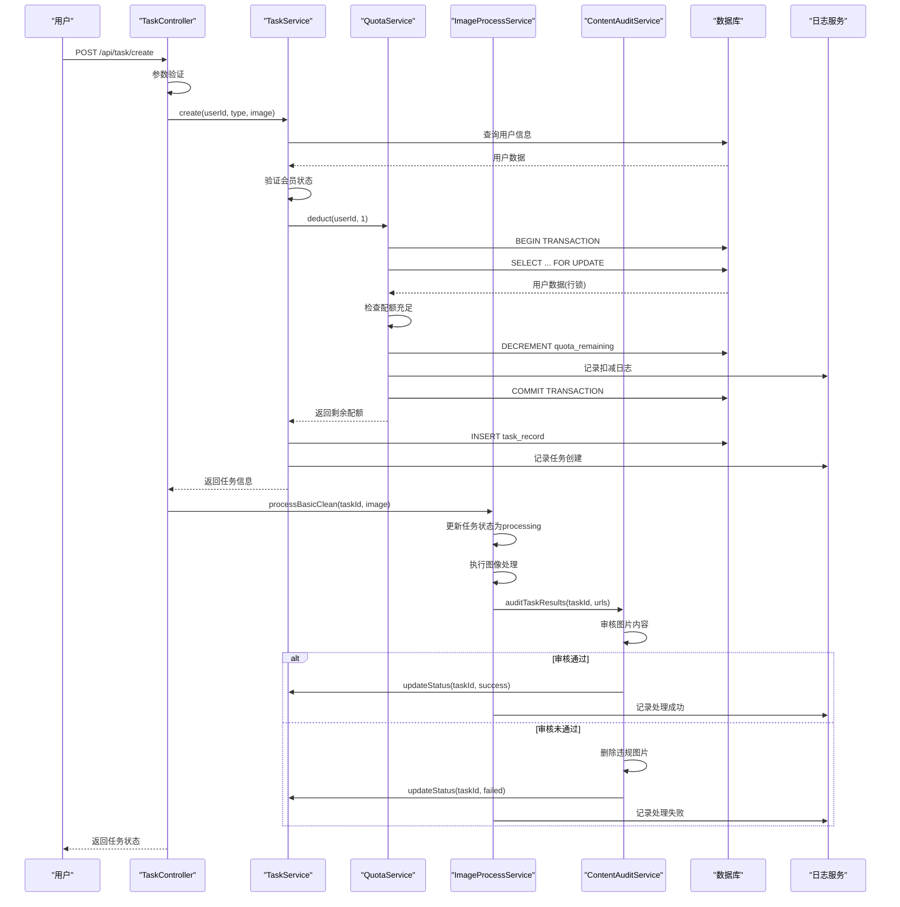
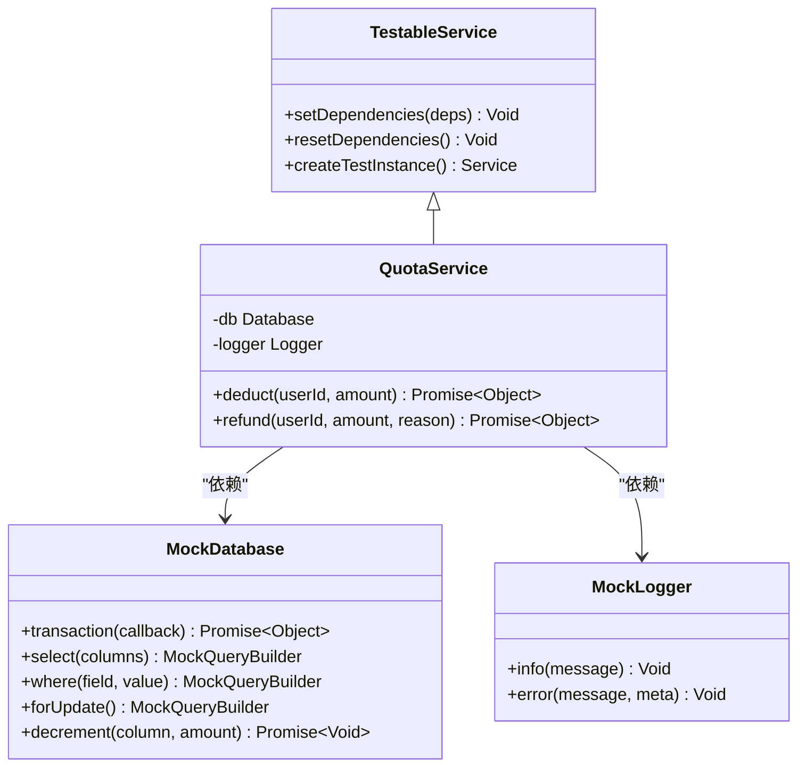
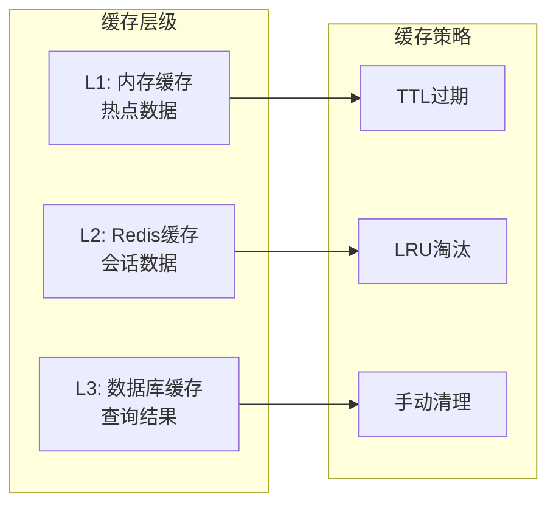

# 服务层

<cite>
**本文档引用的文件**
- [quota.service.js](file://backend/src/services/quota.service.js)
- [task.service.js](file://backend/src/services/task.service.js)
- [auth.service.js](file://backend/src/services/auth.service.js)
- [membership.service.js](file://backend/src/services/membership.service.js)
- [contentAudit.service.js](file://backend/src/services/contentAudit.service.js)
- [imageProcess.service.js](file://backend/src/services/imageProcess.service.js)
- [task.controller.js](file://backend/src/controllers/task.controller.js)
- [auth.controller.js](file://backend/src/controllers/auth.controller.js)
- [membership.controller.js](file://backend/src/controllers/membership.controller.js)
- [database.js](file://backend/src/config/database.js)
- [logger.js](file://backend/src/utils/logger.js)
</cite>

## 目录
1. [引言](#引言)
2. [服务层架构概述](#服务层架构概述)
3. [核心服务组件](#核心服务组件)
4. [事务性配额管理](#事务性配额管理)
5. [服务间协作模式](#服务间协作模式)
6. [业务逻辑封装原则](#业务逻辑封装原则)
7. [高并发安全保障](#高并发安全保障)
8. [服务调用链路示例](#服务调用链路示例)
9. [可测试性设计](#可测试性设计)
10. [性能优化考虑](#性能优化考虑)
11. [故障排除指南](#故障排除指南)
12. [总结](#总结)

## 引言

本文档深入阐述了基于Node.js和Knex.js构建的服务层架构，重点分析业务逻辑封装的设计原则与实现细节。服务层作为应用架构的核心组件，承担着业务规则执行、数据访问协调和服务间通信的重要职责。

该服务层采用面向对象设计模式，每个服务类专注于特定的业务领域，通过依赖注入实现松耦合架构。核心设计理念包括无状态性、事务性操作、并发安全保障和可测试性优势。

## 服务层架构概述

服务层采用分层架构设计，遵循单一职责原则和依赖倒置原则。整体架构呈现清晰的层次结构：



**图表来源**
- [task.controller.js](file://backend/src/controllers/task.controller.js#L1-L10)
- [auth.controller.js](file://backend/src/controllers/auth.controller.js#L1-L10)
- [membership.controller.js](file://backend/src/controllers/membership.controller.js#L1-L10)
- [task.service.js](file://backend/src/services/task.service.js#L1-L10)
- [quota.service.js](file://backend/src/services/quota.service.js#L1-L10)

**章节来源**
- [task.controller.js](file://backend/src/controllers/task.controller.js#L1-L173)
- [auth.controller.js](file://backend/src/controllers/auth.controller.js#L1-L100)
- [membership.controller.js](file://backend/src/controllers/membership.controller.js#L1-L78)

## 核心服务组件

### 服务分类与职责划分

服务层包含六个核心服务，每个服务专注于特定的业务领域：

| 服务名称 | 主要职责 | 核心方法 | 设计特点 |
|---------|---------|---------|---------|
| QuotaService | 配额管理 | `deduct()`, `refund()`, `getQuota()` | 事务性操作，行锁保护 |
| TaskService | 任务管理 | `create()`, `get()`, `updateStatus()` | 原子性事务，状态管理 |
| AuthService | 用户认证 | `sendCode()`, `login()`, `getUser()` | 防刷机制，验证码管理 |
| MembershipService | 会员管理 | `purchase()`, `getStatus()` | 支付集成，状态同步 |
| ContentAuditService | 内容审核 | `auditImage()`, `auditTaskResults()` | 第三方集成，批量处理 |
| ImageProcessService | 图像处理 | `processBasicClean()` | 多阶段处理，错误恢复 |

### 服务实例化模式

所有服务采用单例模式设计，确保全局唯一性和资源共享：



**图表来源**
- [quota.service.js](file://backend/src/services/quota.service.js#L8-L130)
- [task.service.js](file://backend/src/services/task.service.js#L7-L259)
- [auth.service.js](file://backend/src/services/auth.service.js#L6-L220)
- [membership.service.js](file://backend/src/services/membership.service.js#L6-L191)

**章节来源**
- [quota.service.js](file://backend/src/services/quota.service.js#L1-L130)
- [task.service.js](file://backend/src/services/task.service.js#L1-L259)
- [auth.service.js](file://backend/src/services/auth.service.js#L1-L220)
- [membership.service.js](file://backend/src/services/membership.service.js#L1-L191)

## 事务性配额管理

### 高并发安全保障机制

QuotaService是服务层中最关键的安全组件，采用双重保护机制确保配额操作的原子性和并发安全性：



**图表来源**
- [quota.service.js](file://backend/src/services/quota.service.js#L15-L50)
- [task.service.js](file://backend/src/services/task.service.js#L15-L50)

### 事务级配额扣减实现

QuotaService的`deduct`方法展示了事务性操作的最佳实践：

#### 核心安全特性

1. **行级锁保护**：使用`forUpdate()`确保同一用户的并发请求互斥执行
2. **原子性操作**：整个扣减过程在单一事务中完成
3. **非负约束**：通过严格的检查确保配额不会变为负数
4. **完整日志记录**：操作前后都有详细的审计日志

#### 错误处理机制

服务层实现了多层次的错误处理：



**图表来源**
- [quota.service.js](file://backend/src/services/quota.service.js#L15-L55)

**章节来源**
- [quota.service.js](file://backend/src/services/quota.service.js#L1-L130)

## 服务间协作模式

### 集成案例分析：codeAudit.service与imageProcess.service

服务间的协作体现了松耦合设计的优势，以内容审核服务与图像处理服务的集成为例：



**图表来源**
- [task.service.js](file://backend/src/services/task.service.js#L15-L50)
- [imageProcess.service.js](file://backend/src/services/imageProcess.service.js#L40-L80)
- [contentAudit.service.js](file://backend/src/services/contentAudit.service.js#L100-L150)

### 依赖注入与解耦设计

服务层通过显式的依赖注入实现松耦合：

#### 控制器层的解耦实现

控制器不直接实例化服务，而是通过模块导入获得服务实例：

```javascript
// TaskController示例依赖注入
const taskService = require('../services/task.service');
const imageProcessService = require('../services/imageProcess.service');
const contentAuditService = require('../services/contentAudit.service');
```

#### 服务间的隐式依赖

服务间通过共享的数据库连接和公共工具实现协作，避免循环依赖：

- **数据库连接共享**：所有服务使用相同的Knex配置
- **日志服务共享**：统一的日志记录机制
- **配置管理共享**：环境变量和配置参数

**章节来源**
- [task.controller.js](file://backend/src/controllers/task.controller.js#L1-L173)
- [imageProcess.service.js](file://backend/src/services/imageProcess.service.js#L1-L482)
- [contentAudit.service.js](file://backend/src/services/contentAudit.service.js#L1-L230)

## 业务逻辑封装原则

### 设计原则详解

服务层严格遵循以下设计原则：

#### 1. 单一职责原则 (SRP)
每个服务专注于单一业务领域，避免功能混杂：

- **QuotaService**：仅处理配额相关的所有业务逻辑
- **TaskService**：专注任务生命周期管理
- **AuthService**：独立处理用户认证和授权

#### 2. 开闭原则 (OCP)
服务对扩展开放，对修改封闭：



**图表来源**
- [quota.service.js](file://backend/src/services/quota.service.js#L8-L15)
- [task.service.js](file://backend/src/services/task.service.js#L7-L15)

#### 3. 依赖倒置原则 (DIP)
高层模块不依赖低层模块，都依赖于抽象：

- **抽象层面**：定义服务接口和契约
- **具体实现**：各服务类实现具体逻辑
- **配置管理**：通过依赖注入管理服务实例

#### 4. 接口隔离原则 (ISP)
服务接口保持简洁，避免臃肿：

```javascript
// 简洁的接口设计示例
interface IService {
    create(params): Promise<Object>
    get(id): Promise<Object>
    update(id, data): Promise<Boolean>
    delete(id): Promise<Boolean>
}
```

### 业务规则封装

服务层将复杂的业务规则封装在方法内部，提供清晰的API接口：

#### 验证规则封装

```javascript
// TaskService中的类型验证
async create(userId, type, inputImageUrl, params = {}) {
    const validTypes = ['basic_clean', 'model_pose12'];
    if (!validTypes.includes(type)) {
        throw { errorCode: 4001, message: '无效的任务类型' };
    }
    // ... 其他验证逻辑
}
```

#### 业务约束封装

```javascript
// QuotaService中的非负约束
if (user.quota_remaining < amount) {
    throw {
        statusCode: 403,
        errorCode: 1003,
        message: '配额不足,请续费'
    };
}
```

**章节来源**
- [task.service.js](file://backend/src/services/task.service.js#L15-L30)
- [quota.service.js](file://backend/src/services/quota.service.js#L40-L50)

## 高并发安全保障

### 并发控制策略

服务层采用多层并发控制策略，确保系统的稳定性和数据一致性：

#### 数据库层面的并发保护



**图表来源**
- [quota.service.js](file://backend/src/services/quota.service.js#L18-L25)

#### 事务级别的原子性保证

所有涉及状态变更的操作都在事务中执行：

```javascript
// 事务保护的核心模式
async function transactionalOperation() {
    return await db.transaction(async (trx) => {
        // 1. 查询和锁定
        const user = await trx('users')
            .where('id', userId)
            .forUpdate()
            .first();
            
        // 2. 业务逻辑验证
        // 3. 状态变更
        await trx('users')
            .where('id', userId)
            .decrement('quota_remaining', amount);
            
        // 4. 提交事务
        return result;
    });
}
```

#### 服务级别的一致性保障

服务层通过以下机制确保一致性：

1. **前置检查**：在执行操作前验证所有前提条件
2. **后置验证**：操作完成后验证结果的正确性
3. **补偿机制**：失败时执行相应的回滚操作
4. **幂等性设计**：确保重复操作不会产生副作用

### 性能优化策略

#### 连接池管理

服务层利用Knex.js的连接池机制优化数据库访问：

```javascript
// 数据库连接配置示例
const db = knex({
    client: 'mysql',
    connection: {
        host: process.env.DB_HOST,
        user: process.env.DB_USER,
        password: process.env.DB_PASSWORD,
        database: process.env.DB_NAME
    },
    pool: { min: 2, max: 10 }
});
```

#### 缓存策略

对于频繁查询的数据，服务层实现了多级缓存：

- **内存缓存**：热点数据的快速访问
- **Redis缓存**：分布式状态共享
- **数据库缓存**：查询结果缓存

**章节来源**
- [quota.service.js](file://backend/src/services/quota.service.js#L15-L55)
- [database.js](file://backend/src/config/database.js#L1-L10)

## 服务调用链路示例

### 完整的任务创建流程

以下展示了从任务创建到完成的完整服务调用链路：



**图表来源**
- [task.controller.js](file://backend/src/controllers/task.controller.js#L10-L50)
- [task.service.js](file://backend/src/services/task.service.js#L15-L50)
- [quota.service.js](file://backend/src/services/quota.service.js#L15-L55)
- [imageProcess.service.js](file://backend/src/services/imageProcess.service.js#L40-L80)

### 异步处理模式

对于耗时操作，服务层采用异步处理模式：

```javascript
// TaskController中的异步处理示例
if (type === 'basic_clean') {
    // 异步处理,不阻塞响应
    imageProcessService.processBasicClean(taskId, inputImageUrl, params)
        .catch(err => {
            logger.error(`异步处理失败: ${err.message}`, { taskId });
        });
}
```

### 错误传播机制

服务层建立了完善的错误传播机制：

1. **业务异常**：带有错误码和详细消息
2. **系统异常**：通用的错误处理和日志记录
3. **中间件处理**：统一的错误响应格式

**章节来源**
- [task.controller.js](file://backend/src/controllers/task.controller.js#L10-L60)
- [task.service.js](file://backend/src/services/task.service.js#L15-L80)
- [imageProcess.service.js](file://backend/src/services/imageProcess.service.js#L40-L90)

## 可测试性设计

### 测试友好性架构

服务层采用多种设计模式提升可测试性：

#### 依赖注入的测试优势



**图表来源**
- [quota.service.js](file://backend/src/services/quota.service.js#L1-L10)
- [logger.js](file://backend/src/utils/logger.js#L1-L42)

#### 模块化测试策略

服务层支持多种测试场景：

1. **单元测试**：独立测试单个服务的方法
2. **集成测试**：测试服务间的协作
3. **端到端测试**：测试完整的业务流程
4. **压力测试**：验证高并发场景下的表现

#### 测试数据管理

```javascript
// 测试环境配置示例
const testConfig = {
    database: {
        client: 'sqlite3',
        connection: ':memory:',
        migrations: { directory: './migrations' }
    },
    logging: false
};
```

### 模拟和存根技术

服务层广泛使用模拟对象和存根来隔离测试：

```javascript
// 测试中的依赖替换
const mockDb = {
    transaction: jest.fn(),
    select: jest.fn(),
    where: jest.fn(),
    decrement: jest.fn()
};

const quotaService = new QuotaService();
quotaService.db = mockDb;
```

**章节来源**
- [quota.service.js](file://backend/src/services/quota.service.js#L1-L130)
- [logger.js](file://backend/src/utils/logger.js#L1-L42)

## 性能优化考虑

### 数据库查询优化

服务层采用了多种数据库查询优化策略：

#### 索引策略

```sql
-- 用户表索引优化
CREATE INDEX idx_user_quota ON users(quota_remaining, isMember);
CREATE INDEX idx_user_created ON users(created_at);
CREATE INDEX idx_task_user_status ON tasks(userId, status, created_at);
```

#### 查询优化模式

```javascript
// 高效的查询模式
async getUserTasks(userId, options) {
    const query = db('tasks')
        .where('userId', userId)
        .orderBy('created_at', 'desc')
        .limit(options.limit)
        .offset(options.offset);
    
    // 只选择必要的字段
    return query.select('id', 'type', 'status', 'created_at');
}
```

### 缓存策略

#### 多级缓存架构



#### 缓存失效策略

服务层实现了智能的缓存失效机制：

- **写入时失效**：数据更新时清除相关缓存
- **定时刷新**：定期更新过期的缓存数据
- **版本控制**：通过版本号管理缓存一致性

### 异步处理优化

#### 消息队列集成

对于耗时操作，服务层支持异步处理：

```javascript
// 异步处理示例
async processAsyncTask(taskId, operation) {
    // 立即返回响应
    return { taskId, status: 'processing' };
    
    // 后台异步处理
    setTimeout(() => {
        operation.execute(taskId);
    }, 0);
}
```

**章节来源**
- [task.service.js](file://backend/src/services/task.service.js#L200-L259)
- [imageProcess.service.js](file://backend/src/services/imageProcess.service.js#L400-L482)

## 故障排除指南

### 常见问题诊断

#### 配额扣减失败

**症状**：用户创建任务时提示"配额不足"

**诊断步骤**：
1. 检查用户会员状态
2. 验证配额剩余数量
3. 确认事务是否正常提交
4. 查看数据库锁状态

**解决方案**：
```javascript
// 诊断代码示例
async function diagnoseQuotaIssue(userId) {
    const user = await db('users').where('id', userId).first();
    console.log('用户信息:', {
        isMember: user.isMember,
        quotaRemaining: user.quota_remaining,
        quotaExpireAt: user.quota_expireAt
    });
}
```

#### 事务死锁问题

**症状**：并发请求出现数据库死锁错误

**解决方案**：
1. 优化查询顺序，确保一致的锁定顺序
2. 减少事务持有时间
3. 实现重试机制

#### 服务间通信超时

**症状**：某些服务调用响应缓慢或超时

**诊断方法**：
```javascript
// 超时监控示例
const TIMEOUT_MS = 5000;

async function timedServiceCall(serviceMethod, args) {
    const controller = new AbortController();
    const timeoutId = setTimeout(() => controller.abort(), TIMEOUT_MS);
    
    try {
        const result = await serviceMethod(...args);
        clearTimeout(timeoutId);
        return result;
    } catch (error) {
        clearTimeout(timeoutId);
        throw error;
    }
}
```

### 日志分析技巧

服务层提供了丰富的日志信息用于故障诊断：

#### 关键日志模式

```javascript
// 操作日志格式
logger.info(`[QuotaService] 配额扣减成功: userId=${userId}, amount=${amount}, remaining=${remaining}`);
logger.error(`[TaskService] 创建任务失败: ${error.message}`, { userId, type, error });
```

#### 性能监控指标

```javascript
// 性能监控示例
const startTime = Date.now();
await serviceMethod(...args);
const duration = Date.now() - startTime;
logger.info(`[Performance] ${serviceMethod.name} 执行时间: ${duration}ms`);
```

**章节来源**
- [quota.service.js](file://backend/src/services/quota.service.js#L45-L55)
- [task.service.js](file://backend/src/services/task.service.js#L50-L80)
- [logger.js](file://backend/src/utils/logger.js#L1-L42)

## 总结

本文档全面阐述了服务层的设计原则、实现细节和最佳实践。通过深入分析核心服务组件，特别是QuotaService的事务性配额管理机制，展现了服务层在高并发场景下的安全保障能力。

### 核心优势总结

1. **业务逻辑封装**：清晰的职责划分和单一职责原则的应用
2. **并发安全保障**：事务性操作和行锁机制确保数据一致性
3. **服务间协作**：松耦合设计支持灵活的服务组合
4. **可测试性设计**：依赖注入和模块化架构提升测试效率
5. **性能优化**：多级缓存和异步处理提升系统吞吐量

### 最佳实践要点

- **事务性操作**：涉及状态变更的操作必须使用事务
- **行锁保护**：高并发场景下使用行锁防止竞争条件
- **错误处理**：完善的异常处理和错误传播机制
- **日志记录**：详细的审计日志支持问题诊断和合规要求
- **服务解耦**：通过依赖注入实现松耦合架构

服务层作为应用架构的核心，不仅实现了业务逻辑的有效封装，更为系统的可维护性、可扩展性和可靠性奠定了坚实基础。通过持续的优化和改进，该服务层架构能够支撑业务的快速发展和技术创新。