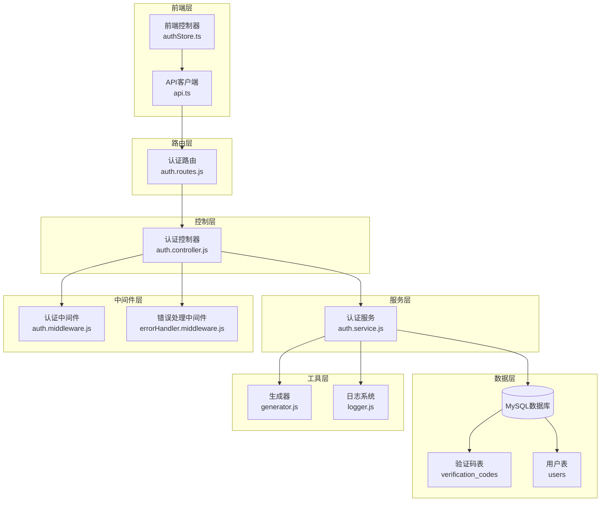
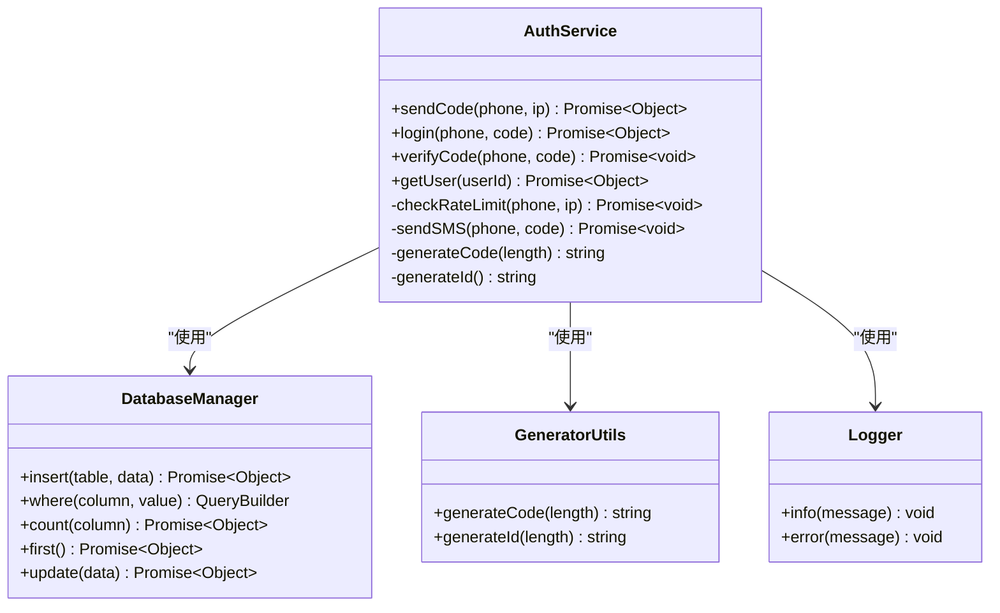
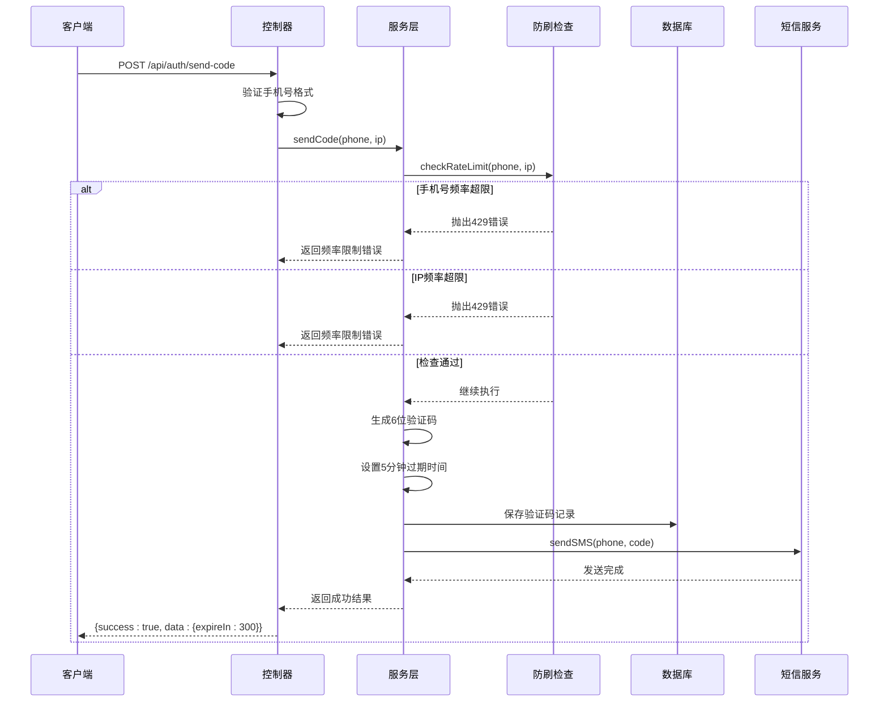
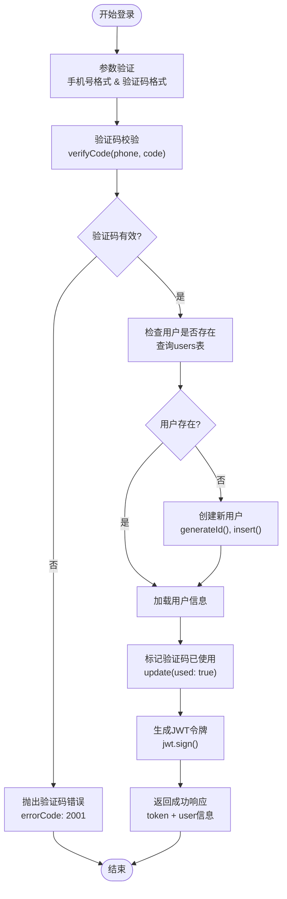
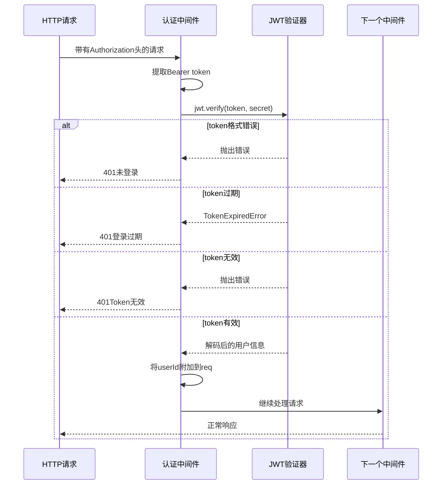
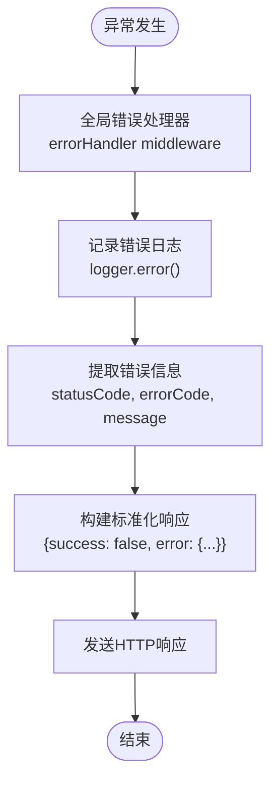
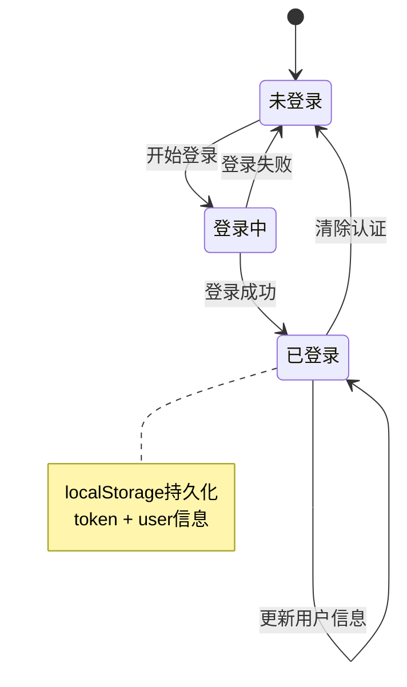

# 认证服务详细文档

<cite>
**本文档引用的文件**
- [auth.service.js](file://backend/src/services/auth.service.js)
- [auth.controller.js](file://backend/src/controllers/auth.controller.js)
- [auth.routes.js](file://backend/src/routes/auth.routes.js)
- [auth.middleware.js](file://backend/src/middlewares/auth.middleware.js)
- [generator.js](file://backend/src/utils/generator.js)
- [20251028000004_create_verification_codes_table.js](file://backend/src/db/migrations/20251028000004_create_verification_codes_table.js)
- [api.ts](file://frontend/src/lib/api.ts)
- [authStore.ts](file://frontend/src/store/authStore.ts)
- [errorHandler.middleware.js](file://backend/src/middlewares/errorHandler.middleware.js)
- [database.js](file://backend/src/config/database.js)
- [knexfile.js](file://backend/knexfile.js)
- [app.js](file://backend/src/app.js)
</cite>

## 目录
1. [简介](#简介)
2. [系统架构概览](#系统架构概览)
3. [核心组件分析](#核心组件分析)
4. [验证码发送机制](#验证码发送机制)
5. [登录注册流程](#登录注册流程)
6. [JWT令牌管理](#jwt令牌管理)
7. [安全机制](#安全机制)
8. [异常处理策略](#异常处理策略)
9. [前端接口契约](#前端接口契约)
10. [性能优化考虑](#性能优化考虑)
11. [故障排除指南](#故障排除指南)
12. [总结](#总结)

## 简介

本认证服务是一个基于手机号+验证码的用户认证系统，采用现代化的微服务架构设计，提供了完整的用户注册、登录、会话管理和安全防护功能。系统支持JWT令牌认证，具备完善的防刷机制和异常处理策略。

### 主要特性

- **手机号+验证码认证**：支持手机号注册和登录，验证码有效期5分钟
- **双重防刷机制**：基于IP和手机号的频率限制，防止恶意请求
- **JWT令牌管理**：安全的令牌生成和验证机制
- **用户状态管理**：支持普通用户和会员用户的差异化权限控制
- **完整的错误处理**：针对不同场景的精细化错误码和提示信息

## 系统架构概览

认证服务采用分层架构设计，清晰分离关注点：



**图表来源**
- [auth.routes.js](file://backend/src/routes/auth.routes.js#L1-L28)
- [auth.controller.js](file://backend/src/controllers/auth.controller.js#L1-L100)
- [auth.service.js](file://backend/src/services/auth.service.js#L1-L220)
- [auth.middleware.js](file://backend/src/middlewares/auth.middleware.js#L1-L77)

**章节来源**
- [auth.service.js](file://backend/src/services/auth.service.js#L1-L220)
- [auth.controller.js](file://backend/src/controllers/auth.controller.js#L1-L100)
- [auth.routes.js](file://backend/src/routes/auth.routes.js#L1-L28)

## 核心组件分析

### 认证服务类 (AuthService)

认证服务是整个认证系统的核心，负责处理所有与用户认证相关的业务逻辑：



**图表来源**
- [auth.service.js](file://backend/src/services/auth.service.js#L8-L220)
- [generator.js](file://backend/src/utils/generator.js#L1-L58)

### 数据模型设计

系统使用两个核心数据表来支撑认证功能：

| 表名 | 字段 | 类型 | 约束 | 描述 |
|------|------|------|------|------|
| users | id | varchar(32) | PRIMARY KEY | 用户唯一标识符 |
| users | phone | varchar(11) | NOT NULL, UNIQUE | 手机号(主键) |
| users | isMember | boolean | DEFAULT false | 是否为会员 |
| users | quota_remaining | int | DEFAULT 0 | 剩余配额 |
| users | quota_expireAt | datetime | NULLABLE | 配额到期时间 |
| users | created_at | datetime | NOT NULL | 创建时间 |
| users | updated_at | datetime | NOT NULL | 更新时间 |

| 表名 | 字段 | 类型 | 约束 | 描述 |
|------|------|------|------|------|
| verification_codes | id | int | PRIMARY KEY, AUTO_INCREMENT | 验证码记录ID |
| verification_codes | phone | varchar(11) | NOT NULL | 关联手机号 |
| verification_codes | code | varchar(6) | NOT NULL | 验证码(6位数字) |
| verification_codes | ip | varchar(45) | NULLABLE | 请求IP地址 |
| verification_codes | expireAt | datetime | NOT NULL | 验证码过期时间 |
| verification_codes | used | boolean | DEFAULT false | 是否已使用 |
| verification_codes | created_at | datetime | NOT NULL | 创建时间 |
| verification_codes | updated_at | datetime | NOT NULL | 更新时间 |

**章节来源**
- [auth.service.js](file://backend/src/services/auth.service.js#L8-L220)
- [20251028000004_create_verification_codes_table.js](file://backend/src/db/migrations/20251028000004_create_verification_codes_table.js#L1-L27)

## 验证码发送机制

### sendCode 方法详解

验证码发送是认证流程的第一步，实现了完整的防刷保护机制：



**图表来源**
- [auth.controller.js](file://backend/src/controllers/auth.controller.js#L8-L40)
- [auth.service.js](file://backend/src/services/auth.service.js#L12-L45)

### 防刷逻辑实现

系统实现了双重频率限制机制：

#### 1. 手机号频率限制
- **规则**：同一手机号每分钟最多发送5次验证码
- **实现**：查询过去60秒内的验证码发送记录
- **阈值检测**：当发送次数达到5次时抛出429错误

#### 2. IP地址频率限制  
- **规则**：同一IP地址每小时最多发送20次验证码
- **实现**：查询过去3600秒内的验证码发送记录
- **阈值检测**：当发送次数达到20次时抛出429错误

### 验证码生成与存储

验证码生成采用安全的随机数算法：
- **长度**：6位数字验证码
- **生成方式**：Math.floor(Math.random() * 10^6)
- **存储内容**：手机号、验证码、IP地址、过期时间、使用状态

**章节来源**
- [auth.service.js](file://backend/src/services/auth.service.js#L12-L85)
- [generator.js](file://backend/src/utils/generator.js#L20-L25)

## 登录注册流程

### login 方法详细分析

登录/注册流程整合了用户身份验证和账户创建功能：



**图表来源**
- [auth.controller.js](file://backend/src/controllers/auth.controller.js#L42-L85)
- [auth.service.js](file://backend/src/services/auth.service.js#L87-L140)

### 用户创建逻辑

当用户首次使用手机号登录时，系统自动创建新用户记录：

#### 用户字段说明
- **id**: 使用安全随机数生成的32字符唯一标识符
- **phone**: 注册时使用的手机号
- **isMember**: 初始状态为false(非会员)
- **quota_remaining**: 初始配额为0
- **quota_expireAt**: 初始为空(null)
- **created_at/updated_at**: 自动维护的时间戳

### JWT令牌生成

系统使用JSON Web Token进行无状态认证：

#### 令牌结构
- **载荷内容**:
  - userId: 用户唯一标识符
  - phone: 用户手机号
- **签名密钥**: 从环境变量JWT_SECRET读取
- **过期时间**: 从环境变量JWT_EXPIRE读取，默认7天
- **算法**: HS256

#### 令牌验证流程
1. **接收**: 从Authorization头提取Bearer token
2. **解析**: 使用jwt.verify()验证令牌有效性
3. **解码**: 提取用户信息到请求对象
4. **授权**: 将用户ID附加到req.userId

**章节来源**
- [auth.service.js](file://backend/src/services/auth.service.js#L87-L140)
- [auth.middleware.js](file://backend/src/middlewares/auth.middleware.js#L6-L47)

## JWT令牌管理

### 认证中间件架构

认证中间件提供了完整的JWT验证和用户信息注入功能：



**图表来源**
- [auth.middleware.js](file://backend/src/middlewares/auth.middleware.js#L6-L47)

### 可选认证机制

系统还提供了可选认证中间件，适用于某些需要区分登录状态但不强制要求登录的接口：

#### 可选认证特点
- **非强制性**: 即使认证失败也不中断请求流程
- **条件注入**: 仅在token有效时才注入用户信息
- **应用场景**: 首页展示、公开资源访问等

**章节来源**
- [auth.middleware.js](file://backend/src/middlewares/auth.middleware.js#L49-L77)

## 安全机制

### 多层次安全防护

认证系统实现了多层次的安全防护策略：

#### 1. 输入验证
- **手机号格式**: 支持11位中国大陆手机号(13x-19x开头)
- **验证码格式**: 必须为6位纯数字
- **IP地址**: 自动捕获客户端真实IP

#### 2. 防刷机制
- **频率限制**: 双重频率控制，防止暴力破解
- **时间窗口**: 分钟级和小时级的时间窗口控制
- **动态阈值**: 根据业务需求调整限制参数

#### 3. 数据保护
- **密码加密**: 用户密码使用bcrypt加密存储
- **敏感信息**: 验证码明文存储但有严格时效性
- **传输安全**: HTTPS强制加密传输

#### 4. 会话安全
- **令牌过期**: JWT具有明确的过期时间
- **无状态设计**: 不依赖服务器端会话存储
- **刷新机制**: 支持令牌刷新和重新登录

### 安全最佳实践

#### 开发环境配置
- **短信调试**: 开发环境下仅记录日志，不实际发送短信
- **本地测试**: 支持本地开发环境的离线测试

#### 生产环境部署
- **环境隔离**: 区分开发、测试、生产环境配置
- **密钥管理**: JWT密钥和数据库连接信息通过环境变量管理
- **监控告警**: 完整的日志记录和错误追踪

**章节来源**
- [auth.controller.js](file://backend/src/controllers/auth.controller.js#L10-L40)
- [auth.service.js](file://backend/src/services/auth.service.js#L47-L85)

## 异常处理策略

### 错误分类与处理

系统实现了精细化的错误处理机制，针对不同场景提供相应的错误码和提示信息：

#### 验证码相关错误

| 错误码 | HTTP状态码 | 错误消息 | 触发条件 |
|--------|------------|----------|----------|
| 2000 | 400 | 手机号格式错误 | 手机号格式不正确 |
| 2001 | 400 | 验证码错误或已过期 | 验证码不存在、已使用或已过期 |
| 2002 | 400 | 验证码格式错误 | 验证码不是6位数字 |
| 2004 | 429 | 验证码发送过于频繁,请1分钟后再试 | 手机号频率限制超限 |
| 2005 | 429 | 请求过于频繁,请稍后再试 | IP地址频率限制超限 |

#### 用户相关错误

| 错误码 | HTTP状态码 | 错误消息 | 触发条件 |
|--------|------------|----------|----------|
| 1004 | 404 | 用户不存在 | 查询用户时未找到对应记录 |

#### 认证相关错误

| 错误码 | HTTP状态码 | 错误消息 | 触发条件 |
|--------|------------|----------|----------|
| 1001 | 401 | 未登录 | 缺少Authorization头 |
| 1001 | 401 | 登录已过期,请重新登录 | JWT令牌过期 |
| 1001 | 401 | Token无效 | JWT令牌格式错误或签名无效 |

### 异常处理流程



**图表来源**
- [errorHandler.middleware.js](file://backend/src/middlewares/errorHandler.middleware.js#L5-L20)

### 前端错误处理

前端实现了完整的错误处理机制：

#### 自动登出机制
- **401状态码**: 自动清除本地存储的token和用户信息
- **页面重定向**: 跳转到登录页面
- **用户体验**: 提供友好的错误提示

#### 错误恢复策略
- **网络错误**: 显示通用错误提示，建议重试
- **业务错误**: 显示具体的错误描述
- **系统错误**: 记录详细错误信息用于调试

**章节来源**
- [errorHandler.middleware.js](file://backend/src/middlewares/errorHandler.middleware.js#L5-L46)
- [api.ts](file://frontend/src/lib/api.ts#L40-L60)

## 前端接口契约

### API接口规范

前端通过统一的API客户端与后端进行通信，所有认证相关操作都遵循RESTful规范：

#### 认证接口

| 接口路径 | HTTP方法 | 功能描述 | 请求参数 | 响应格式 |
|----------|----------|----------|----------|----------|
| `/api/auth/send-code` | POST | 发送验证码 | `{phone: string}` | `{success: boolean, data: {expireIn: number}}` |
| `/api/auth/login` | POST | 用户登录/注册 | `{phone: string, code: string}` | `{success: boolean, data: {token: string, user: object}}` |
| `/api/auth/me` | GET | 获取当前用户信息 | 无 | `{success: boolean, data: userObject}` |

#### 用户对象结构

```typescript
interface User {
  id: string;
  phone: string;
  isMember: boolean;
  quota_remaining: number;
  quota_expireAt: string | null;
  createdAt: string;
}
```

### 状态管理

前端使用Zustand进行状态管理，实现了完整的认证状态持久化：

#### 认证状态管理



**图表来源**
- [authStore.ts](file://frontend/src/store/authStore.ts#L1-L43)
- [api.ts](file://frontend/src/lib/api.ts#L1-L118)

#### 存储策略
- **token存储**: localStorage中存储JWT令牌
- **用户信息**: localStorage中存储完整的用户对象
- **自动清理**: 登出时自动清除所有相关数据

**章节来源**
- [api.ts](file://frontend/src/lib/api.ts#L50-L70)
- [authStore.ts](file://frontend/src/store/authStore.ts#L15-L40)

## 性能优化考虑

### 数据库优化

#### 索引策略
- **verification_codes表**: 对phone字段建立索引，支持快速查找
- **verification_codes表**: 对phone+created_at组合索引，优化频率限制查询
- **verification_codes表**: 对ip字段索引，支持IP级别的频率控制

#### 查询优化
- **单条查询**: 使用.first()方法获取单个记录，减少内存占用
- **批量操作**: 在必要时使用批量插入和更新操作
- **连接池**: 配置合适的数据库连接池大小

### 缓存策略

虽然当前实现主要依赖数据库，但可以考虑以下缓存优化：

#### Redis缓存方案
- **验证码缓存**: 将验证码信息缓存到Redis，设置5分钟TTL
- **频率限制缓存**: 使用Redis计数器实现更精确的频率控制
- **用户信息缓存**: 缓存用户基本信息，减少数据库查询

#### 缓存失效策略
- **主动失效**: 用户登录成功后立即删除相关验证码
- **被动失效**: 验证码过期后自动从缓存中移除
- **批量清理**: 定期清理过期的缓存数据

### 异步处理

#### 短信发送优化
- **异步发送**: 短信发送采用异步处理，不阻塞主流程
- **队列机制**: 可考虑引入消息队列处理大量短信请求
- **降级策略**: 短信服务不可用时提供备用通知方式

### 监控指标

#### 关键性能指标
- **响应时间**: 验证码发送和登录接口的平均响应时间
- **错误率**: 各种错误类型的发生频率
- **并发量**: 系统能够处理的最大并发请求数
- **数据库负载**: 数据库查询和写入的负载情况

## 故障排除指南

### 常见问题诊断

#### 验证码发送失败

**症状**: 用户无法收到验证码短信
**可能原因**:
1. 手机号格式验证失败
2. 频率限制触发
3. 短信服务配置错误
4. 数据库连接问题

**排查步骤**:
1. 检查手机号格式是否符合11位数字要求
2. 查看是否有频率限制错误(2004/2005)
3. 验证短信服务配置和API密钥
4. 检查数据库连接状态

#### 登录失败

**症状**: 验证码正确但登录失败
**可能原因**:
1. 验证码已过期或被使用
2. 用户数据库记录损坏
3. JWT签名密钥配置错误

**排查步骤**:
1. 验证验证码的有效性和使用状态
2. 检查用户记录是否存在且完整
3. 确认JWT_SECRET环境变量配置正确

#### 令牌验证失败

**症状**: 已登录用户访问受保护接口时被拒绝
**可能原因**:
1. JWT令牌过期
2. 令牌格式错误
3. 密钥不匹配
4. 中间件配置问题

**排查步骤**:
1. 检查令牌是否在有效期内
2. 验证Bearer前缀和令牌格式
3. 确认JWT_SECRET一致性
4. 检查中间件加载顺序

### 日志分析

#### 关键日志位置
- **认证服务日志**: `auth.service.js`中的logger.info/error调用
- **中间件日志**: `auth.middleware.js`中的JWT验证日志
- **错误日志**: `errorHandler.middleware.js`中的全局错误记录

#### 日志关键词
- **验证码发送**: `验证码已发送`
- **用户登录**: `用户登录成功`
- **新用户注册**: `新用户注册`
- **JWT验证**: `JWT验证失败`

### 性能监控

#### 监控要点
- **响应时间**: 监控各接口的平均响应时间
- **错误率**: 跟踪各种错误的发生频率
- **数据库性能**: 监控查询执行时间和连接池使用情况
- **系统资源**: CPU、内存、磁盘I/O使用情况

#### 告警设置
- **高错误率**: 错误率超过5%时触发告警
- **响应时间**: 平均响应时间超过2秒时告警
- **数据库连接**: 连接池使用率达到80%时告警

**章节来源**
- [auth.service.js](file://backend/src/services/auth.service.js#L50-L85)
- [auth.middleware.js](file://backend/src/middlewares/auth.middleware.js#L25-L47)
- [errorHandler.middleware.js](file://backend/src/middlewares/errorHandler.middleware.js#L5-L20)

## 总结

本认证服务构建了一个完整、安全、高性能的手机号+验证码认证系统。通过分层架构设计，实现了清晰的职责分离和良好的可维护性。

### 核心优势

1. **安全性**: 多重防刷机制、JWT令牌认证、输入验证等全方位安全保障
2. **可靠性**: 完善的错误处理、异常恢复和监控机制
3. **可扩展性**: 模块化设计便于功能扩展和维护
4. **用户体验**: 流畅的认证流程和友好的错误提示

### 技术亮点

- **智能防刷**: 基于IP和手机号的双重频率限制
- **无状态认证**: JWT令牌实现真正的无状态认证
- **异步处理**: 验证码发送采用异步模式提升用户体验
- **环境适配**: 开发、测试、生产环境的灵活配置

### 未来改进方向

1. **缓存优化**: 引入Redis缓存提升系统性能
2. **短信优化**: 实现短信发送队列和降级策略
3. **监控增强**: 添加更详细的性能监控和告警机制
4. **功能扩展**: 支持更多认证方式和第三方登录

该认证服务为整个系统的用户管理奠定了坚实的基础，确保了平台的安全性和用户体验的连续性。