# 配额服务高可靠性文档

<cite>
**本文档引用的文件**
- [quota.service.js](file://backend/src/services/quota.service.js)
- [task.service.js](file://backend/src/services/task.service.js)
- [task.controller.js](file://backend/src/controllers/task.controller.js)
- [database.js](file://backend/src/config/database.js)
- [knexfile.js](file://backend/knexfile.js)
- [auth.middleware.js](file://backend/src/middlewares/auth.middleware.js)
- [20251028000001_create_users_table.js](file://backend/src/db/migrations/20251028000001_create_users_table.js)
</cite>

## 目录
1. [概述](#概述)
2. [系统架构](#系统架构)
3. [核心组件分析](#核心组件分析)
4. [事务性配额操作详解](#事务性配额操作详解)
5. [并发安全控制机制](#并发安全控制机制)
6. [补偿机制与异常处理](#补偿机制与异常处理)
7. [查询逻辑与性能优化](#查询逻辑与性能优化)
8. [数据库事务边界设定](#数据库事务边界设定)
9. [高并发竞争条件规避策略](#高并发竞争条件规避策略)
10. [性能优化建议](#性能优化建议)
11. [故障排除指南](#故障排除指南)
12. [总结](#总结)

## 概述

配额服务是AI图像处理平台的核心计费组件，负责管理用户的配额余额、执行配额扣减和返还操作。该服务采用严格的事务性设计和行锁机制，确保在高并发场景下的数据一致性和业务逻辑的正确性。

### 关键特性

- **原子性操作**：所有配额操作都在数据库事务中执行，确保操作的完整性
- **并发安全**：使用FOR UPDATE行锁防止并发竞争条件
- **补偿机制**：任务失败时自动返还配额，保障用户体验
- **非负约束**：严格保证配额余额不会出现负值
- **异常回滚**：完善的错误处理和事务回滚机制

## 系统架构

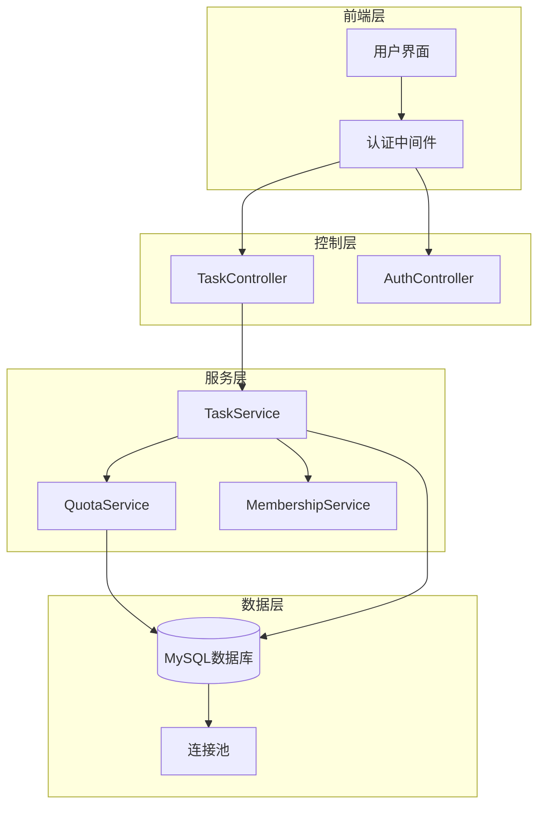

**图表来源**
- [task.controller.js](file://backend/src/controllers/task.controller.js#L1-L173)
- [task.service.js](file://backend/src/services/task.service.js#L1-L259)
- [quota.service.js](file://backend/src/services/quota.service.js#L1-L130)

**章节来源**
- [task.controller.js](file://backend/src/controllers/task.controller.js#L1-L173)
- [task.service.js](file://backend/src/services/task.service.js#L1-L259)
- [quota.service.js](file://backend/src/services/quota.service.js#L1-L130)

## 核心组件分析

### QuotaService 类结构

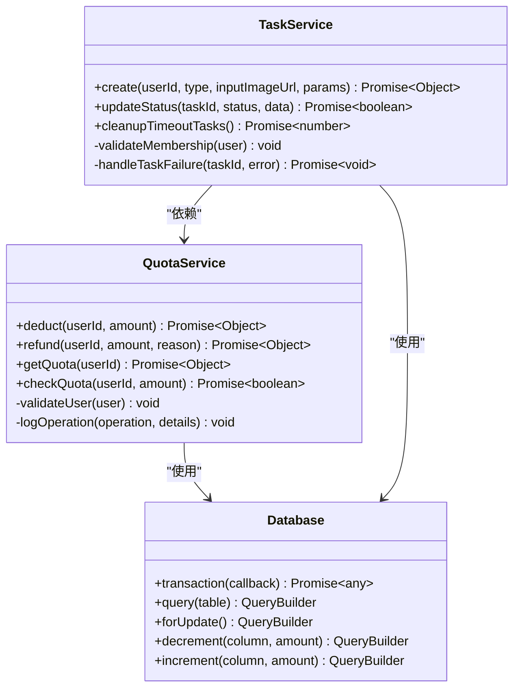

**图表来源**
- [quota.service.js](file://backend/src/services/quota.service.js#L8-L130)
- [task.service.js](file://backend/src/services/task.service.js#L8-L259)

### 数据模型设计

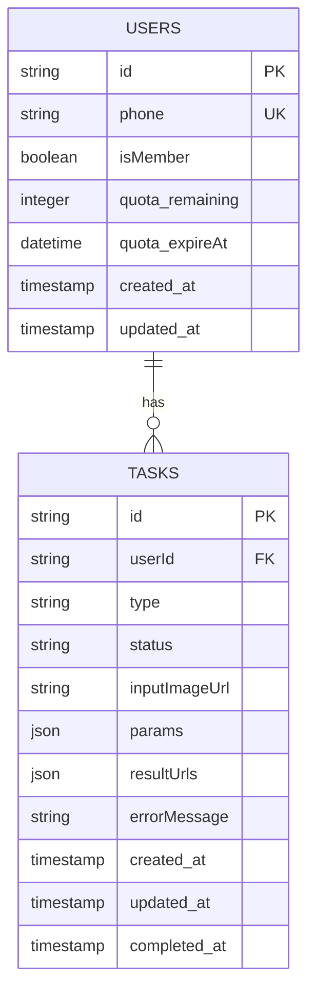

**图表来源**
- [20251028000001_create_users_table.js](file://backend/src/db/migrations/20251028000001_create_users_table.js#L4-L15)

**章节来源**
- [quota.service.js](file://backend/src/services/quota.service.js#L8-L130)
- [20251028000001_create_users_table.js](file://backend/src/db/migrations/20251028000001_create_users_table.js#L1-L24)

## 事务性配额操作详解

### deduct 方法深度分析

deduct方法是配额服务的核心入口，采用了严格的事务性设计来确保操作的原子性和一致性。

#### 事务执行流程

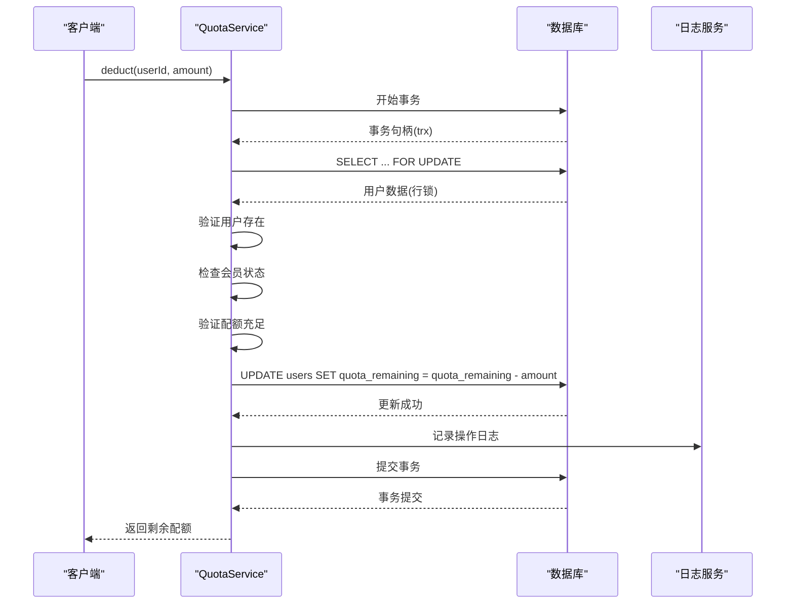

**图表来源**
- [quota.service.js](file://backend/src/services/quota.service.js#L15-L60)

#### 关键技术实现

1. **事务边界**：整个扣减过程在一个数据库事务中执行
2. **行锁机制**：使用`FOR UPDATE`防止其他事务同时修改同一用户数据
3. **原子操作**：使用`decrement`方法确保数据库层面的原子性
4. **严格验证**：包含用户存在性、会员状态、配额充足性检查

**章节来源**
- [quota.service.js](file://backend/src/services/quota.service.js#L15-L60)

### refund 方法补偿机制

refund方法实现了任务失败时的配额返还机制，确保系统的公平性和用户体验。

#### 返还操作流程

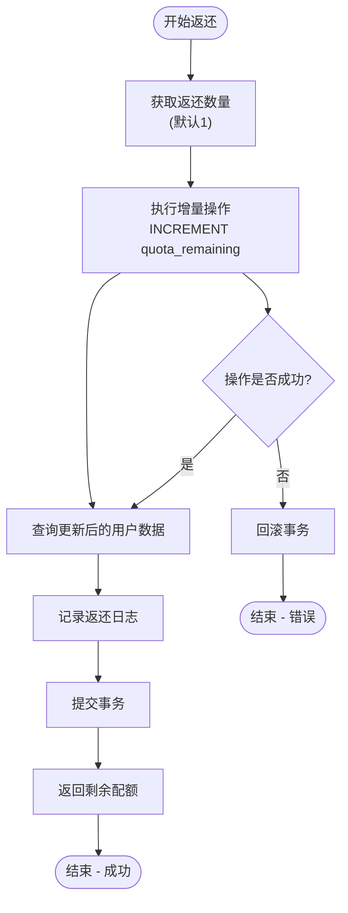

**图表来源**
- [quota.service.js](file://backend/src/services/quota.service.js#L62-L80)

**章节来源**
- [quota.service.js](file://backend/src/services/quota.service.js#L62-L80)

## 并发安全控制机制

### Knex事务与FOR UPDATE行锁组合

系统通过Knex事务和FOR UPDATE行锁的组合使用，实现了强一致性的并发控制。

#### 并发控制策略

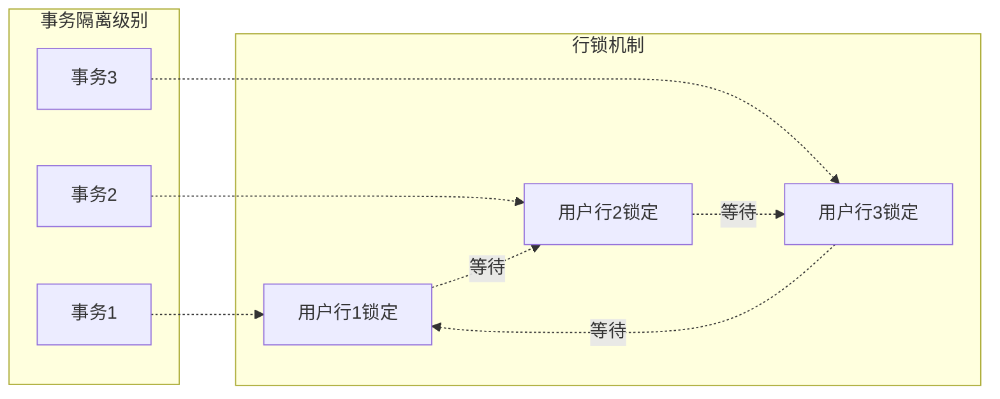

**图表来源**
- [quota.service.js](file://backend/src/services/quota.service.js#L20-L25)

#### 锁定策略详解

1. **排他性锁定**：FOR UPDATE确保同一时间只有一个事务可以修改用户数据
2. **短生命周期**：行锁在事务提交后立即释放，减少锁竞争
3. **顺序执行**：数据库保证事务按照提交顺序执行，避免死锁

**章节来源**
- [quota.service.js](file://backend/src/services/quota.service.js#L20-L25)

### 任务服务中的并发控制

TaskService在创建任务时，通过QuotaService的deduct方法确保并发安全。

#### 任务创建并发流程

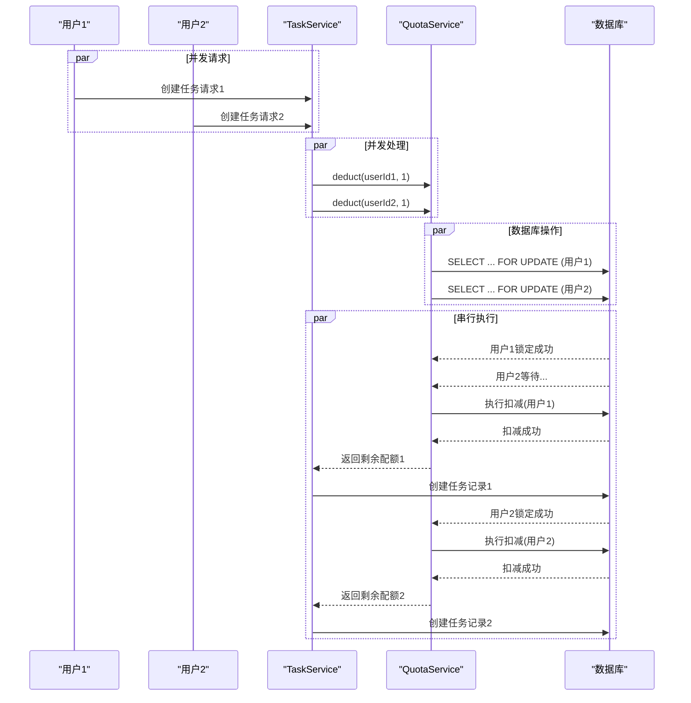

**图表来源**
- [task.service.js](file://backend/src/services/task.service.js#L30-L40)
- [quota.service.js](file://backend/src/services/quota.service.js#L15-L60)

**章节来源**
- [task.service.js](file://backend/src/services/task.service.js#L30-L40)

## 补偿机制与异常处理

### 任务失败补偿流程

系统在任务失败时自动触发配额返还机制，确保用户不会因系统错误而损失配额。

#### 补偿机制架构

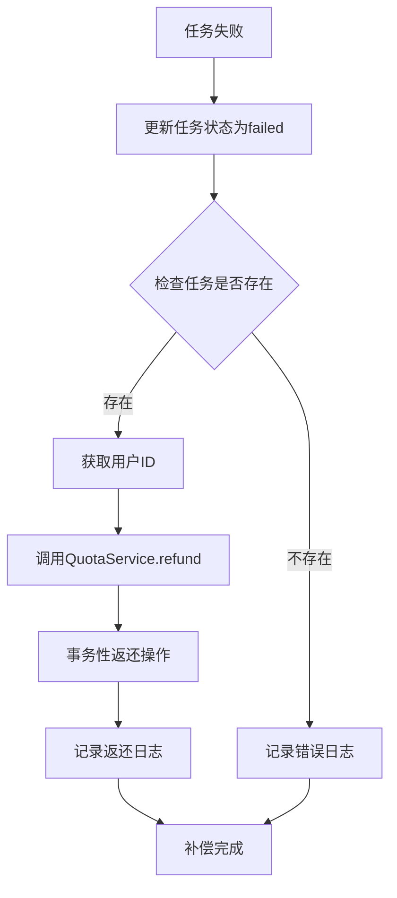

**图表来源**
- [task.service.js](file://backend/src/services/task.service.js#L141-L150)

### 异常处理回滚机制

系统实现了多层次的异常处理和回滚机制，确保数据一致性。

#### 异常处理层次

| 层级 | 处理范围 | 回滚策略 |
|------|----------|----------|
| 应用层 | 控制器异常 | HTTP响应错误码 |
| 服务层 | 业务逻辑异常 | 事务回滚 |
| 数据层 | 数据库异常 | 自动回滚 |
| 连接池 | 连接异常 | 连接重试 |

**章节来源**
- [task.service.js](file://backend/src/services/task.service.js#L141-L150)
- [quota.service.js](file://backend/src/services/quota.service.js#L25-L45)

## 查询逻辑与性能优化

### getQuota 方法查询优化

getQuota方法提供了高效的配额信息查询功能，支持多种查询场景。

#### 查询逻辑分析

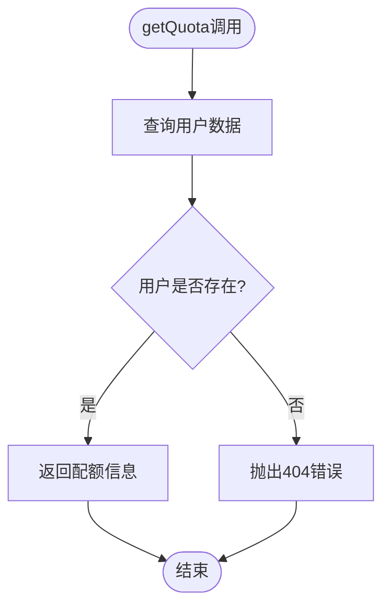

**图表来源**
- [quota.service.js](file://backend/src/services/quota.service.js#L82-L95)

### checkQuota 方法快速验证

checkQuota方法提供了轻量级的配额检查功能，适用于前置验证场景。

#### 性能优化策略

1. **单次查询**：只执行一次数据库查询
2. **早期返回**：在发现不满足条件时立即返回
3. **索引优化**：利用用户ID和手机号的索引加速查询

**章节来源**
- [quota.service.js](file://backend/src/services/quota.service.js#L97-L110)
- [quota.service.js](file://backend/src/services/quota.service.js#L82-L95)

## 数据库事务边界设定

### 事务配置与连接池管理

系统通过Knex配置实现了灵活的事务管理和连接池控制。

#### 数据库连接配置

| 配置项 | 开发环境 | 生产环境 | 说明 |
|--------|----------|----------|------|
| 最小连接数 | 2 | 5 | 保证基本并发需求 |
| 最大连接数 | 10 | 20 | 防止连接过多导致性能下降 |
| 字符集 | utf8mb4 | utf8mb4 | 支持完整的Unicode字符 |
| 事务隔离级别 | 默认 | 默认 | 使用数据库默认隔离级别 |

**章节来源**
- [knexfile.js](file://backend/knexfile.js#L1-L47)
- [database.js](file://backend/src/config/database.js#L1-L10)

### 事务边界设计原则

1. **最小化事务范围**：只在必要的操作上使用事务
2. **快速提交**：事务完成后尽快提交以释放资源
3. **异常安全**：确保异常情况下事务能够正确回滚

## 高并发竞争条件规避策略

### 竞争条件类型分析

系统面临的主要竞争条件包括：

1. **超卖问题**：多个请求同时检查配额，导致配额被超额扣除
2. **数据不一致**：并发更新导致数据状态不一致
3. **死锁风险**：事务间相互等待导致系统阻塞

### 规避策略实施

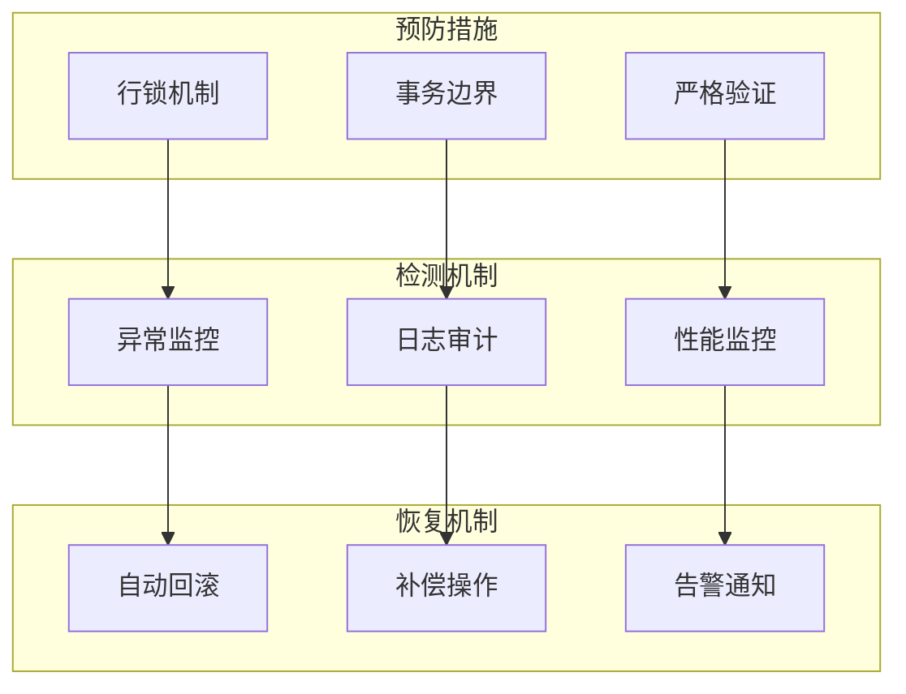

**章节来源**
- [quota.service.js](file://backend/src/services/quota.service.js#L15-L60)

## 性能优化建议

### 缓存配额信息的潜在风险

虽然缓存可以显著提升性能，但在配额管理场景中需要谨慎考虑：

#### 缓存风险评估

| 风险类型 | 影响程度 | 风险等级 | 缓解措施 |
|----------|----------|----------|----------|
| 数据不一致 | 高 | 极高 | 设置合理的缓存过期时间 |
| 超卖风险 | 中 | 高 | 结合行锁使用 |
| 内存占用 | 低 | 中 | 实施LRU淘汰策略 |
| 缓存穿透 | 中 | 中 | 添加空值缓存 |

#### 缓存策略建议

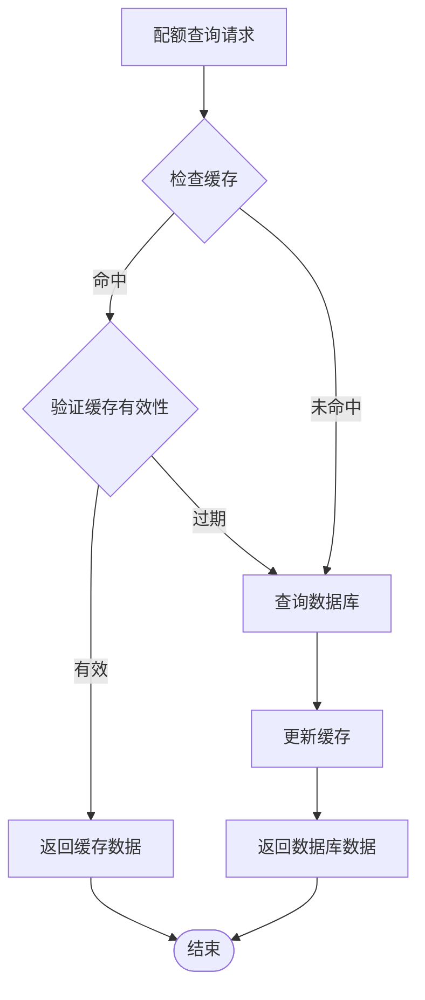

### 性能优化最佳实践

1. **批量操作**：对于高频操作，考虑批量处理
2. **索引优化**：确保用户ID和手机号有适当的索引
3. **连接池调优**：根据并发量调整连接池大小
4. **监控告警**：建立完善的性能监控体系

**章节来源**
- [knexfile.js](file://backend/knexfile.js#L15-L25)

## 故障排除指南

### 常见问题诊断

#### 配额扣减失败

**症状**：用户无法创建任务，提示配额不足
**排查步骤**：
1. 检查用户会员状态
2. 验证配额余额
3. 确认数据库连接状态
4. 查看事务执行日志

#### 并发冲突问题

**症状**：偶尔出现配额超卖或数据不一致
**排查步骤**：
1. 检查行锁是否正常工作
2. 验证事务隔离级别
3. 分析数据库慢查询日志
4. 监控连接池使用情况

### 监控指标建议

| 指标类别 | 关键指标 | 正常范围 | 告警阈值 |
|----------|----------|----------|----------|
| 性能指标 | 平均响应时间 | < 100ms | > 500ms |
| 可用性指标 | 事务成功率 | > 99.9% | < 99% |
| 资源指标 | 连接池使用率 | < 80% | > 90% |
| 业务指标 | 配额扣减成功率 | > 99.5% | < 99% |

**章节来源**
- [quota.service.js](file://backend/src/services/quota.service.js#L15-L60)
- [task.service.js](file://backend/src/services/task.service.js#L30-L40)

## 总结

配额服务通过以下关键技术实现了高可靠性的配额管理：

### 核心技术优势

1. **事务性操作**：所有配额操作都在数据库事务中执行，确保操作的原子性和一致性
2. **行锁机制**：使用FOR UPDATE行锁防止并发竞争条件，确保数据一致性
3. **补偿机制**：任务失败时自动返还配额，保障用户体验
4. **严格验证**：多层次的验证机制防止非法操作
5. **异常处理**：完善的错误处理和回滚机制

### 设计原则总结

- **原子性优先**：所有业务操作必须保证原子性
- **并发安全**：采用行锁等机制防止并发问题
- **异常容错**：完善的异常处理和补偿机制
- **性能平衡**：在安全性和性能之间找到最佳平衡点
- **可监控性**：完整的日志和监控体系

这套配额管理系统为AI图像处理平台提供了可靠的计费基础设施，确保了业务的稳定运行和用户体验的连续性。通过持续的监控和优化，系统能够在高并发场景下保持稳定的性能表现。