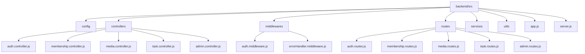
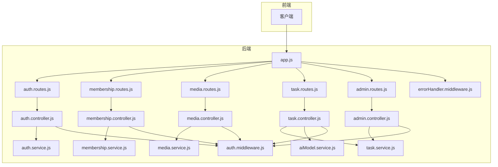
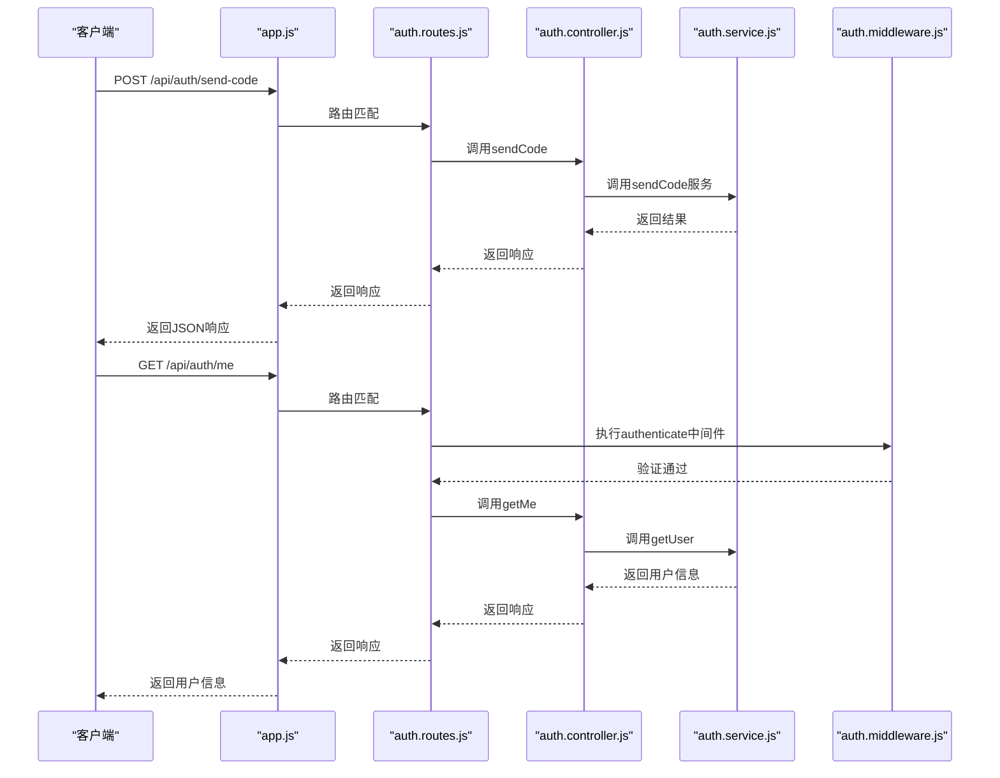
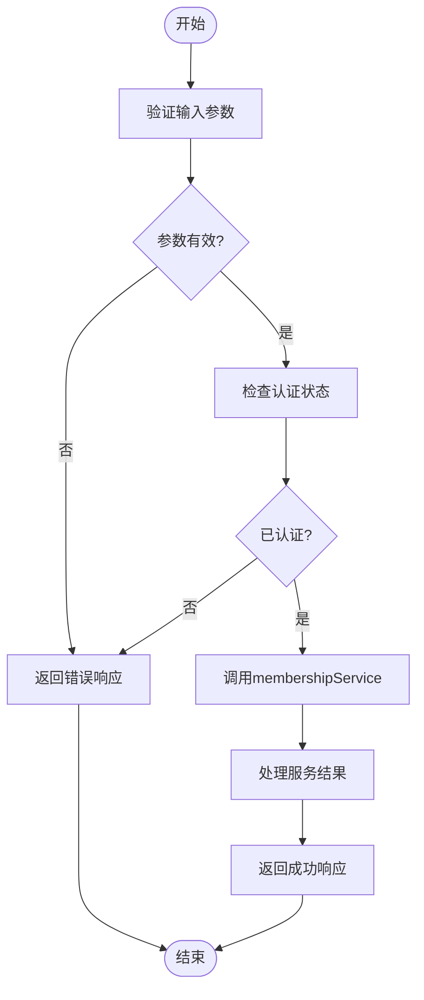
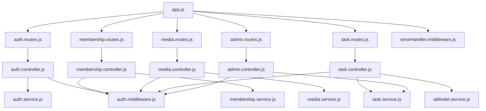

# 路由系统

<cite>
**本文档引用的文件**  
- [app.js](file://backend/src/app.js)
- [auth.routes.js](file://backend/src/routes/auth.routes.js)
- [admin.routes.js](file://backend/src/routes/admin.routes.js)
- [media.routes.js](file://backend/src/routes/media.routes.js)
- [membership.routes.js](file://backend/src/routes/membership.routes.js)
- [task.routes.js](file://backend/src/routes/task.routes.js)
- [auth.controller.js](file://backend/src/controllers/auth.controller.js)
- [admin.controller.js](file://backend/src/controllers/admin.controller.js)
- [media.controller.js](file://backend/src/controllers/media.controller.js)
- [membership.controller.js](file://backend/src/controllers/membership.controller.js)
- [task.controller.js](file://backend/src/controllers/task.controller.js)
- [auth.middleware.js](file://backend/src/middlewares/auth.middleware.js)
- [errorHandler.middleware.js](file://backend/src/middlewares/errorHandler.middleware.js)
</cite>

## 目录
1. [简介](#简介)
2. [项目结构](#项目结构)
3. [核心组件](#核心组件)
4. [架构概览](#架构概览)
5. [详细组件分析](#详细组件分析)
6. [依赖分析](#依赖分析)
7. [性能考虑](#性能考虑)
8. [故障排除指南](#故障排除指南)
9. [结论](#结论)

## 简介
本文档详细描述了基于Express框架的后端路由系统，重点分析其组织结构与请求分发机制。系统采用模块化路由设计，通过`app.js`中的`app.use()`方法注册各功能模块的路由，并结合中间件链实现权限控制与请求处理。每个路由模块（auth、membership、media、task、admin）均映射到对应的控制器，遵循RESTful API设计原则，通过统一的API前缀（如`/api/auth`）进行功能聚合与权限隔离。文档还探讨了潜在的扩展点，如新增AI功能路由的可能性。

## 项目结构

**图示来源**  
- [app.js](file://backend/src/app.js#L1-L50)
- [routes](file://backend/src/routes)
- [controllers](file://backend/src/controllers)

**本节来源**  
- [app.js](file://backend/src/app.js#L1-L50)
- [routes](file://backend/src/routes)
- [controllers](file://backend/src/controllers)

## 核心组件

后端路由系统的核心组件包括Express应用实例、路由模块、控制器、中间件和服务层。`app.js`作为应用入口，负责初始化Express实例并注册所有中间件和路由。每个路由模块（如`auth.routes.js`）定义了特定功能的API端点，并通过`require()`导入对应的控制器。控制器类（如`AuthController`）封装了具体的业务逻辑，并通过异步方法处理HTTP请求。认证中间件（`auth.middleware.js`）确保受保护的路由只能由经过身份验证的用户访问，而错误处理中间件（`errorHandler.middleware.js`）则统一处理应用中的异常情况。

**本节来源**  
- [app.js](file://backend/src/app.js#L1-L50)
- [auth.routes.js](file://backend/src/routes/auth.routes.js#L1-L27)
- [auth.controller.js](file://backend/src/controllers/auth.controller.js#L1-L99)
- [auth.middleware.js](file://backend/src/middlewares/auth.middleware.js#L1-L76)

## 架构概览

**图示来源**  
- [app.js](file://backend/src/app.js#L1-L50)
- [routes](file://backend/src/routes)
- [controllers](file://backend/src/controllers)
- [services](file://backend/src/services)
- [middlewares](file://backend/src/middlewares)

## 详细组件分析

### 认证路由分析

认证路由模块（`auth.routes.js`）处理用户身份验证相关的请求，包括发送验证码、登录/注册和获取当前用户信息。该模块通过`/api/auth`前缀进行功能聚合，所有公共接口（如`/send-code`和`/login`）无需身份验证，而私有接口（如`/me`）则需要通过`authenticate`中间件进行JWT验证。控制器方法与路由的绑定通过`authController.sendCode`等方式实现，确保请求被正确分发到相应的处理函数。

**图示来源**  
- [auth.routes.js](file://backend/src/routes/auth.routes.js#L1-L27)
- [auth.controller.js](file://backend/src/controllers/auth.controller.js#L1-L99)
- [auth.service.js](file://backend/src/services/auth.service.js#L1-L50)
- [auth.middleware.js](file://backend/src/middlewares/auth.middleware.js#L1-L76)

**本节来源**  
- [auth.routes.js](file://backend/src/routes/auth.routes.js#L1-L27)
- [auth.controller.js](file://backend/src/controllers/auth.controller.js#L1-L99)

### 会员路由分析

会员路由模块（`membership.routes.js`）负责处理与会员相关的操作，如购买会员、支付回调和获取会员状态。该模块通过`/api/membership`前缀进行功能聚合，其中`/purchase`和`/status`接口需要用户登录，而`/payment-callback`作为支付平台的回调接口则对公众开放。这种设计既保证了用户数据的安全性，又允许外部系统与后端进行必要的通信。

**图示来源**  
- [membership.routes.js](file://backend/src/routes/membership.routes.js#L1-L27)
- [membership.controller.js](file://backend/src/controllers/membership.controller.js#L1-L77)
- [membership.service.js](file://backend/src/services/membership.service.js#L1-L50)

**本节来源**  
- [membership.routes.js](file://backend/src/routes/membership.routes.js#L1-L27)
- [membership.controller.js](file://backend/src/controllers/membership.controller.js#L1-L77)

### 媒体路由分析

媒体路由模块（`media.routes.js`）处理与COS上传相关的请求，如获取STS临时密钥和验证文件上传参数。所有接口均需登录，体现了对资源访问的严格控制。`/sts`接口用于获取临时凭证，以便前端安全地上传文件到云存储，而`/validate`接口则确保上传的文件符合大小和类型要求。

**本节来源**  
- [media.routes.js](file://backend/src/routes/media.routes.js#L1-L17)
- [media.controller.js](file://backend/src/controllers/media.controller.js#L1-L64)

### 任务路由分析

任务路由模块（`task.routes.js`）是系统的核心功能之一，负责处理AI处理任务的创建、查询和状态更新。通过`/api/task`前缀进行功能聚合，所有接口均需登录。`/create`接口支持创建不同类型的任务（如`basic_clean`或`model_pose12`），并根据任务类型触发相应的处理流程。`/list`和`/:taskId`接口允许用户查询任务列表和详情，而`/:taskId/status`接口则用于内部或管理员更新任务状态。

**本节来源**  
- [task.routes.js](file://backend/src/routes/task.routes.js#L1-L23)
- [task.controller.js](file://backend/src/controllers/task.controller.js#L1-L172)

### 管理后台路由分析

管理后台路由模块（`admin.routes.js`）提供系统管理功能，如查看用户列表、任务列表和系统概览。通过`/api/admin`前缀进行权限隔离，所有接口均需登录，且在生产环境中应进一步限制为管理员角色。该模块的设计体现了权限分层的思想，确保普通用户无法访问敏感的管理功能。

**本节来源**  
- [admin.routes.js](file://backend/src/routes/admin.routes.js#L1-L25)
- [admin.controller.js](file://backend/src/controllers/admin.controller.js#L1-L252)

## 依赖分析

**图示来源**  
- [app.js](file://backend/src/app.js#L1-L50)
- [routes](file://backend/src/routes)
- [controllers](file://backend/src/controllers)
- [services](file://backend/src/services)
- [middlewares](file://backend/src/middlewares)

**本节来源**  
- [app.js](file://backend/src/app.js#L1-L50)
- [routes](file://backend/src/routes)
- [controllers](file://backend/src/controllers)
- [services](file://backend/src/services)
- [middlewares](file://backend/src/middlewares)

## 性能考虑

路由系统的性能主要受中间件链和数据库查询的影响。认证中间件（`auth.middleware.js`）通过JWT验证用户身份，避免了频繁的数据库查询。错误处理中间件（`errorHandler.middleware.js`）统一捕获和记录异常，提高了系统的稳定性和可维护性。对于高并发场景，建议对频繁访问的接口（如`/api/task/list`）实施缓存策略，并优化数据库查询语句以减少响应时间。

## 故障排除指南

当路由系统出现问题时，首先检查`app.js`中的路由注册是否正确，确保`app.use()`调用的路径与实际路由文件匹配。其次，验证中间件的执行顺序，特别是认证中间件是否正确应用于需要保护的路由。对于控制器方法，确保其异步处理逻辑正确，并通过`next()`函数传递错误。最后，检查日志文件（`logger.js`）以获取详细的错误信息，帮助定位问题根源。

**本节来源**  
- [app.js](file://backend/src/app.js#L1-L50)
- [auth.middleware.js](file://backend/src/middlewares/auth.middleware.js#L1-L76)
- [errorHandler.middleware.js](file://backend/src/middlewares/errorHandler.middleware.js#L1-L45)
- [logger.js](file://backend/src/utils/logger.js#L1-L20)

## 结论

本文档全面分析了基于Express框架的后端路由系统，涵盖了其组织结构、请求分发机制、权限控制和扩展性。通过模块化设计和中间件链，系统实现了功能聚合与权限隔离，为未来的功能扩展（如新增AI功能路由）提供了良好的基础。建议在生产环境中进一步强化安全措施，如使用HTTPS、限制API速率和实施更细粒度的权限控制。