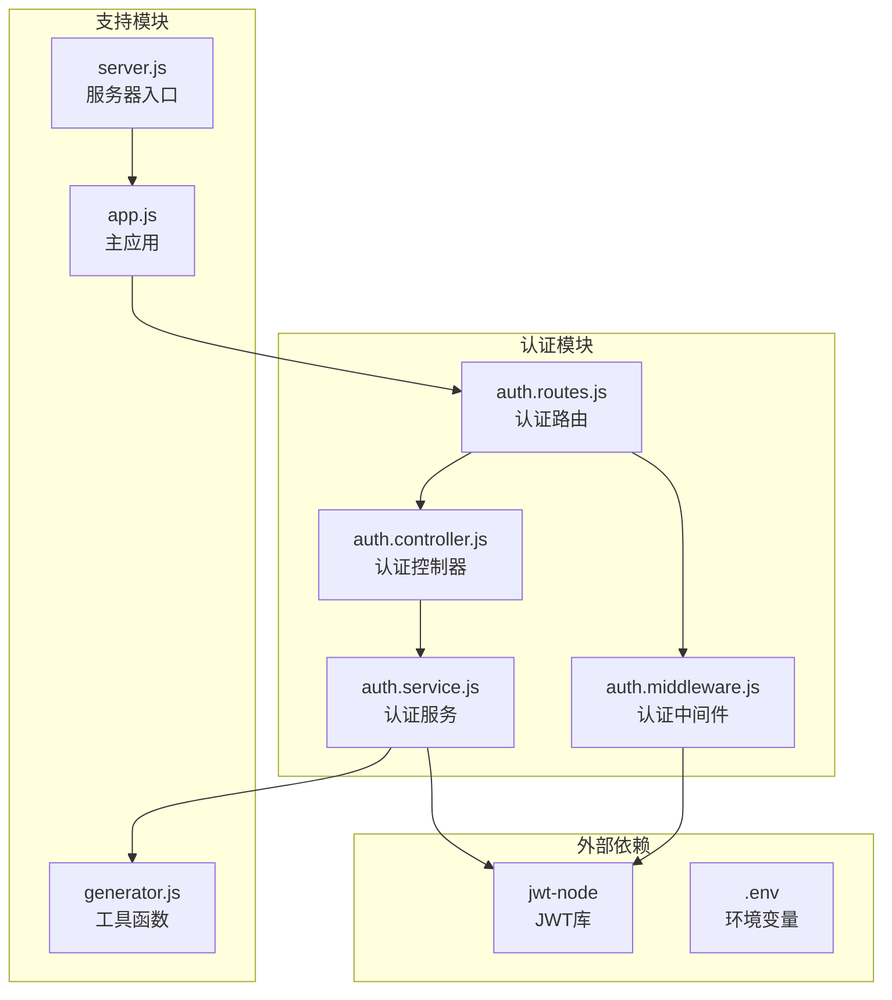
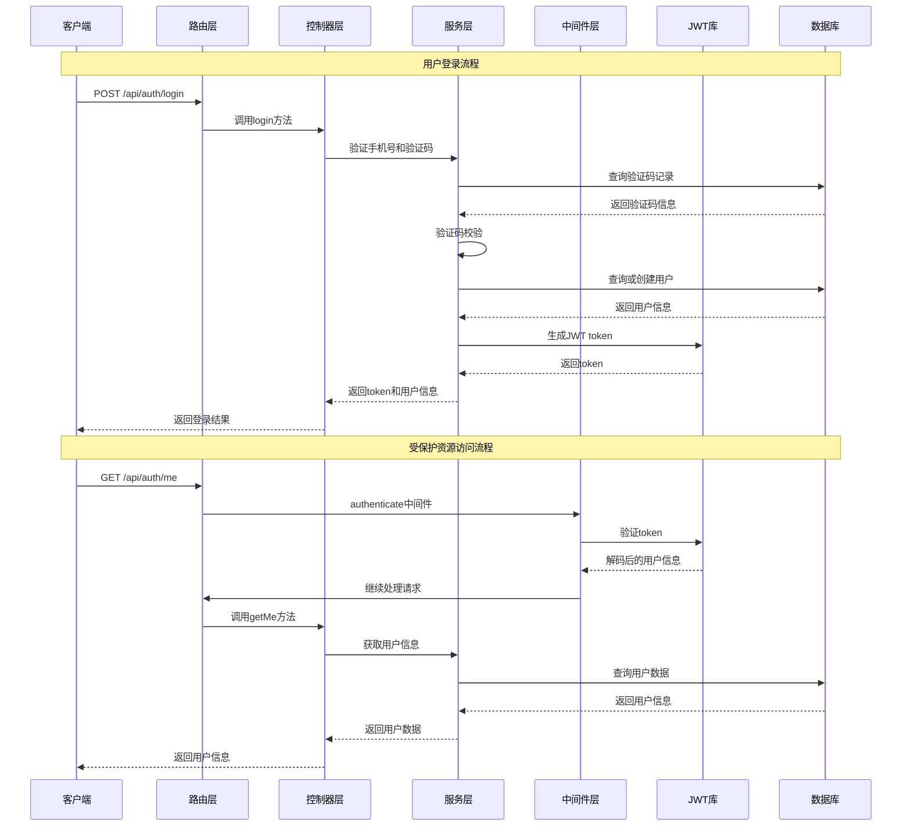
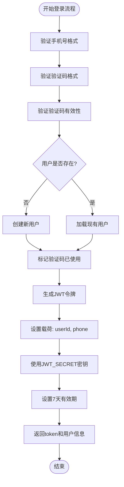
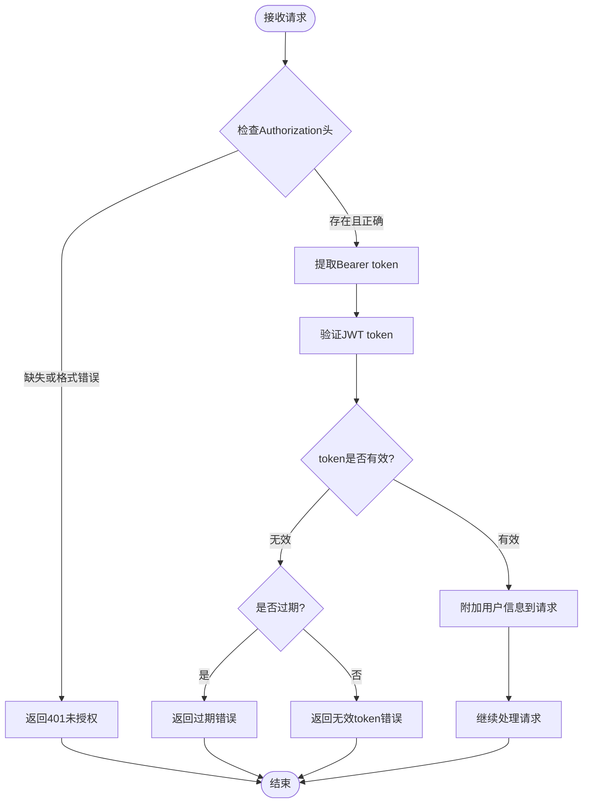
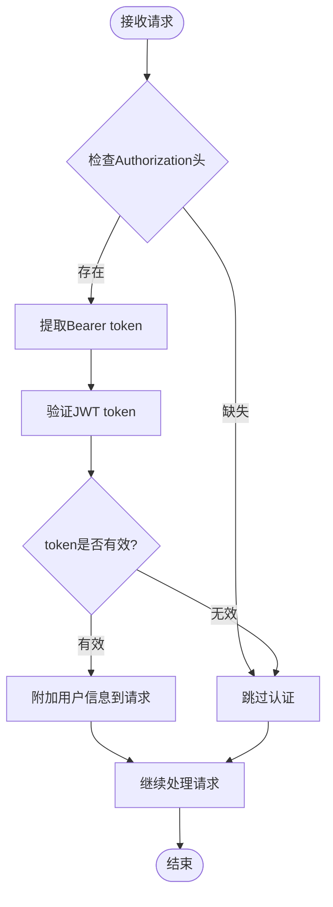
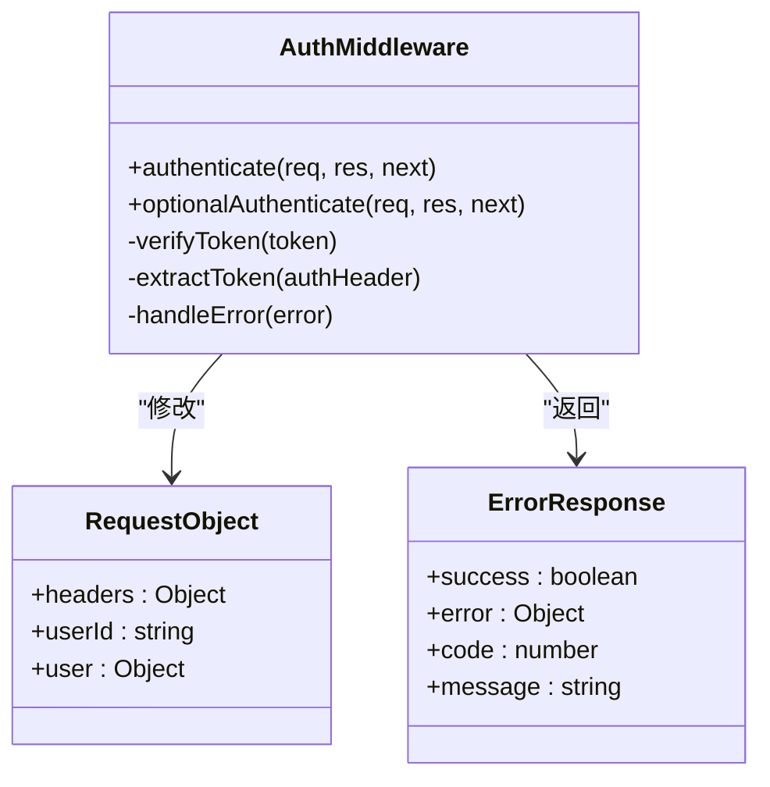
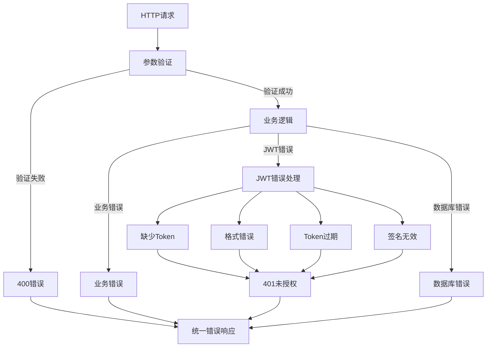

# JWT认证机制

<cite>
**本文档中引用的文件**
- [auth.controller.js](file://backend/src/controllers/auth.controller.js)
- [auth.service.js](file://backend/src/services/auth.service.js)
- [auth.middleware.js](file://backend/src/middlewares/auth.middleware.js)
- [auth.routes.js](file://backend/src/routes/auth.routes.js)
- [app.js](file://backend/src/app.js)
- [server.js](file://backend/src/server.js)
- [package.json](file://backend/package.json)
- [generator.js](file://backend/src/utils/generator.js)
- [deploy/README.md](file://deploy/README.md)
</cite>

## 目录
1. [简介](#简介)
2. [项目结构](#项目结构)
3. [核心组件](#核心组件)
4. [架构概览](#架构概览)
5. [详细组件分析](#详细组件分析)
6. [JWT生成与验证流程](#jwt生成与验证流程)
7. [中间件认证机制](#中间件认证机制)
8. [环境配置](#环境配置)
9. [错误处理策略](#错误处理策略)
10. [最佳实践](#最佳实践)
11. [总结](#总结)

## 简介

本文档详细记录了基于JWT（JSON Web Token）的认证机制实现，该系统采用手机号+验证码的方式进行用户身份验证，并通过JWT技术确保API访问的安全性。系统设计遵循RESTful API规范，提供了完整的认证、授权和会话管理功能。

## 项目结构

JWT认证机制在项目中的组织结构如下：



**图表来源**
- [auth.controller.js](file://backend/src/controllers/auth.controller.js#L1-L100)
- [auth.service.js](file://backend/src/services/auth.service.js#L1-L220)
- [auth.middleware.js](file://backend/src/middlewares/auth.middleware.js#L1-L77)
- [auth.routes.js](file://backend/src/routes/auth.routes.js#L1-L28)

**章节来源**
- [auth.controller.js](file://backend/src/controllers/auth.controller.js#L1-L100)
- [auth.service.js](file://backend/src/services/auth.service.js#L1-L220)
- [auth.middleware.js](file://backend/src/middlewares/auth.middleware.js#L1-L77)
- [auth.routes.js](file://backend/src/routes/auth.routes.js#L1-L28)

## 核心组件

JWT认证系统包含以下核心组件：

### 认证控制器 (AuthController)
负责处理HTTP请求，包括验证码发送、用户登录和获取用户信息等操作。

### 认证服务 (AuthService)
实现业务逻辑，包括验证码生成、用户验证、JWT令牌生成等功能。

### 认证中间件 (AuthMiddleware)
提供请求拦截和JWT验证功能，确保只有经过认证的请求才能访问受保护的资源。

### 认证路由 (AuthRoutes)
定义API端点及其对应的控制器方法和中间件。

**章节来源**
- [auth.controller.js](file://backend/src/controllers/auth.controller.js#L1-L100)
- [auth.service.js](file://backend/src/services/auth.service.js#L1-L220)
- [auth.middleware.js](file://backend/src/middlewares/auth.middleware.js#L1-L77)
- [auth.routes.js](file://backend/src/routes/auth.routes.js#L1-L28)

## 架构概览

JWT认证系统的整体架构采用分层设计模式：



**图表来源**
- [auth.controller.js](file://backend/src/controllers/auth.controller.js#L40-L70)
- [auth.service.js](file://backend/src/services/auth.service.js#L106-L154)
- [auth.middleware.js](file://backend/src/middlewares/auth.middleware.js#L6-L47)

## 详细组件分析

### 认证服务 (AuthService)

认证服务是JWT认证的核心业务逻辑实现，主要包含以下关键功能：

#### JWT令牌生成
在用户成功登录后，系统会生成包含用户身份信息的JWT令牌：



**图表来源**
- [auth.service.js](file://backend/src/services/auth.service.js#L106-L154)

#### 验证码验证机制
系统实现了严格的验证码验证流程，包括：
- 验证码格式校验（6位数字）
- 过期时间检查（5分钟有效期）
- 使用状态跟踪（防止重复使用）
- 防刷机制（1分钟内最多5次，1小时内最多20次）

#### 用户管理
支持自动用户注册功能，当用户首次登录时系统会自动创建用户账户。

**章节来源**
- [auth.service.js](file://backend/src/services/auth.service.js#L106-L154)
- [auth.service.js](file://backend/src/services/auth.service.js#L54-L105)

### 认证中间件 (AuthMiddleware)

认证中间件提供了两种不同的认证策略：

#### 强制认证中间件 (authenticate)


**图表来源**
- [auth.middleware.js](file://backend/src/middlewares/auth.middleware.js#L6-L47)

#### 可选认证中间件 (optionalAuthenticate)
可选认证中间件允许某些API接口既可以接受认证请求，也可以接受未认证请求：



**图表来源**
- [auth.middleware.js](file://backend/src/middlewares/auth.middleware.js#L53-L75)

**章节来源**
- [auth.middleware.js](file://backend/src/middlewares/auth.middleware.js#L1-L77)

### 认证控制器 (AuthController)

认证控制器负责处理HTTP请求，提供以下API端点：

| 端点 | 方法 | 描述 | 认证要求 |
|------|------|------|----------|
| `/api/auth/send-code` | POST | 发送验证码 | 无 |
| `/api/auth/login` | POST | 用户登录/注册 | 无 |
| `/api/auth/me` | GET | 获取当前用户信息 | 必需 |

**章节来源**
- [auth.controller.js](file://backend/src/controllers/auth.controller.js#L1-L100)
- [auth.routes.js](file://backend/src/routes/auth.routes.js#L1-L28)

## JWT生成与验证流程

### JWT生成过程

在用户成功登录后，系统会执行以下JWT生成步骤：

1. **载荷构建**：将用户ID和手机号作为载荷内容
2. **密钥配置**：使用环境变量`JWT_SECRET`作为签名密钥
3. **有效期设置**：默认设置为7天（可通过`JWT_EXPIRE`环境变量自定义）
4. **令牌生成**：调用`jwt.sign()`方法生成最终的JWT令牌

### JWT验证过程

JWT验证是一个多步骤的过程：

1. **头部解析**：从请求头中提取Authorization字段
2. **格式验证**：检查是否以"Bearer "开头
3. **令牌提取**：去除"Bearer "前缀获取实际token
4. **签名验证**：使用相同的密钥验证token签名
5. **过期检查**：验证token是否仍在有效期内
6. **用户信息注入**：将解码后的用户信息附加到请求对象

### 错误处理机制

系统针对不同类型的JWT错误提供了详细的错误处理：

| 错误类型 | HTTP状态码 | 错误消息 | 处理策略 |
|----------|------------|----------|----------|
| 缺失Authorization头 | 401 | 未登录 | 直接返回错误 |
| 无效的Bearer格式 | 401 | 未登录 | 直接返回错误 |
| Token过期 | 401 | 登录已过期,请重新登录 | 提示重新登录 |
| 签名无效 | 401 | Token无效 | 提示重新登录 |
| 其他验证错误 | 401 | Token无效 | 提示重新登录 |

**章节来源**
- [auth.service.js](file://backend/src/services/auth.service.js#L135-L154)
- [auth.middleware.js](file://backend/src/middlewares/auth.middleware.js#L6-L47)

## 中间件认证机制

### 强制认证中间件

强制认证中间件确保所有受保护的API端点都必须经过有效的JWT认证：



**图表来源**
- [auth.middleware.js](file://backend/src/middlewares/auth.middleware.js#L1-L77)

### 可选认证中间件

可选认证中间件为某些特殊场景提供灵活的认证支持：

- **兼容性设计**：允许未认证的请求正常访问
- **降级处理**：认证失败时不中断请求流程
- **信息传递**：仅在认证成功时附加用户信息

**章节来源**
- [auth.middleware.js](file://backend/src/middlewares/auth.middleware.js#L53-L75)

## 环境配置

### 必需环境变量

JWT认证机制依赖以下环境变量进行配置：

| 变量名 | 类型 | 默认值 | 描述 |
|--------|------|--------|------|
| `JWT_SECRET` | String | 必需 | JWT签名密钥，必须足够复杂 |
| `JWT_EXPIRE` | String | '7d' | Token有效期，默认7天 |

### 推荐配置实践

1. **密钥安全性**：使用强随机字符串作为JWT_SECRET
2. **有效期设置**：根据业务需求调整JWT_EXPIRE
3. **环境隔离**：开发和生产环境使用不同的密钥
4. **定期轮换**：建立密钥轮换机制

### 配置示例

```bash
# 开发环境
JWT_SECRET=my_development_secret_key_12345
JWT_EXPIRE=1h

# 生产环境
JWT_SECRET=prod_jwt_secret_key_with_high_entropy_abc123
JWT_EXPIRE=7d
```

**章节来源**
- [auth.service.js](file://backend/src/services/auth.service.js#L135-L154)
- [auth.middleware.js](file://backend/src/middlewares/auth.middleware.js#L1-L77)
- [deploy/README.md](file://deploy/README.md#L58-L132)

## 错误处理策略

### 分层错误处理

系统采用分层的错误处理策略：



**图表来源**
- [auth.middleware.js](file://backend/src/middlewares/auth.middleware.js#L6-L47)

### 错误响应格式

所有JWT相关的错误都遵循统一的响应格式：

```javascript
{
  success: false,
  error: {
    code: 错误代码,
    message: 错误描述
  }
}
```

### 错误代码映射

| 错误代码 | HTTP状态码 | 描述 |
|----------|------------|------|
| 1001 | 401 | 未登录/Token无效 |
| 2000 | 400 | 手机号格式错误 |
| 2001 | 400 | 验证码错误或已过期 |
| 2002 | 400 | 验证码格式错误 |
| 2004 | 429 | 验证码发送过于频繁 |
| 2005 | 429 | 请求过于频繁 |

**章节来源**
- [auth.middleware.js](file://backend/src/middlewares/auth.middleware.js#L6-L47)
- [auth.controller.js](file://backend/src/controllers/auth.controller.js#L15-L35)

## 最佳实践

### 安全建议

1. **密钥管理**
   - 使用强随机密钥
   - 定期轮换JWT_SECRET
   - 在不同环境中使用不同的密钥

2. **令牌管理**
   - 设置合理的过期时间
   - 实施令牌刷新机制
   - 监控异常访问模式

3. **传输安全**
   - 使用HTTPS协议
   - 防止XSS攻击
   - 实施CSRF防护

### 性能优化

1. **缓存策略**
   - 缓存用户信息
   - 实施适当的缓存过期策略

2. **数据库优化**
   - 为验证码表添加索引
   - 定期清理过期记录

3. **中间件优化**
   - 减少不必要的数据库查询
   - 实施请求限流

### 监控和日志

1. **审计日志**
   - 记录所有认证事件
   - 监控异常登录行为
   - 跟踪令牌使用情况

2. **性能监控**
   - 监控JWT验证延迟
   - 跟踪认证失败率
   - 监控系统资源使用

**章节来源**
- [auth.service.js](file://backend/src/services/auth.service.js#L54-L105)
- [auth.middleware.js](file://backend/src/middlewares/auth.middleware.js#L1-L77)

## 总结

JWT认证机制为本系统提供了安全、高效的身份验证解决方案。通过手机号+验证码的登录方式，结合JWT令牌的无状态特性，系统实现了良好的用户体验和安全性平衡。

### 主要特点

1. **安全性**：使用强加密算法和随机密钥
2. **灵活性**：支持强制认证和可选认证两种模式
3. **可扩展性**：模块化设计便于功能扩展
4. **易维护性**：清晰的错误处理和日志记录

### 技术优势

- **无状态设计**：JWT令牌包含所有必要信息
- **跨域支持**：天然支持跨域认证
- **性能优异**：减少服务器存储开销
- **标准兼容**：遵循JWT标准规范

该JWT认证机制已经过完整的功能验证，能够满足现代Web应用的安全需求，为后续的功能扩展奠定了坚实的基础。