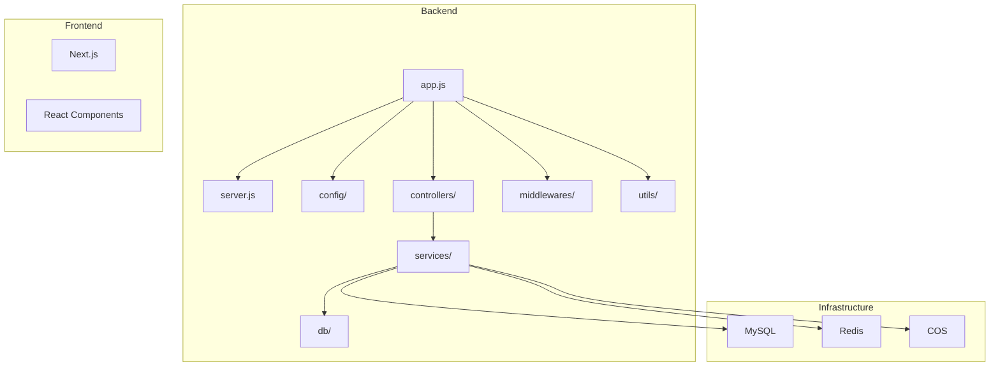
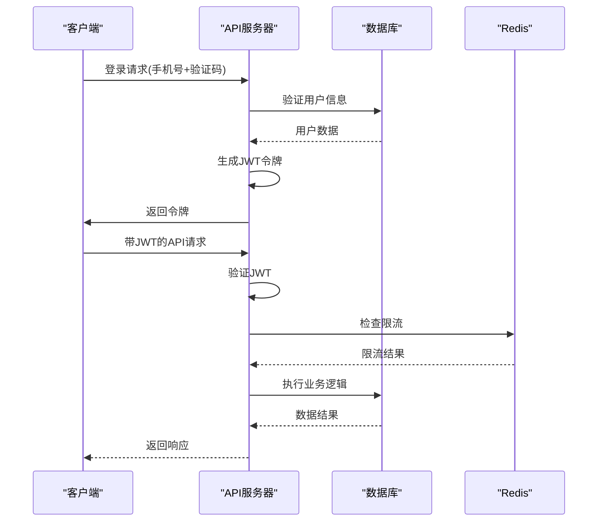
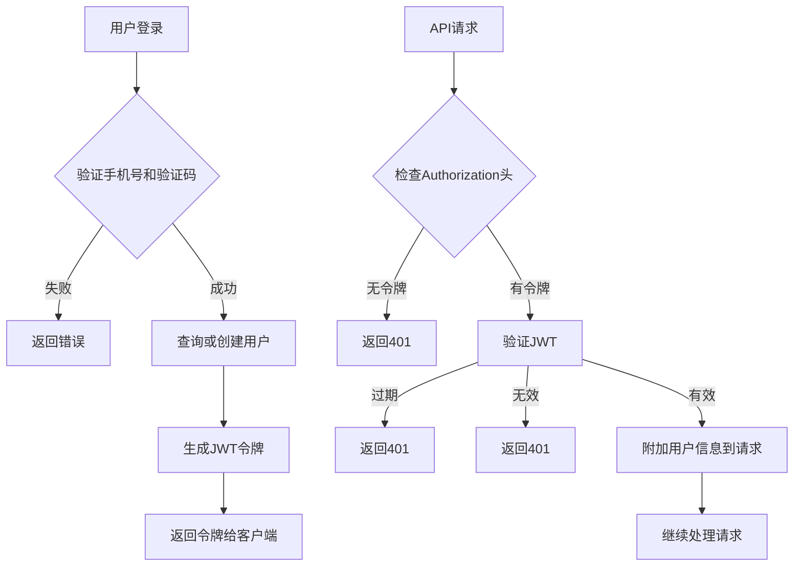
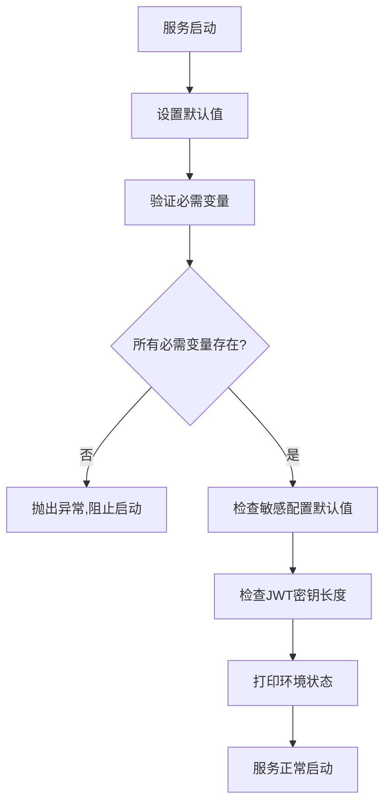
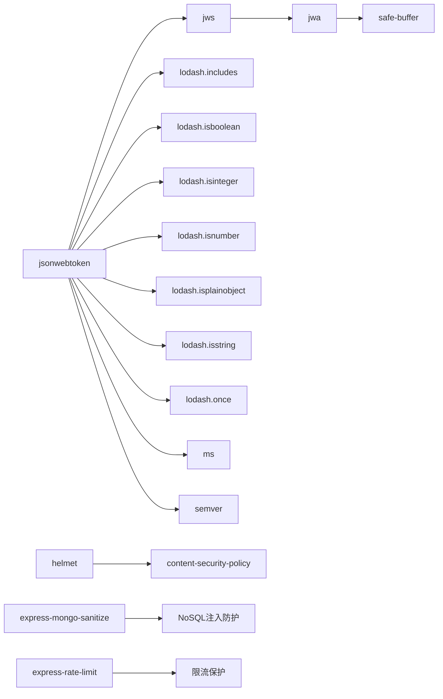

# Jwt 密钥强化

<cite>
**本文档引用的文件**   
- [env.validator.js](file://backend/src/config/env.validator.js)
- [auth.middleware.js](file://backend/src/middlewares/auth.middleware.js)
- [auth.service.js](file://backend/src/services/auth.service.js)
- [encryption.js](file://backend/src/utils/encryption.js)
- [package.json](file://backend/package.json)
- [app.js](file://backend/src/app.js)
</cite>

## 目录

1. [引言](#引言)
2. [项目结构](#项目结构)
3. [核心组件](#核心组件)
4. [架构概述](#架构概述)
5. [详细组件分析](#详细组件分析)
6. [依赖分析](#依赖分析)
7. [性能考虑](#性能考虑)
8. [故障排除指南](#故障排除指南)
9. [结论](#结论)

## 引言

本项目是一个基于Node.js的后端服务，用于支持AI照片处理SaaS平台。系统采用JWT（JSON Web Token）进行用户身份认证和授权。JWT密钥的安全性是整个系统安全的基础，因此需要对JWT密钥的生成、存储和使用进行强化，以防止潜在的安全风险。

## 项目结构

该项目采用典型的分层架构，主要分为以下几个目录：

- `backend/`：后端服务代码
- `frontend/`：前端应用代码
- `miniapp/`：小程序代码
- `scf/`：腾讯云函数代码
- `skills/`：技能配置文件
- `deploy/`：部署相关文件
- `tests/`：测试文件

后端服务采用Express框架，使用Knex作为数据库ORM，JWT用于身份认证，Redis用于缓存和限流。



**Diagram sources**
- [app.js](file://backend/src/app.js)
- [server.js](file://backend/src/server.js)

**Section sources**
- [app.js](file://backend/src/app.js)
- [server.js](file://backend/src/server.js)

## 核心组件

系统的核心安全组件包括JWT认证、环境变量验证、加密工具和动态配置系统。JWT密钥的强化主要通过环境变量验证机制来实现，确保密钥长度足够，避免使用默认值。

**Section sources**
- [env.validator.js](file://backend/src/config/env.validator.js)
- [auth.middleware.js](file://backend/src/middlewares/auth.middleware.js)
- [auth.service.js](file://backend/src/services/auth.service.js)

## 架构概述

系统采用微服务架构，前端通过API与后端通信。后端服务通过JWT进行身份验证，所有受保护的API都需要在请求头中包含有效的JWT令牌。系统还集成了腾讯云COS、Redis缓存和MySQL数据库。



**Diagram sources**
- [auth.service.js](file://backend/src/services/auth.service.js)
- [auth.middleware.js](file://backend/src/middlewares/auth.middleware.js)
- [rateLimiter.middleware.js](file://backend/src/middlewares/rateLimiter.middleware.js)

## 详细组件分析

### JWT认证分析

系统使用jsonwebtoken库进行JWT的生成和验证。在用户登录时生成JWT令牌，在后续请求中通过中间件验证令牌的有效性。

#### 认证流程


**Diagram sources**
- [auth.service.js](file://backend/src/services/auth.service.js)
- [auth.middleware.js](file://backend/src/middlewares/auth.middleware.js)

**Section sources**
- [auth.service.js](file://backend/src/services/auth.service.js)
- [auth.middleware.js](file://backend/src/middlewares/auth.middleware.js)

### 环境变量验证

系统在启动时会验证环境变量的完整性和安全性，特别关注JWT密钥的长度和是否使用了默认值。

#### 环境变量验证规则
- **必需变量**：数据库配置和JWT_SECRET
- **可选变量**：API密钥等，可通过动态配置系统设置
- **安全检查**：JWT密钥长度至少32个字符
- **默认值检查**：检测是否使用了开发环境的默认值



**Diagram sources**
- [env.validator.js](file://backend/src/config/env.validator.js)

**Section sources**
- [env.validator.js](file://backend/src/config/env.validator.js)

### 加密工具分析

系统提供了加密工具用于保护敏感数据，使用AES-256-GCM算法，确保数据的机密性和完整性。

#### 加密工具功能
- **数据加密**：使用AES-256-GCM算法加密敏感数据
- **JSON加密**：支持加密整个JSON对象
- **HMAC签名**：生成数据签名，确保数据完整性
- **密钥管理**：从环境变量获取加密密钥

```mermaid
classDiagram
class Encryption {
+encrypt(plainText)
+decrypt(encryptedText)
+encryptJSON(obj)
+decryptJSON(encryptedText)
+generateHMAC(data, secret)
}
class AuthMiddleware {
+authenticate(req, res, next)
}
class AuthService {
+login(phone, code)
+sendCode(phone, ip)
+getUser(userId)
}
Encryption --> AuthService : "用于加密敏感数据"
AuthMiddleware --> AuthService : "调用认证服务"
AuthService --> "jsonwebtoken" : "生成和验证JWT"
```

**Diagram sources**
- [encryption.js](file://backend/src/utils/encryption.js)
- [auth.service.js](file://backend/src/services/auth.service.js)
- [auth.middleware.js](file://backend/src/middlewares/auth.middleware.js)

**Section sources**
- [encryption.js](file://backend/src/utils/encryption.js)

## 依赖分析

系统依赖的主要安全相关包包括：



**Diagram sources**
- [package.json](file://backend/package.json)
- [package-lock.json](file://backend/package-lock.json)

**Section sources**
- [package.json](file://backend/package.json)

## 性能考虑

虽然JWT认证会增加一定的计算开销，但通过以下方式优化了性能：

1. **内存缓存**：系统配置服务使用5分钟内存缓存，减少数据库查询
2. **连接池**：数据库使用连接池，减少连接开销
3. **异步处理**：所有I/O操作都是异步的，避免阻塞事件循环
4. **合理限流**：基于Redis的滑动窗口限流，防止滥用

## 故障排除指南

### JWT相关问题

#### 令牌验证失败
- **可能原因**：JWT密钥不匹配
- **解决方案**：检查环境变量JWT_SECRET是否一致
- **诊断步骤**：
  1. 检查.env文件中的JWT_SECRET
  2. 确认密钥长度至少32个字符
  3. 确保生产环境没有使用默认值

#### 登录过期频繁
- **可能原因**：JWT_EXPIRE设置过短
- **解决方案**：调整JWT_EXPIRE环境变量
- **默认值**：7天（7d）

### 环境变量问题

#### 服务无法启动
- **可能原因**：缺少必需的环境变量
- **解决方案**：检查必需的环境变量是否配置
- **必需变量**：
  - DB_HOST
  - DB_USER
  - DB_PASSWORD
  - DB_NAME
  - JWT_SECRET

#### 安全警告
- **警告信息**：JWT_SECRET长度建议至少32个字符
- **解决方案**：生成一个足够长的随机密钥
- **生成方法**：
  ```bash
  node -e "console.log(require('crypto').randomBytes(32).toString('hex'))"
  ```

**Section sources**
- [env.validator.js](file://backend/src/config/env.validator.js)
- [auth.middleware.js](file://backend/src/middlewares/auth.middleware.js)

## 结论

本系统的JWT密钥强化策略主要通过环境变量验证机制实现，确保了密钥的安全性。通过强制要求JWT密钥长度至少32个字符，并检测是否使用了不安全的默认值，有效提升了系统的安全性。建议在生产环境中使用足够长的随机密钥，并定期轮换密钥以进一步提高安全性。