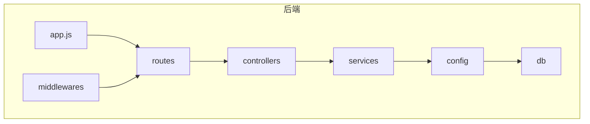
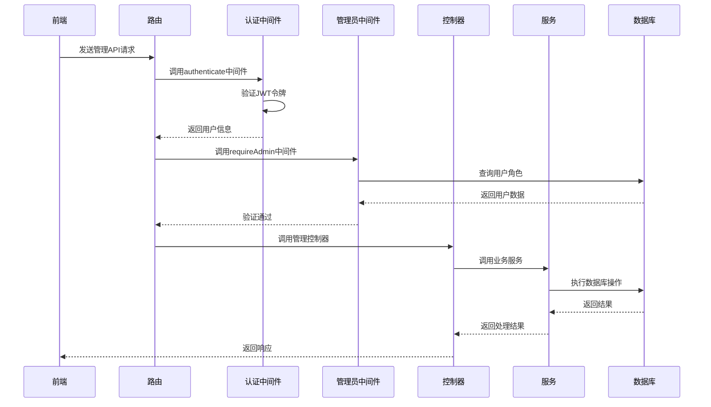
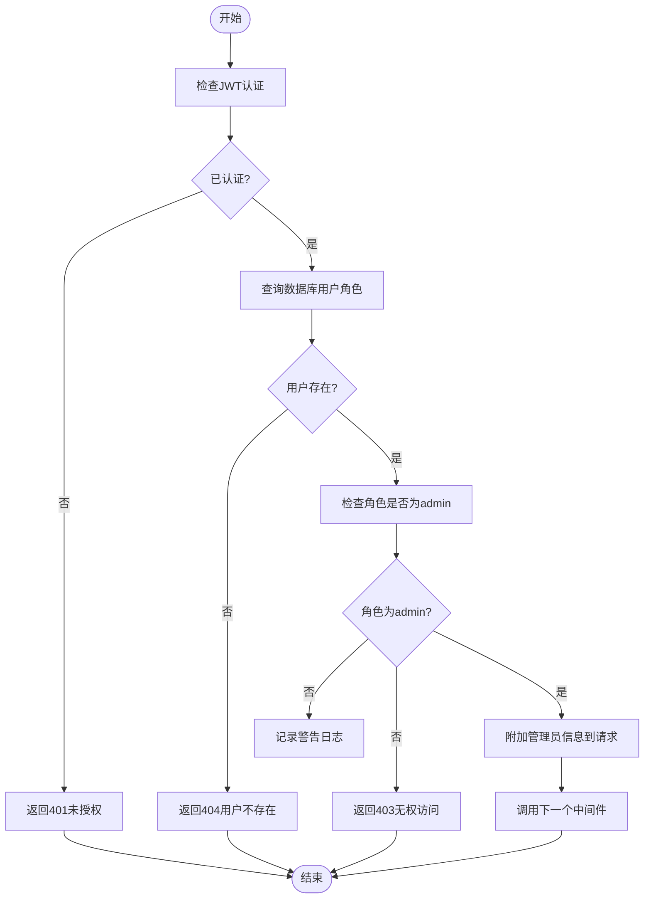
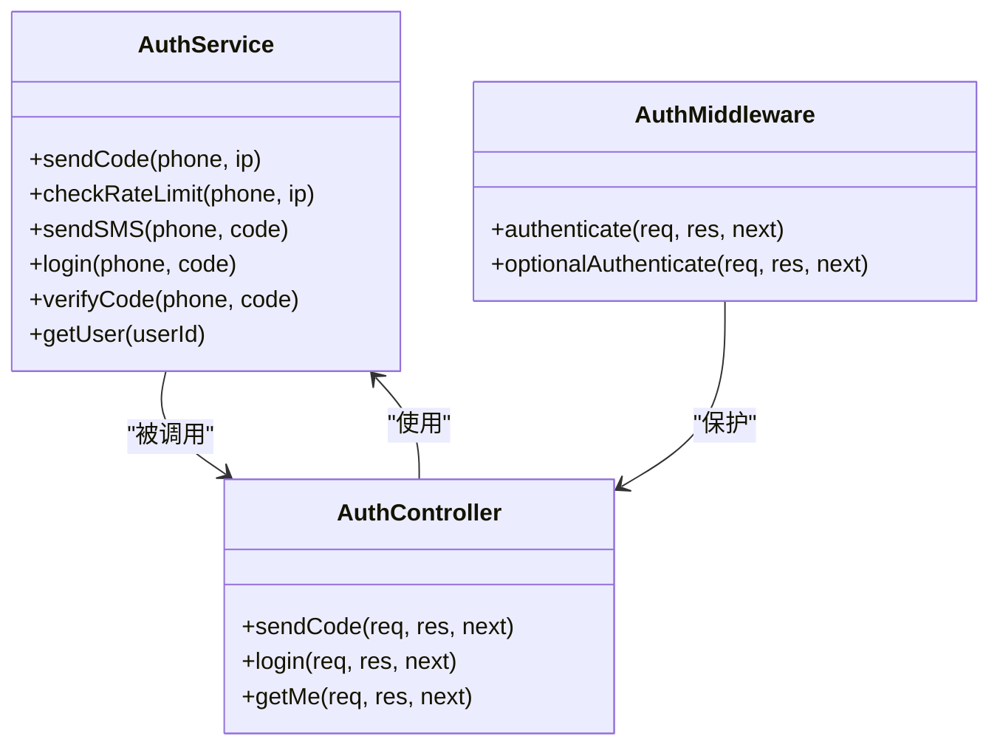
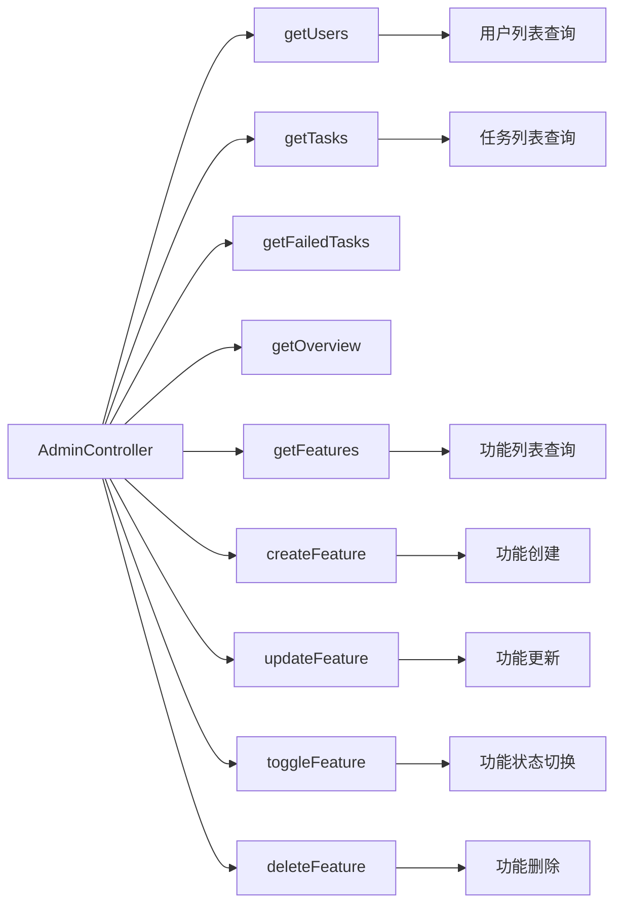
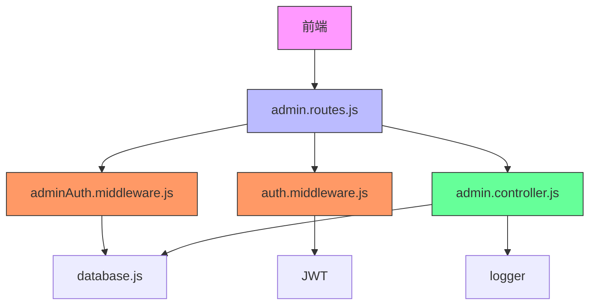
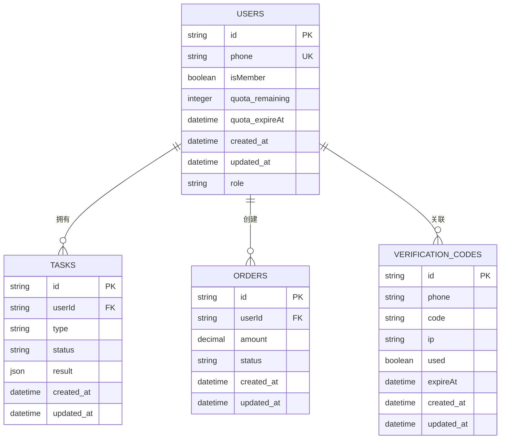

# 中间件管理员认证

<cite>
**本文档中引用的文件**   
- [adminAuth.middleware.js](file://backend/src/middlewares/adminAuth.middleware.js)
- [auth.middleware.js](file://backend/src/middlewares/auth.middleware.js)
- [admin.controller.js](file://backend/src/controllers/admin.controller.js)
- [admin.routes.js](file://backend/src/routes/admin.routes.js)
- [auth.controller.js](file://backend/src/controllers/auth.controller.js)
- [auth.service.js](file://backend/src/services/auth.service.js)
- [database.js](file://backend/src/config/database.js)
- [20251028000001_create_users_table.js](file://backend/src/db/migrations/20251028000001_create_users_table.js)
- [app.js](file://backend/src/app.js)
- [knexfile.js](file://backend/knexfile.js)
- [errorHandler.middleware.js](file://backend/src/middlewares/errorHandler.middleware.js)
</cite>

## 目录
1. [简介](#简介)
2. [项目结构](#项目结构)
3. [核心组件](#核心组件)
4. [架构概述](#架构概述)
5. [详细组件分析](#详细组件分析)
6. [依赖分析](#依赖分析)
7. [性能考虑](#性能考虑)
8. [故障排除指南](#故障排除指南)
9. [结论](#结论)

## 简介
本文档详细介绍了中间件管理员认证系统的实现机制。该系统用于保护管理后台API，确保只有具有管理员角色的用户才能访问敏感的管理功能。认证流程结合了JWT令牌验证和数据库角色检查，提供了安全可靠的权限控制机制。

## 项目结构
后端项目采用分层架构设计，主要包含控制器、服务、中间件、路由和数据库配置等模块。认证相关代码主要分布在`middlewares`、`controllers`和`services`目录中。

**Diagram sources**
- [app.js](file://backend/src/app.js#L1-L125)
- [admin.routes.js](file://backend/src/routes/admin.routes.js#L1-L47)

**Section sources**
- [app.js](file://backend/src/app.js#L1-L125)
- [admin.routes.js](file://backend/src/routes/admin.routes.js#L1-L47)

## 核心组件
系统的核心认证组件包括JWT认证中间件、管理员权限验证中间件、认证服务和管理控制器。这些组件协同工作，实现了完整的用户认证和权限控制流程。

**Section sources**
- [adminAuth.middleware.js](file://backend/src/middlewares/adminAuth.middleware.js#L1-L66)
- [auth.middleware.js](file://backend/src/middlewares/auth.middleware.js#L1-L76)
- [auth.service.js](file://backend/src/services/auth.service.js#L1-L221)

## 架构概述
系统采用分层架构，从前端请求到后端处理的完整流程包括：路由分发、JWT认证、管理员权限验证、业务逻辑处理和数据库交互。这种分层设计确保了代码的可维护性和安全性。

**Diagram sources**
- [admin.routes.js](file://backend/src/routes/admin.routes.js#L1-L47)
- [adminAuth.middleware.js](file://backend/src/middlewares/adminAuth.middleware.js#L1-L66)
- [admin.controller.js](file://backend/src/controllers/admin.controller.js#L1-L544)

## 详细组件分析

### 管理员认证中间件分析
管理员认证中间件是系统权限控制的核心，负责验证用户是否具有管理员角色。

**Diagram sources**
- [adminAuth.middleware.js](file://backend/src/middlewares/adminAuth.middleware.js#L1-L66)

**Section sources**
- [adminAuth.middleware.js](file://backend/src/middlewares/adminAuth.middleware.js#L1-L66)

### 认证服务分析
认证服务负责处理用户登录、注册和验证码发送等核心认证功能。

**Diagram sources**
- [auth.service.js](file://backend/src/services/auth.service.js#L1-L221)
- [auth.controller.js](file://backend/src/controllers/auth.controller.js#L1-L99)
- [auth.middleware.js](file://backend/src/middlewares/auth.middleware.js#L1-L76)

**Section sources**
- [auth.service.js](file://backend/src/services/auth.service.js#L1-L221)
- [auth.controller.js](file://backend/src/controllers/auth.controller.js#L1-L99)

### 管理控制器分析
管理控制器处理所有管理后台的API请求，提供用户管理、任务管理和功能管理等功能。

**Diagram sources**
- [admin.controller.js](file://backend/src/controllers/admin.controller.js#L1-L544)

**Section sources**
- [admin.controller.js](file://backend/src/controllers/admin.controller.js#L1-L544)

## 依赖分析
系统各组件之间存在明确的依赖关系，形成了清晰的调用链。

**Diagram sources**
- [admin.routes.js](file://backend/src/routes/admin.routes.js#L1-L47)
- [adminAuth.middleware.js](file://backend/src/middlewares/adminAuth.middleware.js#L1-L66)
- [auth.middleware.js](file://backend/src/middlewares/auth.middleware.js#L1-L76)
- [admin.controller.js](file://backend/src/controllers/admin.controller.js#L1-L544)
- [database.js](file://backend/src/config/database.js#L1-L9)

**Section sources**
- [admin.routes.js](file://backend/src/routes/admin.routes.js#L1-L47)
- [adminAuth.middleware.js](file://backend/src/middlewares/adminAuth.middleware.js#L1-L66)

## 性能考虑
系统在设计时考虑了性能优化，包括数据库连接池配置、索引优化和缓存策略。

**Diagram sources**
- [20251028000001_create_users_table.js](file://backend/src/db/migrations/20251028000001_create_users_table.js#L1-L23)
- [knexfile.js](file://backend/knexfile.js#L1-L46)

## 故障排除指南
当遇到认证相关问题时，可以参考以下常见问题的解决方案。

**Section sources**
- [errorHandler.middleware.js](file://backend/src/middlewares/errorHandler.middleware.js#L1-L45)
- [adminAuth.middleware.js](file://backend/src/middlewares/adminAuth.middleware.js#L1-L66)

## 结论
中间件管理员认证系统通过JWT令牌验证和数据库角色检查的双重机制，实现了安全可靠的权限控制。系统设计合理，代码结构清晰，具有良好的可维护性和扩展性。建议在生产环境中定期审查管理员账户，确保系统安全。