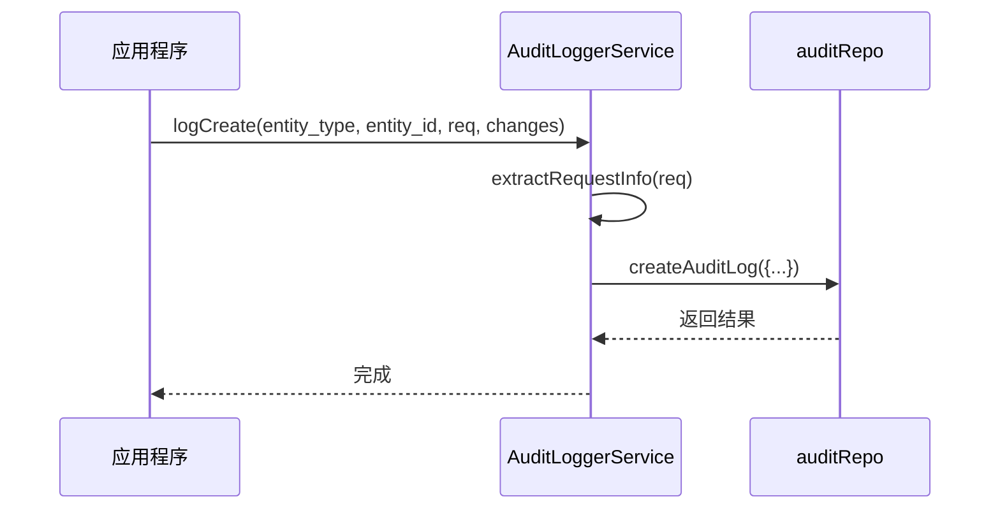
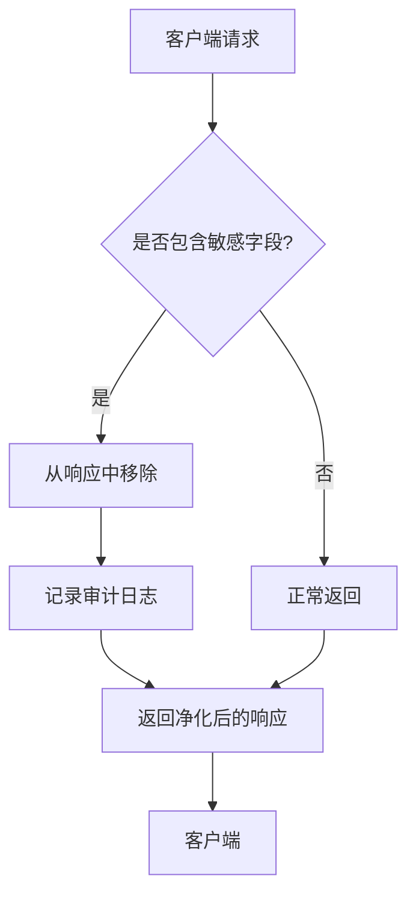
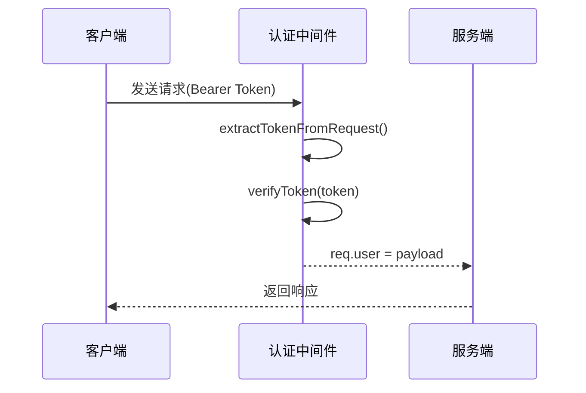
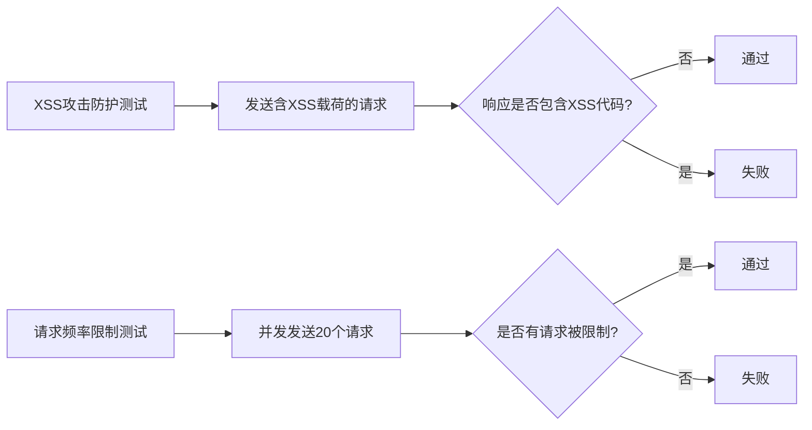

# 内部字段泄露防护

<cite>
**本文档引用文件**  
- [crypto.ts](file://backend/src/utils/crypto.ts)
- [logger.js](file://backend/src/utils/logger.js)
- [auth.middleware.ts](file://backend/src/middleware/auth.middleware.ts)
- [errorHandler.middleware.js](file://backend/src/middlewares/errorHandler.middleware.js)
- [auditLogger.service.ts](file://backend/src/services/auditLogger.service.ts)
- [auditLogs.controller.ts](file://backend/src/controllers/auditLogs.controller.ts)
- [security.test.js](file://backend/tests/integration/security.test.js)
- [新建 文本文档 (11).txt](file://新建文件夹/新建 文本文档 (11).txt)
- [新建 文本文档 (10).txt](file://新建文件夹/新建 文本文档 (10).txt)
</cite>

## 目录
1. [引言](#引言)
2. [敏感数据加密与脱敏](#敏感数据加密与脱敏)
3. [日志安全与审计](#日志安全与审计)
4. [API响应安全防护](#api响应安全防护)
5. [认证与权限控制](#认证与权限控制)
6. [安全测试与验证](#安全测试与验证)
7. [实施建议与最佳实践](#实施建议与最佳实践)
8. [结论](#结论)

## 引言
本文件旨在全面阐述系统中针对内部字段泄露风险的防护机制。通过分析代码库中的安全实践，本文档详细说明了从数据加密、日志脱敏到API响应过滤的多层次防护体系，确保敏感信息在存储、传输和展示各环节的安全性。

## 敏感数据加密与脱敏

系统采用AES-256-GCM算法对敏感字段进行列级加密，确保即使数据外泄也能降低敏感性暴露风险。加密过程由`crypto.ts`文件中的`encryptFields`函数实现，支持密钥版本管理与轮换，保障长期安全性。

```mermaid
classDiagram
class KeyManager {
-keys : Map~number, KeyVersion~
-currentVersion : number
+addKey(version : number, key : Buffer) : void
+getCurrentKey() : {version : number, key : Buffer}
+getKey(version : number) : Buffer
+getVersions() : number[]
}
class CryptoUtils {
+encrypt(plaintext : string | object, keyVersion? : number) : EncryptedData
+decrypt(encryptedData : EncryptedData) : string
+encryptFields(obj : Record~string, any~, sensitiveFields : string[]) : Record~string, any~
+decryptFields(obj : Record~string, any~, sensitiveFields : string[]) : Record~string, any~
}
KeyManager --> CryptoUtils : "被使用"
```

**图表来源**  
- [crypto.ts](file://backend/src/utils/crypto.ts#L0-L354)

**本节来源**  
- [crypto.ts](file://backend/src/utils/crypto.ts#L0-L354)
- [新建 文本文档 (11).txt](file://新建文件夹/新建 文本文档 (11).txt#L478-L510)

## 日志安全与审计

为防止日志中泄露PII（个人身份信息）和凭证，系统实施了统一的日志脱敏策略。所有应用日志、访问日志和安全事件日志均经过脱敏处理，并记录关键安全事件留痕。

审计日志服务通过`auditLogger.service.ts`实现，记录创建、更新等操作的详细信息，包括实体类型、操作者、IP地址和用户代理。这些日志用于排障与审计，同时避免泄露二次风险。



**图表来源**  
- [auditLogger.service.ts](file://backend/src/services/auditLogger.service.ts#L0-L62)
- [auditLogs.controller.ts](file://backend/src/controllers/auditLogs.controller.ts#L102-L126)

**本节来源**  
- [auditLogger.service.ts](file://backend/src/services/auditLogger.service.ts#L0-L62)
- [auditLogs.controller.ts](file://backend/src/controllers/auditLogs.controller.ts#L102-L126)
- [新建 文本文档 (11).txt](file://新建文件夹/新建 文本文档 (11).txt#L534-L567)

## API响应安全防护

API响应经过严格的安全过滤，确保不暴露内部数据库字段名、API密钥或内部配置。系统通过集成测试验证了这一机制的有效性，防止敏感字段如`password`、`internal_`前缀字段和`_temp`临时字段被意外返回。



**图表来源**  
- [security.test.js](file://backend/tests/integration/security.test.js#L295-L334)

**本节来源**  
- [security.test.js](file://backend/tests/integration/security.test.js#L295-L334)
- [新建 文本文档 (10).txt](file://新建文件夹/新建 文本文档 (10).txt#L930-L965)

## 认证与权限控制

系统采用JWT进行认证，支持可选认证中间件，允许某些接口既可登录也可不登录访问。认证中间件负责验证Token的有效性，并将用户信息附加到请求对象中。



**图表来源**  
- [auth.middleware.ts](file://backend/src/middleware/auth.middleware.ts#L99-L125)

**本节来源**  
- [auth.middleware.ts](file://backend/src/middleware/auth.middleware.ts#L99-L125)
- [README_AUTH_API.md](file://backend/README_AUTH_API.md#L159-L244)

## 安全测试与验证

系统包含全面的安全测试套件，覆盖XSS攻击防护、请求频率限制和文件上传安全等多个方面。集成测试确保系统不会暴露堆栈跟踪等内部信息，并对输入中的XSS代码进行过滤。



**图表来源**  
- [security.test.js](file://backend/tests/integration/security.test.js#L136-L179)

**本节来源**  
- [security.test.js](file://backend/tests/integration/security.test.js#L136-L179)
- [新建 文本文档 (11).txt](file://新建文件夹/新建 文本文档 (11).txt#L19-L39)

## 实施建议与最佳实践

基于现有安全机制，提出以下实施建议：

1. **持续密钥轮换**：定期生成新密钥并重新加密数据，确保长期安全性。
2. **加强输入校验**：对所有用户输入进行白名单校验，拒绝或矫正异常输入。
3. **CORS最小授权**：仅放行受控来源，限制方法与头，拒绝通配符`*`搭配凭证。
4. **SQL安全**：一律使用Knex参数化查询，防止SQL注入。
5. **审计日志**：记录关键操作与操作者、来源IP、UA，确保可追溯性。

## 结论

本系统通过多层次的安全防护机制有效防止了内部字段泄露风险。从数据加密、日志脱敏到API响应过滤，每个环节都经过精心设计和严格测试。未来应持续优化这些机制，应对不断变化的安全威胁。