# 安全机制

<cite>
**本文档引用的文件**
- [auth.middleware.js](file://backend/src/middlewares/auth.middleware.js)
- [auth.service.js](file://backend/src/services/auth.service.js)
- [quota.service.js](file://backend/src/services/quota.service.js)
- [auth.controller.js](file://backend/src/controllers/auth.controller.js)
- [membership.service.js](file://backend/src/services/membership.service.js)
- [contentAudit.service.js](file://backend/src/services/contentAudit.service.js)
- [errorHandler.middleware.js](file://backend/src/middlewares/errorHandler.middleware.js)
- [app.js](file://backend/src/app.js)
- [knexfile.js](file://backend/knexfile.js)
- [database.js](file://backend/src/config/database.js)
- [generator.js](file://backend/src/utils/generator.js)
</cite>

## 目录
1. [概述](#概述)
2. [JWT令牌安全机制](#jwt令牌安全机制)
3. [防刷限流策略](#防刷限流策略)
4. [数据库事务与行锁](#数据库事务与行锁)
5. [验证码时效性控制](#验证码时效性控制)
6. [支付回调安全验证](#支付回调安全验证)
7. [中间件拦截机制](#中间件拦截机制)
8. [内容审核安全](#内容审核安全)
9. [安全审计与监控](#安全审计与监控)
10. [潜在风险点与建议](#潜在风险点与建议)

## 概述

本系统采用多层次的安全防护机制，确保用户数据安全、业务逻辑正确性和系统稳定性。安全机制涵盖身份认证、访问控制、数据保护、业务安全等多个维度，形成了完整的安全防护体系。

## JWT令牌安全机制

### 令牌生成与验证

系统采用JWT（JSON Web Token）作为主要的身份认证机制，确保用户身份的可信性和会话的持久性。

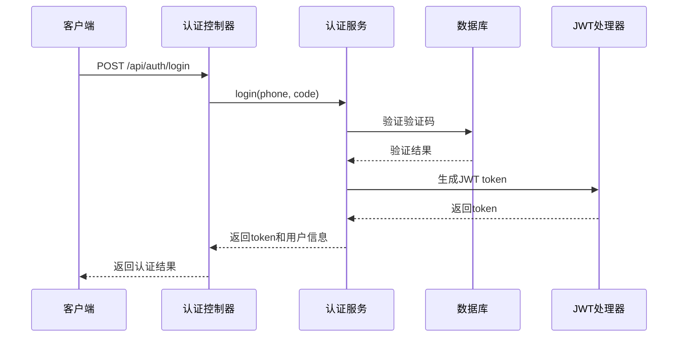

**图表来源**
- [auth.controller.js](file://backend/src/controllers/auth.controller.js#L35-L99)
- [auth.service.js](file://backend/src/services/auth.service.js#L105-L140)

### 令牌验证流程

JWT令牌验证采用严格的验证机制，包括签名校验、过期时间检查和格式验证：

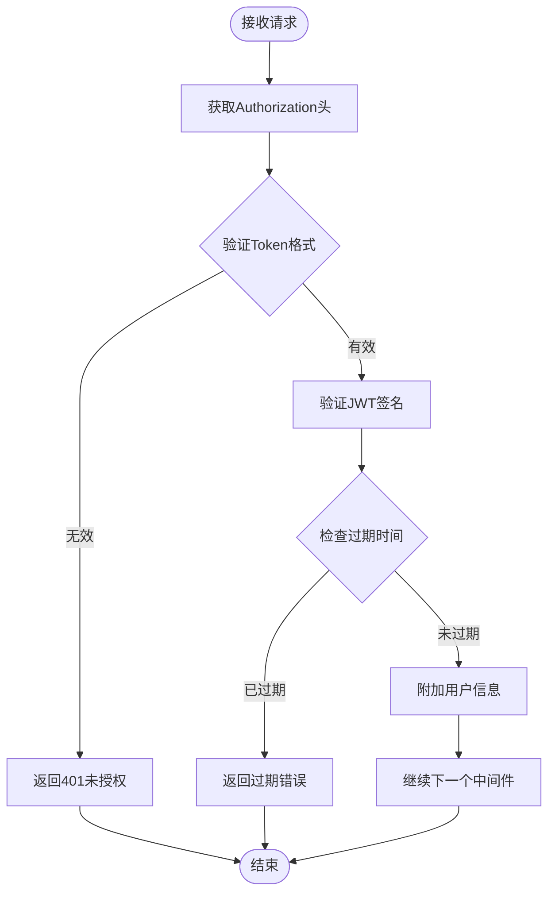

**图表来源**
- [auth.middleware.js](file://backend/src/middlewares/auth.middleware.js#L6-L42)

### 可选认证机制

系统提供可选认证中间件，允许某些接口既可以登录访问也可以匿名访问：

**章节来源**
- [auth.middleware.js](file://backend/src/middlewares/auth.middleware.js#L45-L76)

## 防刷限流策略

### 多维度限流机制

系统实施双重限流策略，基于手机号和IP地址进行双重保护，防止恶意刷取行为。

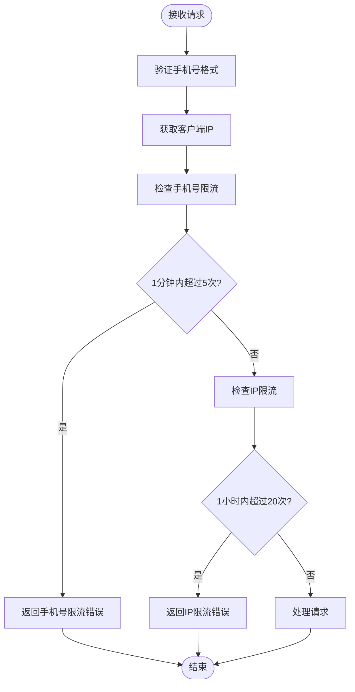

**图表来源**
- [auth.service.js](file://backend/src/services/auth.service.js#L54-L85)

### 限流规则详解

| 限制类型 | 时间范围 | 最大次数 | 触发条件 |
|---------|---------|---------|---------|
| 手机号限流 | 1分钟 | 5次 | 同一手机号在1分钟内发送验证码超过5次 |
| IP地址限流 | 1小时 | 20次 | 同一IP地址在1小时内发送验证码超过20次 |

**章节来源**
- [auth.service.js](file://backend/src/services/auth.service.js#L54-L85)

## 数据库事务与行锁

### 配额扣减的原子性保证

系统采用数据库事务和行锁机制，确保配额扣减操作的原子性和一致性，防止并发竞争导致的数据不一致问题。

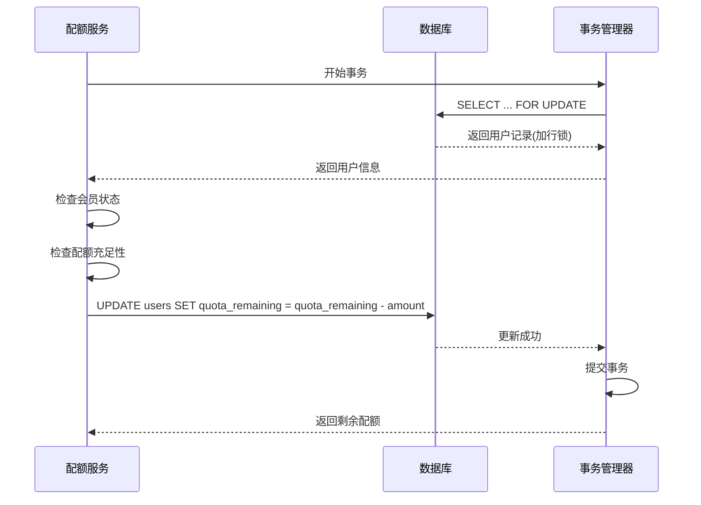

**图表来源**
- [quota.service.js](file://backend/src/services/quota.service.js#L12-L55)

### 事务隔离级别与行锁

系统在配额扣减操作中使用了以下安全措施：

| 安全措施 | 实现方式 | 目的 |
|---------|---------|------|
| 事务隔离 | `db.transaction()` | 确保操作的原子性 |
| 行锁 | `.forUpdate()` | 防止并发修改同一用户记录 |
| 原子操作 | `.decrement()` | 确保配额扣减的原子性 |
| 异常回滚 | 自动事务回滚 | 保证数据一致性 |

**章节来源**
- [quota.service.js](file://backend/src/services/quota.service.js#L12-L55)

### 配额返还机制

系统提供完整的配额返还机制，确保任务失败时能够正确返还配额：

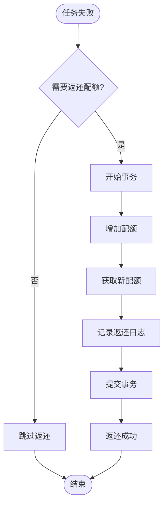

**图表来源**
- [quota.service.js](file://backend/src/services/quota.service.js#L57-L75)

**章节来源**
- [quota.service.js](file://backend/src/services/quota.service.js#L57-L75)

## 验证码时效性控制

### 验证码生命周期管理

系统对验证码实施严格的时效性控制，确保验证码的安全性和有效性。

```mermaid
gantt
title 验证码生命周期
dateFormat X
axisFormat %s
section 创建
生成验证码 :milestone, m1, 0, 0
存储到数据库 :active, m2, 0, 1
section 有效期
有效期5分钟 :active, m3, 1, 300
section 过期处理
标记过期 :milestone, m4, 300, 300
清理过期数据 :milestone, m5, 300, 300
```

### 验证码安全特性

| 特性 | 实现方式 | 安全价值 |
|------|---------|---------|
| 时效控制 | 5分钟有效期 | 防止验证码长时间有效被滥用 |
| 单次使用 | 使用后标记为已使用 | 防止验证码重复使用 |
| 过期清理 | 自动清理过期记录 | 避免数据库膨胀 |
| 随机生成 | 6位数字随机码 | 增加破解难度 |

**章节来源**
- [auth.service.js](file://backend/src/services/auth.service.js#L20-L35)

## 支付回调安全验证

### 支付回调处理流程

系统对支付回调实施多重安全验证，确保支付数据的真实性和完整性。

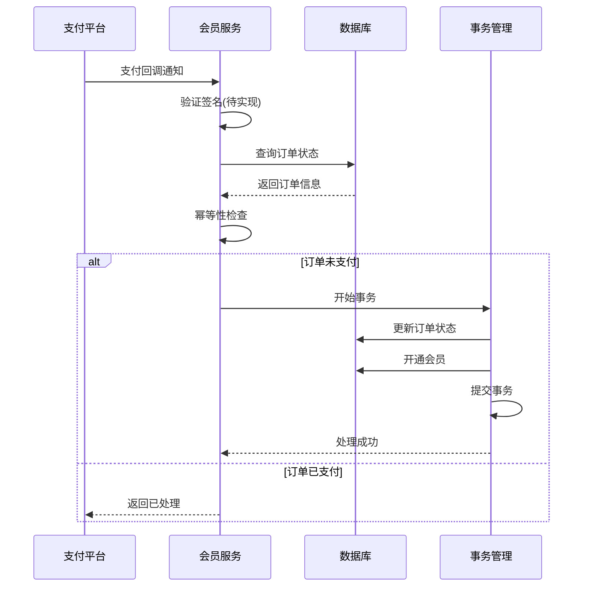

**图表来源**
- [membership.service.js](file://backend/src/services/membership.service.js#L86-L133)

### 支付安全验证要点

| 验证项目 | 实现状态 | 安全价值 |
|---------|---------|---------|
| 签名验证 | TODO | 防止数据被篡改 |
| 订单验证 | 已实现 | 确认订单真实性 |
| 幂等性检查 | 已实现 | 防止重复处理 |
| 事务保证 | 已实现 | 确保数据一致性 |

**章节来源**
- [membership.service.js](file://backend/src/services/membership.service.js#L86-L133)

## 中间件拦截机制

### 认证中间件架构

系统采用中间件模式实现统一的访问控制，确保只有经过认证的请求才能访问受保护的资源。

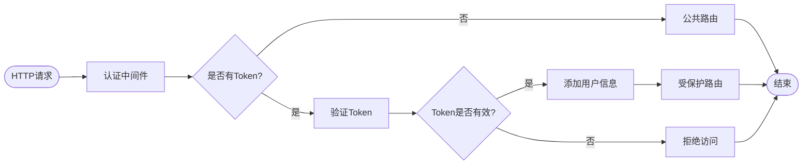

**图表来源**
- [auth.middleware.js](file://backend/src/middlewares/auth.middleware.js#L6-L42)

### 错误处理机制

系统实现了完善的错误处理机制，确保安全事件得到妥善处理：

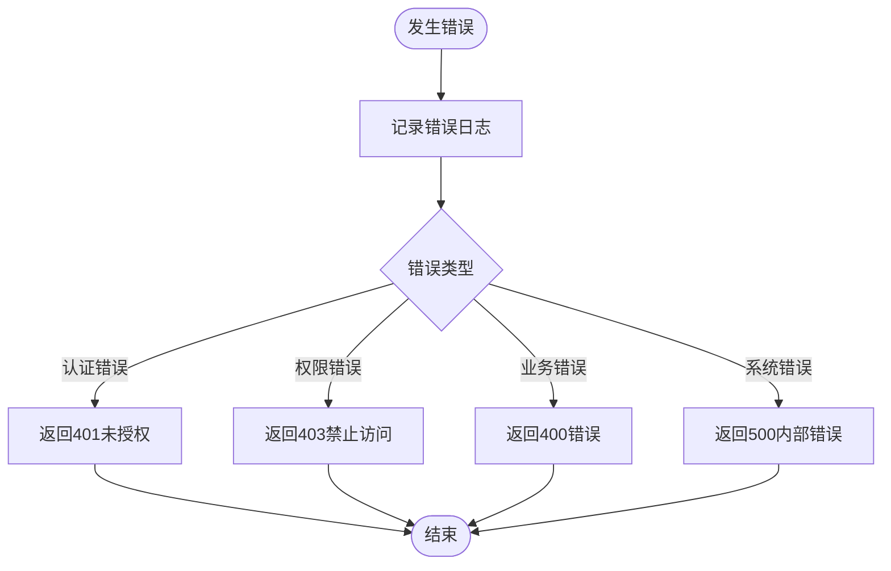

**图表来源**
- [errorHandler.middleware.js](file://backend/src/middlewares/errorHandler.middleware.js#L5-L25)

**章节来源**
- [auth.middleware.js](file://backend/src/middlewares/auth.middleware.js#L6-L76)
- [errorHandler.middleware.js](file://backend/src/middlewares/errorHandler.middleware.js#L5-L45)

## 内容审核安全

### 图片内容审核机制

系统集成腾讯云内容审核服务，对用户上传的图片进行智能审核，确保内容合规性。

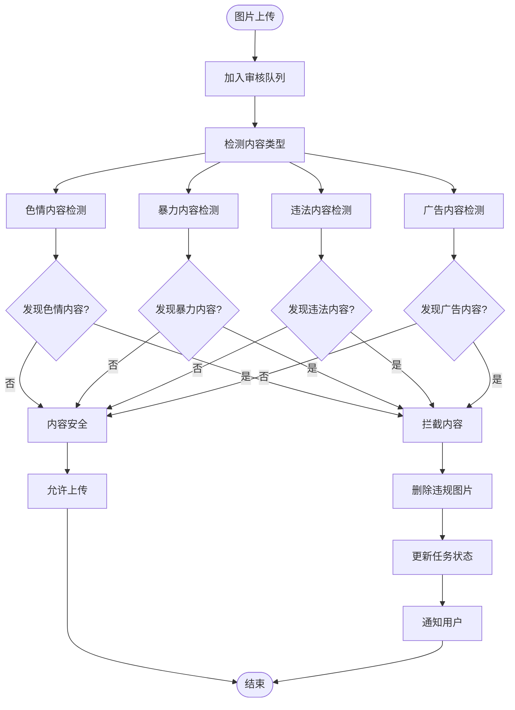

**图表来源**
- [contentAudit.service.js](file://backend/src/services/contentAudit.service.js#L100-L150)

### 审核策略配置

| 审核类型 | 检测内容 | 处理策略 |
|---------|---------|---------|
| 色情内容 | 性暗示、裸露等 | 直接拦截删除 |
| 暴力内容 | 斗殴、血腥等 | 直接拦截删除 |
| 违法内容 | 违反法律法规的内容 | 直接拦截删除 |
| 广告内容 | 商业推广、诱导等 | 直接拦截删除 |

**章节来源**
- [contentAudit.service.js](file://backend/src/services/contentAudit.service.js#L100-L199)

## 安全审计与监控

### 应用层安全防护

系统在应用层面实施了多层安全防护措施：

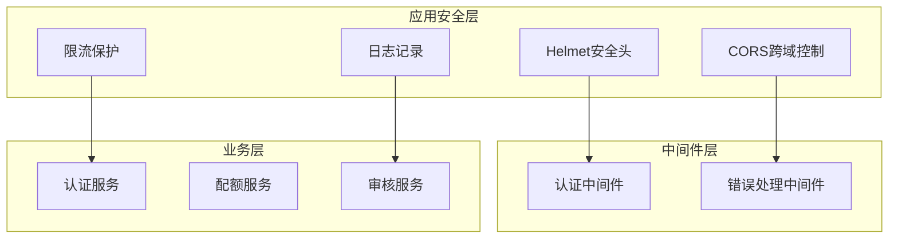

**图表来源**
- [app.js](file://backend/src/app.js#L10-L25)

### 数据库安全配置

系统采用连接池管理和安全配置，确保数据库访问的安全性：

| 配置项 | 开发环境 | 生产环境 | 安全价值 |
|-------|---------|---------|---------|
| 连接池最小值 | 2 | 5 | 防止连接耗尽 |
| 连接池最大值 | 10 | 20 | 控制资源使用 |
| 字符集 | utf8mb4 | utf8mb4 | 支持完整字符集 |
| 密码保护 | 环境变量 | 环境变量 | 防止密码泄露 |

**章节来源**
- [knexfile.js](file://backend/knexfile.js#L5-L46)
- [database.js](file://backend/src/config/database.js#L1-L9)

## 潜在风险点与建议

### 配额管理风险

**风险点1：并发竞争导致的配额超用**
- **现状**：已使用行锁和事务保证原子性
- **建议**：增加Redis分布式锁作为第二层保护

**风险点2：异常情况下的配额丢失**
- **现状**：提供完整的返还机制
- **建议**：增加配额审计日志，定期对账

### 支付安全风险

**风险点1：支付回调被伪造**
- **现状**：签名验证待实现
- **建议**：立即实现支付平台签名验证

**风险点2：重复支付处理**
- **现状**：已有幂等性检查
- **建议**：增加支付流水号去重机制

### 内容审核风险

**风险点1：审核服务异常**
- **现状**：审核失败时默认通过
- **建议**：增加审核失败的降级策略

**风险点2：审核绕过**
- **现状**：仅对任务结果进行审核
- **建议**：增加上传前的预审核机制

### 监控与告警

**建议建立的监控指标**：
- 验证码发送成功率
- JWT令牌验证失败率
- 配额扣减异常次数
- 支付回调处理延迟
- 内容审核通过率

**章节来源**
- [quota.service.js](file://backend/src/services/quota.service.js#L12-L55)
- [membership.service.js](file://backend/src/services/membership.service.js#L86-L133)
- [contentAudit.service.js](file://backend/src/services/contentAudit.service.js#L100-L199)

## 总结

本系统构建了完整的安全防护体系，涵盖了身份认证、访问控制、数据保护、业务安全等多个维度。通过JWT令牌机制确保身份可信，通过防刷限流防止恶意攻击，通过数据库事务和行锁保证数据一致性，通过内容审核确保内容合规。同时建立了完善的错误处理和审计机制，为系统的安全稳定运行提供了坚实保障。