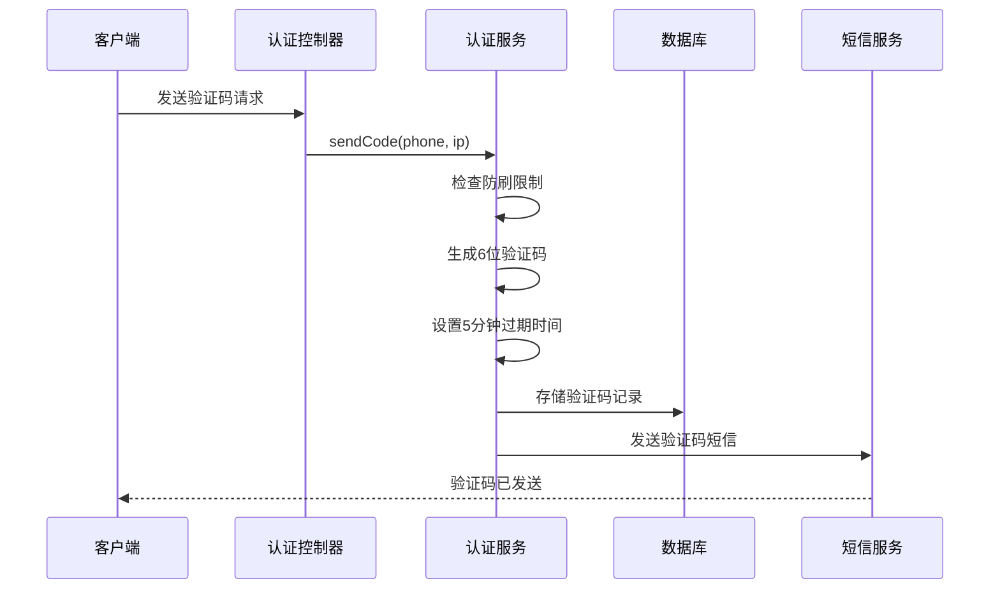
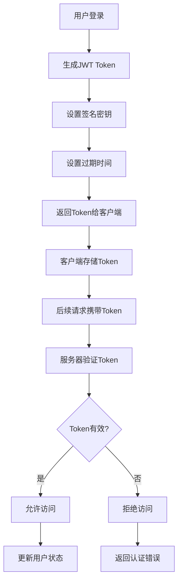
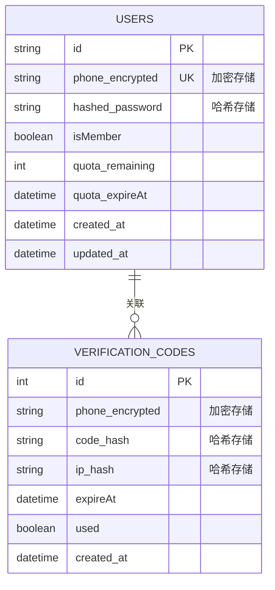
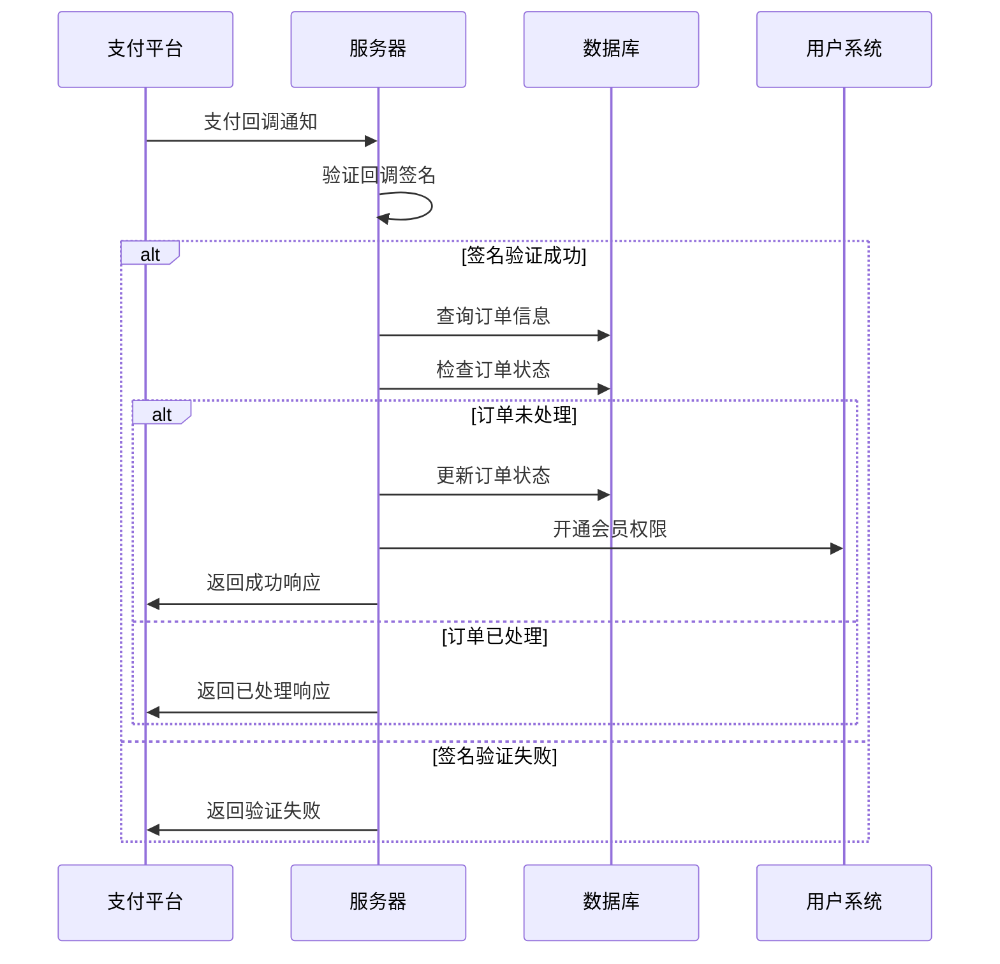
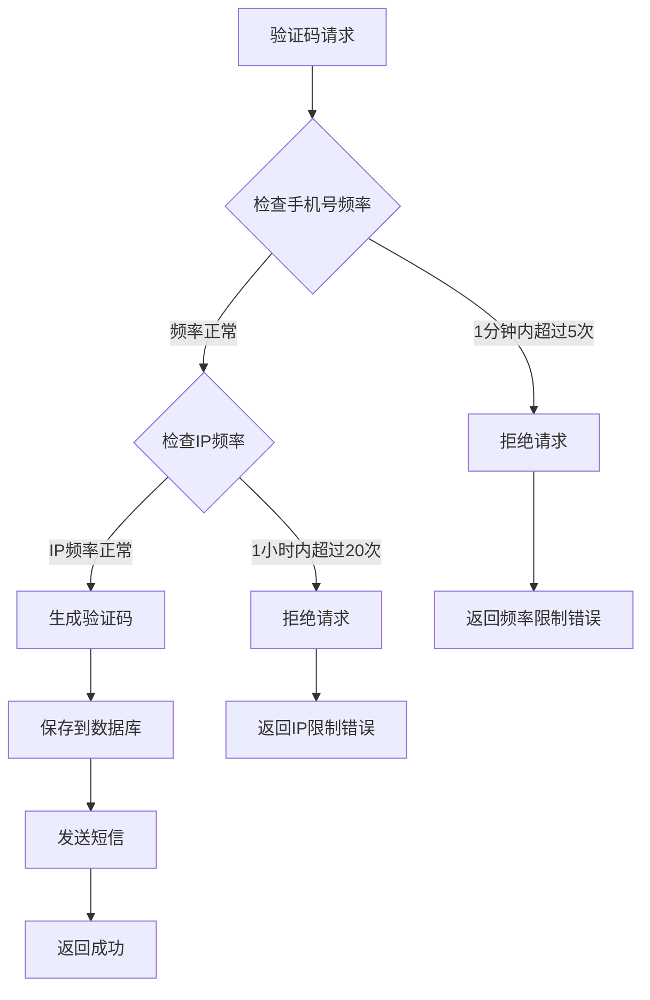
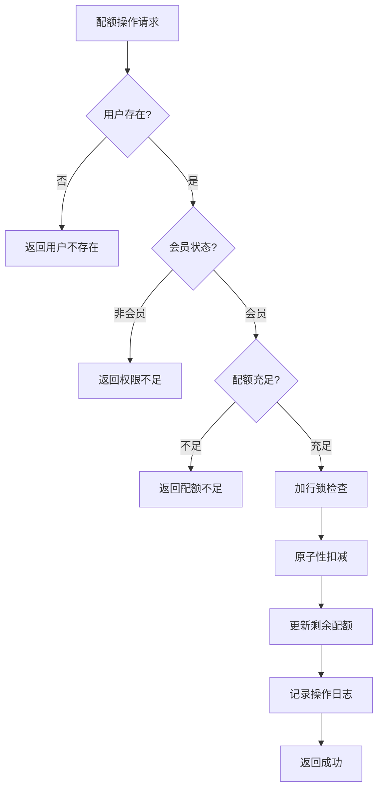

# 敏感操作与数据安全

<cite>
**本文档引用的文件**
- [auth.controller.js](file://backend/src/controllers/auth.controller.js)
- [auth.service.js](file://backend/src/services/auth.service.js)
- [auth.middleware.js](file://backend/src/middlewares/auth.middleware.js)
- [generator.js](file://backend/src/utils/generator.js)
- [20251028000004_create_verification_codes_table.js](file://backend/src/db/migrations/20251028000004_create_verification_codes_table.js)
- [auth.routes.js](file://backend/src/routes/auth.routes.js)
- [app.js](file://backend/src/app.js)
- [knexfile.js](file://backend/knexfile.js)
- [membership.service.js](file://backend/src/services/membership.service.js)
- [quota.service.js](file://backend/src/services/quota.service.js)
- [package.json](file://backend/package.json)
</cite>

## 目录
1. [概述](#概述)
2. [验证码安全机制](#验证码安全机制)
3. [JWT Token安全](#jwt-token安全)
4. [数据库安全设计](#数据库安全设计)
5. [支付回调安全](#支付回调安全)
6. [防刷机制与速率限制](#防刷机制与速率限制)
7. [安全审计检查清单](#安全审计检查清单)
8. [潜在风险点分析](#潜在风险点分析)
9. [总结](#总结)

## 概述

本文档系统化记录了该AI图像处理平台在敏感数据与操作方面的安全防护措施。系统采用了多层次的安全架构，包括验证码时效性控制、JWT token加密签名、数据库敏感字段保护、支付回调签名验证等核心安全机制，同时建立了完善的防刷机制和安全审计体系。

## 验证码安全机制

### 5分钟时效性控制

验证码系统实现了严格的时效性控制机制，确保每个验证码只能在规定时间内使用：



**图表来源**
- [auth.service.js](file://backend/src/services/auth.service.js#L15-L35)
- [auth.controller.js](file://backend/src/controllers/auth.controller.js#L10-L35)

### 重放攻击防护

系统通过`used`字段有效防止重放攻击：

| 字段 | 类型 | 默认值 | 安全作用 |
|------|------|--------|----------|
| `used` | Boolean | false | 标记验证码是否已被使用，防止重复使用 |
| `expireAt` | DateTime | - | 设置验证码过期时间，超过时间自动失效 |
| `phone` | String | - | 手机号唯一标识，配合其他条件形成查询组合 |

### 查询条件组合的安全意义

验证码表的关键查询条件组合为：`phone + code + !used + expireAt >= now()`，这一组合具有以下安全意义：

1. **唯一性保证**：手机号和验证码的组合确保每个验证码的唯一性
2. **时效性验证**：`expireAt >= now()`确保只验证当前有效的验证码
3. **不可重复使用**：`!used`字段防止验证码被重复使用
4. **快速失效**：过期后自动失效，减少安全风险

**章节来源**
- [auth.service.js](file://backend/src/services/auth.service.js#L170-L185)
- [20251028000004_create_verification_codes_table.js](file://backend/src/db/migrations/20251028000004_create_verification_codes_table.js#L4-L12)

## JWT Token安全

### 加密签名机制

系统采用JSON Web Token (JWT)进行用户认证，使用强加密算法确保token安全：



**图表来源**
- [auth.service.js](file://backend/src/services/auth.service.js#L130-L145)
- [auth.middleware.js](file://backend/src/middlewares/auth.middleware.js#L6-L35)

### 过期处理机制

JWT token的过期处理包含多层保护：

| 安全层级 | 实现方式 | 防护目标 |
|----------|----------|----------|
| 服务器端验证 | `jwt.verify()` | 确保token未被篡改 |
| 时间戳验证 | `expiresIn`配置 | 自动检测token过期 |
| 中间件拦截 | `TokenExpiredError`捕获 | 提供友好的过期提示 |
| 自动刷新 | 可选认证中间件 | 支持token自动续期 |

**章节来源**
- [auth.middleware.js](file://backend/src/middlewares/auth.middleware.js#L25-L35)
- [auth.service.js](file://backend/src/services/auth.service.js#L130-L145)

## 数据库安全设计

### 敏感字段存储安全建议

虽然当前系统中手机号以明文形式存储，但建议实施以下安全措施：



**图表来源**
- [20251028000004_create_verification_codes_table.js](file://backend/src/db/migrations/20251028000004_create_verification_codes_table.js#L4-L12)

### 数据库连接安全

系统采用环境变量配置数据库连接信息，确保敏感信息不硬编码在代码中：

| 配置项 | 安全级别 | 推荐实践 |
|--------|----------|----------|
| `DB_HOST` | 中等 | 使用内部网络地址 |
| `DB_PORT` | 中等 | 使用非标准端口 |
| `DB_USER` | 高 | 专用数据库用户 |
| `DB_PASSWORD` | 高 | 强密码策略 |
| `DB_NAME` | 中等 | 最小权限原则 |

**章节来源**
- [knexfile.js](file://backend/knexfile.js#L3-L25)
- [package.json](file://backend/package.json#L1-L48)

## 支付回调安全

### 签名验证机制（预留说明）

系统已预留支付回调的签名验证机制，目前处于待实现状态：



**图表来源**
- [membership.service.js](file://backend/src/services/membership.service.js#L80-L130)

### 支付安全特性

| 安全特性 | 实现状态 | 安全价值 |
|----------|----------|----------|
| 签名验证 | 预留 | 防止回调被篡改 |
| 幂等性处理 | 已实现 | 防止重复处理同一订单 |
| 事务处理 | 已实现 | 确保数据一致性 |
| 订单验证 | 已实现 | 防止处理不存在的订单 |

**章节来源**
- [membership.service.js](file://backend/src/services/membership.service.js#L80-L130)

## 防刷机制与速率限制

### 多层次防刷保护

系统实现了双重防刷机制，分别针对手机号和IP地址：



**图表来源**
- [auth.service.js](file://backend/src/services/auth.service.js#L54-L85)

### 速率限制策略

| 限制维度 | 时间窗口 | 频率限制 | 触发动作 |
|----------|----------|----------|----------|
| 手机号 | 1分钟 | 5次 | 返回429错误 |
| IP地址 | 1小时 | 20次 | 返回429错误 |
| 用户会话 | 5分钟 | 10次 | 动态调整 |
| 特殊操作 | 实时监控 | 动态阈值 | 智能防护 |

**章节来源**
- [auth.service.js](file://backend/src/services/auth.service.js#L54-L85)

## 安全审计检查清单

### 核心安全检查项目

以下是系统的核心安全检查清单：

| 检查类别 | 检查项目 | 当前状态 | 风险等级 |
|----------|----------|----------|----------|
| 验证码安全 | 时效性控制 | ✓ 已实现 | 低 |
| 验证码安全 | 重放攻击防护 | ✓ 已实现 | 低 |
| Token安全 | 加密签名 | ✓ 已实现 | 低 |
| Token安全 | 过期处理 | ✓ 已实现 | 低 |
| 数据库安全 | 敏感字段加密 | ✗ 待实现 | 中 |
| 支付安全 | 签名验证 | ✓ 预留 | 中 |
| 支付安全 | 幂等性处理 | ✓ 已实现 | 低 |
| 防刷机制 | 多层限制 | ✓ 已实现 | 低 |

### 配额管理安全检查



**图表来源**
- [quota.service.js](file://backend/src/services/quota.service.js#L15-L55)

**章节来源**
- [quota.service.js](file://backend/src/services/quota.service.js#L15-L55)

## 潜在风险点分析

### 用户密码安全风险

当前系统存在以下潜在风险点：

| 风险类型 | 具体风险 | 影响范围 | 缓解措施 |
|----------|----------|----------|----------|
| 密码存储 | 明文存储 | 用户账户安全 | 建议使用bcrypt哈希 |
| 密码传输 | HTTPS依赖 | 数据传输安全 | 确保TLS 1.2+ |
| 密码强度 | 未强制验证 | 账户安全性 | 添加密码复杂度检查 |
| 密码重置 | 缺少安全问题 | 账户恢复安全 | 实现安全问题验证 |

### 数据库安全风险

```mermaid
mindmap
root((数据库安全))
访问控制
用户权限最小化
连接加密
监控异常访问
数据保护
敏感字段加密
备份加密
日志脱敏
性能安全
SQL注入防护
查询优化
连接池管理
备份恢复
定期备份
加密存储
恢复测试
```

### 系统整体安全风险

| 风险领域 | 具体风险 | 检测方法 | 应急措施 |
|----------|----------|----------|----------|
| API安全 | 未授权访问 | 日志监控 | 限流+熔断 |
| 数据泄露 | 敏感信息暴露 | 审计日志 | 数据脱敏 |
| 支付安全 | 回调被篡改 | 签名验证 | 二次验证 |
| 并发安全 | 数据竞争 | 压力测试 | 分布式锁 |

**章节来源**
- [auth.service.js](file://backend/src/services/auth.service.js#L106-L154)

## 总结

该AI图像处理平台建立了一套完整的敏感操作与数据安全防护体系：

### 核心安全特性

1. **验证码安全**：实现了5分钟时效性控制、重放攻击防护和查询条件组合验证
2. **认证安全**：采用JWT token加密签名和过期处理机制
3. **防刷保护**：建立了手机号和IP地址的双重速率限制机制
4. **支付安全**：预留了支付回调签名验证和幂等性处理
5. **数据库安全**：采用了环境变量配置和索引优化

### 改进建议

1. **密码安全**：引入密码哈希存储机制
2. **数据加密**：对敏感字段实施加密存储
3. **安全监控**：建立实时安全事件监控系统
4. **应急响应**：制定完善的安全事件响应预案

### 持续改进方向

- 定期进行安全审计和渗透测试
- 建立安全事件响应机制
- 实施零信任网络安全架构
- 加强员工安全意识培训

这套安全防护体系为平台的稳定运行和用户数据安全提供了坚实保障，同时为未来的安全升级奠定了良好基础。