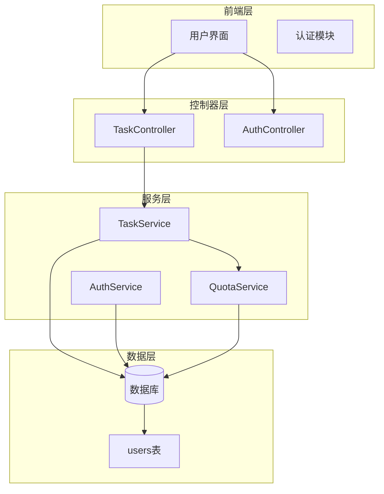
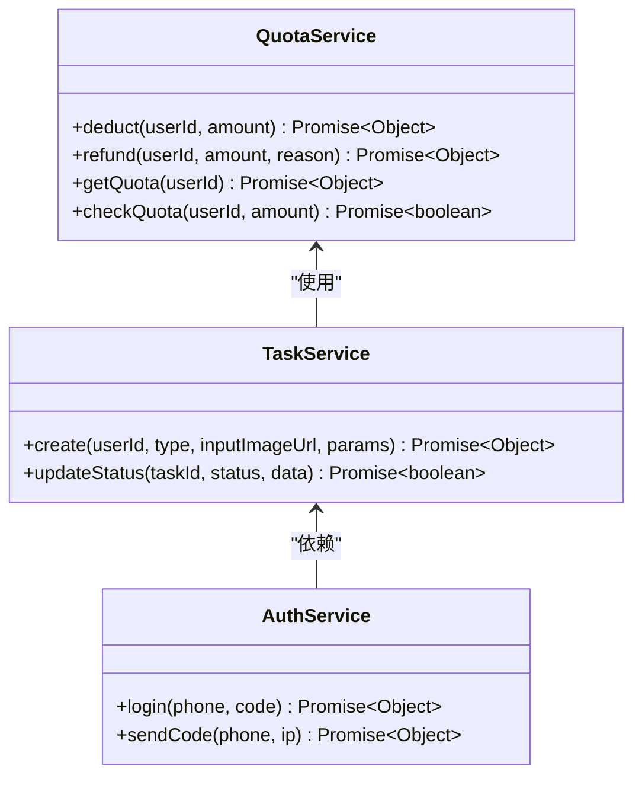
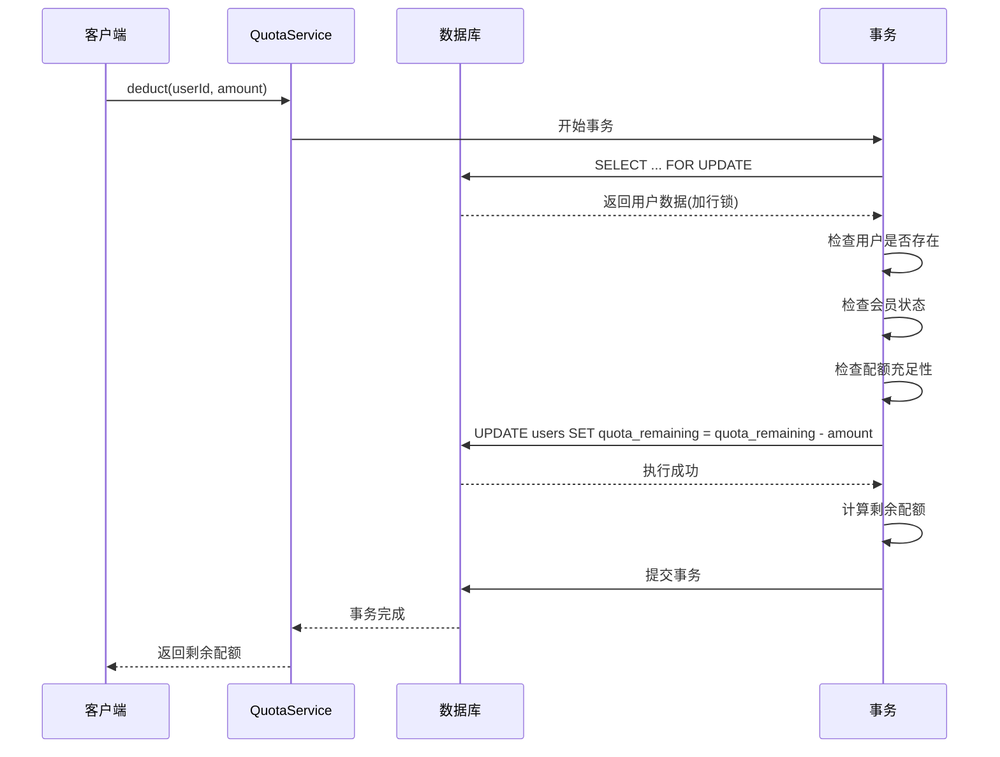
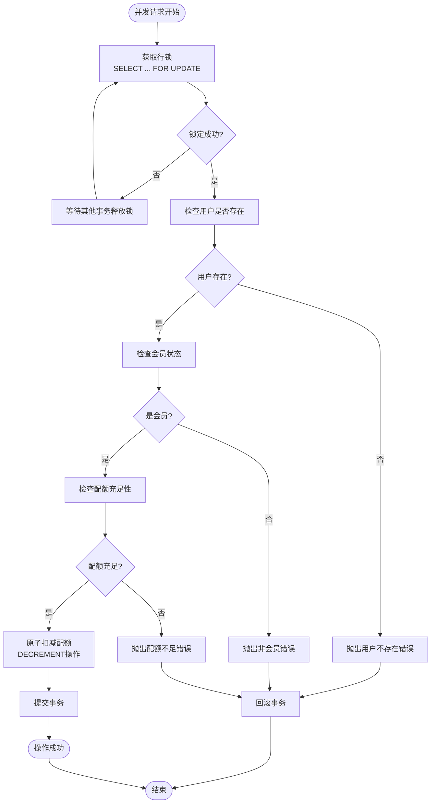
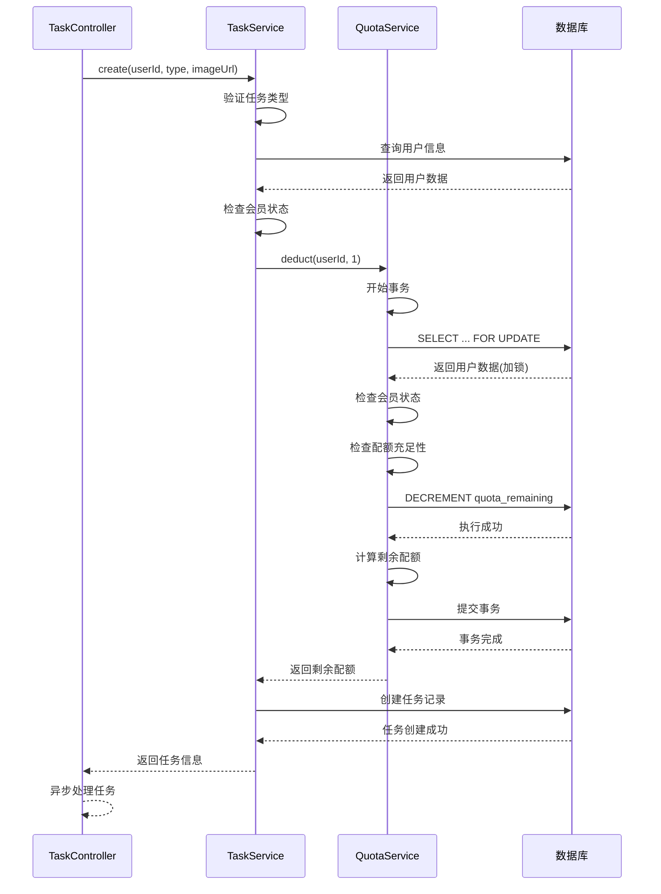
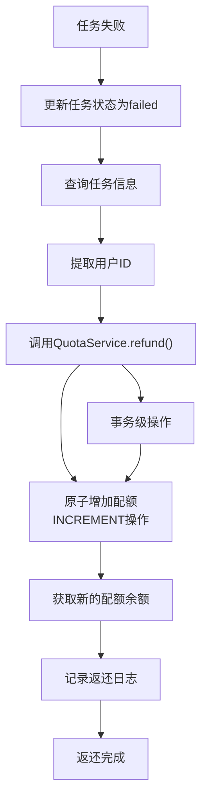
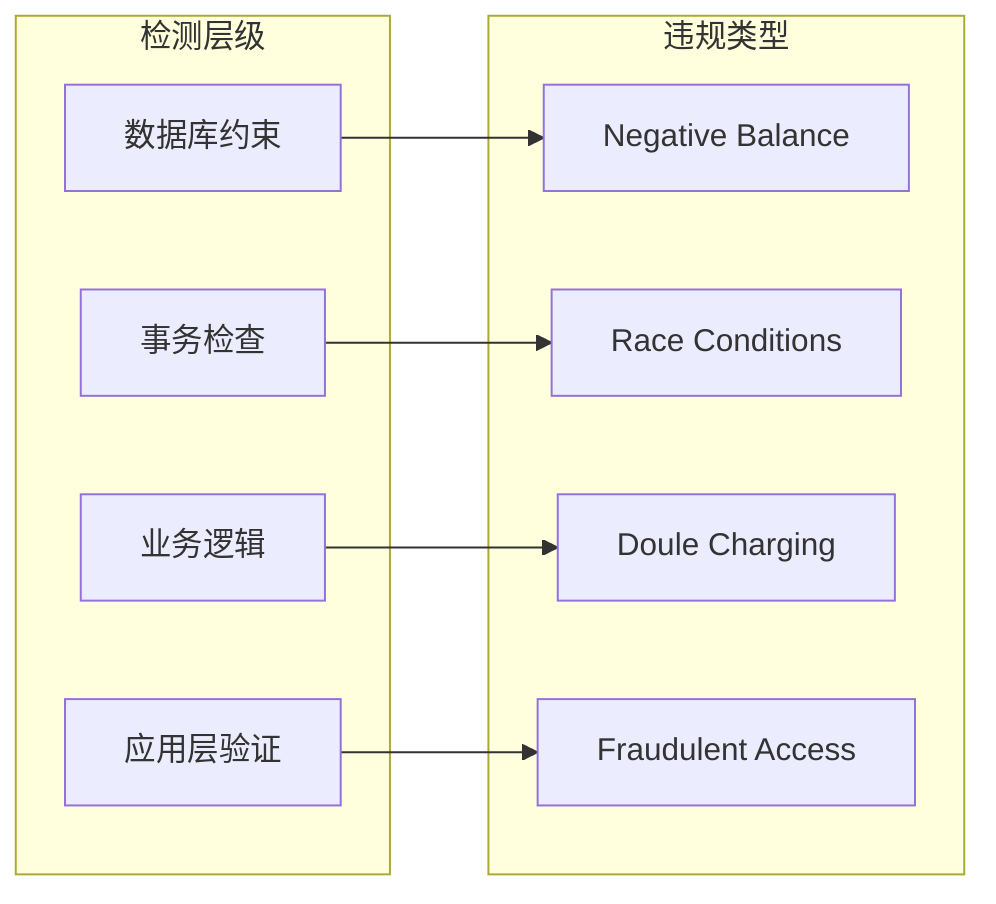

# 配额操作一致性保障

<cite>
**本文档引用的文件**
- [quota.service.js](file://backend/src/services/quota.service.js)
- [task.service.js](file://backend/src/services/task.service.js)
- [auth.service.js](file://backend/src/services/auth.service.js)
- [task.controller.js](file://backend/src/controllers/task.controller.js)
- [database.js](file://backend/src/config/database.js)
- [20251028000001_create_users_table.js](file://backend/src/db/migrations/20251028000001_create_users_table.js)
</cite>

## 目录
1. [引言](#引言)
2. [系统架构概览](#系统架构概览)
3. [核心组件分析](#核心组件分析)
4. [事务安全机制](#事务安全机制)
5. [并发控制策略](#并发控制策略)
6. [配额检查与扣减流程](#配额检查与扣减流程)
7. [任务失败返还机制](#任务失败返还机制)
8. [NON-NEGATIVE GUARANTEE设计约束](#non-negative-guarantee设计约束)
9. [性能考虑](#性能考虑)
10. [故障排除指南](#故障排除指南)
11. [总结](#总结)

## 引言

本文档深入分析了服装AI处理SaaS平台中的配额扣减事务安全与并发控制机制。该系统采用严格的事务级操作和行锁机制，确保配额管理的一致性和安全性，防止高并发场景下的超扣问题。

系统的核心设计理念是"NON-NEGATIVE GUARANTEE"（非负保证），即确保用户的配额余额永远不会变为负数。这一约束通过数据库事务、行锁和严格的业务逻辑检查来实现。

## 系统架构概览

**图表来源**
- [task.controller.js](file://backend/src/controllers/task.controller.js#L1-L173)
- [task.service.js](file://backend/src/services/task.service.js#L1-L259)
- [quota.service.js](file://backend/src/services/quota.service.js#L1-L130)

**章节来源**
- [task.controller.js](file://backend/src/controllers/task.controller.js#L1-L173)
- [task.service.js](file://backend/src/services/task.service.js#L1-L259)
- [quota.service.js](file://backend/src/services/quota.service.js#L1-L130)

## 核心组件分析

### QuotaService - 配额管理服务

QuotaService是整个配额管理系统的核心组件，负责处理配额的扣减、返还和查询操作。

**图表来源**
- [quota.service.js](file://backend/src/services/quota.service.js#L8-L130)
- [task.service.js](file://backend/src/services/task.service.js#L8-L259)
- [auth.service.js](file://backend/src/services/auth.service.js#L8-L220)

### 数据模型设计

系统使用简洁而高效的数据模型来支持配额管理：

| 字段名 | 类型 | 默认值 | 约束 | 说明 |
|--------|------|--------|------|------|
| id | string(32) | - | PRIMARY KEY | 用户唯一标识符 |
| phone | string(11) | - | UNIQUE, NOT NULL | 手机号码 |
| isMember | boolean | false | - | 是否为会员 |
| quota_remaining | integer | 0 | UNSIGNED | 剩余配额数量 |
| quota_expireAt | datetime | null | - | 配额到期时间 |
| created_at | datetime | CURRENT_TIMESTAMP | - | 创建时间 |
| updated_at | datetime | CURRENT_TIMESTAMP | - | 更新时间 |

**章节来源**
- [20251028000001_create_users_table.js](file://backend/src/db/migrations/20251028000001_create_users_table.js#L4-L14)

## 事务安全机制

### Knex事务的使用

QuotaService的deduct方法采用了严格的事务级操作来确保数据一致性：

**图表来源**
- [quota.service.js](file://backend/src/services/quota.service.js#L15-L55)

### 关键安全特性

1. **事务隔离级别**：使用数据库事务确保操作的原子性
2. **行级锁定**：通过`.forUpdate()`实现行锁，防止并发竞争
3. **顺序检查**：严格按照用户查询、状态检查、配额验证、原子扣减的顺序执行
4. **异常回滚**：任何步骤失败都会触发事务回滚

**章节来源**
- [quota.service.js](file://backend/src/services/quota.service.js#L15-L55)

## 并发控制策略

### 行锁机制

系统通过`SELECT ... FOR UPDATE`语句实现行级锁定，这是防止并发超扣的关键技术：

**图表来源**
- [quota.service.js](file://backend/src/services/quota.service.js#L15-L55)

### 并发安全保障

1. **第一层保护**：数据库行锁防止同一用户同时操作
2. **第二层保护**：事务确保操作的原子性
3. **第三层保护**：严格的业务逻辑检查
4. **第四层保护**：异常处理和日志记录

**章节来源**
- [quota.service.js](file://backend/src/services/quota.service.js#L20-L25)

## 配额检查与扣减流程

### 完整的扣减流程

TaskService在创建任务时会调用QuotaService的deduct方法，形成完整的配额管理流程：

**图表来源**
- [task.service.js](file://backend/src/services/task.service.js#L15-L50)
- [quota.service.js](file://backend/src/services/quota.service.js#L15-L55)

### 业务逻辑验证

系统在每个关键步骤都进行严格的业务逻辑验证：

1. **任务类型验证**：确保只接受有效的任务类型
2. **用户存在性验证**：确认用户账户的有效性
3. **会员状态验证**：确保用户具有相应的会员权限
4. **配额充足性验证**：确认用户有足够的配额进行操作

**章节来源**
- [task.service.js](file://backend/src/services/task.service.js#L15-L50)

## 任务失败返还机制

### 自动返还机制

当任务失败时，系统会自动调用QuotaService的refund方法返还配额：

**图表来源**
- [task.service.js](file://backend/src/services/task.service.js#L130-L145)

### 返还机制特点

1. **自动触发**：任务失败时自动触发返还机制
2. **幂等性保证**：确保同一任务不会被多次返还
3. **事务安全**：返还操作同样使用事务确保一致性
4. **详细日志**：记录返还原因和详细信息

**章节来源**
- [task.service.js](file://backend/src/services/task.service.js#L130-L145)
- [quota.service.js](file://backend/src/services/quota.service.js#L58-L75)

## NON-NEGATIVE GUARANTEE设计约束

### 核心约束定义

"NON-NEGATIVE GUARANTEE"是系统最重要的设计约束，确保配额余额永远不会为负数：

| 约束类型 | 实现方式 | 保证级别 |
|----------|----------|----------|
| 事务级操作 | BEGIN ... COMMIT | 数据库级别 |
| 行级锁定 | SELECT ... FOR UPDATE | 并发级别 |
| 业务检查 | 多层次验证 | 逻辑级别 |
| 异常处理 | 自动回滚 | 容错级别 |

### 违规检测机制

系统通过多个层面检测和防止违规操作：

**章节来源**
- [quota.service.js](file://backend/src/services/quota.service.js#L8-L10)

## 性能考虑

### 优化策略

1. **索引优化**：在phone字段上建立索引，加速用户查询
2. **连接池管理**：合理配置数据库连接池大小
3. **缓存策略**：对于频繁查询的用户信息考虑适当缓存
4. **批量操作**：对于大量并发请求考虑批量处理

### 性能监控指标

- 事务平均执行时间
- 行锁等待时间
- 并发请求成功率
- 数据库连接使用率

## 故障排除指南

### 常见问题及解决方案

| 问题类型 | 症状 | 可能原因 | 解决方案 |
|----------|------|----------|----------|
| 超时错误 | 事务执行超时 | 行锁等待时间过长 | 优化查询条件，减少事务持续时间 |
| 并发冲突 | 频繁的锁等待 | 高并发场景 | 考虑引入Redis分布式锁作为补充 |
| 配额异常 | 配额显示不一致 | 缓存同步问题 | 实现强一致性读取 |
| 事务失败 | 配额扣减失败 | 数据库连接问题 | 增加重试机制和健康检查 |

### 监控和告警

1. **事务监控**：监控事务执行时间和成功率
2. **锁监控**：监控行锁等待时间和死锁发生率
3. **性能监控**：监控配额操作的响应时间
4. **异常监控**：监控事务回滚和错误发生率

**章节来源**
- [quota.service.js](file://backend/src/services/quota.service.js#L50-L55)

## 总结

本文档详细分析了服装AI处理SaaS平台的配额操作一致性保障机制。系统通过以下关键技术确保配额管理的安全性和可靠性：

1. **事务级操作**：使用Knex事务确保操作的原子性
2. **行级锁定**：通过`SELECT ... FOR UPDATE`防止并发竞争
3. **多层次验证**：用户存在性、会员状态、配额充足性的严格检查
4. **自动返还机制**：任务失败时自动返还配额
5. **NON-NEGATIVE GUARANTEE**：确保配额余额永不为负

这套机制有效地防止了高并发场景下的超扣问题，保证了系统的财务安全和用户体验。同时，完善的日志记录和异常处理机制为系统的可维护性和审计提供了有力支持。